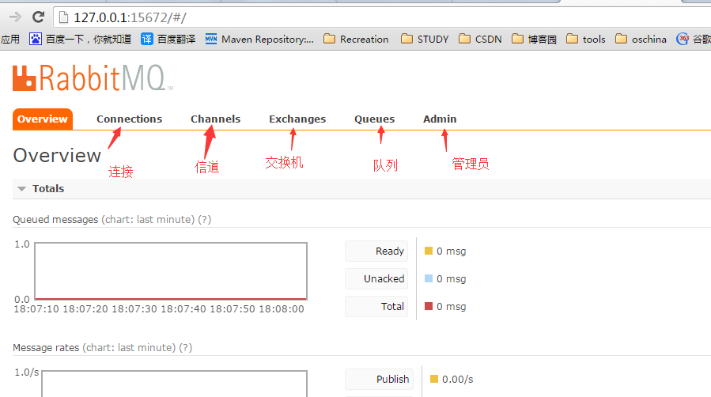
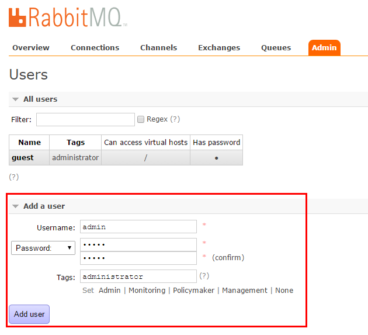
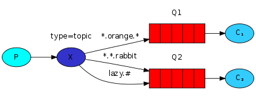

# RabbitMQ简介

[RabbitMQ中文文档](https://rabbitmq.mr-ping.com/tutorials_with_csharp/HelloWorld.html)

消峰填谷：多人同时请求，存入mq中，系统根据最大处理请求拉取数据

应用解耦：降低耦合度，用户的请求会被放入mq中，当其他系统发生故障时，不会影响其他系统，导致不必要的损失

异步提速：正常情况下每次请求都要等所有的业务（系统）完成时，才会响应结果；使用mq后，将请求存入到mq后，系统会直接返回，后台的系统可以自己慢慢处理业务，用户不需要等待

缺点：mq宕机，导致其他系统也无法使用


点对点

发布订阅


交换机--》通过路由--》队列

## 启用管理工具

第一步：点击打开RabbitMQ的命令窗口。RabbitMQ Command Prompt (sbin dir)

第二步：输入命令rabbitmq-plugins enable rabbitmq_management

这个命令的意思是安装RabbitMQ的插件。

第三步：测试是否安装成功。

方法：访问地址：http://127.0.0.1:15672/

默认账号：guest/guest

## 客户端的简单介绍

1、界面的介绍



 

注意设置虚拟主机与添加用户这块。



关于虚拟主机，Virtual Host，其实是一个虚拟概念，类似于权限控制组，一个Virtual Host里面可以有若干个Exchange和Queue，但是权限控制的最小粒度是Virtual Host

用户角色有下面几种：

1.超级管理员(administrator)

​	可登陆管理控制台，可查看所有的信息，并且可以对用户，策略(policy)进行操作。

2.监控者(monitoring)

​	可登陆管理控制台，同时可以查看rabbitmq节点的相关信息(进程数，内存使用情况，磁盘使用情况等)

3.策略制定者(policymaker)

​	可登陆管理控制台, 同时可以对policy进行管理。但无法查看节点的相关信息(上图红框标识的部分)。

4.普通管理者(management)

​	仅可登陆管理控制台，无法看到节点信息，也无法对策略进行管理。

5.其他

​	无法登陆管理控制台，通常就是普通的生产者和消费者。


# hello word模式

## 示例

### producer

生产者

~~~C#
using System;
using RabbitMQ.Client;
using System.Text;

namespace Send
{
    class Program
    {
        static void Main(string[] args)
        {
            var factory = new ConnectionFactory() { HostName = "localhost" };

            // 建立连接
            using var connection = factory.CreateConnection();
            // 创建通信
            using var channel = connection.CreateModel();

            /*
             * 创建队列
             * queue：队列名称
             * durable：是否持久化
             * exclusive：是否队列私有化；false表示所有消费者都可以使用，true表示只有第一个消费者可以使用
             * autoDelete：是否自动删除
             * arguments：其他额外参数为null
             */
            channel.QueueDeclare(queue:"test",durable:true,exclusive:false,autoDelete:false,arguments:null);

            string message = "hello word";

            // 将发送的消息转换为二进制
            byte[] body = Encoding.UTF8.GetBytes(message);

            /*
             * exchange：交换机，暂时用不到，在发布订阅时才会用到
             * routingKey：路由Key （如果没有队列的话，这个就是队列名称）
             * basicProperties：额外的设置属性
             * body：要传递的二进制消息
             */
            channel.BasicPublish(exchange:"",routingKey:"test",basicProperties:null,body:body);

            Console.WriteLine($"消息：{message}已发送");

            Console.ReadLine();
        }
    }
}
~~~

### consumer

消费者

~~~c#
using System;
using RabbitMQ.Client;
using RabbitMQ.Client.Events;
using System.Text;

namespace Receive
{
    class Program
    {
        static void Main(string[] args)
        {

            var factory = new ConnectionFactory();
            factory.HostName = "localhost";

            // 建立连接
            using var connextion = factory.CreateConnection();
            // 建立通信
            using var channel = connextion.CreateModel();

            /*
            * 创建队列
            * queue：队列名称
            * durable：是否持久化
            * exclusive：是否队列私有化；false表示所有消费者都可以使用，true表示只有第一个消费者可以使用
            * autoDelete：是否自动删除
            * arguments：其他额外参数为null
            */
            channel.QueueDeclare(queue:"test",durable:true,exclusive:false,autoDelete:false,arguments:null);

            var consumer = new EventingBasicConsumer(channel);
            // 触发事件，回调方法接受队列中的消息
            consumer.Received += (model, ea) => {
                // 接收消息
                byte[] body = ea.Body;
                string message = Encoding.UTF8.GetString(body);

                channel.BasicAck(ea.DeliveryTag,false);

                Console.WriteLine($"消息：{message}已被接受");
            };

            /*
             * queue：队列的名称
             * autoAck：是否自动确认
             * consumer：继承IBasicConsumer接口的实例对象（触发事件）
             */
            channel.BasicConsume(queue:"test",autoAck:false,consumer:consumer);

            Console.WriteLine(" Press [enter] to exit.");
            Console.ReadLine();

        }
    }
}
~~~


# word queues 工作队列模式

> 和hello word模式相似，不同的是，消费者从一个变为多个，这些消费者在默认情况下会有顺序的进行消费；这样会导致消费能力强的消费者要等待消费能力弱的消费者，就会造成资源浪费；这个问题可以通过配置解决

## 消息确认

执行一个任务可能会耗时好几秒钟。你也许会好奇如果一个消费者在执行一个耗时任务时只完成了部分工作就挂掉的情况下会发生什么。在我们当前代码下，一旦RabbitMQ将消息投送给消费者后，它会立即将消息标示为删除状态。这个案例中，如果你将工作者杀掉的话，我们会丢失它正在处理的消息。如果有其他已经调度给这个工作者的消息没有完成，也会一起丢失。

但是我们不想丢失任何任务。如果一个工作者挂掉了，我们希望任务会投送给其他的工作者。

为了确保消息永不丢失，RabbitMQ支持 [消息 *确认*](http://www.rabbitmq.com/confirms.html)。消费者回送一个确认信号——ack(nowledgement)给RabbitMQ，告诉它一条指定的消息已经接收到并且处理完毕，可以选择将消息删除掉了。

如果一个消费者在没有回送确认信号的情况下挂掉了（消费者的信道关闭，连接关闭或者TCP连接已经丢失），RabbitMQ会理解为此条消息没有被处理完成，并且重新将其放入队列。如果恰时有其他消费者在线，这条消息会立即被投送给其他的消费者。通过这种方式，你可以确定即使有工作者由于事故挂掉，也不会发生消息丢失的情况。

RabbitMQ不会有任何消息超时的机制，消费者挂掉之后RabbitMQ才会将此消息投送给其他消费者。所以即使消息处理需要话费超长的是时间也没有问题。

[手动进行消息确认](http://www.rabbitmq.com/confirms.html) 默认为开启状态。上个例子中，我们明确地通过将autoAck ("自动确认模式")设置为true将其关闭掉了。这次我们移除掉这个标志，一旦任务完成，手动从工作者当中发送合适的确认标志。

```csharp
var consumer = new EventingBasicConsumer(channel);
consumer.Received += (model, ea) =>
{
    var body = ea.Body;
    var message = Encoding.UTF8.GetString(body);
    Console.WriteLine(" [x] Received {0}", message);

    int dots = message.Split('.').Length - 1;
    Thread.Sleep(dots * 1000);

    Console.WriteLine(" [x] Done");
    
	// 确认一条或多条已传递的消息
    channel.BasicAck(deliveryTag: ea.DeliveryTag, multiple: false);// 进行消息确认
};
// 将autoAck设置为false
channel.BasicConsume(queue: "task_queue", autoAck: false, consumer: consumer);
```

使用本代码，即使你在它运行时使用 CTRL+C杀掉工作者，也不会有任何东西丢失。稍后，挂掉的工作者当中未进行确认的消息会被重新投送。

确认信号必须在收到投送的同一个信道上发送。尝试在不同的信道上发送确认信号会引发信道级别的协议异常。 [确认行为的文档指南](http://www.rabbitmq.com/confirms.html) 里有更多介绍。

> #### 忘记进行确认
>
> 忘记使用`BasicAck`是一个常见的错误。虽然是个简单的错误，但是后果严重。消息会在客户端退出后重新投送（就像是随机进行的重新投送），但是由于RabbitMQ无法释放任何未经确认的消息，内存占用会越来越严重。
>
> 想要对这种错误进行调试，你可以使用`rabbitmqctl`将“未经确认的消息”（`messages_unacknowledged`）字段打印出来
>
> ```bash
> sudo rabbitmqctl list_queues name messages_ready messages_unacknowledged
> ```
>
> 在Windows中，不需要sudo:
>
> ```bash
> rabbitmqctl.bat list_queues name messages_ready messages_unacknowledged
> ```

## 消息持久化

我们已经学过了如何让任务在消费者即使挂掉的情况也不会丢失。但我们的任务仍有可能在RabbitMQ服务器停机的时候丢失掉。

当RabbitMQ退出或崩溃的时候会忘记掉所有的队列，除非你告诉他不要这么做。如果想要确保消息不会丢失，我们需要做两件事，将队列和消息都标示成持久化。

首先，我们需要确保RabbitMQ永远不会将队列丢失。为了达到此目的，我们需要使用*`durable`*来将其持久化。

```csharp
channel.QueueDeclare(queue: "hello",
                     durable: true,
                     exclusive: false,
                     autoDelete: false,
                     arguments: null);
```

虽然这个命令本身是正确的，但是它在我们当前的配置中并不起作用。原因是我们已经定义了一个名为`hello`的非持久化队列。RabbitMQ不允许用不同的参数去重新定义一个已经存在的队列，如果有程序尝试这样做的话，会收到一个错误的返回值。 但是有一个快捷的解决方案——我们可以定义一个不重名的队列，例如`task_queue`:

```csharp
channel.QueueDeclare(queue: "task_queue",
                     durable: true,
                     exclusive: false,
                     autoDelete: false,
                     arguments: null);
```

此`QueueDeclare`的改变需要应用到生产者和消费者两份代码当中。

当下，我们可以确认即使RabbitMQ重启，我们的`task_queue`队列也不会丢失。接下来，我们需要将`IBasicProperties.SetPersistent`设置为`true`，用来将我们的消息标示成持久化的。

```csharp
var properties = channel.CreateBasicProperties();
properties.Persistent = true;
```

> #### 消息持久化的注释
>
> 将消息标示为持久化并不能完全保证消息不会丢失。尽管它会告诉RabbitMQ将消息存储到硬盘上，但是在RabbitMQ接收到消息并将其进行存储两个行为之间仍旧会有一个窗口期。同样的，RabbitMQ也不会对每一条消息执行`fsync(2)`，所以消息获取只是存到了缓存之中，而不是硬盘上。虽然持久化的保证不强，但是应对我们简单的任务队列已经足够了。如果你需要更强的保证，可以使用[publisher confirms](https://www.rabbitmq.com/confirms.html).


## 循环调度

当有多个消费者时，默认情况下，RabbitMQ会将消息依次发送给下一个消费者。平均每个消费者会获得同样数量的消息。这种消息分发方法被称为循环法（round-robin）。

问题：这样会导致消费能力强的消费者要等待消费能力弱的消费者，就会造成资源浪费

解决方法：公平调度

## 公平调度

你可能注意到了，调度依照我们希望的方式运行。例如在有两个工作者的情况下，当所有的奇数任务都很繁重而所有的偶数任务都很轻松的时候，其中一个工作者会一直处于忙碌之中而另一个几乎无事可做。RabbitMQ并不会对此有任何察觉，仍旧会平均分配消息。

这种情况发生的原因是由于当有消息进入队列时，RabbitMQ只负责将消息调度的工作，而不会检查某个消费者有多少未经确认的消息。它只是盲目的将第n个消息发送给第n个消费者而已。


要改变这种行为的话，我们可以在`BasicQos`方法中设置`prefetchCount = 1`。这样会告诉RabbitMQ一次不要给同一个worker提供多于一条的信息。话句话说，在一个工作者还没有处理完消息，并且返回确认标志之前，不要再给它调度新的消息。取而代之，它会将消息调度给下一个不再繁忙的工作者。

```csharp
channel.BasicQos(0, 1, false);
```

> 如果所有的消费者都很忙，你的队列就会排满。你会想关注这一点，可以增加新的消费者，或者采取其他策略。

## 示例：

### Producer

生产者

~~~C#
using RabbitMQ.Client;
using System;
using System.Text;

namespace Producer
{
    class Program
    {
        static void Main(string[] args)
        {
            var factory = new ConnectionFactory();

            factory.HostName = "localhost";

            // 打开连接
            using var connection = factory.CreateConnection();
            // 建立通信 
            using var channel = connection.CreateModel();

            // 找到队列
            channel.QueueDeclare(queue: "test", durable: true, exclusive: false, autoDelete: false, arguments: null);

            for (int i = 0; i < 1000; i++)
            {
                string message = $"向用{i}发送短信";
                byte[] body = Encoding.UTF8.GetBytes(message);
                // 发送消息
                channel.BasicPublish(exchange: "", routingKey: "test", basicProperties: null, body: body);

                Console.WriteLine(message);
            }

            Console.WriteLine("消息发送完成");
            Console.ReadLine();
        }
    }
}

~~~

### Consumer

消费者_1

~~~C#
using System;
using RabbitMQ.Client;
using RabbitMQ.Client.Events;
using System.Text;

namespace Consumer1
{
    class Program
    {
        static void Main(string[] args)
        {
            var factory = new ConnectionFactory();
            factory.HostName = "localhost";

            // 创建连接
            using var connection = factory.CreateConnection();
            // 创建通道
            using var channel = connection.CreateModel();


            // 找到队列
            channel.QueueDeclare(queue: "test", durable: true, exclusive: false, autoDelete: false, arguments: null);


            // 创建触发事件
            var consumer = new EventingBasicConsumer(channel);
            // 回调函数
            consumer.Received += (model, ea) =>
            {
                // 拿到消息
                byte[] body = ea.Body;
                string message = Encoding.UTF8.GetString(body);

                // 确认一条或多条已传递的消息
                channel.BasicAck(deliveryTag:ea.DeliveryTag,multiple:false);

                Console.WriteLine(message);
            };

            // 公平调度，消费能力强的多消费
            channel.BasicQos(prefetchSize:0,prefetchCount:1,global:false);// 每次获取一条消息，处理完成后再去获取新的消息

            channel.BasicConsume(queue:"test",autoAck:false,consumer);

            Console.WriteLine("接受message");
            Console.ReadLine();
        }
    }
}
~~~

消费者_2

~~~c#
using RabbitMQ.Client;
using System;
using System.Text;
using RabbitMQ.Client.Events;
using System.Threading;

namespace Consumer2
{
    class Program
    {
        static void Main(string[] args)
        {
            var factory = new ConnectionFactory();
            factory.HostName = "localhost";

            // 建立连接
            using var connection = factory.CreateConnection();
            // 打开通信“管道”
            using var channel = connection.CreateModel();

            // 找到queue
            channel.QueueDeclare(queue:"test",durable:true,exclusive:false,autoDelete:false,arguments:null);

            // 声明触发事件
            var consumer = new EventingBasicConsumer(channel);
            // 添加回调函数
            consumer.Received += (model, ea) => {
                // 阻塞(模仿耗时处理)
                Thread.Sleep(300);

                // 接受消息
                byte[] body = ea.Body;
                string message = Encoding.UTF8.GetString(body);

                // 确认一条或多条消息
                channel.BasicAck(deliveryTag:ea.DeliveryTag,multiple:false);

                Console.WriteLine(message);
            };

            // 公平调度，消费能力强的多消费 
            channel.BasicQos(prefetchSize: 0, prefetchCount: 1, global: false);// 每次获取一条消息，处理完成后再去获取新的消息

            channel.BasicConsume(queue:"test",autoAck:false,consumer:consumer);
            Console.WriteLine("接受message");
            Console.ReadLine();

        }
    }
}

~~~

# 交换机

> 交换机（X），一方面，接受生产者发送的消息。另一方面，知道如何处理消息，例如递交给某个特别队列、递交给所有队列、或是将消息丢失。如何操作，取决于Exchange的类型。Exchange有常见的以下3种类型：
>
> - Fanout：广播，将消息交给所有绑定到交换机的队列
> - Direct：定向，把消息交给符合指定routing key 的队列
> - Topic：通配符，把消息交给 routing pattern（路由模式）的队列

教程的上个部分里，我们通过一个队列来发送和接收消息。现在，是时候把完整的Rabbit消息模型模型介绍一下了。

让我们快速过一下上个教程中所涉及的内容。

- 一个“生产者”就是一个发送消息的用户应用程序。
- 一个“队列”就是存储消息的缓存。
- 一个“消费者”就是一个接收消息的用户应用程序。

RabbitMQ的消息模型中的核心思想就是生产者永远不会将任何消息直接发送给队列。实际上，通常情况下，生产者根本不知道它是否会将消息投送给任何一个队列。

真正的情况是，生产者只能将消息发送给一个*交换机*。交换机是个很简单概念。它做左手收生产者发送的消息，右手就将消息推送给队列。交换机必须明确的知道需要对接收到的消息做些什么。消息是需要追加到一个特定的队列中？是需要追加到多个队列中？还是需要被丢弃掉。*交换机类型(exchange type)*就是用来定义这种规则的。


这里有几个可用的交换机类型：直连交换机(`direct`), 主题交换机(`topic`), 头交换机(`headers`) 和扇形交换机(`fanout`)。我们会把关注点放在最后一个上。让我们来创建一个此种类型的交换机，将其命名为`logs`：

```csharp
channel.ExchangeDeclare("logs", "fanout");
```

扇形交换机非常简单。从名字就可猜出来，它只是负责将消息广播给所有它所知道的队列。这正是我们的日志系统所需要的。

> #### 交换机的监听
>
> 想要列出服务器上的交换机，可以运行`rabbitmqctl`这个非常有用的程序：
>
> ```bash
> sudo rabbitmqctl list_exchanges
> ```
>
> 在此列表中，会出现一些类似于`amq.*`的交换机以及默认（未命名）交换机。这些交换机是以默认方式创建的，但此刻并不需要用到它们。
>
> #### 默认交换机
>
> 教程的上一部分中，我们对交换机还一无所知，但是依然能将消息发送给队列。原因是我们使用了用空字符串(`""`)来标示的默认交换机。
>
> 回想一下之前我们是如何来发布消息的：
>
> ```csharp
>  var message = GetMessage(args);
>  var body = Encoding.UTF8.GetBytes(message);
>  channel.BasicPublish(exchange: "",
>                       routingKey: "hello",
>                       basicProperties: null,
>                       body: body);
> ```
>
> 第一个参数就是交换机的名字。空字符串用来表示默认或者*无名*交换机：如果队列存在的话，消息会依据路由键（`routingKey`）所指定的名称路由到队列中。

现在我们可以对命名过的交换机执行发布操作了：

```csharp
var message = GetMessage(args);
var body = Encoding.UTF8.GetBytes(message);
channel.BasicPublish(exchange: "logs",
                     routingKey: "",
                     basicProperties: null,
                     body: body);
```

## 

# Publish/Subscribe 发布/订阅模式

> 发布者的消息不会像之前那样直接将消息交给队列（Queue），而是交给交换机，由交换机发送给指定队列。
>
> 发布/订阅模式可以将消息同时发送给多个消费者（广播），这种模式下，会广播给所有的消费者

## 临时队列

> 临时队列：一个临时的队列，当我没有指定队列名称时，他会创建一个临时的队列，当消费者断开连接，队列需要被自动删除。

在.NET客户端中，当我们不给`QueueDeclare()`提供参数的情况下，就可以创建一个非持久化、独享的、可自动删除的拥有生成名称的队列。

```csharp
var queueName = channel.QueueDeclare().QueueName;
```

你可以在[guide on queues](https://www.rabbitmq.com/queues.html)中学习到更多关于独享（`exclusive`）标识以及其他队列属性的相关信息。

此时，`queueName`包含的是一个随机的队列名称。看起来可能会类似于`amq.gen-JzTY20BRgKO-HjmUJj0wLg`这样。

## 绑定


我们已经创建了一个扇形交换机和一个队列。现在我们需要通知交换机将消息发送给我们的队列。交换机和队列之间的这种关系称为*绑定(`binding`)*。

```csharp
channel.QueueBind(queue: queueName,
                  exchange: "logs",
                  routingKey: "");
```

现在开始，`logs`交换机会将消息追加到我们的队列当中。

> #### 绑定的监听
>
> 你可以通过以下命令列出所有正在使用的绑定，
>
> ```bash
> rabbitmqctl list_bindings
> ```

## 示例

Producer

生产者

~~~C#
using System;
using System.Text;
using RabbitMQ.Client;

namespace Producer
{
    /// <summary>
    /// 生产者
    /// </summary>
    class Program
    {
        static void Main(string[] args)
        {
            var factory = new ConnectionFactory();
            factory.HostName = "localhost";

            // 建立连接
            using var connection = factory.CreateConnection();
            // 建立通道
            using var channel = connection.CreateModel();

            string message = "深圳20~26℃";
            byte[] body = Encoding.UTF8.GetBytes(message);
            // 声明交换机
            channel.ExchangeDeclare(exchange:"test",type:"fanout",durable:true,autoDelete:false,arguments:null);

            // 发送消息
            channel.BasicPublish(exchange: "test", routingKey:"",body:body);
            Console.WriteLine("Send Message："+message);

            Console.ReadLine();
        }
    }
}

~~~

Consumer

消费者_1

~~~C#
using System;
using System.Text;
using RabbitMQ.Client;
using RabbitMQ.Client.Events;

namespace Consumer1
{
    /// <summary>
    /// 消费者
    /// </summary>
    class Program
    {
        static void Main(string[] args)
        {
            var factory = new ConnectionFactory();
            factory.HostName = "localhost";

            // 建立连接
            using var connection = factory.CreateConnection();
            // 建立通信
            using var channel = connection.CreateModel();

            // 创建一个临时队列，接受虚拟机的消息
            var queueName = channel.QueueDeclare().QueueName;// 拿到临时队列的名称

            // 声明fanout 类型的交换机
            channel.ExchangeDeclare(exchange: "test", type: "fanout", durable: true, autoDelete: false, arguments: null);

            // 交换机绑定队列
            channel.QueueBind(queue:queueName,exchange:"test",routingKey:"");


            // 触发事件
            var consumer = new EventingBasicConsumer(channel);
            // 添加回调函数
            consumer.Received += (model, ea) =>
            {
                Console.WriteLine($"小米天气：{Encoding.UTF8.GetString(ea.Body)}");
                channel.BasicAck(deliveryTag: ea.DeliveryTag, multiple: false);// 进行消息确认
            };

            Console.WriteLine("准备接收消息");

            // 接受消息
            channel.BasicConsume(queue: queueName, autoAck:false,consumer:consumer);
            Console.ReadLine();
        }
    }
}
~~~

消费者_2

~~~C#
using System;
using System.Text;
using RabbitMQ.Client;
using RabbitMQ.Client.Events;

namespace Consumer2
{
    /// <summary>
    /// 消费者
    /// </summary>
    class Program
    {
        static void Main(string[] args)
        {
            var factory = new ConnectionFactory();
            factory.HostName = "localhost";

            // 建立连接
            using var connection = factory.CreateConnection();
            // 建立通信
            using var channel = connection.CreateModel();

            // 声明fanout类型交换机
            channel.ExchangeDeclare(exchange: "test", type:"fanout",durable:true,autoDelete:false,arguments:null);

            // 创建一个临时队列，接受虚拟机的消息
            var queueName = channel.QueueDeclare().QueueName;// 拿到临时队列的名称
            // 交换机绑定队列
            channel.QueueBind(queue:queueName,exchange:"test",routingKey:"");
            

            // 触发事件
            var consumer = new EventingBasicConsumer(channel);
            // 添加触发事件的回调方法
            consumer.Received += (model, ea) =>
            {
                Console.WriteLine($"百度天气：{Encoding.UTF8.GetString(ea.Body)}");
                channel.BasicAck(deliveryTag: ea.DeliveryTag, multiple: false);// 进行消息确认
            };

            Console.WriteLine("准备接收消息");

            // 接受消息
            channel.BasicConsume(queue: queueName, autoAck:false,consumer:consumer);
            Console.ReadLine();
        }
    }
}
~~~


# Routing 路由模式

> 和发布订阅相似；在创建队列时要指定routingKey 参数的值，这个值相当于表示，当发布者的routingKey 和和消费者的routingKey 匹配时，消费者才会获取该队列中的数据

## 绑定

上个例子中，我们已经创建了绑定。代码如下：

```csharp
channel.QueueBind(queue: queueName,
                  exchange: "logs",
                  routingKey: "");
```

一个绑定就是交换机和队列之间的一个关系。可以解读为：目标队列对此交换机的消息感兴趣。

绑定可以使用一个格外的`routingKey`参数。为了避免跟`BasicPublish`参数混淆，我们称其为绑定键(`binding key`)。以下是如何创建一个绑定键：

```csharp
channel.QueueBind(queue: queueName,
                  exchange: "direct_logs",
                  routingKey: "black");
```

绑定键的实际意义依赖于交换机的类型。对于我们之前使用的扇形交换机来说，会简单的将其值忽略掉。

## 直连型交换机

上个教程中，我们的日志系统将所有的消息广播给所有的消费者。我们打算对其进行扩展以根据它们的严重性来进行过滤。例如，我们想要将日志写到磁盘上的脚本只接收关键性的错误，而不在警告信息和普通日志消息上浪费磁盘空间。

我们之前使用的扇形交换机不能提供足够的灵活性——它只能进行无意识的广播。

下面我们使用直连型交换机进行替代。直连型交换机背后的路由算法很简单——消息会传送给绑定键与消息的路由键完全匹配的那个队列。

为了说明这点，可以考虑如下设置：


这种配置下，我们可以看到有两个队列绑定到了直连交换机`X`上。第一个队列用的是橘色（`orange`）绑定键，第二个有两个绑定键，其中一个绑定键是黑色（`black`），另一个绑定键是绿色（`green`）。

在此设置中，发布到交换机的带有橘色（`orange`）路由键的消息会被路由给队列`Q1`。带有黑色（`black`）或绿色（`green`）路由键的消息会被路由给`Q2`。其他的消息则会被丢弃。

## 多个绑定


使用相同的绑定键来绑定多个队列是完全合法的。在我们的例子中，我们可以使用黑色（`black`）绑定键来绑定`X`和`Q1`。那种情况下，直连型交换机的行为就会跟扇形交换机类似，会将消息广播给所有匹配的队列。一个拥有黑色(`black`)路由键的消息会被头送给`Q1`和`Q2`两个队列。

使用相同的绑定键来绑定多个队列是完全合法的。在我们的例子中，我们可以使用黑色（`black`）绑定键来绑定`X`和`Q1`。那种情况下，直连型交换机（`direct`）的行为就会跟扇形交换机（`fanout`）类似，会将消息广播给所有匹配的队列。一个拥有黑色(`black`)路由键的消息会被头送给`Q1`和`Q2`两个队列。

## 示例

### Producer

生产者

~~~C#
using System;
using System.Text;
using RabbitMQ.Client;
using System.Collections.Generic;

namespace Producer
{
    class Program
    {
        static void Main(string[] args)
        {
            // 创建数据
            Dictionary<string,string> data = new Dictionary<string ,string>();
            data.Add("China.henan.xy", "信阳：20~30℃");
            data.Add("China.henan.zz", "郑州：22~24℃");
            data.Add("China.henan.pds", "平顶山：10~16℃");
            data.Add("China.guangdong.dg", "东莞：23~26℃");
            data.Add("China.guangdong.sz", "深圳：23~25℃");
            data.Add("US.niuyue","美国纽约：35~50℃");

            var factory = new ConnectionFactory();
            factory.HostName = "localhost";

            // 建立连接
            using var connection = factory.CreateConnection();
            // 建立通信
            using var channel = connection.CreateModel();

            // 声明direct类型交换机
            channel.ExchangeDeclare(exchange: "testdirect", type:"direct",durable:true,autoDelete:false,arguments:null);

            foreach (var item in data)
            {
                // 发送消息
                channel.BasicPublish(exchange: "testdirect", routingKey: item.Key,basicProperties:null,Encoding.UTF8.GetBytes(item.Value));
                Console.WriteLine("发送消息到队列："+item.Value);
            }

            Console.WriteLine("结束");
            Console.ReadLine();
        }
    }
}
~~~

### Consumer

消费者_1

~~~C#
using System;
using System.Text;
using RabbitMQ.Client;
using RabbitMQ.Client.Events;

namespace Consumer1
{
    /// <summary>
    /// 河南天气
    /// </summary>
    class Program
    {
        static void Main(string[] args)
        {
            var factory = new ConnectionFactory();
            factory.HostName = "localhost";

            // 创建连接
            using var connection = factory.CreateConnection();
            // 建立通信
            using var channel = connection.CreateModel();

            // 声明direct类型的交换机
            channel.ExchangeDeclare(exchange: "testdirect", type:"direct",durable:true);
            // 创建临时队列 并绑定（QueueDeclare()会创建一个临时队列）
            string queueName = channel.QueueDeclare().QueueName;
            // test交换机绑定临时队列，通过设置routingKey参数，来匹配队列中的消息,但是每个路由只能匹配一个
            channel.QueueBind(queue: queueName, exchange: "testdirect", "China.henan.xy");
            channel.QueueBind(queue: queueName, exchange: "testdirect", "China.henan.zz");
            channel.QueueBind(queue: queueName, exchange: "testdirect", "China.henan.pds");

            // 创建消费者触发事件
            var consumer = new EventingBasicConsumer(channel);
            // 添加回调方法
            consumer.Received += (model, ea) =>
            {
                Console.WriteLine(Encoding.UTF8.GetString(ea.Body));
                channel.BasicAck(deliveryTag: ea.DeliveryTag, multiple: false);// 进行消息确认
            };

            // 发送消息
            channel.BasicConsume(queue:queueName,autoAck:false,consumer:consumer);

            Console.WriteLine("河南天气：");
            Console.ReadLine();
        }
    }
}
~~~

消费者_2

~~~C#
using System;
using System.Text;
using RabbitMQ.Client;
using RabbitMQ.Client.Events;

namespace Consumer2
{
    /// <summary>
    ///  广州天气
    /// </summary>
    class Program
    {
        static void Main(string[] args)
        {
            var factory = new ConnectionFactory();
            factory.HostName = "localhost";

            // 打开连接
            using var connection = factory.CreateConnection();
            // 建立通信
            using var channel = connection.CreateModel();

            // 声明direct类型交换机
            channel.ExchangeDeclare(exchange: "testdirect", type:"direct",durable:true);
            // 声明临时队列，并绑定（QueueDeclare()会创建一个临时队列）
            string queueName =  channel.QueueDeclare().QueueName;
            // test交换机绑定临时队列，通过设置routingKey参数，来匹配队列中的消息,但是每个路由只能匹配一个
            channel.QueueBind(queue: queueName, exchange: "testdirect", routingKey: "China.guangdong.sz");
            channel.QueueBind(queue: queueName, exchange: "testdirect", routingKey: "China.guangdong.dg");
            channel.QueueBind(queue: queueName, exchange: "testdirect", routingKey: "US.niuyue");

            // 创建消费者 事件
            var consumer = new EventingBasicConsumer(channel);
            // 添加触发事件
            consumer.Received += (model, ea) => {
                Console.WriteLine(Encoding.UTF8.GetString(ea.Body));
                channel.BasicAck(deliveryTag: ea.DeliveryTag, multiple: false);// 进行消息确认
            };

            // 接受消息
            channel.BasicConsume(queue:queueName,autoAck:false,consumer:consumer);

            Console.WriteLine("广东天气：");
            Console.ReadLine();

        }
    }
}
~~~


# Topics 通配符模式（主题交换机模式）

> Topics 模式和Routing 模式一样，不同的是，可以使用通配符匹配 routing key

发送到主题交换机的消息所携带的路由键（`routing_key`）不能随意命名——它必须是一个用点号分隔的词列表。当中的词可以是任何单词，不过一般都会指定一些跟消息有关的特征作为这些单词。列举几个有效的路由键的例子："`stock.usd.nyse`", "`nyse.vmw`", "`quick.orange.rabbit`"。只要不超过255个字节，词的长度由你来定。

绑定键（`binding key`）也得使用相同的格式。主题交换机背后的逻辑跟直连交换机比较相似——一条携带特定路由键（`routing key`）的消息会被投送给所有绑定键（`binding key`）与之相匹配的队列。尽管如此，仍然有两条与绑定键相关的特殊情况：

- `*` (星号) 能够替代一个单词。
- `#` (井号) 能够替代零个或多个单词。

用一个例子可以很容易地解释：



此例中，我们将会发送用来描述动物的多条消息。发送的消息包含带有三个单词（两个点号）的路由键（`routing key`）。路由键中第一个单词描述速度，第二个单词是颜色，第三个是品种： "`<速度>.<颜色>.<品种>`"。

我们创建三个绑定：Q1通过"`*.orange.*`"绑定键进行绑定，Q2使用"`*.*.rabbit`" 和 "`lazy.#`"。

这些绑定可以总结为：

- Q1针对所有的橘色`orange`动物。
- Q2针对每一个有关兔子`rabbits`和慵懒`lazy`的动物的消息。

一个带有"`quick.orange.rabbit`"绑定键的消息会给两个队列都进行投送。消息"`lazy.orange.elephant`"也会投送给这两个队列。另外一方面，"`quick.orange.fox`" 只会给第一个队列。"`lazy.pink.rabbit`"虽然与两个绑定键都匹配，但只会给第二个队列投送一遍。"`quick.brown.fox`" 没有匹配到任何绑定，因此会被丢弃掉。

如果我们破坏规则，发送的消息只带有一个或者四个单词，例如 "`orange`" 或者 "`quick.orange.male.rabbit`"会发生什么呢？结果是这些消息不会匹配到任何绑定，将会被丢弃。

另一方面，“`lazy.orange.male.rabbit`”即使有四个单词，也会与最后一个绑定匹配，并 被投送到第二个队列。

> #### 主题交换机
>
> 主题交换机非常强大，并且可以表现的跟其他交换机相似。
>
> 当一个队列使用"`#`"（井号）绑定键进行绑定。它会表现的像扇形交换机一样，不理会路由键，接收所有消息。
>
> 当绑定当中不包含任何一个 "*" (星号) 和 "#" (井号)特殊字符的时候，主题交换机会表现的跟直连交换机一毛一样。

## 示例

### Producer

生产者

~~~C#
using System;
using System.Collections.Generic;
using System.Text;
using RabbitMQ.Client;

namespace Producer
{
    class Program
    {
        static void Main(string[] args)
        {
            // 创建数据
            Dictionary<string, string> data = new Dictionary<string, string>();
            data.Add("China.henan.xy", "信阳：20~30℃");
            data.Add("China.henan.zz", "郑州：22~24℃");
            data.Add("China.henan.pds", "平顶山：10~16℃");
            data.Add("China.guangdong.dg", "东莞：23~26℃");
            data.Add("China.guangdong.sz", "深圳：23~25℃");
            data.Add("US.niuyue", "美国纽约：35~50℃");

            var factory = new ConnectionFactory();
            factory.HostName = "localhost";

            // 建立连接
            using var connection = factory.CreateConnection();
            // 建立通道
            using var channel = connection.CreateModel();

            // 声明topic类型交换机
            channel.ExchangeDeclare(exchange: "testtopic", type:"topic",durable:true);

            foreach (var item in data)
            {
                // 发送消息
                channel.BasicPublish(exchange: "testtopic", routingKey:item.Key,body:Encoding.UTF8.GetBytes(item.Value));
            }

            Console.WriteLine("已发送消息");
            Console.ReadLine();

        }
    }
}
~~~

### Consumer

消费者_1

~~~C#
using System;
using System.Text;
using RabbitMQ.Client;
using RabbitMQ.Client.Events;

namespace Consumer1
{
    class Program
    {
        static void Main(string[] args)
        {
            var factory = new ConnectionFactory();
            factory.HostName = "localhost";

            // 建立连接
            using var connection = factory.CreateConnection();
            // 建立通信
            using var channel = connection.CreateModel();

            // 声明topics类型的交换机
            channel.ExchangeDeclare(exchange: "testtopic", type:"topic",durable:true);
            // 声明临时队列 QueueDeclare()可以创建一个临时的队列
            string queueName = channel.QueueDeclare().QueueName;
            // 将临时队列和交换机绑定 
            channel.QueueBind(queue: queueName, exchange: "testtopic", routingKey: "China.*.*"); // routingKey通过通配符识别路由，*表示匹配一个单词，#表示匹配所有单词

            // 触发事件（消费者）
            var consumer = new EventingBasicConsumer(channel);
            // 添加回调函数，打印消息
            consumer.Received += (model, ea) => {
                Console.WriteLine(Encoding.UTF8.GetString(ea.Body));
                channel.BasicAck(deliveryTag: ea.DeliveryTag, multiple: false);// 进行消息确认
            };

            // 接受消息
            channel.BasicConsume(queue:queueName,autoAck:false,consumer:consumer);

            Console.WriteLine("中国地区的天气");
            Console.ReadLine();
        }
    }
}
~~~

消费者_2

~~~C#
using System;
using System.Text;
using RabbitMQ.Client;
using RabbitMQ.Client.Events;

namespace Consumer2
{
    class Program
    {
        static void Main(string[] args)
        {
            var factory = new ConnectionFactory();
            factory.HostName = "localhost";

            // 建立连接
            using var connection = factory.CreateConnection();
            // 建立通道
            using var channel = connection.CreateModel();

            // 声明topics类型交换机
            channel.ExchangeDeclare(exchange:"testtopic",type:"topic",durable:true);
            // 将临时队列和交换机绑定
            string queueName = channel.QueueDeclare().QueueName;
            channel.QueueBind(queue:queueName,exchange: "testtopic", routingKey:"US.#");// routingKey通过通配符识别路由，*表示匹配一个单词，#表示匹配所有单词

            // 触发事件（消费者）
            var consumer = new EventingBasicConsumer(channel);
            // 添加回调函数
            consumer.Received += (model, ea) => {
                Console.WriteLine(Encoding.UTF8.GetString(ea.Body));
                channel.BasicAck(deliveryTag: ea.DeliveryTag, multiple: false);// 进行消息确认
            };

            // 接受消息
            channel.BasicConsume(queue:queueName,autoAck:false,consumer:consumer);

            Console.WriteLine("美国天气：");
            Console.ReadLine();
        }
    }
}
~~~


# 延时队列

延时队列：就是设置过期时间，当在规定的时间内没有操作，视为操作失败；

案例：用户买东西，下单后没有按时支付

## TTL过期时间

- TTL设置过期时间，单位毫秒，
- 有两种方式，整个队列，单独消息  
- 如果没有设置ttl表示永远不会过期，设置为0时，除非此时可以直接投递消息到消费者，否则该消息会被丢弃掉

## 设置延时队列

在发送消息时，设置`"x-delay"` 属性，增加TTL过期时间（单位：毫秒），

~~~C#
// 发送消息
_rabbitProducer.Publish(exchange: "Order", routingKey: "",
                        props: new Dictionary<string, object> { // 添加属性
                            { "x-delay",1000*20} // 增加TTL过期时间，（当过期时间过后，消息任未被处理，则消息会成为死信）
                        },
                content: JsonConvert.SerializeObject(message));
~~~

在消费者中设置过期时间

~~~C#
        /// <summary>
        /// 发送消息
        /// </summary>
        /// <param name="exchange"></param>
        /// <param name="routingKey"></param>
        /// <param name="props"></param>
        /// <param name="content"></param>
        public void Publish(string exchange, string routingKey, IDictionary<string, object> props, string content)
        {
            // 建立通信
            IModel channel = _rabbitContext.GetRabbitMqConnection().CreateModel();

            // 创建基本属性参数
            var prop = channel.CreateBasicProperties();

            if (props.Count>0)
            {
                var delay = props["x-delay"];
                prop.Expiration = delay.ToString();
            }

            // 发送消息
            channel.BasicPublish(exchange,routingKey,false,prop,Encoding.UTF8.GetBytes(content));
        }
~~~


# 死信队列

死信队列和延迟队列一起使用，当延迟队列的TTL时间过期时，还没有得到消费者的响应信息时，就会将该消息丢给死信队列，再由死信队列的消费者来消费信息；

例如：用户买东西，下单后一直没有支付，当支付时间超过指定的支付时间时，则自动默认为支付失败。这个过程就是延迟队列和死信队列的结合使用，支付时间就是TTL过期时间，“默认为支付失败”就是死信队列的消费者的处理结果

## 设置死信队

1.设置延时队列的属性，指定死信队列的RoutingKey和Exchange（**一定要和死信队列的配置保持一致**）

- 设置`"x-dead-letter-exchange"`属性指定死信队列交换机
- 设置`"x-dead-letter-routing-key"`属性指定死信队列的路由
- 交换机类型要设置为`"direct"`

~~~C#
public Order(RabbitConnection connection, IPrcOrderService orderservice) {
            _connection = connection; // 连接器
            _orderservice = orderservice;

            Queues.Add(new QueueInfo // 设置队列信息
            { 
                Exchange = "Order", // 交换机名称
                ExchangeType = "direct", // 交换机类型
                Queue = "Order",    // 队列名称
                RoutingKey = "",    // 路由Key
                Props = new Dictionary<string, object>() {  // 设置属性
                    {"x-dead-letter-exchange","dead_letter_exchange" }, // 设置死信队列的交换机名称
                    {"x-dead-letter-routing-key","dead_letter_routing_key" } // 设置死信队列的路由Key
                },
                OnReceived = Received // 处理业务的方法
            }) ;
        }
~~~

2.接受消息后需要设置BasicNack()方法，这个方法就是将消息抛给设置的死信队列

~~~C#
// 接受到消息后执行的方法
public void Received(RabbitMessageEntity rabbitMessageEntity) {
            Console.WriteLine($"Order Receive Message:{rabbitMessageEntity.Contnet}");
            OrderMessage orderMessage =JsonConvert.DeserializeObject<OrderMessage>(rabbitMessageEntity.Contnet);

            // 超时支付
            string many = "";
            // 支付处理
            Console.WriteLine("请输入：");
            // 超时支付进行处理
            Task.Factory.StartNew(()=> { // 创建一个新的线程
                many = Console.ReadLine(); 
            }).Wait(20*1000); // wait 等待20秒
            if (many=="100")
            {
                orderMessage.OrderInfo.Status = 1; // 修改状态，改为支付成功

                Console.WriteLine("支付完成");
                // 支付完成后的处理
                _orderservice.UpdateOrderStatus(orderMessage);
                // 确认消息
                rabbitMessageEntity.Consumer.Model.BasicAck(rabbitMessageEntity.BasicDeliver.DeliveryTag, true);
            }
            else
            {
                // 重新尝试几次依然失败后......
                Console.WriteLine("等待一定时间失效的超时未支付订单");
                // 超时后，进入死信队列 ，要使用BasicNack（）进入指定的死信队列
                rabbitMessageEntity.Consumer.Model.BasicNack(rabbitMessageEntity.BasicDeliver.DeliveryTag,false,false);
            }
        }
~~~

3.配置死信队列的参数，和延迟队列保持一致

> 注意：死信队列的的交换机名称和路由一定要和延时队列中设置的参数保持一致

~~~C#
public DeadLetter(RabbitConnection connection, IPrcOrderService orderService) {
            _connection = connection;
            _orderService = orderService;

            Queues.Add(new QueueInfo() { // 初始化队列信息
                Exchange= "dead_letter_exchange", // 设置死信交换机（要与延迟队列中的x-dead-letter-exchange属性值保持一致）
                RoutingKey = "dead_letter_routing_key", // 设置死信的路由Key（要与延迟队列中的x-dead-letter-routing-key属性值保持一致）
                ExchangeType ="direct",  // 设置交换机类型
                Queue="dead_letter_queue",  // 设置队列名称
                OnReceived= Received // 执行的业务
            });
        }
~~~


