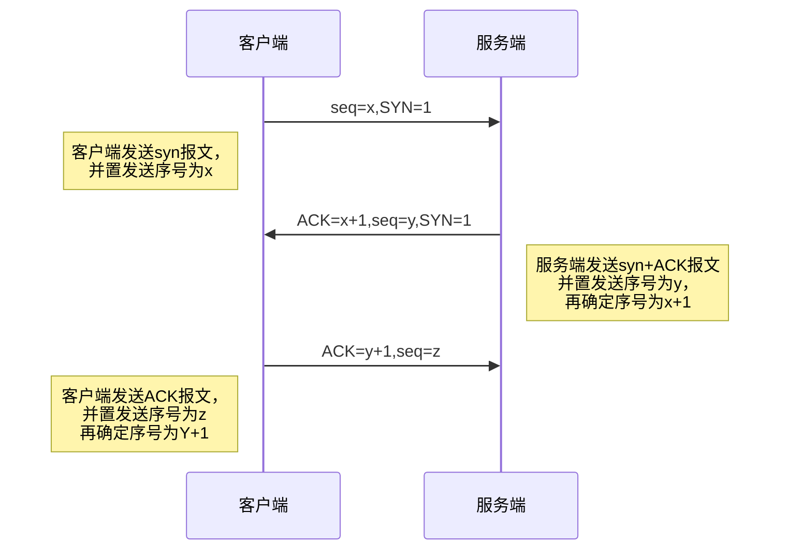
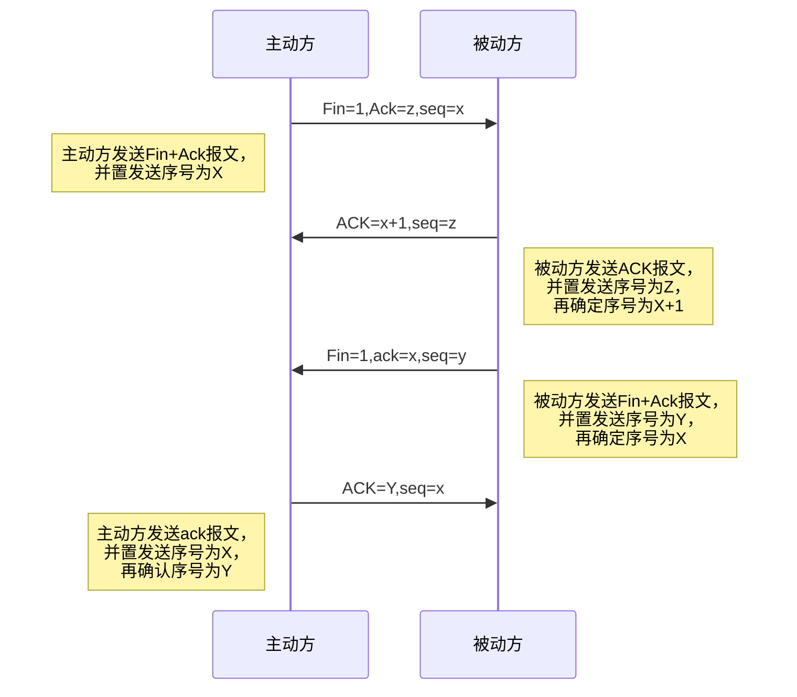

# Java核心技术
## 一、Java基本语法
### 1、关键字与保留字
#### 关键字的定义和特点
- 被Java语言赋予了特殊含义，用做专门用途的字符串（单词）
- 关键字中所有字母都为小写

#### 保留字的定义
- 现有Java版本尚未使用，但以后版本可能会作为关键字使用。命名标识符时要避免使用这些保留字。

> 总结：48个关键字、2个保留字、3个字面值

```
用于定义数据类型的关键字
class interface enum byte short int long float double char boolean void
用于定义流程控制的关键字
if else switch case default while do for break continue return
用于定义访问权限修饰符的关键字
private protected public
用于定义类，函数，变量修饰符的关键字
abstract final static synchronized
用于定义类与类之间关系的关键字
extends implements
用于定义建立实例及引用实例，判断实例的关键字
new this super instanceof
用于异常处理的关键字
try catch finally throw throws
用于包的关键字
package import
其他修饰符关键字
native strictfp transient volatile assert

保留字
goto const

用于定义数据类型值的字面值
true false null
```

### 2、标识符
#### 标识符的定义
- Java对各种变量、方法和类等要素命名时使用的字符序列称为标识符

> 技巧：凡是自己可以起名字的地方都叫标识符

#### 定义合法标识符规则
- 由26个英文字母大小写，0-9，_或$组成
- 数字不可以开头
- 不可以使用关键字和保留字，但能包含关键字和保留字
- Java中严格区分大小写，长度无限制
- 标识符不能包含空格

#### Java中的名称命名规范
- 包名：多单词组成时所有字母都小写：xxxyyyzzz
- 类名、接口名：多单词组成时，所有单词的首字母大写：XxxYyyZzz
- 变量名、方法名：多单词组成时，第一个单词首字母小写，第二个单词开始每个单词首字母大写：xxxYyyZzz
- 常量名：所有字母都大写，多单词时每个单词用下划线连接：XXX_YYY_ZZZ

> 注意点：
> 1、在起名字时，为了提高阅读性，要尽量有意义，“见名知意”。
> 2、Java采用unicode字符集，因此标识符也可以使用汉字声明，但是不建议使用。

### 3、变量
#### 变量的概念
- 内存中的一个存储区域
- 该区域的数据可以在同一类型范围内不断变化
- 变量是程序中最基本的存储单元，包含**变量类型**、**变量名**、**存储的值**

#### 变量的作用
- 用于在内存中保存数据

#### 使用变量注意
- **Java中每个变量必须先声明，后使用**
- 使用变量名来访问这块区域的数据
- 变量的作用域：其定义所在的一对{}内
- 变量只有在其作用域内才有效
- 同一个作用域内，不能定义重名的变量

#### 变量的分类

按数据类型分类
- 基本数据类型
  - 数值型
    - 整数类型 **(byte short int long)**
    - 浮点类型 **(float double)**
  - 字符型 **(char)**
  - 布尔型 **(boolean)**
- 引用数据类型
  - 类 **(class)**
  - 接口 **(interface)**
  - 数组 **([])**

按声明位置分类
- 成员变量
  - 实例变量 **(不以static修饰)**
  - 类变量 **(以static修饰)**
- 局部变量
  - 形参 **(方法、构造器中定义的变量)**
  - 方法局部变量 **(在方法内部定义)**
  - 代码块局部变量 **(在代码块内定义)**

#### 整数变量：byte、short、int、long
- Java各整数类型有固定的表数范围和字段长度，不受具体OS的影响，以保证Java程序的可移植性。
- Java的整型常量默认为int型，声明long型常量须加`l`或者`L`
- Java程序中变量通常声明为int型，除非不足以表示较大的数，才使用long

| 类型 | 占用存储空间 | 表数范围 |
| :---: | :---: | :---: |
| byte | 1字节=8bit位 | -128~127 |
| short | 2字节 | -$2^{15}$~$2^{15}$-1 |
| int | 4字节 | -$2^{31}$~$2^{31}$-1(约21亿) |
| long | 8字节 | -$2^{63}$~$2^{63}$-1 |

> bit：计算机中的最小存储单位。byte：计算机中基本存储单元。

#### 浮点类型：float、double
- 与整数类型类似，Java浮点类型也有固定的表数范围和字段长度，不受具体操作系统的影响
- 浮点型常量有两种表示形式：
  - 十进制数形式
  - 科学计数法形式
- float：单精度，尾数可以精确到7位有效数字。很多情况下，精度很难满足需求。
- double：双精度，精度是float的两倍。通常采用此类型。
- Java的浮点型常量默认是double型，声明float型常量，须后加`f`或`F`。

| 类型 | 占用存储空间 | 表数范围 |
| :---: | :---: | :---: |
| float | 4字节 | -3.403E38~3.403E38 |
| double | 8字节 | -1.798E308~1.798E308 |

> 注意点：float表示数值的范围比long还大

#### 字符类型：char
- char型数据用来表示通常意义上“字符”（2字节）
- Java中所有字符都使用Unicode编码，故一个字符可以存储一个字母，一个汉字，或其他书面语的一个字符。
- 字符型变量的三种表现形式：
  - 字符常量是用单引号''括起来的单个字符。
  - Java中还允许使用转义字符'\\'来将其后的字符转变为特殊字符型常量。
  - 直接使用Unicode值来表示字符型常量。
- char类型是可以进行运算的。因为它都对应有Unicode编码。

```Java
char c1 = 'a'; // 编译通过
// char c2 = 'AB'; // 编译不通过
char c3 = '中'; // 编译通过
char c4 = '\n'; // 编译通过
char c5 = '\u0043'; // 编译通过
// char c6 = ''; // 编译不通过
char c7 = 97; // a, 开发中极其少见
```
> 常用ASCII码值： 'a' == 97; 'A' == 65;

#### 布尔型：boolean
- 只能取两个值之一：true、false
- 常常在条件判断、循环结构中使用

#### 基本数据类型转换
- 自动类型转换：容量小的类型自动转换为容量大的数据类型。数据类型按容量大小排序为：`char、byte、short --> int --> long --> float --> double`
- 有多种类型的数据混合运算时，系统首先自动将所有数据类型转换为容量最大的那种数据类型，然后再进行计算
- byte,short,char之间不会互相转换，他们三者在计算时首先转换为int类型
> Java在做运算的时候，如果操作数均在int范围内，那么一律在int的空间内运算。
- boolean类型不能与其它数据类型运算
- 当把任何基本数据类型的值和字符串(String)进行连接运算时(+)，基本数据类型的值将自动转化为字符串(String)类型

> 说明：此时的容量大小指的是表示数的范围的大小。比如：float容量要大于long的容量

#### 强制类型转换
- 自动类型转换的逆过程，将容量大的数据类型转换为容量小的数据类型。使用时要加上强制转换符：`()`，但可能造成**精度降低或溢出**，格外要注意
```Java
  double d1 = 12.9;
  int i1 = (int)d1; // 12，截断操作

  int i2 = 128;
  byte b = (byte)i2; // -128
```
- 通常，字符串不能直接转换为基本类型，但通过基本类型对应的包装类则可以实现把字符串转换为基本类型
```Java
  String a = "43";
  int i = Integer.parseInt(a);
```
- boolean类型不可以转换为其它的数据类型

> 说明：整型常量，默认类型是int型；浮点型常量，默认类型是double型。
```Java
  byte b = 12;
  // byte b1 = b + 1; // 编译失败
  // float f1 = b + 12.3; // 编译失败
```
#### 字符串类型：String
- String不是基本数据类型，属于引用数据类型
- 使用方式与基本数据类型一致。
- 一个字符串可以串接另一个字符串，也可以直接串接其他类型的数据。
```Java
  String str = "abcd";
  str = str + "xyz";
  int n = 100;
  str = str + n; // abcdxyz100
```

### 4、进制
- 所有数字在计算机底层都是以**二进制**形式存在。
- 对于整数，有四种表示方式：
  - 二进制(binary)：0,1，满2进1，以`0b`或`0B`开头
  - 十进制(decimal)：0-9，满10进1
  - 八进制(octal)：0-7，满8进1，以数字`0`开头表示
  - 十六进制(hex)：0-9及A-F，满16进1，以`0x`或`0X`开头表示。此处的A-F不区分大小写。
- Java整数常量默认是int类型，当用二进制定义整数时，其第32位(最高位)是符号位：当是long类型时，二进制默认占64位，第64位是符号位
- 二进制的整数有如下三种形式：
  - 原码：直接将一个数值换成二进制数。最高位是符号位
  - 负数的反码：是对原码按位取反，只有最高位(符号位)确认为1
  - 负数的补码：其反码加1
- 计算机以二进制**补码**的形式保持所有的整数
  - 正数的原码、反码、补码都相同
  - 负数的补码是其反码+1

### 5、运算符
运算符是一种特殊的符号，用以表示数据的运算、赋值和比较等。
- 算术运算符
- 赋值运算符
- 比较运算符（关系运算符）
- 逻辑运算符
- 位运算符
- 三元运算符

#### 算术运算符

| 运算符 | 运算 | 范例 | 结果 |
| :---: | :---: | :---: | :---: |
| + | 正号 | +3 | 3 |
| - | 负号 | b=4; -b | -4 |
| + | 加 | 5+5 | 10 |
| - | 减 | 6-4 | 2 |
| * | 乘 | 3*4 | 12 |
| / | 除 | 5/5 | 1 |
| % | 取模(取余) | 7%5 | 2 |
| ++ | 自增(前)，先运算后取值 | a=2;b=++a; | a=3;b=3 |
| ++ | 自增(后)，先取值后运算 | a=2;b=a++; | a=3;b=2 |
| -- | 自减(前)，先运算后取值 | a=2;b=--a; | a=1;b=1 |
| -- | 自减(后)，先取值后运算 | a=2;b=a--; | a=1;b=2 |
| + | 字符串连接 | "He"+"llo" | "Hello" |

**疑难点1：`%`取余运算，结果的符号与被模数的符号相同**
```Java
int m1 = 12;
int n1 = 5;
System.out.println("m1 % n1 = " + m1 % n1); // m1 % n1 = 2
int m2 = -12;
int n2 = 5;
System.out.println("m1 % n1 = " + m2 % n2); // m1 % n1 = -2
int m3 = 12;
int n3 = -5;
System.out.println("m1 % n1 = " + m3 % n3); // m1 % n1 = 2
int m4 = -12;
int n4 = -5;
System.out.println("m1 % n1 = " + m4 % n4); // m1 % n1 = -2
```

**疑难点2：++ 和 -- 不会改变变量本身的数据类型**
```Java
short s = 10;
//s = s + 1; //编译失败
s = (short) (s + 1); //正确
s++; //正确

byte b = 127;
b++;
System.out.println(b); //-128
```

#### 赋值运算符
符号：`=` 拓展赋值运算符：`+=`,`-=`,`*=`,`/=`,`%=`
- 当`=`两侧数据类型不一致时，可以使用自动类型转换或使用强制类型转换原则进行处理
- 支持连续赋值
```Java
int i, j;
//连续赋值
i = j = 10;
```
**疑难点：拓展赋值运算符不会改变变量本身的数据类型**
```Java
short s = 10;
//s = s + 2; //编译失败
s += 2;
System.out.println(s); //12
int i = 1;
i *= 0.1;
System.out.println(i); // 0
```

#### 比较运算符
| 运算符 | 运算 | 范例 | 结果 |
| :---: | :---: | :---: | :---: |
| == | 相等于 | 4==3 | false |
| != | 不等于 | 4!=3 | true |
| < | 小于 | 4<3 | false |
| > | 大于 | 4>3 | true |
| <= | 小于等于 | 4<=3 | false |
| >= | 大于等于 | 4>=3 | true |
| instanceof | 检查是否是类的对象 | "Hello" instanceof String | true |

- 比较运算符的结果都是boolean型，也就是要么是true，要么是false。
- **比较运算符`==`不能误写成`=`**
- `>` `<` `>=` `<=`：只能使用在数值类型的数据之间
- `==`：不仅可以使用在数值类型数据之间，还可以使用在其他引用类型变量之间。

#### 逻辑运算符
`&`-逻辑与
`|`-逻辑或
`!`-逻辑非
`&&`-短路与
`||`-短路或
`^`-逻辑异或

| a | b | a&b | a&&b | a\|b | a\|\|b | !a | a^b |
| :---: | :---: | :---: | :---: | :---: | :---: | :---: | :---: |
| true | true | true | true | true | true | false | false |
| true | false | false | false | true | true | false | true |
| false | true | false | false | true | true | true | true |
| false | false | false | false | false | false | true | false |

**区分 & 与 &&**
- 相同点1：&与&&的运算结果相同
- 相同点2：当符号左边为true时，二者都会执行符号右边的运算
- 不同点：当符号左边为false时，&继续执行符号右边的运算，&&不再执行符号右边的运算

**区分 | 与 ||**
- 相同点1：|与||的运算结果相同
- 相同点2：当符号左边是false时，二者都会执行符号右边的运算
- 不同点1：当符号左边是true时，|继续执行符号右边的运算，而||不再执行符号右边的运算

#### 位运算符
| 运算符 | 运算 | 范例 |
| :---: | :---: | :---: |
| << | 左移 | 3 << 2 = 12 --> 3\*2\*2=12 |
| >> | 右移 | 3 >> 1 = 1 --> 3/2=1 |
| >>> | 无符号右移 | 3 >>> 1 = 1 --> 3/2=1 |
| & | 与运算 | 6 & 3 = 2 |
| \| | 或运算 | 6 \| 3 = 7|
| ^ | 异或运算 | 6 ^ 3 = 5 |
| ~ | 取反运算 | ~6 = -7 |

> 位运算时直接对整数的二进制进行的运算

| 运算符 | 描述 |
| :---: | :---: |
| << | 空位补0，被移除的高位丢弃，空缺位补0 |
| >> | 被移除的二进制最高位是0，右移后，空缺位补0，若最高位是1，空缺位补1 |
| >>> | 被移位二进制最高位无论是0或者是1，空缺位都用0补 |
| & | 二进制位进行&运算，只有1&1时结果是1，否则是0 |
| \| | 二进制位进行\|运算，只有0\|0时结果是0，否则是1 |
| ^ | 相同二进制进行\^运算结果是0：1\^1=0,0\^0=0；不相同二进制位\^运算结果是1：1\^0=1，0\^1=1 |
| ~ | 各二进制码按补码各位取反 |

> m = k ^ n = (m ^ n) ^ n

#### 三元运算符
- 格式：(条件表达式) ? 表达式1 : 表达式2;
- 表达式1和表达式2为同种类型

**三元运算符与if-else的联系与区别**
- 三元运算符可简化if-else语句
- 三元运算符要求必须返回一个结果
- if后的代码块可有多个语句

**附加：运算符的优先级**
| | . () {} ; , |
| :---: | :---: |
| R-->L | `++` `--` `~` `!(data type)` |
| L-->R | `*` `/` `%` |
| L-->R | `+` `-` |
| L-->R | `<<` `>>` `>>>` |
| L-->R | `<` `>` `<=` `>=` `instanceof` |
| L-->R | `==` `!=` |
| L-->R | `&` |
| L-->R | `^` |
| L-->R | `\|` |
| L-->R | `&&` |
| L-->R | `\|\|` |
| R-->L | `? :` |
| R-->L | `=` `*=` `/=` `%=` |
|  | `+=` `-=` `<<=` `>>=` |
|  | `>>>=` `&=` `^=` `\|=` |

### 6、程序流程控制
- 程序控制语句是用来控制程序中各语句执行顺序的语句，可以把语句组合成能完成一定功能的小逻辑模块。
- 其流程控制方式采用结构化程序设计中规定的三种基本流程结果，即：顺序结构、分支结构、循环结构

#### 分支结构
**if-else结构**
- else 结构是可选的
- 针对与条件表达式：
  - 如果多个条件表达式之间是“互斥”关系（或没有交集的关系），哪个判断和执行语句声明在上面还是下面，无所谓。
  - 如果多个条件表达式之间有交集的关系，需要根据实际情况，考虑清楚应该将哪个结构声明在上面。
  - 如果多个条件表达式之间有包含关系，通常情况下，需要将范围小的声明在范围大的上面。否则，范围小的就没有机会执行
- if-else 结构是可以互相嵌套的。
- 如果if-else结构中的执行语句只有一行时，对应的一对{}可以省略的。但是，不建议大家省略。
- 多个if-else时，if-else的配对方式采用就近原则进行配对

**switch-case结构**
```Java
switch(表达式){
  case 常量1:
    语句1;
    // break;
  case 常量2:
    语句2;
    // break;
  ... ...
  case 常量N:
    语句N;
    // break;
  default:
    语句;
    // break;
}
```
- 根据switch表达式中的值，依次匹配各个case中的常量。一旦匹配成功，则进入相应的case结构中，调用其执行语句。当调用完执行语句以后，则仍然继续向下执行其他case结构中的执行语句，直到遇到break关键字或此switch-case结构末尾结束为止。
- break，可以使用在switch-case结构中，表示一旦执行到此关键字，就跳出switch-case结构
- switch结构中的表达式，只能是如下的6种数据类型之一：byte、short、char、int、枚举类型（JDK5.0新增）、String类型（JDK7.0新增）
- case 之后只能声明常量，不能声明范围。
- break 关键字是可选的
- default：相当于if-else结构中的else。default结构是可选的，而且位置是灵活的。

```Java
int number = 0;
// Console: zero
switch(number) {
  default:
    System.out.println("other");
  case 0:
    System.out.println("zero");
    break;
  case 1:
    System.out.println("one");
    break;
}
```

- 凡是可以使用switch-case的结构，都可以转换为if-else。反之，不成立。
- 当发现既可以使用switch-case且switch中表达式的取值情况不太多，又可以使用if-else时，我们优先选择使用switch-case。原因：switch-case执行效率稍高。

#### 循环结构
循环语句的四个组成部分
- 初始化部分
- 循环条件部分
- 循环体部分
- 迭代部分

**for循环结构**
```Java
for(初始化部分;循环条件部分;迭代部分) {
  循环体部分
}

执行过程：初始化部分-循环条件部分-循环体部分-迭代部分-循环条件部分-循环体部分-迭代部分- ... - 循环条件部分
```

**while循环结构**
```Java
初始化部分
while(循环条件部分) {
  循环体部分
  迭代部分
}

执行过程：初始化部分-循环条件部分-循环体部分-迭代部分-循环条件部分-循环体部分-迭代部分- ... - 循环条件部分
```
- 写while循环千万小心不要丢了迭代条件。一旦丢了，就可能导致死循环！
- 写程序需要避免出现死循环。
- for循环和while循环是可以相互转换的。区别在于for循环和while循环的初始化条件部分的作用范围不同。

**do-while循环结构**
```Java
初始化部分
do{
  循环体部分
  迭代部分
}while(循环条件部分);

执行过程：初始化部分-循环体部分-迭代部分-循环条件部分-循环体部分-迭代部分- ... - 循环条件部分
```
- do-while循环至少会执行一次循环体！
- 开发中，使用for和while更多一些。较少使用do-while

**特殊关键字的使用**
|  | 适用范围 | 不同点 | 相同点 |
| :---: | :---: | :---: | :---: |
| break | switch-case和循环结构中 | 结束当前循环 | 关键字后面不能声明执行语句 |
| continue | 循环结构中 | 结束当次循环 | 关键字后面不能声明执行语句 |

```Java
label: for(int i = 1; i <= 4; i++) {
          for(int j = 1; j <= 10; j++) {
            if (j % 4 == 0) {
              //break; //默认跳出包裹此关键字最近的一层循环
              //continue;
              
              //break label; //结束指定标识的一层循环结构
              continue label; //结束指定标识的一层循环结构当次循环
            }
          }
        }
```

- return：并非专门用于结束循环的，它的功能是结束一个方法。当一个方法执行到一个return语句时，这个方法将被结束。
- 与break和continue不同的是，return直接结束整个方法，不管这个return处于多少层循环之内

### 7、数组
- 数组(Array)，是多个相同类型数据按一定顺序排列的集合，并使用一个名字命名，并通过编号的方式对这些数据进行统一管理。
- 数组本身是**引用数据类型**，而数组中的元素可以是任何数据类型，包括基本数据类型和引用数据类型。
- 创建数组对象会在内存中开辟一整块连续的空间，而数组名中引用的是这块连续空间的首地址。
- 数组的长度一旦确定，就不能修改。

```Java
//1.一维数组的声明和初始化		
int[] ids;//声明
//1.1静态初始化：数组的初始化和数组元素的赋值操作同时进行
ids = new int[]{1001,1002,1003,1004};
//1.2动态初始化：数组的初始化和数组元素的赋值操作分开进行
String[] names = new String[5];
```

**数组元素的默认初始化值**
- 数组元素是整型：0
- 数组元素是浮点型：0.0
- 数组元素是char型：0或者'\u0000'，而非'0'
- 数组元素是boolean型：false
- 数组元素是引用数据类型：null

> 对于二维数组的理解：我们可以看成是一维数组array1又作为另一个一维数组array2的元素而存在。其实，从数组底层的运行机制来看，其实没有多维数组。

```Java
//一些错误的写法
//int[] ids;
//ids = {1,2,2}; //编译错误
//一些正确但是不标准的写法
int[] arr1 = {1,2,2,3}; //类型推断
int[] arr2[] = new int[][]{{1,2,2},{4,5},{6,7,8}}; // 数组[]位置可以随意
int[] arr3[] = {{1,2,2},{4,5},{6,7,8}};
String[] strArray1[] = {{"222", "2222"},{"111", "3333", "5555"}};
```

### 附加：Arrays工具类的使用
- java.util.Arrays类即为操作数组的工具类，包含了用来操作数组的各种方法

| 方法 | 作用 |
| :---: | :---: |
| boolean equals(int[] a,int[] b) | 判断两个数组是否相等 |
| String toString(int[] a) | 输出数组信息 |
| void fill(int[] a,int val) | 将指定值填充到数组之中 |
| void sort(int[] a) | 对数组进行排序 |
| int binarySearch(int[] a,int key) | 对排列后的数组进行二分法检索指定的值 |

## 二、面向对象编程
### 1、面向过程与面向对象
#### 面向过程(POP)与面向对象(OOP)
- 二者都是一种思想，面向对象是相对于面向过程而言的。面向过程，强调的是功能行为，以函数为最小单位，考虑怎么做。面向对象，将功能封装进对象，强调具备了功能的对象，以类/对象为最小单位，考虑谁来做。
- 面向对象更加强调运用人类在日常的思维逻辑中采用的思想方法与原则，如抽象、分类、继承、聚合、多态等。


#### 面向对象的三大特征
- 封装性
- 继承性
- 多态性

#### 面向对象的思想概述
- 程序员从面向过程的**执行者**转化成了面向对象的**指挥者**
- 面向对象分析方法分析问题的思路和步骤：
  - 根据问题需要，选择问题所针对的**现实世界的实体**。
  - 从实体中寻找解决问题相关的属性和功能，这些属性和功能就形成了**概念世界中的类**。
  - 把抽象的实体用计算机语言进行描述，**形成计算机世界中的类的定义**。即借助某种程序语言，把类构造成计算机能够识别和处理的数据结构。
  - 把**类实例化成计算机世界中的对象**。对象是计算机世界中解决问题的最终工具。

### 2、Java语言基本元素：类和对象
#### 类和对象
- 类(Class)和对象(Object)是面向对象的核心概念。
  - 类是对一类事物的描述，是**抽象的**、概念上的定义
  - 对象是**实际存在的**的该类事物的每个个体，因而也称为**实例**。

#### 类和对象的使用（面向对象思想落地的实现）
- 创建类，设计类的成员
- 创建类的对象
- 通过"对象.属性"或"对象.方法"调用对象的结构

> 如果创建了一个类的多个对象，则每个对象都独立的拥有一套类的(非static的)属性。意味着：如果我们修改一个对象的属性a，则不影响另外一个对象属性a的值。

#### 对象的创建和使用：内存解析
- **堆(Heap)**，此内存区域的唯一目的就是**存放对象实例**，几乎所有的对象实例都在这里分配内存。这一点在Java虚拟机规范中的描述是：所有的对象实例以及数组都要在堆上分配。
- 通常所说的**栈(Stack)**，是指虚拟机栈。虚拟机栈用于**存储局部变量**等。局部变量表存放了编译期可知长度的各种基本数据类型(boolean、byte、char、short、int、float、long、double)、对象引用(reference类型，它不等同于对象本身，是对象在堆内存的首地址)。方法执行完，自动释放。
- **方法区(Method Area)**，用于存储已被虚拟机加载的**类信息、常量、静态变量、即时编译器编译后的代码**等数据

### 3、类的成员之一：属性
#### 属性(成员变量) VS 局部变量
- 相同点
  - 定义变量的格式：数据类型 变量名 = 变量值
  - 先声明，后使用
  - 变量都有其对应的作用域
- 不同点
  - 在类中声明的位置不同。属性直接定义在类的一对{}内；局部变量声明在方法内、方法形参、代码块内、构造器形参、构造器内部的变量
  - 关于权限修饰符的不同。属性可以在声明属性时，指明其权限，使用权限修饰符。常用的权限修饰符：private、public、缺省、protected。局部变量不可以使用权限修饰符。
  - 默认初始化值的情况
    - 属性：类的属性，根据其类型，都有默认初始化值。整型(byte、short、int、long)：0；浮点型(float、double)：0.0；字符型(char)：0(或'\u0000')；布尔型(boolean)：false；引用数据类型(类、数组、接口)：null
    - 局部变量：没有默认初始值。意味着，我们在调用局部变量之前，一定要显式赋值。特别地，形参在调用时，我们赋值即可。
  - 在内存中加载的位置：属性加载在堆空间中(非static)；局部变量加载在栈空间

### 4、类的成员之二：方法
#### 方法的声明
```Java
权限修饰符 返回值类型 方法名(形参列表){
  方法体
}
// 注意：static、final、abstract来修饰的方法，后面再讲
```

#### 返回值类型：有返回值 VS 没有返回值
- 如果方法有返回值，则必须在方法声明时，指定返回值的类型。同时，方法中，需要使用return关键字来返回指定类型的变量或常量：“return 数据”。
- 如果方法没有返回值，则方法声明时，使用void来表示。通常，没有返回值的方法中，就不需要使用return。但是，如果使用的话，只能“return;”表示结束此方法的意思。

#### return 关键字的使用
- 使用范围：使用在方法体中
- 作用：1、结束方法；2、针对于有返回值类型的方法，使用"return 数据"方法返回所要的数据。
- 注意点：return关键字后面不可以声明执行语句。

#### 方法的使用
- 方法的使用中，可以调用当前类的属性或方法。特殊的，方法A中又调用了方法A：递归方法
- 方法中不可以定义方法。

#### 理解“万事万物皆对象”
- 在Java语言范畴中，我们都将功能、结构等封装到类中，通过类的实例化，来调用具体的功能接口
  - Scanner, String等
  - 文件：File
  - 网络资源：URL
- 涉及到Java与前端Html、后端的数据库交互时，前后端的结构在Java层面交互时，都体现为类和对象。

#### 方法的重载(overload)
- 重载的概念：在同一个类中，允许存在一个以上的同名方法，只要它们的参数个数或者参数类型不同即可。
- 重载的特点：与返回值类型无关，只看参数列表，且参数列表必须不同（参数个数或参数类型）。调用时，根据方法参数列表的不同来区分。

```Java
// 返回两个整数的和
int add(int x, int y) {return x+y;}
// 返回三个整数的和
int add(int x, int y, int z) {return x+y+z;}
// 返回两个小数的和
double add(double x, double y) {return x+y;}
```
#### 可变个数的形参

> JavaSE 5.0中提供了Varargs(variable number of arguments)机制，允许直接定义能和多个实参相匹配的形参。从而，可以用一种更简单的方式，来传递个数可以变的实参。

```Java
// JDK 5.0以前：采用数组形参来定义方法，传入多个同一类型的变量
public static void test(int a, String[] books);
// JDK 5.0：采用可变个数形参来定义方法，传入多个同一类型变量
public static void test(int a, String...books);
```

- 声明格式：方法名(参数的类型名...参数名)
- 可变参数：方法参数部分指定类型的参数个数是可变多个：0个，1个或多个
- 可变个数形参的方法和同名的方法之间，彼此构成重载
- 可变参数方法的使用与方法参数部分使用数组是一致的
- **方法的参数部分有可变形参，需要放在形参声明的最后**
- 在一个方法的形参位置，最多只能声明一个可变个数形参

```Java
public static void main(String[] args) {
  DemoTest test = new DemoTest();
  test.show(12); // show(int i)
  test.show("hello"); // show(String s)
  test.show("hello","hello"); // show(String ... s)
  test.show(); // show(String ... s)
  test.show(new String[] {"AA", "BB", "CC"}); // show(String ... s)
}

public void show(int i) {
  System.out.println("show(int i)");
}

public void show(String s) {
  System.out.println("show(String s)");
}

public void show(String ... s) {
  System.out.println("show(String ... s)");
}
```

#### 方法参数的值传递机制

**Java的实参值如何传入方法呢？**
- Java里方法的参数传递方式只有一种：值传递。即将实际参数值的副本(复制品)传入方法内，而参数本身不受影响。
  - 形参是基本数据类型：将实参基本数据类型变量的“数据值”传递给形参
  - 形参是引用数据类型：将实参引用数据类型变量的“地址值”传递给形参

```Java
int[] arr = new int[] {1,2,3};
System.out.println(arr); //地址值
char[] arr1 = new char[] {'a', 'b', 'c'};
// println()方法被重载，所以输出的不是地址值
System.out.println(arr1); //abc
```

### 5、面向对象特征之一：封装性
#### 四种访问权限修饰符
- Java权限修饰符public、protected、private置于类的成员定义前，用来限定对象对该类成员的访问权限

| 修饰符 | 类内部 | 同一个包 | 不同包的子类 | 同一个工程 |
| :---: | :---: | :---: | :---: | :---: |
| private | Yes |  |  |  |
| (缺省) | Yes | Yes |  |  |
| protected | Yes | Yes | Yes |  |
| public | Yes | Yes | Yes | Yes |

对于class的权限修饰只可以用public和default(缺省)。
- public类可以在任意地方被访问。
- default类只可以被同一个包内部的类访问。

#### 什么是封装性？
- 隐藏对象内部的复杂性，只对外公开简单的接口。便于外界调用，从而提高系统的可拓展性、可维护性。通俗的说，把该隐藏的隐藏起来，该暴露的暴露出去。这就是封装性的设计思想。

#### 封装性的体现
- Java规定的四种权限（从小到大排列）：private、缺省、protected、public
- 4种权限可以修饰类及类的内部结构：属性、方法、构造器、内部类
- 具体的，4中权限都可以用来修饰类的内部结构：属性、方法、构造器、内部类；修饰类的话，只能使用：缺省、public

> 总结：Java提供了4种权限修饰符来修饰类及类的内部结构，体现类及类的内部结构在被调用时的可见性的大小

### 6、类的成员之三：构造器
构造器的作用
- 创建对象
- 初始化对象的信息

说明
- 如果没有显示的定义类的构造器的话，则系统默认提供一个空参的构造器，默认构造器的权限修饰符与类修饰符一致
- 定义构造器的格式：权限修饰符 类名(形参列表){}
- 一个类中定义的多个构造器，彼此构成重载
- 一旦我们显式的定义了类的构造器之后，系统就不再提供默认的空参构造器
- 一个类中，至少会有一个构造器

属性赋值的过程
- 默认初始化
- 显式初始化
- 构造器中的初始化
- 通过“对象.属性”或“对象.方法”的方式赋值

### 7、拓展知识
JavaBean
- JavaBean是一种Java语言写成的可重用组件。
- 所谓JavaBean，是指符合如下标准的Java类：
  - 类是公共的
  - 有一个无参的公共的构造器
  - 有属性，且有对应的get、set方法

UML类图
- `+`表示public类型，`-`表示private类型，`#`表示protected类型
- 方法的写法：方法的类型(+、-) 方法名(参数名: 参数类型): 返回值类型
- 属性：`:`前是属性名，`:`后是属性的类型

### 8、关键字：this
- this可以用来修饰、调用：属性、方法、构造器
- this修饰属性和方法时可以理解为：当前对象或当前正在创建的对象
  - 在类的方法中，我们可以使用“this.属性”或者“this.方法”的方式，调用当前对象属性或方法。但是通常情况下，我们都选择省略"this."。特殊情况下，如果方法的形参和类的属性同名时，我们必须显示的使用“this.变量”的方式，表明此变量是属性，而非形参。
  - 在类的构造器中，我们可以使用“this.属性”或“this.方法”的方式，调用当前正在创建的对象属性或方法，但是通常情况下，我们都选择省略"this."。特殊情况下，如果构造器的形参和类的属性同名时，我们必须显式的使用“this.变量”的方式，表明此变量是属性，而非形参。
- this调用构造器
  - 我们在类的构造器中，可以显式的使用“this(形参列表)”方式，调用本类中指定的其他构造器
  - 构造器中不能通过“this(形参列表)”方式调用自己
  - 如果一个类中有n个构造器，则最多有n-1个构造器中使用了“this(形参列表)”
  - 规定，“this(形参列表)”必须声明在当前构造器的首行，因此构造器内部，最多只能声明一个“this(形参列表)”，用来调用其他的构造器

### 9、关键字：package
- 为了更好的实现项目中类的管理，提供了包的概念
- 使用package声明类或接口所属的包，声明在源文件的首行
- 包，属于标识符，遵循标识符的命名规则、规范(xxxyyyzzz)、“见名知意”
- 每“.”一次，就表示一层文件目录

> 补充：同一个包下，不能命名同名的接口、类；不同包下，可以命名同名的接口、类。

### 10、关键字：import
- 在源文件中使用import显示的导入指定包下的类或接口
- 声明在包的声明和类的声明之间
- 如果需要导入多个类或者接口，那么就并列显式多个import语句即可
- 举例：可以使用java.util.*的方式，一次性导入util包下的所有的类或接口
- 如果导入的类或接口是java.lang包下的，或者是当前包下的，则可以省略此import语句
- 如果在代码中使用不同包下的同名的类。那么就需要使用类的全类名的方式指明调用的是哪个类
- 如果已导入java.a包下的类。那么如果需要使用a包的子包下的类的话，仍然需要导入。
- import static组合的使用：调用指定类或接口下的静态的属性或方法

### 11、面向对象特征之二：继承性
#### 继承性的好处
- 减少了代码的冗余，提高了代码的复用性
- 便于功能的拓展
- 为之后多态性的使用，提供了前提

#### 继承性的说明
- 继承性的格式： class A extends B{}
- 体现：一旦子类A继承父类B以后，子类A中就获取了父类B中的声明的所有的属性和方法。特别的，父类中声明为private的属性或方法，子类继承父类以后，仍然认为获取了父类中的私有的结构。只是因为封装性的影响，使得子类不能直接调用父类的结构而已。
- 子类继承父类以后，还可以声明自己特有的属性或方法：实现功能的拓展

#### Java中关于继承性的规定
- 一个类可以被多个子类继承
- Java中类的单继承性：一个类只能有一个父类
- 子父类是相对的概念
- 子类直接继承的父类称为直接父类；间接继承的父类称为间接父类
- 子类继承父类以后，就获取了直接父类以及所有间接父类中声明的属性和方法

补充说明
- 如果我们没有显示的声明一个类的父类的话，则此类继承于java.lang.Object类
- 所有的java类（除java.lang.Object类之外）都直接或间接的继承于java.lang.Object类
- 意味着，所有的java类都具有java.lang.Object类声明的功能。

#### 方法的重写(override/overwrite)
- 重写：子类继承父类以后，可以对父类中同名同参数的方法，进行覆盖操作
- 应用：重写以后，当创建子类对象以后，通过子类对象调用子父类中的同名同参数的方法时，实际执行的是子类重写父类的方法
- 重写的规定
  - 子类重写的方法的方法名和形参列表与父类被重写的方法的方法名和形参列表相同
  - 子类重写的方法的权限修饰符不小于父类被重写的方法的权限修饰符
    - 特殊情况：子类不能重写父类中声明为private权限的方法
  - 返回值类型：
    - 父类被重写的方法的返回值类型是void，则子类重写的方法的返回值类型只能是void
    - 父类被重写的方法的返回值类型是A类型，则子类重写的方法的返回值类型可以是A类或A类的子类
    - 父类被重写的方法的返回值类型是基本数据类型(比如：double)，则子类重写的方法的返回值类型必须是相同的。
  - 子类重写的方法抛出的异常类型不大于父类被重写的方法抛出的异常类型
  - 子类和父类中的同名同参数的方法要么都声明为非static的（考虑重写），要么都声明为static的（不是重写）。

### 12、关键字：super
- super可以用来调用：属性、方法、构造器
- super的使用
  - 我们可以在子类的方法或构造器中。通过使用"super.属性"或"super.方法"的方式，显式的调用父类中声明的属性或方法。但是，通常情况下，我们习惯省略"super."
  - 特殊情况：当子类和父类中定义了同名的属性时，我们要想要在子类中调用父类中声明的属性，则必须显式的使用"super.属性"的方式，表明调用的是父类中声明的属性，否则默认是调用子类的属性。
  - 特殊情况：当子类重写了父类中的方法以后，我们想在子类中的方法中调用父类中被重写的方法时，则必须显式使用"super.方法"的方式，表明调用的是父类中被重写的方法，否则默认是调用子类的方法。
- super调用构造器
  - 我们可以在子类的构造器中显式的使用"super(形参列表)"的方式，调用父类中声明的指定的构造器
  - "super(形参列表)"的使用，必须声明在子类构造器的首行
  - 我们在类的构造器中，针对于"this(形参列表)"或"super(形参列表)"只能二选一，不能同时出现
  - 在构造器的首行，没有显示的声明"this(形参列表)"或"super(形参列表)"，则默认调用的是父类中的空参的构造器
  - 在类的多个构造器中，至少有一个类的构造器中使用了"super(形参列表)"，调用父类中的构造器

#### 子类对象实例化的全过程
- 从结果上来看：（继承性）
  - 子类继承父类以后，就获取了父类中声明的属性或方法。
  - 创建子类的对象，在堆空间中，就会加载所有父类中声明的属性
- 从过程上来看：
  - 当我们通过父类的构造器创建子类对象时，我们一定会直接或间接的调用其父类的构造器，进而调用父类的父类的构造器，直到调用了java.lang.Object类中空参的构造器为止。正因为加载过所有的父类的结构，所以才可以看到内存中有父类中的结构，子类对象才可以考虑进行调用。
- 明确：虽然创建子类对象时，调用了父类的构造器，但是自始至终就创建过一个对象，即为new的子类对象。

### 13、面向对象特征之三：多态性
- 理解多态性：可以理解为一个事物的多种形态。
- 何为多态性：
  - 对象的多态性：父类的引用指向子类的对象（或子类的对象赋给父类的引用）
- 多态的使用，虚拟方法调用
  - 有了对象的多态性以后，我们在编译期，只能调用父类中声明的方法，但在运行期，我们实际执行的是子类重写父类的方法。
  - 总结：编译，看左边；运行，看右边。
- 多态性的使用前提：
  - 类的继承关系
  - 方法的重写
- 对象的多态性，只适用于方法，不适用于属性（编译和运行都看左边）

#### 区分方法的重载与重写
- 二者定义的不同：
  - 重载：在同一个类中，允许存在一个以上的同名方法，只要它们的参数个数或者参数类型不同即可。
  - 重写：子类继承父类以后，可以对父类中同名同参数的方法，进行覆盖操作
- 从编译和运行的角度看：
  - 重载，是指允许存在多个同名方法，而这些方法的参数不同。编译器根据方法不同的参数表，对同名方法的名称做修饰。对于编译器而言，这些同名方法就成了不同的方法。它们的调用地址在编译期就绑定了。Java的重载是可以包括父类和子类的，即子类可以重载父类的同名不同参数的方法。
  - 所以：对于重载而言，在方法调用之前，编译期就已经确定了所要调用的方法，这称为“早绑定”或“静态绑定”
  - 而对于多态，只有等到方法调用的那一刻，解释器运行器才会确定所要调用的具体方法，这称为“晚绑定”或“动态绑定”。

#### instanceof 操作符
- instanceof 关键字的使用：a instanceof A：判断对象a是否是类A的实例。如果是，返回true；如果不是，返回false
- 使用情境： 为了避免在向下转型时出现ClassCastException的异常，我们在向下转型之前，先进行instanceof的判断，一旦返回true，就进行向下转型。如果返回false，就不进行向下转型。
- 如果类B是类A的父类，且a instanceof A返回true，则a instanceof B也返回true

#### ==和equals的区别
- ==既可以比较基本类型也可以比较引用类型。对于基本类型就是比较值，对于引用类型就是比较内存地址
- equals的话，它是属于java.lang.Object类里面的方法，如果该方法没有被重写过默认也是==；我们可以看到String等类的equals方法是被重写过的，而且String类在日常开发中用的比较多，久而久之，形成了equals是比较值的错误观点
- 具体要看自定义类里有没有重写Object的equals方法来判断
- 通常情况下，重写equals方法，会比较类中的相应属性是否都相等

#### Java中的JUnit单元测试
- 创建Java类，进行单元测试。此时的Java类要求：
  - 此类是public的
  - 此类提供公共的无参的构造器
- 此类中声明单元测试方法。此时的单元测试方法的权限是public，没有返回值，没有形参
- 此单元测试方法上需要声明注解：@Test
- 写完代码后，左键双击单元测试方法名，右键：run as - JUnit Test
- 说明：如果执行结果没有任何异常：绿条；如果执行结果出现异常：红条

### 14、包装类(Wrapper)的使用
| 基本数据类型 | 包装类 |
| :---: | :---: |
| byte | Byte |
| short | Short |
| int | **Integer** |
| long | Long |
| float | Float |
| double | Double |
| boolean | Boolean |
| char | **Character** |

> Byte、Short、Integer、Long、Float、Double的父类为Number；Boolean、Character的父类为Object

#### 基本类型、包装类与String类间的转换
- 基本数据类型 --> 包装类：自动装箱
- 包装类 --> 基本数据类型：自动拆箱
- 基本数据类型 --> String类：String类的valueOf()方法
- String类 --> 基本数据类型：调用相应包装类的parseXxx(String)静态方法
- 包装类 --> String类：包装类对象的toString()方法

```Java
// 使用parseBoolean时，如果s非空且在忽略大小写的情况下等于true，则返回true；否则返回false
public static boolean parseBoolean(String s) {
    return "true".equalsIgnoreCase(s);
}
```

```Java
// 三元运算符运算过程中会尽量使两边的类型一致，所以new Integer(1)被自动提升了类型
Object o1 = true ? new Integer(1) : new Double(2.0);
System.out.println(o1); // 1.0

Object o2;
if (true) {
  o2 = new Integer(1);
} else {
  o2 = new Double(2.0);
}
System.out.println(o2); // 1
```
- Integer内部定义了IntegerCache结构，IntegerCache中定义了Integer[]，保存了从-128到127范围的整数。如果我们使用自动装箱的方式，给Integer赋值的范围在-128到127范围内时，可以直接使用数组中的元素，不用再去new了。目的为了提高效率

```Java
Integer i = new Integer(1);
Integer j = new Integer(1);
System.out.println(i == j);// false

Integer m = 1;
Integer n = 1;
System.out.println(m == n);// true

Integer x = 128;
Integer y = 128;
System.out.println(x == y);// false
```

### 15、关键字：static
- 使用static修饰属性：静态变量（或类变量）
  - 属性，按是否使用static修饰，又分为：静态属性 vs 非静态属性（实例变量）
    - 实例变量：我们创建了类的多个对象，每个对象都独立拥有一套类中的非静态属性。当修改其中一个对象的非静态属性时，不会导致其他对象中同样的属性值修改
    - 静态变量：我们创建了类的多个对象，多个对象共享同一个静态变量。当通过某一个对象修改静态变量时，会导致其他对象调用此静态变量时，是修改过了的
  - static修饰属性的其他说明
    - 静态变量随着类的加载而加载。可以通过"类.静态变量"的方式进行调用
    - 静态变量的加载要早于对象的创建
    - 由于类只会加载一次，则静态变量在内存中也只会存在一份：存在方法区的静态域中
- 使用static修饰方法：静态方法
  - 随着类的加载而加载，可以通过"类.静态方法"的方式进行调用
  - 静态方法中，只能调用静态的方法或属性；非静态方法中，既可以调用非静态的方法或属性，也可以调用静态的方法或属性
- static注意点
  - 在静态的方法内，不能使用this关键字、super关键字
- 开发中，如何确定一个属性是否要声明为static的？
  - 属性可以被多个对象所共享的，不会随着对象的不同而不同
  - 类中的常量也常常声明为static
- 开发中，如何确定一个方法是否要声明为static的？
  - 操作静态属性的方法，通常设置为static的
  - 工具类中的方法，习惯上声明为static的

```Java
/**
 * 单例设计模式：
 * 1、所谓的类的单例设计模式，就是采取一定的方法保证在整个的软件系统中，对某个类只能存在一个对象实例。
 * 2、如何实现？
 * 	饿汉式 vs 懒汉式
 * 3、区分饿汉式和懒汉式
 * 	饿汉式：
 * 		坏处：对象加载时间过长。
 * 		好处：饿汉式是线程安全的
 * 	懒汉式：
 * 		好处：延迟对象的创建。
 * 		目前的写法坏处：线程不安全。(到多线程内容时，再修改)
 */

// 饿汉式
class Bank {
	// 1、私有化类的构造器
	private Bank() {
		
	}
	// 2、内部创建类的对象
	// 4、要求此对象也必须声明为静态的
	private static Bank instance = new Bank();
	// 3、提供公共的静态的方法，返回类的对象
	public static Bank getInstance() {
		return instance;
	}
}

// 懒汉式
class Order {
	// 1、私有化类的构造器
	private Order() {
		
	}
	// 2、声明当前类对象，没有初始化
	// 4、此对象也必须声明为static的
	private static Order instance = null;
	// 3、声明public、static的返回当前类对象的方法
	public static Order getInstance() {
		if (instance == null) {
			instance = new Order();
		}
		return instance;
	}
}
```

### 16、类的成员之四：代码块（或初始化块）
- 代码块的作用：用来初始化类、对象
- 代码块如果有修饰的话，只能使用static
- 分类：静态代码块 VS 非静态代码块
- 静态代码块
  - 内部可以有输出语句
  - 随着类的加载而执行，而且只执行一次
  - 作用：初始化类的信息
  - 如果一个类中定义了多个静态代码块，则按照声明的先后顺序执行
  - 静态代码块的执行要优先于非静态代码块的执行
  - 静态代码块内只能调用静态的属性、静态的方法，不能调用非静态的结构
- 非静态代码块
  - 内部可以有输出语句
  - 随着对象的创建而执行
  - 每创建一个对象，就执行一次非静态代码块
  - 作用：可以在创建对象时，对对象的属性等进行初始化
  - 如果一个类中定义了多个非静态代码块，则按照声明的先后顺序执行
  - 非静态代码块内可以调用静态的属性、静态的方法，或非静态的属性、非静态的方法

> 总结：由夫及子，静态先行

#### 属性赋值的过程
- 默认初始化
- 显式初始化/在代码块中赋值
- 构造器中初始化
- 有了对象以后，可以通过"对象.属性"或"对象.方法"的方式，进行赋值

> 显式初始化和在代码块中赋值的顺序先后取决于代码先后顺序

### 17、关键字：final
- final可以用来修饰的结构：类、方法、变量
- final用来修饰一个类：此类不能被其他类所继承。
- final用来修饰方法：表明此方法不可以被重写
- final用来修饰变量：此时的"变量"就称为是一个常量
  - final修饰属性：可以考虑赋值的位置有：显示初始化、代码块中初始化、构造器中初始化
  - final修饰局部变量：尤其是使用final修饰形参时，表明此形参是一个常量。当我们调用此方法时，给常量形参赋一个实参。一旦赋值以后，就只能在方法体内使用此形参，但不能进行重新赋值。

> static final 用来修饰属性：全局变量

### 18、关键字：abstract
- abstract可以用来修饰的结构：类、方法
- abstract修饰类：抽象类
  - 此类不能实例化
  - 抽象类中一定要有构造器，便于子类实例化时调用(涉及：子类对象实例化的全过程)
  - 开发中，都会提供抽象类的子类，让子类对象实例化，完成相关的操作
- abstract修饰方法：抽象方法
  - 抽象方法只要方法的声明，没有方法体
  - 包含抽象方法的类，一定是一个抽象类。反之，抽象类中可以没有抽象方法的。
  - 若子类重写了父类中的所有抽象方法后，此子类才可以实例化；若子类没有重写父类中的所有的抽象方法，则此子类也是一个抽象类，需要使用abstract修饰

> 注意点：abstract不能用来修饰：属性、构造器等结构；abstract不能用来修饰私有方法、静态方法、final的方法、final的类

#### 匿名对象
```Java
method(new Student()); //匿名对象

Worker worker = new Worker();
method1(worker); //非匿名的类非匿名的对象

method1(new Worker()); //非匿名的类匿名的对象

// 创建匿名子类的非匿名对象
Person p = new Person() {
  @Override
  public void eat() {
    System.out.println("吃东西");
  }
}

// 创建匿名子类的匿名对象
method1(new Person() {
  @Override
  public void eat() {
    System.out.println("吃东西");
  }
});
```

### 19、关键字：interface
- Java中，接口和类是并列的两个结构
- 如何定义接口，定义接口中的成员
  - JDK7及以前：只能定义全局变量和抽象方法
    - 全局常量：public static final的，但是书写时，可以省略不写
    - 抽象方法：public abstract的
  - JDK8：除了定义全局常量和抽象方法之外，还可以定义静态方法、默认方法
- 接口中不能定义构造器！意味着接口不可以实例化
- Java开发中，接口通过让类去实现(implements)的方式来使用。如果实现类覆盖了接口中的所有抽象方法，则此实现类就可以实例化；如果实现类没有覆盖接口中所有的抽象方法，则此实现类仍为一个抽象类。
- Java类可以实现多个接口：弥补了Java单继承性的局限性。格式：class AA extends BB implements CC,DD,EE
- 接口与接口之间可以继承，而且可以多继承。格式：interface AA extends BB,CC
- 接口的具体使用，体现了多态性
- 接口，实际上可以看做是一种规范

```Java
interface Flyable {
  // 全局变量
  public static final int MAX_SPEED = 7900;
  int MIN_SPEED = 1; // 省略了public static final

  // 抽象方法
  public abstract void fly();
  // 省略了public abstract
  void stop();
  // Interfaces cannot have constructors
  // public Flyable() {}
}
```
```Java
interface A {
  int x = 0;
}

class B {
  int x = 1;
}

class C extends B implements A {
  public void pX() {
    // 编译不通过，因为x是不明确的
    // System.out.println(x);
    System.out.println(super.x); // 1
    System.out.println(A.x); // 0
  }
}
```
> JDK8：除了定义全局常量和抽象方法之外，还可以定义静态方法、默认方法
```Java
public interface CompareA {
  // 静态方法
  public static void method1() {
    System.out.println("CompareA：北京");
  }
  // 默认方法
  public default void method2() {
    System.out.println("CompareA：上海");
  }
  default void method3() {
    System.out.println("CompareA：上海");
  }
}

class SubClass extends SuperClass implements CompareA, CompareB {
  public void method2() {
    System.out.println("SubClass：上海");
  }
  public void method3() {
    System.out.println("SubClass：深圳");
  }
  // 知识点5：如何在子类(或实现类)的方法中调用父类、接口中被重写的方法
  public void myMethod() {
    method3();//调用了自己定义的重写的方法
    super.method3(); //调用的是父类中声明的
    //调用接口中的默认方法
    CompareA.super.method3();
    CompareB.super.method3();
  }
}

public class SubClassTest {
  public static void main(String[] args) {
    SubClass s = new SubClass();
    // 知识点1：接口中定义的静态方法，只能通过接口来调用
    // s.method1(); // 编译错误
    // SubClass.method1(); // 编译错误
    CompareA.method1();
    // 知识点2：通过实现类的对象，可以调用接口中的默认方法。
    // 如果实现类重写了接口中的默认方法，调用时，仍然调用的是重写以后的方法。
    s.method2();
    // 知识点3：如果子类（或实现类）继承的父类和实现的接口中声明了同名同参数的默认方法,
    // 那么子类在没有重写此方法的情况下，默认调用的是父类中的同名同参数的方法(类优先原则)。
    // 知识点4：如果实现类实现了多个接口，而这多个接口中定义了同名同参数的默认方法，
    //那么在实现类没有重写此方法的情况下，会报错——接口冲突
    //这就需要我们必须在实现类中重写此方法
    s.method3();
  }
}
```

### 20、类的内部成员之五：内部类
- Java中允许将一个类A声明在另一个类B中，则类A就是内部类，类B称为外部类
- 内部类的分类：成员内部类（静态、非静态） VS 局部内部类（方法内、代码块内、构造器内）
- 成员内部类：
  - 作为外部类的成员：
    - 调用外部类的结构
    - 可以被static修饰
    - 可以被4种不同的权限修饰
  - 作为一个类：
    - 类内可以定义属性、方法、构造器等
    - 可以被final修饰，表示此类不能被继承。言外之意，不使用final就可以被继承
    - 可以被abstract修饰

- 如何实例化成员内部类的对象
```Java
// 创建Dog实例（静态的成员内部类）：
Person.Dog dog = new Person.Dog();
dog.show();
// 创建Bird实例（非静态的成员内部类）：
// Person.Bird bird = new Person.Bird(); // 编译错误
Person p = new Person();
Person.Bird bird = p.new Bird();
bird.sing();
```
- 如何在成员内部类中区分调用外部类的结构
```Java
public void sing() {
  // 调用外部类的非静态方法
  Person.this.eat();
  eat();
  // 调用外部类的非静态属性
  System.out.println(age);
}

public void display(String name) {
  System.out.println(name); // 方法的形参
  System.out.println(this.name); // 内部类的属性
  System.out.println(Person.this.name); // 外部类的属性
}
```
- 开发中局部内部类的使用
```Java
public Comparable getComparable() {
  return new Comparable() {
    @Override
    public int compareTo(Object o) {
      return 0;
    }
  }
}
```
- 在局部内部类的方法中(比如：show)，如果要调用外部类所声明的方法(比如：method)中的局部变量(比如：num)的话，要求此局部变量声明为final的。
  - JDK 7及之前版本：要求此局部变量显式的声明为final的
  - JDK 8及之后版本：可以省略final的声明
```Java
public void method() {
  //局部变量-JDK 8及之后，final可以省略
  final int num = 10;
  class AA {
    public void show () {
      // num = 20;
      System.out.print(num);
    }
  }
}
```
- 成员内部类和局部内部类，在编译之后，都会生成字节码文件。格式：
  - 成员内部类：外部类$内部类名.class
  - 局部内部类：外部类$数字 内部类名.class

## 三、异常处理
### 1、异常体系结构
- java.lang.Throwable
  - java.lang.Error：一般不编写针对性的代码进行处理
  - java.lang.Exception：可以进行异常的处理
    - 编译时异常(checked)
      - IOException
        - FileNotFoundException
      - ClassNotFoundException
    - 运行时异常(unchecked)
      - NullPointerException
      - ArrayIndexOutOfBoundsException
      - ClassCastException
      - NumberFormatException
      - InputMismatchException
      - ArithmeticException

### 2、异常处理的方式一：try-catch-finally
```Java
try {
  //可能出现异常的代码
} catch (异常类型1 变量名1) {
  //处理异常的方式1
} catch (异常类型2 变量名2) {
  //处理异常的方式2
} catch (异常类型3 变量名3) {
  //处理异常的方式3
}
......
finally {
  //一定会执行的代码
}
```
#### try-catch-finally的说明
- 使用try将可能出现异常代码包装起来。在执行过程之，一旦出现异常，就会生成一个对应异常类的对象，根据此对象的类型，去catch中进行匹配
- 一旦try中的异常对象匹配到某一个catch时，就进入catch中进行异常的处理。一旦处理完成，就跳出当前的try-catch结构（在没有写finally的情况）。继续执行其后的代码
- catch中的异常类型如果没有子父类关系，则谁声明在上，谁声明在下无所谓；如果满足子父类关系，则要求子类一定声明在父类的上面，否则报错。
- 常用的异常对象处理的方式：
  - String getMessage()
  - printStackTrace()
- 在try结构中声明的变量，在出了try结构以后，就不能再被调用
- try-catch-finally结构可以嵌套

#### try-catch-finally的体会
- 使用try-catch-finally处理编译时异常，使得程序在编译时就不再报错，但是运行时仍可能报错。相当于我们使用try-catch-finally将一个编译时可能出现的异常，延迟到运行时出现。
- 开发中，由于运行时异常比较常见，所以我们通常就不针对运行时异常编写try-catch-finally了。针对编译时异常，我们一定要考虑异常的处理。

#### finally的说明
- finally是可选的
- finally中声明的是一定会被执行的代码。即使catch中又出现异常了，try中有return语句，catch中有return语句等情况。
- 像数据库连接、输入输出流、网络编程Socket等资源，JVM是不能自动的回收的，我们需要自己手动的进行资源的释放。此时的资源释放，就需要声明在finally中。

### 3、异常处理的方式二：throws + 异常类型
- "throws + 异常类型"写在方法的声明处。指明此方法执行时，可能会抛出的异常类型。一旦当方法体执行时，出现异常，仍会在异常代码处生成一个异常类的对象，此对象满足throws后异常类型时，就会被抛出。异常代码后续的代码，就不再执行！
- try-catch-finally：真正的将异常给处理掉了；throws的方式只是将异常抛给了方法的调用者，并没有真正将异常处理掉。
- 开发中如何选择使用try-catch-finally还是使用throws？
  - 如果父类中被重写的方法没有throws方式处理异常，则子类重写的方法也不能使用throws，意味着如果子类重写的方法中有异常，必须使用try-catch-finally方式处理
  - 执行的方法a中，先后又调用了另外的几个方法，这几个方法是递进关系执行的。我们建议这几个方法使用throws的方式进行处理。而执行的方法a可以考虑是用try-catch-finally方式进行处理。

### 4、自定义异常类
- 继承于现有的异常结构：RuntimeException、Exception
- 提供全局常量：serialVersionUID
- 提供重载的构造器

### 5、附加：Eclipse中的快捷键
- 补全代码的声明：alt + /
- 快速修饰：ctrl + l
- 批量导包：ctrl + shift + o
- 使用单行注释：ctrl + /
- 使用多行注释：ctrl + shift + /
- 取消多行注释：ctrl + shift + \
- 复制指定行的代码：ctrl + alt + down 或 ctrl + alt + up
- 删除指定行的代码：ctrl + d
- 上下移动代码：alt + up 或 alt + down
- 切换到下一行代码空位：shift + enter
- 切换到上一行代码空位：ctrl + shift + enter
- 如何查看源码：ctrl + 选中指定的结构 或 ctrl + shift + t
- 退回到前一个编辑的页面：alt + left
- 进入到下一个编辑的页面（针对与上面那条来说的）：alt + right
- 光标选中指定的类，查看继承树结构：ctrl + t
- 复制代码：ctrl + c
- 撤销：ctrl + z
- 反撤销：ctrl + y
- 剪切：ctrl + x
- 粘贴：ctrl + v
- 保存：ctrl + s
- 全选：ctrl + a
- 格式化代码：ctrl + shift + f
- 选中数行，整体往后移动：tab
- 选中数行，整体往前移动：shift + tab
- 在当前类中，显示类结构，并支持搜索指定的方法、属性等：ctrl + o
- 批量修改指定的变量名、方法名、类名等：alt + shift + r
- 选中的结构的大小写的切换：变成大写：ctrl + shift + x
- 选中的结构的大小写的切换：变成小写：ctrl + shift + y
- 调出生成getter/setter/构造器等结构：alt + shift + s
- 显示当前选择资源(工程 or 文件)的属性：alt + enter
- 快速查找：参照选中的Word快速定位到下一个：ctrl + k
- 关闭当前窗口：ctrl + w
- 关闭所有的窗口：ctrl + shift + w
- 查看指定的机构使用过的地方：ctrl + alt + g
- 查找与替换：ctrl + f
- 最大化当前的View：ctrl + m
- 直接定位到当前行的首位：home
- 直接定位到当前行的末位：end

# Java高级编程
## 一、多线程
### 1、基本概念：程序、进程、线程
#### 1.1、程序
- 概念：是为完成特定任务、用某种语言编写的一组指令的集合。即指一段静态的代码。

#### 1.2、进程
- 概念：程序的一次执行过程，或是正在运行的一个程序。
- 说明：进程作为资源分配的单位，系统在运行时会为每个进程分配不同的内存区域。

#### 1.3、线程
- 概念：进程可进一步细化为线程，是一个程序内部的一条执行路径。
- 说明：线程作为调度和执行的单位，每个线程拥有独立的运行栈和程序计数器(pc)，线程切换的开销小。
- 每个线程，拥有自己独立的：虚拟机栈、程序计数器
- 多个线程，共享同一个进程中的结构：方法区、堆

#### 1.4、单核CPU和多核CPU的理解
- 单核CPU，其实是一种假的多线程，因为在一个时间单元内，也只能执行一个线程的任务。但是因为CPU时间单元特别短，因此感觉不出来。
- 如果是多核的话，才能更好的发挥多线程的效率。
- 一个Java应用程序java.exe，其实至少有三个线程：main()主线程，gc()垃圾回收线程，异常处理线程。当然如果发生异常，会影响主线程。

#### 1.5、并行与并发
- 并行：多个CPU同时执行多个任务。
- 并发：一个CPU（采用时间片）同时执行多个任务。

#### 1.6、使用多线程的优点
- 背景：以单个CPU为例，只使用单个线程先后完成多个任务（调用多个方法），肯定比用多个线程来完成用的时间更短，为何仍需多线程呢？
- 多线程程序的优点：
  - 1、提高应用程序的响应。对图形化界面更有意义，可增强用户体验。
  - 2、提高计算机系统CPU的利用率
  - 3、改善程序结构。将既长又复杂的进程分为多个线程，独立运行，利于理解和修改

#### 1.7、何时需要多线程
- 程序需要同时执行两个或多个任务
- 程序需要实现一些需要等待的任务时，如用户输入、文件读写操作、网络操作、搜索等。
- 需要一些后台运行的程序时。

### 2、线程的创建和使用
#### 2.1、创建多线程的方式一：继承Thread类
- 1、创建一个继承于Thread类的子类
- 2、重写Thread类的run() --> 将此线程执行的操作声明在run()中
- 3、创建Thread类的子类的对象
- 4、通过此对象调用start()，start()的作用：
  - 1、启动当前线程
  - 2、调用当前线程的run()

```Java
//1、创建一个继承于Thread类的子类
class MyThread extends Thread {
    //2、重写Thread类的run()
    @Override
    public void run() {
        for (int i = 0; i < 100; i++) {
            if (i % 2 == 0) {
                System.out.println(i);
            }
        }
    }
}

public class ThreadTest {
    public static void main(String[] args) {
        //3、创建Thread类的子类的对象
        MyThread t1 = new MyThread();

        //4、通过此对象调用start()
        t1.start();

        // 或者通过创建Thread类的匿名子类的方式
        new Thread() {
            @Override
            public void run() {
                for (int i = 0; i < 100; i++) {
                    if (i % 2 == 0) {
                        System.out.println(Thread.currentThread().getName() + ":" + i);
                    }
                }
            }
        }.start();
    }
}
```

- 注意点1：我们不能通过直接调用run()的方式启动线程
- 注意点2：再启动一个线程需要重新创建一个线程的对象，不可以让已经start()的线程再start()，否则会报IllegalThreadStateException异常

#### 2.2、Thread类的有关方法
- void start():启动当前线程，调用当前线程的run()
- run():通常需要重写Thread类中的此方法，将创建的线程要执行的操作声明在此方法中
- String getName():获取当前线程的名字
- void setName(String name):设置当前线程的名字
- static Thread currentThread():静态方法，获取执行当前代码的线程
- static void yield():释放当前CPU的执行权
- join():在线程a中调用线程b的join()，此时线程a就进入阻塞状态，直到线程b完全执行完以后，线程a才结束阻塞状态
- static void sleep(long millitime):让当前线程“睡眠”指定的millitime毫秒。在指定的millitime毫秒时间内，当前线程是阻塞状态。
- stop():已过时。当执行此方法时，强制结束当前线程。
- boolean isAlive():判断当前线程是否存活

#### 2.3、线程的调度
- 调度策略
  - 时间片
  - 抢占式：高优先级的线程抢占CPU
- Java的调度方法
  - 同优先级线程组成先进先出队列，使用时间片策略
  - 对高优先级，使用优先调度的抢占式策略

#### 2.4、线程的优先级
- 线程的优先等级
  - MAX_PRIORITY:10
  - MIN_PRIORITY:1
  - NORM_PRIORITY:5 --> 默认优先级
- 涉及的方法
  - getPriority():获取线程的优先级
  - setPriority(int newPriority):设置线程的优先级
- 线程创建时继承父线程的优先级
- 低优先级只是获得调度的概率低，并非一定是在高优先级线程之后才被调度

#### 2.5、创建多线程的方式二：实现Runnable接口
- 1、创建一个实现了Runnable接口的类
- 2、实现类去实现Runnable中的抽象方法：run()
- 3、创建实现类的对象
- 4、将此对象作为参数传递到Thread类的构造器中，创建Thread类的对象
- 5、通过Thread类的对象调用start()

```Java
//1、创建一个实现了Runnable接口的类
class MThread implements Runnable {
    //2、实现类去实现Runnable中的抽象方法：run()
    @Override
    public void run() {
        for (int i = 0; i < 100; i++) {
            if (i % 2 == 0) {
                System.out.println(i);
            }
        }
    }
}

public class ThreadTest1 {
    public static void main(String[] args) {
        //3、创建实现类的对象
        MThread mThread = new MThread();
        //4、将此对象作为参数传递到Thread类的构造器中，创建Thread类的对象
        Thread t1 = new Thread(mThread);
        //5、通过Thread类的对象调用start():启动线程，调用当前线程的run() --> 调用了Runnable类型的target的run()
        t1.start();

        //再启动一个线程
        Thread t2 = new Thread(mThread);
        t2.start();
    }
}
```

#### 2.6、比较创建线程的两种方式
- 开发中：优先选择实现Runnable接口的方式
  - 1、实现的方式没有类的单继承性的局限性
  - 2、实现的方式更适合来处理多个线程有共享数据的情况
- 联系：public class Thread implements Runnable
- 相同点：两种方式都需要重写run()，将线程要执行的逻辑声明在run()中

### 3、线程的生命周期
```Mermaid
graph LR
A(新建) --> |"调用start()"| B(就绪)
B --> |"获取CPU执行权"| C(运行)
C --> |"执行完run();调用线程的stop();出现Error/Exception且没有处理"| D(死亡)
C --> |"失去CPU执行权或yield()"| B
C --> |"sleep(long time);join();等待同步锁;wait();suspend()"| E(阻塞)
E --> |"sleep()时间到;join()结束;获取同步锁;notify()/notifyAll();resume()"| B
```

### 4、线程的同步
#### 4.1、线程同步方式一：同步代码块
```Java
synchronized(同步监视器) {
    // 需要被同步的代码
}
```
- 1、操作共享数据的代码，即为需要被同步的代码
- 2、共享数据：多个线程共同操作的变量。
- 3、同步监视器，俗称：锁。任何一个类的对象，都可以充当锁。
  - 要求：多个线程必须要共用同一把锁。
- 补充：在实现Runnable接口创建多线程的方式中，我们可以考虑使用this充当同步监视器
- 在继承Thread类创建多线程的方式中，慎用this充当同步监视器，考虑使用当前类充当同步监视器

```Java
public class Window1 implements Runnable{
    private int ticket = 100;
    Object obj = new Object();

    @Override
    public void run() {
        while (true) {
            //正确，只要保证多个线程使用同一个对象当做锁即可
            // synchronized (obj) {
            // 此时的this：唯一的Window1的对象
            synchronized (this) {
                if (ticket > 0) {
                    try {
                        Thread.sleep(100);
                    } catch (InterruptedException e) {
                        e.printStackTrace();
                    }
                    System.out.println(Thread.currentThread().getName() + ":" + ticket);
                    ticket--;
                } else {
                    break;
                }
            }
        }
    }
}
```
```Java
public class Window2 extends Thread{
    private static int ticket = 100;
    private static Object obj = new Object();

    @Override
    public void run() {
        while (true) {
            //正确
            // synchronized (obj) {
            // 错误，因为通过继承Thread方式，需要通过不同的对象来创建线程
            // 此时的this代表着不同的对象 
            // synchronized (this) {
            // 正确，Class clazz = Window2.class，Window2.class只会加载一次
            synchronized (Window2.class) {
                if (ticket > 0) {
                    try {
                        Thread.sleep(100);
                    } catch (InterruptedException e) {
                        e.printStackTrace();
                    }
                    System.out.println(Thread.currentThread().getName() + ":" + ticket);
                    ticket--;
                } else {
                    break;
                }
            }
        }
    }
}
```

- 好处：同步的方式，解决了线程的安全问题。
- 局限性：操作同步代码时，只能有一个线程参与，其他线程等待。相当于一个单线程的过程，效率低。

#### 4.2、线程同步方式二：同步方法
- 同步方法仍然涉及到同步监视器，只是不需要我们显式的声明。
- 非静态的同步方法，同步监视器是：this；静态的同步方法，同步监视器是：当前类本身

```Java
public class Window3 implements Runnable{
    private int ticket = 100;

    @Override
    public void run() {
        while (true) {
            show();
        }
    }

    private synchronized void show () {//同步监视器：this
        if (ticket > 0) {
            try {
                Thread.sleep(100);
            } catch (InterruptedException e) {
                e.printStackTrace();
            }
            System.out.println(Thread.currentThread().getName() + ":" + ticket);
            ticket--;
        }
    }
}
```
```Java
public class Window4 extends Thread {
    private static int ticket = 100;

    @Override
    public void run() {
        while (true) {
            show();
        }
    }

    private static synchronized void show () {//同步监视器：Window4.class
        if (ticket > 0) {
            try {
                Thread.sleep(100);
            } catch (InterruptedException e) {
                e.printStackTrace();
            }
            System.out.println(Thread.currentThread().getName() + ":" + ticket);
            ticket--;
        }
    }
}
```

#### 4.3、设计模式：单例模式
```Java
// 饿汉式
class Bank {
	// 1、私有化类的构造器
	private Bank() {}
	// 2、内部创建类的对象
	// 4、要求此对象也必须声明为静态的
	private static Bank instance = new Bank();
	// 3、提供公共的静态的方法，返回类的对象
	public static Bank getInstance() {
		return instance;
	}
}

// 懒汉式方式一：同步方法
class Order {
	// 1、私有化类的构造器
	private Order() {}
	// 2、声明当前类对象，没有初始化
	// 4、此对象也必须声明为static的
	private static Order instance = null;
	// 3、声明public、static的返回当前类对象的方法
	public static synchronized Order getInstance() {
		if (instance == null) {
			instance = new Order();
		}
		return instance;
	}
}

// 懒汉式方式二：同步代码块
class Order {
	// 1、私有化类的构造器
	private Order() {}
	// 2、声明当前类对象，没有初始化
	// 4、此对象也必须声明为static的
	private static Order instance = null;
	// 3、声明public、static的返回当前类对象的方法
	public static Order getInstance() {
    // 方式一：效率稍差
    // synchronized (Order.class) {
    //     if (instance == null) {
    // 	    instance = new Order();
    //     }
    //     return instance;
    // }
    // 方式二：效率更高
    if (instance == null) {
      synchronized (Order.class) {
        if (instance == null) {
            instance = new Order();
        }
      }
    }
		return instance;
	}
}
```

#### 4.4、线程的死锁问题
- 死锁
  - 不同的线程分别占用对方需要的同步资源不放弃，都在等待对方放弃自己需要的同步资源，就形成了线程的死锁
  - 出现死锁后，不会出现异常，不会出现提示，只是所有的线程都处于阻塞状态，无法继续
- 解决方法
  - 专门的算法、原则
  - 尽量减少同步资源的定义
  - 尽量避免嵌套同步

#### 4.5、线程同步方式三：Lock（锁）
```Java
class Window implements Runnable {
    private int ticket = 100;
    // 1、实例化ReentrantLock
    private ReentrantLock lock = new ReentrantLock();

    @Override
    public void run() {
        while (true) {
            try {
                // 2、调用锁定方法lock()
                lock.lock();

                if (ticket > 0) {
                    try {
                        Thread.sleep(100);
                    } catch (InterruptedException e) {
                        e.printStackTrace();
                    }

                    System.out.println(Thread.currentThread().getName() + ":" + ticket);
                    ticket--;
                } else {
                    break;
                }
            } finally {
                // 3、调用解锁方法：unlock()
                lock.unlock();
            }
        }
    }
}
```

- 面试题：synchronized与lock的异同？
  - 相同：二者都可以解决线程安全问题
  - 不同：synchronized机制在执行完相应的同步代码以后，自动的释放同步监视器；Lock需要手动的启动同步(Lock())，同时结束同步也需要手动的实现(unlock())
- 优先使用顺序：
  - Lock --> 同步代码块 --> 同步方法

### 5、线程的通信
- 涉及到的三个方法：
  - wait()：一旦执行此方法，当前线程就进入阻塞状态，并释放同步监视器
  - notify()：一旦执行此方法，就会唤醒被wait()的一个线程。如果有多个线程被wait，就唤醒优先级高的线程。
  - notifyAll()：一旦执行此方法，就会唤醒所有被wait的线程
- 说明：
  - wait()，notify()，notifyAll()三个方法必须使用在同步代码块或同步方法中
  - wait()，notify()，notifyAll()三个方法的调用者必须是同步代码块或同步方法中的同步监视器，否则会出现IllegalMonitorStateException异常
  - wait()，notify()，notifyAll()三个方法是定义在java.lang.Object类中

- 面试题：sleep() 和 wait() 的异同？
  - 相同点：一旦执行方法，都可以使得当前的线程进入阻塞状态
  - 不同点：
    - 1、两个方法声明的位置不同：Thread类中声明sleep()，Object类中声明wait()
    - 2、调用的要求不同：sleep()可以在任何需要的场景下调用。wait()必须使用在同步代码块中
    - 3、关于是否释放同步监视器：如果两个方法都使用在同步代码块或同步方法中，sleep()不会释放锁，wait()会释放锁

### 6、JDK5.0新增线程创建方式
#### 6.1、新增方式一：实现Callable接口
- 与使用Runnable相比，Callable功能更强大些
  - 相比run()方法，可以有返回值
  - 方法可以抛出异常
  - 支持泛型的返回值
  - 需要借助FutureTask类，比如获取返回结果
- Future接口
  - 可以对具体Runnable、Callable任务的执行结果进行取消、查询是否完成、获取结果等。
  - FutrueTask是Futrue接口的唯一实现类
  - FutrueTask同时实现了Runnable，Future接口。它既可以作为Runnable被线程执行，又可以作为Future得到Callable的返回值

```Java
// 1、创建一个实现Callable的实现类
class NumThread implements Callable {
    // 2、实现call方法，将此线程需要执行的操作声明在call()中
    @Override
    public Object call() throws Exception {
        int sum = 0;
        for (int i = 1; i <= 100; i++) {
            if (i % 2 == 0) {
                System.out.println(i);
                sum += i;
            }
        }
        return sum;
    }
}

public class ThreadNew {
    public static void main(String[] args) {
        // 3、创建Callable接口实现类的对象
        NumThread numThread = new NumThread();
        // 4、将此Callable接口实现类的对象作为传递到FutureTask构造器中，创建FutureTask的对象
        FutureTask futureTask = new FutureTask(numThread);
        // 5、将FutureTask的对象作为参数传递到Thread类的构造器中，创建Thread对象，并调用start()
        new Thread(futureTask).start();

        try {
            // 6、获取Callable中call方法的返回值
            // get()返回值即为FutureTask构造器参数Callable实现类重写的call()的返回值
            Object sum = futureTask.get();
            System.out.println("总和为：" + sum);
        } catch (ExecutionException e) {
            e.printStackTrace();
        } catch (InterruptedException e) {
            e.printStackTrace();
        }
    }
}
```

#### 6.2、新增方式二：使用线程池
- 背景：经常创建和销毁、使用量特别大的资源，比如并发情况下的线程，对性能影响很大
- 思路：提前创建好多个线程，放入线程池中，使用时直接获取，使用完放回池中。可以避免频繁创建销毁、实现重复利用。
- 好处：
  - 提高响应速度（减少了创建新线程的时间）
  - 降低资源消耗（重复利用线程池中线程，不需要每次都创建）
  - 便于线程管理
    - corePoolSize：核心池的大小
    - maximumPoolSize：最大线程数
    - keepAliveTime：线程没有任务时最多保持多长时间后会终止
- ExecutorService：真正的线程池接口。常见子类ThreadPoolExecutor
  - void execute(Runnable command)：执行任务/命令，没有返回值，一般用来执行Runnable
  - <T> Future<T> submit(Callable<T> task)：执行任务，有返回值，一般用来执行Callable
  - void shutdown()：关闭连接池
- Executors：工具类、线程池的工厂类，用于创建并返回不同类型的线程池
  - Executors.newCachedThreadPool()：创建一个可根据需要创建新线程的线程池
  - Executors.newFixedThreadPool(n)：创建一个可重用固定线程数的线程池
  - Executors.newSingleThreadPool()：创建一个只有一个线程的线程池
  - Executors.newScheduledThreadPool(n)：创建一个线程池，它可安排在给定延迟后运行命令或者定期地执行

```Java
public class ThreadPool {
    public static void main(String[] args) {
        // 1、提供指定线程数量的线程池
        ExecutorService service = Executors.newFixedThreadPool(10);
        // 2、执行指定的线程的操作。需要提供实现Runnable接口或Callable接口实现类的对象
        service.execute(new NumberThread()); // 适用于实现Runnable接口的线程
        service.submit(new NumberThread1()); // 适用于实现Callable接口的线
        // 3、关闭连接池
        service.shutdown();
    }
}
```
### 7、附加：关于锁的操作
#### 7.1、释放锁的操作
- 当前线程的同步方法、同步代码块执行结束
- 当前线程在同步代码块、同步方法中遇到break、return终止了该代码块、该方法的继续执行。
- 当前线程在同步代码块、同步方法中出现了未处理的Error或Exception，导致异常结束
- 当前线程在同步代码块、同步方法中执行了线程对象的wait()方法，当前线程暂停，并释放锁

#### 7.2、不会释放锁的操作
- 线程执行同步代码块或同步方法时，程序调用Thread.sleep()、Thread.yield()方法暂停当前线程的执行
- 线程执行同步代码块时，其他线程调用了该线程的suspend()方法将该线程挂起，该线程不会释放锁（同步监视器）
  - 应尽量避免使用suspend()和resume()来控制线程

## 二、Java常用类
### 1、字符串相关的类
#### 1.1、字符串相关的类：String
- String声明为final的，不可被继承
- String实现了Serializable接口：表示字符串是支持序列化的；实现了Comparable接口：表示String可以比较大小
- String内部定义了final char[] value用于存储字符串数据
- String：代表不可变的字符序列。简称：不可变性。
  - 1、当对字符串重新赋值时，需要重新指定内存区域赋值，不能使用原有的value进行赋值。
  - 2、当对现有的字符串进行连接操作时，也需要重新指定内存区域赋值，不能使用原有的value进行赋值
  - 3、当调用String的replace()方法修改指定字符或字符串时，也需要重新指定内存区域赋值，不能使用原有的value进行赋值
- 通过字面量的方式（区别于new）给一个字符串赋值，此时的字符串声明在字符串常量池中
- 字符串常量池中是不会存储相同内容的字符串的

```Java
/**
 *  String的实例化方式
 *  方式一：通过字面量定义的方式
 *  方式二：通过new + 构造器的方式
 *
 *  面试题：String s = new String("abc");方式创建对象，在内存中创建了几个对象？
 *  答：两个：一个是堆空间中new结构，另一个是char[]对应的常量池中的数据："abc"
 */
@Test
public void test() {
    // 通过字面量定义的方式：此时的s1和s2的数据javaEE声明在方法区中的字符串常量池中。
    String s1 = "javaEE";
    String s2 = "javaEE";
    // 通过new + 构造器的方式：此时的s3和s4保存的地址值，是数据在堆空间中开辟空间以后对应的地址值
    String s3 = new String("javaEE");
    String s4 = new String("javaEE");

    System.out.println(s1 == s2);// true
    System.out.println(s1 == s3);// false
    System.out.println(s1 == s4);// false
    System.out.println(s3 == s4);// false
};
```

- 常量与常量的拼接结果在常量池。且常量池中不会存在相同内容的常量。
- 只要其中有一个是变量，结果就在堆中。
- 如果拼接的结果是调用intern()方法，返回值就在常量池中

```Java
String s1 = "hello";
String s2 = "world";
String s3 = "hello" + "world";
String s4 = s1 + "world";
String s5 = s1 + s2;
String s6 = (s1 + s2).intern();
final String s7 = "hello"; // 此时的s7是一个常量
String s8 = s7 + "world";

System.out.println(s3 == s4);// false
System.out.println(s3 == s5);// false
System.out.println(s4 == s5);// false
System.out.println(s3 == s6);// true
System.out.println(s3 == s8);// true
```
#### 1.2、字符串相关的类：String常用方法
- int length()：返回字符串的长度：return value.length
- char charAt(int index)：返回某索引处的字符return value[index]
- boolean isEmpty()：判断是否是空字符串：return value.length == 0
- String toLowerCase()：使用默认语言环境，将String中的所有字符转换为小写
- String toUpperCase()：使用默认语言环境，将String中的所有字符转换为大写
- String trim()：返回字符串的副本，忽略首部空白和尾部空白
- boolean equals(Object obj)：比较字符串的内容是否相同
- boolean equalsIgnoreCase(String anotherString)：与equals方法类似，忽略大小写
- String concat(String str)：将指定字符串连接到此字符串的结尾。等价于用"+"
- int compareTo(String anotherString)：比较两个字符串的大小
- String substring(int beginIndex)：返回一个新的字符串，它是此字符串从beginIndex开始截取到最后的一个子字符串
- String substring(int beginIndex, int endIndex)：返回一个新的字符串，它是此字符串从beginIndex开始截取到endIndex（不包含）的一个子字符串
- boolean endsWith(String suffix)：测试此字符串是否以指定的后缀结束
- boolean startsWith(String prefix)：测试此字符串是否以指定的前缀开始
- boolean startsWith(String prefix, int toffset)：测试此字符串从指定索引开始的子字符串是否以指定的前缀开始
- boolean contains(CharSequence s)：当且仅当此字符串包含指定的char值序列时，返回true
- int indexOf(String str)：返回指定子字符串在此字符串中第一次出现处的索引
- int indexOf(String str, int fromIndex)：返回指定子字符串在此字符串中第一次出现处的索引，从指定的索引开始
- int lastIndexOf(String str)：返回指定子字符串在此字符串中最右边出现处的索引
- int lastIndexOf(String str, int fromIndex)：返回指定子字符串在此字符串中最后一次出现处的索引，从指定的索引开始反向搜索
- String replace(char oldChar, char new Char)：返回一个新的字符串，它是通过用newChar替换此字符串中出现的所有oldChar得到的
- String replace(CharSequence target, CharSequence replacement)：使用指定的字面值替换序列替换此字符串所有匹配字面值目标序列的子字符串
- String replaceAll(String regex, String replacement)：使用给定的replacement替换此字符串所有匹配给定的正则表达式的子字符串
- String replaceFirst(String regex, String replacement)：使用给定的replacement替换此字符串匹配给定的正则表达式的第一个子字符串
- boolean matches(String regex)：告知此字符串是否匹配给定的正则表达式
- String[] split(String regex)：根据给定正则表达式的匹配拆分此字符串
- String[] split(String regex, int limit)：根据匹配给定的正则表达式来拆分此字符串，最多不超过limit个，如果超过了，剩下的全部都放到最后一个元素中

#### 1.3、String与基本数据类型、包装类之间的转换
- String --> 基本数据类型、包装类：调用包装类的静态方法：parseXxx(str)
- 基本数据类型、包装类 --> String：调用String重载的valueOf(xxx)

#### 1.4、String与char[]之间的转换
- String --> char[]：调用String的toCharArray()
- char[] --> String：调用String的构造器

#### 1.5、String与byte[]之间的转换
- String --> byte[]：调用String的getBytes()
- byte[] --> String：调用String的构造器

#### 1.6、String、StringBuffer、StringBuilder三者的异同？
- String：不可变的字符序列；底层使用final char[]存储
- StringBuffer：可变的字符序列；线程安全的，效率低；底层使用char[]存储
- StringBuilder：可变的字符序列；JDK 5.0新增的，线程不安全的，效率高；底层使用char[]存储

#### 1.7、StringBuffer源码分析
- 扩容问题：如果要添加的数据底层数组盛不下了，那就需要扩容底层的数组。默认情况下，扩容为原来容量的2倍+2，同时将原有数组中的元素复制到新的数组中
- 指导意义：开发中建议大家使用：StringBuffer(int capacity) 或 StringBuilder(int capacity)

```Java
String str = new String(); // char[] value = new char[0];
String str1 = new String("abc"); // char[] value = new char[]{'a','c','c'};

StringBuffer sb1 = new StringBuffer(); // char[] value = new char[16];底层创建了一个长度是16的数组
System.out.println(sb1.length()); //0
sb1.append('a');//value[0] = 'a';
sb1.append('b');//value[1] = 'b';

StringBuffer sb2 = new StringBuffer("abc");//char[] value = new char["abc".length() + 16];
```

#### 1.8、StringBuffer类的常用方法
- StringBuffer append(xxx)：提供了很多的append()方法，用于进行字符串拼接
- StringBuffer delete(int start, int end)：删除指定位置的内容
- StringBuffer replace(int start, int end, String  str)：把[start, end)位置替换为str
- StringBuffer insert(int offset, xxx)：在指定位置插入xxx
- StringBuffer reverse()：把当前字符序列逆转

#### 1.9、对比String、StringBuffer、StringBuilder三者的效率
- 从高到低排列：StringBuilder > StringBuffer > String

#### 1.10、String与StringBuffer、StringBuilder之间的转换
- String --> StringBufferr、StringBuilder：调用StringBuffer、StringBuilder构造器
- StringBufferr、StringBuilder --> String：
  - 调用String构造器
  - StringBuffer、StringBuilder的toString()

### 2、JDK 8之前的日期时间API
#### 2.1、java.lang.System类
- System类提供的public static long currentTimeMillis()用来返回当前时间与1970年1月1日0时0分0秒之间以毫秒为单位的时间差。

#### 2.2、java.util.Date类
- 表示特定的瞬间，精确到毫秒
- 构造器：
  - Date()：使用无参构造器创建的对象可以获取本地当前时间
  - Date(long date)
- 常用方法
  - getTime()：返回自1970年1月1日 00:00:00 GMT 以来此Date对象表示的毫秒数
  - toString()：把此Date对象转换为以下的形式的String：dow mon dd hh:mm:ss zzz yyyy

#### 2.3、java.text.SimpleDateFormat类
- Date类的API不易于国际化，大部分被废弃了，java.text.SimpleDateFormat类是一个不与语言环境有关的方式来格式化和解析日期的具体类
- 格式化：
  - SimpleDateFormat()：默认的模式和语言环境创建对象
  - public SimpleDateFormat(String pattern)：该构造方法可以用参数pattern指定的格式创建一个对象
  - public String format(Date date)：格式化时间对象date
- 解析：
  - public Date parse(String source)：从给定字符串的开始解析文本，以生成一个日期

#### 2.4、java.util.Calendar类
- Calendar是一个抽象基类，主要用于完成日期字段之间相互操作的功能
- 获取Calendar实例的方法
  - 使用Calendar.getInstance()方法
  - 调用它的子类GregorianCalendar的构造器
- 一个Calendar的实例是系统时间的抽象表示，通过get(int field)方法来取得想要的时间信息。比如YEAR、MONTH、DAY_OF_WEEK、HOUR_OF_DAY、MINUTE、SECOND
  - public void set(int field, int value)
  - public void add(int field, int amount)
  - public final Date getTime()
  - public final void setTime(Date date)
- 注意
  - 获取月份时：一月是0，二月是1，以此类推，12月是11
  - 获取星期时：周日是1，周一是2，以此类推，周六是7


### 3、JDK 8中新日期时间API
#### 3.1、新日期时间API出现的原因
- 可变性：像日期和时间这样的类应该是不可变的
- 偏移性：Date中的年份是从1900开始的，而月份都是从0开始
- 格式化：格式化只对Date有用，Calender则不行
- 此外，它们都不是线程安全的；不能处理闰秒等

#### 3.2、LocalDate、LocalTime、LocalDateTime类
- 它们的实例是不可变的对象，分别表示使用ISO-8601日历系统的日期、时间、日期和时间。
- 创建方法：
  - now() / now(ZoneId zone)：静态方法，根据当前时间创建对象/指定时区的对象
  - of()：静态方法，根据指定日期/时间创建对象
- get类的方法：
  - getDayOfMonth()/getDayOfYear()：获得月份天数(1-31)/获得年份天数(1-366)
  - getDayOfWeek()：获得星期几(返回一个DayOfWeek枚举值)
  - getMonth()：获得月份，返回一个Month枚举值
  - getMonthValue()/getYear()：获得月份(1-12)/获得年份
  - getHour()/getMinute()/getSecond()：获得当前对象对应的小时、分钟、秒
- set类的方法：
  - withDayOfMonth()/withDayOfYear()/withMonth()/withYear()：将月份天数、年份天数、月份、年份修改为指定的值并返回新的对象
- 操作类的方法：
  - plusDays()/plusWeeks()/plusMonths()/plusYears()/plusHours()：向当前对象添加几天、几周、几个月、几年、几小时
  - minusMonths()/minusWeeks()/minusDays()/minusYears()/minusHours()：从当前对象减去几月、几周、几天、几年、几小时

#### 3.3、瞬时：Instant
- 时间线上的一个瞬时点，同样的，在Java中也是从1970年开始，但以毫秒为单位
- 常用方法：
  - now()：静态方法，返回默认UTC时区的Instant类的对象
  - ofEpochMilli(long epochMilli)：静态方法，返回在1970-01-01 00:00:00基础上加上指定毫秒数之后的Instant类的对象
  - atOffset(ZoneOffset offset)：结合即时的偏移来创建一个OffsetDateTime
  - toEpochMilli()：返回1970-01-01 00:00:00到当前时间的毫秒数，即为时间戳

#### 3.4、java.time.format.DateTimeFormatter类
- 预定义的标准格式。如：ISO_LOCAL_DATE_TIME;ISO_LOCAL_DATE;ISO_LOCAL_TIME
- 本地化相关的格式。如ofLocalizedDateTime(FormatStyle.LONG)
- 自定义的格式。如：ofPattern("yyyy-MM-dd hh:mm:ss E")
- 常用方法：
  - ofPattern(String pattern)：静态方法，返回一个指定字符串格式的DateTimeFormatter
  - format(TemporalAccessor t)：格式化一个日期、时间，返回字符串
  - parse(CharSequence test)：将指定格式的字符序列解析为一个日期、时间

### 4、Java比较器
#### 4.1、方式一：自然排列：java.lang.Comparable
- Comparable接口强行对实现它的每个类的对象进行整体排序。这种排序被称为类的自然排序
- 实现Comparable的类必须实现compareTo(Object obj)方法，两个对象即通过compareTo(Object obj)方法的返回值来比较大小。
  - 如果当前对象this大于形参对象obj，则返回正整数
  - 如果当前对象this小于形参对象obj，则返回负整数
  - 如果当前对象this等于形参对象obj，则返回零
- 实现Comparable接口的对象列表（和数组）可以通过Collections.sort或Arrays.sort进行自动排列。

#### 4.2、方式二：定制排序：java.util.Comparator
- 当元素的类型没有实现java.lang.Comparable接口而又不方便修改代码，或者实现了java.lang.Comparable接口的排序规则不适合当前的操作，那么可以考虑使用Comparator的对象来排序
- 重写compare(Object o1, Object o2)方法，比较o1和o2的大小
  - 如果方法返回正整数，表示o1大于o2
  - 如果方法返回0，表示相等
  - 返回负整数，表示o1小于o2
- 可以将Comparator传递给sort方法(如Collections.sort或Arrays.sort)，从而允许在排序顺序上实现精确控制

### 5、System类
- System类代表系统，系统级的很多属性和控制方法都放置在该类的内部。
- 成员变量：
  - in：标准输入流（键盘输入）
  - out：标准输出流（显示器）
  - err：标准错误输出流（显示器）
- 成员方法：
  - native long currentTimeMillis()：该方法的作用是返回当前的计算机时间，时间的表达格式为当前计算机时间和GMT时间（格林威治时间）1970年1月1日0时0分0秒所差的毫秒数。
  - void exit(int status)：该方法的作用是退出程序。其中status的值为0代表正常退出，非零代表异常退出。
  - void gc()：该方法的作用是请求系统进行垃圾回收。至于系统是否立刻回收，则取决于系统中垃圾回收算法的实现以及系统执行时的情况。
  - String getProperty(String key)：该方法的作用是获得系统中属性名为key的属性对应的值。
    - java.version：java运行时环境版本
    - java.home：java安装目录
    - os.name：操作系统的名称
    - os.version：操作系统的版本
    - user.name：用户的账户名称
    - user.home：用户的主目录
    - user.dir：用户的当前工作目录

### 6、Math类
- abs：绝对值
- acos,asin,atan,cos,sin,tan：三角函数
- sqrt：平方根
- pow(double a, double b)：a的b次幂
- log：自然对数
- exp：e为底指数
- max(double a, double b)
- min(double a, double b)
- random()：返回0.0到1.0的随机数
- long round(double a)：double型数据a转换为long型（四舍五入）
- toDegrees(double angrad)：弧度-->角度
- toRadians(double angdeg)：角度-->弧度

### 7、BigInteger与BigDecimal
#### 7.1 BigInteger类
- java.math包的BigInteger可以表示不可变的任意精度的整数
- 构造器：
  - BigInteger(String val)：根据字符串构建BigInteger对象
- 常用方法：
  - public BigInteger abs()：返回此BigInteger的绝对值的BigInteger
  - BigInteger add(BigInteger val)：返回其值为(this+val)的BigInteger
  - BigInteger subtract(BigInteger val)：返回其值为(this-val)的BigInteger
  - BigInteger multiply(BigInteger val)：返回其值为(this*val)的BigInteger
  - BigInteger divide(BigInteger val)：返回其值为(this/val)的BigInteger。整数相除只保留整数部分
  - BigInteger remainder(BigInteger val)：返回其值为(this%val)的BigInteger
  - BigInteger[] divideAndRemainder(BigInteger val)：返回包含(this/val)后跟(this%val)的两个BigInteger的数组
  - BigInteger pow(int exponent)：返回其值为(this的exponent次方)的BigInteger

#### 7.2 BigDecimal类
- BigDecimal类支持不可变的、任意精度的有符号十进制定点数
- 构造器：
  - public BigDecimal(double val)
  - public BigDecimal(String val)
- 常用方法：
  - public BigDecimal add(BigDecimal augend)
  - public BigDecimal subtract(BigDecimal subtrahend)
  - public BigDecimal multiply(BigDecimal multiplicand)
  - public BigDecimal divide(BigDecimal divisor, int scale, int roundingMode)

## 三、枚举类&注解
### 1、枚举类的使用
#### 1.1、枚举类的使用
- 枚举类的理解：类的对象只有有限个，确定的。我们称此类为枚举类
- 当需要定义一组常量时，强烈建议使用枚举类
- 如果枚举类中只有一个对象，则可以作为单例模式的实现方式

#### 1.2、如何定义枚举类
- 方式一：jdk 5.0之前，自定义枚举类

```Java
public class Season {
    // 1、声明Seaon对象的属性：private final修饰
    private final String seasonName;
    private final String seasonDesc;

    // 2、私有化类的构造器，并给对象属性赋值
    private Season(String seasonName, String seasonDesc) {
        this.seasonName = seasonName;
        this.seasonDesc = seasonDesc;
    }

    // 3、提供当前枚举类的多个对象：public static final的
    public static final Season SPRING = new Season("春天", "春暖花开");
    public static final Season SUMMER = new Season("夏天", "夏日炎炎");
    public static final Season AUTUMN = new Season("秋天", "秋高气爽");
    public static final Season WINTER = new Season("冬天", "冬日可爱");
}
```
- 方式二：jdk 5.0，可以使用enum关键字定义枚举类
- 定义的枚举类默认继承于java.lang.Enum类

```Java
interface Info {
    void show();
}

// 使用enum关键字枚举类
public enum Season1 implements Info{
    // 1、提供当前枚举类的对象，多个对象之间用","隔开，末尾对象用";"结束
    SPRING("春天", "春暖花开") {
        @Override
        public void show() {
            
        }
    },
    SUMMER("夏天", "夏日炎炎") {
        @Override
        public void show() {
            
        }
    },
    AUTUMN("秋天", "秋高气爽") {
        @Override
        public void show() {
            
        }
    },
    WINTER("冬天", "冬日可爱") {
        @Override
        public void show() {
            
        }
    };

    // 2、声明Season对象的属性：private final修饰
    private final String seasonName;
    private final String seasonDesc;

    // 3、私有化类的构造器，并给对象属性赋值
    private Season1(String seasonName, String seasonDesc) {
        this.seasonName = seasonName;
        this.seasonDesc = seasonDesc;
    }

    // 一般都是各个枚举类对象分别实现接口，不推荐在类中实现抽象方法
    // @Override
    // public void show() {
    //
    // }
}
```
#### 1.3、Enum类的主要方法
- value()：返回枚举类型的对象数组。该方法可以很方便地遍历所有的枚举类
- valueOf(String str)：可以把一个字符串转为对应的枚举类对象。要求字符串必须是枚举类对象的"名字"。如不是，会有运行时异常：illegalArgumentException
- toString()：返回当前枚举类对象常量的名称

### 2、注解的使用
#### 2.1、注解的概述
- 从JDK 5.0开始，Java增加了对元数据的支持，也就是Annotation(注解)
- Annotation其实就是代码里的特殊标记，这些标记可以在编译、类加载、运行时被读取，并执行相应的处理。通过使用Annotation，程序员可以在不改变原有逻辑的情况下，在源文件中嵌入一些补充信息。
- 框架 = 注解 + 反射 + 设计模式

#### 2.2、常见的Annotation示例
- 示例一：生成文档相关的注解
- 示例二：在编译时进行格式检查(JDK内置的三个基本注解)
  - @Override：限定重写父类方法，该注解只能用于方法
  - @Deprecated：用于表示所修饰的元素(类，方法等)已过时。通常是因为所修饰的结构危险或存在更好的选择
  - @SuppressWarnings：抑制编译器警告
- 示例三：跟踪代码依赖性，实现代替配置文件功能

#### 2.3、如何自定义注解：参照@SuppressWarnings定义
- 注解声明为：@interface
- 内部定义成员，通常使用value表示
- 可以指定成员的默认值，使用default定义
- 如果自定义注解没有成员，表明是一个标识作用

```Java
@Target({TYPE, FIELD, METHOD, PARAMETER, CONSTRUCTOR, LOCAL_VARIABLE})
@Retention(RetentionPolicy.SOURCE)
public @interface MyAnnotation {
    // 多个参数：此时的value是个成员，不是方法
    String[] value();
    // 单个参数：如果有默认值，则如此定义
    // String value() default "Hello";
}
```
- 如果注解有成员，在使用注解时，需要指明成员的值
- 自定义注解必须配上注解的信息处理流程(使用反射)才有意义
- 自定义注解通常都会指明两个元注解：Retention、Target

#### 2.4、JDK提供的4种元注解
- 元注解：对现有的注解进行解释说明的注解
- Retention：指定所修饰的Annotation的生命周期：SOURCE\CLASS(默认值)\RUNTIME，只有声明为RUNTIME生命周期的注解，才能通过反射获取
- Target：用于指定被修饰的Annotation能用于修饰哪些程序元素
- Documented：表示所修饰的注解在被javadoc解析时，保留下来
- Inherited：被它修饰的Annotation将具有继承性

#### 2.5、JDK 8中注解的新特性：可重复注解、类型注解
- 可重复注解：
  - 在MyAnnotation上声明@Repeatable，成员值为MyAnnotations.class
  - MyAnnotation的Target和Retention等元注解与MyAnnotations相同
- 类型注解：
  - ElementType.TYPE_PARAMETER：表示该注解能写在类型变量的声明语句中（如：泛型声明）
  - ElementType.TYPE_USE：表示该注解能写在使用类型的任何语句中

```Java
@Target({TYPE, FIELD, METHOD, PARAMETER, CONSTRUCTOR, LOCAL_VARIABLE})
@Retention(RetentionPolicy.SOURCE)
public @interface MyAnnotations {
    MyAnnotation[] value();
}

@Repeatable(MyAnnotations.class)
@Target({TYPE, FIELD, METHOD, PARAMETER, CONSTRUCTOR, LOCAL_VARIABLE})
@Retention(RetentionPolicy.SOURCE)
public @interface MyAnnotation {
    String value1() default "Hello";
}
```

## 四、Java集合
### 1、Java集合框架概述
#### 1.1、集合框架的概述
- 集合、数组都是对多个数据进行存储操作的结构，简称Java容器。
- 说明：此时的存储，主要指的是内存层面的存储，不涉及到持久化的存储
- 数组在存储多个数据方面的特点：
  - 一旦初始化以后，其长度就确定了
  - 数组一旦定义好，其元素的类型也就确定了。我们也就只能操作指定类型的数据了。比如：String[] arr;int[] arr1;Object[] arr2;
- 数组在存储多个数据方面的缺点：
  - 一旦初始化以后，其长度就不可修改
  - 数组中提供的方法非常有限，对于添加、删除、插入数据等操作，非常不便，同时效率不高。
  - 获取数组中实际元素的个数的需求，数组没有现成的属性或方法可用。
  - 数组存储数据的特点：有序、可重复。对于无序、不可重复的需求，不能满足。

#### 1.2、集合框架
- Coolection接口：单列集合，用来存储一个一个的对象
  - List接口：存储有序的、可重复的数据
    - ArrrayList、LinkedList、Vector
  - Set接口：存储无序的、不可重复的数据
    - HashSet、LinkedHashSet、TreeSet
- Map接口：双列集合，用来存储一对(key-value)一对的数据
  - HashMap、LinkedHashMap、TreeMap、Hashtable、Properties

### 2、Collection接口方法
- 添加
  - add(Object obj)
  - addAll(Conllection coll)
- 获取有效元素的个数
  - int size()
- 清空集合
  - void clear()
- 是否是空集合
  - boolean isEmpty()
- 是否包含某个元素
  - boolean contains(Object obj)：是通过元素的equals方法来判断是否是同一个对象
  - boolean containsAll(Collection c)：也是调用元素的equals方法来比较的。拿两个集合的元素挨个比较。
- 删除
  - boolean remove(Object obj)：通过元素的equals方法判断是否是要删除的那个元素。只会删除找到的第一个元素
  - boolean removeAll(Collection coll)：取当前集合的差集
- 取两个集合的交集
  - boolean retainAll(Collection c)：把交集的结果存在当前集合中，不影响c
- 集合是否相等
  - boolean equals(Object obj)
- 转成对象数组
  - Object[] toArray()
- 获取集合对象的哈希值
  - hashCode()
- 遍历
  - iterator()：返回迭代器对象，用于集合遍历

> 拓展：数组 --> 集合：调用Arrays类的静态方法asList()

```Java
List<String> list = Arrays.asList(new String[]{"AA", "BB", "CC"});
System.out.println(list);
// Arrays.asList会优先将其当做一个元素，而不会自动装箱当做是两个元素
List arr1 = Arrays.asList(new int[]{123, 456});
System.out.println(arr1.size()); // 1

List arr2 = Arrays.asList(new Integer[]{123, 456});
System.out.println(arr2.size());// 2
// 推荐写法：避免错误
List arr3 = Arrays.asList(123, 456);
System.out.println(arr3.size()); // 2
```

### 3、Iterator迭代器接口
#### 3.1、Iterator迭代器概述
- Iterator对象称为迭代器，主要用于遍历Collection集合中的元素
- GOF给迭代器模式的定义为：提供一种方法访问一个容器(container)对象中各个元素，而又不需暴露该对象的内部细节。迭代器模式，就是为容器而生。

#### 3.1、Iterator的使用
- 内部的方法：hasNext()和next()
- 集合对象每次调用iterator()方法都得到一个全新的迭代器对象
- 内部定义了remove()，可以在遍历的时候，删除集合中的元素。如果还未调用next()或在上一次调用next方法之后已经调用了remove方法，再调用remove会报IllegalStateException

```Java
Iterator iterator = coll.iterator();
// hasNext()：判断是否还有下一个元素
while (iterator.hasNext()) {
    // next()：1、指针下移；2、将下移以后集合位置上的元素返回
    System.out.println(iterator.next());
}
```

> foreach遍历集合时，内部仍然调用了迭代器

### 4、Conllection子接口一：List
#### 4.1、List框架
- Collection接口：单列集合，用来存储一个一个的对象
  - List接口：存储有序的、可重复的数据
    - ArrayList：作为List接口的主要实现类：线程不安全，效率高；底层使用Object[] elementData存储
    - LinkedList：对于频繁的插入、删除操作，使用此类效率比ArrayList高；底层使用双向链表存储
    - Vector：作为List接口的古老实现类；线程安全的，效率低；底层使用Object[] elementData存储

#### 4.2、ArrayList的源码分析
- ArrayList的源码分析
```Java
/**
 * 1、JDK 7情况下
 *  ArrayList list = new ArrayList();//底层创建了长度是10的Object[]数组elementData
 *  list.add(123);//elementData[0] = new Integer(123);
 *  ...
 *  list.add(11);如果此次的添加导致底层elementData数组容量不够，则扩容。
 *  默认情况下，扩容为原来的容量的1.5倍，同时需要将原有数组中的数据复制到新的数组中
 *
 *  结论：建议开发中使用带参的构造器：ArrayList list = new ArrayList(int capacity)
 *
 * 2、JDK 8中ArrayList的变化：
 *  ArrayList list = new ArrayList();//底层Object[] elementData初始化为{}.并没有创建长度是10的Object[]数组elementData
 *
 *  list.add(123);//第一次调用add()时，底层才创建了长度10的数组，并将数据123添加到elementData[0]
 *  ...
 *  后续的添加和扩容操作与JDK 7无异
 *
 * 3、小结：JDK 7中的ArrayList的对象的创建类似于单例的饿汉式，而JDK 8中的ArrayList的对象
 *          的创建类似于单例的懒汉式，延迟了数组的创建，节省内存。
 */
```

- LinkedList的源码分析
```Java
/**
 * LinkedList list = new LinkedList(); 内部声明了Node类型的first和last属性，默认值为null
 * list.add(123);//将123封装到Node中，创建了Node对象。
 * 
 * 其中，Node的定义：体现了LinkedList的双向链表的说法
 * private static class Node<E> {
 *      E item;
 *      Node<E> next;
 *      Node<E> prev;
 *
 *      Node(Node<E> prev, E element, Node<E> next) {
 *         this.item = element;
 *         this.next = next;
 *         this.prev = prev;
 *      }
 * }
 */
```

- Vector的源码分析：JDK 7和JDK 8中通过Vector()构造器创建对象时，底层都创建了长度为10的数组，在扩容方面，默认扩容为原来数组长度的2倍。

#### 4.3、面试题：ArrayList、LinkedList、Vector三者的异同？
  - 同：三个类都是实现了List接口，存储数据的特点相同：存储有序的、可重复的数据
  - 不同：见4.1、List框架

#### 4.4、List接口方法
- List除了从Collection集合继承的方法外，List集合里添加了一些根据索引来操作集合元素的方法
- void add(int inde, Object ele)：在index位置插入ele元素
- boolean addAll(int index, Collection eles)：从index位置开始将eles中所有元素添加进来
- Object get(int index)：获取指定index位置的元素
- int indexOf(Object obj)：返回obj在集合中首次出现的位置
- int lastIndexOf(Object obj)：返回obj在当前集合中末次出现的位置
- Object remove(int index)：移除指定index位置的元素，并返回此元素
- Object set(int index, Object ele)：设置指定index位置的元素为ele
- List subList(int fromIndex, int toIndex)：返回从fromIndex到toIndex位置的子集合

```Java
/**
 * 区分List中remove(int index)和remove(Object obj)
 */
@Test
public void testListRemove() {
    List list = new ArrayList();
    list.add(1);
    list.add(2);
    list.add(3);
    updateList(list);
    // updateList1(list);
    System.out.println(list);
}

private void updateList(List list) {
    // 注意区分是调用下标还是对象的remove方法
    // list.remove(2); // [1, 2]
    // list.remove(new Integer(2)); // [1, 3]
}

private void updateList1(Collection coll) {
    // 多态，此时父类只有remove(Object obj)的方法
    coll.remove(2); // [1, 3]
}
```

### 5、Conllection子接口二：Set
#### 5.1、Set接口的框架
- Collection接口：单列集合，用来存储一个一个的对象
  - Set接口：存储无序的，不可重复的数据
    - HashSet：作为Set接口的主要实现类：线程不安全；可以存储null值
      - LinkedHashSet：作为HashSet的子类；遍历其内部数据时，可以按照添加的顺序进行遍历。对于频繁的遍历操作，LinkedHashSet效率高于HashSet
    - TreeSet：可以按照添加对象的指定属性，进行排序

> Set接口中没有额外定义新的方法，使用的都是Collection中声明过的方法。

#### 5.2、无序性与不可重复性（HashSet为例）
- 无序性：不等于随机性。存储的数据在底层数组中并非按照数组索引的顺序添加，而是根据数据的哈希值决定的。
- 不可重复性：保证添加的元素按照equals()判断时，不能返回true。即：相同的元素只能添加一个。
  - 前提是哈希值相同，才会进行equals()判断

#### 5.3、HashSet的源码分析
- 我们向HashSet中添加元素a，首先调用元素a所在类的hashCode()方法，计算元素a的哈希值，此哈希值接着通过某种算法计算出在HashSet底层数组中的存放位置（即为：索引位置），判断数组此位置上是否已经有元素：
  - 如果此位置上没有其他元素，则元素a添加成功。 ---> 情况1
  - 如果此位置上有其他元素b（或以链表形式存在的多个元素），则比较元素a与元素b的hash值：
    - 如果hash值不相同，则元素a添加成功。 ---> 情况2
    - 如果hash值相同，进而需要调用元素a所在类的equals()方法：
      - equals()返回true，元素a添加失败
      - equals()返回false，则元素a添加成功。 ---> 情况3
- 对于添加成功的情况2和情况3而言：元素a与已经存在指定索引位置上数据以链表的方式存储。
  - JDK 7：元素a放在数组中，指向原来的元素。
  - JDK 8：原来的元素在数组中，指向元素a
  - 总结：七上八下
- HashSet底层：数组+链表的结构

> 要求：向Set中添加的数据，其所在的类一定要重写hashCode()和equals()。
> 要求：重写的hashCode()和equals()尽可能保持一致性：相等的对象必须具有相等的散列码。重写两个方法的小技巧：对象中用作equals()方法比较的Field，都应该用来计算hashCode值

```Java
HashSet set = new HashSet();
// Person类中重写了hashCode()和equals()方法
Person p1 = new Person(1001, "AA");
Person p2 = new Person(1002, "BB");

set.add(p1);
set.add(p2);
System.out.println(set); // [Person{id=1002, name='BB'}, Person{id=1001, name='AA'}]
p1.name = "CC";
set.remove(p1);
System.out.println(set); // [Person{id=1002, name='BB'}, Person{id=1001, name='CC'}]
set.add(new Person(1001, "CC"));
System.out.println(set); // [Person{id=1002, name='BB'}, Person{id=1001, name='CC'}, Person{id=1001, name='CC'}]
set.add(new Person(1001, "AA"));
System.out.println(set); // [Person{id=1002, name='BB'}, Person{id=1001, name='CC'}, Person{id=1001, name='CC'}, Person{id=1001, name='AA'}][Person{id=1002, name='BB'}, Person{id=1001, name='CC'}, Person{id=1001, name='CC'}, Person{id=1001, name='AA'}]
```

#### 5.4、为什么用Eclipse/IDEA重写hashCode方法，有31这个数字？
- 选择系数的时候要选择尽量大的系数。因为如果计算出来的hash地址越大，所谓的“冲突”就越少，查找起来效率也会提高。（减少冲突）
- 并且31只占用了5bits，相乘造成数据溢出的概率较少。
- 31可以由i*31==(i<<5)-1表示，现在很多虚拟机里面都有做相关优化。（提高算法效率）
- 31是一个素数，素数作用就是如果我用一个数字来乘以这个素数，那么最终出来的结果只能被素数本身和被乘数还有1来整除！（减少冲突）

#### 5.5、LinkedHashSet的使用
- LinkedHashSet作为HashSet的子类，在添加数据的同时，每个数据还维护了两个引用，记录此数据前一个数据和后一个数据
- 优点：对于频繁的遍历操作，LinkedHashSet效率高于HashSet

#### 5.5、TreeSet的使用
- 向TreeSet中添加数据，要求是相同的类的对象
- 两种排列方法：自然排序（实现Comparable接口）和定制排序（Comparator）
- 自然排序中，比较两个对象是否相同的标准为：compareTo()返回0，不再是equals()
- 定制排序中，比较两个对象是否相同的标准为：compare()返回0，不再是equals()

### 6、Map接口
#### 6.1、Map接口的框架
- Map：双列数据，存储key-value对的数据
  - HashMap：作为Map的主要实现类；线程不安全的，效率高；可以存储null的key和value
    - LinkedHashMap：保证在遍历map元素时，可以按照添加的顺序实现遍历。原因：在原有的HashMap底层结构基础上，添加了一对指针，指向前一个和后一个元素，对于频繁的遍历操作，此类执行效率高于HashMap
  - TreeMap：保证按照添加的key-value对进行排序；实现排序遍历。此时考虑key的自然排序或定制排序。底层使用红黑树
  - Hashtable：作为古老的实现类；线程安全的，效率低；不能存储null的key和value
      - Properties：常用来处理配置文件。key和value都是String类型

> HashMap的底层：数组+链表(JDK 7及之前)或数组+链表+红黑树(JDK 8)

#### 6.2、Map结构的理解（以HashMap为例）
- Map中的key：无序的、不可重复的，使用Set存储所有的key --> key所在的类要重写equals()和hashCode()
- Map中的value：无序的、可重复的，使用Collection存储所有的value --> value所在的类型要重写equals()
- 一个键值对：key-value构成了一个Entry对象
- Map中的entry：无序的、不可重复的，使用Set存储所有的entry

#### 6.3、HashMap的底层实现原理？（以JDK 7为例）
```Java
/**
 * HashMap map = new HashMap();
 * 在实例化以后，底层创建了长度是16的一对数组Entry[] table
 * ...可能已经执行过多次put...
 * map.put(key1, value1):
 *  首先，调用key1所在类的hashCode()计算key1哈希值，此哈希值经过某种算法计算以后，得到在Entry数组中的存放位置。
 *  如果此位置上的数据为空，此时的key1-value1添加成功。 ---> 情况1
 *  如果此位置上的数据不为空，（意味着此位置上存在一个或多个数据（以链表形式）），比较key1和已经存在的一个或多个数据的哈希值：
 *      如果key1的哈希值与已经存在的数据的哈希值都不相同，此时key1-value1添加成功。 ---> 情况2
 *      如果key1的哈希值和已经存在的某一个数据（key2-value2）的哈希值相同，继续比较：调用key1所在类的equals(key2)
 *          如果equals()返回false：此时key1-value1添加成功。---> 情况3
 *          如果equals()返回true：使用value1替换value2
 *
 *  补充：关于情况2和情况3：此时key1-value1和原来的数据以链表的方法存储。
 *
 *  在不断的添加过程中，会涉及到扩容问题，当超过临界值(且要存放的位置非空)时，扩容。默认的扩容方式：扩容为原来容量的2倍，并将原有的数据复制过来。
 */
```

- JDK 8相较于JDK 7在底层实现方面的不同：
  - 1、new HashMap()：底层没有创建一个长度为16的数组
  - 2、JDK 8底层的数组是：Node[]，而非Entry[]
  - 3、首次调用put()方法时，底层创建长度为16的数组
  - 4、JDK 7的底层结构只有：数组+链表。JDK 8中底层结构：数组+链表+红黑树。
    - 形成链表时，依旧符合“七上八下”(JDK 7：新的元素指向旧的元素。JDK 8：旧的元素指向新的元素)
    - 当数组的某一个索引位置上的元素以链表形式存在的数据个数 > 8 且当前数组的长度 > 64时，此时此索引位置上的所有数据改为使用红黑树存储。

#### 6.4、HashMap源码中的重要常量
- DEFAULT_INITIAL_CAPACITY：HashMap的默认值，16
- DEFAULT_LOAD_FACTOR：HashMap的默认加载因子：0.75
- threahold：扩容的临界值，=容器*填充因子：16 * 0.75 => 12
- TREEIFY_THRESHOLD：Bucket中链表长度大于该默认值，转化为红黑树：8
- MIN_TREEIFY_CAPACITY：桶中的Node被树化时最小的hash表容量：64

> 面试题：负载因子值的大小，对HashMap有什么影响？
> 1、负载因子的大小决定了HashMap的数据密度
> 2、负载因子越大密度越大，发生碰撞的几率越高，数组中的链表越容易长，造成查询或插入时的比较次数增多，性能会下降。
> 3、负载因子越小，就越容易触发扩容，数据密度也越小，意味着发生碰撞的几率越小，数组中的链表也就越短，查询和插入时比较的次数也越小，性能会更高。但是会浪费一定的内容空间。而且经常扩容也会影响性能，建议初始化预设大一点的空间
> 4、按照其他语言的参考及研究经验，会考虑将负载因子设置在0.7~0.75，此时平均检索长度接近于常数

#### 6.5、LinkedHashMap的底层原理
- LinkedHashMap底层使用的结构与HashMap相同，因为LinkedHashMap继承于HashMap
- 区别就在于：LinkedHashMap内部提供了Entry，替换HashMap中的Node
- HashMap中的内部类：Node
```Java
static class Node<K,V> implements Map.Entry<K,V> {
  final int hash;
  final K key;
  V value;
  Node<K,V> next;
}
```
- LinkedHashMap中的内部类：Entry
```Java
static class Entry<K,V> extends HashMap.Node<K,V> {
  Entry<K,V> before, after;// 能够记录添加的元素的先后顺序
  Entry(int hash, K key, V value, Node<K,V> next) {
      super(hash, key, value, next);
  }
}
```

#### 6.5、Map接口常用方法
- 添加、删除、修改操作：
  - Object put(Object key, Object value)：指定key-value添加到(或修改)当前map对象中
  - void putAll(Map m)：将m中的所有key-value对存放到当前map中
  - Object remove(Object key)：移除指定key的key-value对，并返回value
  - void clear()：清空当前map中的所有数据
- 元素查询的操作：
  - Object get(Object key)：获取指定key对应的value
  - boolean containsKey(Object key)：是否包含指定的key
  - boolean containsValue(Object value)：是否包含指定的value
  - int size()：返回map中key-value对的个数
  - boolean isEmpty()：判断当前map是否为空
  - boolean equals(Object obj)：判断当前map和参数对象obj是否相等
- 元视图操作的方法：
  - Set keySet()：返回所有key构成的Set集合
  - Collection values()：返回所有value构成的Collection集合
  - Set entrySet()：返回所有key-value对构成的Set集合

### 7、Collections工具类
- Collections是一个操作Set、List和Map等集合的工具类
- Collections中提供了一系列静态的方法对集合元素进行排序、查询和修改等操作，还提供了对集合对象设置不可变、对集合对象实现同步控制等方法
- 排序操作：(均为static方法)
  - reverse(List)：反转List中元素的顺序
  - shuffle(List)：对List集合元素进行随机排序
  - sort(List)：根据元素的自然顺序对指定List集合元素按升序排序
  - sort(List, Comparator)：根据指定的Comparator产生的顺序对List集合元素进行排序
  - swap(List, int, int)：将指定list集合中的i处元素和j处元素进行交换
- 查找、替换
  - Object max(Collection)：根据元素的自然顺序，返回给定集合中的最大值
  - Object max(Collection, Comparator)：根据Comparator指定的顺序，返回给定集合中的最大元素
  - Object min(Collection)
  - Object min(Collection, Comparator)
  - int frequency(Collection, Object)：返回指定集合中指定元素的出现次数
  - void copy(List dest, List src)：将src中的内容复制到dest中
  - boolean replaceAll(List list, Object oldVal, Object newVal)：使用新值替换List对象的所有旧值
- 同步控制
  - synchronizedXxx()：将指定集合包装成线程同步的集合，从而可以解决多线程并发访问集合时的线程安全问题
  - synchronizedList(List list)
  - synchronizedMap(Map map)

```Java
List list = new ArrayList();
list.add(123);
list.add(43);
list.add(765);
list.add(-97);
list.add(0);
// 报异常：java.lang.IndexOutOfBoundsException: Source does not fit in dest
// List dest = new ArrayList();
// Collections.copy(dest, list);
// The destination list must be at least as long as the source list. 
// If it is longer, the remaining elements in the destination list are unaffected.
List dest = Arrays.asList(new Object[list.size()]);
System.out.println(dest.size()); //list.size();
Collections.copy(dest, list);
System.out.println(dest);
```

## 五、泛型
### 1、为什么要有泛型
#### 1.1、泛型的概念
- 所谓泛型，就是允许在定义类、接口时通过一个标识表示类中某个属性的类型或者是某个方法的返回值及参数类型。这个类型参数将在使用时（例如，继承或实现这个接口，用这个类型声明变量、创建对象时）确定（即传入实际的类型参数，也称为类型实参）。

#### 1.2、泛型的引入背景
- 集合容器类在设计阶段/声明阶段不能确定这个容器到底实际存的是什么类型的对象，所以在JDK1.5之前只能把元素类型设计为Object，JDK1.5之后使用泛型来解决。因为这个时候除了元素的类型不确定，其他的部分是确定的，例如关于这个元素如何保存，如何管理等是确定的，因此此时把元素的类型设计成一个参数，这个类型参数叫做泛型。

### 2、在集合中使用泛型
- 集合接口或集合类在JDK5.0时都修改为带泛型的结构
- 在实例化集合类时，可以指明具体的泛型类型
- 指明完以后，在集合类或接口中凡是定义类或接口时，内部结构（比如：方法、构造器、属性等）使用到类的泛型的位置，都指定为实例化的泛型类型
  - 比如：add(E e) ---> 实例化以后：add(Integer e)
- 注意点：泛型的类型必须是类，不能是基本数据类型。需要用到基本数据类型的位置，拿包装类替换
- 如果实例化时，没有指明泛型的类型，默认类型为java.lang.Object类型

### 3、自定义泛型结构
- 泛型类可能有多个参数，此时应将多个参数一起放在尖括号内。比如：<E1,E2,E3>
- 泛型类的构造器如下：public GenericClass(){}
- 实例化后，操作原来泛型位置的结构必须与指定的泛型类型一致。
- 泛型不同的引用不能相互赋值
  - 尽管在编译时`ArrayList<String>`和`ArrayList<Interger>`是两种类型，但是，在运行时只有一个ArrayList被加载到JVM中。
- 泛型如果不指定，将被擦除，泛型对应的类型均按照Object处理，但不等价于Object。经验：泛型要使用一路都用。要不用，一路都不要用。
- 如果泛型结构是一个接口或抽象类，则不可以创建泛型类的对象
- JDK1.7，泛型的简化操作：`ArrayList<Fruit> flist = new ArrayList<>();`
- 泛型的指定中不能使用基本数据类型，可以使用包装类替换
- 在类/接口上声明的泛型，在本类或本接口中即代表某种类型，可以作为非静态属性的类型、非静态方法的参数类型、非静态方法的返回值类型。但在静态方法中不能使用类的泛型。
- 异常类不能是泛型的
- 不能使用`new E[]`。但是可以：`E[] elements = (E[])new Object[capacity];`
- 父类有泛型，子类可以选择保留泛型也可以选择指定泛型类型：
  - 子类不保留父类的泛型：按需实现
    - 没有类型，擦除
    - 具体类型
  - 子类保留父类的泛型：泛型子类
    - 全部保留
    - 部分保留

```Java
/**
 * 自定义泛型类
 * @param <T>
 */
public class Order<T> {
    private String orderName;
    private int orderId;

    //类的内部结构就可以使用类的泛型
    private T orderT;

    public Order() {}

    public Order(String orderName, int orderId, T orderT) {
        this.orderName = orderName;
        this.orderId = orderId;
        this.orderT = orderT;
    }

    public T getOrderT() {
        return orderT;
    }

    public void setOrderT(T orderT) {
        this.orderT = orderT;
    }

    // 泛型方法：在方法中出现了泛型的结构，泛型参数与类的泛型参数没有任何关系
    // 换句话说，泛型方法所属的类是不是泛型类都没有关系
    public <E> List<E> copyFormArrayToList(E[] arr) {
      ArrayList<E> list = new ArrayList<>();

      for (E e : arr) {
        list.add(e);
      }

      return list;
    } 
    // 泛型方法，可以声明为静态的。原因：泛型参数是在调用方法时确定的。并非在实例化类时确定的。
    public static <E> List<E> copyFormArrayToList1(E[] arr) {}
}
```
```Java
class Fatherr<T1, T2> {

}
// 子类不保留父类的泛型
// 1、没有类型，擦除
class Son1<A, B> extends Father {
  //等价于 class Son extends Father<Object, Object>
}
// 2、具体类型
class Son2<A, B> extends Father<Ineger, String> {

}
// 子类保留父类的泛型
// 1、全部保留
class Son3<T1, T2, A, B> extends Father<T1, T2> {

}
// 2、部分保留
class Son4<T2, A, B> extends Father<T1, T2> {

}

```
### 4、泛型在继承上的体现
- 虽然类A是类B的父类，但是`G<A>`和`G<B>`二者不具备子父类关系，二者是并列关系
  - 补充：类A是类B的父类，`A<G>`是`B<G>`的父类

### 5、通配符的使用
- 使用类型通配符：`?`
  - `List<?>`是`List<String>`、`List<Object>`等各种泛型List的父类
- 读取`List<?>`的对象list中的元素时，永远是安全的，因为不管list的真实类型是什么，它包含的都是Object
- 写入list中的元素时，不行。因为我们不知道元素类型，不能向其中添加对象。
  - 唯一的例外是null，它是所有类型的成员

```Java
@Test
public void test() {
    List<?> list = null;
    List<String> list1 = new ArrayList<>();
    list1.add("AA");
    list1.add("BB");
    list1.add("CC");
    print(list1);
    
    list = list1;
    // 添加：对于List<?>不能向其内部添加数据
    // list.add("AA");
    // list.add("?");
    // 除了添加null
    list.add(null);
    //获取（读取）：允许读取数据，读取的数据类型为Object
    Object o = list.get(0);
    System.out.println(o);
}

public void print(List<?> list) {
    Iterator<?> iterator = list.iterator();
    while (iterator.hasNext()) {
        Object obj = iterator.next();
        System.out.println(obj);
    }
}
```
- `<? extentds A>` (无穷小, A]
  - 只允许泛型为A及A子类的引用调用
- `<? super A>` [A, 无穷大)
  - 只允许泛型为A及A父类的引用调用

## 六、IO流
### 1、File类的使用
#### 1.1、File类的理解
- File类的一个对象，代表一个文件或一个文件目录(俗称：文件夹)
- File类声明在java.io包下
- File类中涉及到关于文件或文件目录的创建、删除、重命名、修改时间、文件大小等方法，并未涉及到写入或读取文件内容的操作。如果需要读取或写入文件内容，必须使用IO流来完成。
- 后续File类的对象常会作为参数传递到流的构造器中，指明读取或写入的“终点”

#### 1.2、File的实例化
- 常见构造器
  - File(String filePath)
  - File(String parentPath, String childPath)
  - File(File parentFile, String childPath)
- 路径的分类
  - 相对路径：相较于某个路径下，指明的路径
  - 绝对路径：包含盘符在内的文件或文件目录的路径
- 路径分隔符
  - public static final String separator：根据操作系统，动态的提供分隔符

#### 1.3、常用方法
- File类的获取功能
  - public String getAbsolutePath()：获取绝对路径
  - public String getPath()：获取路径
  - public String getName()：获取名称
  - public String getParent()：获取上层文件目录。若无，返回null
  - public long length()：获取文件长度（即：字节数）。不能获取目录的长度。
  - public long lastModified()：获取最后一次的修改时间，毫秒值
  - public String[] list()：获取指定目录下的所有文件或文件目录的名称数组
  - public File[] listFiles()：获取指定目录下的所有文件或文件目录的File数组
- File类的重命名功能
  - public boolean renameTo(File dest)：把文件重命名为指定的文件路径。要想保证返回true，需要源文件在硬盘中存在，且目标文件不能在硬盘中存在
- File类的判断功能
  - public boolean isDirectory()：判断是否是文件目录
  - public boolean isFile()：判断是否是文件
  - public boolean exists()：判断是否存在
  - public boolean canRead()：判断是否可读
  - public boolean canWrite()：判断是否可写
  - public boolean isHidden()：判断是否隐藏
- File类的创建功能
  - public boolean creatNewFile()：创建文件。若文件存在，则不创建，返回false
  - public boolean mkdir()：创建文件目录。如果文件目录存在，就不创建了。如果此文件目录的上层目录不存在，也不创建。
  - public boolean mkdirs()：创建文件目录。如果上层文件目录不存在，一并创建
- File类的删除功能
  - public boolean delete()：删除文件或文件夹。要删除一个文件目录，请注意该文件目录内不能包含文件或文件目录

### 2、IO原理及流的分类
#### 2.1、流的分类
- 按操作数据单位不同分为：字节流、字符流
- 按数据流的流向不同分为：输入流、输出流
- 按流的角色的不同分为：节点流、处理流

#### 2.2、流的体系结构
| 分类 | 字节输入流 | 字节输出流 | 字符输入流 | 字符输出流 |
| :--- | :--- | :--- | :--- | :--- |
| 抽象基类 | **InputStream** | **OutputStream** | **Reader** | **Writer** |
| 访问文件 | **FileInputStream** | **FileOutputStream** | **FileReader** | **FileWriter** |
| 访问数组 | ByteArrayInputStream | ByteArrayOutputStream | CharArrayReader | CharArrayWriter |
| 访问管道 | PipedInputStream | PipedOutputStream | PipedReader | PipedWriter |
| 访问字符串 |  |  | StringReader | StringWriter |
| 缓冲流 | **BufferedInputStream** | **BufferedOutputStream** | **BufferedReader** | **BufferedWriter** |
| 转换流 |  |  | **InputStreamReader** | **OutputStreamWriter** |
| 对象流 | **ObjectInputStream** | **ObjectOutputStream** |  |  |
|  | FilterInputStream | FilterOutputStream | FilterReader | FilterWriter |
| 打印流 |  | PrintStream |  | PrintWriter |
| 推回输入流 | PushbackInputStream |  | PushbackReader |  |
| 特殊流 | DataInputStream | DataOutputStream |  |  |

#### 2.3、输入、输出的标准化过程
- 输入过程
  - 创建File类的对象，指明读取的数据的来源。（要求此文件一定要存在）
  - 创建相应的输入流，将File类的对象作为参数，传入流的构造器中
  - 具体的读入过程
  - 关闭流资源
- 输出过程
  - 创建File类的对象，指明写出的数据的位置。（不要求此文件一定要存在）
  - 创建相应的输出流，将File类的对象作为参数，传入流的构造器中
  - 具体的写出过程
  - 关闭流资源

> 说明：程序中出现的异常需要使用try-catch-finally处理

### 3、节点流（或文件流）
#### 3.1、FileReader的使用
- read()的理解：返回读入的一个字符。如果达到文件末尾，返回-1
- 异常的处理：为了保证流资源一定可以执行关闭操作。需要使用try-catch-finally处理
- 读入的文件一定要存在，否则就会报FileNotFoundException

```Java
@Test
public void testFileReader1 () {
    FileReader fr = null;
    try {
        // 1、File类的实例化
        File file = new File("hello.txt");

        // 2、FileReader流的实例化
        fr = new FileReader(file);

        // 3、读入的操作
        // read(char[] cbuf)：返回每次读入cbuf数组中的字符的个数。如果达到文件末尾则返回-1
        char[] cbuf = new char[5];
        int len;
        while ((len = fr.read(cbuf)) != -1) {
            String str = new String(cbuf, 0, len);
            System.out.println(str);
        }
    } catch (FileNotFoundException e) {
        e.printStackTrace();
    } catch (IOException e) {
        e.printStackTrace();
    } finally {
        if (fr != null) {
            // 4、关闭资源
            try {
                fr.close();
            } catch (IOException e) {
                e.printStackTrace();
            }
        }
    }
}
```
#### 3.2、FileWriter的使用
- 输出操作，对应的File可以不存在。并不会报异常
- File对应的硬盘中的文件如果不存在，在输出的过程中，会自动创建此文件。
- File对应的硬盘中的文件如果存在：
  - 如果流使用的构造器是：FileWriter(file, false) / FileWriter(file)：对原有文件的覆盖
  - 如果流使用的构造器是：FileWriter(file, true)：不会对原有文件覆盖，而是在原有文件基础上追加内容

```Java
@Test
public void testFileWriter () {
    FileWriter fw = null;
    try {
        // 1、提供File类的对象，指明写出到的文件
        File file = new File("hello1.txt");

        // 2、提供FileWriter的对象，用于数据的写出
        fw = new FileWriter(file, false);

        // 3、写出的操作
        fw.write("I have a dream!\n");
        fw.write("you need to have a dream!");
    } catch (IOException e) {
        e.printStackTrace();
    } finally {
        // 4、流资源的关闭
        if (fw != null) {
            try {
                fw.close();
            } catch (IOException e) {
                e.printStackTrace();
            }
        }
    }
}
```

#### 3.3、文本文件的复制
```Java
@Test
public void testFileReaderFileWriter () {
    FileReader fr = null;
    FileWriter fw = null;

    try {
        // 1、创建File类的对象，指明读入和写出的文件
        File srcFile = new File("hello.txt");
        File destFile = new File("hello2.txt");

        // 2、创建输入流和输出流的对象
        fr = new FileReader(srcFile);
        fw = new FileWriter(destFile);

        // 3、数据的读入和写出操作
        char[] cbuf = new char[5];
        int len; // 记录每次读入到cbuf数组中的字符的个数
        while ((len = fr.read(cbuf)) != -1) {
            // 每次写出len个字符
            fw.write(cbuf, 0, len);
        }
    } catch (IOException e) {
        e.printStackTrace();
    } finally {
        // 4、关闭流资源
        if (fw != null) {
            try {
                fw.close();
            } catch (IOException e) {
                e.printStackTrace();
            }
        }
        if (fr != null) {
            try {
                fr.close();
            } catch (IOException e) {
                e.printStackTrace();
            }
        }
    }
}
```

#### 3.4、FileInputStream/FileOutputStream的使用
- 对于文本文件(.txt, .java, .c, .cpp)，使用字符流处理
- 对于非文本文件(.jpg, .mp3, .mp4, .avi, .doc, .ppt,...)，使用字节流处理

```Java
/**
  * 实现对图片的复制操作
  */
@Test
public void testFileInputOutputStream () {
    FileInputStream fis = null;
    FileOutputStream fos = null;
    try {
        // 1、造文件
        File srcFile = new File("爱情与友情.jpg");
        File destFile = new File("爱情与友情2.jpg");
        // 2、造流
        fis = new FileInputStream(srcFile);
        fos = new FileOutputStream(destFile);
        // 3、复制的过程
        byte[] buffer = new byte[5];
        int len;
        while ((len = fis.read(buffer)) != -1) {
            fos.write(buffer, 0, len);
        }
    } catch (IOException e) {
        e.printStackTrace();
    } finally {
        // 4、关闭流
        if (fis != null) {
            try {
                fis.close();
            } catch (IOException e) {
                e.printStackTrace();
            }
        }
        if (fos != null) {
            try {
                fos.close();
            } catch (IOException e) {
                e.printStackTrace();
            }
        }
    }
}
```

> 说明：
> IDEA中：如果大家开发使用JUnit中的单元测试方法测试，相对路径即为当前Module下。如果使用main()测试，相对路径即为当前的Project下。
> Eclipse中：不管使用单元测试方法还是使用main()测试，相对路径都是当前的Project下

### 4、缓冲流
#### 4.1、缓冲流涉及到的类
- BufferedInputStream
- BufferedOutputSteam
- BufferedReader
- BufferedWriter

#### 4.2、作用
- 提高流的读取、写入的速度。
- 提高读写速度的原因：内部提供了一个缓冲区。默认情况下是8kb

```Java
public class BufferedInputStream extends FilterInputStream {

    private static int DEFAULT_BUFFER_SIZE = 8192;

}
```

#### 4.3、典型代码
- 使用BufferedInputStream和BufferedOutputStream：处理非文本文件
```Java
@Test
public void copyFileWithBuffered(String srcPath, String destPath) {
    BufferedInputStream bis = null;
    BufferedOutputStream bos = null;
    try {
        // 1、造文件
        File srcFile = new File(srcPath);
        File destFile = new File(destPath);
        // 2、造流
        // 2.1、造节点流
        FileInputStream fis = new FileInputStream(srcFile);
        FileOutputStream fos = new FileOutputStream(destFile);
        // 2.2、造缓冲流
        bis = new BufferedInputStream(fis);
        bos = new BufferedOutputStream(fos);
        // 3、复制的细节：读取、写入
        byte[] buffer = new byte[10];
        int len;
        while ((len = bis.read(buffer)) != -1) {
            bos.write(buffer, 0, len);
            // bos.flush(); //刷新缓冲区
        }
    } catch (IOException e) {
        e.printStackTrace();
    } finally {
        // 4、资源关闭
        // 要求：先关闭外层的流，再关闭内层的流
        if (bis != null) {
            try {
                bis.close();
            } catch (IOException e) {
                e.printStackTrace();
            }
        }
        if (bos != null) {
            try {
                bos.close();
            } catch (IOException e) {
                e.printStackTrace();
            }
        }

        // 说明：关闭外层流的同时，内层流也会自动的进行关闭。关于内层流的关闭，我们可以省略
        // fos.close();
        // fis.close();
    }
}
```
- 使用BufferedReader和BufferedWriter:处理文本文件

```Java
@Test
public void testBufferedReaderBufferedWriter () {
    BufferedReader br = null;
    BufferedWriter bw = null;
    try {
        // 创建文件和相应的流
        br = new BufferedReader(new FileReader(new File("dbcp.txt")));
        bw = new BufferedWriter(new FileWriter(new File("dbcp1.txt")));

        // 读写操作
        // 方式一：使用char[]数组
        // char[] cbuf = new char[1024];
        // int len;
        // while ((len = br.read(cbuf)) != -1) {
        //     bw.write(cbuf, 0, len);
        // }
        // 方式二：使用String
        String data;
        while ((data = br.readLine()) != null) {
            // 方法一：
            // bw.write(data + "\n"); // data中不包含换行符
            // 方法二：
            bw.write(data);
            bw.newLine(); // 提供换行的操作
        }
    } catch (IOException e) {
        e.printStackTrace();
    } finally {
        // 关闭资源
        if (br != null) {
            try {
                br.close();
            } catch (IOException e) {
                e.printStackTrace();
            }
        }

        if (bw != null) {
            try {
                bw.close();
            } catch (IOException e) {
                e.printStackTrace();
            }
        }
    }

}
```

### 5、转换流
#### 5.1、转换流涉及到的类：属于字符流
- InputStreamReader：将一个字节的输入流转换为字符的输入流
  - 解码：字节、字节数组 ---> 字符数组、字符串
- OutputStreamWriter：将一个字符的输出流转换为字节的输出流
  - 编码：字符数组、字符串 ---> 字节、字节数组

> 说明：编码决定了解码的方式

#### 5.2、作用
- 提供字节流与字符流之间的转换

#### 5.3、典型实现
- 文件编码的方式（比如：GBK），决定了解析时使用的字符集（也只能是GBK）

```Java
@Test
public void test2 () {
    InputStreamReader isr = null;
    OutputStreamWriter osw = null;
    try {
        // 1、造文件、造流
        File file1 = new File("dbcp.txt");
        File file2 = new File("dbcp_gbk.txt");

        FileInputStream fis = new FileInputStream(file1);
        FileOutputStream fos = new FileOutputStream(file2);

        // isr = new InputStreamReader(fis); // 使用系统默认的字符集
        isr = new InputStreamReader(fis, "utf-8");
        osw = new OutputStreamWriter(fos, "gbk");

        // 2、读写过程
        char[] cbuf = new char[20];
        int len;
        while ((len = isr.read(cbuf)) != -1) {
            osw.write(cbuf, 0, len);
        }
    } catch (IOException e) {
        e.printStackTrace();
    } finally {
        // 3、关闭资源
        if (isr != null) {
            try {
                isr.close();
            } catch (IOException e) {
                e.printStackTrace();
            }
        }

        if (osw != null) {
            try {
                osw.close();
            } catch (IOException e) {
                e.printStackTrace();
            }
        }
    }
}
```
#### 5.4、常见的编码表
- ASCII：美国标准信息交换码。用一个字节的7位可以表示。
- ISO8859-1：拉丁码、欧洲码表。用一个字节的8位表示
- GB2312：中国的中文编码表。最多两个字节编码所有字符
- GBK：中国的中文编码表升级，融合了更多的中文文字符号。最多两个字节编码
- Unicode：国际标准码，融合了目前人类使用的所有字符。为每个字符分配唯一的字符码。所有的文字都用两个字节来表示。
- UTF-8：变长的编码方法，可用1-4个字节来表示一个字符。

### 6、其它的流的使用
#### 6.1、标准输入、输出流
- System.in：标准的输入流，默认从键盘输入
- System.out：标准的输出流，默认从控制台输出
- 修改默认的输入和输出行为
  - System类的setIn(InputStream is)/setOut(PrintStream ps)方式重新指定输入和输出的流

#### 6.2、打印流
- PrintStream和PrintWriter
- 提供了一些列重载的print()和println()方法，用于多种数据类型的输出
- System.out返回的是PrintStream的实例

#### 6.3、数据流
- DataInputStream和DataOutputStream
- 用于读取或写出基本数据类型的变量或字符串

```Java
@Test
public void test3() {
    DataOutputStream dos = null;
    try {
        dos = new DataOutputStream(new FileOutputStream("data.txt"));

        dos.writeUTF("刘建辰");
        dos.flush(); // 刷新操作，将内存中的数据写入文件
        dos.writeInt(23);
        dos.flush();
        dos.writeBoolean(true);
        dos.flush();
    } catch (FileNotFoundException e) {
        e.printStackTrace();
    } catch (IOException e) {
        e.printStackTrace();
    } finally {
        if (dos != null) {
            try {
                dos.close();
            } catch (IOException e) {
                e.printStackTrace();
            }
        }
    }
}

/**
  * 注意点：读取不同类型的数据的顺序要与当初写入文件时，保存的数据的顺序一致
  */
@Test
public void test4() {
    DataInputStream dis = null;
    try {
        dis = new DataInputStream(new FileInputStream("data.txt"));

        String name = dis.readUTF();
        int age = dis.readInt();
        boolean isMale = dis.readBoolean();

        System.out.println(name);
        System.out.println(age);
        System.out.println(isMale);
    } catch (IOException e) {
        e.printStackTrace();
    } finally {
        if (dis != null) {
            try {
                dis.close();
            } catch (IOException e) {
                e.printStackTrace();
            }
        }
    }
}
```

### 7、对象流
#### 7.1、对象流
- ObjectInputStream：内存中的对象 ---> 存储中的文件、通过网络传输出去（序列化过程）
- ObjectOutputSteam：存储中的文件、通过网络接受过来 ---> 内存中的对象（反序列化过程）

#### 7.2、对象的序列化机制
- 对象序列化机制允许把内存中的Java对象转换成平台无关的二进制流，从而允许把这种二进制流持久地保存在磁盘上，或通过网络将这种二进制流传输到另一个网络节点。
- 当其它程序获取了这种二进制流，就可以恢复成原来的Java对象

#### 7.3、序列化代码实现
```Java
@Test
public void testObjectOutputSteam () {
    ObjectOutputStream oos = null;
    try {
        // 1、造流
        oos = new ObjectOutputStream(new FileOutputStream("object.dat"));
        // 2、读写过程
        oos.writeObject(new String("我爱北京天安门"));
        oos.flush();
    } catch (IOException e) {
        e.printStackTrace();
    } finally {
        // 3、关闭资源
        if (oos != null) {
            try {
                oos.close();
            } catch (IOException e) {
                e.printStackTrace();
            }
        }
    }
}
```

#### 7.4、反序列化代码实现
```Java
@Test
public void testObjectInputSteam () {
    ObjectInputStream ois = null;
    try {
        ois = new ObjectInputStream(new FileInputStream("object.dat"));

        Object obj = ois.readObject();
        String str = (String) obj;

        System.out.println(str);
    } catch (IOException e) {
        e.printStackTrace();
    } catch (ClassNotFoundException e) {
        e.printStackTrace();
    } finally {
        if (ois != null) {
            try {
                ois.close();
            } catch (IOException e) {
                e.printStackTrace();
            }
        }
    }
}
```

#### 7.5、实现序列化的对象所属的类需要满足的条件
- 需要实现接口：Serializable
- 当前类提供一个全局常量：serialVersionUID
- 除了当前类需要实现Serializable接口之外，还必须保证其内部所有属性也必须是可序列化的。（默认情况下，基本数据类型可序列化）

> 补充：ObjectOutputSteam和ObjectInputStream不能序列化static和transient修饰的成员变量

### 8、随机存取文件流
#### 8.1、随机存取文件流
- RandomAccessFile

#### 8.2、使用说明
- RandomAccessFile直接继承于java.lang.Object类，实现了DataInput和DataOutput接口
- RandomAccessFile既可以作为一个输入流，又可以作为一个输出流
- 如果RandomAccessFile作为输出流时，写出到的文件如果不存在，则在执行过程中自动创建。如果写出到的文件存在，则会对原文件内容进行覆盖。（默认情况下，从头覆盖）
- 可以通过相关的操作，实现RandomAccessFile“插入”数据的效果。seek(int pos)

#### 8.3、典型代码
```Java
/**
 * 实现复制功能
 */
@Test
public void test1 () {
    RandomAccessFile raf1 = null;
    RandomAccessFile raf2 = null;
    try {
        // 1、造流
        raf1 = new RandomAccessFile(new File("爱情与友情.jpg"), "r");
        raf2 = new RandomAccessFile(new File("爱情与友情1.jpg"), "rw");
        // 2、读写过程
        byte[] buffer = new byte[1024];
        int len;
        while ((len = raf1.read(buffer)) != -1) {
            raf2.write(buffer, 0, len);
        }
    } catch (IOException e) {
        e.printStackTrace();
    } finally {
        // 3、关闭资源
        if (raf1 != null) {
            try {
                raf1.close();
            } catch (IOException e) {
                e.printStackTrace();
            }
        }
        if (raf2 != null) {
            try {
                raf2.close();
            } catch (IOException e) {
                e.printStackTrace();
            }
        }
    }
}
```
```Java
/**
 * 使用RandomAccessFile实现数据的插入效果
 */
@Test
public void test3 () {
    RandomAccessFile raf1 = null;
    try {
        raf1 = new RandomAccessFile("hello.txt", "rw");

        raf1.seek(3); // 将指针调到角标为3的位置
        // 保存指针3后面的所有数据到StringBuilder中
        StringBuilder buildr = new StringBuilder((int) new File("hello.txt").length());
        byte[] buffer = new byte[20];
        int len;
        while ((len = raf1.read(buffer)) != -1) {
            buildr.append(new String(buffer, 0, len));
        }

        // 调回指针，写入“xyz”
        raf1.seek(3);
        raf1.write("xyz".getBytes());

        // 将StringBuilder中的数据写入到文件中
        raf1.write(buildr.toString().getBytes());
    } catch (IOException e) {
        e.printStackTrace();
    } finally {
        if (raf1 != null) {
            try {
                raf1.close();
            } catch (IOException e) {
                e.printStackTrace();
            }
        }
    }
}
```
### 9、NIO.2中Path、Paths、Files类的使用
#### 9.1、NIO的使用说明
- Java NIO(New IO, Non-Blocking IO)是从Java 1.4版本开始引入的一套新的IO API，可以替代标准的Java IO API。
- NIO与原来的IO同样的作用和目的，但是使用的方式完全不同，NIO支持面向缓冲区的(IO是面向流的)、基于通道的IO操作
- NIO将以更高效的方式进行文件的读写操作
- 随着JDK 7的发布，Java对NIO进行了极大的扩展，增强了对文件处理和文件系统特性的支持，以至于我们称他们为NIO.2

#### 9.2、Path的使用
- Path替换原有的File类
- Paths类提供了静态get()方法用来获取Path对象：
  - static Path get(String first, String ... more)：用于将多个字符串串连成路径
  - static Path get(URI uri)：返回指定uri对应的Parh路径
- 常用方法：
  - String toString()：返回调用Path对象的字符串表示形式
  - boolean startsWith(String path)：判断是否以path路径开始
  - boolean endsWith(String path)：判断是否以path路径结束
  - boolean isAbsolute()：判断是否是绝对路径
  - Path getParent()：返回path对象包含整个路径，不包含Path对象指定的文件路径
  - Path getRoot()：返回调用Path对象的根路径
  - Path getFileName()：返回与调用Path对象关联的文件名
  - int getNameCount()：返回Path根目录后面元素的数量
  - Path getName(int idx)：返回指定索引位置idx的路径名称
  - Path toAbsolutePath()：作为绝对路径返回调用Path对象
  - Path resolve(Path p)：合并两个路径，返回合并后的路径对应的Path对象
  - File toFile()：将Path转换为File类的对象

#### 9.3、Files工具类
- 作用：操作文件或文件目录的工具类
- 常用方法：
  - Path copy(Path src, Path dest, CopyOption ... how)：文件的复制
  - Path createDirectory(Path path, FileAttribute<?> ... attr)：创建一个目录
  - Path createFile(Path path, FileAttribute<?> ... arr)：创建一个文件
  - void delete(Path path)：删除一个文件/目录，如果不存在，执行报错
  - void deleteIfExists(Path path)：Path对应的文件/目录如果存在，执行删除
  - Path move(Path src, Path dest, CopyOption ... how)：将src移动到dest位置
  - long size(Path path)：返回指定文件的大小
- 用于判断：
  - boolean exists(Path path, LinkOption ... opts)：判断文件是否存在
  - boolean isDirectory(Path path, LinkOption ... opts)：判断是否是目录
  - boolean isRegularFile(Path path, LinkOption ... opts)：判断是否是文件
  - boolean isHidden(Path path)：判断是否是隐藏文件
  - boolean isReadable(Path path)：判断文件是否可读
  - boolean isWritable(Path path)：判断文件是否可写
  - boolean notExists(Path path, LinkOption ... opts)：判断文件是否不存在
- 用于操作内存
  - SeekableByteChannel newByteChannel(Path path, OpenOption ... how)：获取与指定文件的连接，how指定打开方式
  - `DirectoryStream<Path> newDirectoryStream(Path path)`：打开path指定的目录
  - InputStream newInputStream(Path path, OpenOption ... how)：获取InputStream对象
  - OutputStream newOutputStream(Path path, OpenOption ... how)：获取OutputStream对象

## 七、网络编程
### 1、InetAddress类的使用
#### 1.1、实现网络通信需要解决的两个问题
- 如何准确地定位网络上一台或多台主机；定位主机上的特定的应用
- 找到主机后如何可靠高效地进行数据传输

#### 1.2、网络通信的两个要素
- 对应问题一：IP和端口号
- 对应问题二：提供网络通信协议：TCP/IP参考模型（应用层、传输层、网络层、物理+数据链路层）

#### 1.3、通信要素一：IP和端口号
- IP的理解
  - IP：唯一的标识Internet上的计算机（通信实体）
  - 在Java中使用InetAddress类代表IP
  - IP分类：IPv4和IPv6；万维网和局域网
  - 域名：www.baidu.com、www.mi.com
    - 域名解析：域名容易记忆，当在连接网络时输入一个主机的域名后，域名服务器（DNS）负责将域名转化成IP地址，这样才能和主机建立连接。
  - 本地回路地址：127.0.0.1 对应着：localhost
- InetAddress类：此类的一个对象就代表着一个具体的IP地址
  - 实例化：
    - getByName(String host)
    - getLocalHost()
  - 常用方法：
    - getHostName()
    - getHostAddress()
- 端口号：正在计算机上运行的进程
  - 要求：不同的进程不同的端口号
  - 范围：被规定为一个16位的整数 0~65535
- 端口号与IP地址的组合得出一个网络套接字：Socket

#### 1.4、通信要素二：网络通信协议
| OSI参考模型 | TCP/IP参考模型 | TCP/IP参考模型各层对应协议 |
| :---: | :---: | :---: |
| 应用层、表示层、会话层 | 应用层 | HTTP、FTP、Telnet、DNS... |
| 传输层 | 传输层 | TCP、UDP... |
| 网络层 | 网络层 | IP、ICMP、ARP... |
| 数据链路层、物理层 | 物理+数据链路层 | Link |

#### 1.5、TCP和UDP的区别
- TCP协议：
  - 使用TCP协议前，须先建立TCP连接，形成传输数据通道
  - 传输前，采用“三次握手”方式，点对点通信，是可靠的
  - TCP协议进行通信的两个应用进程：客户端、服务端
  - 在连接中可进行大数据量的传输
  - 传输完毕，需要释放已建立的连接，效率低
- UDP协议：
  - 将数据、源、目的封装成数据包，不需要建立连接
  - 每个数据报的大小限制在64K内
  - 发送不管对方是否准备好，接收方收到也不确认，故是不可靠的
  - 可以广播发送
  - 发送数据结束时无需释放资源，开销小，速度快

#### 1.6、TCP三次握手和四次挥手
- 三次握手


- 四次挥手


### 2、TCP网络编程
```Java
/**
 * 客户端发送信息给服务端，服务端将数据显示在控制台上
 */
public class TCPTest1 {
    // 客户端
    @Test
    public void client() {
        Socket socket = null;
        OutputStream os = null;
        try {
            // 1、创建Socket对象，指明服务器端的IP和端口号
            InetAddress inet = InetAddress.getByName("127.0.0.1");
            socket = new Socket(inet, 8899);
            // 2、获取一个输出流，用于输出数据
            os = socket.getOutputStream();
            // 3、写出数据的操作
            os.write("你好，我是客户端mm".getBytes());
        } catch (IOException e) {
            e.printStackTrace();
        } finally {
            // 4、资源的关闭
            if (os != null) {
                try {
                    os.close();
                } catch (IOException e) {
                    e.printStackTrace();
                }
            }

            if (socket != null) {
                try {
                    socket.close();
                } catch (IOException e) {
                    e.printStackTrace();
                }
            }
        }
    }
    //服务端
    @Test
    public void server () {
        ServerSocket ss = null;
        Socket socket = null;
        InputStream is = null;
        ByteArrayOutputStream baos = null;
        try {
            // 1、创建服务器端的ServerSocket，指明自己的端口号
            ss = new ServerSocket(8899);
            // 2、调用accept()表示接收来自客户端的socket
            socket = ss.accept();
            // 3、获取输入流
            is = socket.getInputStream();
            // 4、读取输入流中的数据
            baos = new ByteArrayOutputStream();
            byte[] buffer = new byte[5];
            int len;
            while ((len = is.read(buffer)) != -1) {
                baos.write(buffer, 0, len);
            }

            System.out.println(socket.getInetAddress().getHostAddress() + "：" + baos.toString());
        } catch (IOException e) {
            e.printStackTrace();
        } finally {
            // 5、关闭资源
            if (baos != null) {
                try {
                    baos.close();
                } catch (IOException e) {
                    e.printStackTrace();
                }
            }
            if (is != null) {
                try {
                    is.close();
                } catch (IOException e) {
                    e.printStackTrace();
                }
            }
            if (socket != null) {
                try {
                    socket.close();
                } catch (IOException e) {
                    e.printStackTrace();
                }
            }
            if (ss != null) {
                try {
                    ss.close();
                } catch (IOException e) {
                    e.printStackTrace();
                }
            }
        }
    }
}
```
```Java
/**
 * 客户端发送文件给服务端，服务端将文件保存在本地
 */
public class TCPTest2 {
    // 客户端
    @Test
    public void client () {
        Socket socket = null;
        OutputStream os = null;
        FileInputStream fis = null;
        try {
            socket = new Socket(InetAddress.getByName("127.0.0.1"), 9090);
            os = socket.getOutputStream();
            fis = new FileInputStream(new File("beauty.jpg"));
            byte[] buffer = new byte[1024];
            int len;
            while ((len = fis.read(buffer)) != -1) {
                os.write(buffer, 0, len);
            }
        } catch (IOException e) {
            e.printStackTrace();
        } finally {
            if (fis != null) {
                try {
                    fis.close();
                } catch (IOException e) {
                    e.printStackTrace();
                }
            }
            if (os != null) {
                try {
                    os.close();
                } catch (IOException e) {
                    e.printStackTrace();
                }
            }
            if (socket != null) {
                try {
                    socket.close();
                } catch (IOException e) {
                    e.printStackTrace();
                }
            }
        }
    }

    //服务端
    @Test
    public void server () {
        ServerSocket ss = null;
        Socket socket = null;
        InputStream is = null;
        FileOutputStream fos = null;
        try {
            ss = new ServerSocket(9090);
            socket = ss.accept();
            is = socket.getInputStream();
            fos = new FileOutputStream(new File("beauty1.jpg"));

            byte[] buffer = new byte[1024];
            int len;
            while ((len = is.read(buffer)) != -1) {
                fos.write(buffer, 0, len);
            }
        } catch (IOException e) {
            e.printStackTrace();
        } finally {
            if (fos != null) {
                try {
                    fos.close();
                } catch (IOException e) {
                    e.printStackTrace();
                }
            }
            if (is != null) {
                try {
                    is.close();
                } catch (IOException e) {
                    e.printStackTrace();
                }
            }
            if (socket != null) {
                try {
                    socket.close();
                } catch (IOException e) {
                    e.printStackTrace();
                }
            }
            if (ss != null) {
                try {
                    ss.close();
                } catch (IOException e) {
                    e.printStackTrace();
                }
            }
        }
    }
}
```
```Java
/**
 * 从客户端发送文件给服务器，服务端保存到本地。并返回“发送成功”给客户端
 * 并关闭相关的连接
 */
public class TCPTest3 {
    // 客户端
    @Test
    public void client ()
    {
        Socket socket = null;
        OutputStream os = null;
        FileInputStream fis = null;
        InputStream is = null;
        ByteArrayOutputStream baos = null;
        try {
            socket = new Socket(InetAddress.getByName("127.0.0.1"), 9090);
            os = socket.getOutputStream();
            fis = new FileInputStream(new File("beauty.jpg"));

            byte[] buffer = new byte[1024];
            int len;
            while ((len = fis.read(buffer)) != -1) {
                os.write(buffer, 0, len);
            }
            // 关闭数据的输出
            socket.shutdownOutput();

            // 接收来自于服务器端的数据，并显示到控制台上
            is = socket.getInputStream();
            baos = new ByteArrayOutputStream();
            byte[] buffer1 = new byte[20];
            int len1;
            while ((len1 = is.read(buffer1)) != -1) {
                baos.write(buffer1, 0, len1);
            }

            System.out.println(baos.toString());
        } catch (IOException e) {
            e.printStackTrace();
        } finally {
            if (baos != null) {
                try {
                    baos.close();
                } catch (IOException e) {
                    e.printStackTrace();
                }
            }
            if (is != null) {
                try {
                    is.close();
                } catch (IOException e) {
                    e.printStackTrace();
                }
            }
            if (fis != null) {
                try {
                    fis.close();
                } catch (IOException e) {
                    e.printStackTrace();
                }
            }
            if (os != null) {
                try {
                    os.close();
                } catch (IOException e) {
                    e.printStackTrace();
                }
            }
            if (socket != null) {
                try {
                    socket.close();
                } catch (IOException e) {
                    e.printStackTrace();
                }
            }

        }
    }

    // 服务端
    @Test
    public void server () {
        ServerSocket ss = null;
        Socket socket = null;
        InputStream is = null;
        FileOutputStream fos = null;
        OutputStream os = null;
        try {
            ss = new ServerSocket(9090);
            socket = ss.accept();
            is = socket.getInputStream();
            fos = new FileOutputStream(new File("beauty2.jpg"));

            byte[] buffer = new byte[1024];
            int len;
            while ((len = is.read(buffer)) != -1) {
                fos.write(buffer, 0, len);
            }

            System.out.println("图片传输完成");

            // 服务器端给予客户单反馈
            os = socket.getOutputStream();
            os.write("你好，美女，照片我已收到，非常漂亮！".getBytes());
        } catch (IOException e) {
            e.printStackTrace();
        } finally {
            if (os != null) {
                try {
                    os.close();
                } catch (IOException e) {
                    e.printStackTrace();
                }
            }
            if (fos != null) {
                try {
                    fos.close();
                } catch (IOException e) {
                    e.printStackTrace();
                }
            }
            if (is != null) {
                try {
                    is.close();
                } catch (IOException e) {
                    e.printStackTrace();
                }
            }
            if (socket != null) {
                try {
                    socket.close();
                } catch (IOException e) {
                    e.printStackTrace();
                }
            }
            if (ss != null) {
                try {
                    ss.close();
                } catch (IOException e) {
                    e.printStackTrace();
                }
            }
        }
    }
}
```
### 3、UDP网络编程
```Java
public class UDPTest {
    // 发送端
    @Test
    public void sender () {
        DatagramSocket socket = null;
        try {
            socket = new DatagramSocket();

            String str = "我是UDP方式发送的导弹";
            byte[] data = str.getBytes();
            InetAddress inet = InetAddress.getLocalHost();
            DatagramPacket packet = new DatagramPacket(data, 0, data.length, inet, 9090);

            socket.send(packet);
        } catch (IOException e) {
            e.printStackTrace();
        } finally {
            if (socket != null) {
                socket.close();
            }
        }
    }
    // 接收端
    @Test
    public void receiver () {
        DatagramSocket socket = null;
        try {
            socket = new DatagramSocket(9090);

            byte[] buffer = new byte[100];
            DatagramPacket packet = new DatagramPacket(buffer, 0, buffer.length);

            socket.receive(packet);

            System.out.println(new String(packet.getData(), 0, packet.getLength()));
        } catch (IOException e) {
            e.printStackTrace();
        } finally {
            socket.close();
        }
    }
}
```
### 4、URL编程
#### 4.1、URL(Uniform Resource Locator)的理解
- 统一资源定位符，对应着互联网的某一资源地址

#### 4.2、URL的5个基本结构
- 协议
- 主机名
- 端口号
- 资源地址
- 参数列表

#### 4.3、如何实例化
- `URL url = new URL("http://localhost:8080/examples/beauty.jpg?username=Tom")`

#### 4.4、常用方法
- public String getProtocol()：获取该URL的协议名
- public String getHost()：获取该URL的主机名
- public String getPort()：获取该URL的端口号
- public String getPath()：获取该URL的文件路径
- public String getFile()：获取该URL的文件名
- public String getQuery()：获取该URL的查询名

#### 4.5、可以读取、下载对应的url资源
```Java
public static void main(String[] args) {
    HttpURLConnection urlConnection = null;
    InputStream is = null;
    FileOutputStream fos = null;
    try {
        URL url = new URL("http://localhost:8080/examples/beauty.jpg");
        urlConnection = (HttpURLConnection) url.openConnection();
        urlConnection.connect();

        is = urlConnection.getInputStream();
        fos = new FileOutputStream("day10\\beauty3.jpg");

        byte[] buffer = new byte[1024];
        int len;
        while ((len = is.read(buffer)) != -1) {
            fos.write(buffer, 0, len);
        }

        System.out.println("下载完成");
    } catch (IOException e) {
        e.printStackTrace();
    } finally {
        if (fos != null) {
            try {
                fos.close();
            } catch (IOException e) {
                e.printStackTrace();
            }
        }
        if (is != null) {
            try {
                is.close();
            } catch (IOException e) {
                e.printStackTrace();
            }
        }
        if (urlConnection != null) {
            urlConnection.disconnect();
        }
    }
}
```

## 八、Java反射机制
### 1、反射的概述
#### 1.1、本章的主要内容
- Java反射机制概述
- 理解Class类并获取Class实例
- 类的加载与ClassLoader的理解
- 创建运行时类的对象
- 获取运行时类的完成结构
- 调用运行时类的指定结构
- 反射的应用：动态代理

#### 1.2、关于反射的理解
- Reflection（反射）是被视为动态语言的关键，反射机制允许程序在执行期借助于Reflection API取得任何类的内部信息，并能直接操作任意对象的内容属性及方法。

> 框架 = 反射 + 注解 + 设计模式

#### 1.3、体会反射机制的“动态性”
```Java
/**
 * 体会反射的动态性
 */
@Test
public void test2 () {
    for (int i = 0; i < 100; i++) {
        int num = new Random().nextInt(3);
        String classPath = "";
        switch (num) {
            case 0:
                classPath = "java.util.Date";
                break;
            case 1:
                classPath = "java.lang.Object";
                break;
            case 2:
                classPath = "com.atguigu.java.Person";
                break;
        }

        try {
            Object obj = getInstance(classPath);
            System.out.println(obj);
        } catch (Exception e) {
            e.printStackTrace();
        }
    }
}
/**
 * 创建一个指定类的对象
 * @param classPath 指定类的全类名
*/
public Object getInstance(String classPath) throws Exception {
Class clazz = Class.forName(classPath);
return  clazz.newInstance();
}
```
#### 1.4、反射机制能提供的功能
- 在运行时判断任意一个对象所属的类
- 在运行时构造任意一个类的对象
- 在运行时判断任意一个类所具有的成员变量和方法
- 在运行时获取泛型信息
- 在运行时调用任意一个对象的成员变量和方法
- 在运行时处理注解
- 生成动态代理

#### 1.5、相关API
- java.lang.Class：反射的源头
- java.lang.reflect.Method
- java.lang.reflect.Field
- java.lang.reflect.Constructor

### 2、Class类的理解与获取Class的实例
#### 2.1、Class类的理解
- 类的加载过程
  - 程序经过javac.exe命令以后，会生成一个或多个字节码文件(.class结尾)。接着我们使用java.exe命令对某个字节码文件进行解释运行。相当于将某个字节码文件加载到内存中。此过程就称为类的加载。加载到内存中的类，我们就称为运行时类，此运行时类，就作为Class的一个实例。
- 换句话说，Class的实例就对应着一个运行时类
- 加载到内存中的运行时类，会缓存一定的时间。在此时间之内，我们可以通过不同的方式来获取此运行时类。

#### 2.2、获取Class实例的几种方式
```Java
@Test
public void test3() throws ClassNotFoundException {
    // 方式一：调用运行时类的属性：.class
    Class clazz1 = Person.class;
    System.out.println(clazz1);
    // 方式二：通过运行时类的对象，调用getClass()
    Person p1 = new Person();
    Class clazz2 = p1.getClass();
    System.out.println(clazz2);
    // 方式三：调用Class的静态方法：forName(String classPath)
    Class clazz3 = Class.forName("com.atguigu.java.Person");
    System.out.println(clazz3);
    // 方式四：使用类的加载器：ClassLoader(了解)
    ClassLoader classLoader = ReflectionTest.class.getClassLoader();
    Class clazz4 = classLoader.loadClass("com.atguigu.java.Person");
    System.out.println(clazz4);

    System.out.println(clazz1 == clazz2);// true
    System.out.println(clazz1 == clazz3);// true
    System.out.println(clazz1 == clazz4);// true
}
```

#### 2.3、总结：创建类的对象的方式
- 方式一：new + 构造器
- 方式二：要创建Xxx类的对象，可以考虑：Xxx、Xxxs、XxxFactory、XxxBuilder类中查看是否有静态方法的存在。可以调用其静态方法，创建Xxx对象
- 方式三：通过反射

#### 2.4、Class实例可以是哪些结构的说明
- class：外部类，成员（成员内部类，静态内部类），局部内部类，匿名内部类
- interface：接口
- []：数组
- enum：枚举
- annotation：注解@interface
- primitive type：基本数据类型
- void

### 3、了解ClassLoader
#### 3.1、类的加载过程（了解）
- 当程序主动使用某个类时，如果该类还未被加载到内存中，则系统会通过如下三个步骤来对该类进行初始化。
  - 类的加载：将类的class文件读入内存，并为之创建一个java.lang.Class对象。此过程由类加载器完成
  - 类的链接：将类的二进制数据合并到JRE中
  - 类的初始化：JVM负责对类进行初始化

#### 3.2、类的加载器的作用
- 类加载的作用：将class文件字节码内容加载到内存中，并将这些静态数据转换成方法区的运行时数据结构，然后在堆中生成一个代表这个类的java.lang.Class对象，作为方法区中类数据的访问入口。
- 类缓存：标准的JavaSE类加载器可以按要求查找类，但一旦某个类被加载到类加载器中，它将维持加载（缓存）一段时间。不过JVM垃圾回收机制可以回收这些Class对象。

#### 3.3、类的加载器的分类
- 引导类加载器：用C++编写的，是JVM自带的类加载器，**负责Java平台核心库**，用来装载核心类库。该加载器无法直接获取
- 扩展类加载器：负责jre/lib/ext目录下的jar包或-D java.ext.dirs指定目录下的jar包装入工作库
- 系统类加载器：负责java -classpath 或 -D java.class.path所指的目录下的类与jar包装入工作，是最常用的加载器

#### 3.4、Java类编译、运行的执行过程


#### 3.5、使用Classloader加载src目录下的配置文件
```Java
@Test
public void test2() throws Exception {
    Properties pros = new Properties();
    // 读取配置文件的方式一：
    // FileInputStream fis = new FileInputStream("src\\jdbc1.properties");
    // pros.load(fis);
    // 读取配置文件的方式二：
    ClassLoader classLoader = ClassLoaderTest.class.getClassLoader();
    InputStream is = classLoader.getResourceAsStream("jdbc1.properties");
    pros.load(is);

    String user = pros.getProperty("user");
    String password = pros.getProperty("password");
    System.out.println("user = " + user + ",password = " + password);
}
```

### 4、反射应用一：创建运行时类的对象
- newInstance()：调用此方法，创建对应的运行时类的对象。内部调用了运行时类的空参的构造器
- 要想此方法正常的创建运行时类的对象，要求：
  - 1、运行时类必须提供空参的构造器
  - 2、空参的构造器的访问权限得够。通常，设置为public
- 在JavaBean中要求提供一个public的空参构造器。原因：
  - 1、便于通过反射，创建运行时类的对象
  - 2、便于子类继承此运行时类时，默认调用super()时，保证父类有此构造器

```Java
@Test
public void test1() throws InstantiationException, IllegalAccessException {
    Class<Person> clazz = Person.class;

    Person person = clazz.newInstance();
    System.out.println(person);
}
```

### 5、反射应用二：获取运行时类的完整结构
#### 5.1、获取属性
```Java
@Test
public void test1() {
    Class clazz = Person.class;
    // 获取属性结构
    // getFields()：获取当前运行时类及其父类中声明为public访问权限的属性
    Field[] fields = clazz.getFields();
    for (Field f : fields) {
        System.out.println(f);
    }
    System.out.println();
    // getDeclaredFields()：获取当前运行时类中声明的所有属性。（不包含父类中声明的属性）
    Field[] declaredFields = clazz.getDeclaredFields();
    for (Field f : declaredFields) {
        System.out.println(f);
    }
}
```
#### 5.2、获取方法
```Java
@Test
public void test1 () {
    Class clazz = Person.class;
    // getMethods()：获取当前运行时类及其所有父类中声明为public权限的方法
    Method[] methods = clazz.getMethods();
    for (Method m : methods) {
        System.out.println(m);
    }
    System.out.println();
    // getDeclaredMethods()：获取当前运行时类中声明的所有方法。（不包含父类中声明的方法）
    Method[] declaredMethods = clazz.getDeclaredMethods();
    for (Method m : declaredMethods) {
        System.out.println(m);
    }
}
```
#### 5.3、获取其他结构
```Java
/**
 * 获取构造器结构
 */
@Test
public void test1 () {
    Class clazz = Person.class;
    // getConstructors()：获取当前运行时类中声明为public的构造器
    Constructor[] constructors = clazz.getConstructors();
    for (Constructor c : constructors) {
        System.out.println(c);
    }
    System.out.println();
    // getDeclaredConstructors()：获取当前运行时类中声明的所有构造器
    Constructor[] declaredConstructors = clazz.getDeclaredConstructors();
    for (Constructor c : declaredConstructors) {
        System.out.println(c);
    }
}
/**
 * 获取运行时类的父类
 */
@Test
public void test2 () {
    Class clazz = Person.class;
    Class superclass = clazz.getSuperclass();
    System.out.println(superclass);
}
/**
 * 获取运行时类的带泛型的父类
 */
@Test
public void test3 () {
    Class clazz = Person.class;
    Type genericSuperclass = clazz.getGenericSuperclass();
    System.out.println(genericSuperclass);
}
/**
 * 获取运行时类的带泛型的父类的泛型
 */
@Test
public void test4 () {
    Class clazz = Person.class;
    Type genericSuperclass = clazz.getGenericSuperclass();
    ParameterizedType paramType = (ParameterizedType) genericSuperclass;
    // 获取泛型类型
    Type[] actualTypeArguments = paramType.getActualTypeArguments();
    for (Type type : actualTypeArguments) {
        System.out.println(type.getTypeName());
    }
}
/**
 * 获取运行时类实现的接口
 */
@Test
public void test5 () {
    Class clazz = Person.class;
    Class[] interfaces = clazz.getInterfaces();
    for (Class c : interfaces) {
        System.out.println(c);
    }
    System.out.println();
    //获取运行时类的父类实现的接口
    Class[] interfaces1 = clazz.getSuperclass().getInterfaces();
    for (Class c : interfaces1) {
        System.out.println(c);
    }
}
/**
 * 获取运行时类所在的包
 */
@Test
public void test6 () {
    Class clazz = Person.class;
    Package pack = clazz.getPackage();
    System.out.println(pack);
}
/**
 * 获取运行时类声明的注解
 */
public void test7 () {
    Class clazz = Person.class;
    Annotation[] annotations = clazz.getAnnotations();
    for (Annotation annos : annotations) {
        System.out.println(annos);
    }
}
```

### 6、反射应用三：调用运行时类的指定结构
#### 6.1、调用指定的属性

```Java
@Test
    public void testField1 () throws Exception {
        Class clazz = Person.class;
        // 创建运行时类的对象
        Person p = (Person) clazz.newInstance();
        // 1、getDeclaredField(String fieldName)：获取运行时类中指定变量名的属性
        Field name = clazz.getDeclaredField("name");
        // 2、保证当前属性时可访问的
        name.setAccessible(true);
        // 3、获取、设置指定对象的此属性值
        name.set(p, "Tom");
        System.out.println(name.get(p));
    }
```

#### 6.2、调用指定的方法
```Java
@Test
public void testMethod () throws Exception {
    Class clazz = Person.class;
    // 创建运行时类的对象
    Person p = (Person) clazz.newInstance();
    // 1、获取指定的某个方法
    // getDeclaredMethod()：参数1指明获取的方法的名称 参数2指明获取的方法的形参类型
    Method show = clazz.getDeclaredMethod("show", String.class);
    // 2、保证当前方法是可访问的
    show.setAccessible(true);
    // 3、调用方法的invoke()：参数1方法的调用者 参数2给方法形参赋值的实参
    // invoke()的返回值即为对应类中调用的方法的返回值
    Object returnValue = show.invoke(p, "CHN");
    System.out.println(returnValue);
    // 如何调用静态方法
    Method showDesc = clazz.getDeclaredMethod("showDesc");
    showDesc.setAccessible(true);
    // 如果调用的运行时类中的方法没有返回值，则此invoke()返回null
    // Object returnVal = showDesc.invoke(null);
    Object returnVal = showDesc.invoke(Person.class);
    System.out.println(returnVal);
}
```

#### 6.3、调用指定的构造器
```Java
@Test
public void testConstructor() throws Exception {
    Class clazz = Person.class;
    // 1、获取指定的构造器
    // getDeclaredConstructor()：参数指明构造器的参数列表
    Constructor constructor = clazz.getDeclaredConstructor(String.class);
    // 2、保证此构造器是可访问的
    constructor.setAccessible(true);
    // 3、调用此构造器创建运行时类的对象
    Person per = (Person) constructor.newInstance("Tom");
    System.out.println(per);
}
```

### 7、反射应用四：动态代理
#### 7.1、代理模式的原理
- 使用一个代理将对象包装起来，然后用该代理对象取代原始对象。任何对原始对象的调用都要通过代理。代理对象决定是否以及何时将方法调用转到原始对象上。

#### 7.2、静态代理
```Java
// 被代理类
Class MyThread implements Runnable () {}
// 代理类
Class Thread implements Runnable() {}
// 代理操作
main () {
    MyThread t = new MyThread();
    Thread thread = new Thread(t);
    thread.start();// 启动线程；调用线程的run()
}
```
- 静态代理的缺点
  - 代理类和目标对象的类都是在编译期间确定下来，不利于程序的扩展。
  - 每一个代理类只能为一个接口服务，这样一来程序开发中必然产生过多的代理。

#### 7.3、动态代理的特点
- 动态代理是指客户通过代理类来调用其它对象的方法，并且是在程序**运行时根据需要动态创建**目标类的代理对象。

#### 7.4、动态代理的实现
- 需要解决的两个主要问题：
  - 问题一：如何根据加载到内存中的被代理类，动态创建一个代理类及其对象 --> 通过Proxy.newProxyInstance()实现
  - 问题二：当通过代理类的对象调用方法a时，如何动态的去调用被代理类中的同名方法a --> 通过InvocationHandler接口的实现类及其方法invoke()

```Java
/**
 * 动态代理体会：反射的动态性
 */
interface Human {
    String getBelief();
    void eat(String food);
}
// 被代理类
class SuperMan implements Human {
    @Override
    public String getBelief() {
        return "I believe I can fly!";
    }
    @Override
    public void eat(String food) {
        System.out.println("我喜欢吃" + food);
    }
}
class HumanUtil {
    public void method1 () {
        System.out.println("=======通用方法一=======");
    }
    public void method2 () {
        System.out.println("=======通用方法二=======");
    }
}
class ProxyFactory {
    // 调用此方法，返回一个代理类的对象。解决问题一
    public static Object getProxyInstance(Object obj) {// obj：被代理类的对象
        MyInvocationHandler handler = new MyInvocationHandler();
        handler.bind(obj);
        return Proxy.newProxyInstance(obj.getClass().getClassLoader(), obj.getClass().getInterfaces(), handler);
    }
}
class MyInvocationHandler implements InvocationHandler {
    private Object obj;// 需要使用被代理类的对象进行赋值
    public void bind(Object obj) {
        this.obj = obj;
    }
    // 当我们通过代理类的对象，调用方法a时，就会自动的调用如下的方法：invoke()
    @Override
    public Object invoke(Object proxy, Method method, Object[] args) throws Throwable {
        HumanUtil util = new HumanUtil();
        util.method1();
        // method：即为代理类对象调用的方法，此方法也就作为了被代理类对象要调用的方法
        // obj：被代理类的对象
        Object returnValue = method.invoke(obj, args);
        util.method2();
        // 上述方法的返回值就作为当前类中的invoke()返回值
        return returnValue;
    }
}
public class ProxyTest {
    public static void main(String[] args) {
        SuperMan superMan = new SuperMan();
        // proxyInstance：代理类的对象
        Human proxyInstance = (Human) ProxyFactory.getProxyInstance(superMan);
        // 当通过代理类对象调用方法时，会自动的调用被代理类中同名的方法
        String belief = proxyInstance.getBelief();
        System.out.println(belief);
        proxyInstance.eat("四川麻辣烫");
    }
}
```

## 九、Java8的其它新特性
### 1、Java8的新特性概述
- 函数式接口
- Lambda表达式
- 方法引用/构造器引用
- Stream API
  - 并行流
  - 串行流
- 接口的增强
  - 静态方法
  - 默认方法
- Optional类
- 新的时间和日期API
- 其它新特性
  - 重复注解
  - 类型注解
  - 通用目标类型推断
  - JDK的更新
    - 集合的流式操作
    - 并发
    - Arrays
    - Number和Math
    - IO/NIO的改进
    - Reflection获取形参名
    - String:join()
    - Files
  - 新编译工具：jjs、jdeps
  - JVM中Metaspace取代PermGen空间
### 2、Lambda表达式
#### 2.1、Lambda表达式使用前后的对比
```Java
@Test
public void test1 () {
    Runnable r1 = new Runnable() {
        @Override
        public void run() {
            System.out.println("我爱北京天安门");
        }
    };
    r1.run();
    // 使用lambda表达式
    Runnable r2 = () -> System.out.println("我爱北京天安门");
    r2.run();
}
```
```Java
@Test
public void test2 () {
    Comparator<Integer> com1 = new Comparator<Integer>() {
        @Override
        public int compare(Integer o1, Integer o2) {
            return Integer.compare(o1, o2);
        }
    };
    System.out.println(com1.compare(12, 21));
    // Lambda表达式的写法
    Comparator<Integer> com2 = (o1, o2) -> Integer.compare(o1, o2);
    System.out.println(com2.compare(32, 21));
    // 方法引用
    Comparator<Integer> com3 = Integer :: compare;
    System.out.println(com3.compare(32, 21));
}
```

#### 2.2、Lambda表达式的基本语法
- 举例：(o1, o2) -> Integer.compare(o1, o2);
- 格式：
  - ->：lambda操作符或箭头操作符
  - ->左边：lambda形参列表（其实就是接口中的抽象方法的形参列表）
  - ->右边：lambda体（其实就是重写的抽象方法的方法体）

#### 2.3、如何使用：分为六种情况
- 语法格式一：无参，无返回值
  - `Runnable r1 = () -> {System.out.println("Hello Lambda!");};`
- 语法格式二：Lambda需要一个参数，但是没有返回值
  - `Consumer<String> con = (String str) -> {System.out.println(str);};`
- 语法格式三：数据类型可以省略，因为可由编译器推断得出，称为“类型推断”
  - `Consumer<String> con = (str) -> {System.out.println(str);};`
- 语法格式四：Lambda若只需要一个参数时，参数的小括号可以省略
  - `Consumer<String> con = str -> {System.out.println(str);};`
- 语法格式五：Lambda需要两个或以上的参数，多条执行语句，并且可以有返回值
  - `Comparator<Integer> com = (x, y) -> {System.out.println("实现函数式接口方法！"); return Integer.compare(x, y);};`
- 语法格式六：当Lambda体只有一条语句时，return与大括号若有，都可以省略
  - `Comparator<Integer> com = (x, y) -> Integer.compare(x, y);`

> 总结六种情况：
> ->左边：lambda形参列表的参数类型可以省略（类型推断）；如果lambda形参列表只有一个参数，其一对()也可以省略
> ->右边：lambda体应该使用一对{}包裹；如果lambda体只有一条执行语句（可能是return语句，省略这一对{}和return关键字）

### 3、函数式接口
#### 3.1、函数式接口的使用说明
- 如果一个接口中，只声明了一个抽象方法，则此接口就称为函数式接口
- 我们可以在一个接口上使用@FunctionalInterface注解，这样做可以检查它是否是一个函数式接口
- Lambda表达式的本质：作为函数式接口的实例

#### 3.2、Java8中关于Lambda表达式提供的4个基本的函数式接口
| 函数式接口 | 参数类型 | 返回类型 | 用途 |
| :---: | :---: | :---: | :---: |
| `Consumer<T>`消费型接口 | T | void | 对类型为T的对象应用操作，包含方法：void accept(T t) |
| `Supplier<T>`供给型接口 | 无 | T | 返回类型为T的对象，包含方法：T get() |
| `Function<T, R>`函数型接口 | T | R | 对类型为T的对象应用操作，并返回结果。结果是R类型的对象。包含方法：R apply(T t) |
| `Predicate<T>`断定型接口 | T | boolean | 确定类型为T的对象是否满足某约束，并返回boolean值。包含方法：boolean test(T t) |

#### 3.3、总结
- 何时使用lambda表达式？
  - 当需要对一个函数式接口实例化的时候，可以使用lambda表达式
- 何时使用给定的函数式接口？
  - 如果我们开发中需要定义一个函数式接口，首先看看在已有的JDK提供的函数式接口是否提供了能满足需求的函数式接口。如果有，则直接调用即可，不需要自己再自定义了。

### 4、方法引用
#### 4.1、理解
- 方法引用可以看做是Lambda表达式深层次的表达。换句话说，方法引用就是Lambda表达式，也就是函数式接口的一个实例，通过方法的名字来指向一个方法。

#### 4.2、使用情境
- 当要传递给Lambda体的操作，已经有实现的方法了，可以使用方法引用

#### 4.3、格式
- 类(或对象) :: 方法名

#### 4.4、分为如下的三种情况
- 对象 :: 非静态方法 --> 情况1
- 类 :: 静态方法 --> 情况2
- 类 :: 非静态方法 --> 情况3

#### 4.5、要求
- 要求接口中的抽象方法的形参列表和返回值类型与方法引用的方法的形参列表和返回值类型相同！（针对于情况1和情况2）
- 当函数式接口方法的第一个参数是需要引用方法的调用者，并且第二个参数是需要引用方法的参数（或无参数）时：ClassName :: methodName（针对于情况3）

#### 4.6、使用建议
- 如果给函数式接口提供实例，恰好满足方法引用的使用情境，大家就可以考虑使用方法引用给函数式接口提供实例。如果大家不熟悉方法引用，那么还可以使用lambda表达式。

#### 4.7、使用举例
```Java
// 情况一：对象 :: 实例方法
// Consumer中的void accept(T t)
// PrintStream中的void println(T t)
@Test
public void test1 () {
    Consumer<String> con1 = str -> System.out.println(str);
    con1.accept("北京");
    // 方法引用
    PrintStream ps = System.out;
    Consumer<String> con2 = ps::println;
    con2.accept("beijing");
}
// 情况二：类 :: 静态方法
// Comparator中int compare(T t1, T t2)
// Integer中的int compare(T t1, T t2)
@Test
public void test3 () {
    Comparator<Integer> com1 = (t1, t2) -> Integer.compare(t1, t2);
    System.out.println(com1.compare(12,21));
    // 方法引用
    Comparator<Integer> com2 = Integer::compare;
    System.out.println(com2.compare(12, 3));
}
// 情况三：类 :: 实例方法
// Comparator中的int compare(T t1, T t2)
// String中的int t1.compareTo(t2)
@Test
public void test5 () {
    Comparator<String> com1 = (s1, s2) -> s1.compareTo(s2);
    System.out.println(com1.compare("abc", "abd"));
    // 方法引用
    Comparator<String> com2 = String :: compareTo;
    System.out.println(com2.compare("adb", "abm"));
}
```

### 5、构造器引用与数组引用
#### 5.1、构造器引用格式
- 类名::new

#### 5.2、构造器引用使用要求
- 和方法引用类似，函数式接口的抽象方法的形参列表和构造器的形参列表一致。抽象方法的返回值类型即为构造器所属的类的类型

#### 5.3、构造器引用举例
```Java
// 构造器引用
// Supplier的T get()
// Employee的空参构造器：Employee()
@Test
public void test1 () {
    Supplier<Employee> sup = new Supplier<Employee>() {
        @Override
        public Employee get() {
            return new Employee();
        }
    };
    // lambda表达式
    Supplier<Employee> sup1 = () -> new Employee();
    System.out.println(sup1.get());
    // 构造器引用
    Supplier<Employee> sup2 = Employee :: new;
    System.out.println(sup2.get());
}
// Function中的R apply(T t)
@Test
public void test2 () {
    Function<Integer, Employee> func1 = id -> new Employee(id);
    System.out.println(func1.apply(1001));
    // 构造器引用
    Function<Integer, Employee> func2 = Employee :: new;
    System.out.println(func2.apply(1002));
}
```

#### 5.4、数组引用格式
- 数组类型[]::new

#### 5.5、数组引用举例
```Java
// 数组引用
// Function中的R apply(T t)
@Test
public void test4 () {
    Function<Integer, String[]> func1 = length -> new String[length];
    System.out.println(Arrays.toString(func1.apply(5)));
    // 数组引用
    Function<Integer, String[]> func2 = String[] :: new;
    System.out.println(Arrays.toString(func2.apply(10)));
}
```

### 6、Stream API
#### 6.1、Stream API的理解
- Stream关注的是对数据的运算，与CPU打交道；集合关注的是数据的存储，与内存打交道
- Java 8提供了一套API，使用这套API可以对内存中的数据进行过滤、排序、映射、归约等操作。类似SQL对数据库中表的相关操作。

#### 6.2、注意点
- Stream自己不会存储元素
- Stream不会改变源对象。相反，他们会返回一个持有结果的新的Stream
- Stream操作是延迟执行的。这意味着他们会等到需要结果的时候才执行

#### 6.3、Stream的使用流程
- Stream的实例化
- 一系列的中间操作（过滤、映射、...）
- 终止操作

#### 6.4、使用流程的注意点
- 一个中间操作链，对数据源的数据进行处理
- 一旦执行终止操作，就执行中间操作链，并产生结果。之后，不会再被使用。

#### 6.5、步骤一：Stream实例化
```Java
// 创建Stream方式一：通过集合
@Test
public void test1 () {
    List<Employee> employees = EmployeeData.getEmployees();
    // default Stream<E> stream()：返回一个顺序流
    Stream<Employee> stream = employees.stream();
    // default Stream<E> parallelStream()：返回一个并行流
    Stream<Employee> parallelStream = employees.parallelStream();
}
// 创建Stream方式二：通过数组
@Test
public void test2 () {
    int[] arr = new int[]{1,2,3,4,5,6};
    // 调用Arrays类的static <T> Stream<T> stream(T[] array)：返回一个流
    IntStream stream = Arrays.stream(arr);
}
// 创建Stream方式三：通过Stream的of()
@Test
public void test3 () {
    Stream<Integer> stream = Stream.of(1,2,3,4,5,6);
}
// 创建Stream方式四：创建无限流
@Test
public void test4 () {
    // 迭代
    // public static <T> Stream<T> iterate(final T seed, final UnaryOperator<T> f)
    // 遍历前10个偶数
    Stream.iterate(0, t -> t + 2).limit(10).forEach(System.out::println);
    // 生成
    // public static <T> Stream<T> generate(Supplier<T> s)
    Stream.generate(Math::random).limit(10).forEach(System.out::println);
}
```

#### 6.6、步骤二：中间操作
- 筛选与切片
  - filter(Predicate p)：接收Lambda，从流中排除某些元素
  - distinct()：筛选，通过流所生成元素的hashCode()和equals()去除重复元素
  - limit(long maxSize)：截断流，使其元素不超过给定数量
  - skip(long n)：跳过元素，返回一个扔掉了前n个元素的流。若流中元素不足n个，则返回一个空流。与limit(n)互补
- 映射
  - map(Function f)：接收一个函数作为参数，该函数会被应用到每个元素上，并将其映射成一个新的元素
  - mapToDouble(ToDoubleFunction f)：接收一个函数作为参数，该函数会被应用到每个元素上，产生一个新的DoubleStream
  - mapToInt(ToIntFunction f)：接收一个函数作为参数，该函数会被应用到每个元素上，产生一个新的IntStream
  - mapToLong(ToLongFunction f)：接收一个函数作为参数，该函数会被应用到每个元素上，产生一个新的LongStream
  - flatMap(Function f)：接收一个函数作为参数，将流中的每个值都换成另一个流，然后把所有流连接成一个流
- 排序
  - sorted()：产生一个新流，其中按自然顺序排序
  - sorted(Comparator com)：产生一个新流，其中按比较器顺序排序

#### 6.7、步骤三：终止操作
- 匹配与查找
  - allMatch(Predicate p)：检查是否匹配所有元素
  - anyMatch(Predicate p)：检查是否至少匹配一个元素
  - noneMatch(Predicate p)：检查是否没有匹配所有元素
  - findFirst()：返回第一个元素
  - findAny()：返回当前流中的任意元素
  - count()：返回流中元素总数
  - max(Comparator c)：返回流中最大值
  - min(Comparator c)：返回流中最小值
  - forEach(Consumer c)：内部迭代（使用Collection接口需要用户去做迭代，称为外部迭代。相反，Stream API使用内部迭代——它帮你把迭代做了）
- 归约
  - reduce(T iden, BinaryOperator b)：可以将流中元素反复结合起来，得到一个值。返回T
  - reduce(BinaryOperator b)：可以将流中元素反复结合起来，得到一个值。返回`Optional<T>`
- 收集
  - collect(Collector c)：将流转换为其他形式。接收一个Collector接口的实现，用于给Stream中元素做汇总的方法(Collector通过Collectors提供实例)
    - toList()
    - toSet()
    - toCollection()

### 7、Optional类的使用
#### 7.1、理解
- 为了解决Java中的空指针问题而生！
- `Optional<T>`类(java.util.Optional)是一个容器类，它可以保存类型T的值，代表这个值存在。或者仅仅保存null，表示这个值不存在。原来用null表示一个值不存在，现在Optional可以更好的表达这个概念。并且可以避免空指针异常。

#### 7.2、常用方法
```Java
@Test
public void test1 () {
    // empty()：创建的Optional对象内部的value = null
    Optional<Object> op1 = Optional.empty();
    if (!op1.isPresent()) {
        // Optional封装的数据是否包含数据
        System.out.println("数据为空");
    }
    // 如果Optional封装的数据value为空，则get()报错。否则，value不为空时，返回value
    // System.out.println(op1.get());
}
@Test
public void test2 () {
    String str = "hello";
    // of(T t)：封装数据t生成Optional对象，要求t非空，否则报错
    Optional<String> op1 = Optional.of(str);
    // get()通常与of()方法搭配使用。用于获取内部的封装的数据value
    String str1 = op1.get();
    System.out.println(str1);
}
@Test
public void test3 () {
    String str = "beijing";
    str = null;
    // ofNullable(T t)：封装数据t赋给Optional内部的value。不要求t非空
    Optional<String> op1 = Optional.ofNullable(str);
    // orElse(T t1)：如果Optional内部的value非空，则返回此value值。如果value为空，则返回t1
    String str2 = op1.orElse("shanghai");
    System.out.println(str2);
}
```