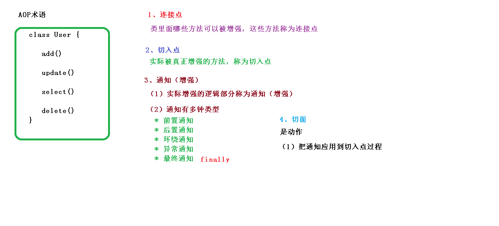

# Spring-AOP概念及使用教程

## AOP 基本概念

 （1）面向切面编程（方面），利用 AOP 可以对业务逻辑的各个部分进行隔离，从而使得 业务逻辑各部分之间的耦合度降低，提高程序的可重用性，同时提高了开发的效率。

 （2）通俗描述：不通过修改源代码方式，在主干功能里面添加新功能

 （3）使用登录例子说明 AOP

## AOP（底层原理）

 a）AOP 底层使用动态代理 ，动态代理有两种情况：

第一种 有接口情况，使用 JDK 动态代理 ；创建接口实现类代理对象，增强类的方法

第二种 没有接口情况，使用 CGLIB 动态代理；创建子类的代理对象，增强类的方法

## AOP（JDK 动态代理）

 1）使用 JDK 动态代理，使用 Proxy 类里面的方法创建代理对象

调用 newProxyInstance 方法，方法有三个参数：

~~~java
public static Object newProxyInstance(ClassLoader loader,
                                      Class<?>[] interfaces,
                                      InvocationHandler h)
~~~

-  第一参数，类加载器
-  第二参数，增强方法所在的类，这个类实现的接口，支持多个接口

-  第三参数，实现这个接口 InvocationHandler，创建代理对象，写增强的部分

 2）编写 JDK 动态代理代码

UserDAO

~~~java
package com.ado;

public interface UserDAO {
    int add(int a,int b);
    String update(String id);
}
~~~

UserDaoImpl

~~~java
package com.ado;

public class UserDaoImpl implements UserDAO {

    @Override
    public int add(int a, int b) {
        System.out.println("UserDaoImpl add..........");
        return a+b;
    }

    @Override
    public String update(String id) {
        System.out.println("UserDaoImpl update........");
        return id;
    }
}

~~~

创建实现InvocationHandler接口的代理类

~~~java
package com.Service;

import java.lang.reflect.InvocationHandler;
import java.lang.reflect.Method;
import java.util.Arrays;

//创建代理对象代码
public class UserProxy implements InvocationHandler {

    // 需要代理的对象（就是需要添加扩展的对象）
    private Object obj;

    // 将需要进行代理的对象传进来
    public UserProxy(Object obj){
        this.obj=obj;
    }

    /**
     * AOP动态代理的实现方法：
     *      通过实现InvocationHandler接口 的invoke方法 来实现Aop功能
     * @param proxy
     * @param method    执行的方法
     * @param args      执行方法的参数
     * @return
     * @throws Throwable
     */
    @Override
    public Object invoke(Object proxy, Method method, Object[] args) throws Throwable {
        // 执行方法前
        System.out.println("执行方法前：方法名称-"+method.getName()+";传入的参数："+ Arrays.toString(args));

        // 执行方法
        Object result = method.invoke(obj,args);// 执行方法需要指定 对象，和方法参数
        System.out.println("执行方法完成。。。。。。。。");

        //执行方法后
        System.out.println("执行方法后：执行方法的对象-"+obj);

        // 返回方法执行的结果（可以进行加工）
        return result;
    }
}

~~~

Service

~~~java
package com.Service;

import com.ado.UserDAO;
import com.ado.UserDaoImpl;

import java.lang.reflect.Proxy;

public class UserService {
    public static void main(String[] args) {
        // 1.定义需要进行扩展的对象
        UserDaoImpl dao = new UserDaoImpl();
        // 2.定义这个需要扩展类型所实现的接口（一个类可以实现多个接口，所以这里是数组）
        Class[] interfaces={UserDAO.class};

        /**
         * 3.创建扩展后的对象
         *      通过 Proxy对象的 newProxyInstance方法创建动态代理； newProxyInstance方法有三个参数
         *          1）类的构造器
         *          2）需要代理的类的实现接口
         *          3）实现InvocationHandler接口的对象
         *      返回结果是Object类型，需要强转
         */
        UserDAO userDao =(UserDAO)Proxy.newProxyInstance(UserService.class.getClassLoader(), interfaces, new UserProxy(dao));

        userDao.add(1,2);
    }
}
~~~

## AOP（术语）

 a）连接点：类里面哪些方法可以被增强，这些方法称为连接点

 b）切入点：实际被真正增强的方法称为切入点

 c）通知（增强）：实际增强的逻辑部分称为通知，且分为以下五种类型：

- 1）前置通知	@Before
- 2）后置通知    @AfterReturning
- 3）环绕通知    @Around
- 4）异常通知    @AfterThrowing
- 5）最终通知    @After

执行顺序（没有异常的情况）：环绕通知（前）	——>	前置通知	——>	后置通知	——>	最终通知——>	环绕通知

 d）切面：把通知应用到切入点过程

## AOP 操作（准备工作）

1、Spring 框架一般都是基于 AspectJ 实现 AOP 操作 

​	AspectJ 不是 Spring 组成部分，独立 AOP 框架，一般把 AspectJ 和 Spirng 框架一起使 用，进行 AOP 操作 

2、基于 AspectJ 实现 AOP 操作 

​	（1）基于 xml 配置文件实现 

​	（2）基于注解方式实现（使用）

3、在项目工程里面引入 AOP 相关依赖

~~~xml
<dependencies>
    <!-- 基于Maven依赖传递性，导入spring-context依赖即可导入当前所需所有jar包 -->
    <dependency>
        <groupId>org.springframework</groupId>
        <artifactId>spring-context</artifactId>
        <version>5.3.1</version>
    </dependency>
    <!-- junit测试 -->
    <dependency>
        <groupId>junit</groupId>
        <artifactId>junit</artifactId>
        <version>4.12</version>
        <scope>test</scope>
    </dependency>
    <!-- spring-aspects会帮我们传递过来aspectjweaver -->
    <dependency>
        <groupId>org.springframework</groupId>
        <artifactId>spring-aspects</artifactId>
        <version>5.3.1</version>
    </dependency>
</dependencies>
~~~

4、切入点表达式 

（1）切入点表达式作用：知道对哪个类里面的哪个方法进行增强 

（2）语法结构：<b> `execution([权限修饰符] [返回类型] [类全路径] [方法名称]([参数列表]))`</b>

- 举例 1：对 com.atguigu.dao.BookDao 类里面的 add 进行增强 execution(* com.atguigu.dao.BookDao.add(..)) 
- 举例 2：对 com.atguigu.dao.BookDao 类里面的所有的方法进行增强 execution(* com.atguigu.dao.BookDao.* (..)) 
- 举例 3：对 com.atguigu.dao 包里面所有类，类里面所有方法进行增强 execution(* com.atguigu.dao.*.* (..))

## AOP 操作（AspectJ 注解）

### 案例

1、配置xml

- 需要引入aop 和 context  空间
- 开启注解扫描
- 开启 Aspect 生成代理对象

~~~xml
<?xml version="1.0" encoding="UTF-8"?>
<!-- 需要引入aop 和 context  空间-->
<beans xmlns="http://www.springframework.org/schema/beans"
       xmlns:xsi="http://www.w3.org/2001/XMLSchema-instance"
       xmlns:context="http://www.springframework.org/schema/context"
       xmlns:aop="http://www.springframework.org/schema/aop"
       xsi:schemaLocation="http://www.springframework.org/schema/beans http://www.springframework.org/schema/beans/spring-beans.xsd
                        http://www.springframework.org/schema/context http://www.springframework.org/schema/context/spring-context.xsd
                        http://www.springframework.org/schema/aop http://www.springframework.org/schema/aop/spring-aop.xsd">

    <!-- 开启注解扫描 -->
    <context:component-scan base-package="com"></context:component-scan>

    <!-- 开启 Aspect 生成代理对象-->
    <aop:aspectj-autoproxy></aop:aspectj-autoproxy>

</beans>
~~~

2、配置不同类型的通知

User

~~~java
package com.aop.anno;

import org.springframework.stereotype.Component;

@Component // 注入
public class User {

    public void add(){
        System.out.println("user add ........");
    }
}
~~~

user的代理类

~~~java
package com.aop.anno;

import org.aspectj.lang.ProceedingJoinPoint;
import org.aspectj.lang.annotation.*;
import org.springframework.stereotype.Component;

@Component // 注入
@Aspect // 设置为代理对象
public class UserProxy {

    @Before("execution(* com.aop.anno.User.* (..))")
    public void before(){
        System.out.println("前置通知。。。。。。。。。");
    }

    @After("execution(* com.aop.anno.User.*(..))")
    public void after() {
        System.out.println("最终通知........");
    }

    @AfterReturning("execution(* com.aop.anno.User.*(..))")
    public void afterReturning(){
        System.out.println("后置通知................");
    }

    @AfterThrowing("execution(* com.aop.anno.User.*(..))")
    public void afterThrowing(){
        System.out.println("错误通知.............");
    }

    @Around("execution(* com.aop.anno.User.*(..))")
    public void around(ProceedingJoinPoint proceedingJoinPoint) throws Throwable {
        System.out.println("around  环绕通知之前。。。。。。。。。。。。。。");
        proceedingJoinPoint.proceed();
        System.out.println("around  环绕通知之后。。。。。。。。。。。。。。");
    }
}
~~~

测试

~~~java
	@Test
    public void test(){
        ApplicationContext context=new ClassPathXmlApplicationContext("bean1.xml");
        User user = context.getBean("user", User.class); // 这种方式，不用手动转换类型
        user.add();
    }
~~~

执行结合：

~~~
around  环绕之前。。。。。。。。。。。。。。
前置通知。。。。。。。。。
user add ........
后置通知................
最终通知........
around  环绕之后。。。。。。。。。。。。。。

进程已结束，退出代码为 0
~~~

### 相同的切入点抽取

<b>可以使用@Pointcut注解对 execution表达式进行抽取</b>

示例：

~~~java
package com.aop.anno;

import org.aspectj.lang.ProceedingJoinPoint;
import org.aspectj.lang.annotation.*;
import org.springframework.stereotype.Component;

@Component // 注入
@Aspect // 设置为代理对象
public class UserProxy {

    // 相同的切入点抽取
    @Pointcut("execution(* com.aop.anno.User.* (..))")
    public void pointdemo(){

    }

    @Before("pointdemo()")
    public void before(){
        System.out.println("Before。。。。。。。。。");
    }

    @After("pointdemo()")
    public void after() {
        System.out.println("After........");
    }

    @AfterReturning("pointdemo()")
    public void afterReturning(){
        System.out.println("AfterReturning................");
    }

    @AfterThrowing("pointdemo()")
    public void afterThrowing(){
        System.out.println("AfterThrowing.............");
    }

    @Around("pointdemo()")
    public void around(ProceedingJoinPoint proceedingJoinPoint) throws Throwable {
        System.out.println("around  环绕之前。。。。。。。。。。。。。。");
        proceedingJoinPoint.proceed();
        System.out.println("around  环绕之后。。。。。。。。。。。。。。");
    }
}
~~~

### 设置优先级

有多个增强类多同一个方法进行增强，设置增强类优先级

在增强类上面添加注解 <b>@Order(数字类型值)</b>，数字类型值越小优先级越高 

~~~java
@Component 
@Aspect 
@Order(1) 
public class PersonProxy
~~~

### <b>完全使用注解开发 </b>

创建配置类，不需要创建 xml 配置文件 

~~~java
@Configuration // 设置为配置类
@ComponentScan(basePackages = "com.aop.anno") // 设置要扫描的包
@EnableAspectJAutoProxy(proxyTargetClass = true)  //开启 Aspect 生成代理对象
public class ConfigAop {
}
~~~

测试

~~~java
@Test
    public void test2(){
        // 读取配置类
        AnnotationConfigApplicationContext context = new AnnotationConfigApplicationContext(ConfigAop.class);
        User user = context.getBean("user", User.class);
        user.add();
    }
~~~

## AOP 操作（AspectJ 配置文件）

1、创建两个类，增强类和被增强类，创建方法 

2、在 spring 配置文件中创建两个类对象 

~~~xml
<!--创建对象-->
<bean id="book" class="com.atguigu.spring5.aopxml.Book"></bean>
<bean id="bookProxy" class="com.atguigu.spring5.aopxml.BookProxy"></bean>
~~~

3、在 spring 配置文件中配置切入点        

~~~xml
<!--配置 aop 增强-->
<aop:config>
 <!--切入点-->
 <aop:pointcut id="p" expression="execution(*
com.atguigu.spring5.aopxml.Book.buy(..))"/>
 <!--配置切面-->
 <aop:aspect ref="bookProxy">
 <!--增强作用在具体的方法上-->
 <aop:before method="before" pointcut-ref="p"/>
 </aop:aspect>
</aop:config>
~~~

