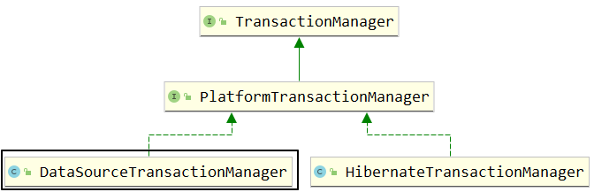
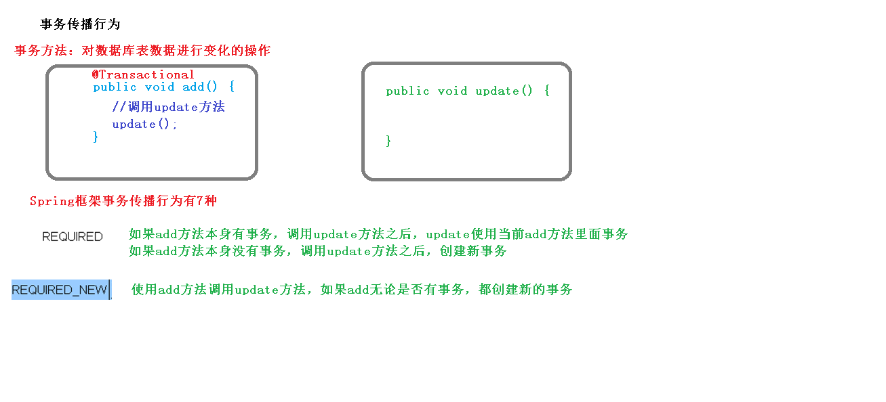
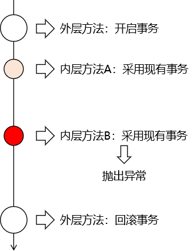
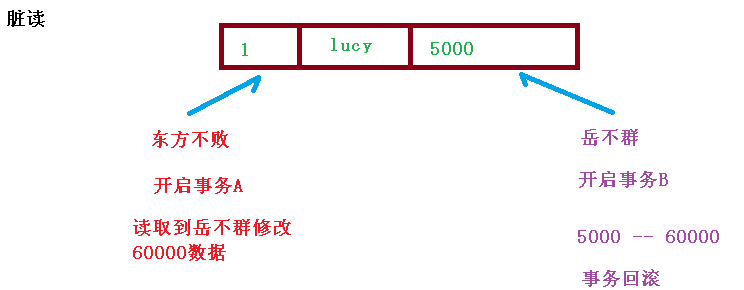
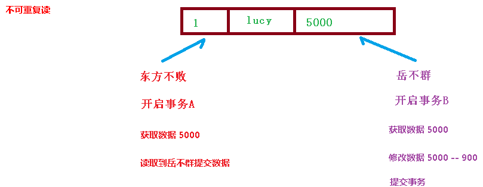

# 事务

## 事务概念

1、什么事务 

（1）事务是数据库操作最基本单元，逻辑上一组操作，要么都成功，如果有一个失败所有操 作都失败 

（2）典型场景：银行转账

* lucy 转账 100 元 给 mary
* lucy 少 100，mary 多 100

2、<font size=4 color=blue><b>事务四个特性（ACID） </b></font>

（1）原子性 ：要么都执行，要么都不执行

（2）一致性 ：执行前和执行后的总量是不变的。例如：小明和小红各有100，两个人一共有200；小明给小红了一百，两人一共还是有200；

（3）隔离性 ：在多事务操作时，事务之间不会相互影响；例如：两个人都去操作同一条记录，他们之间是不会产生影响的

（4）持久性：当事务提交后，表中的数据发生改变

## 事务操作

### 搭建事务操作环境

1、创建数据库，创建表，添加数据

- 数据库：userdb

- 表：t_user

- 数据：

  | id   | 姓名 | 钱   |
  | ---- | ---- | ---- |
  | 1    | tom  | 1000 |
  | 2    | jie  | 1000 |

  

2、创建 service，搭建 dao，完成对象创建和注入关系

1）引用包

~~~xml
<dependencies>

        <!-- 基于Maven依赖传递性，导入spring-context依赖即可导入当前所需所有jar包 -->
        <dependency>
            <groupId>org.springframework</groupId>
            <artifactId>spring-context</artifactId>
            <version>5.3.1</version>
        </dependency>

        <!-- Spring 持久化层支持jar包 -->
        <!-- Spring 在执行持久化层操作、与持久化层技术进行整合过程中，需要使用orm、jdbc、tx三个jar包 -->
        <!-- 导入 orm 包就可以通过 Maven 的依赖传递性把其他两个也导入 -->
        <dependency>
            <groupId>org.springframework</groupId>
            <artifactId>spring-orm</artifactId>
            <version>5.3.1</version>
        </dependency>

        <!-- Spring 测试相关 -->
        <dependency>
            <groupId>org.springframework</groupId>
            <artifactId>spring-test</artifactId>
            <version>5.3.1</version>
        </dependency>

        <!-- junit测试 -->
        <dependency>
            <groupId>junit</groupId>
            <artifactId>junit</artifactId>
            <version>4.12</version>
            <scope>test</scope>
        </dependency>

        <!-- MySQL驱动(注意版本！) -->
        <dependency>
            <groupId>mysql</groupId>
            <artifactId>mysql-connector-java</artifactId>
            <version>8.0.11</version>
        </dependency>
        <!-- 数据源(注意版本！) -->
        <dependency>
            <groupId>com.alibaba</groupId>
            <artifactId>druid</artifactId>
            <version>1.0.9</version>
        </dependency>

    </dependencies>
~~~


2）xml配置

~~~xml
<?xml version="1.0" encoding="UTF-8"?>
<beans xmlns="http://www.springframework.org/schema/beans"
       xmlns:xsi="http://www.w3.org/2001/XMLSchema-instance"
       xmlns:context="http://www.springframework.org/schema/context"
       xmlns:aop="http://www.springframework.org/schema/aop"
       xsi:schemaLocation="http://www.springframework.org/schema/beans http://www.springframework.org/schema/beans/spring-beans.xsd
                        http://www.springframework.org/schema/context http://www.springframework.org/schema/context/spring-context.xsd
                        http://www.springframework.org/schema/aop http://www.springframework.org/schema/aop/spring-aop.xsd">

    <!--开启组件扫描-->
    <context:component-scan base-package="com"></context:component-scan>

    <!--配置数据源-->
    <bean id="dataSource" class="com.alibaba.druid.pool.DruidDataSource"
          destroy-method="close">
        <property name="url" value="jdbc:mysql://localhost:3306/userdb?useSSL=false" />
        <property name="username" value="root" />
        <property name="password" value="123456" />
        <property name="driverClassName" value="com.mysql.cj.jdbc.Driver" />
    </bean>

    <!--配置JdbcTemplate-->
    <bean id="jdbcTemplate" class="org.springframework.jdbc.core.JdbcTemplate">
        <property name="dataSource" ref="dataSource"/>
    </bean>

</beans>
~~~


2）创建环境

- service 注入 dao，在 dao 注入 JdbcTemplate，在 JdbcTemplate 注入 DataSource
- 在 dao 创建两个方法：多钱和少钱的方法，在 service 创建方法（转账的方法）
- 并在Service中报错

​	Dao

~~~java
// 接口
public interface UserDao {
    // 加钱的方法
    void addMnoey();

    // 减钱的方法
    void reduceMoney();
}


// 实现类
@Repository
public class UserDaoImpl implements UserDao{

    // 将JdbcTemplate注入
    @Autowired
    private JdbcTemplate jdbcTemplate;

    // 加钱的方法
    @Override
    public void addMnoey() {
        String sql = "UPDATE t_user SET money=money+? WHERE name=?";
        Object[] args={100,"tom"};
        jdbcTemplate.update(sql,args);
    }

    // 减钱的方法
    @Override
    public void reduceMoney() {
        String sql = "UPDATE t_user SET money=money-? WHERE name=?";
        Object[] args={100,"jie"};
        jdbcTemplate.update(sql,args);
    }
}


~~~

​	Service

~~~java
@Service
public class UserService {

    @Resource
    private UserDao userDao;

    public void accountMoney(){
        userDao.reduceMoney();
        int aa= 10/0; // 报错
        userDao.addMnoey();
    }

}
~~~

### Spring 事务管理介绍

> 事务添加到 JavaEE 三层结构里面 Service 层（业务逻辑层）

<font size=4 color=blue><b>在 Spring 进行事务管理操作 </b></font>

有两种方式：

- 编程式事务管理
- 声明式事务管理（使用）


#### 编程式事务管理（不推荐）

~~~java
try {
    // 1.开启事务

    // 2.进行事务操作

    // 3.没有发生错误，提交事务
} catch (Exception e) {

    // 4.出现异常，事务回滚
}finally{
	
	// 5.释放数据库连接
	conn.close();
	
}
~~~

编程式的实现方式存在缺陷：

- 细节没有被屏蔽：具体操作过程中，所有细节都需要程序员自己来完成，比较繁琐。
- 代码复用性不高：如果没有有效抽取出来，每次实现功能都需要自己编写代码，代码就没有得到复用。

#### 声明式事务管理（推荐）

1、好处

既然事务控制的代码有规律可循，代码的结构基本是确定的，所以框架就可以将固定模式的代码抽取出来，进行相关的封装。

封装起来后，我们只需要在配置文件中进行简单的配置即可完成操作。

- 好处1：提高开发效率
- 好处2：消除了冗余的代码
- 好处3：框架会综合考虑相关领域中在实际开发环境下有可能遇到的各种问题，进行了健壮性、性能等各个方面的优化

所以，我们可以总结下面两个概念：

- **编程式**：**自己写代码**实现功能
- **声明式**：通过**配置**让**框架**实现功能


2、使用方式：

- （1）<font size=4 color=blue><b>基于注解方式（使用） </b></font>
- （2）基于 xml 配置文件方式


3、在 Spring 进行声明式事务管理，底层使用 AOP 原理

**4、Spring 事务管理 API**

> 提供一个接口，代表事务管理器，这个接口针对不同的框架提供不同的实现类



<font size=4 color=blue>我们现在要使用的事务管理器是org.springframework.jdbc.datasource.<b>DataSourceTransactionManager</b>，将来整合 Mybatis 用的也是这个类。</font>

### 注解声明式事务管理

1、<font size=4 color=blue><b>在 spring 配置文件配置事务管理器</b></font>

~~~xml
<!--  配置(声明)事务管理器  -->
    <bean id="transactionManager" class="org.springframework.jdbc.datasource.DataSourceTransactionManager">
        <!--  配置事务管理器 需要指定装配的数据  -->
        <property name="dataSource" ref="dataSource"/>
    </bean>
~~~

2、在 spring 配置文件，开启事务注解

​		1）<font size=4 color=blue><b>在 spring 配置文件引入名称空间 tx</b></font>

~~~xml
<?xml version="1.0" encoding="UTF-8"?>
<beans xmlns="http://www.springframework.org/schema/beans"
       xmlns:xsi="http://www.w3.org/2001/XMLSchema-instance"
       xmlns:context="http://www.springframework.org/schema/context"
       xmlns:aop="http://www.springframework.org/schema/aop"
       xmlns:tx="http://www.springframework.org/schema/tx"
       xsi:schemaLocation="http://www.springframework.org/schema/beans http://www.springframework.org/schema/beans/spring-beans.xsd
                        http://www.springframework.org/schema/context http://www.springframework.org/schema/context/spring-context.xsd
                        http://www.springframework.org/schema/aop http://www.springframework.org/schema/aop/spring-aop.xsd
                        http://www.springframework.org/schema/tx http://www.springframework.org/schema/tx/spring-tx.xsd">

~~~

​	2）<font size=4 color=blue><b>开启事务注解</b></font>

~~~xml
    <!--  基于注解的声明式事务功能  -->
    <!--  tx:annotation-driven：用于配置事务  -->
    <!--  transaction-manager：用来指定配置的事务管理器的bean -->
    <tx:annotation-driven transaction-manager="transactionManager"/>
    <!-- transaction-manager属性的默认值是transactionManager，如果事务管理器bean的id正好就是这个默认值，则可以省略这个属性 -->

~~~

3、<font size=4 color=blue><b>在 service 类上面（或者 service 类里面方法上面）添加事务注解 </b></font>

- （1）@Transactional，这个注解添加到类上面，也可以添加方法上面 
- （2）如果把这个注解添加类上面，这个类里面所有的方法都添加事务
- （3）如果把这个注解添加方法上面，为这个方法添加事务

~~~java
@Service
@Transactional // 启用事务
public class UserService {}
~~~

完整示例：

​		配置文件

~~~xml
<?xml version="1.0" encoding="UTF-8"?>
<beans xmlns="http://www.springframework.org/schema/beans"
       xmlns:xsi="http://www.w3.org/2001/XMLSchema-instance"
       xmlns:context="http://www.springframework.org/schema/context"
       xmlns:aop="http://www.springframework.org/schema/aop"
       xmlns:tx="http://www.springframework.org/schema/tx"
       xsi:schemaLocation="http://www.springframework.org/schema/beans http://www.springframework.org/schema/beans/spring-beans.xsd
                        http://www.springframework.org/schema/context http://www.springframework.org/schema/context/spring-context.xsd
                        http://www.springframework.org/schema/aop http://www.springframework.org/schema/aop/spring-aop.xsd
                        http://www.springframework.org/schema/tx http://www.springframework.org/schema/tx/spring-tx.xsd">

    <!--开启组件扫描-->
    <context:component-scan base-package="com"></context:component-scan>

    <!--配置数据源-->
    <bean id="dataSource" class="com.alibaba.druid.pool.DruidDataSource"
          destroy-method="close">
        <property name="url" value="jdbc:mysql://localhost:3306/userdb?useSSL=false" />
        <property name="username" value="root" />
        <property name="password" value="123456" />
        <property name="driverClassName" value="com.mysql.cj.jdbc.Driver" />
    </bean>

    <!--配置JdbcTemplate-->
    <bean id="jdbcTemplate" class="org.springframework.jdbc.core.JdbcTemplate">
        <property name="dataSource" ref="dataSource"/>
    </bean>

    <!--  配置(声明)事务管理器  -->
    <bean id="transactionManager" class="org.springframework.jdbc.datasource.DataSourceTransactionManager">
        <!--  配置事务管理器 需要指定装配的数据  -->
        <property name="dataSource" ref="dataSource"/>
    </bean>

    <!--  基于注解的声明式事务功能  -->
    <!--  tx:annotation-driven：用于配置事务  -->
    <!--  transaction-manager：用来指定配置的事务管理器的bean -->
    <tx:annotation-driven transaction-manager="transactionManager"/>
    <!-- transaction-manager属性的默认值是transactionManager，如果事务管理器bean的id正好就是这个默认值，则可以省略这个属性 -->

</beans>
~~~

Service的使用

~~~java

@Service
@Transactional // 启用事务
public class UserService {

    @Resource
    private UserDao userDao;

    public void accountMoney() {
        userDao.reduceMoney();
        int aa = 10 / 0;
        userDao.addMnoey();
    }

}
~~~

### 声明式事务管理参数配置

在 service 类上面 添加注解@Transactional，在这个注解里面可以配置事务相关参数


#### propagation：事务传播行为



事务的传播行为一共有7种，常用的有REQUIRED和<font size=4 color=blue><b>REQUIRES_NEW</b></font>两种

| REQUIRED <br/>默认值                              | 当前方法必须工作在事务中 如果当前线程上有已经开启的事务可用，那么就在这个事务中运行 如果当前线程上没有已经开启的事务，那么就自己开启新事务，在新事务中运行 所以当前方法有可能和其他方法共用事务 在共用事务的情况下：当前方法会因为其他方法回滚而受**连累** |
| ------------------------------------------------- | ------------------------------------------------------------ |
| <font color=blue>**REQUIRES_NEW** </font>建议使用 | 当前方法必须工作在事务中 不管当前线程上是否有已经开启的事务，都要开启新事务 在新事务中运行 不会和其他方法共用事务，避免被其他方法连累 |

~~~java
@Service
@Transactional(propagation = Propagation.REQUIRES_NEW) // 启用事务，使用REQUIRES_NEW传播行为
public class UserService {
~~~

模拟场景

- 1）Dao层中创建两个方法，方法A，和方法B
  - 在方法A和方法B上启动事务
- 2）在Service层中的一个方法中同时调用方法A和方法B（外层）
  - 在外层中启动事务

当Dao层使用REQUIRED隔离级别时，流程图




当Dao层使用REQUIRED_NEW隔离级别时，流程图


#### isolation：事务隔离级别 

（1）事务有特性成为隔离性，多事务操作之间不会产生影响。不考虑隔离性产生很多问题 

（2）有三个读问题：脏读、不可重复读、虚（幻）读 

（3）脏读：<font size=4 color=blue>一个未提交事务读取到另一个未提交事务的数据</font>




（4）不可重复读：一个未提交事务读取到另一提交事务修改数据




（5）虚读：一个未提交事务读取到另一提交事务添加数据

（6）解决：通过设置事务隔离级别，解决读问题

|                                           | 脏读 | 不可重复读 | 虚（幻）读 |
| ----------------------------------------- | ---- | ---------- | ---------- |
| READ_UNCOMMITTED<br/>（读未提交）         | 有   | 有         | 有         |
| READ_COMMITTED<br/>（读已提交）           | 无   | 有         | 有         |
| REPEATABLE_READ<br/>（可重复读）MySql默认 | 无   | 无         | 有         |
| SERIALIZABLE<br/>（串行化）               | 无   | 无         | 无         |

~~~java
@Service
@Transactional(isolation = Isolation.SERIALIZABLE) // 启用事务，设置隔离级别
public class UserService {}
~~~

#### timeout：超时时间

（1）事务需要在一定时间内进行提交，如果不提交进行回滚 

（2）默认值是 -1 ，设置时间以秒单位进行计算 

#### readOnly：是否只读 

（1）读：查询操作，写：添加修改删除操作 

（2）readOnly 默认值 false，表示可以查询，可以添加修改删除操作 

（3）设置 readOnly 值是 true，设置成 true 之后，只能查询 

#### rollbackFor：回滚

 （1）设置出现哪些异常进行事务回滚 

#### noRollbackFor：不回滚 

（1）设置出现哪些异常不进行事务回滚

### XML 声明式事务管理

在 spring 配置文件中进行配置

- 第一步 配置事务管理器
- 第二步 配置通知
- 第三步 配置切入点和切面

~~~xml
<?xml version="1.0" encoding="UTF-8"?>
<beans xmlns="http://www.springframework.org/schema/beans"
       xmlns:xsi="http://www.w3.org/2001/XMLSchema-instance"
       xmlns:context="http://www.springframework.org/schema/context"
       xmlns:aop="http://www.springframework.org/schema/aop"
       xmlns:tx="http://www.springframework.org/schema/tx"
       xsi:schemaLocation="http://www.springframework.org/schema/beans http://www.springframework.org/schema/beans/spring-beans.xsd
                        http://www.springframework.org/schema/context http://www.springframework.org/schema/context/spring-context.xsd
                        http://www.springframework.org/schema/aop http://www.springframework.org/schema/aop/spring-aop.xsd
                        http://www.springframework.org/schema/tx http://www.springframework.org/schema/tx/spring-tx.xsd">

    <!--  开启扫描  -->
    <context:component-scan base-package="com"/>

    <!--  配置数据源  -->
    <bean id="dataSource" class="com.alibaba.druid.pool.DruidDataSource">
        <property name="username" value="root"/>
        <property name="password" value="123456"/>
        <property name="url" value="jdbc:mysql://localhost:3306/userdb?useSSL=false"/>
        <property name="driverClassName" value="com.mysql.cj.jdbc.Driver"/>
    </bean>

    <!--配置JdbcTemplate-->
    <bean id="jdbcTemplate" class="org.springframework.jdbc.core.JdbcTemplate">
        <property name="dataSource" ref="dataSource"/> <!--配置数据源-->
    </bean>

    <!--1.配置事务管理器-->
    <bean id="transactionManager" class="org.springframework.jdbc.datasource.DataSourceTransactionManager">
        <property name="dataSource" ref="dataSource"/>
    </bean>

    <!-- 2.设置要启用事务的方法 -->
    <tx:advice id="advice" >
        <!--配置事务参数-->
        <tx:attributes>
            <!--指定哪种规则的方法上面添加事务-->
            <tx:method name="accountMoney" propagation="REQUIRES_NEW"/>
            <!--<tx:method name="account*"/>-->
        </tx:attributes>
    </tx:advice>

    <!--3 配置切入点和切面-->
    <aop:config>
        <!--  设置切点  -->
        <aop:pointcut id="pt" expression="execution(* com.Service.UserService.*(..))"/>

        <!--设置切面-->
        <aop:advisor advice-ref="advice" pointcut-ref="pt"/><!--将advice-ref放到pointcut-ref中-->
    </aop:config>

</beans>
~~~

将注解启动事务注释

```java
@Service
//@Transactional(propagation = Propagation.REQUIRES_NEW,isolation = Isolation.SERIALIZABLE) // 启用事务
public class UserService {}
```

AOP报错：

导入这个三个包

~~~xml
<!-- https://mvnrepository.com/artifact/org.aspectj/aspectjrt -->
        <dependency>
            <groupId>org.aspectj</groupId>
            <artifactId>aspectjrt</artifactId>
            <version>1.9.6</version>
        </dependency>

        <!-- https://mvnrepository.com/artifact/org.aspectj/aspectjweaver -->
        <dependency>
            <groupId>org.aspectj</groupId>
            <artifactId>aspectjweaver</artifactId>
            <version>1.9.6</version>
        </dependency>

        <!-- https://mvnrepository.com/artifact/org.aopalliance/com.springsource.org.aopalliance -->
        <dependency>
            <groupId>org.aopalliance</groupId>
            <artifactId>com.springsource.org.aopalliance</artifactId>
            <version>1.0.0</version>
        </dependency>
~~~

### 完全注解声明式事务管理

配置类

~~~java
@Configuration // 声明配置类
@ComponentScan(basePackages = {"com"}) // 设置要扫描的包
@EnableTransactionManagement    // 使用事务
public class configTransaction {

    // 创建数据连接池
    @Bean
    public DataSource getDataSource(){
        DruidDataSource dataSource = new DruidDataSource();
        dataSource.setUsername("root");
        dataSource.setPassword("123456");
        dataSource.setUrl("jdbc:mysql://localhost:3306/userdb?useSSL=false");
        dataSource.setDriverClassName("com.mysql.cj.jdbc.Driver");
        return dataSource;
    }

    //创建 JdbcTemplate 对象
    // dataSource参数，在ioc中已经存在，直接带进了就行
    @Bean
    public JdbcTemplate getJdbcTemplate(DataSource dataSource){
        JdbcTemplate jdbcTemplate = new JdbcTemplate();
        jdbcTemplate.setDataSource(dataSource);
        return jdbcTemplate;
    }


    //创建事务管理器
    @Bean
    public DataSourceTransactionManager getDataSourceTransactionManager(DataSource dataSource){
        DataSourceTransactionManager dataSourceTransactionManager = new DataSourceTransactionManager();
        dataSourceTransactionManager.setDataSource(dataSource);
        return dataSourceTransactionManager;
    }
}
~~~


