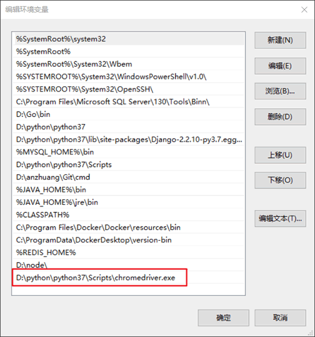
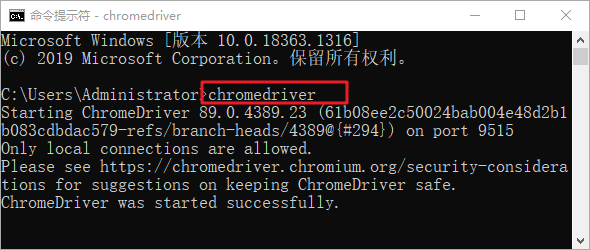

# Python Selenium的下载和安装

## Selenium下载安装

Selenium 安装非常简单，Linux、Mac 用户执行以下命令即可：

```
sudo pip install Selenium
```

Windows 用户执行以下命令即可实现安装：

```
python -m pip install selenium
```

除了使用上述命令安装外，您也可以通过官方网站下载 Selenium WebDriver 安装包，[点击前往下载](https://www.selenium.dev/downloads/)。

## 安装浏览器驱动

若想使 Selenium 能够调用浏览器，那么必须通过 webdriver 驱动来实现。不同的浏览器需要使用不同驱动程序，下面列出了不同浏览器驱动程序的下载地址：

- 谷歌浏览器 chromedrive：http://chromedriver.storage.googleapis.com/index.html
- 火狐浏览器 geckodriver：https://github.com/mozilla/geckodriver/releases
- IE 浏览器 IEDriver：http://selenium-release.storage.googleapis.com/index.html


各种浏览器的驱动安装规程基本一致。不过需要注意：安装 Chrome、Firefox 驱动时，需要下载与浏览器版本相匹配的驱动程序，否则不能驱动浏览器。而 IE 较为特殊，您需要下载与 Selenium 版本相匹配的驱动文件，如下所示：


图1：IE 驱动下载


下面以 Windows10 平台 Chrome 浏览器为例讲解。首先检查浏览器版本号，并下载相应驱动文件，然后解压文件，将 Chromedriver.exe 文件拷贝到 Python 安装目录的 Scripts 目录下，最后将其添加到系统环境变量中。使用如下命令可查看 Python 安装路径：

```
where python
```

您需要根据自己安装路径进行配置，我的环境变量配置如下：



图2：配置环境变量

上述操作完成后，在 CMD 命令行启动驱动程序，如下所示：



图3：驱动开启成功

开启成功后，驱动程序会在后台运行。

## 自动访问百度

编写如下代码，实现自动化访问百度。

```python
# 导入seleinum webdriver接口
from selenium import webdriver
import time

# 创建Chrome浏览器对象
browser = webdriver.Chrome()

#访问百度网站
browser.get('http://www.baidu.com/')

#阻塞3秒
time.sleep(3)

# 自动退出浏览器
browser.quit()
```

截取了运行中的显示结果，如下所示：


图4：Selenium自动化访问百度


经过上述代测试，说明我们安装的浏览器驱动可以正常工作。Selenium WebDriver 实现了许多操作浏览器功能。比如实现自动点击、自动输入、自动搜索、自动登录等等。

毫不夸张的说，Selenium 自动化爬虫是一种万能的爬虫程序，它可以仿照人的样子去打开网站，并拿到你想要的数据，因此你无须在意反爬措施。不过它最致命的缺点就是效率很低，因为每次点击、输入等操作都需要花费一定的时间，因此它仅适用于小批量的数据抓取。


# Python Selenium基本用法

Selenium 作为一款 Web 自动化测试框架，提供了诸多操作浏览器的方法，本节对其中的常用方法做详细介绍。

## 定位节点

Selenium 提供了 8 种定位单个节点的方法，如下所示：


| 方法                                | 说明                                    |
| ----------------------------------- | --------------------------------------- |
| find_element_by_id()                | 通过 id 属性值定位                      |
| find_element_by_name()              | 通过 name 属性值定位                    |
| find_element_by_class_name()        | 通过 class 属性值定位                   |
| find_element_by_tag_name()          | 通过 tag 标签名定位                     |
| find_element_by_link_text()         | 通过<a>标签内文本定位，即精准定位。     |
| find_element_by_partial_link_text() | 通过<a>标签内部分文本定位，即模糊定位。 |
| find_element_by_xpath()             | 通过 xpath 表达式定位                   |
| find_element_by_css_selector()      | 通过 css 选择器定位                     |


假设下面代码某个页面的代码片段，如下所示：

```html
<html>
    <head>
        <body link="#cc0916">  
            <a id="logo" href="http://c.biancheng.net" onclick="">   
                <form id="form" class="fm" name="f" action="c.biancheng.net">    
                    <span class="btn"></span>    
                    <input id="kw" class="s_ipt_wr" name="wd" value="" maxlength="255" autocomplete="off">
                    </body>
                </head>
            </html>
```

下面使用表格中提供的方法定位 input 输出框。如下所示：

```python
#创建browser是浏览器对象
browser = webdriver.Chrome()

#访问某个url得到上述代码片段
browser.get('url')

#通过id定义输入框
browser.dr.find_element_by_id("kw")

#通过class定义
browser.find_element_by_class_name("s_ipt_wr")

#通过name定位
browser.find_element_by_name("wd")

#通过tag name定位:
browser.find_element_by_tag_name("input")

#通过xpath定位
browser.find_element_by_xpath("//*[@id='kw']")

#通过css选择器定位
browser.find_element_by_css_selector("#kw")
```

通过 a 标签内的文本内容定位节点，如下所示：

```html
<a class="vip" href="http://c.baincheng.net">C语言中文网</a>
<a class="search" href="http://www.baidu.com">hao123</a>
```

示例如下：

```python
#使用全部文本内容定位链接
browser.find_element_by_link_text("c语言中文网")
#使用部分文本内容定位链接
browser.find_element_by_partial_link_text("123")
```

如果您想定位一组元素，方法如下所示：

```python
find_elements_by_id()
find_elements_by_name()
find_elements_by_class_name()
find_elements_by_tag_name()
find_elements_by_link_text()
find_elements_by_partial_link_text()
find_elements_by_xpath()
find_elements_by_css_selector()
```

定位一组元素的方法与定位单个元素类似，唯一的区别就是 element 后面多了一个 s（表示复数），因此上述方法的返回值是一个列表，您可以使用 for 循环拿到所有的元素节点。

## 控制浏览器

Selenium 可以操控浏览器的窗口大小、刷新页面，以及控制浏览器的前进、后退等

#### 1) 设置浏览器窗口大小、位置

```python
from selenium import webdriver

driver = webdriver.Chrome()
driver.get("http://www.baidu.com")

#参数数字为像素点
driver.set_window_size(480, 800)

#设置窗口位置
driver.set_window_position(100,200)

#同时设置窗口的大小和坐标
driver.set_window_rect(450,300,32,50)

#退出浏览器
driver.quit()
```

#### 2) 控制网页前进、后退、刷新页面

```python
from selenium import webdriver
driver = webdriver.Chrome()

# 访问C语言中文网首页
first_url= 'http://c.biancheng.net'
driver.get(first_url)

# 访问c语言教程
second_url='http://c.biancheng.net/c/'
driver.get(second_url)

# 返回（后退）到c语言中文网首页
driver.back()

# 前进到C语言教程页
driver.forward()

# 刷新当前页面相当于
F5driver.refresh() 

# 退出/关闭浏览器
driver.quit()
```

## WebDriver常用方法

上文中介绍了如何定位元素，以及如何设置浏览的大小、位置。 定位元素节点只是第一步， 定位之后还需要对这个元素进行操作， 比如单击按钮，或者在输入框输入文本 ， 下面介绍 WebDriver 中的最常用方法：

```python
# 请求url
get(url)
# 模拟键盘输入文本
send_keys (value)
# 清除已经输入的文本
clear()：
# 单击已经定位的元素
click()：
# 用于提交表单，比如百度搜索框内输入关键字之后的“回车” 操作
submit()：
#返回属性的属性值，返回元素的属性值，可以是id、name、type 或其他任意属性
get_attribute(name)
# 返回布尔值，检查元素是否用户可见，比如 display属性为hidden或者none
is_displayed() 
```

示例如下：

```python
from selenium import webdriver
import time

driver = webdriver.Chrome()
driver.get("https://www.baidu.com")

#模拟键盘，输出文本
driver.find_element_by_id("kw").send_keys("C语言中文网")

#单击“百度”一下查找
driver.find_element_by_id("su").click()
time.sleep(3)

#退出浏览器
driver.quit()
```

除了上述方法外， WebDriver 还有一些常用属性，如下所示：

```python
from selenium import webdriver

driver = webdriver.Chrome()

# 获取HTML结构源码
driver.page_source

#在源码中查找指定的字符串
driver.page_source.find('字符串')

# 返回百度页面底部备案信息
text = driver.find_element_by_id("cp").textprint(text)

# 获取输入框的尺寸
size = driver.find_element_by_id('kw').sizeprint(size)
```

输出结果：

```python
©2015 Baidu 使用百度前必读 意见反馈 京 ICP 证 030173 号

{'width': 500, 'height': 22}
```

## Selenium事件处理

Selenium WebDriver 提供了一些事件处理函数（鼠标、键盘等），下面我们对常用的事件函数做简单介绍。

#### 1) 鼠标事件

Selenium WebDriver 将关于鼠标的操作方法都封装在 ActionChains 类中，使用时需要引入 ActionChains 类，如下所示：

```python
from selenium.webdriver.common.action_chains import ActionChains
```

该类包含了鼠标操作的常用方法：


| 方法                            | 说明                                              |
| ------------------------------- | ------------------------------------------------- |
| ActionChains(driver)            | 构造 ActionChains 鼠标对象。                      |
| click()                         | 单击                                              |
| click_and_hold(on_element=None) | 单击鼠标左键，不松开                              |
| context_click()                 | 右击                                              |
| double_click()                  | 双击                                              |
| drag_and_drop()                 | 拖动                                              |
| move_to_element(above)          | 执行鼠标悬停操作                                  |
| context_click()                 | 用于模拟鼠标右键操作， 在调用时需要指定元素定位。 |
| perform()                       | 将所有鼠标操作提交执行。                          |


示例如下：

```python
from selenium import webdriver
#导入 ActionChains 类
from selenium.webdriver.common.action_chains import ActionChains

driver = webdriver.Chrome()
driver.get("http://c.biancheng.net")

# 通过xpath表达式定位到要悬停的元素
above = driver.find_element_by_xpath('//ul[@id="ad-link-top"]/li[1]')

# 对定位到的元素执行鼠标悬停操作
ActionChains(driver).move_to_element(above).perform()
```

#### 2) 键盘事件

Selenium WebDriver 的 Keys 模块提供了模拟键盘输入的 send_keys() 方法，除此之外，该模块也提供了操作键盘的其他方法，比如复制、粘贴等等。

在使用之前，首先需要导入 Keys 类，如下所示：

```python
from selenium.webdriver.common.keys import Keys
```

下面列举了一些常用方法：


| 方法                          | 说明                |
| ----------------------------- | ------------------- |
| send_keys(Keys.BACK_SPACE)    | 删除键（BackSpace） |
| send_keys(Keys.SPACE)         | 空格键(Space)       |
| send_keys(Keys.TAB)           | 制表键(Tab)         |
| send_keys(Keys.ESCAPE)        | 回退键（Esc）       |
| send_keys(Keys.ENTER)         | 回车键（Enter）     |
| send_keys(Keys.CONTROL,'a'）  | 全选（Ctrl+A）      |
| send_keys(Keys.CONTROL,'c')   | 复制（Ctrl+C）      |
| send_keys(Keys.CONTROL,'x')   | 剪切（Ctrl+X）      |
| send_keys(Keys.CONTROL,'v'）  | 粘贴（Ctrl+V）      |
| send_keys(Keys.F1…Fn)         | 键盘 F1…Fn          |
| keys.down(value,element=None) | 按下键盘上的某个键  |
| keys.up(value,element=None)   | 松开键盘上的某个键  |


示例如下：

```python
from selenium import webdriver
# 引入 Keys 模块
from selenium.webdriver.common.keys import Keys

driver = webdriver.Chrome()
driver.get("http://www.baidu.com")

# 输入框输入内容
driver.find_element_by_id("kw").send_keys("C语言中文网H")

# 删除多输入的一个
Hdriver.find_element_by_id("kw").send_keys(Keys.BACK_SPACE)

#单击“百度”一下查找
driver.find_element_by_id("su").click()time.sleep(3)driver.quit()
```

其它键盘操作方法，如下所示：

```python
# 输入空格键 + “Python教程”
driver.find_element_by_id("kw").send_keys(Keys.SPACE)
driver.find_element_by_id("kw").send_keys("Python教程")

# ctrl+a 全选输入框内容
driver.find_element_by_id("kw").send_keys(Keys.CONTROL, 'a')

# ctrl+x 剪切输入框内容
driver.find_element_by_id("kw").send_keys(Keys.CONTROL, 'x')

# ctrl+v 粘贴内容到输入框
driver.find_element_by_id("kw").send_keys(Keys.CONTROL, 'v')

# 使用回车键来代替单击操作
clickdriver.find_element_by_id("su").send_keys(Keys.ENTER)
```

## 无界面浏览器

Chromedriver 每一次运行都要打开浏览器，并执行相应的输入、搜索等操作，这样会导致浏览器交互能力变差，浪费许多时间。 Selenium 为了增强浏览器的交互能力，允许您使用无头浏览器模式，也就是无界面浏览器，它被广泛的应用于爬虫和自动化测试中。通过以下代码可以设置无头浏览器模式：

```python
from selenium import webdriver
import time

options=webdriver.ChromeOptions()
options.add_argument('--headless')
#无界面浏览
driver=webdriver.Chrome(options=options)
driver.get('https://www.baidu.com')

kw1=driver.find_element_by_id('kw')

print(driver.title)
time.sleep(3)
#关闭当前界面，只有一个窗口
driver.close()
#关闭所有界面
driver.quit()
```

除了可以设置无头界面之外，Selenium 还支持其他一些浏览器参数设置，如下所示：

```python
opption.add_argument('--window-size=600,600') #设置窗口大小
opption.add_argument('--incognito') #无痕模式
opption.add_argument('--disable-infobars') #去掉chrome正受到自动测试软件的控制的提示
opption.add_argument('user-agent="XXXX"') #添加请求头
opption.add_argument("--proxy-server=http://200.130.123.43:3456")#代理服务器访问
opption.add_experimental_option('excludeSwitches', ['enable-automation'])#开发者模式
opption.add_argument('blink-settings=imagesEnabled=false')  #禁止加载图片
opption.add_argument('lang=zh_CN.UTF-8') #设置默认编码为utf-8
opption.add_extension(create_proxyauth_extension(
           proxy_host='host',
           proxy_port='port',
           proxy_username="username",
           proxy_password="password"
       ))# 设置有账号密码的代理
opption.add_argument('--disable-gpu')  # 这个参数可以规避谷歌的部分bug
opption.add_argument('--disable-javascript')  # 禁用javascript
opption.add_argument('--hide-scrollbars')  # 隐藏滚动条
```

## 执行JS脚本

WebDriver 提供了 execute_script() 方法来执行 JavaScript 代码，比如控制浏览器的滚动条。示例如下：

```python
from selenium import webdriver
from time import sleep

# 访问百度
driver=webdriver.Chrome()
driver.get("http://www.baidu.com")

# 最大化浏览器窗口
driver.maximize_window()

# 搜索
driver.find_element_by_id("kw").send_keys("C语言中文网")
driver.find_element_by_id("su").click()
sleep(3)

# 通过js代码设置滚动条位置，数值代表(左边距，上边距)
js="window.scrollTo(100,500);"
#执行js代码
driver.execute_script(js)
sleep(5)
driver.quit()
```

如果想了解更多关于 Selenium 的知识，请参考官方文档：https://www.selenium.dev/documentation/en/