# Typora详解

## 一、MarkDown

### 1、MarkDown是什么

Markdown 是一种轻量级标记语言，它允许人们使用易读易写的纯文本格式编写文档。

Markdown 语言在 2004 由约翰·格鲁伯（英语：John Gruber）创建。

Markdown 编写的文档可以导出 HTML 、Word、图像、PDF、Epub 等多种格式的文档。

Markdown 编写的文档后缀为 **.md**, **.markdown**。

**常用markdown编辑器，种类繁多，自己选择自己喜欢的产品**

- Typora
- visual studio code
- Mou
- MarkdownPad
- Atom
- Haroopad
- SublimeText
- Cmd Markdown
- Byword
- CuteMarkEd
- EpicEditor
- MarkdownEditor
- MarkPad
- Draft
- Quiver
- dillinger
- Inkdrop
- Haroopad
- Notion
- Marktext
- ...

### 2、MarkDown基本语法

####  标题

使用 **#** 号可表示 1-6 级标题，一级标题对应一个 **#** 号，二级标题对应两个 **#** 号，以此类推，标题内容和**#**之间空格隔开。

代码：

```bash
# 一级标题
## 二级标题
### 三级标题
#### 四级标题
##### 五级标题
###### 六级标题
```

效果：


---

#### 字体

一个星号或者下划线包起来标识斜体，两个星号或者下划线包起来标识粗体，三个星号或者下划线就是两个效果的叠加粗体+斜体。

代码：

```bash
*斜体文本*
_斜体文本_
**粗体文本**
__粗体文本__
***粗斜体文本***
___粗斜体文本___
```

效果：

*斜体文本*
_斜体文本_
**粗体文本**
__粗体文本__
***粗斜体文本***
___粗斜体文本___

---

#### 分隔线

你可以在一行中用三个以上的星号、减号、底线来建立一个分隔线，行内不能有其他东西。你也可以在星号或是减号中间插入空格。下面每种写法都可以建立分隔线。

代码：

```bash
***
* * *
---
----------
```

效果：

***
* * *
---
----------

---

#### 删除线

如果段落上的文字要添加删除线，只需要在文字的两端加上两个波浪线 **~~** 即可

代码：

```bash
~~BAIDU.COM~~
```

效果：

~~BAIDU.COM~~

---

#### 下划线

下划线可以通过 HTML 的 **<u>** 标签来实现

代码：

```bash
<u>带下划线文本</u>
```

效果：

<u>带下划线文本</u>

---

#### 列表

> 无序列表使用星号、加号或是减号作为列表标记，这些标记后面要添加一个空格，然后再填写内容

代码：

```bash
* 第一项
* 第二项
* 第三项
+ 第一项
+ 第二项
+ 第三项
- 第一项
- 第二项
- 第三项
```

效果：

* 第一项
* 第二项
* 第三项

+ 第一项
+ 第二项
+ 第三项

- 第一项
- 第二项
- 第三项

> 有序列表使用数字并加上 **.** 号来表示

代码：

```bash
1. 第一项
2. 第二项
3. 第三项
```

效果：

1. 第一项
2. 第二项
3. 第三项

> 列表嵌套只需在子列表中的选项前面添加四个空格即可

代码：

```bash
1. 第一项：
    - 第一项嵌套的第一个元素
    - 第一项嵌套的第二个元素
2. 第二项：
    - 第二项嵌套的第一个元素
    - 第二项嵌套的第二个元素
```

效果：

1. 第一项：
    - 第一项嵌套的第一个元素
    - 第一项嵌套的第二个元素
2. 第二项：
    - 第二项嵌套的第一个元素
    - 第二项嵌套的第二个元素

---

#### 区块引用

> 常规使用

Markdown 区块引用是在段落开头使用 **>** 符号 ，然后后面紧跟一个**空格**符号

代码：

```bash
> 区块引用
> 学的不仅是技术更是梦想
```

效果：

> 区块引用
> 学的不仅是技术更是梦想

> 嵌套使用

一个 **>** 符号是最外层，两个 **>** 符号是第一层嵌套，以此类推。

代码：

```bash
> 最外层
> > 第一层嵌套
> > > 第二层嵌套
```

效果：

> 最外层
> > 第一层嵌套
> >
> > > 第二层嵌套

> 区块中使用列表

代码：

```bash
> 区块中使用列表
> 1. 第一项
> 2. 第二项
> + 第一项
> + 第二项
> + 第三项
```

效果：

> 区块中使用列表
> 1. 第一项
> 2. 第二项
> + 第一项
> + 第二项
> + 第三项

> 列表中使用区块

如果要在列表项目内放进区块，那么就需要在 **>** 前添加四个空格的缩进

代码：

```bash
* 第一项
    > 区块引用
    > 学的不仅是技术更是梦想
* 第二项
```

效果：

* 第一项
    > 区块引用
    > 学的不仅是技术更是梦想
* 第二项

---

#### 代码高亮

如果是段落上的一个函数或片段的代码可以用反引号把它包起来实现高亮

代码：

```bash
`printf()` 函数
```

效果：

`printf()` 函数

---

#### 代码段

可以用 **```** 包裹一段代码，并指定一种语言（也可以不指定）

代码：

````bash
```javascript
$(document).ready(function () {
    alert('RUNOOB');
});
```
````

效果：

```javascript
$(document).ready(function () {
    alert('RUNOOB');
});
```

---

#### 链接

中括号包住链接名称，小括号包住链接地址，用来标记链接名称和地址需要区分的地址。或者直接尖括号包住链接地址。

代码：

```bash
[链接名称](链接地址)
或者
<链接地址>
```

效果：

[链接名称](http:www.baidu.com)

<http:www.baidu.com>

---

#### 图片

开头一个感叹号 !，接着一个方括号，里面放上图片的替代文字，接着一个普通括号，里面放上图片的网址（可以是网址或者相对路径或者绝对路径），最后还可以用引号包住并加上选择性的 'title' 属性的文字。

Markdown 还没有办法指定图片的高度与宽度，如果你需要的话，你可以使用普通的 img标签。

代码：

```bash


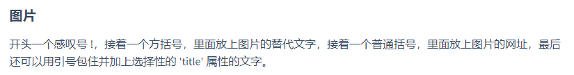
```

效果：


---

#### 表格

> Markdown 制作表格使用 **|** 来分隔不同的单元格，使用 **-** 来分隔表头和其他行

代码：

```bash
|  表头   | 表头  |
|  ----  | ----  |
| 单元格  | 单元格 |
| 单元格  | 单元格 |
```

效果：

| 表头   | 表头   |
| ------ | ------ |
| 单元格 | 单元格 |
| 单元格 | 单元格 |

> 我们可以设置表格的对齐方式

- **-:** 设置内容和标题栏居右对齐。
- **:-** 设置内容和标题栏居左对齐。
- **:-:** 设置内容和标题栏居中对齐。

代码：

```
| 左对齐 | 右对齐 | 居中对齐 |
| :-----| ----: | :----: |
| 单元格 | 单元格 | 单元格 |
| 单元格 | 单元格 | 单元格 |
```

效果：

| 左对齐 | 右对齐 | 居中对齐 |
| :----- | -----: | :------: |
| 单元格 | 单元格 |  单元格  |
| 单元格 | 单元格 |  单元格  |

---

#### html标签

不在 Markdown 涵盖范围之内的标签，都可以直接在文档里面用 HTML 撰写。目前支持的 HTML 元素有：`<kbd> <b> <i> <em> <sup> <sub> <br>`等。

代码：

```bash
使用 <kbd>Ctrl</kbd>+<kbd>Alt</kbd>+<kbd>Del</kbd> 重启电脑
```

效果：

使用 <kbd>Ctrl</kbd>+<kbd>Alt</kbd>+<kbd>Del</kbd> 重启电脑

---

#### 转义

Markdown 使用了很多特殊符号来表示特定的意义，如果需要显示特定的符号则需要使用转义字符，Markdown 使用反斜杠转义特殊字符。

代码：

```bash
**文本加粗** 
\*\* 正常显示星号 \*\*
```

效果：

**文本加粗** 
\*\* 正常显示星号 \*\*

## 二、Typora

### 1、Typora是什么

Typora是一款轻便简洁的Markdown编辑器，支持即时渲染技术，这也是与其他Markdown编辑器最显著的区别。即时渲染使得你写Markdown就想是写Word文档一样流畅自如。

正式版本现已收费，beta版本是不收费的，但是[官网地址](https://typora.com.cn/)下载极慢。Beta免费版本百度网盘地址](https://pan.baidu.com/s/1F6bRpOLGoiBqnIlBIAdv2A) 提取码：1234。

### 2、Typora常用功能

#### （1）文件系统

- **快速打开：**你可以通过 `文件 - 快速打开...` 或 `Ctrl + P` 快捷键快速打开最近的文档。
- **保存：**Typora 支持自动保存，一般很少有写好的文档丢失的情况。同时它也提供了诸如「保存」、「另存为」、「保存全部打开的文件...」之类的功能。
- **导入：**Typora 支持非常多的文件格式：.docx, .latex, .tex, .ltx, .rst, .rest, .org, .wiki, .dokuwiki, .textile, .opml, .epub。
- **导出：**Typora 原生支持导出 PDF，HTML等格式。你可以根据软件内提示安装 **Pandoc 插件**来导出更多例如 docx，LaTeX 等格式。 

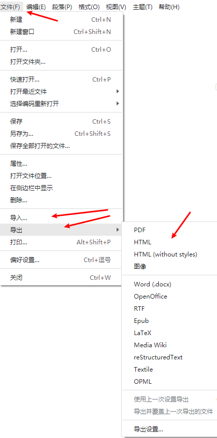

#### （2）偏好设置

文件->偏好设置

> 通用->自动检查更新

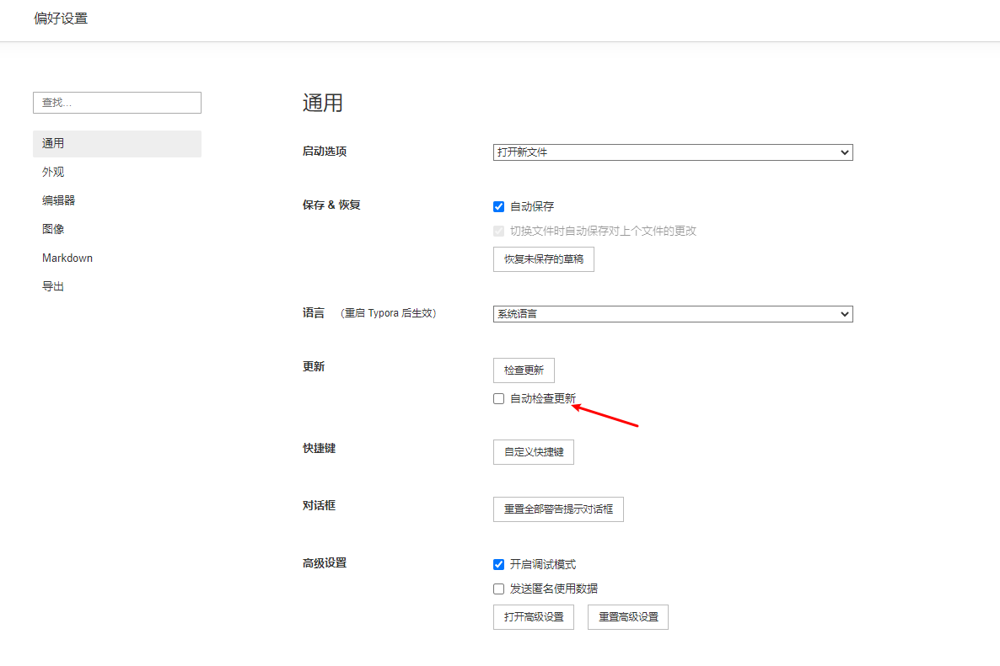

> 图片可以设定图片插入时的行为，如果时上传的话，可以设定上传服务，本地的文件可以存在assets文件夹下

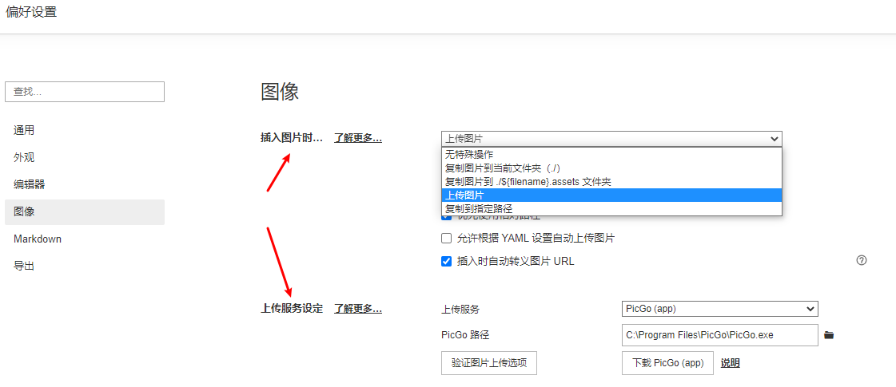

> Markdown可以配置扩展语法，智能标点，代码块等

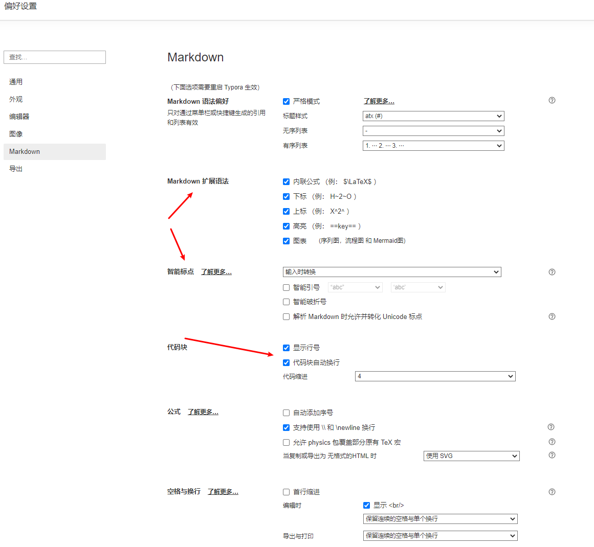

#### （3）打字机模式/专注模式

你可以在`视图 - 专注模式 / 打字机模式` 中勾选使用这两个模式。

- 打字机模式：使得你所编辑的那一行永远处于屏幕正中。
- 专注模式：使你正在编辑的那一行保留颜色，而其他行的字体呈灰色。

#### （4）实时预览

所见即所得，输入markdown标签立即渲染效果。

#### （5）图片插入

Typora 的图片插入功能是广受好评的。Markdown 原生不太注重图片插入的功能，但你可以在 Typora 中直接使用 `Ctrl + C Ctrl + V` 将网络图片、剪贴板图片复制到文档中，或者直接拖动本地图片到文档中。Typora 会自动帮你插入符合 Markdown 语法的图片语句，并给它加上标题。你也完全可以使用图床来保证文档在分享后图片仍能正常显示。

更强大的是，Typora 支持在拖动或 `Ctrl + V` 网络图片后自动将其保存到本地。你可以在 `文件 - 偏好设置 - 编辑器 - 图片插入` 中选择复制到哪个路径，什么情况下需要复制。这一功能保证了即使网络图片源失效了，你还有本地的备份可用。同时也能使你的文档文件夹更合理、完整。

#### （6）大纲显示

Typora 会根据你 Markdown 标记的 H1、H2、H3…… 各级标题为你呈现一个大纲。

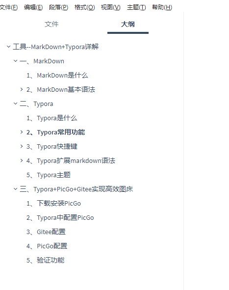

#### （7）一个伪装成文本编辑器的浏览器

Typora 是一个伪装成文本编辑器的浏览器。当你按下 `Shift + F12` 快捷键或者`右键检查元素`时，页面会弹出一个基于 Chrome 的开发者工具栏。

Typora 利用解析器先将我们写的 Markdown 文档解析成为 HTML 文档，再为它嵌入一个 CSS 样式，最后再加上可能需要的脚本等。

由于其本身「浏览器」的属性，你可以直接在实时预览界面用 `Ctrl +C` 复制到 HTML 代码。一个实用的用处是将这些 HTML 代码直接 `Ctrl + V` 黏贴到微信公众号后台，基本可以保证两边显示效果相同。这一点不仅使公众号推送可以有更自由、美观的样式，也让编辑、排版更轻松了。


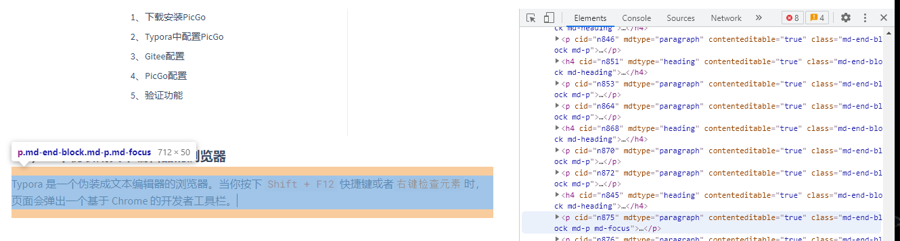

### 3、Typora快捷键

#### 标题(Ctrl+1(2，3，4，5，6))

#### 字体(Ctrl+I斜体，Ctrl+B粗体)

#### 删除线(Alt+Shift+5)

#### 下划线(Ctrl+U)

#### 代码高亮(Ctrl+Shift+`)

#### 代码段(Ctrl+Shift+K)

#### 链接(Ctrl+K)

#### 图片(Ctrl+C，Ctrl+V直接复制粘贴)

#### 插入图片(Ctrl+Shift+I)

#### 表格(Ctrl+T)

#### 显示隐藏侧边栏(Ctrl+Shift+L)

#### 显示大纲(Ctrl+Shift+1)

#### 显示文档(Ctrl+Shift+2)

#### 文档搜索(Ctrl+Shift+F)

#### 内容搜索(Ctrl+F)

#### 源代码模式(Ctrl+/)

### 4、Typora扩展markdown语法

#### 高亮

用两个等号包起来就能实现高亮

代码：

```bash
==高亮效果==
```

效果：

==高亮效果==

---

#### 上下标

~包起来实现下标，^包起来实现上标

代码：

```bash
H~2~O
X^2^
```

效果：

H~2~O
X^2^

### 5、Typora主题

Typora其实就是伪装成文本编辑器的浏览器，Typora主题本质就是一套样式文件。你可以在 `文件 - 偏好设置 - 主题 - 打开主题文件夹` 看到这些 CSS 文件。安装的时候默认内置了几套主题，喜欢什么样式的自由选择。

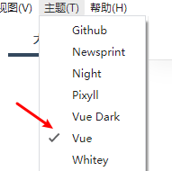

[官网](https://support.typora.io/)提供很多其他的样式下载，将下载的文件放到主题目录下，重启程序就可以选择新的主题了。

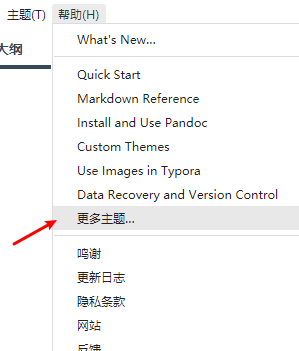

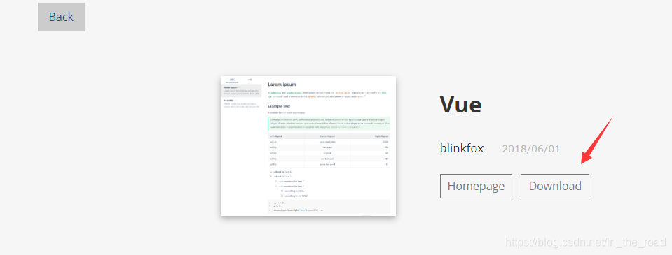

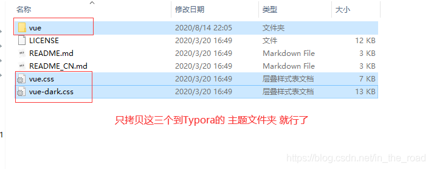

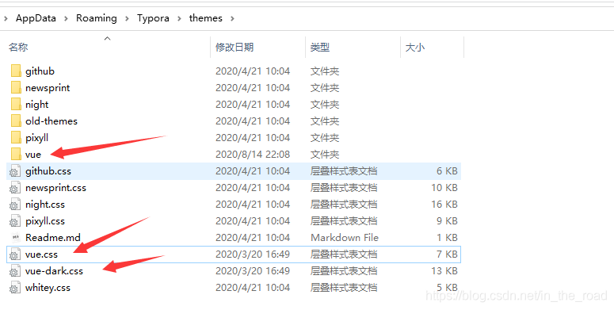

除此以外，如果你有一定的 Web 编程基础，你当然也可以自己修改适合你使用需求的 CSS 文件。按下 `Shift + F12` 快捷键，找到你要修改的样式修改样式。这边有自定义的Vue样式可以拿去直接用[百度网盘地址](https://pan.baidu.com/s/19n5QuZCqYTdQh3nK7bxlQg)提取码：1234 

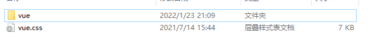

### 6、Typora+Gitee实现云笔记功能

Typora本身没有云同步功能，不同电脑之间想要共享比较麻烦，借助版本管理工具可以实现机器之间的文件同步。Typora写的md文档是文本文件，非常适合使用版本管理工具来进行管理备份追踪每次修改的内容。

## 三、Typora+PicGo+Gitee实现高效图床

> 为什么要用图床存储图片？

自己写的md文档插入的图片只能在本地看，需要发给他人需要连带图片一起发给别人。如果上传CSDN，图片需要额外上传，一篇文章图片很多的时候就会非常麻烦。

有了图床（一般是指储存图片的服务器）之后，图片存在远程服务器上，本地文档只存储图片的图床网络连接，分享的时候或者上传CSDN都不需要额外再处理图片。

Typora+PicGo+Gitee三者的结合，可以让上传图片到图床向贴图到本地md文档一样简单方便，提高效率，不需要额外去上传图片再将图片链接在贴到md文档中。

### 1、下载安装PicGo

[PicGo下载地址](https://github.com/Molunerfinn/PicGo/releases/)直接下载windows版本即可，如果github很难打开的话，可以直接[百度网盘下载](https://pan.baidu.com/s/12qCwLXji85LBr1_-68gqgg)提取码：1234。安装就是下一步下一步直到结束。

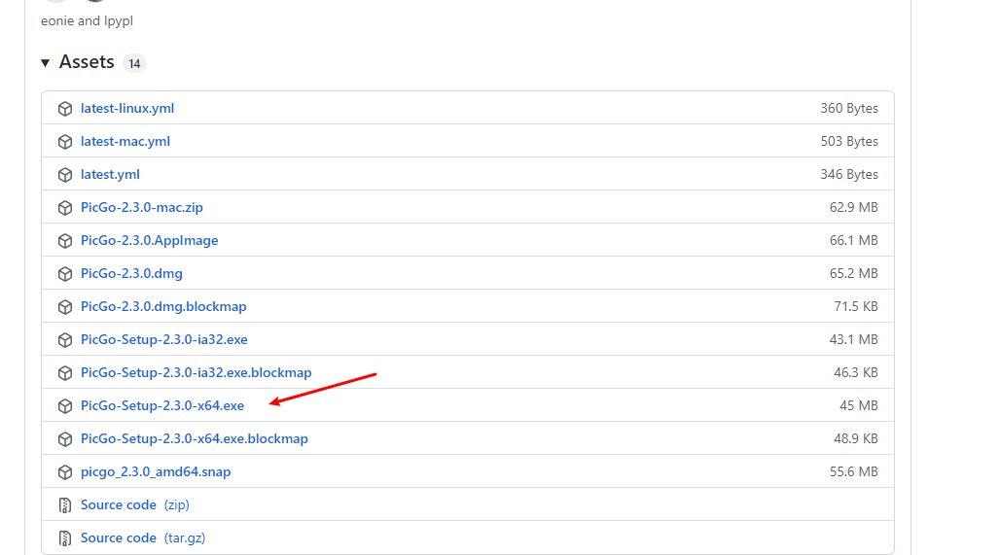

### 2、Typora中配置PicGo

Typora打开文件->偏好进入配置页面，设置成插入图片时上传图片，上传的服务器就把PicGo的安装路径填进去。

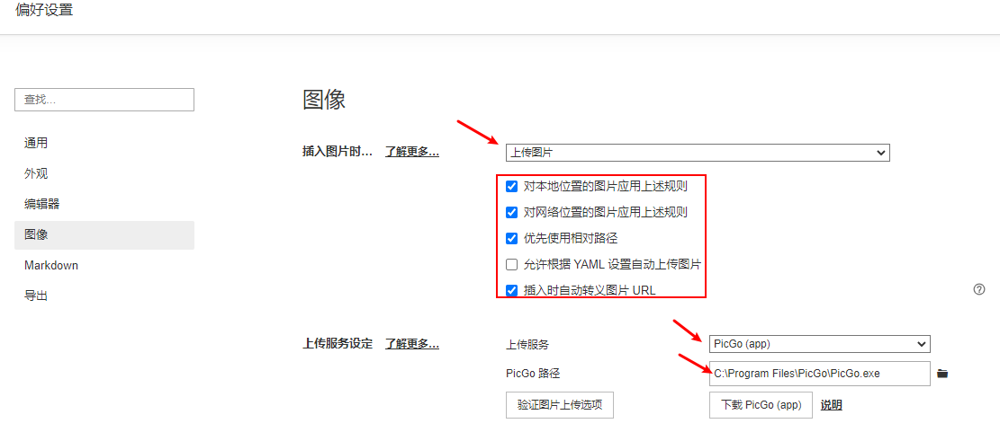


### 3、Gitee配置

> 创建一个新的仓库

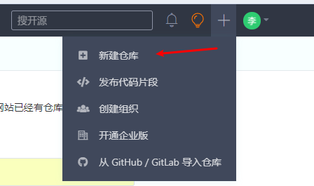

> 设置成开源（图片地址才能访问），并初始化仓库初始化readme文件（才能上传图片）

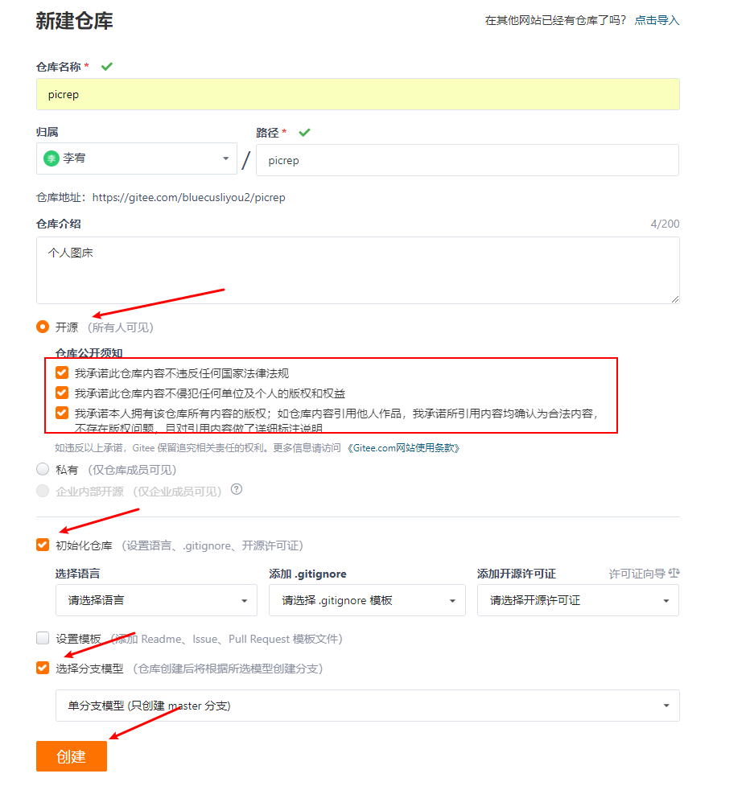

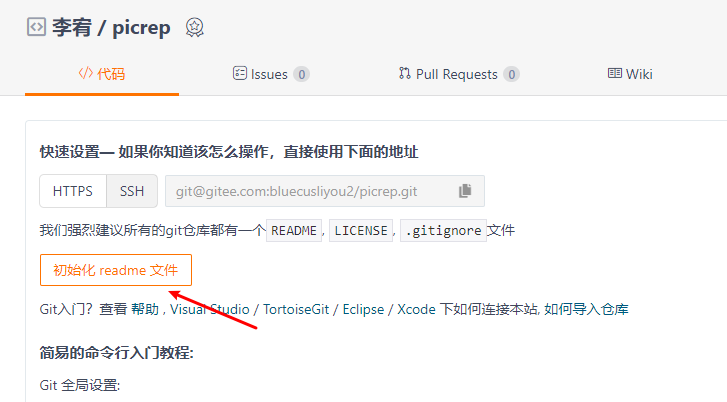


> 生成私人令牌，生成的文本保存好

这里勾选不一定全部勾选，只勾前面两个即可

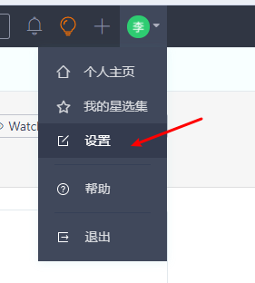

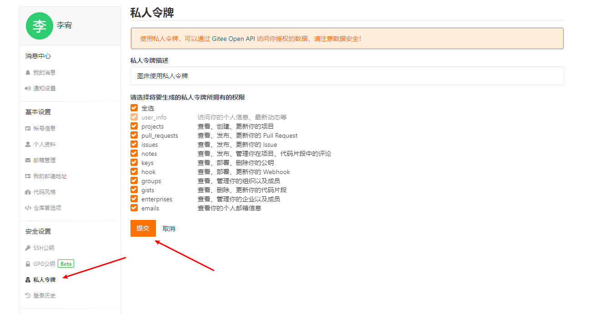

### 4、PicGo配置

> 插件设置

安装gitee上传插件

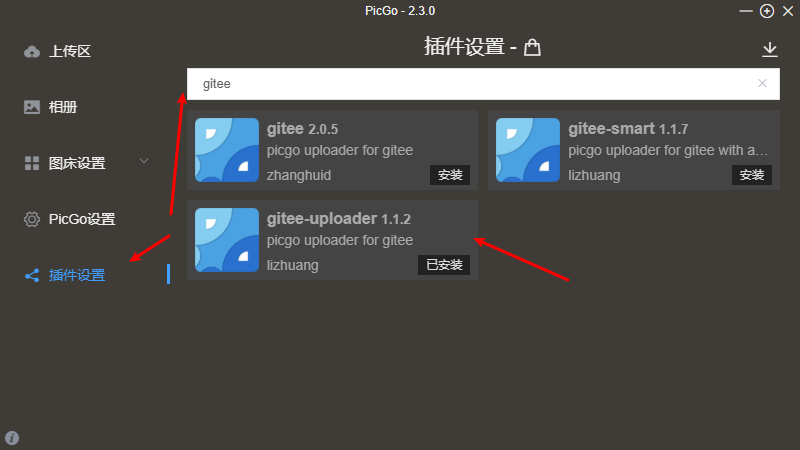

> PicGo设置

配置文件名使用时间戳，防止上传的文件名称重复导致上传失败

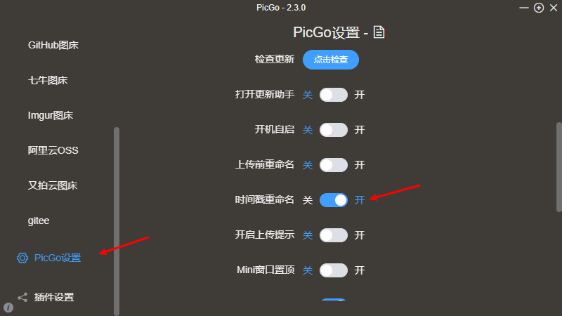

> 图床设置->gitee

填上仓库名称（用户名/仓库名），填上token（gitee生成的私人令牌）

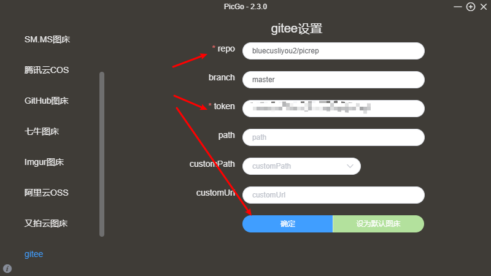

### 5、验证功能

在Typora 中插入一张图片，然后去gitee 仓库中查看是否有新的文件，成功上传并显示。
