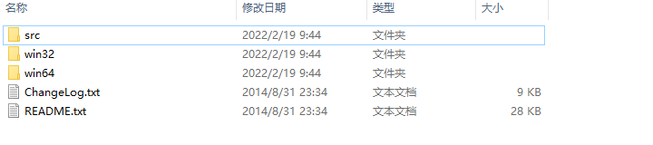
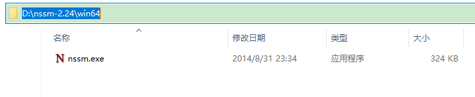
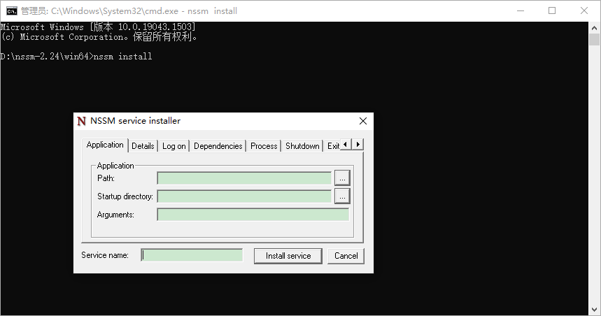
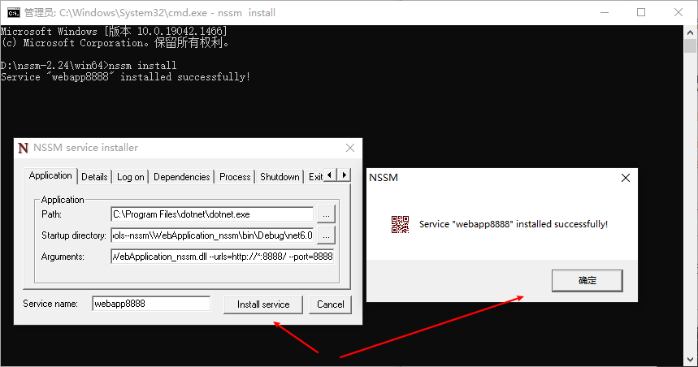
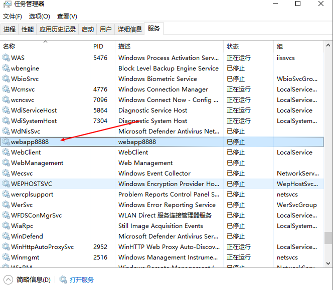
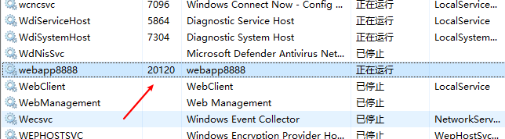
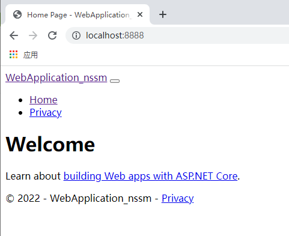
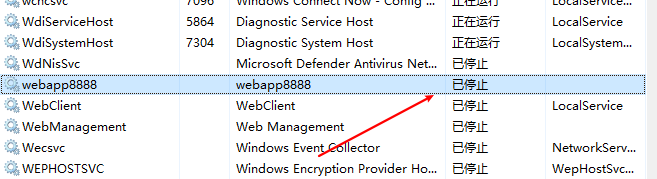
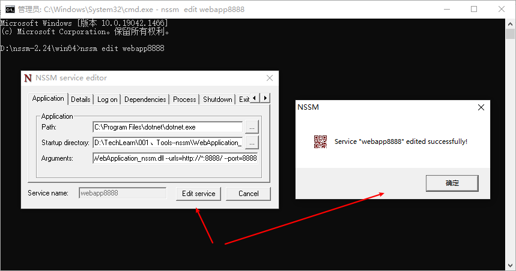
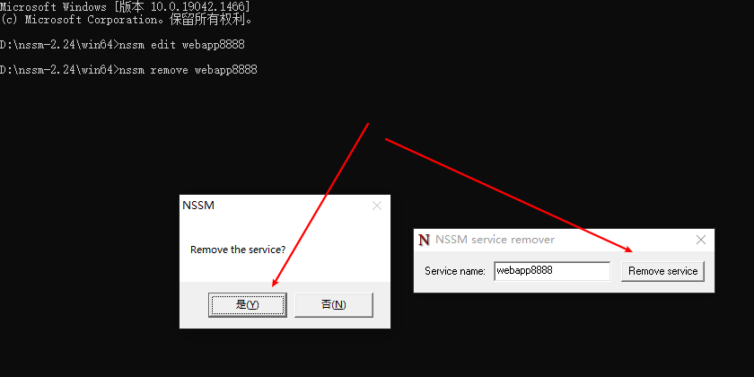

# nssm详解

## 一、nssm简介

nssm是一个服务封装程序，它可以将普通exe程序封装成服务，实现开机自启动，同类型的工具还有微软自己的srvany，不过nssm更加简单易用，并且功能强大。

它的特点如下：

- 支持普通exe程序（控制台程序或者带界面的Windows程序都可以）
- 安装简单，修改方便
- 可以自动守护封装了的服务，程序挂掉了后可以自动重启

官网地址：[https://nssm.cc/](https://nssm.cc/)

## 二、nssm配置详解

### 1、下载地址

官网地址：[https://nssm.cc/download](https://nssm.cc/download)

百度网盘：[https://pan.baidu.com/s/12J0jJF9_7-bstH1eGMI8Lg?pwd=1234](https://pan.baidu.com/s/12J0jJF9_7-bstH1eGMI8Lg?pwd=1234)

### 2、解压压缩包，根据系统位数选择64或32位程序





### 3、打开命令行，运行nssm程序

管理员权限打开命令行工具，切换到nssm.exe所在路径，运行 nssm install，打开程序配置界面



**配置项说明：**

- Path：运行应用程序的程序
- Startup directory：应用程序所在的目录

- Arguments：应用运行的参数

- Service name：生成服务的名称


最后点击install service 完成windows服务安装，在windows服务列表就能看到创建的服务了。

### 4、常用命令

- nssm install servername //创建servername服务，弹出配置界面
- nssm start servername //启动服务
- nssm stop servername //暂停服务
- nssm restart servername //重新启动服务
- nssm remove servername //删除创建的servername服务
- nssm edit servername//更改servername服务，弹出修改界面
- nssm set  servername 参数名 参数值 //设置服务参数值
- sc delete servername//windows删除服务命令
- 直接使用windows的服务管理也可以实现服务的操作，服务右键`属性 - 恢复`即可设置服务挂掉重启等内容。

## 三、实战：将应用做成服务

### 1、程序说明

这里演示将net6的web项目制作成windows服务

应用的启动命令是：`dotnet WebApplication_nssm.dll --urls=http://*:8888/ --port=8888`

### 2、安装服务

```bash
nssm install
```

- Path：`C:\Program Files\dotnet\dotnet.exe`
- Startup directory：`D:\TechLearn\001、Tools--nssm\WebApplication_nssm\bin\Debug\net6.0`
- Arguments：`WebApplication_nssm.dll --urls=http://*:8888/ --port=8888`
- Service name：`webapp8888`

最后点击install service 完成windows服务安装，在windows服务列表就能看到创建的服务了。





### 3、管理服务

#### （1）启动服务

```bash
D:\nssm-2.24\win64>nssm start webapp8888
webapp8888: START: 操作成功完成。
```





#### （2）关闭服务

```bash
D:\nssm-2.24\win64>nssm stop webapp8888
webapp8888: STOP: 操作成功完成。
```



#### （3）重启服务

如果服务未启动就会直接启动，启动的会重启。

```bash
D:\nssm-2.24\win64>nssm restart webapp8888
webapp8888: STOP: 服务尚未启动。
webapp8888: START: 操作成功完成。

D:\nssm-2.24\win64>nssm restart webapp8888
webapp8888: STOP: 操作成功完成。
webapp8888: START: 操作成功完成。
```

#### （4）修改服务

输入命令，修改配置，不能修改服务名

```bash
D:\nssm-2.24\win64>nssm edit webapp8888
```



#### （5）删除服务

删除有二次确认，删除之后服务就找不到了，需要重新安装

```bash
D:\nssm-2.24\win64>nssm remove webapp8888
Service "webapp8888" removed successfully!
```


