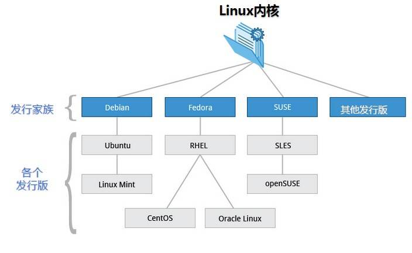
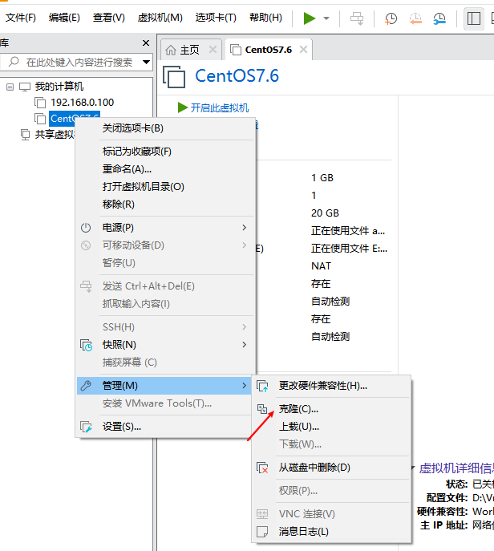
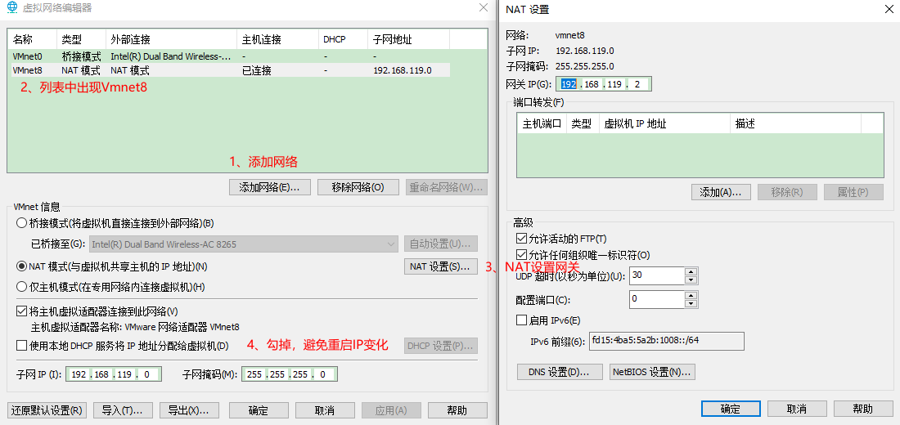
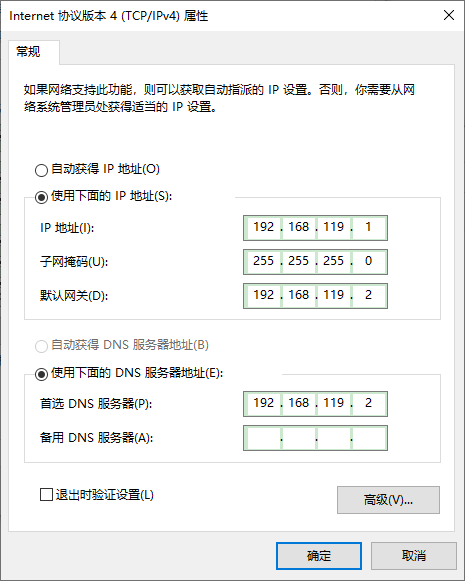
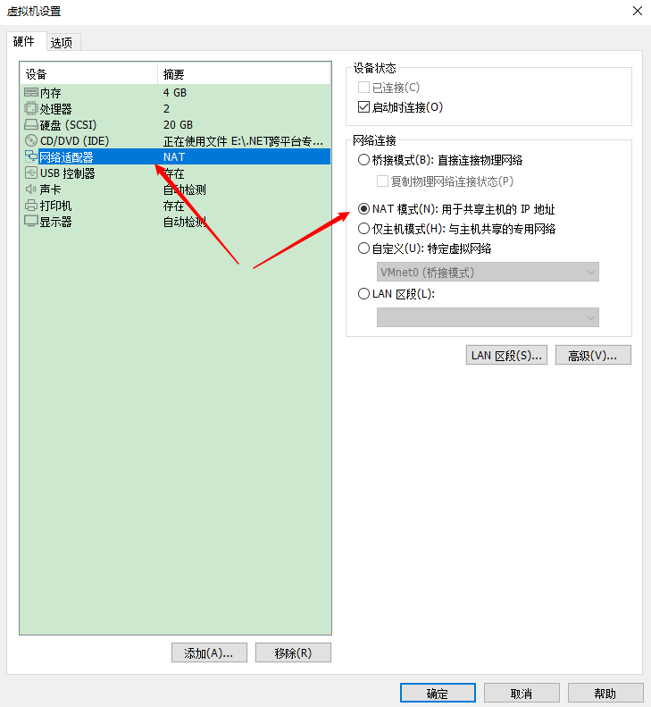
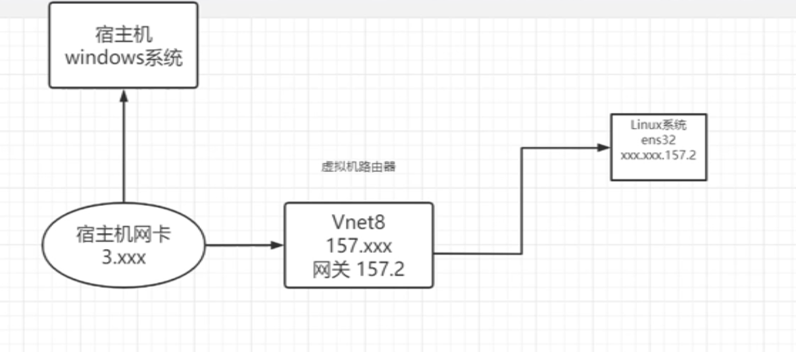
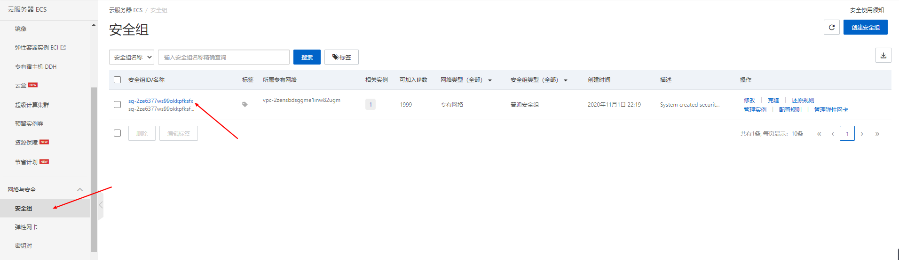
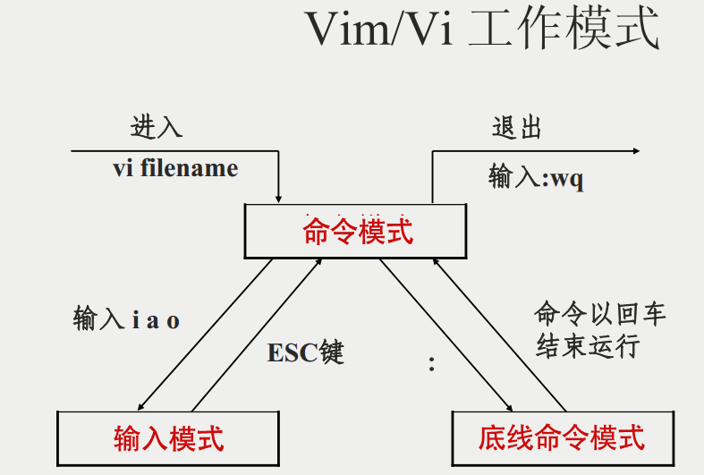
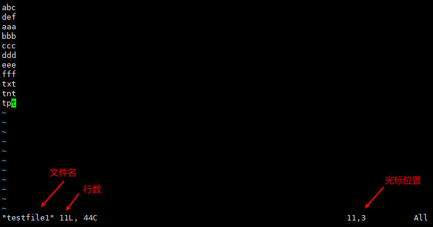

# Linux详解

## 一、Linux简介

### 1、简介

在服务器端，Linux是最流程的操作系统。Linux 有一个强大的服务器软件生态系统：Docker、Redis、MySQL、Nginx、Hadoop 等等。

Linux 内核最初只是由芬兰人林纳斯·托瓦兹（Linus Torvalds）在赫尔辛基大学上学时出于个人爱好而编写的。

Linux 是一套免费使用和自由传播的类 Unix 操作系统，是一个基于 POSIX 和 UNIX 的多用户、多任务、支持多线程和多 CPU 的操作系统。

Linux 能运行主要的 UNIX 工具软件、应用程序和网络协议。它支持 32 位和 64 位硬件。Linux 继承了 Unix 以网络为核心的设计思想，是一个性能稳定的多用户网络操作系统。

### 2、内核版本

- xx.yy.zz
  - xx主版本
  - yy次版本
  - zz末版本

- 小于2.6版本
  - 次版本奇数为开发版
  - 次版本偶数为稳定版

- 大于2.6版本
  - Longterm长期支持版本
  - stable稳定版本
  - mainline主线开发版本

### 3、发行版

Linux 的发行版说简单点就是将 Linux 内核与应用软件做一个打包。




目前市面上较知名的发行版有：Ubuntu、RedHat、CentOS、Debian、Fedora、SuSE、OpenSUSE、Arch Linux、SolusOS 等。

### 4、linux和windows区别

- 使用 Windows 倾向于 GUI 操作，Linux 虽然也可以安装图形界面，但是 Linux 倾向于命令行操作（可以自动化、可以精确控制、可以组合命令）。
- windows 下主要根据文件的扩展名区分文件类型，linux 中可以没有扩展名。
- Linux 不同版本使用方法、配置文件可能变化很大，要自己查、反复试。
- 易错的地方：Linux 中文件名是区分大小写的，Windows不区分。

## 二、Linux安装

### 1、安装Vmware虚拟机

#### （1）下载

- 官网下载：[https://download3.vmware.com/software/wkst/file/VMware-workstation-full-16.1.2-17966106.exe](https://download3.vmware.com/software/wkst/file/VMware-workstation-full-16.1.2-17966106.exe)
- 百度网盘链接：[https://pan.baidu.com/s/1PoKMuYpgjQ4o-yTcEcc8Ew](https://pan.baidu.com/s/1PoKMuYpgjQ4o-yTcEcc8Ew)  提取码：1234 

#### （2）安装

#### （3）无法安装Vmware虚拟机原因

- 你的电脑不支持虚拟化或者是没有开启虚拟化
- windows10系统默认有一个虚拟机Hyper-V，把windows自带虚拟机给干掉

#### （4）虚拟机可以进行克隆



### 2、虚拟机安装Linux

#### （1）下载

- 百度网盘链接：[https://pan.baidu.com/s/1uG_CYfRJyQVEy0CqvWS_Hg](https://pan.baidu.com/s/1uG_CYfRJyQVEy0CqvWS_Hg) 提取码：1234 

#### （2）安装在虚拟机上

### 3、配置虚拟机网络

#### （1）安装虚拟机网卡

> 编辑->虚拟网络编辑器



> 修改宿主机Vmnet8网卡配置



#### （2）配置虚拟机网络



#### （3）配置虚拟机网卡信息

> 查看网卡是哪个文件

```bash
[liyou@localhost ~]$ ifconfig
ens33: flags=4163<UP,BROADCAST,RUNNING,MULTICAST>  mtu 1500
        inet 192.168.0.112  netmask 255.255.255.0  broadcast 192.168.0.255
        inet6 fe80::da9e:4ce3:6d3b:37b1  prefixlen 64  scopeid 0x20<link>
        ether 00:0c:29:00:38:2c  txqueuelen 1000  (Ethernet)
        RX packets 12892  bytes 19164992 (18.2 MiB)
        RX errors 0  dropped 0  overruns 0  frame 0
        TX packets 3762  bytes 254726 (248.7 KiB)
        TX errors 0  dropped 0 overruns 0  carrier 0  collisions 0

lo: flags=73<UP,LOOPBACK,RUNNING>  mtu 65536
        inet 127.0.0.1  netmask 255.0.0.0
        inet6 ::1  prefixlen 128  scopeid 0x10<host>
        loop  txqueuelen 1000  (Local Loopback)
        RX packets 68  bytes 5912 (5.7 KiB)
        RX errors 0  dropped 0  overruns 0  frame 0
        TX packets 68  bytes 5912 (5.7 KiB)
        TX errors 0  dropped 0 overruns 0  carrier 0  collisions 0

virbr0: flags=4099<UP,BROADCAST,MULTICAST>  mtu 1500
        inet 192.168.122.1  netmask 255.255.255.0  broadcast 192.168.122.255
        ether 52:54:00:93:7b:8c  txqueuelen 1000  (Ethernet)
        RX packets 0  bytes 0 (0.0 B)
        RX errors 0  dropped 0  overruns 0  frame 0
        TX packets 0  bytes 0 (0.0 B)
        TX errors 0  dropped 0 overruns 0  carrier 0  collisions 0
```

> 修改网卡信息，BOOTPROTO修改static，IP固定

先切换root，否则无权限修改网卡文件

```bash
[liyou@localhost ~]$ su root
Password:
```

```bash
[root@localhost liyou]# vi /etc/sysconfig/network-scripts/ifcfg-ens33
```

```bash
——————— 未修改的 ———————
TYPE=“Ethernet”
PROXY_METHOD=“none”
BROWSER_ONLY=“no”
BOOTPROTO=“dhcp”
DEFROUTE=“yes”
IPV4_FAILURE_FATAL=“no”
IPV6INIT=“yes”
IPV6_AUTOCONF=“yes”
IPV6_DEFROUTE=“yes”
IPV6_FAILURE_FATAL=“no”
IPV6_ADDR_GEN_MODE=“stable-privacy”
NAME=“ens32”
UUID=“928523cf-3506-431d-b7ae-b25572be9630”
DEVICE=“ens32”
ONBOOT=“yes”
———————- 修改后的 —————————
TYPE=“Ethernet”
PROXY_METHOD=“none”
BROWSER_ONLY=“no”
BOOTPROTO=“static”
DEFROUTE=“yes”
IPV4_FAILURE_FATAL=“no”
IPV6INIT=“yes”
IPV6_AUTOCONF=“yes”
IPV6_DEFROUTE=“yes”
IPV6_FAILURE_FATAL=“no”
IPV6_ADDR_GEN_MODE=“stable-privacy”
NAME=“ens32”
UUID=“928523cf-3506-431d-b7ae-b25572be9630”
DEVICE=“ens32”
ONBOOT=“yes”
IPADDR=192.168.119.185
NETMASK=255.255.255.0
GATEWAY=192.168.119.2
DNS1=192.168.119.2
```

修改完成保存重启网卡信息

```bash
[root@localhost liyou]# service network restart
```

#### （4）测试网络是否ping通

> 宿主机ping虚拟机

```bash
C:\Users\Administrator>ping -t 192.168.119.187

正在 Ping 192.168.119.187 具有 32 字节的数据:
来自 192.168.119.187 的回复: 字节=32 时间<1ms TTL=64
来自 192.168.119.187 的回复: 字节=32 时间=8ms TTL=64
来自 192.168.119.187 的回复: 字节=32 时间=2ms TTL=64
来自 192.168.119.187 的回复: 字节=32 时间=1ms TTL=64
来自 192.168.119.187 的回复: 字节=32 时间=2ms TTL=64
```

> 虚拟机ping宿主机

- 查看宿主机IP

```bash
无线局域网适配器 WLAN:

   连接特定的 DNS 后缀 . . . . . . . :
   IPv6 地址 . . . . . . . . . . . . : 2409:8a20:2273:5720:f93d:8d7e:1151:65a8
   临时 IPv6 地址. . . . . . . . . . : 2409:8a20:2273:5720:b533:4828:7790:859b
   本地链接 IPv6 地址. . . . . . . . : fe80::f93d:8d7e:1151:65a8%5
   IPv4 地址 . . . . . . . . . . . . : 192.168.1.227
   子网掩码  . . . . . . . . . . . . : 255.255.255.0
   默认网关. . . . . . . . . . . . . : fe80::1%5
                                       192.168.1.1
```

- ping宿主机

```bash
[root@localhost liyou]# ping 192.168.1.227
PING 192.168.1.227 (192.168.1.227) 56(84) bytes of data.
64 bytes from 192.168.1.227: icmp_seq=1 ttl=128 time=0.630 ms
64 bytes from 192.168.1.227: icmp_seq=2 ttl=128 time=2.07 ms
64 bytes from 192.168.1.227: icmp_seq=3 ttl=128 time=1.59 ms
64 bytes from 192.168.1.227: icmp_seq=4 ttl=128 time=2.36 ms
64 bytes from 192.168.1.227: icmp_seq=5 ttl=128 time=2.26 ms
64 bytes from 192.168.1.227: icmp_seq=6 ttl=128 time=2.41 ms
64 bytes from 192.168.1.227: icmp_seq=7 ttl=128 time=2.38 ms
```

#### （5）虚拟机网络通信原理

https://mirrors.aliyun.com/centos/8.4.2105/isos/x86_64/)

### 4、购买云服务器

**云服务器(Elastic Compute Service, ECS)**是一种简单高效、安全可靠、处理能力可弹性伸缩的计算服务。

云服务器管理方式比物理服务器更简单高效，我们无需提前购买昂贵的硬件，即可迅速创建或删除云服务器，云服务器费用一般在几十到几百不等，可以根据我们的需求配置。

#### （1）购买服务器

下载地址：https://www.aliyun.com/minisite/goods?userCode=0phtycgr

#### （2）配置服务器

> 登录阿里云控制台：[https://ecs.console.aliyun.com/#/home](https://ecs.console.aliyun.com/#/home)

> 获取服务器公网IP


#### （3）修改服务器登录密码

点击蓝色实例名，进入实例详情，可以重置密码，也可以修改主机名


#### （4）配置安全组开放端口号



授权对象 0000表示授权给所有人


### 5、宝塔面板安装

宝塔Linux面板是提升运维效率的服务器管理软件，支持一键LAMP/LNMP/集群/监控/网站/FTP/数据库/JAVA等100多项服务器管理功能。
有30个人的专业团队研发及维护，经过200多个版本的迭代，功能全，少出错且足够安全，已获得全球百万用户认可安装。运维要高效，装宝塔。

教程地址：[https://www.bt.cn/bbs/thread-19376-1-1.html](https://www.bt.cn/bbs/thread-19376-1-1.html)

### 6、常用连接工具

- FinalShell：[http://www.hostbuf.com/](http://www.hostbuf.com/)
- MobaXterm：[https://mobaxterm.mobatek.net/](https://mobaxterm.mobatek.net/)

## 三、Linux基础

### 1、基础知识

#### （1）man(查看命令帮助信息)

**常用参数：**

| -a   | 在所有的man帮助手册中搜索                                    |
| ---- | ------------------------------------------------------------ |
| -d   | 主要用于检查，如果用户加入了一个新的文件，就可以用这个参数检查是否出错 |
| -f   | 显示给定关键字的简短描述信息                                 |
| -p   | 指定内容时使用分页程序                                       |
| -M   | 指定man手册搜索的路径                                        |
| -w   | 显示文件所在位置                                             |

**快捷键：**

| q       | 退出                 |
| ------- | -------------------- |
| Enter   | 按行下翻             |
| Space   | 按页下翻             |
| b       | 上翻一页             |
| /字符串 | 在手册页中查找字符串 |

```bash
man ls  查看ls的帮助
man l man 查看man自身的帮助
```

#### （2）help(获取内部帮助命令)

```bash
ls --help  查看ls的帮助
```

#### （3）info比man更丰富的帮助信息

#### （4）history显示历史输入过的命令

#### （5）clear清屏

#### （6）快捷键

- ==ctrl + c==（停止当前进程）
- ==ctrl + l==（清屏，与clear命令作用相同）
- ==ctrl +滚动鼠标==调整窗口字体大小
- 按 ==上 ／ 下== 光标键可以在曾经使用过的命令之间来回切换
- 敲出 ==文件 ／ 目录 ／ 命令== 的前几个字母，按下 tab 键，无歧义，系统会自动补全
- 敲出 ==文件 ／ 目录 ／ 命令== 的前几个字母，按下 tab 键，有歧义，再按 tab 键，系统会提示可能存在的命令

#### （7）命令提示符

- "$"普通用户
- "#"root用户

#### （8）命令参考网站

- [https://www.linuxcool.com/](https://www.linuxcool.com/)
- [https://www.runoob.com/linux/linux-tutorial.html](https://www.runoob.com/linux/linux-tutorial.html)
- [https://gitee.com/jishupang/linux-memo](https://gitee.com/jishupang/linux-memo)

### 2、开关机

#### （1）开机

一般来说，用户的登录系统方式有三种：

- 命令行登录
- ssh登录
- 图形界面登录


#### （2）关机

在linux领域内大多用在服务器上，很少遇到关机的操作。毕竟服务器上跑一个服务是永无止境的，除非特殊情况下，不得已才会关机。

可以运行如下命令关机：

```bash
sync #将数据由内存同步到硬盘中。

shutdown #关机指令，你可以man shutdown 来看一下帮助文档。

shutdown –h 10 #10分钟后关机

shutdown –h now #立马关机

shutdown –h 20:25 #系统会在今天20:25关机

shutdown –h +10 #10分钟后关机

shutdown –r now #系统立马重启

shutdown –r +10 #系统十分钟后重启

reboot #重启，等同于 shutdown –r now

halt #关闭系统，等同于shutdown –h now 和 poweroff
```

### 3、系统目录结构

#### （1）系统目录结构

- Linux里面一切皆文件，所有的东西都是文件的形式呈现管理
- /是系统的根目录，所有的东西都在这个目录下面

```bash
[root@bluecusliyou ~]# ls /
bin  boot  dev  etc  home  lib  lib64  media  mnt  opt  proc  root  run  sbin  srv  sys  tmp  usr  var
```

#### （2）目录结构说明


- ==**/bin**：bin 是 Binaries (二进制文件) 的缩写, 这个目录存放着最经常使用的命令。==
- **/boot：**这里存放的是启动 Linux 时使用的一些核心文件，包括一些连接文件以及镜像文件。
- **/dev ：**dev 是 Device(设备) 的缩写, 该目录下存放的是 Linux 的外部设备，在 Linux 中访问设备的方式和访问文件的方式是相同的。
- ==**/etc：**etc 是 Etcetera(等等) 的缩写,这个目录用来存放所有的系统管理所需要的配置文件和子目录。==
- ==**/home**：用户的主目录，在 Linux 中，每个用户都有一个自己的目录，一般该目录名是以用户的账号命名的，如上图中的 alice、bob 和 eve。==
- **/lib**：lib 是 Library(库) 的缩写这个目录里存放着系统最基本的动态连接共享库，其作用类似于 Windows 里的 DLL 文件。几乎所有的应用程序都需要用到这些共享库。
- **/lost+found**：这个目录一般情况下是空的，当系统非法关机后，这里就存放了一些文件。
- **/media**：linux 系统会自动识别一些设备，例如U盘、光驱等等，当识别后，Linux 会把识别的设备挂载到这个目录下。
- **/mnt**：系统提供该目录是为了让用户临时挂载别的文件系统的，我们可以将光驱挂载在 /mnt/ 上，然后进入该目录就可以查看光驱里的内容了。
- **/opt**：opt 是 optional(可选) 的缩写，这是给主机额外安装软件所摆放的目录。比如你安装一个ORACLE数据库则就可以放到这个目录下。默认是空的。
- **/proc**：proc 是 Processes(进程) 的缩写，/proc 是一种伪文件系统（也即虚拟文件系统），存储的是当前内核运行状态的一系列特殊文件，这个目录是一个虚拟的目录，它是系统内存的映射，我们可以通过直接访问这个目录来获取系统信息。
- ==**/root**：该目录为系统管理员，也称作超级权限者的用户主目录。==
- ==**/sbin**：s 就是 Super User 的意思，是 Superuser Binaries (超级用户的二进制文件) 的缩写，这里存放的是系统管理员使用的系统管理程序。==
- **/selinux**： 这个目录是 Redhat/CentOS 所特有的目录，Selinux 是一个安全机制，类似于 windows 的防火墙，但是这套机制比较复杂，这个目录就是存放selinux相关的文件的。
- **/srv**：该目录存放一些服务启动之后需要提取的数据。
- **/sys**：这是 Linux2.6 内核的一个很大的变化。该目录下安装了 2.6 内核中新出现的一个文件系统 sysfs 。
- **/tmp**：tmp 是 temporary(临时) 的缩写这个目录是用来存放一些临时文件的。
- ==**/usr**：usr 是 unix shared resources(共享资源) 的缩写，这是一个非常重要的目录，用户的很多应用程序和文件都放在这个目录下，类似于 windows 下的 program files 目录。==
- ==**/usr/bin：**系统用户使用的应用程序。==
- ==**/usr/sbin：**超级用户使用的比较高级的管理程序和系统守护程序。==
- **/usr/src：**内核源代码默认的放置目录。
- ==**/var**：var 是 variable(变量) 的缩写，这个目录中存放着在不断扩充着的东西，我们习惯将那些经常被修改的目录放在这个目录下。包括各种日志文件。==
- **/run**：是一个临时文件系统，存储系统启动以来的信息。当系统重启时，这个目录下的文件应该被删掉或清除。如果你的系统上有 /var/run 目录，应该让它指向 run。

## 四、文件与目录

### 1、前置概念

#### （1）通配符

- *：匹配任意字符
- ?：匹配单个字符
- [xyz]：匹配xyz任意一个字符
- [a-z]：匹配字符范围
- [!xyz]：匹配不在xyz中的任意字符

#### （2）重定向>和>>

- “>”：表示覆盖
- “>>”：表示追加

```bash
[root@bluecusliyou testdir]# ll
total 39820
drwxr-xr-x 2 root root       50 Nov 18 17:18 testdir1
drwxr-xr-x 2 root root        6 Nov 18 17:11 testdir2
-rw-r--r-- 1 root root 40764544 Nov 19 10:11 test.exe
-rw-r--r-- 1 root root        0 Nov 18 17:11 testfile1
-rw-r--r-- 1 root root        0 Nov 18 17:11 testfile2
-rw-r--r-- 1 root root     4855 Nov 19 10:09 test.png
[root@bluecusliyou testdir]# echo '123'>1.txt
[root@bluecusliyou testdir]# echo '456'>2.txt
[root@bluecusliyou testdir]# cat 1.txt
123
[root@bluecusliyou testdir]# cat 2.txt
456
[root@bluecusliyou testdir]# cat 1.txt 2.txt>3.txt
[root@bluecusliyou testdir]# cat 3.txt
123
456
[root@bluecusliyou testdir]# cat 1.txt>>3.txt
[root@bluecusliyou testdir]# cat 3.txt
123
456
123
[root@bluecusliyou testdir]# cat 1.txt>3.txt
[root@bluecusliyou testdir]# cat 3.txt
123
```

#### （3）管道符|

管道：**前面命令的输出**  可以通过管道做为  **后面命令的输入**。

管道我们可以理解现实生活中的管子，管子的一头塞东西进去，另一头取出来，这里“ | ”的左右分为两端，左端塞东西(写)，右端取东西(读)。

eg： 【ls -lh bin | more】表示：把bin下的内容分页输出

　　 【ps -ef|grep nginx】：查询nginx的进程

　　 【ifconfig|more】：将网络信息分页输出。 

### 2、文件目录管理

#### （1）ls (列出文件目录)

**常用参数：**

| -a   | 显示所有文件及目录 (包括以“.”开头的隐藏文件)     |
| ---- | ------------------------------------------------ |
| -l   | 使用长格式列出文件及目录信息                     |
| -r   | 将文件以相反次序显示(默认依英文字母次序)         |
| -h   | 配合-l以人性化的方式显示文件大小                 |
| -t   | 根据最后的修改时间排序                           |
| -A   | 同 -a ，但不列出 “.” (当前目录) 及 “..” (父目录) |
| -S   | 根据文件大小排序                                 |
| -R   | 递归列出所有子目录                               |

```bash
# 列出当前目录下的文件
[root@bluecusliyou testdir]# ls
testdir1  testdir2  test.exe  testfile1  testfile2  test.png
# 列出文件，包含隐藏文件
[root@bluecusliyou testdir]# ls -a
.  ..  testdir1  testdir2  test.exe  testfile1  testfile2  test.png
# 使用长格式列出文件及目录信息
[root@bluecusliyou testdir]# ls -l
total 39820
drwxr-xr-x 2 root root       50 Nov 18 17:18 testdir1
drwxr-xr-x 2 root root        6 Nov 18 17:11 testdir2
-rw-r--r-- 1 root root 40764544 Nov 19 10:11 test.exe
-rw-r--r-- 1 root root        0 Nov 18 17:11 testfile1
-rw-r--r-- 1 root root        0 Nov 18 17:11 testfile2
-rw-r--r-- 1 root root     4855 Nov 19 10:09 test.png
# 配合-l以人性化的方式显示文件大小
[root@bluecusliyou testdir]# ls -lh
total 39M
drwxr-xr-x 2 root root   50 Nov 18 17:18 testdir1
drwxr-xr-x 2 root root    6 Nov 18 17:11 testdir2
-rw-r--r-- 1 root root  39M Nov 19 10:11 test.exe
-rw-r--r-- 1 root root    0 Nov 18 17:11 testfile1
-rw-r--r-- 1 root root    0 Nov 18 17:11 testfile2
-rw-r--r-- 1 root root 4.8K Nov 19 10:09 test.png
# 以人性化的方式显示文件大小和隐藏文件
[root@bluecusliyou testdir]# ls -alh
total 39M
drwxr-xr-x  4 root root  104 Nov 19 10:11 .
drwxr-xr-x. 4 root root   37 Nov 18 17:09 ..
drwxr-xr-x  2 root root   50 Nov 18 17:18 testdir1
drwxr-xr-x  2 root root    6 Nov 18 17:11 testdir2
-rw-r--r--  1 root root  39M Nov 19 10:11 test.exe
-rw-r--r--  1 root root    0 Nov 18 17:11 testfile1
-rw-r--r--  1 root root    0 Nov 18 17:11 testfile2
-rw-r--r--  1 root root 4.8K Nov 19 10:09 test.png
# ll===ls -l
[root@bluecusliyou testdir]# ll
total 39820
drwxr-xr-x 2 root root       50 Nov 18 17:18 testdir1
drwxr-xr-x 2 root root        6 Nov 18 17:11 testdir2
-rw-r--r-- 1 root root 40764544 Nov 19 10:11 test.exe
-rw-r--r-- 1 root root        0 Nov 18 17:11 testfile1
-rw-r--r-- 1 root root        0 Nov 18 17:11 testfile2
-rw-r--r-- 1 root root     4855 Nov 19 10:09 test.png
# 通配符匹配
[root@bluecusliyou testdir]# ls -alh *dir*
testdir1:
total 0
drwxr-xr-x 2 root root  50 Nov 18 17:18 .
drwxr-xr-x 4 root root 104 Nov 19 10:11 ..
-rw-r--r-- 1 root root   0 Nov 18 17:18 testdir1_file1
-rw-r--r-- 1 root root   0 Nov 18 17:18 testdir1_file2

testdir2:
total 0
drwxr-xr-x 2 root root   6 Nov 18 17:11 .
drwxr-xr-x 4 root root 104 Nov 19 10:11 ..
```

#### （2）tree(树形式展示)

```bash
[root@bluecusliyou testdir]# tree
.
├── 1.txt
├── 2.txt
├── 3.txt
├── 4.txt
├── grepfile1.txt
├── grepfile2.txt
├── grepfile3.txt
├── grepfile4.txt
├── testdir1
│?? ├── testdir1_file1
│?? └── testdir1_file2
├── testdir2
├── test.exe
├── testfile1
├── testfile2
└── test.png

2 directories, 14 files
```

#### （3）cd (切换目录)

- 绝对路径：完整路径
- 相对路径：相对当前路径的路径
- ..：上级目录
- .或者./：当前目录

**常用参数：**

| -P   | 如果切换的目标目录是一个符号链接，则直接切换到符号链接指向的目标目录 |
| ---- | ------------------------------------------------------------ |
| -L   | 如果切换的目标目录是一个符号链接，则直接切换到符号链接名所在的目录 |
| --   | 仅使用”-“选项时，当前目录将被切换到环境变量”OLDPWD”对应值的目录 |
| ~    | 切换至当前用户目录[/home/用户目录]                     |
| ..   | 切换至当前目录位置的上一级目录                               |

```bash
[root@bluecusliyou /]# cd home/testdir     #相对路径
[root@bluecusliyou testdir]# cd /          #绝对路径根目录
[root@bluecusliyou /]# cd /home/testdir    #绝对路径
[root@bluecusliyou testdir]# cd ..         #上级路径
[root@bluecusliyou /]# cd ./               #当前路径
[root@bluecusliyou /]#
```

#### （4）pwd (显示当前目录)

**常用参数：**

```bash
[root@bluecusliyou bluecusliyou]# pwd
/home/bluecusliyou
```

#### （5）mkdir (创建新目录)

**常用参数：**

| -p   | 递归创建多级目录             |
| ---- | ---------------------------- |
| -m   | 建立目录的同时设置目录的权限 |
| -z   | 设置安全上下文               |
| -v   | 显示目录的创建过程           |

```bash
# 创建目录
[root@bluecusliyou home]# ls
[root@bluecusliyou home]# mkdir testdir
[root@bluecusliyou home]# ls
testdir
# 创建目录同时配置权限
[root@bluecusliyou home]# mkdir -m 711 testdir2
[root@bluecusliyou home]# ll
total 0
drwxr-xr-x 4 root root 240 Nov 19 13:06 testdir
drwxr-xr-x 2 root root   6 Nov 20 19:33 testdir2
# 递归创建目录
[root@bluecusliyou home]# mkdir testdir3/testdir/testdir
mkdir: cannot create directory ‘testdir3/testdir/testdir’: No such file or directory
[root@bluecusliyou home]# mkdir -p testdir3/testdir/testdir
[root@bluecusliyou home]# tree
.
├── testdir
│   ├── 1.txt
│   ├── 2.txt
│   ├── 3.txt
│   ├── 4.txt
│   ├── grepfile1.txt
│   ├── grepfile2.txt
│   ├── grepfile3.txt
│   ├── grepfile4.txt
│   ├── testdir1
│   │   ├── testdir1_file1
│   │   └── testdir1_file2
│   ├── testdir2
│   ├── test.exe
│   ├── testfile1
│   ├── testfile2
│   └── test.png
├── testdir2
└── testdir3
    └── testdir
        └── testdir

7 directories, 14 files
```

#### （6）rmdir (删除空的目录)

**常用参数：**

| -p                             | 用递归的方式删除指定的目录路径中的所有父级目录，非空则报错 |
| ------------------------------ | ---------------------------------------------------------- |
| -- -- ignore-fail-on-non-empty | 忽略由于删除非空目录时导致命令出错而产生的错误信息         |
| -v                             | 显示命令的详细执行过程                                     |
| -- -- help                     | 显示命令的帮助信息                                         |
| -- -- version                  | 显示命令的版本信息                                         |

```bash
# 删除目录
[root@bluecusliyou home]# ls
testdir testdir2 testdir3
[root@bluecusliyou home]# rmdir testdir2
[root@bluecusliyou home]# ls
testdir  testdir3
# 递归删除目录
[root@bluecusliyou home]# rmdir -p testdir3/testdir/testdir
[root@bluecusliyou home]# ls
testdir2
```

#### （7）cp (复制文件或目录)

**常用参数：**

| -f   | 若目标文件已存在，则会直接覆盖原文件                         |
| ---- | :----------------------------------------------------------- |
| -i   | 若目标文件已存在，则会询问是否覆盖                           |
| -p   | 保留源文件或目录的所有属性                                   |
| -r   | 递归复制文件和目录                                           |
| -d   | 当复制符号连接时，把目标文件或目录也建立为符号连接，并指向原始文件或目录 |
| -l   | 对源文件建立硬连接，而非复制文件                             |
| -s   | 对源文件建立符号连接，而非复制文件                           |
| -b   | 覆盖已存在的文件目标前将目标文件备份                         |
| -v   | 详细显示cp命令执行的操作过程                                 |
| -a   | 等价于“dpr”选项                                              |

```bash
[root@bluecusliyou home]# ls
testdir  testfile1
# cp 源文件  目标地址
[root@bluecusliyou home]# cp testfile1 testfile2
[root@bluecusliyou home]# ls
testdir  testfile1  testfile2
# 目标文件已存在会询问是否覆盖
[root@bluecusliyou home]# cp testfile1 testfile2
cp: overwrite 'testfile2'? y
[root@bluecusliyou home]# ls
testdir  testfile1  testfile2
```

#### （8）rm (移除文件或目录)

**常用参数：**

| -f   | 忽略不存在的文件，不会出现警告信息 |
| ---- | ---------------------------------- |
| -i   | 删除前会询问用户是否操作           |
| -r/R | 递归删除                           |
| -v   | 显示指令的详细执行过程             |

```bash
rm -rf /  #删除根目录下所有文件，传说中的删库跑路  
```

```bash
[root@bluecusliyou home]# ls
testdir  testfile1  testfile2
[root@bluecusliyou home]# rm -rf testfile2
[root@bluecusliyou home]# ls
testdir  testfile1
```

#### （9）mv (移动文件与目录，或修改名称)

**常用参数：**

| -i   | 若存在同名文件，则向用户询问是否覆盖                         |
| ---- | ------------------------------------------------------------ |
| -f   | 覆盖已有文件时，不进行任何提示                               |
| -b   | 当文件存在时，覆盖前为其创建一个备份                         |
| -u   | 当源文件比目标文件新，或者目标文件不存在时，才执行移动此操作 |

```bash
[root@bluecusliyou home]# ls
testdir  testfile1
# 移动文件
[root@bluecusliyou home]# mv testfile1 testfile2
[root@bluecusliyou home]# ls
testdir  testfile2
# 移动文件夹
[root@bluecusliyou home]# mv testdir testdir2
[root@bluecusliyou home]# ls
testdir2  testfile2
```

#### （10）touch(创建文件)

**常用参数：**

| -a          | 改变档案的读取时间记录                     |
| ----------- | ------------------------------------------ |
| -m          | 改变档案的修改时间记录                     |
| -r          | 使用参考档的时间记录，与 --file 的效果一样 |
| -c          | 不创建新文件                               |
| -d          | 设定时间与日期，可以使用各种不同的格式     |
| -t          | 设定档案的时间记录，格式与 date 命令相同   |
| --no-create | 不创建新文件                               |
| --help      | 显示帮助信息                               |
| --version   | 列出版本讯息                               |

```bash
[root@bluecusliyou home]# ls
testdir2  testfile2
[root@bluecusliyou home]# touch testfile1
[root@bluecusliyou home]# ls
testdir2  testfile1  testfile2
```

#### （11）echo(输出字符串或提取变量值)

**常用参数：**

| -n       | 不输出结尾的换行符               |
| -------- | -------------------------------- |
| -e “\a”  | 发出警告音                       |
| -e “\b”  | 删除前面的一个字符               |
| -e “\c”  | 结尾不加换行符                   |
| -e “\f”  | 换行，光标扔停留在原来的坐标位置 |
| -e “\n”  | 换行，光标移至行首               |
| -e “\r”  | 光标移至行首，但不换行           |
| -E       | 禁止反斜杠转移，与-e参数功能相反 |
| —version | 查看版本信息                     |
| --help   | 查看帮助信息                     |

```bash
[root@bluecusliyou home]# echo $PATH
/usr/local/sbin:/usr/local/bin:/usr/sbin:/usr/bin:/root/.dotnet/tools:/root/bin
[root@bluecusliyou home]# echo '111'
111
```

#### （12）ln(为文件创建链接)

ln命令是linux系统中一个非常重要命令，英文全称是“link”，即链接的意思，它的功能是为某一个文件在另外一个位置建立一个同步的链接。 一种是hard link，又称为硬链接；另一种是symbolic link，又称为符号链接。

通俗一点理解，可以把硬链接当成源文件的副本，他和源文件一样的大小，但是事实上却不占任何空间。符号链接可以理解为类似windows一样的快捷方式。

符号链接 ：

- 以路径的形式存在，类似于Windows操作系统中的快捷方式。
- 可以跨文件系统 ，硬链接不可以。
- 可以对一个不存在的文件名进行链接，硬链接不可以。
- 可以对目录进行链接，硬链接不可以。

硬链接：

- 以文件副本的形式存在，但不占用实际空间。
- 不允许给目录创建硬链接。
- 只有在同一个文件系统中才能创建。

**常用参数：**

| -b   | 为每个已存在的目标文件创建备份文件                   |
| ---- | ---------------------------------------------------- |
| -d   | 此选项允许“root”用户建立目录的硬链接                 |
| -f   | 强制创建链接，即使目标文件已经存在                   |
| -n   | 把指向目录的符号链接视为一个普通文件                 |
| -i   | 交互模式，若目标文件已经存在，则提示用户确认进行覆盖 |
| -s   | 对源文件建立符号链接，而非硬链接                     |
| -v   | 详细信息模式，输出指令的详细执行过程                 |

```bash
# 创建文件，写入内容
[root@bluecusliyou home]# echo 'i have an apple'>>testfile
[root@bluecusliyou home]# cat testfile
i have an apple
# 创建文件的硬连接
[root@bluecusliyou home]# ln testfile testfile_ln
[root@bluecusliyou home]# cat testfile_ln
i have an apple
# 创建文件的软连接
[root@bluecusliyou home]# ln -s testfile testfile_lns
[root@bluecusliyou home]# cat testfile_lns
i have an apple
# 删除文件
[root@bluecusliyou home]# rm -f testfile
# 连接文件都还在
[root@bluecusliyou home]# ls
testfile_ln  testfile_lns
# 硬链接还可以访问，查看内容
[root@bluecusliyou home]# cat testfile_ln
i have an apple
# 软连接访问报错
[root@bluecusliyou home]# cat testfile_lns
cat: testfile_lns: No such file or directory
```

### 3、文件内容查看

#### （1）cat(显示或合并文件内容)

**常用参数：**

| -n        | 显示行数（空行也编号）                  |
| --------- | --------------------------------------- |
| -s        | 显示行数（多个空行算一个编号）          |
| -b        | 显示行数（空行不编号）                  |
| -E        | 每行结束处显示$符号                     |
| -T        | 将TAB字符显示为 ^I符号                  |
| -v        | 使用 ^ 和 M- 引用，除了 LFD 和 TAB 之外 |
| -e        | 等价于”-vE”组合                         |
| -t        | 等价于”-vT”组合                         |
| -A        | 等价于 -vET组合                         |
| --help    | 显示帮助信息                            |
| --version | 显示版本信息                            |

```bash
[root@bluecusliyou testdir]# cat 3.txt
123
456
[root@bluecusliyou testdir]# cat 4.txt
123
456
# >覆盖
[root@bluecusliyou testdir]# cat 1.txt 2.txt>3.txt
# >>追加
[root@bluecusliyou testdir]# cat 1.txt 2.txt>>4.txt
[root@bluecusliyou testdir]# cat 3.txt
123
456
[root@bluecusliyou testdir]# cat 4.txt
123
456
123
456
```

#### （2）tac(从下往上显示文件内容)

**常用参数：**

| -b        | 在行前而非行尾添加分隔标志         |
| --------- | ---------------------------------- |
| -r        | 将分隔标志视作正则表达式来解析     |
| -s        | 使用指定字符串代替换行作为分隔标志 |
| --version | 显示版本信息并退出                 |
| --help    | 显示此帮助信息并退出               |

```bash
[root@bluecusliyou home]# tac testfile2
10
9
8
7
6
5
4
3
2
1
```

#### （3）nl(显示的时候，输出行号)

**常用参数：**

| -b   | 指定行号指定的方式             |
| ---- | ------------------------------ |
| -n   | 列出行号表示的方式             |
| -w   | 行号栏位的占用的位数           |
| -p   | 在逻辑定界符处不重新开始计算。 |

```bash
[root@bluecusliyou home]# nl testfile2
     1	1
     2	2
     3	3
     4	4
     5	5
     6	6
     7	7
     8	8
     9	9
    10	10
```

#### （4）more(翻页显示文件内容)

命令内部操作：

- Space键：显示文本的下一屏内容
- Enter键：向下n行，需要定义，默认为1行
- 斜线符\：接着输入一个模式，可以在文本中寻找下一个相匹配的模式
- H键：显示帮助屏
- B键：显示上一屏内容
- Q键：退出more命令
- Ctrl+F、空格键：向下滚动一屏
- Ctrl+B：返回上一屏
- =： 输出当前的行号
- ：f：输出文件名和当前的行号
- V：调用vi编辑器
- !：调用Shell，并执行命令

**常用参数：**

| -num      | 指定每屏显示的行数                                           |
| --------- | ------------------------------------------------------------ |
| -l        | more在通常情况下把 **^L** 当作特殊字符, 遇到这个字符就会暂停,-l选项可以阻止这种特性 |
| -f        | 计算实际的行数，而非自动换行的行数                           |
| -p        | 先清除屏幕再显示文本文件的剩余内容                           |
| -c        | 与-p相似，不滚屏，先显示内容再清除旧内容                     |
| -s        | 多个空行压缩成一行显示                                       |
| -u        | 禁止下划线                                                   |
| +/pattern | 在每个文档显示前搜寻该字(pattern)，然后从该字串之后开始显示  |
| +num      | 从第 num 行开始显示                                          |

```bash
[root@bluecusliyou home]# more testfile 
1
2
3
4
5
6
7
8
9
10
1
2
3
4
5
--More--(49%)
```

#### （5）less(可以往前翻页)

less的作用与more十分相似，不同点为less命令允许用户向前或向后浏览文件，而more命令只能向前浏览

命令内部操作：

- b 向后翻一页
- d 向后翻半页
- h 显示帮助界面
- Q 退出less 命令
- u 向前滚动半页
- y 向前滚动一行
- 空格键 滚动一页
- 回车键 滚动一行

**常用参数：**

| -b   | 置缓冲区的大小                                       |
| ---- | ---------------------------------------------------- |
| -e   | 当文件显示结束后，自动离开                           |
| -f   | 强迫打开特殊文件，例如外围设备代号、目录和二进制文件 |
| -g   | 只标志最后搜索的关键词                               |
| -i   | 忽略搜索时的大小写                                   |
| -m   | 显示类似more命令的百分比                             |
| -N   | 显示每行的行号                                       |
| -o   | 将less 输出的内容在指定文件中保存起来                |
| -Q   | 不使用警告音                                         |
| -s   | 显示连续空行为一行                                   |
| -S   | 在单行显示较长的内容，而不换行显示                   |
| -x   | 将TAB字符显示为指定个数的空格字符                    |

```bash
[root@bluecusliyou home]# less testfile 
1
2
3
4
5
6
7
8
9
10
(END)
```

#### （6）head(只看头几行)

**常用参数：**

| -n   | 后面接数字，代表显示几行的意思 |
| ---- | ------------------------------ |
| -c   | 指定显示头部内容的字符数       |
| -v   | 总是显示文件名的头信息         |
| -q   | 不显示文件名的头信息           |

```bash
[root@bluecusliyou home]# head -3 testfile 
1
2
3
```

#### （7）tail(只看尾巴几行)

**常用参数：**

| --retry             | 即是在tail命令启动时，文件不可访问或者文件稍后变得不可访问，都始终尝试打开文件。使用此选项时需要与选项“——follow=name”连用 |
| ------------------- | ------------------------------------------------------------ |
| -c<N>或——bytes=<N>  | 输出文件尾部的N（N为整数）个字节内容                         |
| -f<name/descriptor> | --follow<nameldescript>：显示文件最新追加的内容              |
| -F                  | 与选项“-follow=name”和“--retry”连用时功能相同                |
| -n<N>或——line=<N>   | 输出文件的尾部N（N位数字）行内容                             |
| --pid=<进程号>      | 与“-f”选项连用，当指定的进程号的进程终止后，自动退出tail命令 |
| --help              | 显示指令的帮助信息                                           |
| --version           | 显示指令的版本信息                                           |

```bash
[root@bluecusliyou home]# tail -3 testfile 
8
9
10
```

#### （8）wc(统计文件的字节数、字数、行数)

**常用参数：**

| -w        | 统计字数，或--words：只显示字数。一个字被定义为由空白、跳格或换行字符分隔的字符串 |
| --------- | ------------------------------------------------------------ |
| -c        | 统计字节数，或--bytes或--chars：只显示Bytes数                |
| -l        | 统计行数，或--lines：只显示列数                              |
| -m        | 统计字符数                                                   |
| -L        | 打印最长行的长度                                             |
| --help    | 显示帮助信息                                                 |
| --version | 显示版本信息                                                 |

```bash
[root@bluecusliyou home]# wc testfile_ln
 1  4 16 testfile_ln
```

### 4、文件文本查找

#### （1）grep(文本搜索)

grep命令的选项十分灵活，可以是变量、字符串、正则表达式。

**常用参数：**

| -i   | 搜索时，忽略大小写                                         |
| ---- | ---------------------------------------------------------- |
| -c   | 只输出匹配行的数量                                         |
| -l   | 只列出符合匹配的文件名，不列出具体的匹配行                 |
| -n   | 列出所有的匹配行，显示行号                                 |
| -h   | 查询多文件时不显示文件名                                   |
| -s   | 不显示不存在、没有匹配文本的错误信息                       |
| -v   | 显示不包含匹配文本的所有行                                 |
| -w   | 匹配整词                                                   |
| -x   | 匹配整行                                                   |
| -r   | 递归搜索                                                   |
| -q   | 禁止输出任何结果，已退出状态表示搜索是否成功               |
| -b   | 打印匹配行距文件头部的偏移量，以字节为单位                 |
| -o   | 与-b结合使用，打印匹配的词据文件头部的偏移量，以字节为单位 |

```bash
# 创建文件内容
[root@bluecusliyou testdir]# echo 'abcefg'>grepfile1.txt
[root@bluecusliyou testdir]# echo 'abc'>grepfile2.txt
[root@bluecusliyou testdir]# echo 'efg'>grepfile3.txt
[root@bluecusliyou testdir]# echo 'abchahahaha'>grepfile4.txt
# 输出匹配字符串内容
[root@bluecusliyou testdir]# grep abc grepfile*
grepfile1.txt:abcefg
grepfile2.txt:abc
grepfile4.txt:abchahahaha
# 输出匹配字符串行数
[root@bluecusliyou testdir]# grep -c abc grepfile*
grepfile1.txt:1
grepfile2.txt:1
grepfile3.txt:0
grepfile4.txt:1
# 输出匹配字符串行号+内容
[root@bluecusliyou testdir]# grep -n abc grepfile*
grepfile1.txt:1:abcefg
grepfile2.txt:1:abc
grepfile4.txt:1:abchahahaha
# 只输出匹配字符串内容
[root@bluecusliyou testdir]# grep -h abc grepfile*
abcefg
abc
abchahahaha
# 只输出匹配文件名
[root@bluecusliyou testdir]# grep -l abc grepfile*
grepfile1.txt
grepfile2.txt
grepfile4.txt
```

**正则匹配：**

| ^a    | 匹配以a开头     |
| ----- | --------------- |
| a$    | 匹配以a结尾     |
| [abc] | 匹配abc中的一个 |
| .     | .匹配一个字符   |

```bash
[root@bluecusliyou home]# cat testfile1
abc
def
aaa
bbb
ccc
ddd
eee
fff
txt
tnt
tpt
[root@bluecusliyou home]# grep '^a' testfile1
abc
aaa
[root@bluecusliyou home]# grep 'a$' testfile1
aaa
[root@bluecusliyou home]# grep 't[xn]t' testfile1
txt
tnt
[root@bluecusliyou home]# grep 't.t' testfile1
txt
tnt
tpt
```

#### （2）find(查找文件)

find命令功能非常强大，通常用来在特定的目录下搜索符合条件的文件，也可以用来搜索特定用户属主的文件。

**常用参数**：

| -name                   | 按名称查找      |
| :---------------------- | --------------- |
| -size                   | 按大小查找      |
| -user                   | 按属主查找      |
| -type                   | 按类型查找      |
| -iname                  | 忽略大小写      |
| find -size +1k size -2k | 大于1k小于2k    |
| find -perm 0777         | 权限为777的文件 |

```bash
# 查找名字test开头文件
[root@bluecusliyou home]# find ./ -name "test*"
./testfile2
./testdir2
./testdir2/testfile1
./testdir2/testfile2
./testdir2/testdir1
./testdir2/testdir1/testdir1_file1
./testdir2/testdir1/testdir1_file2
./testdir2/testdir2
./testdir2/test.png
./testdir2/test.exe
./testfile1
# 查找大小超过1K文件
[root@bluecusliyou home]# find ./ -size +1k
./testdir2/test.png
./testdir2/test.exe
```

### 5、压缩和解压

#### （1）tar 

它能够将用户所指定的文件或目录打包成一个文件，但不做压缩。一般Linux上常用的压缩方式是选用tar将许多文件打包成一个文件，再以gzip压缩命令压缩成xxx.tar.gz(或称为xxx.tgz)的文件。

**常用参数：**

| -z             | 通过gzip指令压缩/解压缩文件，文件名最好为*.tar.gz |
| -------------- | ------------------------------------------------- |
| -c             | 建立新的备份文件                                  |
| -v             | 显示指令执行过程                                  |
| -f<备份文件>   | 指定备份文件                                      |
| -d             | 记录文件的差别                                    |
| -t             | 列出备份文件的内容                                |
| -x             | 从归档文件中提取文件                              |
| --remove-files | 打包之后删除文件                                  |

```bash
# 将所有文件打包成 all.tar  多个文件的时候用空格隔开
[root@bluecusliyou home]# tar -cf all.tar *
[root@bluecusliyou home]# ls
all.tar  testdir2  testfile1  testfile2
# 打包文件后删除原文件
[root@bluecusliyou home]# tar -cvf new.tar all.tar --remove-files
all.tar
[root@bluecusliyou home]# ls
new.tar  testdir2  testfile1  testfile2
# 打包文件以后，以 gzip 压缩
[root@bluecusliyou home]# tar -zcvf newgz.tar.gz new.tar 
new.tar
[root@bluecusliyou home]# ls
newgz.tar.gz  new.tar  testdir2  testfile1  testfile2
# 解包
[root@bluecusliyou home]# tar -xvf new.tar
all.tar
[root@bluecusliyou home]# ls
all.tar  newgz.tar.gz  new.tar  testdir2  testfile1  testfile2
```

#### （2）zip

**常用参数：**

| -q             | 不显示指令执行过程                               |
| -------------- | ------------------------------------------------ |
| -r             | 递归处理，将指定目录下的所有文件和子目录一并处理 |
| -z             | 替压缩文件加上注释                               |
| -v             | 显示指令执行过程或显示版本信息                   |
| -n<字尾字符串> | 不压缩具有特定字尾字符串的文件                   |

```bash
[root@bluecusliyou home]# ls
all.tar  testdir2  testfile1  testfile2
# 压缩文件
[root@bluecusliyou home]# zip test.zip testfile1 testfile2
  adding: testfile1 (deflated 9%)
  adding: testfile2 (stored 0%)
[root@bluecusliyou home]# ls
all.tar  testdir2  testfile1  testfile2  test.zip
# 解压文件
[root@bluecusliyou home]# unzip ./ test.zip
Archive:  test.zip
replace testfile1? [y]es, [n]o, [A]ll, [N]one, [r]ename: y
  inflating: testfile1               
replace testfile2? [y]es, [n]o, [A]ll, [N]one, [r]ename: y
 extracting: testfile2               
[root@bluecusliyou home]# ls
all.tar  testdir2  testfile1  testfile2  test.zip
```

#### （3）gzip

tar与gzip命令结合使用实现文件打包、压缩。 tar只负责打包文件，但不压缩，用gzip压缩tar打包后的文件，其扩展名一般用xxxx.tar.gz

**常用参数：**

| -a   | 使用ASCII文字模式                                  |
| ---- | -------------------------------------------------- |
| -d   | 解开压缩文件                                       |
| -f   | 强行压缩文件                                       |
| -l   | 列出压缩文件的相关信息                             |
| -c   | 把压缩后的文件输出到标准输出设备，不去更动原始文件 |
| -r   | 递归处理，将指定目录下的所有文件及子目录一并处理   |
| -q   | 不显示警告信息                                     |

```bash
[root@bluecusliyou home]# ls
all.tar  testdir2  testfile1  testfile2
# 压缩完删除源文件
[root@bluecusliyou home]# gzip all.tar
[root@bluecusliyou home]# ls
all.tar.gz  testdir2  testfile1  testfile2
# 解压完删除源文件
[root@bluecusliyou home]# gzip -d all.tar.gz
[root@bluecusliyou home]# ls
all.tar  testdir2  testfile1  testfile2
```

#### （4）bzip2

tar与bzip2命令结合使用实现文件打包、压缩(用法和gzip一样)。

tar只负责打包文件，但不压缩，用bzip2压缩tar打包后的文件，其扩展名一般用xxxx.tar.gz2。

在tar命令中增加一个选项(-j) 可以调用bzip2实现了一个压缩的功能，实行一个先打包后压缩的过程。

压缩用法：【tar -jcvf 压缩包包名 文件...(tar jcvf bk.tar.bz2 *.c)】  v可以省略

解压用法：【tar -jxvf 压缩包包名 (tar jxvf bk.tar.bz2)】 v可以省略

## 五、VIM编辑器

### 1、VIM简介

vi 是老式的文字处理器，所有的 Unix Like 系统都会内建 vi 文本编辑器，功能已经很齐全了，但是还是有可以进步的地方。 

Vim是从 vi 发展出来的一个文本编辑器。代码补完、编译及错误跳转等方便编程的功能特别丰富，在程序员中被广泛使用。尤其是Linux中，必须要会使用Vim（查看内容，编辑内容，保存内容！） 

### 2、VIM键盘图


### 3、三种命令模式

#### （1）命令模式

可以进行行删除、复制等命令的输入，相当于快键键。 默认进入的就是命令模式。

#### （2）输入模式

可以进行文本的输入。

#### （3）底线命令模式

是执行保存、退出等指令用。



```bash
vim filename
```



### 4、命令模式说明

#### （1）命令模式

> 光标移动

- h：左移；
- j：下移；
- k：上移；
- l：右移；
- M：移到中间行；
- L：移到屏幕最后一行行首；
- G：移动到指定行   行号-G
- W：向后移动一个字；
- Ctrl+d：向下翻半屏；
- Ctrl+u：向上翻半屏；
- ctrl+b：向上翻一屏；b→backward；
- ctrl+f：向下翻一屏； f→forward；
- gg：光标移动到文件开头；
- shift+^：移到行首；
- shift +$：移到行尾；

> 删除

- x ：删除光标前一个字符；
- X：删除光标后一个字符；
- dw：删除一个单词；
- dl：删除一个字母；
- dd：删除一行；
- d5d：删除5行；

> 复制

- yw：复制一个单词；
- yl：复制一个字母；
- yy：复制一行；
- y5y：复制5行；

> 撤销，恢复

- u：撤销上一次的操作；
- ctrl+r：反撤销，撤销的命令重做；

> 剪切

- cw：剪切一个单词；
- cl：剪切一个字母；
- cc：剪切一行；
- c5c：剪切5行；

> 粘贴

- p：粘贴；

#### （2）插入模式

- i ：光标所在位置插入；
- I： 光标所在位置行首插入；
- o： 光标所在位置下方新开一行插入；
- O： 光标所在位置上方新开一行插入；
- a： 光标所在位置下一个字符的位置插入；a→append（附加）；
- A： 光标所在位置行行尾插入；

#### （3）底线命令模式

- w：写入文件
- w：文件名 另存文件
- q：退出
- q!：不保存退出
- !cmd：执行命令
- /：查找命令
- s/old/new/：替换命令
- set nu：设置命令

## 六、权限管理

- Linux系统是一个多用户多任务的分时操作系统，任何一个要使用系统资源的用户，都必须首先向系统管理员申请一个账号，然后以这个账号的身份进入系统。 

- 用户的账号一方面可以帮助系统管理员对使用系统的用户进行跟踪，并控制他们对系统资源的访问；另一方面也可以帮助用户组织文件，并为用户提供安全性保护。 

- 每个用户账号都拥有一个唯一的用户名和各自的口令。用户在登录时键入正确的用户名和口令后，就能够进入系统和自己的主目录。

- 你一般在公司中，用的应该都不是 root 账户！


### 1、用户管理

#### （1）whoami(查看当前账号)

```bash
[root@bluecusliyou ~]# whoami
root
```

#### （2）who(打印当前登录用户)

**常用参数：**

| -a   | 打印全面信息                             |
| ---- | ---------------------------------------- |
| -b   | 打印系统最近启动时间                     |
| -d   | 打印死掉的进程                           |
| -l   | 打印系统登录进程                         |
| -H   | 带有列标题打印用户名，登录终端和登录时间 |
| -t   | 打印系统上次锁定时间                     |
| -u   | 打印已登录用户列表                       |

```bash
# 查看当前账号
[root@bluecusliyou ~]# who
root     pts/0        2021-11-23 09:29 (112.87.128.140)
# 带有列标题打印
[root@bluecusliyou ~]# who -H
NAME     LINE         TIME             COMMENT
root     pts/0        2021-11-23 09:29 (112.87.128.140)
# 打印全部信息
[root@bluecusliyou ~]# who -H -a
NAME       LINE         TIME             IDLE          PID COMMENT  EXIT
           system boot  2021-11-03 23:58
           run-level 3  2021-11-03 15:58
LOGIN      ttyS0        2021-11-03 15:58              1024 id=tyS0
LOGIN      tty1         2021-11-03 15:58              1023 id=tty1
root     + pts/0        2021-11-23 09:29   .        204944 (112.87.128.140)
# 打印系统最近启动时间
[root@bluecusliyou ~]# who -b
         system boot  2021-11-03 23:58
# 打印系统登录进程
[root@bluecusliyou ~]# who -l
LOGIN    ttyS0        2021-11-03 15:58              1024 id=tyS0
LOGIN    tty1         2021-11-03 15:58              1023 id=tty1
```

#### （3）exit(退出登录账户)

- 如果是图形界面，退出当前终端；
- 如果是使用ssh远程登录，退出登陆账户；
- 如果是切换后的登陆用户，退出则返回上一个登陆账号。
- ctrl+d等价于exit。

#### （4）useradd(添加用户)

- Linux每个用户都要有一个主目录，主目录就是第一次登陆系统，用户的默认当前目录(/home/用户)；
- 每一个用户必须有一个主目录，所以用useradd创建用户的时候，一定给用户指定一个主目录(或者自动默认创建)；
- 用户的主目录一般要放到根目录的home目录下，用户的主目录和用户名是相同的；
- 如果创建用户的时候，不指定组名，那么系统会自动创建一个和用户名一样的组名。

**常用参数：**

| -D   | 改变新建用户的预设值                                         |
| ---- | ------------------------------------------------------------ |
| -c   | 添加备注文字                                                 |
| -d   | 新用户每次登陆时所使用的家目录                               |
| -e   | 用户终止日期，日期的格式为YYYY-MM-DD                         |
| -f   | 用户过期几日后永久停权。当值为0时用户立即被停权，而值为-1时则关闭此功能，预设值为-1 |
| -g   | 指定用户对应的用户组                                         |
| -G   | 定义此用户为多个不同组的成员                                 |
| -m   | 用户目录不存在时则自动创建                                   |
| -M   | 不建立用户家目录，优先于/etc/login.defs文件设定              |
| -n   | 取消建立以用户名称为名的群组                                 |
| -r   | 建立系统帐号                                                 |
| -u   | 指定用户id                                                   |

```bash
# 创建用户名，并且创建与用户名相同的目录和用户组
[root@bluecusliyou ~]# useradd -m liyou1
[root@bluecusliyou home]# ls
liyou1
# 指定用户目录
[root@bluecusliyou home]# useradd -d /home/liyouxx -m liyou2
[root@bluecusliyou home]# ls
liyou1  liyouxx
# 指定用户组
[root@bluecusliyou home]# useradd -g ftp liyou3
[root@bluecusliyou home]# ls
liyou1  liyouxx  liyou3
# 指定用户密码
[root@bluecusliyou home]# useradd -p 123456 liyou4
[root@bluecusliyou home]# cat /etc/shadow
...
liyou1:!!:18954:0:99999:7:::
liyou2:!!:18954:0:99999:7:::
liyou3:!!:18954:0:99999:7:::
liyou4:123456:18954:0:99999:7:::
```

#### （5）passwd(设置用户密码)

**常用参数：**

| -d   | 删除密码                             |
| ---- | ------------------------------------ |
| -l   | 锁定用户密码，无法被用户自行修改     |
| -u   | 解开已锁定用户密码，允许用户自行修改 |
| -e   | 密码立即过期，下次登陆强制修改密码   |
| -k   | 保留即将过期的用户在期满后能仍能使用 |
| -S   | 查询密码状态                         |

```bash
# 设定当前用户密码
[root@bluecusliyou home]# passwd
# 设置用户密码 两次确认
[root@bluecusliyou home]# passwd liyou1
Changing password for user liyou1.
New password: 
BAD PASSWORD: The password is shorter than 8 characters
Retype new password: 
passwd: all authentication tokens updated successfully.
# 锁定密码不允许用户修改
[root@bluecusliyou home]# passwd -l liyou1
Locking password for user liyou1.
passwd: Success
# 解除锁定密码，允许用户修改
[root@bluecusliyou home]# passwd -u liyou1
Unlocking password for user liyou1.
passwd: Success
# 下次登陆强制改密码
[root@bluecusliyou home]# passwd -e liyou1
Expiring password for user liyou1.
passwd: Success
# 移出用户密码
[root@bluecusliyou home]# passwd -d liyou1
Removing password for user liyou1.
passwd: Success
# 查看密码状态
[root@bluecusliyou home]# passwd -S liyou1
liyou1 NP 2021-11-23 0 99999 7 -1 (Empty password.)
```

#### （6）userdel(删除用户)

**常用参数：**

| -f   | 强制删除用户账号               |
| ---- | ------------------------------ |
| -r   | 删除用户主目录及其中的任何文件 |
| -h   | 显示命令的帮助信息             |

```bash
#删除用户，但不删除其家目录及文件
[root@bluecusliyou home]# userdel liyou2
# 删除用户，并将其家目录及文件一并删除
[root@bluecusliyou home]# userdel -r liyou3
# 强制删除用户
[root@bluecusliyou home]# userdel -f liyou1
userdel: user liyou1 is currently used by process 208027
```

#### （7）sudo(用超级用户的权限执行命令)

- 基于安全考虑，一般不建议使用超级用户权限登录 linux；而是平时使用低权限用户访问，需要高权限的操作再用 sudo 后跟着指令。比如在/下无法创建文件夹，但是 sudo mkdir mydir就可以，当然需要输入密码。su 就是“super user”的简写，sudo 就是“用超级用户权限执行命令”


#### （8）su(切换用户)

- su命令用于切换当前用户身份到指定用户或者以指定用户的身份执行命令或程序。

- 普通用户切换到root用户，可以使用su -- 或su root,但是必须输入root密码才能完成切换。root用户切换到普通用户，可以使用su username,不需要输入任何密码即可完成切换。

- **为新用户添加sudo权限**

  直接使用 vi 或者 vim 命名“vi /etc/sudoers”进入编辑模式(visudo命令)，在“root ALL=(ALL) ALL”这一行下面添加一行“liyou ALL=(ALL) ALL”，然后保存退出即可。（注明：liyou 为你的用户名）

**常用参数：**

| -c或--command                 | 执行完指定的指令后，即恢复原来的身份                         |
| ----------------------------- | ------------------------------------------------------------ |
| -f或--fast                    | 适用于csh与tsch，使shell不用去读取启动文件                   |
| -l或--login                   | 改变身份时，也同时变更工作目录，以及HOME,SHELL,USER,logname,此外，也会变更PATH变量 |
| -m,-p或--preserve-environment | 变更身份时，不要变更环境变量                                 |
| -s或--shell                   | 指定要执行的shell                                            |
| --help                        | 显示帮助信息                                                 |
| --version                     | 显示版本信息                                                 |

```bash
# 切换用户
[root@bluecusliyou home]# su root
# 切换用户和工作目录
[root@bluecusliyou home]# su - root
Last login: Tue Nov 23 16:10:52 CST 2021 on pts/0
[root@bluecusliyou ~]#
```

#### （9）usermod(修改用户账号)

**常用参数：**

| -c<备注>     | 修改用户账号的备注文字             |
| ------------ | ---------------------------------- |
| -d<登入目录> | 修改用户登入时的目录               |
| -e<有效期限> | 修改账号的有效期限                 |
| -f<缓冲天数> | 修改在密码过期后多少天即关闭该账号 |
| -g<群组>     | 修改用户所属的群组                 |
| -G<群组>     | 修改用户所属的附加群组             |
| -l<账号名称> | 修改用户账号名称                   |
| -L           | 锁定用户密码，使密码无效           |
| -s<shell>    | 修改用户登入后所使用的shell        |
| -u<uid>      | 修改用户ID                         |
| -U           | 解除密码锁定                       |

```bash
# 更改登陆目录
[root@bluecusliyou home]# usermod -d /home/liyouxx liyou4
#改变用户的uid
[root@bluecusliyou home]# usermod -u 777 liyou4
# 修改用户名liyou4为liyou
[root@bluecusliyou home]# usermod -l liyou liyou4
# 锁定密码
[root@bluecusliyou home]# usermod -L liyou
# 解锁密码
[root@bluecusliyou home]# usermod -U liyou
```

### 2、用户组管理

#### （1）groupadd(添加组)

**常用参数：**

| -g   | 指定新建工作组的id                      |
| ---- | --------------------------------------- |
| -r   | 创建系统工作组，系统工作组的组ID小于500 |
| -K   | 覆盖配置文件“/ect/login.defs”           |
| -o   | 允许添加组ID号不唯一的工作组            |

```bash
# 创建用户组
[root@bluecusliyou ~]# groupadd usergrouptest1
# 创建用户组，指定工作组id
[root@bluecusliyou ~]# groupadd -g 8563 usergrouptest2
# 使用-r创建系统工作组
[root@bluecusliyou ~]# groupadd -r usergrouptest3
```

#### （2）groupdel(删除用户组)

- 给出的组名必须存在。若该群组中仍包括某些用户，则必须先删除这些用户后，方能删除群组。


**常用参数**：

| -h   | 显示帮助信息                                               |
| ---- | ---------------------------------------------------------- |
| -R   | 在chroot_dir目录中应用更改并使用chroot_dir目录中的配置文件 |

```bash
[root@bluecusliyou ~]# groupdel usergrouptest1
```

#### （3）gpasswd(设置用户的用户组)

**常用参数：**

| -a   | 添加用户到组                                         |
| ---- | ---------------------------------------------------- |
| -d   | 从组删除用户                                         |
| -A   | 指定管理员                                           |
| -M   | 指定组成员和-A的用途差不多                           |
| -r   | 删除密码                                             |
| -R   | 限制用户登入组，只有组中的成员才可以用newgrp加入该组 |

```bash
# 添加用户到组
[root@bluecusliyou home]# gpasswd -a liyou usergrouptest2
Adding user liyou to group usergrouptest2
# 移除用户出组
[root@bluecusliyou home]# gpasswd -d liyou usergrouptest2
Removing user liyou from group usergrouptest2
```

#### （4）groupmod(更改用户组)

**常用参数：**

| -g   | 设置欲使用的群组识别码 |
| ---- | ---------------------- |
| -o   | 重复使用群组识别码     |
| -n   | 设置欲使用的群组名称   |

```bash
# 更改组ID
[root@bluecusliyou home]# groupmod -g 222 usergrouptest2
# 更改组名
[root@bluecusliyou home]# groupmod -n usergrouptestxx usergrouptest2
```

### 3、查看用户信息

```bash
# 查看用户信息
[root@bluecusliyou ~]# cat /etc/passwd
root:x:0:0:root:/root:/bin/bash
bin:x:1:1:bin:/bin:/sbin/nologin
daemon:x:2:2:daemon:/sbin:/sbin/nologin
adm:x:3:4:adm:/var/adm:/sbin/nologin
lp:x:4:7:lp:/var/spool/lpd:/sbin/nologin
sync:x:5:0:sync:/sbin:/bin/sync
...
# 查看用户密码  密码是加密的，没有密码就是！！
[root@bluecusliyou ~]#cat /etc/shadow
...
liyou1:!!:18954:0:99999:7:::
liyou2:!!:18954:0:99999:7:::
liyou3:!!:18954:0:99999:7:::
liyou4:123456:18954:0:99999:7:::
# 查看所有用户组
[root@bluecusliyou home]# cat /etc/group
...
liyou1:x:1000:
liyou2:x:1001:
liyou4:x:1003: 
```

### 4、文件权限

- Linux 系统是一种典型的多用户系统，不同的用户处于不同的地位，拥有不同的权限。

- 为了保护系统的安全性，Linux 系统对不同的用户访问同一文件（包括目录文件）的权限做了不同的规定。


#### （1）文件基本属性查看

在 Linux 中我们可以使用 ==**ll**== 或者 ==**ls –l**== 命令来显示一个文件的属性以及文件所属的用户和组，如：

```bash
[root@bluecusliyou /]# ls -l
total 24
dr-xr-xr-x.   5 root root 4096 Nov 20  2020 boot
drwxr-xr-x   19 root root 2960 Jul 14 14:27 dev
drwxr-xr-x.  94 root root 8192 Jul 14 14:24 etc
drwxr-xr-x.   2 root root    6 May 11  2019 home
lrwxrwxrwx.   1 root root    7 May 11  2019 lib -> usr/lib
lrwxrwxrwx.   1 root root    9 May 11  2019 lib64 -> usr/lib64
drwxr-xr-x.   2 root root    6 May 11  2019 media
drwxr-xr-x.   2 root root    6 May 11  2019 mnt
drwxr-xr-x.   2 root root    6 May 11  2019 opt
dr-xr-xr-x  102 root root    0 Jul 14 14:24 proc
dr-xr-x---.   5 root root  174 Jul 13 15:59 root
drwxr-xr-x   30 root root  880 Jul 14 14:24 run
lrwxrwxrwx.   1 root root    8 May 11  2019 sbin -> usr/sbin
drwxr-xr-x.   2 root root    6 May 11  2019 srv
dr-xr-xr-x   13 root root    0 Jul 14  2021 sys
drwxrwxrwt.   9 root root 4096 Jul 14 15:04 tmp
drwxr-xr-x.  12 root root  144 Nov 20  2020 usr
drwxr-xr-x.  21 root root 4096 Nov 20  2020 var
lrwxrwxrwx.   1 root root    7 May 11  2019 bin -> usr/bin
```

#### （2）文件基本属性说明


> 每个文件的属性由左边第一部分的 10 个字符来确定。


> 在 Linux 中第一个字符代表这个文件类型。

- ==当为 **d** 则是目录；==
- ==当为 **-** 则是文件；==
- ==若是 **l** 则表示为链接文档(link file)；==
- 若是 **b** 则表示为装置文件里面的可供储存的接口设备(可随机存取装置)；
- 若是 **c** 则表示为装置文件里面的串行端口设备，例如键盘、鼠标(一次性读取装置)。

> 接下来的字符中，以三个为一组，且均为 **rwx** 的三个参数的组合。其中， **r** 代表可读(read)、 **w** 代表可写(write)、 **x** 代表可执行(execute)。 要注意的是，这三个权限的位置不会改变，如果没有权限，就会出现减号 **-** 而已。

- 第**1-3**位确定属主（该文件的所有者）拥有该文件的权限。
- 第**4-6**位确定属组（所有者的同组用户）拥有该文件的权限。
- 第**7-9**位确定其他用户拥有该文件的权限。
- ==对于 root 用户来说，一般情况下，文件的权限对其不起作用。==

> 文件和目录权限格式相容，功能不同

- 文件：r代表可读(read)、 w 代表可写(write)、 x 代表可执行(execute)。
- 目录：rx(进入目录读取文件名)，xw(修改目录内文件名)，x(进入目录)。

#### （3）chmod(改变文件或目录权限)

- Linux文件属性有两种设置方法，一种是数字，一种是符号。
- Linux 文件的基本权限就有九个，分别是 **owner/group/others(拥有者/组/其他)** 三种身份各有自己的 **read/write/execute** 权限。

> 数字类型改变文件权限

文件的权限字符为： **-rwxrwxrwx** ， 这九个权限是三个三个一组的！其中，我们可以使用数字来代表各个权限，各权限的数值对照表如下：

- r:4
- w:2
- x:1

每种身份(owner/group/others)各自的三个权限(r/w/x)分数是需要累加的，例如当权限为： **-rwxrwx---** 分数则是：

- owner = rwx = 4+2+1 = 7
- group = rwx = 4+2+1 = 7
- others= --- = 0+0+0 = 0

> 符号类型改变文件权限

权限的所有者

| u    | user：用户      |
| ---- | --------------- |
| g    | group：组       |
| o    | others：其他    |
| a    | all表示三者都是 |

修改权限所用的符号

| +    | 增加权限 |
| ---- | -------- |
| -    | 减少权限 |
| =    | 设定权限 |

**常用参数：**

| -c   | 若该文件权限确实已经更改，才显示其更改动作                   |
| ---- | ------------------------------------------------------------ |
| -f   | 若该文件权限无法被更改也不显示错误讯息                       |
| -v   | 显示权限变更的详细资料                                       |
| -R   | 对目前目录下的所有文件与子目录进行相同的权限变更(即以递回的方式逐个变更) |

```bash
[root@bluecusliyou home]# ll
total 4
drwx------ 2 1003 liyou4           62 Nov 23 14:48 liyou4
-rw-r--r-- 1 root usergrouptest3    0 Nov 23 22:37 testfile1
-rw-r--r-- 1 root usergrouptest3 1333 Nov 23 19:40 test.log
# 数字类型改变文件权限
[root@bluecusliyou home]# chmod 777 liyou4
[root@bluecusliyou home]# ll
total 4
drwxrwxrwx 2 1003 liyou4           62 Nov 23 14:48 liyou4
-rw-r--r-- 1 root usergrouptest3    0 Nov 23 22:37 testfile1
-rw-r--r-- 1 root usergrouptest3 1333 Nov 23 19:40 test.log
# 数字类型改变文件权限
[root@bluecusliyou home]# chmod 761 testfile1
[root@bluecusliyou home]# ll
total 4
drwxrwxrwx 2 1003 liyou4           62 Nov 23 14:48 liyou4
-rwxrw---x 1 root usergrouptest3    0 Nov 23 22:37 testfile1
-rw-r--r-- 1 root usergrouptest3 1333 Nov 23 19:40 test.log
# 符号类型改变文件权限
[root@bluecusliyou home]# chmod u=r,g+w,o-r test.log
[root@bluecusliyou home]# ll
total 4
drwxrwxrwx 2 1003 liyou4           62 Nov 23 14:48 liyou4
-rwxrw---x 1 root usergrouptest3    0 Nov 23 22:37 testfile1
-r--rw---- 1 root usergrouptest3 1333 Nov 23 19:40 test.log
```

#### （4）chown(改变文件或目录用户和用户组)

**常用参数：**

| -R        | 对目前目录下的所有文件与子目录进行相同的拥有者变更   |
| --------- | ---------------------------------------------------- |
| -c        | 若该文件拥有者确实已经更改，才显示其更改动作         |
| -f        | 若该文件拥有者无法被更改也不要显示错误讯息           |
| -h        | 只对于连结(link)进行变更，而非该 link 真正指向的文件 |
| -v        | 显示拥有者变更的详细资料                             |
| --help    | 显示辅助说明                                         |
| --version | 显示版本                                             |

```bash
[root@bluecusliyou home]# ll
total 4
drwxrwxrwx 2 1003 liyou4           62 Nov 23 14:48 liyou4
-rwxrw---x 1 root usergrouptest3    0 Nov 23 22:37 testfile1
-r--rw---- 1 root usergrouptest3 1333 Nov 23 19:40 test.log
# 修改所有者
[root@bluecusliyou home]# chown liyou test.log
[root@bluecusliyou home]# ll
total 4
drwxrwxrwx 2  1003 liyou4           62 Nov 23 14:48 liyou4
-rwxrw---x 1 root  usergrouptest3    0 Nov 23 22:37 testfile1
-r--rw---- 1 liyou usergrouptest3 1333 Nov 23 19:40 test.log
# 修改所有者和用户组
[root@bluecusliyou home]# chown root:liyou4 test.log
[root@bluecusliyou home]# ll
total 4
drwxrwxrwx 2 1003 liyou4           62 Nov 23 14:48 liyou4
-rwxrw---x 1 root usergrouptest3    0 Nov 23 22:37 testfile1
-r--rw---- 1 root liyou4         1333 Nov 23 19:40 test.log
```

#### （5）chgrp(更改文件用户组)
**常用参数：**

| -c          | 效果类似”-v”参数，但仅回报更改的部分                         |
| ----------- | ------------------------------------------------------------ |
| -f          | 不显示错误信息                                               |
| -h          | 对符号连接的文件作修改，而不更动其他任何相关文件             |
| -R          | 递归处理，将指定目录下的所有文件及子目录一并处理             |
| -v          | 显示指令执行过程                                             |
| --reference | 把指定文件或目录的所属群组全部设成和参考文件或目录的所属群组相同 |

```bash
[root@bluecusliyou home]# ll
total 4
drwxrwxrwx 2 1003 liyou4           62 Nov 23 14:48 liyou4
-rwxrw---x 1 root usergrouptest3    0 Nov 23 22:37 testfile1
-r--rw---- 1 root liyou4         1333 Nov 23 19:40 test.log
# 修改用户组
[root@bluecusliyou home]# chgrp liyou4 testfile1
[root@bluecusliyou home]# ll
total 4
drwxrwxrwx 2 1003 liyou4   62 Nov 23 14:48 liyou4
-rwxrw---x 1 root liyou4    0 Nov 23 22:37 testfile1
-r--rw---- 1 root liyou4 1333 Nov 23 19:40 test.log
```

## 七、系统管理

### 1、磁盘管理

#### （1）df(显示磁盘空间使用情况)

**常用参数：**

| -a                | 显示所有系统文件                     |
| ----------------- | ------------------------------------ |
| -B <块大小>       | 指定显示时的块大小                   |
| -h                | 以容易阅读的方式显示                 |
| -H                | 以1000字节为换算单位来显示           |
| -i                | 显示索引字节信息                     |
| -k                | 指定块大小为1KB                      |
| -l                | 只显示本地文件系统                   |
| -t <文件系统类型> | 只显示指定类型的文件系统             |
| -T                | 输出时显示文件系统类型               |
| -- -sync          | 在取得磁盘使用信息前，先执行sync命令 |

```bash
# 显示磁盘分区使用情况
[root@bluecusliyou home]# df
Filesystem     1K-blocks    Used Available Use% Mounted on
devtmpfs         1823120       0   1823120   0% /dev
tmpfs            1838600       0   1838600   0% /dev/shm
tmpfs            1838600     672   1837928   1% /run
tmpfs            1838600       0   1838600   0% /sys/fs/cgroup
/dev/vda1       41931756 9725920  32205836  24% /
overlay         41931756 9725920  32205836  24% /var/lib/docker/overlay2/9f51bd9261e59dfee0d46bf819ab138f1e7d987d6273827c8dc930f493b69ae2/merged
overlay         41931756 9725920  32205836  24% /var/lib/docker/overlay2/a82ac32c675e55780142d55438e2df39895876f236a238c9488fa5ea58ccfc2a/merged
overlay         41931756 9725920  32205836  24% /var/lib/docker/overlay2/cc7094dd7f485ea8215be462c88ae3af286e2974576b1cc660886a44610081bd/merged
tmpfs             367720       0    367720   0% /run/user/0
# 以容易阅读的方式显示磁盘分区使用情况
[root@bluecusliyou home]# df -h
Filesystem      Size  Used Avail Use% Mounted on
devtmpfs        1.8G     0  1.8G   0% /dev
tmpfs           1.8G     0  1.8G   0% /dev/shm
tmpfs           1.8G  672K  1.8G   1% /run
tmpfs           1.8G     0  1.8G   0% /sys/fs/cgroup
/dev/vda1        40G  9.3G   31G  24% /
overlay          40G  9.3G   31G  24% /var/lib/docker/overlay2/9f51bd9261e59dfee0d46bf819ab138f1e7d987d6273827c8dc930f493b69ae2/merged
overlay          40G  9.3G   31G  24% /var/lib/docker/overlay2/a82ac32c675e55780142d55438e2df39895876f236a238c9488fa5ea58ccfc2a/merged
overlay          40G  9.3G   31G  24% /var/lib/docker/overlay2/cc7094dd7f485ea8215be462c88ae3af286e2974576b1cc660886a44610081bd/merged
tmpfs           360M     0  360M   0% /run/user/0
# 显示指定文件所在分区的磁盘使用情况
[root@bluecusliyou home]# df /etc/dhcp
Filesystem     1K-blocks    Used Available Use% Mounted on
/dev/vda1       41931756 9725920  32205836  24% /
# 显示文件类型为ext4的磁盘使用情况
[root@bluecusliyou home]# df -t ext4
df: no file systems processed
```

#### （2）du(查看空间)

**常用参数：**

| -a   | 显示目录中所有文件大小 |
| ---- | ---------------------- |
| -k   | 以KB为单位显示文件大小 |
| -m   | 以MB为单位显示文件大小 |
| -g   | 以GB为单位显示文件大小 |
| -h   | 以易读方式显示文件大小 |
| -s   | 仅显示总计             |

```bash
# 显示文件夹大小
[root@bluecusliyou home]# du /home
12	/home/liyou4
12	/home
# 以易读方式显示文件夹内及子文件夹大小
[root@bluecusliyou home]# du -h /home
12K	/home/liyou4
12K	/home
# 以易读方式显示文件夹内所有文件大小
[root@bluecusliyou home]# du -ah /home
4.0K	/home/liyou4/.bash_logout
4.0K	/home/liyou4/.bash_profile
4.0K	/home/liyou4/.bashrc
12K	/home/liyou4
12K	/home
# 显示文件大小
[root@bluecusliyou home]# du test.log
4	test.log
```

#### （3）fdisk(磁盘分区)

**常用参数：**

| -b   | 指定每个分区的大小                                           |
| ---- | ------------------------------------------------------------ |
| -l   | 列出指定的外围设备的分区表状况                               |
| -s   | 将指定的分区大小输出到标准输出上，单位为区块                 |
| -u   | 搭配”-l”参数列表，会用分区数目取代柱面数目，来表示每个分区的起始地址 |
| -v   | 显示版本信息                                                 |

```bash
# 查看所有分区情况
[root@bluecusliyou home]# fdisk -l
Disk /dev/vda: 40 GiB, 42949672960 bytes, 83886080 sectors
Units: sectors of 1 * 512 = 512 bytes
Sector size (logical/physical): 512 bytes / 512 bytes
I/O size (minimum/optimal): 512 bytes / 512 bytes
Disklabel type: dos
Disk identifier: 0x319ba3a3

Device     Boot Start      End  Sectors Size Id Type
/dev/vda1  *     2048 83886046 83883999  40G 83 Linux
```

#### （4）mkfs(在特定分区上建立文件系统)

**常用参数：**

| device             | 预备检查的硬盘分区，例如：/dev/sda1          |
| ------------------ | -------------------------------------------- |
| -V                 | 详细显示模式                                 |
| -t                 | 给定档案系统的型式，Linux 的预设值为 ext2    |
| -c                 | 在制做档案系统前，检查该partition 是否有坏轨 |
| -l bad_blocks_file | 将有坏轨的block资料加到 bad_blocks_file 里面 |
| block              | 给定 block 的大小                            |

#### （5）mount(文件系统挂载)

**常用参数：**

| -t   | 指定挂载类型                             |
| ---- | ---------------------------------------- |
| -l   | 显示已加载的文件系统列表                 |
| -h   | 显示帮助信息并退出                       |
| -V   | 显示程序版本                             |
| -n   | 加载没有写入文件“/etc/mtab”中的文件系统  |
| -r   | 将文件系统加载为只读模式                 |
| -a   | 加载文件“/etc/fstab”中描述的所有文件系统 |

```bash
umount -f [挂载位置] 强制卸载
```

### 2、进程管理

#### （1）基本概念

- 在Linux中，每一个程序都是有自己的一个进程，每一个进程都有一个id号！ 
- 每一个进程呢，都会有一个父进程！ 
- 进程可以有两种存在方式：前台！后台运行！ 
- 服务都是后台运行的，基本的程序都是前台运行的！ 

#### （2）ps(显示进程状态)

- ps命令是“process status”的缩写，ps命令用于显示当前系统的进程状态。可以搭配kill指令随时中断、删除不必要的程序。
- ps命令是最基本同时也是非常强大的进程查看命令，使用该命令可以确定有哪些进程正在运行和运行的状态、进程是否结束、进程有没有僵死、哪些进程占用了过多的资源等等。

**常用参数：**

| -a   | 显示所有终端机下执行的程序，除了阶段作业领导者之外 |
| ---- | -------------------------------------------------- |
| -e   | 显示所有程序                                       |
| -f   | 显示UID,PPIP,C与STIME栏位                          |
| -u   | 列出属于该用户的程序的状况，也可使用用户名称来指定 |
| x    | 显示所有程序，不以终端机来区分                     |
| -C   | 指定执行指令的名称，并列出该指令的程序的状况       |

```bash
#显示所有当前进程
ps -ef 
#显示所有当前进程
ps aux 
#显示所有当前进程
ps -ax 
#根据用户过滤进程
ps -u pungki 
#根据 CPU 使用来升序排序
ps -aux --sort -pcpu | less 
#根据用户过滤进程
ps -aux --sort -pmem | less 
#查询全前10个使用cpu和内存最高的应用
ps -aux --sort -pcpu,+pmem | head -n 10 
#通过进程名和PID过滤
ps -C getty 
#带格式显示的，通过进程名和PID过滤
ps -f -C getty 
#根据线程来过滤进程
ps -L 1213 
#树形显示进程
ps -axjf（或pstree）
# 显示安全信息
ps -eo pid,user,args 
#格式化输出 root 用户（真实的或有效的UID）创建的进程
ps -U root -u root u 
```

#### （3）top(实时显示进程动态)

- top命令是Linux下常用的性能分析工具，能够实时显示系统中各个进程的资源占用状况，常用于服务端性能分析。
- 在top命令中按f按可以查看显示的列信息，按对应字母来开启/关闭列，大写字母表示开启，小写字母表示关闭。带*号的是默认列。

**常用参数：**

| -d   | 改变显示的更新速度，或是在交谈式指令列( interactive command)按 s |
| ---- | ------------------------------------------------------------ |
| -q   | 没有任何延迟的显示速度，如果使用者是有 superuser 的权限，则 top 将会以最高的优先序执行 |
| -c   | 切换显示模式                                                 |
| -s   | 安全模式，将交谈式指令取消, 避免潜在的危机                   |
| -i   | 不显示任何闲置 (idle) 或无用 (zombie) 的行程                 |
| -n   | 更新的次数，完成后将会退出 top                               |
| -b   | 批次档模式，搭配 “n” 参数一起使用，可以用来将 top 的结果输出到档案内 |

```bash
#显示进程信息
top
#显示完整的进程信息
top -c
#以批处理模式显示程序信息
top -b
#以累积模式显示程序信息
top -s
#设置信息更新次数
top -n 2
```

#### （4）kill(杀死进程)

- kill正如这个单词的意思一样，就是杀死。linux系统中kill命令用来删除执行中的程序或工作。
- kill命令可将指定的信号发送给相应的进程或工作。 kill命令默认使用信号为15，用于结束进程或工作。如果进程或工作忽略此信号，则可以使用信号9，强制杀死进程或作业。

**常用参数：**

| -l   | 列出系统支持的信号                                   |
| ---- | ---------------------------------------------------- |
| -s   | 指定向进程发送的信号                                 |
| -a   | 处理当前进程时不限制命令名和进程号的对应关系         |
| -p   | 指定kill命令只打印相关进程的进程号，而不发送任何信号 |

```bash
kill -9 进程ID
```

### 3、服务管理

在linux中，service和systemctl都是用来进行服务管理，在centos7.x版本以后，推荐使用systemctl来处理，比如同样是查看防火墙状态，二者的指令如下：【service firewalld status】【systemctl status firewalld】。

#### （1）systemctl(管理系统服务)

**常用参数：**

| -start                      | 启动服务           |
| --------------------------- | ------------------ |
| -stop                       | 停止服务           |
| -restart                    | 重启服务           |
| -enable                     | 使某服务开机自启   |
| -disable                    | 关闭某服务开机自启 |
| -status                     | 查看服务状态       |
| -list -units --type=service | 列举所有已启动服务 |

```bash
# 启动httpd服务
systemctl start httpd.service
# 停止httpd服务
systemctl stop httpd.service
# 重启httpd服务
systemctl restart httpd.service
# 查看httpd服务状态
systemctl status httpd.service
# 使httpd开机自启
systemctl enable httpd.service
# 取消httpd开机自启
systemctl disable httpd.service
# 列举所有已启动服务(unit单元)
systemctl list-units --type=service
```

#### （2）service(管理系统服务)

```bash
# 启动httpd服务
service httpd.service start 
# 停止httpd服务
service httpd.service stop
# 重启httpd服务
service httpd.service restart
# 查看httpd服务状态
service httpd.service status
# 显示所有服务的状态
service --status-all
```

### 4、软件安装与更新

#### （1）rpm(RPM软件包管理器)

- rpm命令是Red-Hat Package Manager（RPM软件包管理器）的缩写， 该命令用于管理Linux 下软件包的软件。在 Linux 操作系统下，几乎所有的软件均可以通过RPM 进行安装、卸载及管理等操作。

- 概括的说，rpm命令包含了五种基本功能：安装、卸载、升级、查询和验证。


**常用参数：**

| -a            | 查询所有的软件包                                 |
| ------------- | ------------------------------------------------ |
| -b或-t        | 设置包装套件的完成阶段，并指定套件档的文件名称； |
| -c            | 只列出组态配置文件，本参数需配合”-l”参数使用     |
| -d            | 只列出文本文件，本参数需配合”-l”参数使用         |
| -e或--erase   | 卸载软件包                                       |
| -f            | 查询文件或命令属于哪个软件包                     |
| -h或--hash    | 安装软件包时列出标记                             |
| -i            | 显示软件包的相关信息                             |
| --install     | 安装软件包                                       |
| -l            | 显示软件包的文件列表                             |
| -p            | 查询指定的rpm软件包                              |
| -q            | 查询软件包                                       |
| -R            | 显示软件包的依赖关系                             |
| -s            | 显示文件状态，本参数需配合”-l”参数使用           |
| -U或--upgrade | 升级软件包                                       |
| -v            | 显示命令执行过程                                 |
| -vv           | 详细显示指令执行过程                             |

```bash
# 直接安装软件包
rpm -ivh packge.rpm
# 忽略报错，强制安装
rpm --force -ivh package.rpm
# 列出所有安装过的包
rpm -qa
# 查询rpm包中的文件安装的位置
rpm -ql ls
# 卸载rpm包
rpm -e package.rpm
# 升级软件包
rpm -U file.rpm
```

#### （2）yum(基于RPM的软件包管理器)

- yum命令是在Fedora和RedHat以及SUSE中基于rpm的软件包管理器，它可以使系统管理人员交互和自动化地更新与管理RPM软件包，能够从指定的服务器自动下载RPM包并且安装，可以自动处理依赖性关系，并且一次安装所有依赖的软体包，无须繁琐地一次次下载、安装。
- yum提供了查找、安装、删除某一个、一组甚至全部软件包的命令，而且命令简洁而又好记。

**常用参数：**

| -h           | 显示帮助信息                                   |
| ------------ | ---------------------------------------------- |
| -y           | 对所有的提问都回答“yes”                        |
| -c           | 指定配置文件                                   |
| -q           | 安静模式                                       |
| -v           | 详细模式                                       |
| -t           | 检查外部错误                                   |
| -d           | 设置调试等级（0-10）                           |
| -e           | 设置错误等级（0-10）                           |
| -R           | 设置yum处理一个命令的最大等待时间              |
| -C           | 完全从缓存中运行，而不去下载或者更新任何头文件 |
| install      | 安装rpm软件包                                  |
| update       | 更新rpm软件包                                  |
| check-update | 检查是否有可用的更新rpm软件包                  |
| remove       | 删除指定的rpm软件包                            |
| list         | 显示软件包的信息                               |
| search       | 检查软件包的信息                               |
| info         | 显示指定的rpm软件包的描述信息和概要信息        |
| clean        | 清理yum过期的缓存                              |
| shell        | 进入yum的shell提示符                           |
| resolvedep   | 显示rpm软件包的依赖关系                        |
| localinstall | 安装本地的rpm软件包                            |
| localupdate  | 显示本地rpm软件包进行更新                      |
| deplist      | 显示rpm软件包的所有依赖关系                    |

```bash
# 自动搜索最快镜像插件
yum install yum-fastestmirror
# 安装yum图形窗口插件
yum install yumex
# 清除缓存目录下的软件包
yum clean packages
# 卸载/删除vim-common
yum remove vim-common.x86_64  
# 列出匹配到“foo*”的可用的数据包
yum list available 'foo*' 
# 安装yum图形窗口插件
yum install yumex  
# 查看可能批量安装的列表
yum grouplist  
# 显示httpd安装包信息
yum info httpd.x86_64 
```

#### （3）源码编译安装

　软件以源码工程的形式发布，需要获取到源码工程后用相应开发工具进行编译打包部署。

#### （4）二进制发布包

　软件已经针对具体平台编译打包发布，只要解压，修改配置即可。

### 5、网络配置

#### （1）hostname(显示和设置系统的主机名)

- hostname命令用于显示和设置系统的主机名称。环境变量HOSTNAME也保存了当前的主机名。
- 在使用hostname命令设置主机名后，系统并不会永久保存新的主机名，重新启动机器之后还是原来的主机名。如果需要永久修改主机名，需要同时修改/etc/hosts和/etc/sysconfig/network的相关内容。

**常用参数：**

| -a   | 显示主机别名                     |
| ---- | -------------------------------- |
| -d   | 显示DNS域名                      |
| -f   | 显示FQDN名称                     |
| -i   | 显示主机的ip地址                 |
| -s   | 显示短主机名称，在第一个点处截断 |
| -y   | 显示NIS域名                      |

```bash
# 显示主机名
hostname
# 使用-a参数显示主机别名
hostname -a
# 修改主机名(重启后无效)
hostname xxx
# 永久修改(重启生效)
hostnamectl set-hostname xxx
```

#### （2）ifconfig(显示或设置网络设备)

- ifconfig命令的英文全称是“network interfaces configuring”，即用于配置和显示Linux内核中网络接口的网络参数。用ifconfig命令配置的网卡信息，在网卡重启后机器重启后，配置就不存在。
- 永久修改ip：修改 /etc/sysconfig/network-scripts/ifcfg-eth0 文件 (注：不一定是ifcfg-eth0，要通过ifconfig命令查看 )

**常用参数：**

| add<地址> | 设置网络设备IPv6的IP地址 |
| --------- | ------------------------ |
| del<地址> | 删除网络设备IPv6的IP地址 |
| down      | 关闭指定的网络设备       |
| up        | 启动指定的网络设备       |
| IP地址    | 指定网络设备的IP地址     |

```bash
# 查看IP地址
ifconfig
# 临时修改ip地址(重启失效) eth0看具体是哪个网卡
ifconfig eth0 192.168.12.22
# 启动关闭指定网卡
ifconfig eth0 down
ifconfig eth0 up
# 为网卡配置和删除IPv6地址
ifconfig eth0 add 33ffe:3240:800:1005::2/64
ifconfig eth0 del 33ffe:3240:800:1005::2/64
# 用ifconfig修改MAC地址
ifconfig eth0 down
ifconfig eth0 hw ether 00:AA:BB:CC:DD:EE
ifconfig eth0 up
# 配置IP地址
ifconfig eth0 192.168.1.56 
ifconfig eth0 192.168.1.56 netmask 255.255.255.0
ifconfig eth0 192.168.1.56 netmask 255.255.255.0 broadcast 192.168.1.255
```

#### （3）netstat(显示网络状态)

**常用参数：**

| -a   | 显示所有连线中的Socket                   |
| ---- | ---------------------------------------- |
| -p   | 显示正在使用Socket的程序识别码和程序名称 |
| -u   | 显示UDP传输协议的连线状况                |
| -i   | 显示网络界面信息表单                     |
| -n   | 直接使用IP地址，不通过域名服务器         |
| -t   | (tcp) 仅显示tcp相关选项                  |
| -l   | 仅列出在Listen(监听)的服务状态           |

> 列出所有端口 (包括监听和未监听的)

```bash
## 列出所有端口 
netstat -a
## 列出所有 tcp 端口 
netstat -at
##列出所有 udp 端口 
netstat -au 
```

> 列出所有处于监听状态的 Sockets

```bash
### 只显示监听端口 
netstat -l
### 只列出所有监听 tcp 端口
netstat -lt
### 只列出所有监听 udp 端口 
netstat -lu
### 只列出所有监听 UNIX 端口 
netstat -lx
```

> 找出程序运行的端口

```bash
netstat -ap | grep ssh
```

> 找出端口占用情况

```bash
[root@worker3 ~]# netstat -tunlp |grep 80
tcp        0      0 0.0.0.0:80              0.0.0.0:*               LISTEN      1759906/docker-prox 
tcp6       0      0 :::80                   :::*                    LISTEN      1759910/docker-prox 
```

#### （4）域名映射

　/etc/hosts文件用于在通过主机名进行访问时做ip地址解析之用,相当于windows系统的C:\Windows\System32\drivers\etc\hosts文件的功能。

#### （5）ip addr(查看IP地址)

```bash
[root@bluecusliyou ~]# ip addr
1: lo: <LOOPBACK,UP,LOWER_UP> mtu 65536 qdisc noqueue state UNKNOWN group default qlen 1000
    link/loopback 00:00:00:00:00:00 brd 00:00:00:00:00:00
    inet 127.0.0.1/8 scope host lo
       valid_lft forever preferred_lft forever
    inet6 ::1/128 scope host 
       valid_lft forever preferred_lft forever
2: eth0: <BROADCAST,MULTICAST,UP,LOWER_UP> mtu 1500 qdisc fq_codel state UP group default qlen 1000
    link/ether 00:16:3e:16:fa:95 brd ff:ff:ff:ff:ff:ff
    inet 172.27.45.106/20 brd 172.27.47.255 scope global dynamic noprefixroute eth0
       valid_lft 312184993sec preferred_lft 312184993sec
    inet6 fe80::216:3eff:fe16:fa95/64 scope link 
       valid_lft forever preferred_lft forever
3: docker0: <BROADCAST,MULTICAST,UP,LOWER_UP> mtu 1500 qdisc noqueue state UP group default 
    link/ether 02:42:3f:30:cc:94 brd ff:ff:ff:ff:ff:ff
    inet 172.17.0.1/16 brd 172.17.255.255 scope global docker0
       valid_lft forever preferred_lft forever
    inet6 fe80::42:3fff:fe30:cc94/64 scope link 
       valid_lft forever preferred_lft forever
89: vethf0fc6b7@if88: <BROADCAST,MULTICAST,UP,LOWER_UP> mtu 1500 qdisc noqueue master docker0 state UP group default 
    link/ether 02:31:61:b2:ab:a9 brd ff:ff:ff:ff:ff:ff link-netnsid 0
    inet6 fe80::31:61ff:feb2:aba9/64 scope link 
       valid_lft forever preferred_lft forever
91: veth3f74a7c@if90: <BROADCAST,MULTICAST,UP,LOWER_UP> mtu 1500 qdisc noqueue master docker0 state UP group default 
    link/ether b6:07:90:98:e7:2b brd ff:ff:ff:ff:ff:ff link-netnsid 1
    inet6 fe80::b407:90ff:fe98:e72b/64 scope link 
       valid_lft forever preferred_lft forever
```

#### （6）ping(测试主机间网络连通性)

ping命令主要用来测试主机之间网络的连通性，也可以用于。执行ping指令会使用ICMP传输协议，发出要求回应的信息，若远端主机的网络功能没有问题，就会回应该信息，因而得知该主机运作正常。

不过值得我们注意的是：Linux系统下的ping命令与Windows系统下的ping命令稍有不同。Windows下运行ping命令一般会发出4个请求就结束运行该命令；而Linux下不会自动终止，此时需要我们按CTR+C终止或者使用-c参数为ping命令指定发送的请求数目。

| -d   | 使用Socket的SO_DEBUG功能                 |
| ---- | ---------------------------------------- |
| -c   | 指定发送报文的次数                       |
| -i   | 指定收发信息的间隔时间                   |
| -I   | 使用指定的网络接口送出数据包             |
| -l   | 设置在送出要求信息之前，先行发出的数据包 |
| -n   | 只输出数值                               |
| -p   | 设置填满数据包的范本样式                 |
| -q   | 不显示指令执行过程                       |
| -R   | 记录路由过程                             |
| -s   | 设置数据包的大小                         |
| -t   | 设置存活数值TTL的大小                    |
| -v   | 详细显示指令的执行过程                   |

```bash
#检测网站的连通性
[root@bluecusliyou ~]# ping www.baidu.com
PING www.a.shifen.com (110.242.68.3) 56(84) bytes of data.
64 bytes from 110.242.68.3 (110.242.68.3): icmp_seq=1 ttl=50 time=10.7 ms
64 bytes from 110.242.68.3 (110.242.68.3): icmp_seq=2 ttl=50 time=10.7 ms
64 bytes from 110.242.68.3 (110.242.68.3): icmp_seq=3 ttl=50 time=10.7 ms
64 bytes from 110.242.68.3 (110.242.68.3): icmp_seq=4 ttl=50 time=10.7 ms
^C
--- www.a.shifen.com ping statistics ---
4 packets transmitted, 4 received, 0% packet loss, time 7ms
rtt min/avg/max/mdev = 10.695/10.717/10.743/0.076 ms
#ping4次
[root@bluecusliyou ~]# ping -c 4 www.baidu.com
PING www.a.shifen.com (110.242.68.4) 56(84) bytes of data.
64 bytes from 110.242.68.4 (110.242.68.4): icmp_seq=1 ttl=50 time=11.6 ms
64 bytes from 110.242.68.4 (110.242.68.4): icmp_seq=2 ttl=50 time=11.7 ms
64 bytes from 110.242.68.4 (110.242.68.4): icmp_seq=3 ttl=50 time=11.7 ms
64 bytes from 110.242.68.4 (110.242.68.4): icmp_seq=4 ttl=50 time=11.7 ms

--- www.a.shifen.com ping statistics ---
4 packets transmitted, 4 received, 0% packet loss, time 7ms
rtt min/avg/max/mdev = 11.636/11.660/11.685/0.133 ms
#ping4次间隔3秒
[root@bluecusliyou ~]# ping -c 4 -i 3 www.baidu.com
PING www.a.shifen.com (110.242.68.3) 56(84) bytes of data.
64 bytes from 110.242.68.3 (110.242.68.3): icmp_seq=1 ttl=50 time=10.7 ms
64 bytes from 110.242.68.3 (110.242.68.3): icmp_seq=2 ttl=50 time=10.7 ms
64 bytes from 110.242.68.3 (110.242.68.3): icmp_seq=3 ttl=50 time=10.7 ms
64 bytes from 110.242.68.3 (110.242.68.3): icmp_seq=4 ttl=50 time=10.8 ms

--- www.a.shifen.com ping statistics ---
4 packets transmitted, 4 received, 0% packet loss, time 17ms
rtt min/avg/max/mdev = 10.710/10.737/10.751/0.104 ms
#指定网站的IP
[root@bluecusliyou ~]# ping -c 1 www.baidu.com | grep from | cut -d " " -f 4
110.242.68.4
```

### 6、防火墙命令

firewall-cmd提供了一个动态管理的防火墙，支持网络/防火墙区域来定义网络连接或接口的信任级别。它支持IPv4、IPv6防火墙设置和以太网网桥，并将运行时和永久配置选项分开。它还支持服务或应用程序直接添加防火墙规则的接口。

#### （1）安装Firewall命令

```bash
yum install firewalld firewalld-config
```

#### （2）Firewall开启常见端口命令

```bash
firewall-cmd –zone=public –add-port=80/tcp –permanent
firewall-cmd –zone=public –add-port=443/tcp –permanent
firewall-cmd –zone=public –add-port=22/tcp –permanent
firewall-cmd –zone=public –add-port=21/tcp –permanent
firewall-cmd –zone=public –add-port=53/udp –permanent
```

#### （3）Firewall关闭常见端口命令

```bash
firewall-cmd –zone=public –remove-port=80/tcp –permanent
firewall-cmd –zone=public –remove-port=443/tcp –permanent
firewall-cmd –zone=public –remove-port=22/tcp –permanent
firewall-cmd –zone=public –remove-port=21/tcp –permanent
firewall-cmd –zone=public –remove-port=53/udp –permanent
```

#### （4）批量添加区间端口

```bash
firewall-cmd –zone=public –add-port=4400-4600/udp –permanent
firewall-cmd –zone=public –add-port=4400-4600/tcp –permanent
```

#### （5）重启防火墙命令

```bash
firewall-cmd –reload 或者 service firewalld restart
```

#### （6）查看端口列表

```bash
firewall-cmd –permanent –list-port
```

