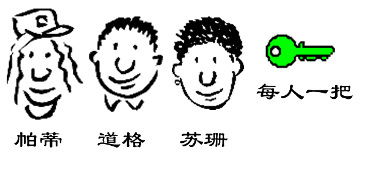
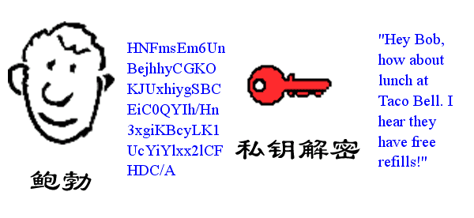
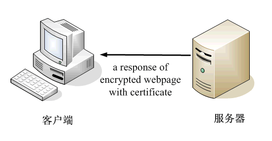

# 加密解密详解

## 一、名词介绍

### 1、加密

是以某种特殊的算法改变原有的信息数据，以另外一种形式呈现，这里有几个名词：加密之前的信息数据可以理解为原数据，原文；加密之后的数据信息可以被理解为密文，一般的呈现格式为一串字符，从字符上来看，没有什么规律！

### 2、解密

由加密后得到的密文，通过解密算法，解密以后，可以得到未曾加密之前的原信息数据，原文，被称之为解密

## 二、加密的分类

### 1、不可逆加密

不可逆，就是指不能不能返回，就是原信息数据，通过加密后得到的密文数据信息，不存在算法，让密文变回来，不能变回原文信息； 经常以MD5 hash散列计算为代表；

### 2、可逆加密

可逆，就是指原信息数据，通过加密算法，加密后，得到的密文数据信息，存在一种解密算法，可以让密文解密后得到原文信息

## 三、不可逆加密MD5

MD5加密，就是典型的不可逆的加密，因为他只能从数据信息通过加密后得到密文信息，而不能从密文再通过计算得到原文；

### 1、规则

- MD5公开的算法，hash散列计算; 任何语言实现后其实都一样，通用的，无论是C#，java各种语言的实现都一样的。本质是通过hash散列计算,可以对普通的数据信息进行加密，也可以对文件生成文件的摘要。
- 相同原数据信息加密的结果是一样的
- 不同长度的内容加密后加过都是 32 位
- 原文差别很小，结果差别很大
- 不管文件多大，都能产生 32 位长度摘要
- 文件内容有一点改动，结果变化非常大
- 文件内容不变，名字变了，结果是不变

### 2、作用

#### （1）防篡改

发个文档，事先给别人一个MD5，是文档的摘要；

源代码管理器svn，即使电脑断网了，文件有任何改动都能被发现，本地存了一个文件的MD5，文件有更新，就再对比下MD5；

极速秒传，扫描文件的MD5跟已有的文件MD5比对，吻合表示文件已存在不用再上传；

#### （2）密码保存，防止看到明文

密码只有用户知道，数据库不能存明文，但是又需要验证，MD5加密下原始密码，数据库存密文，下次登录把密码MD5后再比对，密文是可见的，所以要求密码不能太简单，加密的时候还可以加盐

#### （3）防止抵赖

防止抵赖，数字签名，把一些内容摘要一下，由权威的第三方去保障，将来这个文件就是你做的，不能抵赖

### 3、MD5的争议

实质上，MD5 只是一种哈希算法。哈希算法，又叫散列算法，是一类把任意数据转换为定长（或限制长度）数据的算法统称。可以把数据计算后得到一个hash散列值，不能计算得到原数据。

部分人认为MD5不算是加密算法，他们认为加密就要对应一个解密，可以把原文加密成密文，也能从密文解密到原文，这才算加密。也有部分人认为这个为不可逆加密。

### 4、代码实现

> 帮助类实现

```C#
using System.IO;
using System.Security.Cryptography;
using System.Text;

namespace MyEncryption
{
    public class MD5Encrypt
    {        
        /// <summary>
        /// MD5加密,和动网上的16/32位MD5加密结果相同
        /// 使用的UTF8编码
        /// </summary>
        /// <param name="source">待加密字串</param>
        /// <param name="length">16或32值之一,其它则采用.net默认MD5加密算法</param>
        /// <returns>加密后的字串</returns>
        public static string Encrypt(string source, int length = 32)//默认参数
        {
            if (string.IsNullOrEmpty(source)) return string.Empty;
            HashAlgorithm provider = CryptoConfig.CreateFromName("MD5") as HashAlgorithm;
            byte[] bytes = Encoding.UTF8.GetBytes(source);//这里需要区别编码的
            byte[] hashValue = provider.ComputeHash(bytes);
            StringBuilder sb = new StringBuilder();
            switch (length)
            {
                case 16://16位密文是32位密文的9到24位字符
                    for (int i = 4; i < 12; i++)
                    {
                        sb.Append(hashValue[i].ToString("x2"));
                    }
                    break;
                case 32:
                    for (int i = 0; i < 16; i++)
                    {
                        sb.Append(hashValue[i].ToString("x2"));
                    }
                    break;
                default:
                    for (int i = 0; i < hashValue.Length; i++)
                    {
                        sb.Append(hashValue[i].ToString("x2"));
                    }
                    break;
            }
            return sb.ToString();
        }
        
        /// <summary>
        /// 获取文件的MD5摘要
        /// </summary>
        /// <param name="fileName"></param>
        /// <returns></returns>
        public static string AbstractFile(string fileName)
        {
            using (FileStream file = new FileStream(fileName, FileMode.Open))
            {
                return AbstractFile(file);
            }
        }

        /// <summary>
        /// 根据stream获取文件摘要
        /// </summary>
        /// <param name="stream"></param>
        /// <returns></returns>
        public static string AbstractFile(Stream stream)
        {
            MD5 md5 = new MD5CryptoServiceProvider();
            byte[] retVal = md5.ComputeHash(stream);

            StringBuilder sb = new StringBuilder();
            for (int i = 0; i < retVal.Length; i++)
            {
                sb.Append(retVal[i].ToString("x2"));
            }
            return sb.ToString();
        }
    }
}
```

> 方法调用

```c#
Console.WriteLine("MD5加密");
Console.WriteLine(MD5Encrypt.Encrypt("张三"));
Console.WriteLine(MD5Encrypt.Encrypt("张三"));
Console.WriteLine(MD5Encrypt.Encrypt("李四李四李四李四李四李四李四李四李四李四李四"));
Console.WriteLine(MD5Encrypt.Encrypt("李四李四李四李四李四李四李四李四李四李四李四1"));
Console.WriteLine(MD5Encrypt.Encrypt("王五王五王五王五王五王五王五王五王五王五王五王五王五王五王五王五王五王五王五王五王五王五王五王五王五王五王五"));

Console.WriteLine("文件摘要");
Console.WriteLine(MD5Encrypt.AbstractFile(@"D:\NetDemos\Test\测试文件.txt"));
Console.WriteLine(MD5Encrypt.AbstractFile(@"D:\NetDemos\Test\测试文件 - 副本.txt"));
```

> 运行结果

```bash
MD5加密
615db57aa314529aaa0fbe95b3e95bd3
615db57aa314529aaa0fbe95b3e95bd3
411a00d579f8898bee53233556e1f576
e2346a00c442ad4c456bd4cfc0370412
11dd6aacb4ab2a363cabc3b0ab5eca64
文件摘要
d41d8cd98f00b204e9800998ecf8427e
d41d8cd98f00b204e9800998ecf8427e
```

## 四、对称可逆加密Des

### 1、规则

（1）对称可逆加密，有一组加密解密算法，成套的，且算法是公开的，不同编程语言的应用也是相同的。

（2）加密和解密均需要使用相同的秘钥。

（3）知道加密解密算法，无法推导出密钥的。

### 2、特点

（1）原文长，加密后，密文也长，原文短，加密后，密文也相对要短一些。

（2）加密解密速度超快

（3）容易泄露秘钥，因为秘钥是一样的，安全性不是最高，相比于非对称可逆加密而言；

### 3、作用

（1）互联网传输加密数据信息

（2）防止抵赖

（3）Jwt鉴权授权

### 4、代码实现

> 帮助类实现

```C#
using System;
using System.IO;
using System.Security.Cryptography;
using System.Text;

namespace MyEncryption
{
    public class DesEncrypt
    {
        //密钥长度8位
        private static byte[] _rgbKey = ASCIIEncoding.ASCII.GetBytes("密钥一个用于测试");
        private static byte[] _rgbIV = ASCIIEncoding.ASCII.GetBytes("密钥一个用于测试");

        /// <summary>
        /// DES加密
        /// </summary>
        /// <param name="text">需要加密的值</param>
        /// <returns>加密后的结果</returns>
        public static string Encrypt(string text)
        {
            DESCryptoServiceProvider dsp = new DESCryptoServiceProvider();
            using (MemoryStream memStream = new MemoryStream())
            {
                CryptoStream crypStream = new CryptoStream(memStream, dsp.CreateEncryptor(_rgbKey, _rgbIV), CryptoStreamMode.Write);
                StreamWriter sWriter = new StreamWriter(crypStream);
                sWriter.Write(text);
                sWriter.Flush();
                crypStream.FlushFinalBlock();
                memStream.Flush();
                return Convert.ToBase64String(memStream.GetBuffer(), 0, (int)memStream.Length);
            }
        }

        /// <summary>
        /// DES解密
        /// </summary>
        /// <param name="encryptText"></param>
        /// <returns>解密后的结果</returns>
        public static string Decrypt(string encryptText)
        {
            DESCryptoServiceProvider dsp = new DESCryptoServiceProvider();
            byte[] buffer = Convert.FromBase64String(encryptText);

            using (MemoryStream memStream = new MemoryStream())
            {
                CryptoStream crypStream = new CryptoStream(memStream, dsp.CreateDecryptor(_rgbKey, _rgbIV), CryptoStreamMode.Write);
                crypStream.Write(buffer, 0, buffer.Length);
                crypStream.FlushFinalBlock();
                return ASCIIEncoding.UTF8.GetString(memStream.ToArray());
            }
        }
    }
}
```

> 方法调用

```C#
Console.WriteLine("DES加密");
string desEn = DesEncrypt.Encrypt("张三");
string desEn1 = DesEncrypt.Encrypt("李四123456");
Console.WriteLine(desEn);
Console.WriteLine(desEn1);
Console.WriteLine("DES解密");
string desDe = DesEncrypt.Decrypt(desEn);                
string desDe1 = DesEncrypt.Decrypt(desEn1);
Console.WriteLine(desDe);
Console.WriteLine(desDe1);
```

> 运行结果

```bash
DES加密
rFVuruwHmng=
L+FlmTJoZ/AmhETZ6MbAEw==
DES解密
张三
李四123456
```

## 五、非对称可逆加密Rsa

### 1、规则

（1）非对称可逆加密：有一套公开的加密解密算法，公开的，大家都知道；

（2）同时有一组加密解密Key，这组Key是成套的，且两个Key不一样；无法通过加密算法推导出这一组
key；且具有私有key和共有key之分，私有key就是只有自己知道的，私有化的；可以加密也可以解密；
公有key，是公开的，所有人都可以知道。

注意：在其他的有些实现中，是私有key加密，公有key解密，这个是为了能够做签名；在C#中的实现，
提供的Api是公有key加密，只能由私有key解密； 关于签名这个有另外的api支持.

### 2、特点

（1）原文短，加密后，密文长

（2）加密速度相对要慢

（3）安全性超强，成套的加密解密key不一样

### 3、作用

（1）数据的安全传输

（2）直接支持的加密解密api，还无法完成签名

签名：实际在数字签名的时候，是需要私有key加密，公有key解密

### 4、代码实现

> 帮助类实现

```C#
using System;
using System.Security.Cryptography;
using System.Text;

namespace MyEncryption
{
    public class KeyModel
    {
        /// <summary>
        /// 构造函数
        /// </summary>
        /// <param name="publicKey">共有key</param>
        /// <param name="privateKey">私有key</param>
        public KeyModel(string publicKey, string privateKey)
        {
            this.PublicKey = publicKey;
            this.PrivateKey = privateKey;
        }

        /// <summary>
        /// 公有Key---加密key
        /// </summary>
        public string PublicKey { get; set; }

        /// <summary>
        /// 私有Key--可以加密也可以加密
        /// </summary>
        public string PrivateKey { get; set; }
    }
    
    public class RsaEncrypt
    {
        /// <summary>
        /// 获取公钥/私钥
        /// 每次生成的公钥和私钥都不一样
        /// </summary>
        /// <returns>Encrypt   Decrypt</returns>
        public static KeyModel GetKeyPair()
        {
            RSACryptoServiceProvider RSA = new RSACryptoServiceProvider();

            //包括专用参数： 如果为true，则包含公钥和私钥RSA密钥；false，仅包括公众钥匙 
            string publicKey = RSA.ToXmlString(false); //生成的是公开的解密key
            string privateKey = RSA.ToXmlString(true); //生成的是私有的既可以加密也可以解密的key
            return new KeyModel(publicKey, privateKey);
        }

        /// <summary>
        /// RSA加密
        /// </summary>
        /// <param name="content"></param>
        /// <param name="encryptKey">加密key</param>
        /// <returns></returns>
        public static string Encrypt(string content, string encryptKey)
        {
            RSACryptoServiceProvider rsa = new RSACryptoServiceProvider();
            rsa.FromXmlString(encryptKey);
            UnicodeEncoding ByteConverter = new UnicodeEncoding();
            byte[] DataToEncrypt = ByteConverter.GetBytes(content);
            byte[] resultBytes = rsa.Encrypt(DataToEncrypt, false);
            return Convert.ToBase64String(resultBytes);
        }

        /// <summary>
        /// RSA解密
        /// </summary>
        /// <param name="content"></param>
        /// <param name="decryptKey">解密key</param>
        /// <returns></returns>
        public static string Decrypt(string content, string decryptKey)
        {
            byte[] dataToDecrypt = Convert.FromBase64String(content);
            RSACryptoServiceProvider RSA = new RSACryptoServiceProvider();
            RSA.FromXmlString(decryptKey);
            byte[] resultBytes = RSA.Decrypt(dataToDecrypt, false);
            UnicodeEncoding ByteConverter = new UnicodeEncoding();
            return ByteConverter.GetString(resultBytes);
        }

        /// <summary>
        /// 生成签名
        /// </summary>
        /// <param name="content"></param>
        /// <param name="decryptKey"></param>
        /// <returns></returns>
        public static string SignData(string content, string privatekey)
        { 
            byte[] messagebytes = Encoding.UTF8.GetBytes(content);
            RSACryptoServiceProvider oRSA3 = new RSACryptoServiceProvider();
            oRSA3.FromXmlString(privatekey);
            byte[] AOutput = oRSA3.SignData(messagebytes, "SHA1");
            return Convert.ToBase64String(AOutput);
        }
         
        /// <summary>
        /// 验证签名
        /// </summary>
        /// <param name="content">原文</param>
        /// <param name="autograph">签名</param>
        /// <param name="publickey">共有key</param>
        /// <returns></returns>
        public static bool VerifyData(string content, string autograph, string publickey)
        {
            byte[] messagebytes = Encoding.UTF8.GetBytes(content); 
            byte[] messageAutographbytes = Convert.FromBase64String(autograph); 
            RSACryptoServiceProvider RSA = new RSACryptoServiceProvider();
            RSA.FromXmlString(publickey);
            bool bVerify = RSA.VerifyData(messagebytes, "SHA1", messageAutographbytes); 
            return bVerify; 
        }

        /// <summary>
        /// 生成公钥私钥，同时完成加密
        /// </summary>
        /// <param name="content"></param>
        /// <param name="encryptKey">加密key</param>
        /// <param name="decryptKey">解密key</param>
        /// <returns>加密后结果</returns>
        private static string Encrypt(string content, out string publicKey, out string privateKey)
        {
            RSACryptoServiceProvider rsaProvider = new RSACryptoServiceProvider();
            publicKey = rsaProvider.ToXmlString(false);
            privateKey = rsaProvider.ToXmlString(true);

            UnicodeEncoding ByteConverter = new UnicodeEncoding();
            byte[] DataToEncrypt = ByteConverter.GetBytes(content);
            byte[] resultBytes = rsaProvider.Encrypt(DataToEncrypt, false);
            return Convert.ToBase64String(resultBytes);
        }
    }
}
```

> 方法调用

```C#
//获取公钥和私钥，每次生成的都不一样
Console.WriteLine($"生成公钥和私钥");
KeyModel encryptDecrypt = RsaEncrypt.GetKeyPair();
Console.WriteLine($"私钥：{encryptDecrypt.PrivateKey}");
Console.WriteLine($"公钥：{encryptDecrypt.PublicKey}");

//私钥加密，私钥解密  私钥能加密的原因是私钥包含公钥
Console.WriteLine($"私钥加密，私钥解密");
string rsaEn1 = RsaEncrypt.Encrypt("张三", encryptDecrypt.PrivateKey);
Console.WriteLine($"密文:{rsaEn1}");
Console.WriteLine($"解密：{RsaEncrypt.Decrypt(rsaEn1, encryptDecrypt.PrivateKey)}");

//公钥加密，私钥解密
Console.WriteLine($"公钥加密，私钥解密");
string rsaEn2 = RsaEncrypt.Encrypt("张三", encryptDecrypt.PublicKey);
Console.WriteLine($"密文:{rsaEn2}");
Console.WriteLine($"解密：{RsaEncrypt.Decrypt(rsaEn2, encryptDecrypt.PrivateKey)}");

//生成签名
Console.WriteLine($"生成签名");
string autograph = RsaEncrypt.SignData("生成签名的原文", encryptDecrypt.PrivateKey);
Console.WriteLine($"签名:{autograph}");

//验证签名
Console.WriteLine($"验证签名");
Console.WriteLine($"验证签名:{RsaEncrypt.VerifyData("生成签名的原文", autograph, encryptDecrypt.PublicKey)}");
Console.WriteLine($"验证签名原文改动:{RsaEncrypt.VerifyData("生成签名的原文改动", autograph, encryptDecrypt.PublicKey)}");
```

> 运行结果

```bash
生成公钥和私钥
私钥：<RSAKeyValue><Modulus>4xBhjhNQFhMYfO4AjPDjc8QY+2b4QCYhBqHUS1nWwWO+ophiuGiAQIYM7WyCVSNBOzBTdG4v/dRNM5keEztJLNJNdfHz24rj2hTJtXnq+0gFTALseLkD2rpZHor3Pb9g7rL10rRN1z0w4z7gXRRhP7wlnBUth74GPhP1E8LkKIE=</Modulus><Exponent>AQAB</Exponent><P>7tIT3Hn/Vj//9T3jpiB+HgnS3RSso1dsNwg2EghyyxDDciG36aNsKKuiwCZ+HQb+otz2I+5Xoxi9l7WRqmulJw==</P><Q>82XNnlwl0Cqe+gGHjEI5wnT1O+QWUI5MED2H1fUFUCUbg+I3e33wTuSY09nR9hcOpQX5ZEjotII9nCEVE0xeFw==</Q><DP>nCqFUEv6WwUYs95XiZ9/uNbFq0nEpj8ZhVb6PIqHvh/lHjHMWJxDssihcTL6jrKvOgJxdgd6CS25dIYHjcA8Sw==</DP><DQ>ku/Gbe+bNExGpQ7/UYE5dVc+JOXRQthkuvkqY9QDXRrJvZh3finNRRNj36EDy9inkqBEqnIJac+mefbOzlOwCQ==</DQ><InverseQ>Uh8o3BO+nd5EibZKW4G/BxEkRQlGYKAbLCbCew7ZMuq5LUxrybTW/sVJlFfAoburKBPoUi6EFsc4D6qsuiCw8w==</InverseQ><D>yRptDKRWPfbTrXIt0qZXDOUVKzRbkpUykukpWUNMTSPGZ8OHS8RiMsOHF5EPLdB3qbB3eZtNrgYmChkG5gmQGBNjSYbmLfB23se032zTZr9+B79hNhBLTD+XXfN6PG3WJa42nhg1UNdQHq/cmCgSF9GYa7K9PSecwDI3QF9gZfE=</D></RSAKeyValue>
公钥：<RSAKeyValue><Modulus>4xBhjhNQFhMYfO4AjPDjc8QY+2b4QCYhBqHUS1nWwWO+ophiuGiAQIYM7WyCVSNBOzBTdG4v/dRNM5keEztJLNJNdfHz24rj2hTJtXnq+0gFTALseLkD2rpZHor3Pb9g7rL10rRN1z0w4z7gXRRhP7wlnBUth74GPhP1E8LkKIE=</Modulus><Exponent>AQAB</Exponent></RSAKeyValue>
私钥加密，私钥解密
密文:qC+Yq/Bc6Qq9ngZQMnytRBVi43A08ixa7t0KK8g2k1CUAHCXqXFIIvwF1m81HswC0FMbBrQEr3uGCh53TEzURkqilVgNtIrR4yxLGO52+70QBIc5mHtToMIKklaDCoIwtW0tWRbBg9fUZUN5NO7pIlyBg8rV3/alZZ+1ARYpyVM=
解密：张三
公钥加密，私钥解密
密文:nT89S1mQwN7KHW6teRATkxNTEkJgqE7w5/N1eyl18+lrXyEmYRL3Uec5nsRfF8uxjkHRAh8UyRWpFnkNmg+k107MC7bkrzi5OqxDIPWSvh1tGJnuvxWC+XXwaX8T0JaQi6qexNklZMGDrsh26k+X8ysJlfkU8XEcojm182f0rZo=
解密：张三
生成签名
签名:gJCX5SEQ2EVBW36fWfx35v+CiM3MdIGqYwoa4Ybw3nlvd8/GCiai1GYtuWP6xVeCBgyKtE2pJEd5Vskp+9ym9BNbUWyKcKycUedLCRqZgemkVDGZhcsRUJTbWSqLvIZcCgfMKpl4WdZKJAmeDi+UrEXDXpGQ0wAVTaqqrd0sDCY=
验证签名
验证签名:True
验证签名原文改动:False
```

## 六、数字签名和数字证书

### 1、数字签名

数字签名是一种类似写在纸上的普通的物理签名，但是使用了公钥加密领域的技术实现，用于鉴别数字信息的方法。


### 2、数字证书

数字证书是由权威机构CA证书授权中心发行的，能提供在Internet上进行身份验证的一种权威性电子文档。


### 3、数字签名数字证书原理案例图解（转自阮一峰）

（1）鲍勃有两把钥匙，一把是公钥，另一把是私钥。


（2）鲍勃把公钥送给他的朋友们----帕蒂、道格、苏珊----每人一把。




（3）苏珊要给鲍勃写一封保密的信。她写完后用鲍勃的公钥加密，就可以达到保密的效果。


（4）鲍勃收信后，用私钥解密，就看到了信件内容。这里要强调的是，只要鲍勃的私钥不泄露，这封信就是安全的，即使落在别人手里，也无法解密。




（5）鲍勃给苏珊回信，决定采用"数字签名"。他写完后先用Hash函数（比如MD5），生成信件的摘要（digest）。


（6）然后，鲍勃使用私钥，对这个摘要加密，生成"数字签名"（signature）。


（7）鲍勃将这个签名，附在信件下面，一起发给苏珊。


（8）苏珊收信后，取下数字签名，用鲍勃的公钥解密，得到信件的摘要。由此证明，这封信确实是鲍勃发出的。


（9）苏珊再对信件本身使用Hash函数，将得到的结果，与上一步得到的摘要进行对比。如果两者一致，就证明这封信未被修改过。


（10）复杂的情况出现了。道格想欺骗苏珊，他偷偷使用了苏珊的电脑，用自己的公钥换走了鲍勃的公钥。此时，苏珊实际拥有的是道格的公钥，但是还以为这是鲍勃的公钥。因此，道格就可以冒充鲍勃，用自己的私钥做成"数字签名"，写信给苏珊，让苏珊用假的鲍勃公钥进行解密。


（11）后来，苏珊感觉不对劲，发现自己无法确定公钥是否真的属于鲍勃。她想到了一个办法，要求鲍勃去找"证书中心"（certificate authority，简称CA），为公钥做认证。证书中心用自己的私钥，对鲍勃的公钥和一些相关信息一起加密，生成"数字证书"（Digital Certificate）。


（12）鲍勃拿到数字证书以后，就可以放心了。以后再给苏珊写信，只要在签名的同时，再附上数字证书就行了。


（13）苏珊收信后，用CA的公钥解开数字证书，就可以拿到鲍勃真实的公钥了，然后就能证明"数字签名"是否真的是鲍勃签的。


　

## 七、数字证书的应用HTTPS

### 1、实现原理（转自阮一峰）

（1）首先，客户端向服务器发出加密请求。


（2）服务器用自己的私钥加密网页以后，连同本身的数字证书，一起发送给客户端。




（3）客户端（浏览器）的"证书管理器"，有"受信任的根证书颁发机构"列表。客户端会根据这张列表，查看解开数字证书的公钥是否在列表之内。


（4）如果数字证书记载的网址，与你正在浏览的网址不一致，就说明这张证书可能被冒用，浏览器会发出警告。


（5）如果这张数字证书不是由受信任的机构颁发的，浏览器会发出另一种警告。


（6）如果数字证书是可靠的，客户端就可以使用证书中的服务器公钥，对信息进行加密，然后与服务器交换加密信息。


### 2、阿里云SSL证书下载

#### （1）阿里云服务器购买一台

#### （2）申请域名一个

#### （3）域名绑定IP地址

#### （4）申请SSL证书

> 点击进入SSL证书配置页面


> 购买免费证书


每个实名用户一年可以有20个免费证书下载


> 创建证书


> 证书绑定域名联系人


> 验证成功，提交


#### （5）下载证书


#### （6）下载证书解压

证书的密码就在密码文件里


### 3、IIS网站部署数字证书

#### （1）打开IIS，找到服务器证书


#### （2）导入下载的IIS证书


#### （3）选择下载的证书，输入密码文件中的密码


#### （4）配置网站，选定导入的证书


