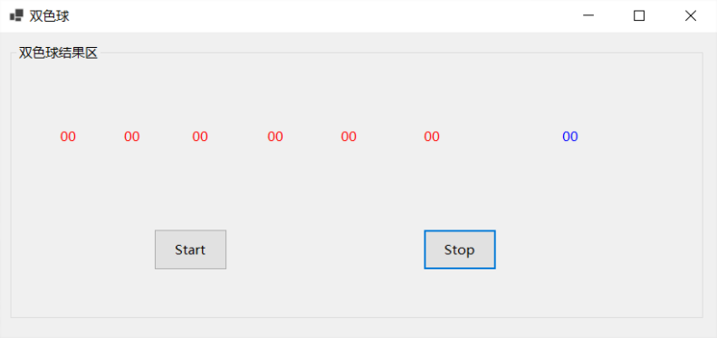

# 多线程详解

## 一、什么是多线程

### 1、进程

当一个程序开始运行时，它就是一个进程，进程包括运行中的程序和程序所使用到的内存和系统资源。 而一个进程又是由多个线程所组成的。

### 2、线程

线程是程序中的一个执行流，每个线程都有自己的专有寄存器(栈指针、程序计数器等)，但代码区是共享的，即不同的线程可以执行同样的函数。

### 3、句柄

句柄是Windows系统中对象或实例的标识，这些对象包括模块、应用程序实例、窗口、控制、位图、GDI对象、资源、文件等。

### 4、多线程

#### （1）多线程概念

多线程是指程序中包含多个执行流，即在一个程序中可以同时运行多个不同的线程来执行不同的任务，也就是说允许单个程序创建多个并行执行的线程来完成各自的任务。

#### （2）多线程优点

可以提高CPU的利用率。在多线程程序中，一个线程必须等待的时候，CPU可以运行其它的线程而不是等待，这样就大大提高了程序的效率。**（牺牲空间计算资源，来换取时间）**

#### （3）多线程缺点

- 线程也是程序，所以线程运行需要占用计算机资源，线程越多占用资源也越多。**（占内存多）**
- 多线程需要协调和管理，所以需要CPU跟踪线程，消耗CPU资源。**（占cpu多）**
- 线程之间对共享资源的访问会相互影响，必须解决竞用共享资源的问题。**多线程存在资源共享问题）**
- 线程太多会导致控制太复杂，最终可能造成很多Bug。**（管理麻烦，容易产生bug）**

#### （4）为什么计算机可以多线程

- 程序运行需要计算机资源，操作系统就会去申请CPU来处理，CPU在执行动作的时候是分片执行的。
- 分片：把CPU的处理能力进行切分，操作系统在调度的时候，按照切片去处理不同的计算需求，按照规则分配切片计算资源，对于同一个计算机核心来讲，所有的运行都是串行的，但是因为分片的存在，感觉几个程序同时在向前推进。

#### （5）何时建议使用多线程

- 当主线程试图执行冗长的操作，但系统会卡界面，体验非常不好，这时候可以开辟一个新线程，来处理这项冗长的工作。
-  当请求别的数据库服务器、业务服务器等，可以开辟一个新线程，让主线程继续干别的事。
-  利用多线程拆分复杂运算，提高计算速度。

#### （6）何时不建议使用多线程

当单线程能很好解决，就不要为了使用多线程而用多线程。

### 5、同步，异步

#### （1）同步方法

线性执行，从上往下依次执行，同步方法执行慢，消耗的计算机资源少。

#### （2）异步方法

线程和线程之间，不再线型执行，多个线程总的耗时少，执行快，消耗的计算机资源多，各线程执行是无序的。

### 6、C#中的多线程

Thread/ThreadPool/Task 都是C#语言在操作计算机的资源时封装的帮助类库。

## 二、Thread

Thread是.Net最早的多线程处理方式，它出现在.Net1.0时代，虽然现在已逐渐被微软所抛弃，微软强烈推荐使用Task，但从多线程完整性的角度上来说，我们有必要了解下早期多线程的是怎么处理的，以便体会.Net体系中多线程处理方式的进化。

### 1、如何开启新线程

> 分析Thread类的源码，发现其构造函数参数有两类

- ThreadStart类：是无参无返回值的委托。
- ParameterizedThreadStart类：是有一个object类型参数但无返回值的委托。

> 开启了一个新的线程1

```C#
ParameterizedThreadStart parameterizedThreadStart = new ParameterizedThreadStart((oInstacnce) =>
{
    Debug.WriteLine($"ParameterizedThreadStart--{Thread.CurrentThread.ManagedThreadId.ToString("00")}--{DateTime.Now.ToString(" HH:mm:ss.fff")}");
});
Thread thread = new Thread(parameterizedThreadStart);
thread.Start();
```

> 开启了一个新的线程2

```C#
ThreadStart threadStart = new ThreadStart(() =>
{
    this.DoSomething("张三");
});
Thread thread = new Thread(threadStart);
thread.Start();
```

### 2、线程的停止等待

```C#
Thread thread = new Thread(() =>
{
    this.DoSomething("张三", 5000);
});
thread.Start();
//thread.Suspend(); //表示线程暂停，现在已弃用，NetCore平台已经不支持
//thread.Resume();  //线程恢复执行，弃用，NetCore平台已经不支持
//thread.Abort();   //线程停止，子线程对外抛出了一个异常，线程是无法从外部去终止的
//Thread.ResetAbort();//停止的线程继续去执行

//thread.ThreadState
//根据线程状态ThreadState判断实现线程间歇性休息
//while (thread.ThreadState != System.Threading.ThreadState.Stopped)
//{
//    Thread.Sleep(500); //当前休息500ms，不消耗计算机资源的
//}

thread.Join();//主线程等待，直到当前线程执行完毕
//thread.Join(500);//主线程等待500毫秒，不管当前线程执行是否完毕，都继续往后执行
//thread.Join(new TimeSpan(500*10000));//主线程等待500毫秒，不管当前线程执行是否完毕，都继续往后执行
//TimeSpan 单位100纳秒  1毫秒=10000*100纳秒
```

### 3、后台线程，前台线程

#### （1）后台线程，界面关闭，线程也就随之消失

#### （2）前台线程，界面关闭，线程会等待执行完才结束

```C#
Thread thread = new Thread(() =>
{
    this.DoSomething("张三");
});
thread.Start();
thread.IsBackground = true;//后台线程，界面关闭，线程也就随之消失
thread.IsBackground = false;//前台线程，界面关闭，线程会等待执行完才结束
thread.Start();
```

### 4、跨线程操作主线程UI

```C#
Thread thread = new Thread(() =>
{
    for (int i = 0; i <= 5; i++)
    {
        Thread.Sleep(500);
        textBox1.Invoke(new Action(()=> textBox1.Text = i.ToString()));
    }
});
thread.Start();
```

### 5、线程的优先级

设置优先级只是提高了他被优先执行的概率

```C#
Thread thread = new Thread(() =>
{
    this.DoSomething("张三");
});
// 线程的优先级最高
thread.Priority = ThreadPriority.Highest;

Thread thread1 = new Thread(() =>
{
    this.DoSomething("张三");
});
// 线程的优先级最低
thread1.Priority = ThreadPriority.Lowest;
thread.Start();
thread1.Start();//线程开启后，根据优先级，来执行
```

### 6、扩展封装

#### （1）实现两个委托多线程顺序执行

> 方法封装

```C#
private void CallBackThread(Action action1, Action action2)
{
    Thread thread = new Thread(() =>
    {
        action1.Invoke();
        action2.Invoke();
    });
    thread.Start();
}
```

> 方法调用

```C#
Action action1 = () =>
{
    this.DoSomething("张三");
};
Action action2 = () =>
{
    this.DoSomething("李四");
};
//不会阻塞线程
CallBackThread(action1, action2);
```

> 运行结果

```bash、
DoSomething--Start--张三--06--16:57:21.411
DoSomething--End--张三--06--16:57:23.412
DoSomething--Start--李四--06--16:57:23.417
DoSomething--End--李四--06--16:57:25.423
```

#### （2）实现获取多线程执行委托的结果

> 方法封装

```C#
private Func<T> CallBackFunc<T>(Func<T> func)
{
    T t = default(T);
    ThreadStart threadStart = new ThreadStart(() =>
    {
        t = func.Invoke();
    });
    Thread thread = new Thread(threadStart);
    thread.Start();

    return new Func<T>(() =>
    {
        thread.Join();//等待thread执行完成；
        return t;
    });
}
```

> 方法调用

```c#
Func<int> func = () =>
{
    this.DoSomething("王五");
    return DateTime.Now.Year;
};
//这一步不会阻塞界面
Func<int> func1 = this.CallBackFunc<int>(func);
Debug.WriteLine("线程开启后，计算结果出来前");
//这里会等待线程计算出结果才继续往后执行
int iResult = func1.Invoke();
Debug.WriteLine($"计算结果：{iResult}");
```

> 运行结果

```bash
线程开启后，计算结果出来前
DoSomething--Start--王五--09--17:06:12.088
DoSomething--End--王五--09--17:06:14.090
计算结果：2021
```

### 7、数据槽

为了解决多线程竞用共享资源的问题，引入数据槽的概念，即将数据存放到线程的环境块中，使该数据只能单一线程访问。

#### （1）AllocateNamedDataSlot命名槽位和AllocateDataSlot未命名槽位

在主线程上设置槽位，使该数据只能被主线程读取，其它线程无法访问

> AllocateNamedDataSlot命名槽位

```C#
var d = Thread.AllocateNamedDataSlot("userName");
Thread.SetData(d, "张三");
//声明一个子线程
var t1 = new Thread(() =>
{
    Debug.WriteLine($"子线程中读取数据：{Thread.GetData(d)}");
});
t1.Start();
//主线程中读取数据
Debug.WriteLine($"主线程中读取数据：{Thread.GetData(d)}");
```

> AllocateDataSlot未命名槽位

```C#
var d = Thread.AllocateDataSlot();
Thread.SetData(d, "李四");
//声明一个子线程
var t1 = new Thread(() =>
{
    Debug.WriteLine($"子线程中读取数据：{Thread.GetData(d)}");
});
t1.Start();
//主线程中读取数据
Debug.WriteLine($"主线程中读取数据：{Thread.GetData(d)}");
```

> 运行结果

```bash
主线程中读取数据：张三
子线程中读取数据：
主线程中读取数据：李四
子线程中读取数据：
```

#### （2）利用特性[ThreadStatic]

在主线程中给ThreadStatic特性标注的变量赋值，则只有主线程能访问该变量

> 变量标记特性

```C#
[ThreadStatic]
private static string Age = string.Empty;
```

> 线程访问变量

```C#
Age = "小女子年方28";
//声明一个子线程
var t1 = new Thread(() =>
{
    Debug.WriteLine($"子线程中读取数据：{Age}");
});
t1.Start();
//主线程中读取数据
Debug.WriteLine($"主线程中读取数据：{Age}");
```

> 运行结果

```bash
主线程中读取数据：小女子年方28
子线程中读取数据：
```

#### （3）利用ThreadLocal线程的本地存储

在主线程中声明ThreadLocal变量，并对其赋值，则只有主线程能访问该变量

> 程序访问

```C#
ThreadLocal<string> tlocalSex = new ThreadLocal<string>();
tlocalSex.Value = "女博士";
//声明一个子线程
var t1 = new Thread(() =>
{
    Debug.WriteLine($"子线程中读取数据：{tlocalSex.Value}");
});
t1.Start();
//主线程中读取数据
Debug.WriteLine($"主线程中读取数据：{tlocalSex.Value}");
```

> 运行结果

```C#
主线程中读取数据：女博士
子线程中读取数据：
```

### 8、内存栅栏

当多个线程共享一个变量的时候，在Release模式的优化下，子线程会将共享变量加载到cup Cache中，导致主线程不能使用该变量而无法运行

#### （1）默认情况(Release模式主线程不能正常运行)

```C#
var isStop = false;
var t = new Thread(() =>
{
    var isSuccess = false;
    while (!isStop)
    {
        isSuccess = !isSuccess;
    }
    Trace.WriteLine("子线程执行成功");
});
t.Start();
Thread.Sleep(1000);
isStop = true;
t.Join();
Trace.WriteLine("主线程执行结束");
```

#### （2）MemoryBarrier解决共享变量（Release模式下可以正常运行）

在此方法之前的内存写入都要及时从cpu cache中更新到memory；在此方法之后的内存读取都要从memory中读取，而不是cpu cache。

```C#
var isStop = false;
var t = new Thread(() =>
{
    var isSuccess = false;
    while (!isStop)
    {
        Thread.MemoryBarrier();
        isSuccess = !isSuccess;
    }
    Trace.WriteLine("子线程执行成功");
});
t.Start();
Thread.Sleep(1000);
isStop = true;
t.Join();
Trace.WriteLine("主线程执行结束");
```

#### （3）VolatileRead解决共享变量（Release模式下可以正常运行）

```C#
var isStop = 0;
var t = new Thread(() =>
{
    var isSuccess = false;
    while (isStop == 0)
    {
        Thread.VolatileRead(ref isStop);
        isSuccess = !isSuccess;
    }
    Trace.WriteLine("子线程执行成功");
});
t.Start();
Thread.Sleep(1000);
isStop = 1;
t.Join();
Trace.WriteLine("主线程执行结束");
```

## 三、ThreadPool

.NET Framework2.0时代，出现了一个线程池ThreadPool，是一种池化思想，如果需要使用线程，就可以直接到线程池中去获取直接使用，如果使用完毕，在自动的回放到线程池去；

### 1、ThreadPool好处

不需要程序员对线程的数量管控,提高性能，防止滥用，去掉了很多在Thread中没有必要的Api

### 2、线程池如何分配一个线程

QueueUserWorkItem方法，将方法排入队列以便开启异步线程，它有两个重载。

- QueueUserWorkItem(WaitCallback callBack)，WaitCallback是一个有一个object类型参数且无返回值的委托。
- QueueUserWorkItem(WaitCallback callBack, object state)，WaitCallback是一个有一个object类型参数且无返回值的委托，state即WaitCallback中需要的参数， 不推荐这么使用，存在拆箱装箱的转换问题，影响性能。

```C#
//无参数
ThreadPool.QueueUserWorkItem(o =>this.DoSomething("张三"));
//一个参数
ThreadPool.QueueUserWorkItem(o => this.DoSomething("张三"), "12345");
```

### 3、线程等待

（1）定义一个监听ManualResetEvent
（2）通过ManualResetEvent.WaitOne等待
（3）等到ManualResetEvent.Set方法执行了，主线程等待的这个WaitOne()就继续往后执行

```C#
ManualResetEvent resetEvent = new ManualResetEvent(false);
ThreadPool.QueueUserWorkItem(o =>
{
    this.DoSomething(o.ToString());
    resetEvent.Set();
}, "张三");
resetEvent.WaitOne();
```

### 4、线程池如何控制线程数量

如果通过SetMinThreads/SetMaxThreads来设置线程的数量，不建议大家去这样控制线程数量，这个数量访问是在当前进程中是全局的，错误配置可能影响程序的正常运行

```C#
{
    //线程池中的工作线程数
    int workerThreads = 4;
    //线程池中异步 I/O 线程的数目
    int completionPortThreads = 4;
    //设置最小数量
    ThreadPool.SetMinThreads(workerThreads, completionPortThreads);
}
{
    int workerThreads = 8;
    int completionPortThreads = 8;
    //设置最大数量
    ThreadPool.SetMaxThreads(workerThreads, completionPortThreads);
}
{
    ThreadPool.GetMinThreads(out int workerThreads, out int completionPortThreads);
    Debug.WriteLine($"当前进程最小的工作线程数量：{workerThreads}");
    Debug.WriteLine($"当前进程最小的IO线程数量：{completionPortThreads}");
}
{
    ThreadPool.GetMaxThreads(out int workerThreads, out int completionPortThreads);
    Debug.WriteLine($"当前进程最大的工作线程数量：{workerThreads}");
    Debug.WriteLine($"当前进程最大的IO线程数量：{completionPortThreads}");
}
```

### 5、扩展一个定时器功能

（1）RegisterWaitForSingleObject类，但是不常用.（涉及到定时任务，建议使用Quartz.Net）

（2）System.threading命名空间下的Thread类，通过查看源码，构造函数中有四个参数

- 第一个是object参数的委托
- 第二个是委托需要的值
- 第三个是调用 callback 之前延迟的时间量（以毫秒为单位）
- 第四个是 调用 callback 的时间间隔（以毫秒为单位）

```C#
//每隔3s开启一个线程执行业务逻辑
ThreadPool.RegisterWaitForSingleObject(new AutoResetEvent(true), new WaitOrTimerCallback((obj, b) => this.DoSomething("张三")), "hello world", 3000, false);
//效果类似于Timer定时器：2秒后开启该线程，然后每隔3s调用一次
System.Threading.Timer timer = new System.Threading.Timer((n) => this.DoSomething("李四"), "1", 2000, 3000);
```

## 四、Task

### 1、Task出现背景

在前面的章节介绍过，Task出现之前，微软的多线程处理方式有：Thread→ThreadPool→委托的异步调用，虽然也可以基本业务需要的多线程场景，但它们在多个线程的等待处理方面、资源占用方面、线程延续和阻塞方面、线程的取消方面等都显得比较笨拙，在面对复杂的业务场景下，显得有点捉襟见肘了。正是在这种背景下，Task应运而生。

Task是微软在.Net 4.0时代推出来的，也是微软极力推荐的一种多线程的处理方式，Task看起来像一个Thread，实际上，它是在ThreadPool的基础上进行的封装，Task的控制和扩展性很强，在线程的延续、阻塞、取消、超时等方面远胜于Thread和ThreadPool。

### 2、Task开启线程有哪些方式

#### （1）new Task().Start()

```C#
Task task = new Task(() =>
{
    this.DoSomething("张三");
});
task.Start();
Task<int> task2 = new Task<int>(() =>
{
    return DateTime.Now.Year;
});
task2.Start();
int result = task2.Result;
Debug.WriteLine($"result：{result}");
```

#### （2）Task.Run()

```C#
Task.Run(() =>
{
    this.DoSomething("张三");
});
Task<int> task2 = Task.Run<int>(() =>
{
    return DateTime.Now.Year;
});
int result = task2.Result;
Debug.WriteLine($"result：{result}");
```

#### （3）Task.Factory.StartNew()

```C#
TaskFactory factory = Task.Factory;
factory.StartNew(() =>
{
    this.DoSomething("张三");
});
Task<int> task2 = factory.StartNew<int>(() =>
{
    return DateTime.Now.Year;
});
int result = task2.Result;
Debug.WriteLine($"result：{result}");
```

#### （4）new Task().RunSynchronously()（同步方式，上面三种异步方式）

```C#
Task task = new Task(() =>
{
    this.DoSomething("张三");
});
task.RunSynchronously();
Task<int> task2 = new Task<int>(() =>
{
    return DateTime.Now.Year;
});
task2.RunSynchronously();
int result = task2.Result;
Debug.WriteLine($"result：{result}");
```

### 3、线程等待

#### （1）task.Wait()

等待task内部执行完毕，才会往后直行，卡主线程，Task实例方法
task.Wait(1000);//等待1000毫秒后就往后直行不管有没有执行结束
task.Wait(TimeSpan.FromMilliseconds(1000));//等待1000毫秒后就往后直行不管有没有执行结束

```C#
Task task = Task.Run(() =>
  {
      this.DoSomething("张三");
  });
task.Wait();
//task.Wait(TimeSpan.FromMilliseconds(1000));
//task.Wait(1000);
```

#### （2）WaitAny

某一个任务执行结束后，去触发一个动作，卡主线程，Task静态方法

数据有可能是来自于第三方接口，缓存，数据库，查询的时候，我们不确定，开启几个线程同时查询，只要一个返回了就返回界面

```C#
List<Task> taskList = new List<Task>();
TaskFactory factory = new TaskFactory();
taskList.Add(factory.StartNew(()=> { Debug.WriteLine("查询数据库"); }));
taskList.Add(factory.StartNew(() => { Debug.WriteLine("查询缓存"); }));
taskList.Add(factory.StartNew(() => { Debug.WriteLine("查询接口"); }));
Task.WaitAny(taskList.ToArray());
Debug.WriteLine($"查到数据，返回界面！");
```

#### （3）WaitAll

所有任务执行完成后，去触发一个动作，卡主线程，Task静态方法
数据是来自于第三方接口，缓存，数据库，查询的时候，开启几个线程同时查询，等所有数据全部查询出来，一起返回界面

```C#
List<Task> taskList = new List<Task>();
TaskFactory factory = new TaskFactory();
taskList.Add(factory.StartNew(() => { Debug.WriteLine("查询数据库"); }));
taskList.Add(factory.StartNew(() => { Debug.WriteLine("查询缓存"); }));
taskList.Add(factory.StartNew(() => { Debug.WriteLine("查询接口"); }));
Task.WaitAll(taskList.ToArray());
Debug.WriteLine($"查到数据，返回界面！");
```

#### （4）WhenAny

与下面ContinueWith配合执行,当传入的线程中任何一个线程执行完毕，继续执行ContinueWith中的任务(属于开启新线程，不卡主线程)，Task静态方法

```C#
List<Task> taskList = new List<Task>();
TaskFactory factory = new TaskFactory();
taskList.Add(factory.StartNew(() => { Debug.WriteLine("查询数据库"); }));
taskList.Add(factory.StartNew(() => { Debug.WriteLine("查询缓存"); }));
taskList.Add(factory.StartNew(() => { Debug.WriteLine("查询接口"); }));
Task.WhenAny(taskList.ToArray()).ContinueWith((n) => { Debug.WriteLine($"查到数据，返回界面！"); });
```

#### （5）WhenAll

当其中所有线程执行完成后，新开启了一个线程执行，继续执行新业务，所以执行过程中，不卡主线程，Task静态方法

```C#
List<Task> taskList = new List<Task>();
TaskFactory factory = new TaskFactory();
taskList.Add(factory.StartNew(() => { Debug.WriteLine("查询数据库"); }));
taskList.Add(factory.StartNew(() => { Debug.WriteLine("查询缓存"); }));
taskList.Add(factory.StartNew(() => { Debug.WriteLine("查询接口"); }));
Task.WhenAll(taskList.ToArray()).ContinueWith((n) => { Debug.WriteLine($"查到数据，返回界面！"); });
```

#### （6）ContinueWhenAny

某一个任务执行结束后，去触发一个动作，不卡主线程，TaskFactory实例方法，等价于WhenAny+ContinueWith

```C#
List<Task> taskList = new List<Task>();
TaskFactory factory = new TaskFactory();
taskList.Add(factory.StartNew(obj => Coding("张三", "数据库设计"), "张三"));
taskList.Add(factory.StartNew(obj => Coding("李四", "接口对接"), "李四"));
taskList.Add(factory.StartNew(obj => Coding("王五", "Webapi"), "王五"));
taskList.Add(factory.StartNew(obj => Coding("赵六", "前端页面"), "赵六"));
factory.ContinueWhenAny(taskList.ToArray(), ts =>
{
    Debug.WriteLine($"{ts.AsyncState}同学开发完毕，田七开始测试！");
});
```

#### （7）ContinueWhenAll

所有任务执行完成后，去触发一个动作，不卡主线程，TaskFactory实例方法，等价于WhenAll+ContinueWith

```C#
List<Task> taskList = new List<Task>();
TaskFactory factory = new TaskFactory();
taskList.Add(factory.StartNew(obj => Coding("张三", "数据库设计"), "张三"));
taskList.Add(factory.StartNew(obj => Coding("李四", "接口对接"), "李四"));
taskList.Add(factory.StartNew(obj => Coding("王五", "Webapi"), "王五"));
taskList.Add(factory.StartNew(obj => Coding("赵六", "前端页面"), "赵六"));
factory.ContinueWhenAll(taskList.ToArray(), ts =>
{
    Debug.WriteLine($"所有人开发完毕，我们一起庆祝一下吃个饭！");
});
```

### 4、TaskCreationOptions枚举类详解

一个Task内部，可以开启线程，Task内部的线程可以理解为子线程，Task为父线程，创建Task实例的时候可以传入TaskCreationOptions枚举参数来影响线程的运行方式。

#### （1）None，默认情况

父线程不会等待子线程执行结束才结束。

```C#
Task task = new Task(() =>
{
    Debug.WriteLine($"task--start--{Thread.CurrentThread.ManagedThreadId.ToString("00")}--{DateTime.Now.ToString("HH:mm:ss.fff")}");
    Task task1 = new Task(() =>
    {
        this.DoSomething("task1");
    });
    Task task2 = new Task(() =>
    {
        this.DoSomething("task2");
    });
    task1.Start();
    task2.Start();
    Debug.WriteLine($"task--end--{Thread.CurrentThread.ManagedThreadId.ToString("00")}--{DateTime.Now.ToString("HH:mm:ss.fff")}");
});
task.Start();
task.Wait();
```

#### 。（2）AttachedToParent

子线程附加到父线程，父线程必须等待所有子线程执行结束才能结束，相当于Task.WaitAll(task1, task2)。

```C#
Task task = new Task(() =>
{
    Debug.WriteLine($"task--start--{Thread.CurrentThread.ManagedThreadId.ToString("00")}--{DateTime.Now.ToString("HH:mm:ss.fff")}");
    Task task1 = new Task(() =>
    {
        this.DoSomething("task1");
    }, TaskCreationOptions.AttachedToParent);
    Task task2 = new Task(() =>
    {
        this.DoSomething("task2");
    }, TaskCreationOptions.AttachedToParent);
    task1.Start();
    task2.Start();
    Debug.WriteLine($"task--end--{Thread.CurrentThread.ManagedThreadId.ToString("00")}--{DateTime.Now.ToString("HH:mm:ss.fff")}");
});
task.Start();
task.Wait();
```

#### （3）DenyChildAttach

不允许子任务附加到父任务上，反AttachedToParent，和默认效果一样。

```C#
Task task = new Task(() =>
{
    Debug.WriteLine($"task--start--{Thread.CurrentThread.ManagedThreadId.ToString("00")}--{DateTime.Now.ToString("HH:mm:ss.fff")}");
    Task task1 = new Task(() =>
    {
        this.DoSomething("task1");
    }, TaskCreationOptions.AttachedToParent);
    Task task2 = new Task(() =>
    {
        this.DoSomething("task2");
    }, TaskCreationOptions.AttachedToParent);
    task1.Start();
    task2.Start();
    Debug.WriteLine($"task--end--{Thread.CurrentThread.ManagedThreadId.ToString("00")}--{DateTime.Now.ToString("HH:mm:ss.fff")}");
}, TaskCreationOptions.DenyChildAttach);
task.Start();
task.Wait();
```

#### （4）PreferFairness

相对来说比较公平执行的先申请的线程优先执行。

```C#
Task task1 = new Task(() =>
{
    this.DoSomething("task1");
}, TaskCreationOptions.PreferFairness);
Task task2 = new Task(() =>
{
    this.DoSomething("task2");
}, TaskCreationOptions.PreferFairness);
task1.Start();
task2.Start();
```

#### （5）LongRunning

事先知道是长时间执行的线程就加这个参数，线程调度会优化。

#### （6）RunContinuationsAsynchronously

强制以异步方式执行添加到当前任务的延续。

#### （7）HideScheduler

防止环境计划程序被视为已创建任务的当前计划程序。 这意味着像 StartNew 或 ContinueWith 创建任务的执行操作将被视为 System.Threading.Tasks.TaskScheduler.Default当前计划程序。

### 5、TaskContinuationOptions枚举类详解

ContinueWith可以传入TaskContinuationOptions枚举类参数来影响线程的运行方式。

#### （1）None，默认情况

任务顺序执行。

```C#
Task task1 = new Task(() =>
{
    this.DoSomething("task1");
});

Task task2 = task1.ContinueWith(t =>
  {
      this.DoSomething("task2");
  });

Task task3=task2.ContinueWith(t =>
{
    this.DoSomething("task3");
});

task1.Start();
```

#### （2）LazyCancellation

取消该线程，该线程的前一个线程和后一个线程顺序执行。

```C#
CancellationTokenSource source = new CancellationTokenSource();
source.Cancel();

Task task1 = new Task(() =>
{
    this.DoSomething("task1");
});

Task task2 = task1.ContinueWith(t =>
{
    this.DoSomething("task2");
}, source.Token,TaskContinuationOptions.LazyCancellation, TaskScheduler.Current);

Task task3 = task2.ContinueWith(t =>
{
    this.DoSomething("task3");
});

task1.Start();
```

#### （3）ExecuteSynchronously

前后任务由同一个线程执行。

```C#
Task task1 = new Task(() =>
{
    this.DoSomething("task1");
});

Task task2 = task1.ContinueWith(t =>
{
    this.DoSomething("task2");
},TaskContinuationOptions.ExecuteSynchronously);

task1.Start();
```

（4）NotOnRanToCompletion

延续任务必须在前面task非完成状态才能执行。

```C#
Task task1 = new Task(() =>
{
    this.DoSomething("task1");
    //异常了，表示未执行完成，task2能执行
    //不异常，表示执行完成，task2不能执行
    throw new Exception("手动制造异常，表示不能执行完毕");
});

Task task2 = task1.ContinueWith(t =>
{
    this.DoSomething("task2");
}, TaskContinuationOptions.NotOnRanToCompletion);

task1.Start();
```

#### （5）OnlyOnRanToCompletion

延续任务必须在前面task完成状态才能执行，和NotOnRanToCompletion正好相反。

```C#
Task task1 = new Task(() =>
{
    this.DoSomething("task1");
    //异常了，表示未执行完成，task2不能执行
    //不异常，表示执行完成，task2能执行
    throw new Exception("手动制造异常，表示不能执行完毕");
});

Task task2 = task1.ContinueWith(t =>
{
    this.DoSomething("task2");
}, TaskContinuationOptions.OnlyOnRanToCompletion);

task1.Start();
```

（6）NotOnFaulted

延续任务必须在前面task完成状态才能执行，效果和OnlyOnRanToCompletion差不多。

```C#
Task task1 = new Task(() =>
{
    this.DoSomething("task1");
    //throw new Exception("手动制造异常");
});

Task task2 = task1.ContinueWith(t =>
{
    this.DoSomething("task2");
}, TaskContinuationOptions.NotOnFaulted);

task1.Start();
```

#### （7）OnlyOnFaulted

延续任务必须在前面task未完成状态才能执行，效果和NotOnRanToCompletion差不多。

```C#
Task task1 = new Task(() =>
{
    this.DoSomething("task1");
    //throw new Exception("手动制造异常");
});

Task task2 = task1.ContinueWith(t =>
{
    this.DoSomething("task2");
}, TaskContinuationOptions.OnlyOnFaulted);

task1.Start();
```

#### （8）OnlyOnCanceled

前面的任务未被取消才执行后面的任务。

```C#
CancellationTokenSource cts = new CancellationTokenSource();
Task task1 = new Task(() =>
{
    this.DoSomething("task1");
    cts.Cancel();
});

Task task2 = task1.ContinueWith(t =>
{
    this.DoSomething("task2");
}, TaskContinuationOptions.OnlyOnCanceled);

task1.Start();
```

#### （9）NotOnCanceled

前面的任务被取消才执行后面的任务。

```C#
CancellationTokenSource cts = new CancellationTokenSource();
Task task1 = new Task(() =>
{
    this.DoSomething("task1");
    cts.Cancel();
});

Task task2 = task1.ContinueWith(t =>
{
    this.DoSomething("task2");
}, TaskContinuationOptions.NotOnCanceled);

task1.Start();
```

#### （10）PreferFairness

System.Threading.Tasks.TaskScheduler 以一种尽可能公平的方式安排任务，这意味着较早安排的任务将更可能较早运行，而较晚安排运行的任务将更可能较晚运行。

#### （11）LongRunning

指定某个任务将是运行时间长、粗粒度的操作。 它会向 System.Threading.Tasks.TaskScheduler 提示，过度订阅可能是合理的。

#### （12）AttachedToParent

指定将任务附加到任务层次结构中的某个父级。

#### （13）DenyChildAttach

如果尝试附有子任务到创建的任务，指定 System.InvalidOperationException 将被引发。

#### （14）HideScheduler

防止环境计划程序被视为已创建任务的当前计划程序。 这意味着像 StartNew 或 ContinueWith 创建任务的执行操作将被视为 System.Threading.Tasks.TaskScheduler.Default当前计划程序。

### 6、延迟执行

Task.Delay(),一般和ContinueWith配合使用，执行的动作就是ContinueWith内部的委托，委托的执行有可能是一个全新的线程，也有可能是主线程。

```C#
//开启线程后，线程等待3000毫秒后执行动作，不卡主线程
Task.Delay(3000).ContinueWith(t =>
{
    this.DoSomething("张三");
});
```

## 五、Task进阶

### 1、多线程捕获异常

#### （1）线程不等待，捕捉不到异常

多线程中，如果发生异常，使用try-catch包裹，捕捉不到异常，异常还没发生，主线程已经执行结束

```C#
//捕捉不到异常
try
{
    Task task = Task.Run(() =>
    {
        int i = 0;
        int j = 10;
        int k = j / i; //尝试除以0，会异常
    });
}
catch (AggregateException aex)
{
    foreach (var exception in aex.InnerExceptions)
    {
        Debug.WriteLine($"线程不等待：异常{exception.Message}");
    }
}
```

#### （2）线程不等待，线程内部捕捉异常

多线程中，如果要捕捉异常，可以在线程内部try-catch，可以捕捉到异常

```C#
//捕捉到异常
try
{
    Task task = Task.Run(() =>
    {
        try
        {
            int i = 0;
            int j = 10;
            int k = j / i; //尝试除以0，会异常
        }
        catch (Exception ex)
        {
            Debug.WriteLine($"线程内异常{ex.Message}");
        }
    });
}
catch (AggregateException aex)
{
    foreach (var exception in aex.InnerExceptions)
    {
        Debug.WriteLine($"线程不等待：异常{exception.Message}");
    }
}
```

> 运行结果

```bash
线程内异常Attempted to divide by zero.
```

#### （3）线程等待，能够捕获异常

- 多线程中，如果要捕捉异常，需要设置主线程等待子线程执行结束，可以捕捉到异常
- 多线程内部发生异常后，抛出的异常类型是system.AggregateException

    ```C#
    //捕捉到异常
    try
    {
    Task task = Task.Run(() =>
    {
        int i = 0;
        int j = 10;
        int k = j / i; //尝试除以0，会异常
    });
    //线程等待
    task.Wait();
    }
    catch (AggregateException aex)
    {
    foreach (var exception in aex.InnerExceptions)
    {
        Debug.WriteLine($"线程等待：异常{exception.Message}");
    }
    }
    ```

> 运行结果

```bash
线程等待：异常Attempted to divide by zero.
```

### 2、线程取消 

线程取消是不能从外部取消的，线程取消的实质还是通过变量去控制程序的运行和结束，正常结束，或者发生异常结束

#### （1）标准取消Cancel

-  实例化一个CancellationTokenSource
- 包含了一个IsCancellationRequested属性，属性值默认为false

- 包含了一个Cancel方法，Cancel方法如果被执行，IsCancellationRequested属性值马上更新成true
- 线程内部判断IsCancellationRequested值，结束线程
- 包含了一个Token属性，可以Register注册一个委托，创建Task的时候传入，线程结束后调用

```C#
//初始化一个CancellationTokenSource实例
CancellationTokenSource source = new CancellationTokenSource();

//注册一个线程取消后执行的逻辑
source.Token.Register(() =>
{
    this.DoSomething("张三");
});

Task.Run(() =>
{
    while (!source.IsCancellationRequested)
    {
        this.DoSomething("李四", 500);
    }
}, source.Token);

//Thread.Sleep阻塞主线程
Thread.Sleep(2000);
//Cancel方法更新IsCancellationRequested的值
source.Cancel();
```

> 运行结果

```bash
DoSomething--Start--李四--04--19:04:32.592
DoSomething--End--李四--04--19:04:33.094
DoSomething--Start--李四--04--19:04:33.096
DoSomething--End--李四--04--19:04:33.597
DoSomething--Start--李四--04--19:04:33.598
DoSomething--End--李四--04--19:04:34.100
DoSomething--Start--李四--04--19:04:34.101
DoSomething--Start--张三--01--19:04:34.587
DoSomething--End--李四--04--19:04:34.604
DoSomething--End--张三--01--19:04:36.588
```

#### （2）延迟取消CancelAfter

```C#
CancellationTokenSource source = new CancellationTokenSource();
//注册一个线程取消后执行的逻辑
source.Token.Register(() =>
{    
    this.DoSomething("张三");
});

Task.Run(() =>
{
    while (!source.IsCancellationRequested)
    {
        this.DoSomething("李四", 500);
    }
}, source.Token);

//2s后自动取消，等待取消期间不阻塞主线程
source.CancelAfter(new TimeSpan(0, 0, 0, 2));
```

> 运行结果

```bash
DoSomething--Start--李四--04--18:49:48.601
DoSomething--End--李四--04--18:49:49.102
DoSomething--Start--李四--04--18:49:49.104
DoSomething--End--李四--04--18:49:49.606
DoSomething--Start--李四--04--18:49:49.607
DoSomething--End--李四--04--18:49:50.109
DoSomething--Start--李四--04--18:49:50.110
DoSomething--Start--张三--05--18:49:50.599
DoSomething--End--李四--04--18:49:50.612
DoSomething--End--张三--05--18:49:52.602
```

#### （3）CancellationTokenSource构造函数取消

```C#
//2s后自动取消
CancellationTokenSource source = new CancellationTokenSource(2000);
//注册一个线程取消后执行的逻辑
source.Token.Register(() =>
{
    this.DoSomething("张三");
});

Task.Run(() =>
{
    while (!source.IsCancellationRequested)
    {
        this.DoSomething("李四", 500);
    }
}, source.Token);
```

> 运行结果

```bash
DoSomething--Start--李四--04--19:17:11.726
DoSomething--End--李四--04--19:17:12.228
DoSomething--Start--李四--04--19:17:12.229
DoSomething--End--李四--04--19:17:12.731
DoSomething--Start--李四--04--19:17:12.733
DoSomething--End--李四--04--19:17:13.235
DoSomething--Start--李四--04--19:17:13.237
DoSomething--Start--张三--05--19:17:13.720
DoSomething--End--李四--04--19:17:13.741
DoSomething--End--张三--05--19:17:15.722
```

#### （4）CreateLinkedTokenSource组合取消

利用CreateLinkedTokenSource构建CancellationTokenSource的组合体，其中任何一个体取消，则组合体就取消

```C#
CancellationTokenSource source1 = new CancellationTokenSource();
CancellationTokenSource source2 = new CancellationTokenSource();
CancellationTokenSource source3 = new CancellationTokenSource();
var combineSource = CancellationTokenSource.CreateLinkedTokenSource(source1.Token, source2.Token,source3.Token);
source2.Cancel();
Debug.WriteLine($"source1.IsCancellationRequested={source1.IsCancellationRequested}");
Debug.WriteLine($"source2.IsCancellationRequested={source2.IsCancellationRequested}");
Debug.WriteLine($"source3.IsCancellationRequested={source3.IsCancellationRequested}");
Debug.WriteLine($"combineSource.IsCancellationRequested={combineSource.IsCancellationRequested}");
```

> 运行结果

```bash
source1.IsCancellationRequested=False
source2.IsCancellationRequested=True
source3.IsCancellationRequested=False
combineSource.IsCancellationRequested=True
```

#### （5）CancellationToken类监控取消

取消之后，调用ThrowIfCancellationRequested就会抛异常，不取消，不会抛异常

```C#
CancellationTokenSource source1 = new CancellationTokenSource();
CancellationTokenSource source2 = new CancellationTokenSource();
CancellationTokenSource source3 = new CancellationTokenSource();                //等价于上面那句话
var combineSource = CancellationTokenSource.CreateLinkedTokenSource(source1.Token, source2.Token,source3.Token);
source2.Cancel();
try
{
    combineSource.Token.ThrowIfCancellationRequested();
}
catch (Exception)
{
    Debug.WriteLine("报错了");
}
Debug.WriteLine($"source1.IsCancellationRequested={source1.IsCancellationRequested}");
Debug.WriteLine($"source2.IsCancellationRequested={source2.IsCancellationRequested}");
Debug.WriteLine($"source3.IsCancellationRequested={source3.IsCancellationRequested}");
Debug.WriteLine($"combineSource.IsCancellationRequested={combineSource.IsCancellationRequested}");
```

> 运行结果

```bash
报错了
source1.IsCancellationRequested=False
source2.IsCancellationRequested=True
source3.IsCancellationRequested=False
combineSource.IsCancellationRequested=True
```

### 3、线程返回值

#### （1）线程开启类的返回值

```C#
Task<string> task1 = Task.Run(() =>
{
    this.DoSomething("张三");
    return "ok";
});                
//要读取返回值，会阻塞主线程
Debug.WriteLine($"我是主线程，我要读取子线程task1的返回值为：{task1.Result}--{Thread.CurrentThread.ManagedThreadId.ToString("00")}--{DateTime.Now.ToString("HH:mm:ss.fff")}");
```

> 运行结果

```bash
DoSomething--Start--张三--06--19:45:49.765
DoSomething--End--张三--06--19:45:51.773
我是主线程，我要读取子线程task1的返回值为：ok--01--19:45:51.774
```

#### （2）线程延续类的返回值

```C#
Task<int> task1 = Task.Run(() =>
{
    this.DoSomething("task1");
    return 2;
});

var task2 = task1.ContinueWith((t) =>
{
    this.DoSomething("task2");

    //这里的t代表 task1
    var num = t.Result + 2;
    return num.ToString();
});

Debug.WriteLine($"我是主线程，我要读取子线程task1的返回值为：{task1.Result}--{Thread.CurrentThread.ManagedThreadId.ToString("00")}--{DateTime.Now.ToString("HH:mm:ss.fff")}");
Debug.WriteLine($"我是主线程，我要读取子线程task2的返回值为：{task2.Result}--{Thread.CurrentThread.ManagedThreadId.ToString("00")}--{DateTime.Now.ToString("HH:mm:ss.fff")}");
```

> 运行结果

```bash
DoSomething--Start--task1--05--19:52:11.346
DoSomething--End--task1--05--19:52:13.349
我是主线程，我要读取子线程task1的返回值为：2--01--19:52:13.357
DoSomething--Start--task2--04--19:52:13.359
DoSomething--End--task2--04--19:52:15.361
我是主线程，我要读取子线程task2的返回值为：4--01--19:52:15.363
```

#### （3）线程条件延续类

```C#
Task<int> task1 = Task.Run(() =>
{
    this.DoSomething("task1");
    return 2;
});
Task<int> task2 = Task.Run(() =>
{
    this.DoSomething("task2");
    return 4;
});

var task = Task.WhenAny(new Task<int>[2] { task1, task2 });

//下面的值可能是1，也可能是2
Debug.WriteLine($"我是主线程，我要读取子线程的返回值为：{task.Result.Result}--{Thread.CurrentThread.ManagedThreadId.ToString("00")}--{DateTime.Now.ToString("HH:mm:ss.fff")}");
```

> 运行结果

```bash
DoSomething--Start--task2--04--09:05:57.574
DoSomething--Start--task1--05--09:05:57.575
DoSomething--End--task1--05--09:05:59.583
DoSomething--End--task2--04--09:05:59.583
我是主线程，我要读取子线程的返回值为：2--01--09:05:59.587
```

### 4、线程安全

线程安全：一段业务逻辑，单线程执行和多线程执行后的结果如果完全一致，是线程安全的，否则就是线程不安全的

#### （1）线程安全产生的原因

线程的开启需要时间，线程开启不阻塞主线程的执行，循环10000次的时间不足够开启10000个线程的时间就会出现数据不足10000的现象出现

> 单线程执行：这段循环完毕以后，intlist中有10000条数据

```C#
List<int> intlist = new List<int>();
for (int i = 0; i < 10000; i++)
{
    intlist.Add(i);
}
Debug.WriteLine($"intlist中有{intlist.Count}条数据");
```

> 多线程执行：这段循环完毕以后，intlist中有多少条数据？第一次执行：9937，第二次执行：9976

```C#
List<int> intlist = new List<int>();
List<Task> tasklist = new List<Task>();
for (int i = 0; i < 10000; i++)
{
    Task.Run(() =>
    {
        intlist.Add(i);
    });
}
Task.WaitAll(tasklist.ToArray());
Debug.WriteLine($"intlist中有{intlist.Count}条数据");
```

#### （2）加锁解决线程安全问题

- 锁的本质：是独占引用，加锁是反多线程的，可以解决线程安全问题，但是不推荐大家使用，加锁会影响性能
- 锁的标准写法： private readonly static object obj_Lock = new object(); 锁对象，不要去锁String锁This

```C#
List<int> intlist = new List<int>();
List<Task> tasklist = new List<Task>();
for (int i = 0; i < 10000; i++)
{
    Task.Run(() =>
    {
        lock (obj_Lock)
        {
            intlist.Add(i);
        }
    });
}
Task.WaitAll(tasklist.ToArray());
Debug.WriteLine($"intlist中有{intlist.Count}条数据");
```

#### （3）分块执行解决线程安全问题

把执行的任务切割，然后分别开启一个线程执行，每一个线程内部执行的动作是单线程，线程安全，等待所有线程执行结束以后，再做一个统一汇总

```C#
List<int> intlist = new List<int>();
List<int> intlist2 = new List<int>();
List<int> intlist3 = new List<int>();
int Num1 = 3000;
int Num2 = 6000;
int Num3 = 10000;
List<Task> taskList = new List<Task>();
taskList.Add(Task.Run(() =>
{
    for (int i = 0; i < Num1; i++)
    {
        intlist.Add(i);
    }
}));
taskList.Add(Task.Run(() =>
{
    for (int i = Num1; i < Num2; i++)
    {
        intlist2.Add(i);
    }
}));

taskList.Add(Task.Run(() =>
{
    for (int i = Num2; i < Num3; i++)
    {
        intlist3.Add(i);
    }
}));
Task.WaitAll(taskList.ToArray());
intlist.AddRange(intlist2);
intlist.AddRange(intlist3);
Debug.WriteLine($"intlist中有{intlist.Count}条数据");
```

#### （4）使用线程安全对象

```C#
BlockingCollection<int> blockinglist = new BlockingCollection<int>();
ConcurrentBag<int> conocurrentbag = new ConcurrentBag<int>();
ConcurrentDictionary<string, int> concurrentDictionary = new ConcurrentDictionary<string, int>();
ConcurrentQueue<int> concurrentQueue = new ConcurrentQueue<int>();
ConcurrentStack<int> concurrentStack = new ConcurrentStack<int>();
```

### 5、解决中间变量问题

#### （1）单线程执行

```C#
for (int i = 0; i < 5; i++)
{
    Debug.WriteLine($"ThreadID={Thread.CurrentThread.ManagedThreadId.ToString("00")}_i={i}");
}
```

#### （2）多线程执行问题

Task开启线程的时候，延迟开启，在循环的时候，不会阻塞主线程，循环很快，线程执行业务逻辑的时候，循环已经结束了，i已经变成5了，所以打出来的都是5

```C#
for (int i = 0; i < 5; i++)
{
    Task.Run(() =>
    {
        Debug.WriteLine($"ThreadID={Thread.CurrentThread.ManagedThreadId.ToString("00")}_i={i}");
    });
}
```

#### （3）多线程执行+中间变量

可以另外定义个变量，在每次循环的时候赋值，循环多少次，就会有多少个k，每个线程使用的是每一次循环内部的k

```C#
for (int i = 0; i < 5; i++)
{
    int k = i;
    Task.Run(() =>
    {
        Debug.WriteLine($"ThreadID={Thread.CurrentThread.ManagedThreadId.ToString("00")}_k={ k}");
    });
}
```

## 六、Parallel

### 1、Parallel特点

- 可以传入多个委托，多个委托中的内容是会开启线程来执行，执行的线程可能是新的线程，也可能是主线程
- 会阻塞主线程，相当于是主线程等待子线程执行结束

```C#
Parallel.Invoke(
    () => this.DoSomething("张三"),
    () => this.DoSomething("李四"),
    () => this.DoSomething("王五"),
    () => this.DoSomething("赵六"));
```

> 运行结果

```bash
DoSomething--Start--赵六--04--11:01:20.666
DoSomething--Start--王五--06--11:01:20.666
DoSomething--Start--张三--01--11:01:20.666
DoSomething--Start--李四--05--11:01:20.666
DoSomething--End--赵六--04--11:01:22.668
DoSomething--End--王五--06--11:01:22.696
DoSomething--End--张三--01--11:01:22.702
DoSomething--End--李四--05--11:01:22.703
```

- 可以传入options.MaxDegreeOfParallelism来限制开启的线程数量，可以做到不影响线程池的线程数量又能控制当前执行所用的线程数量

```C#
ParallelOptions options = new ParallelOptions();
options.MaxDegreeOfParallelism = 2;
Parallel.Invoke(options,
    () => this.DoSomething("张三"),
    () => this.DoSomething("李四"),
    () => this.DoSomething("王五"),
    () => this.DoSomething("赵六"));
```

> 运行结果

```bash
DoSomething--Start--张三--01--11:03:20.700
DoSomething--Start--李四--09--11:03:20.702
DoSomething--End--张三--01--11:03:22.704
DoSomething--Start--王五--01--11:03:22.706
DoSomething--End--李四--09--11:03:22.710
DoSomething--Start--赵六--09--11:03:22.711
DoSomething--End--王五--01--11:03:24.707
DoSomething--End--赵六--09--11:03:24.714
```

- 把Parallel包在一个Task里面实现不卡主线程

```C#
Task.Run(() =>
{
    Parallel.Invoke(
    () => this.DoSomething("张三"),
    () => this.DoSomething("李四"),
    () => this.DoSomething("王五"),
    () => this.DoSomething("赵六"));
});
```

### 2、Parallel.For

实现循环开启线程执行动作，可以获取索引，可以控制开启的线程数量

```C#
ParallelOptions options = new ParallelOptions();
options.MaxDegreeOfParallelism = 3;
Parallel.For(0, 10, options, index =>
{
     Debug.WriteLine($"index：{ index}  线程ID:  {Thread.CurrentThread.ManagedThreadId.ToString("00")}");
});
```

> 运行结果

```bash
index：3  线程ID:  05
index：0  线程ID:  01
index：6  线程ID:  04
index：1  线程ID:  01
index：7  线程ID:  04
index：8  线程ID:  04
index：4  线程ID:  05
index：5  线程ID:  05
index：2  线程ID:  01
index：9  线程ID:  04
```

### 3、Parallel.ForEach

实现循环遍历数组开启线程执行动作，可以获取数组值，可以控制开启的线程数量

```C#
List<int> intlist = new List<int>() { 1, 2, 3, 5, 7, 11, 13, 17 };
ParallelOptions options = new ParallelOptions();
options.MaxDegreeOfParallelism = 3;
Parallel.ForEach(intlist, options, s =>
{
    Debug.WriteLine($"index：{ s}  线程ID:  {Thread.CurrentThread.ManagedThreadId.ToString("00")}");
});
```

> 运行结果

```bash
index：1  线程ID:  01
index：7  线程ID:  08
index：2  线程ID:  01
index：11  线程ID:  08
index：5  线程ID:  01
index：13  线程ID:  08
index：3  线程ID:  09
index：17  线程ID:  08
```

## 七、await/async

### 1、async/await是什么

（1）C#5 (.NET4.5) 引入的语法糖
（2）C#7.1，Main入口也可以
（3）C#8.0，可以使用异步流await，foreach可以释放对象await using

### 2、await/async用法

#### （1）无返回值，有Async，无Await

async是用来修饰方法，如果单独出现，方法会警告，不会报错，和普通的多线程方法没有什么区别，不存在线程等待的问题

```C#
/// <summary>
/// 无返回值，有Async，无Await
/// </summary>
private async void NoReturnAsyncNoAwait()
{
    Console.WriteLine($"NoReturnAsyncNoAwait Start ThreadId={Thread.CurrentThread.ManagedThreadId}--{DateTime.Now.ToString("HH:mm:ss.fff")}");
    Thread.Sleep(3000);
    Console.WriteLine($"NoReturnAsyncNoAwait End ThreadId={Thread.CurrentThread.ManagedThreadId}--{DateTime.Now.ToString("HH:mm:ss.fff")}");
}
```

#### （2）无返回值，有Async，有Await

- await在方法体内部，只能放在async修饰的方法内，必须放在task前面
- 主线程到await这里就返回了，执行主线程任务
- task中的任务执行完毕以后，继续执行await后面的后续内容，有可能是子线程，也有可能是其他线程，甚至有可能是主线程来执行
- 类似ContinueWith回调await后面的后续内容

```C#
/// <summary>
/// 无返回值，有Async，有Await
/// </summary>
private async void NoReturnAsyncAwait()
{
    Debug.WriteLine($"NoReturnAsyncAwait--Start--{Thread.CurrentThread.ManagedThreadId.ToString("00")}--{DateTime.Now.ToString("HH:mm:ss.fff")}");
    Task task = Task.Run(() =>
    {
        Thread.Sleep(3000);
        Debug.WriteLine($"Task.Run--NoReturnAsyncAwait--{Thread.CurrentThread.ManagedThreadId.ToString("00")}--{DateTime.Now.ToString("HH:mm:ss.fff")}");
    });

    //主线程到await这里就返回了，执行主线程任务
    //task中的任务执行完毕以后，继续执行await后面的后续内容，有可能是子线程，也有可能是其他线程，甚至有可能是主线程来执行
    await task;

    Debug.WriteLine($"NoReturnAsyncAwait--End--{Thread.CurrentThread.ManagedThreadId.ToString("00")}--{DateTime.Now.ToString("HH:mm:ss.fff")}");

    //类似ContinueWith回调await后面的后续内容
    //task.ContinueWith(t =>
    //{
    //    Debug.WriteLine($"NoReturnAsyncAwait--End--{Thread.CurrentThread.ManagedThreadId.ToString("00")}--{DateTime.Now.ToString("HH:mm:ss.fff")}");
    //});
}
```

> 运行结果

```bash
btnAwaitAsync_Click--Start--01--13:40:10.935
NoReturnAsyncAwait--Start--01--13:40:10.954
btnAwaitAsync_Click--End--01--13:40:10.987
Task.Run--NoReturnAsyncAwait--05--13:40:13.992
NoReturnAsyncAwait--End--01--13:40:14.034
```

#### （3）返回Task，有Async，有Await

async Task == async void,Task和Task<T>能够使用await, Task.WhenAny, Task.WhenAll等方式组合使用。Async Void 不行

> 方法

```C#
/// <summary>
/// 无返回值，返回Task，有Async，有Await 
/// </summary>
/// <returns></returns>
private async Task NoReturnTaskAsyncAwait()
{
    Debug.WriteLine($"NoReturnTaskAsyncAwait--Start--{Thread.CurrentThread.ManagedThreadId.ToString("00")}--{DateTime.Now.ToString("HH:mm:ss.fff")}");
    Task task = Task.Run(() =>
    {
        Thread.Sleep(3000);
        Debug.WriteLine($"Task.Run--NoReturnTaskAsyncAwait--{Thread.CurrentThread.ManagedThreadId.ToString("00")}--{DateTime.Now.ToString("HH:mm:ss.fff")}");
    });
    await task;
    Debug.WriteLine($"NoReturnTaskAsyncAwait--End--{Thread.CurrentThread.ManagedThreadId.ToString("00")}--{DateTime.Now.ToString("HH:mm:ss.fff")}");
}
```

> 方法调用

```C#
Task task = NoReturnTaskAsyncAwait();
Task.WhenAny(task).ContinueWith((a)=> {
    this.DoSomething("张三");
});
```

> 运行结果

```bash
btnAwaitAsync_Click--Start--01--14:05:33.611
NoReturnTaskAsyncAwait--Start--01--14:05:33.624
btnAwaitAsync_Click--End--01--14:05:33.674
Task.Run--NoReturnTaskAsyncAwait--04--14:05:36.686
NoReturnTaskAsyncAwait--End--01--14:05:36.702
DoSomething--Start--张三--06--14:05:36.718
DoSomething--End--张三--06--14:05:38.733
```

#### （4）返回Task int，有Async，有Await

要使用返回值就一定要等子线程计算完毕

> 方法

```C#
/// <summary>
/// 返回Task<int>，有Async，有Await
/// </summary>
/// <returns></returns>
private Task<int> ReturnTaskIntAsyncAwait()
{
    Debug.WriteLine($"ReturnTaskIntAsyncAwait--Start--{Thread.CurrentThread.ManagedThreadId.ToString("00")}--{DateTime.Now.ToString("HH:mm:ss.fff")}");
    TaskFactory taskFactory = new TaskFactory();
    Task<int> iResult = Task.Run(() =>
    {
        Thread.Sleep(3000);
        Debug.WriteLine($"Task.Run--ReturnTaskIntAsyncAwait--{Thread.CurrentThread.ManagedThreadId.ToString("00")}--{DateTime.Now.ToString("HH:mm:ss.fff")}");
        return 123;
    });

    Debug.WriteLine($"ReturnTaskIntAsyncAwait--End--{Thread.CurrentThread.ManagedThreadId.ToString("00")}--{DateTime.Now.ToString("HH:mm:ss.fff")}");
    return iResult;
}
```

> 方法调用

```C#
Task<int> result = ReturnTaskIntAsyncAwait();
Debug.WriteLine($"ReturnTaskIntAsyncAwait--Result--{result.Result}--{Thread.CurrentThread.ManagedThreadId.ToString("00")}--{DateTime.Now.ToString("HH:mm:ss.fff")}");
```

> 运行结果

```bash
btnAwaitAsync_Click--Start--01--14:09:03.839
ReturnTaskIntAsyncAwait--Start--1--14:09:03.851
ReturnTaskIntAsyncAwait--End--1--14:09:03.874
Task.Run--ReturnTaskIntAsyncAwait--5--14:09:06.903
ReturnTaskIntAsyncAwait--Result--123--01--14:09:06.911
btnAwaitAsync_Click--End--01--14:09:06.917
```

#### （5）返回Task，实现多个任务顺序执行不阻塞

```C#
/// <summary>
/// 返回Task，实现多个任务顺序执行不阻塞
/// </summary>
/// <returns>async 就只返回long</returns>
private async Task ReturnTaskAsyncAwaits()
{
    Debug.WriteLine($"ReturnTaskAsyncAwaits--Start--{Thread.CurrentThread.ManagedThreadId.ToString("00")}--{DateTime.Now.ToString("HH:mm:ss.fff")}");

    await Task.Run(() =>
    {
        this.DoSomething("task1");
    });

    await Task.Run(() =>
    {
        this.DoSomething("task2");
    });            

    await Task.Run(() =>
    {
        this.DoSomething("task3");
    });

    Debug.WriteLine($"ReturnTaskAsyncAwaits--Start--{Thread.CurrentThread.ManagedThreadId.ToString("00")}--{DateTime.Now.ToString("HH:mm:ss.fff")}");
}
```

> 运行结果

```bash
btnAwaitAsync_Click--Start--01--14:38:07.608
ReturnTaskAsyncAwaits--Start--01--14:38:07.627
DoSomething--Start--task1--04--14:38:07.703
btnAwaitAsync_Click--End--01--14:38:07.709
DoSomething--End--task1--04--14:38:09.719
DoSomething--Start--task2--04--14:38:09.753
DoSomething--End--task2--04--14:38:11.773
DoSomething--Start--task3--05--14:38:11.781
DoSomething--End--task3--05--14:38:13.799
ReturnTaskAsyncAwaits--Start--01--14:38:13.806
```

#### （6）在Winform中存在特殊处理

更改控件的值，必须是(UI线程)主线程去执行，这跟Winform设计有关系，在Winform中，await后面的内容，都会让主线程来执行

> 计算方法

```C#
private async Task<long> CalculationAsync(long total)
{
    var task = await Task.Run(() =>
    {
        Debug.WriteLine($"This is CalculationAsync Start,ThreadId={Thread.CurrentThread.ManagedThreadId}");
        long lResult = 0;
        for (int i = 0; i < total; i++)
        {
            lResult += i;
        }
        Debug.WriteLine($"This is CalculationAsync   End,ThreadId={Thread.CurrentThread.ManagedThreadId}");

        return lResult;
    });

    return task; //这句话必须由主线程来执行，线程在同一时刻只能做一件事儿
}
```

> 方法调用

```C#
/// <summary>
/// 在Winform中存在特殊处理
/// </summary>
private async Task TextAsyncResultChange()
{
    Debug.WriteLine($"TextAsyncResultChange--End--{Thread.CurrentThread.ManagedThreadId.ToString("00")}--{DateTime.Now.ToString("HH:mm:ss.fff")}");
    long lResult = await this.CalculationAsync(1_000_000);
    //更改控件的值，必须是(UI线程)主线程去执行；这跟Winform设计有关系，在Winform中，await后面的内容，都会让主线程来执行
    this.textAsyncResult.Text = lResult.ToString();
    Debug.WriteLine($"TextAsyncResultChange--End--{Thread.CurrentThread.ManagedThreadId.ToString("00")}--{DateTime.Now.ToString("HH:mm:ss.fff")}");
}
```

> 运行结果

```bash
btnAwaitAsync_Click--Start--01--15:31:16.624
TextAsyncResultChange--End--01--15:31:16.636
This is CalculationAsync Start,ThreadId=6
btnAwaitAsync_Click--End--01--15:31:16.735
This is CalculationAsync   End,ThreadId=6
TextAsyncResultChange--End--01--15:31:16.787
```

### 3、async/await好处

（1）既要有顺序，又要不阻塞，降低了编程难度
（2）以同步编程的方式来写异步

### 4、async/await原理

如果给方法加上Async，在底层会生成一个状态机，一个对象在不同的状态可以执行的不同的行为
（1）实例化状态机
（2）把状态机实例交给一个build去执行
（3）整理线程的上下文
（4）stateMachine.MoveNext();
（5）MoveNext如何执行，先获取一个状态，继续往后执行
（6）如果有异常，抛出异常，把状态重置为-2
（7）如果没有异常，把状态重置重置为-2
（8）SetResult();把结果包裹成一个Task

### 5、async/await优势场景

计算机的计算任务可以分成两类，计算密集型任务和IO密集型任务,async/await和Task相比，降低了线程使用数量，性能相当，不能提高计算速度，优势就是在同等硬件基础上系统的吞吐率更高，对计算密集型任务没有优势，IO密集型计算有优势，常见的IO密集型任务有：

#### （1）Web请求，Api请求

#### （2）文件读写

#### （3）数据库请求

#### （4）跟第三方交互的（非托管资源）

## 八、多线程双色球项目

需求：双色球，投注号码由6个红色球号码和1个蓝色球号码组成；红色球号码从01--33中选择，不重复；蓝色球号码从01--16中选择

> 界面



> 代码实现

```C#
using System;
using System.Collections.Generic;
using System.Linq;
using System.Threading;
using System.Threading.Tasks;
using System.Windows.Forms;

namespace MyThread
{
    public partial class FrmSSQ : Form
    {
        /// <summary> 
        /// 多线程双色球项目
        /// 需求：双色球，投注号码由6个红色球号码和1个蓝色球号码组成；红色球号码从01--33中选择，不重复；蓝色球号码从01--16中选择
        /// </summary>
        public FrmSSQ()
        {
            InitializeComponent();
        }

        #region Data 
        /// <summary>
        /// 红球集合  其实可以写入配置文件
        /// </summary>
        private string[] RedNums =
        {
            "01","02","03","04","05","06","07","08","09","10",
            "11","12","13","14","15","16","17","18","19","20",
            "21","22","23","24","25","26","27","28","29","30",
            "31","32","33"
        };

        /// <summary>
        /// 蓝球集合  球号码可以放在配置文件；
        /// </summary>
        private string[] BlueNums =
        {
            "01","02","03","04","05","06","07","08","09","10",
            "11","12","13","14","15","16"
        };

        private bool IsGoOn = true;
        private List<Task> taskList = new List<Task>();
        private static object object_Lock = new object();
        #endregion

        /// <summary>
        /// 点击开始
        /// </summary>
        /// <param name="sender"></param>
        /// <param name="e"></param>
        private void btnStart_Click(object sender, EventArgs e)
        {
            #region 初始化动作
            this.btnStart.Text = "运行ing";

            this.lblBlue.Text = "00";
            this.lblRed1.Text = "00";
            this.lblRed2.Text = "00";
            this.lblRed3.Text = "00";
            this.lblRed4.Text = "00";
            this.lblRed5.Text = "00";
            this.lblRed6.Text = "00";
            #endregion

            this.btnStart.Enabled = false;
            this.btnStop.Enabled = true;
            taskList.Clear();
            Thread.Sleep(1000);
            //1.读取界面上有多少个球号码
            //2.循环球号码个数，每循环一次，开启一个线程
            foreach (var control in this.gboSSQ.Controls)
            {
                if (control is Label)
                {
                    Label label = (Label)control; //只对lable处理
                    if (label.Name.Contains("Blue")) //蓝色球
                    {
                        taskList.Add( Task.Run(() => //开启一个线程
                        {
                            //目标：需要让这个球不断的跳动变化；
                            //1.获取号码值---号码的区间 建议写在配置文件；就应该在BlueNums数组中找数据；
                            //2.赋值
                            //3.循环 
                            while (IsGoOn)
                            {
                                //数组找数据通过索引；先确定索引；找到1-15的随机值作为索引值；然后去数组中取出数据
                                //new Random().Next(0, 16);
                                int index = new RandomHelper().GetRandomNumberDelay(0, 16);
                                string blueNum = this.BlueNums[index];
                                //this.lblBlue.Text = blueNum;//不允许---需要让主线程来帮助完成这件事儿
                                this.Invoke(new Action(() => //子线程委托出去，让主线程帮助完成一件事儿
                                {
                                    lblBlue.Text = blueNum;
                                }));
                            }
                        }));
                    }
                    else //红色球
                    {
                        taskList.Add( Task.Run(() => 
                        { 
                            while (IsGoOn)
                            {  
                                int index = new RandomHelper().GetRandomNumberDelay(0, 33);
                                string redNum = this.RedNums[index];                              
                                lock (object_Lock)
                                {
                                    var currentNumberlist = GetCurrentNumberList();
                                    if (!currentNumberlist.Contains(redNum))
                                    {
                                        this.Invoke(new Action(() =>
                                        {
                                            label.Text = redNum;
                                        }));
                                    }                                    
                                }  
                                //问题：号码重复如何解决
                                //1.赋值的时候，判断是否有重复
                                //2.在赋值的时候，进行判断，如果界面上没有重复数据，就赋值，否则就重新生成index，重新获取值；
                                //3.锁
                            }
                        })); 
                    } 
                }
            }
        }

        /// <summary>
        /// 获取界面上所有红色球的球号码
        /// </summary>
        /// <returns></returns>
        public List<string> GetCurrentNumberList()
        {
            List<string> numberlist = new List<string>();
            foreach (var control in this.gboSSQ.Controls)
            {
                if (control is Label)
                {
                    Label label = (Label)control; //只对lable处理
                    if (label.Name.Contains("Red"))
                    {
                        numberlist.Add(label.Text);
                    } 
                }
            }

            //写代码测试
            if (numberlist.Count(s=>s=="00")==0  && numberlist.Distinct().Count()<6)
            {
                Console.WriteLine("********************有重复************************");
                foreach (var num in numberlist)
                {
                    Console.WriteLine(num);
                }
            }

            return numberlist;
        }

        /// <summary>
        /// 点击结束  
        /// </summary>
        /// <param name="sender"></param>
        /// <param name="e"></param>
        private void btnStop_Click(object sender, EventArgs e)
        {
            Task.Run(() =>
            {
                this.IsGoOn = false;
                //还要等待所有线程都执行结束，才能输出结果； 
                Task.WaitAll(taskList.ToArray()); 
                //死锁：是主线程和子线程相互等待引起的；  
                this.Invoke(new Action(() => {
                    this.btnStart.Text = "Start";
                    this.btnStart.Enabled = true;
                    this.btnStop.Enabled = false;
                    this.IsGoOn = true;
                }));

                ShowResult();
            }); 
        }

        /// <summary>
        /// 弹框提示数据
        /// </summary>
        private void ShowResult()
        {
            MessageBox.Show(string.Format("本期双色球结果为：{0} {1} {2} {3} {4} {5}  蓝球{6}"
                , this.lblRed1.Text
                , this.lblRed2.Text
                , this.lblRed3.Text
                , this.lblRed4.Text
                , this.lblRed5.Text
                , this.lblRed6.Text
                , this.lblBlue.Text));
        }
    }
}
```

> 运行效果


