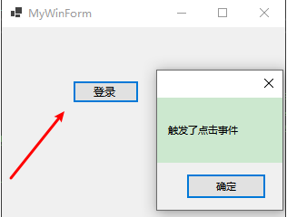

# 委托详解

## 一、委托是什么

### 1、委托是什么

​        委托和类一样是一种用户自定义类型，它存储的就是一系列具有相同签名和返回类型的方法的地址，调用委托的时候，它所包含的所有方法都会被执行。

### 2、委托声明

（1）委托可以声明在类外部，也可以在类内部

（2）跟方法有点类似，有参数，返回值，访问修饰符，比方法声明多一个关键字==delegate==

```C#
namespace MyDelegate
{
    /// <summary>
    /// 1.无参数无返回值委托
    /// </summary>
    public delegate void NoReturnNoParaOutClass();

    public class CustomDelegate
    {
        /// <summary>
        /// 2.无参数无返回值委托
        /// </summary>
        public delegate void NoReturnNoPara();
        /// <summary>
        /// 3.有参数无返回值委托
        /// </summary>
        /// <param name="x"></param>
        /// <param name="y"></param>
        public delegate void NoReturnWithPara(int x, int y);
        /// <summary>
        /// 4.无参数有返回值的委托
        /// </summary>
        /// <returns></returns>
        public delegate int WithReturnNoPara();
        /// <summary>
        /// 5.带参数带返回值的委托
        /// </summary>
        /// <param name="x"></param>
        /// <param name="y"></param>
        /// <returns></returns>
        public delegate int WithReturnWithPara(out int x, ref int y);
    }
}
```

### 3、委托的本质

反编译程序看委托NoReturnNoParaOutClass的IL代码

```C#
.class public auto ansi sealed NoReturnNoParaOutClass
    extends [System.Runtime]System.MulticastDelegate
{
    .method public hidebysig specialname rtspecialname instance void .ctor(object 'object', native int 'method') runtime managed
    {
    }

    .method public hidebysig newslot virtual instance class [System.Runtime]System.IAsyncResult BeginInvoke(class [System.Runtime]System.AsyncCallback callback, object 'object') runtime managed
    {
    }

    .method public hidebysig newslot virtual instance void EndInvoke(class [System.Runtime]System.IAsyncResult result) runtime managed
    {
    }

    .method public hidebysig newslot virtual instance void Invoke() runtime managed
    {
    }
}
```

#### （1）委托是一个类，继承自MulticastDelegate

​           MulticastDelegate这个类我们自己定义的类是无法继承的

#### （2）委托的构造函数，需要传递一个方法作为参数

#### （3）委托的内部有三个方法Invoke，BeginInvoke，EndInvoke

#### 二、委托实例化和执行

### 1、委托实例化

#### （1）通过New来实例化

#### （2）直接=一个方法，这个是编译器提供的语法糖

#### （3）直接=一个匿名委托

#### （4）直接=一个Lambda

### 2、委托执行

#### （1）Inovke执行委托

​            如果委托定义没有参数，则Inovke也没有参数；委托没有返回值，则Inovke也没有返回值

#### （2）BeginInvoke开启一个新线程执行委托

​            NetCore不支持，NetFamework支持  NetCore有更好的多线程功能来支持实现类似功能            

#### （3）EndInvoke等待BeginInvoke执行完成后再执行

```C#
using System;

namespace MyDelegate
{
    public class CustomDelegateShow
    {
        public static void Show()
        {
            //1、委托实例化
            //（1）通过New来实例化，要求传递一个和这个委托的参数和返回值完全匹配的方法
            NoReturnNoParaOutClass noReturnNoParaOutClass = new NoReturnNoParaOutClass(NoReturnNoParaMehtod);
            //（2）直接=一个方法，要求方法和这个委托的参数和返回值完全匹配，这个是编译器提供的语法糖
            NoReturnNoParaOutClass noReturnNoParaOutClass2 = NoReturnNoParaMehtod;
            //（3）直接=一个匿名委托，要求和这个委托的参数和返回值完全匹配
            NoReturnNoParaOutClass noReturnNoParaOutClass3 = delegate () { Console.WriteLine("这是一个无参数无返回值的方法。。。"); };
            //（4）直接=一个Lambda，要求和这个委托的参数和返回值完全匹配
            NoReturnNoParaOutClass noReturnNoParaOutClass4 = ()=> { Console.WriteLine("这是一个无参数无返回值的方法。。。"); };

            //无参无返回值委托实例化
            CustomDelegate.NoReturnNoPara noReturnNoPara = NoReturnNoParaMehtod;
            //带参数无返回值委托实例化
            CustomDelegate.NoReturnWithPara noReturnWithPara = NoReturnWithParaMehtod;
            //无参数带返回值委托实例化
            CustomDelegate.WithReturnNoPara withReturnNoPara = WithReturnNoParaMehtod;
            //带参数带返回值委托实例化
            CustomDelegate.WithReturnWithPara withReturnWithPara = WithReturnWithParaMehtod;

            //2、委托执行
            //（1）Inovke执行方法，如果委托定义没有参数，则Inovke也没有参数；委托没有返回值，则Inovke也没有返回值
            noReturnNoParaOutClass.Invoke();
            //（2）BeginInvoke开启一个新的线程去执行委托
            //NetCore不支持，NetFamework支持  NetCore有更好的多线程功能来支持实现类似功能
            //noReturnNoParaOutClass.BeginInvoke((a) => Console.WriteLine("方法调用结束。。。"), null);
            //（3）EndInvoke等待BeginInvoke方法执行完成后再执行EndInvoke后面的代码
            //NetCore不支持，NetFamework支持  NetCore有更好的多线程功能来支持实现类似功能
            //noReturnNoParaOutClass.EndInvoke(null);

            //无参无返回值委托执行
            noReturnNoPara.Invoke();
            //带参数无返回值委托执行
            noReturnWithPara.Invoke(1,2);
            //无参数带返回值委托执行
            int result=withReturnNoPara.Invoke();
            //带参数带返回值委托执行
            int x = 1;
            int y = 1;
            int result2 = withReturnWithPara.Invoke(out x, ref y);
        }

        private static void NoReturnNoParaMehtod()
        {
            Console.WriteLine("这是一个无参数无返回值的方法。。。");
        }

        private static void NoReturnWithParaMehtod(int x, int y)
        {
            Console.WriteLine($"这是一个带参数无返回值的方法。。。");
        }

        private static int WithReturnNoParaMehtod()
        {
            Console.WriteLine($"这是一个无参数带返回值的方法。。。");
            return default(int);
        }

        private static int WithReturnWithParaMehtod(out int x, ref int y)
        {
            Console.WriteLine($"这是一个带参数带返回值的方法。。。");
            x = 1;
            return default(int);
        }
    }
}
```

## 三、委托作用和意义

###  1、需求：不同的学生实现不同打招呼方式

> 定义一个类

```C#
using System;

namespace MyDelegate
{
    /// <summary>
    /// 学生类
    /// </summary>
    public class Student
    {
        public int Id { get; set; }
        public string Name { get; set; }
        public UserType ClassId { get; set; }
        public int Age { get; set; }

        /// <summary>
        /// 问好
        /// </summary>
        public void SayHi()
        {
            Console.WriteLine("招手。。。");
            switch (ClassId)
            {
                case UserType.Wuhan:
                    Console.WriteLine("吃了么？过早了吗？");
                    break;
                case UserType.Shanghai:
                    Console.WriteLine("侬好!");
                    break;
                case UserType.GuangDong:
                    Console.WriteLine("雷猴！");
                    break;
                default:
                    throw new Exception("NO UserType"); 
            }
        }

        public void SayHiWuhHan()
        { 
            Console.WriteLine("吃了么？过早了吗？");
        }

        public void SayHiShangHai()
        { 
            Console.WriteLine("侬好!");
        }

        public void SayHiGuangDong()
        { 
            Console.WriteLine("雷猴！");
        }

        public void SayHiBeijing()
        { 
            Console.WriteLine("早上好！");
        }

        /// <summary>
        /// 既没有重复代码
        /// 也相对稳定
        /// </summary>
        public void SayHiPerfect(SayHiDalegate sayHiDalegate)
        {
            Console.WriteLine("招手。。。");
            sayHiDalegate.Invoke();
        }
    }
}
```

> 定义一个枚举

```C#
public enum UserType
{
    Wuhan = 1,
    Shanghai = 2,
    GuangDong = 3,
    BeiJing = 4
}
```

>  定义一个委托

```C#
public delegate void SayHiDalegate();
```

>  方案1：定义枚举，不同枚举值调用不同代码

```C#
Student student = new Student()
{
    Id = 1234,
    Name = "张三",
    Age = 25,
    ClassId = UserType.Shanghai
};
student.SayHi();
```

> 方案2：根据不同的类型的人，调用不同方法

```C#
student.SayHiWuhHan();
student.SayHiShangHai();
student.SayHiGuangDong();
```

> 方案3：使用委托将方法传递进去执行

```C#
student.SayHiPerfect(student.SayHiWuhHan);
student.SayHiPerfect(student.SayHiShangHai);
student.SayHiPerfect(student.SayHiGuangDong);
```

### 2、需求变更：如果增加一个类型的人

- 方案1：SayHi里面增加一个分支，SayHi不稳定。
- 方案2：每个方法都式独立的，只需要增加一个方法。
- 方案3：也只需要增加一个方法，然后传进去执行。

### 3、需求再变更：每个人打招呼之前先招手

- 方案1：SayHi在所有逻辑之前加招手逻辑。
- 方案2：每个方法都式独立的，每个方法都需要增加招手逻辑，要修改所有方法。
- 方案3：SayHiPerfect里面委托执行前加招手逻辑。

### 4、方案比较下来，方案3既没有重复代码，也相对稳定

​       委托既然是一个类型，可以赋值和执行，使得委托可以将方法当作另一个方法的参数来进行传递，这种将方法动态地赋给参数的做法，使得程序具有更好的可扩展性。

### 5、什么情况下，可以考虑使用委托？

- 方法内部业务逻辑耦合严重
- 如果多个方法，有很多重复代码，逻辑重用

## 四、委托实现嵌套中间件

### 1、委托朴素嵌套实现

#### （1）声明一个委托

```C#
public delegate void ShowDelegate();
```

#### （2）定义一个普通类

```C#
/// <summary>
/// 普通类
/// </summary>
public class CustomClass
{
    public void Method()
    {
        Console.WriteLine("朴素嵌套业务核心");
    }
}
```

#### （3）委托嵌套实现

```C#
ShowDelegate showMthod1 = new ShowDelegate(() =>
{
    Console.WriteLine("showMthod1执行前");
    new CustomClass().Method();
    Console.WriteLine("showMthod1执行后");
});

ShowDelegate showMthod2 = new ShowDelegate(() =>
{
    Console.WriteLine("showMthod2执行前");
    showMthod1.Invoke();
    Console.WriteLine("showMthod2执行后");
});

ShowDelegate showMthod3 = new ShowDelegate(() =>
{
    Console.WriteLine("showMthod3执行前");
    showMthod2.Invoke();
    Console.WriteLine("showMthod3执行后");
});

showMthod3.Invoke();
```

#### （4）运行结果

```bash
showMthod3执行前
showMthod2执行前
showMthod1执行前
朴素嵌套业务核心
showMthod1执行后
showMthod2执行后
showMthod3执行后
```

### 2、委托花式嵌套实现

#### （1）定义一个委托

```C#
public delegate void ShowDelegate();
```

#### （2）定义几个特性

```C#
using System;

namespace MyDelegate
{
    /// <summary>
    /// 定义一个抽象特性
    /// </summary>
    public abstract class AbstractMethodAttribute : Attribute
    {
        /// <summary>
        /// 在xxx 执行之前执行的点业务落
        /// </summary>
        public abstract ShowDelegate Do(ShowDelegate action);
    }

    /// <summary>
    /// Log
    /// </summary>
    public class DelegateLogAttribute : AbstractMethodAttribute
    {
        /// <summary>
        /// 前后业务
        /// </summary>
        public override ShowDelegate Do(ShowDelegate action)
        {
            ShowDelegate actionResult = new ShowDelegate(() =>
            {
                Console.WriteLine("在执行之前LOG");
                action.Invoke();
                Console.WriteLine("在执行之后LOG");
            });
            return actionResult;
        }
    }

    /// <summary>
    /// Error
    /// </summary>
    public class DelegateErrorAttribute : AbstractMethodAttribute
    {
        /// <summary>
        /// 前后业务
        /// </summary>
        public override ShowDelegate Do(ShowDelegate action)
        {
            ShowDelegate actionResult = new ShowDelegate(() =>
            {
                Console.WriteLine("在执行之前ERROR");
                action.Invoke();
                Console.WriteLine("在执行之后ERROR");
            });
            return actionResult;
        }
    }

    /// <summary>
    /// Auth
    /// </summary>
    public class DelegateAuthAttribute : AbstractMethodAttribute
    {
        /// <summary>
        /// 前后业务
        /// </summary>
        public override ShowDelegate Do(ShowDelegate action)
        {
            ShowDelegate actionResult = new ShowDelegate(() =>
            {
                Console.WriteLine("在执行之前AUTH");
                action.Invoke();
                Console.WriteLine("在执行之后AUTH");
            });
            return actionResult;
        }
    }
}
```

#### （3）定义一个类，方法标记特性

```C#
/// <summary>
/// 普通类  方法标记特性
/// </summary>
public class CustomClass2
{
    [DelegateLog]
    [DelegateError]
    [DelegateAuth]
    public void Method()
    {
        Console.WriteLine("花式嵌套业务核心");
    }
}
```

#### （4）委托嵌套实现

```C#
//反射获取类的方法信息
CustomClass2 invokerAction = new CustomClass2();
Type type = invokerAction.GetType();
MethodInfo methodInfo = type.GetMethod("Method");

//给委托赋值，初始委托方法
ShowDelegate showMethod = new ShowDelegate(() =>
{
    invokerAction.Method();
});

//判断是否定义特性对每个特性进行执行
//继承自父类的特性都算
if (methodInfo.IsDefined(typeof(AbstractMethodAttribute), true))
{
    //Reverse越靠近方法越先执行
    foreach (AbstractMethodAttribute attribute in methodInfo.GetCustomAttributes().Reverse())
    {
        //把初始方法传入，返回封装好的委托再作为下一个参数传入
        showMethod = attribute.Do(showMethod);
    }
}

//执行委托
showMethod.Invoke();
```

#### （5）运行结果

```bash
在执行之前LOG
在执行之前ERROR
在执行之前AUTH
花式嵌套业务核心
在执行之后AUTH
在执行之后ERROR
在执行之后LOG
```

## 五、框架内置委托

Action/Func是.NET Framework3.0时代的产物

### 1、Action

（1）Action是来自于System.RunTime的一个声明好的可以带有一个或者多个参数无返回值的委托 
（2）最多支持16个入参，正常使用足够

```C#
Action action = new Action(NoreturnNopara);
Action<int> action1 = new Action<int>(DoNothingInt);
```

（3）想要支持更多的参数呢，可以自己定义

```C#
//参数不够自己定义
public delegate void Action<in T1, in T2, in T3, in T4, in T5, in T6, in T7, in T8, in T9, in T10, in T11, in T12, in T13, in T14, in T15, in T16, in T17>(T1 arg1, T2 arg2, T3 arg3, T4 arg4, T5 arg5, T6 arg6, T7 arg7, T8 arg8, T9 arg9, T10 arg10, T11 arg11, T12 arg12, T13 arg13, T14 arg14, T15 arg15, T16 arg16, T17 arg17);
```

### 2、Func

（1）Func是来自于System.RunTime的一个声明好有返回值的委托，也可以有参数 
（2）如果既然有参数也有返回值，前面是输入参数类型，最后面的作为返回值类型
（3）最多支持16个入参，正常足够使用

```C#
Func<int> func = new Func<int>(ReturnNopara);
Func<int, int> func1 = new Func<int, int>(ToInt);
Func<int, string, int> func2 = new Func<int, string, int>(DoNothingIntAndStringNew);
```

（4）想要支持更多的参数呢，可以自己定义

```C#
//参数不够自己定义
public delegate TResult Func<in T1, in T2, in T3, in T4, in T5, in T6, in T7, in T8, in T9, in T10, in T11, in T12, in T13, in T14, in T15, in T16, in T17, out TResult>(T1 arg1, T2 arg2, T3 arg3, T4 arg4, T5 arg5, T6 arg6, T7 arg7, T8 arg8, T9 arg9, T10 arg10, T11 arg11, T12 arg12, T13 arg13, T14 arg14, T15 arg15, T16 arg16, T17 arg17);
```

### 3、为什么要用框架内置委托

（1）委托的本质是类，定义多个委托，其实就是新增了多个类，定义好的两个委托参数和返回值都是一致的，但是因为是不同的类，没有继承不能通用
（2）既然是系统框架给我们定义好了这两个委托，自然是希望我们在以后的开发中，都去使用这两个委托，这样就可以把委托类型做到统一
（3）那之前定义好的委托是去不掉的，这被称之为历史包袱

## 六、多播委托

### 1、多播委托

（1）委托都是继承自MulticastDelegate(多播委托)，定义的所有的委托都是多播委托
（2）可以通过+=把多个方法添加到这个委托中，形成一个方法的执行链，执行委托的时候，按照添加方法的顺序，依次去执行方法
（3）action.BeginInvoke();会开启一个新的线程 去执行委托，注册有多个方法的委托，不能使用BeginInvoke
（4）注册有多个方法的委托想要开启新线程去执行委托，可以通过action.GetInvocationList()获取到所有的委托，然后循环，每个方法执行的时候可以BeginInvoke

> 定义一个测试类

```C#
using System;

namespace MyDelegate
{
    /// <summary>
    /// 多播委托
    /// </summary>
    public class CustomMulticastDelegation
    {
        private void DoNothing()
        {
            Console.WriteLine("This is DoNothing");
        }

        private void DoNothing2()
        {
            Console.WriteLine("This is DoNothing2");
        }

        private static void DoNothingStatic()
        {
            Console.WriteLine("This is DoNothingStatic");
        }

        private static void DoNothingStatic2()
        {
            Console.WriteLine("This is DoNothingStatic2");
        }
    }
}
```

> 多播委托注册执行

```C#
//注册方法链
Action action = new Action(DoNothing);
action += DoNothingStatic;
action += DoNothing;//同一个方法注册两次会执行两次
action += () =>
{
    Console.WriteLine("this is Lambda。。。");
};
//action.BeginInvoke();//开启一个新的线程去执行委托，如果注册有多个方法的委托，不能使用BeginInvoke
action.Invoke();
//注册有多个方法的委托想要开启新线程去执行委托，可以通过action.GetInvocationList()获取到所有的委托，然后循环，每个方法执行的时候可以BeginInvoke
//foreach (Action action1 in action.GetInvocationList())
//{
//    action1.Invoke();
//    //action1.BeginInvoke(null,null);
//}
```

> 运行结果

```bash
This is DoNothing
This is DoNothingStatic
This is DoNothing
this is Lambda。。。
```

（5）可以通过-=移除方法，是从后往前，逐个匹配，如果匹配不到，就不做任何操作，如果匹配到，就把当前这个移除，且停止去继续往后匹配
（6）在移除的方法的时候，必须是同一个实例的同一个方法才能移除，每个lambda表达式在底层会生成不同的方法名的，看起来一样实际不同

> 多播委托注册移除执行

```C#
//注册方法链
Action action = new Action(DoNothing);
action += DoNothingStatic;
action += new CustomMulticastDelegation().DoNothing2;
action += CustomMulticastDelegation.DoNothingStatic2;
action += DoNothing;
action += () =>
{
    Console.WriteLine("this is Lambda。。。");
};
//移除方法链方法
action -= DoNothing;//是从后往前，逐个匹配，如果匹配不到，就不做任何操作，如果匹配到，就把当前这个移除，且停止去继续往后匹配
action -= new CustomMulticastDelegation().DoNothing2; //没有移除掉，因为不是同一个实例的方法，引用的地址是不同的
action -= CustomMulticastDelegation.DoNothingStatic2;//静态方法是同一个方法，可以移除掉
action -= () => //没有移除，因为不同同一个方法，每个lambda表达式在底层会生成不同的方法名的，看起来一样实际不同
{
    Console.WriteLine("this is Lambda。。。");
};
action.Invoke();
```

> 运行结果

```bash
This is DoNothing
This is DoNothingStatic
This is DoNothing2
this is Lambda。。。
```

### 2、观察者模式

#### （1）需求：猫叫之后引发一系列的动作

> 方案1：封装一个方法，调用一系列动作

- 职责不单一，依赖于其他的类太多，代码不稳定，任何一个类的修改，都有可能会影响到这只猫

```C#
public void Miao()
{
    Console.WriteLine("{0} Miao", this.GetType().Name);
    new Dog().Wang(); //狗叫了
    new Mouse().Run();//老鼠跑了
    new Baby().Cry(); // 小孩哭了
}
```

程序调用

```C#
Cat cat = new Cat();
cat.Miao();
```

> 方案2：引发的动作注册到多播委托中去

- 职责单一，猫只是执行委托的方法链，方法链注册交个第三方，不在猫内部
- 使用委托的方式来实现==观察者模式==

```C#
public Action MiaoDelegateHandler = null;

public void MiaoDelegate()
{
    Console.WriteLine("{0} MiaoDelegate", this.GetType().Name);
    MiaoDelegateHandler?.Invoke();//?. 如果不为null ，就执行后面的动作 
}
```

程序调用

```C#
cat.MiaoDelegateHandler += new Dog().Wang; //狗叫了
cat.MiaoDelegateHandler += new Mouse().Run;//老鼠跑了
cat.MiaoDelegateHandler += new Baby().Cry; // 小孩哭了
cat.MiaoDelegate();//执行
```

> 方案3：引发的动作注册到方法列表中去

- 职责单一，猫只是执行方法列表，方法列表的注册交给第三方，不在猫的内部
- 完全使用面向对象的方式来实现观察者模式

```C#
public List<IObject> observerlist = new List<IObject>();

public void MiaoObsever()
{
    Console.WriteLine("{0} MiaoObsever", this.GetType().Name);
    if (observerlist.Count>0)
    {
        foreach (var item in observerlist)
        {
            item.Invoke();
        }
    }
}
```

定义一个基类，其他类都实现基类

```C#
namespace MyDelegate.Event
{
    public interface IObject
    {
        void Invoke();
    }
}
```

```C#
using System;

namespace MyDelegate.Event
{    
    public class Baby : IObject
    {
        public void Invoke()
        {
            this.Cry();
        }

        public void Cry()
        {
            Console.WriteLine("{0} Cry", this.GetType().Name);
        }
    }
}
```

```C#
using System;

namespace MyDelegate.Event
{
    public class Dog : IObject
    {
        public void Invoke()
        {
            this.Wang();
        }
        public void Wang()
        {
            Console.WriteLine("{0} Wang", this.GetType().Name);
        }
    }
}
```

```C#
using System;

namespace MyDelegate.Event
{
    public class Mouse : IObject
    {
        public void Invoke()
        {
            this.Run();
        }
        public void Run()
        {
            Console.WriteLine("{0} Run", this.GetType().Name);
        }
    }
}
```

程序调用

```C#
cat.observerlist.Add(new Dog()); //狗叫了
cat.observerlist.Add(new Mouse());//老鼠跑了
cat.observerlist.Add(new Baby()); // 小孩哭了
cat.MiaoObsever();//执行
```

> 方案4：引发的动作注册到事件中去

复制方案2，加上关键字event

```C#
public event Action MiaoEventHandler = null;

public void MiaoEnvent()
{            
    Console.WriteLine("{0} MiaoEnvent", this.GetType().Name);
    MiaoEventHandler?.Invoke();//?. 如果不为null ，就执行后面的动作 
}
```

程序调用

```C#
cat.MiaoEventHandler += new Mouse().Run;//老鼠跑了
cat.MiaoEventHandler += new Dog().Wang; //狗叫了
cat.MiaoEventHandler += new Baby().Cry; // 小孩哭了
cat.MiaoEnvent();
//cat.MiaoEventHanlder.Invoke();//类外部无法执行到类中的事件方法
```

子类调用

```C#
namespace MyDelegate.Event
{
    public class CatChild:Cat
    {
        public void Show()
        {
            base.MiaoDelegateHandler.Invoke(); //子类中执行父类中多播委托
            //base.MiaoEventHanlder.Invoke();//子类中无法访问到父类中的事件
        }
    }
}
```

#### （2）观察者模式几个要素

- 发布者
- 订阅者
- 订阅
- 触发事件

## 七、事件是什么

### 1、事件是什么

（1）事件是委托实例，增加一个关键字==Event==，是特殊的委托

（2）事件只能在当前类被访问，子类和类外部均不能执行类中的事件方法（==安全==）

（3）委托和事件从本质上来说没啥区别

### 2、WinForm中按钮点击事件解析

页面上添加登录按钮双击生成了一个方法，运行起来，点击按钮，触发这个方法，这个过程是怎么完成的？
（1）按钮其实是一个Button类，继承Control类，Control有一个Click事件，( EventHandler(object? sender, EventArgs e)) 
（2）MyWinForm构造函数函数中有一个InitializeComponent方法，在InitializeComponent方法中初始化Button按钮实例，Button的实例中的Click事件+=一个动作btnLogin_Click方法
（3）点击按钮，触发事件，执行注册事件的方法，也就是btnLogin_Click方法
（4）更具体一些：程序运行，句柄被监听，监听鼠标的点击的动作，触发操作系统去找这个句柄是在哪个应用程序中，找到控件，执行这个控件中的事件，触发了方法
（5）在按钮点击触发方法的设计中，有很多相同的逻辑，就把不变的业务逻辑封装代码重用，可变的业务逻辑对外发布一个事件，由外部给事件注册动作；框架设计的时候，是非常需要这种设计的，ASP.NET MVC5管道处理模型就是通过19大事件来完成的；

> Winform添加按钮，注册事件

```C#
namespace MyWinform
{
    partial class MyWinForm
    {
        /// <summary>
        ///  Required designer variable.
        /// </summary>
        private System.ComponentModel.IContainer components = null;

        /// <summary>
        ///  Clean up any resources being used.
        /// </summary>
        /// <param name="disposing">true if managed resources should be disposed; otherwise, false.</param>
        protected override void Dispose(bool disposing)
        {
            if (disposing && (components != null))
            {
                components.Dispose();
            }
            base.Dispose(disposing);
        }

        #region Windows Form Designer generated code

        /// <summary>
        ///  Required method for Designer support - do not modify
        ///  the contents of this method with the code editor.
        /// </summary>
        private void InitializeComponent()
        {
            this.btnLogin = new System.Windows.Forms.Button();
            this.SuspendLayout();
            // 
            // btnLogin
            // 
            this.btnLogin.Location = new System.Drawing.Point(78, 59);
            this.btnLogin.Margin = new System.Windows.Forms.Padding(2, 3, 2, 3);
            this.btnLogin.Name = "btnLogin";
            this.btnLogin.Size = new System.Drawing.Size(73, 25);
            this.btnLogin.TabIndex = 0;
            this.btnLogin.Text = "登录";
            this.btnLogin.UseVisualStyleBackColor = true;
            this.btnLogin.Click += new System.EventHandler(this.btnLogin_Click);
            // 
            // MyWinForm
            // 
            this.AutoScaleDimensions = new System.Drawing.SizeF(7F, 17F);
            this.AutoScaleMode = System.Windows.Forms.AutoScaleMode.Font;
            this.ClientSize = new System.Drawing.Size(312, 213);
            this.Controls.Add(this.btnLogin);
            this.Margin = new System.Windows.Forms.Padding(2, 3, 2, 3);
            this.Name = "MyWinForm";
            this.Text = "MyWinForm";
            this.ResumeLayout(false);

        }

        #endregion

        private System.Windows.Forms.Button btnLogin;
    }
}
```

> 添加执行逻辑

```C#
using System;
using System.Windows.Forms;

namespace MyWinform
{
    public partial class MyWinForm : Form
    {
        public MyWinForm()
        {
            InitializeComponent();
        }

        private void btnLogin_Click(object sender, EventArgs e)
        {
            MessageBox.Show("触发了点击事件");
        }
    }
}
```

> 运行效果



### 3、标准事件的定义

#### （1）发布者发布事件

#### （2）订阅者订阅事件

#### （3）触发事件

> 定义发布者

```c#
/// <summary>
/// 发布者：对外发布事件；触发事件；
/// </summary>
public class Publisher
{
    //发布事件
    public event EventHandler Publish;

    //发布者触发事件
    public void EventAction()
    {
        Console.WriteLine("触发事件");
        Publish?.Invoke(null,null);
    }
}
```

> 定义订阅者

```C#
/// <summary>
/// 订阅者：对发布者发布的事情关注
/// </summary>
public class Observer1
{
    /// <summary>
    /// 订阅者1的行为
    /// </summary>
    /// <param name="sender"></param>
    /// <param name="e"></param>
    public void Action1(object sender, EventArgs e)
    {            
        Console.WriteLine("订阅者1的行为");
    }
}

/// <summary>
/// 订阅者：对发布者发布的事情关注
/// </summary>
public class Observer2
{
    /// <summary>
    /// 订阅者2的行为
    /// </summary>
    /// <param name="sender"></param>
    /// <param name="e"></param>
    public void Action2(object sender, EventArgs e)
    {
        Console.WriteLine("订阅者2的行为");
    }
}
```

> 发布订阅触发事件

```C#
//初始化发布者
Publisher publisher = new Publisher();
//初始化订阅者1
Observer1 observer1 = new Observer1();
//初始化订阅者2
Observer2 observer2 = new Observer2();
//订阅者订阅事件
publisher.Publish += observer1.Action1;
publisher.Publish += observer2.Action2;
//触发事件
publisher.EventAction();
```

> 运行结果

```C#
触发事件
订阅者1的行为
订阅者2的行为
```

