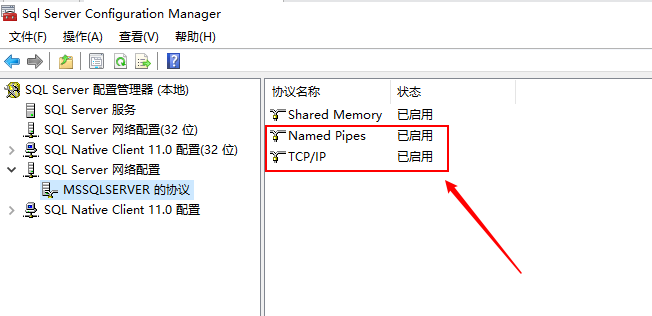
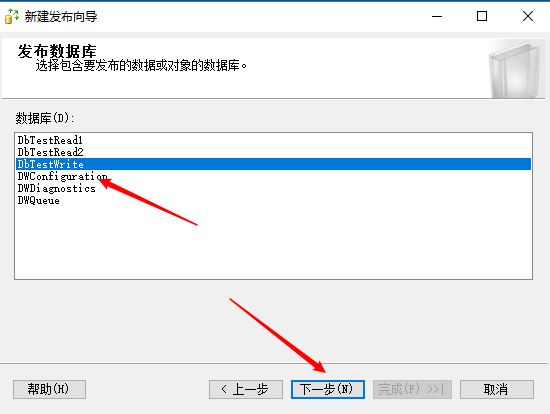
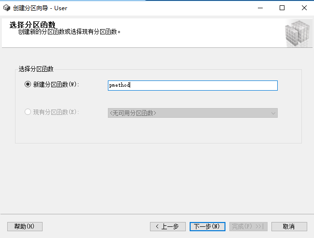
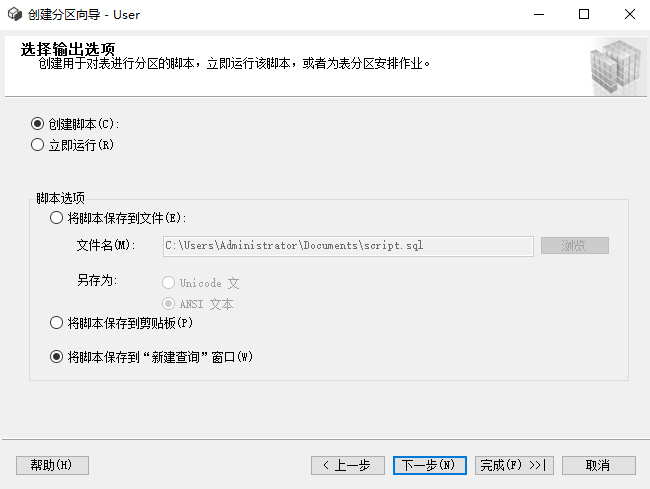

# SQLServer详解

## 一、数据库概念

### 1、数据库基本概念

#### （1）数据库(DataBase:DB)

数据库是是按照数据结构来组织、存储和管理数据的仓库。---->存储和管理数据的仓库

#### （2）数据库管理系统（Database Management System:DBMS）

是专门用于管理数据库的计算机系统软件。数据库管理系统能够为数据库提供数据的定义、建立、维护、查询和统计等操作功能，并完成对数据完整性、安全性进行控制的功能。

==注意：我们一般说的数据库，就是指的DBMS==

### 2、数据库技术发展历程

#### （1）层次数据库和网状数据库技术阶段

使用指针来表示数据之间的联系。

#### （2）关系型数据库技术阶段

经典的里程碑阶段，代表的DBMS有：Oracle、DB2、MySQL、SQL Server、SyBase等。

#### （3）后关系型数据库技术阶段

由于关系型数据库中存在数据模型、性能、拓展伸缩性差的缺点，所以出现了ORDBMS（面向对象数据库技术），NoSQL（结构化数据库技术）。

### 3、常见关系型数据库

- Oracle：运行稳定，可移植性高，功能齐全，性能超群。适用于**大型**企业领域。
- DB2：速度快、可靠性好，适于海量数据，恢复性极强。适用于**大中型**企业领域。
- SQL Server：全面，效率高，界面友好，操作容易，但是不跨平台。适用于**中小型**企业领域。
- MySQL：开源，体积小，速度快。适用于**中小**型企业领域。

### 4、常见NoSQL数据库

- 键值存储数据库：Oracle BDB、Redis、BeansDB
- 列式储数数据库：HBase、Cassandra、Riak
- 文档型数据库：MongoDB、CouchDB
- 图形数据库：Neo4J、InfoGrid、Infinite Graph

### 5、结构化查询语言(SQL)

Structured Query Language，即SQL，SQL是关系型数据库标准语言，其特点：简单，灵活，功能强大。SQL包含6个部分：

#### （1）数据查询语言（DQL）

其语句，也称为“数据检索语句”，用以从表中获得数据，确定数据怎样在应用程序给出。保留字SELECT是DQL（也是所有SQL）用得最多的动词，其他DQL常用的保留字有WHERE，ORDER BY，GROUP BY和HAVING。这些DQL保留字常与其他类型的SQL语句一起使用。

#### （2）数据操作语言（DML）

其语句包括动词INSERT，UPDATE和DELETE。它们分别用于添加，修改和删除表中的行。也称为动作查询语言。

#### （3）事务处理语言（TPL）

它的语句能确保被DML语句影响的表的所有行及时得以更新。TPL语句包括BEGIN TRANSACTION，COMMIT和ROLLBACK。

#### （4）数据控制语言（DCL）

它的语句通过GRANT或REVOKE获得许可，确定单个用户和用户组对数据库对象的访问。某些RDBMS可用GRANT或REVOKE控制对表单个列的访问。

#### （5）数据定义语言（DDL）

其语句包括动词CREATE和DROP。在数据库中创建新表或删除表（CREAT TABLE 或 DROP TABLE）；为表加入索引等。DDL包括许多与人数据库目录中获得数据有关的保留字。它也是动作查询的一部分。

#### （6）指针控制语言（CCL）

它的语句，像DECLARE CURSOR，FETCH INTO和UPDATE WHERE CURRENT用于对一个或多个表单独行的操作。

## 二、数据库安装

### 1、SqlServer2019

下载路径：[https://www.microsoft.com/zh-cn/sql-server/sql-server-downloads](https://www.microsoft.com/zh-cn/sql-server/sql-server-downloads)

直接下载Developer版本，下载后：是一个镜像文件---直接解压，就可以去执行Exe文件安装了

### 2、SQL Server Management Studio

下载路径：[https://docs.microsoft.com/zh-cn/sql/ssms/download-sql-server-management-studio-ssms?view=sql-server-ver15](https://docs.microsoft.com/zh-cn/sql/ssms/download-sql-server-management-studio-ssms?view=sql-server-ver15)

### 3、docker安装SqlServer2019

> 拉取镜像

```bash
docker pull mcr.microsoft.com/mssql/server:2019-latest
```

> 查看镜像

```bash
docker images
```

> 启动容器

```bash
docker run -e "ACCEPT_EULA=Y" -e "SA_PASSWORD=密码" -u 0:0 -p 1433:1433 --name mssql -v /data/mssql:/var/opt/mssql -d mcr.microsoft.com/mssql/server:2019-latest
```

| 参数                          | 说明                                                         |
| ----------------------------- | ------------------------------------------------------------ |
| -e 'ACCEPT_EULA=Y'            | 设置此参数说明同意 SQL SERVER 使用条款 , 否则无法使用        |
| -e 'SA_PASSWORD=密码'         | 此处设置 SQL SERVER 数据库 SA 账号的密码                     |
| -p 1433:1433                  | 将宿主机 1433 端口映射到容器的 1433 端口                     |
| --name mssql                  | 设置容器名为 mssql                                           |
| -v /data/mssql:/var/opt/mssql | 将宿主机 /data/mssql 映射到容器 /var/opt/mssql , 方便备份数据 |

>检查容器是否启动

```bash
docker ps -a
```

检查STATUS 是不是 Up 状态，如果是 Exited 状态的话，可以尝试使用 **docker logs mssql** 查看日志,日志内会提供相对应的代码，以及解决链接。

> 服务器本地连接测试

```bash
 docker exec -it mssql /bin/bash
```

不报错就是连接成功

> SSMS连接测试


## 三、数据库设计

### 1、设计的重要性

#### （1）提高开发效率

#### （2）节省空间，硬件资源

#### （3）直接关乎到数据库的性能

### 2、设计的流程

#### （1）确定需求

#### （2）创建E-R图，可视化数据展示

#### （3）数据库字段的设计

### 3、PowerDesigner实操

#### （1）PowerDesigner16.5下载安装

链接：[https://pan.baidu.com/s/1y65sOlVhMyDRrTXxFbq1yg](https://pan.baidu.com/s/1y65sOlVhMyDRrTXxFbq1yg) 
提取码：1234

#### （2）PD生成SQL脚本

建议先画E-R图，再生成数据库

> 创建项目，填写项目名称，选择保存目录


> 创建模型文件


> 创建表，添加字段


可以显示字段说明


> 生成物理数据模型


> 生成SQL脚本


#### （3）PD从数据库生成模型

> 创建模型，选择数据库类型


> 配置数据库连接导出模型


#### （4）PD数据类型说明

| Standard data type | DBMS-specific physical data type | Content                                       | Length |
| :----------------- | :------------------------------- | :-------------------------------------------- | :----- |
| Integer            | int / INTEGER                    | 32-bit integer                                | —      |
| Short Integer      | smallint / SMALLINT              | 16-bit integer                                | —      |
| Long Integer       | int / INTEGER                    | 32-bit integer                                | —      |
| Byte               | tinyint / SMALLINT               | 256 values                                    | —      |
| Number             | numeric / NUMBER                 | Numbers with a fixed decimal point            | Fixed  |
| Decimal            | decimal / NUMBER                 | Numbers with a fixed decimal point            | Fixed  |
| Float              | float / FLOAT                    | 32-bit floating point numbers                 | Fixed  |
| Short Float        | real / FLOAT                     | Less than 32-bit point decimal number         | —      |
| Long Float         | double precision / BINARY DOUBLE | 64-bit floating point numbers                 | —      |
| Money              | money / NUMBER                   | Numbers with a fixed decimal point            | Fixed  |
| Serial             | numeric / NUMBER                 | Automatically incremented numbers             | Fixed  |
| Boolean            | bit / SMALLINT                   | Two opposing values (true/false; yes/no; 1/0) | —      |

| Standard data type  | DBMS-specific physical data type | Content                     | Length  |
| :------------------ | :------------------------------- | :-------------------------- | :------ |
| Characters          | char / CHAR                      | Character strings           | Fixed   |
| Variable Characters | varchar / VARCHAR2               | Character strings           | Maximum |
| Long Characters     | varchar / CLOB                   | Character strings           | Maximum |
| Long Var Characters | text / CLOB                      | Character strings           | Maximum |
| Text                | text / CLOB                      | Character strings           | Maximum |
| Multibyte           | nchar / NCHAR                    | Multibyte character strings | Fixed   |
| Variable Multibyte  | nvarchar / NVARCHAR2             | Multibyte character strings | Maximum |

| Standard data type | DBMS-specific physical data type | Content                  | Length |
| :----------------- | :------------------------------- | :----------------------- | :----- |
| Date               | date / DATE                      | Day, month, year         | —      |
| Time               | time / DATE                      | Hour, minute, and second | —      |
| Date & Time        | datetime / DATE                  | Date and time            | —      |
| Timestamp          | timestamp / TIMESTAMP            | System date and time     | —      |

| Standard data type | DBMS-specific physical data type | Content                                                     | Length  |
| :----------------- | :------------------------------- | :---------------------------------------------------------- | :------ |
| Binary             | binary / RAW                     | Binary strings                                              | Maximum |
| Long Binary        | image / BLOB                     | Binary strings                                              | Maximum |
| Bitmap             | image / BLOB                     | Images in bitmap format (BMP)                               | Maximum |
| Image              | image / BLOB                     | Images                                                      | Maximum |
| OLE                | image / BLOB                     | OLE links                                                   | Maximum |
| Other              | —                                | User-defined data type                                      | —       |
| Undefined          | undefined                        | Undefined. Replaced by the default data type at generation. | —       |

### 4、三大范式

数据库的设计范式是数据库设计所需要满足的规范，满足这些规范的数据库是简洁的、结构明晰的。

#### （1）第一范式（1NF）列不可再分

- 每一列属性都是不可再分的属性值，确保每一列的原子性
- 两列的属性相近或相似或一样，尽量合并属性一样的列，确保不产生冗余数据

#### （2）第二范式（2NF）属性完全依赖于主键

- 第二范式（2NF）是在第一范式（1NF）的基础上建立起来的，即满足第二范式（2NF）必须先满足第一范式（1NF）。
- 第二范式（2NF）要求数据库表中的每个实例或行必须可以被惟一地区分。为实现区分通常需要为表加上一个列，以存储各个实例的惟一标识。这个惟一属性列被称为主键。

#### （3）第三范式（3NF）属性不依赖于其它非主属性    属性直接依赖于主键

- 数据不能存在传递关系，即每个属性都跟主键有直接关系而不是间接关系。
- 比如Student表（学号，姓名，年龄，性别，所在院校，院校地址，院校电话）应该拆解成两张表（学号，姓名，年龄，性别，所在院校）+（所在院校，院校地址，院校电话）

#### （4）平衡范式与冗余

- 冗余是以存储换取性能，范式是以性能换取存储。
- 模型设计时，这两方面的具体的权衡，首先要以企业提供的计算能力和存储资源为基础。其次，建模也是以任务驱动的，因此冗余和范式的权衡需要符合任务要求。

### 5、表和表关系

#### （1）一对一

- 单个表存储
- 两个表存储：两个表之间，数据记录是一对一的关系，通过同一个主键来约束

#### （2）一对多

- 单个表存储
- 两个表存储：（推荐）主表的一条记录对应从表中的多条记录，通过主外键关系来关联存储

#### （3）多对多

- 单个表存储
- 两个表存储
- 三个表存储：（推荐）两个数据主要保存数据，关系表保存关系数据

### 6、设计习惯

以公司为单位，定制的一些内部的规范，统一的习惯对这个团队来说，会有促进作用

#### （1）命名规范

- 驼峰命名法:  指当变量名和方法名称是由二个或二个以上单词连结在一起，首个单词首字母小写，其他单词首字母大写，而构成的唯一识别字时，用以增加变量和函式的可读性。
- 帕斯卡命名法：指当变量名和方法名称是由二个或二个以上单词连结在一起，每个单词首字母大写。而构成的唯一识别字时，用以增加变量和函式的可读性。
- 坚决抵制中文，提倡使用英文单词，建议不要用汉语拼音 ，坚决抵制使用拼音首字母，建议不要太长，意思明确

#### （2）常用公共字段

- ID：表的物理ID
- CreateBy：行记录创建人
- CreateTime：行记录创建时间
- UpdateBy：行记录更新人
- UpdateTime：行记录更新时间
- UserIP：操作人IP
- TS：时间戳，版本号，乐观锁更新用
- ISDEL：假删除标识

## 四、数据库数据类型

### 1、整数类型

#### （1）int

存储在4个字节中，其中1个二进制位表示符号位，其它31个二进制位表示长度和大小，可以表示-2^31~2^31-1范围内的所有整数。 

#### （2）bigint

存储在8个字节中，其中1个二进制位表示符号位，其它63个二进制位表示长度和大小，可以表示-2^63~2^63-1范围内的所有整数。

#### （3）smallint

存储在2个字节中，其中1个二进制位表示符号位，其它15个二进制位表示长度和大小，可以表示-2^15~2^15-1范围内的所有整数。 

#### （4）tinyint

存储在1个字节中，可以表示0~255范围内的所有整数。 

### 2、 浮点类型

浮点数据类型存储十进制小数，浮点数据为近似值，Sql Server中采用了只入不舍的方式进行存储，即当要舍入的数是一个非零数时，就进1。 

#### （1）real

存储在4个字节中，可以存储正的或者负的十进制数值，它的存储范围从-3.40E+38~-1.18E-38、0以及 1.18E-38~3.40E+38。 

#### （2）float

- float数据类型可以写成float(n)的形式，n为指定float数据的精度，n为1-53之间的整数值。n的默认值为53，占用8个字节的存储空间，其范围从-1.79E+308-2.23E-308、0以及2.23E+308~1.79E-308。
- 当n取1-24时，实际上定义了一个real类型的数据，系统用4个字节存储它。
- 当n取25-53时，系统认为其是float类型，用8个字节存储它。

#### （3）decimal[(p[,s])]  和  numeric[(p[,s]) 

- 带固定精度和小数位数的数值数据类型。使用最大精度时，有效值从-10^38+1^--10^38-1^。numeric在功能上等价于decimal。
- p(精度)：指定了数值的总位数，包括小数点左边和右边的位数，该精度必须是从1~38之间的值，默认精度为18。
- s(小数位数)：指定小数点右边数值的最大位数，小数位数必须是从0到p之间的值，仅在指定精度后才可以指定小数的位数，默认小数位数是0； 

### 3、字符串类型

#### （1）前缀说明

- var：表示是实际存储空间是变长的，不带var，存储长度不足时，空格补足。带var节省空间，但效率低，不带var，浪费空间，但效率高。
- n：表示为Unicode字符，字符中，英文字符只需要一个字节存储就足够了，但汉字众多，需要两个字节存储，英文与汉字同时存在时容易造成混乱，Unicode字符集就是为了解决字符集这种不兼容的问题而产生的，它所有的字符都用两个字节表示，即英文字符也是用两个字节表示。

#### （2）char(n)

- 固定长度，存储ANSI字符，不足的补英文半角空格。若插入字段的数据过长，则会截掉其超出部分，数据库不会异常。
- n的取值为1~8000。最多8000个英文，4000个汉字，如不指定n的值，系统默认n的值为1。

#### （3）varchar(n)

- 可变长度，存储ANSI字符，根据数据长度自动变化。
- n的取值为1~8000。最多8000个英文，4000个汉字，如不指定n的值，系统默认n的值为1，但可根据实际存储的字符数改变存储空间。存储大小是输入数据的实际长度加2个字节。加的两个字节是用来存储字段长度的。

#### （4）nchar(n)

- 固定长度，存储Unicode字符，不足的补英文半角空格。
- n值必须在1~4000。最多4000个英文或者汉字，如不指定n的值，系统默认n的值为1。


#### （5）nvarchar(n)

- 可变长度，存储Unicode字符，根据数据长度自动变化。
- n值必须在1~4000。最多4000个英文或者汉字，如不指定n的值，系统默认n的值为1。但可根据实际存储的字符数改变存储空间。存储大小是输入数据的实际长度加2个字节。加的两个字节是用来存储字段长度的。


### 4、日期和时间类型

#### （1）date

　　存储用字符串表示的日期数据，可以表示0001-01-01~9999-12-31(公元元年1月1日到公元9999年12月31日)间的任意日期值。数据格式为“YYYY-MM-DD”，该数据类型占用**3**个字节的空间。 

　　YYYY：表示年份的四位数字，范围为0001~9999。

　　MM：表示指定年份中月份的两位数字，范围为01~12。

　　DD：表示指定月份中某一天的两位数字，范围为01~31（最高值取决于具体月份）。

#### （2）time

  以字符串形式记录一天的某个时间，取值范围为00:00:00.0000000~23:59:59.9999999，数据格式为“hh:mm:ss[.nnnnnnn]”，存储时占用**5**个字节的空间。 

　　hh：表示小时的两位数字，范围为0~23。 

　　mm：表示分钟的两位数字，范围为0~59。 

　　ss：表示秒的两位数字，范围为0~59。 

　　n：是0~7位数字，范围为0~9999999，它表示秒的小部分。

#### （3）datetime

  用于存储时间和日期数据，从1753年1月1日到9999年12月31日，默认值为 1900-01-01 00:00:00，当插入数据或在其它地方使用时，需用单引号或双引号括起来。可以使用“/”、“-”和“.”作为分隔符。该类型数据占用**8**个字节的空间。 

#### （4）datetime2

  datetime的扩展类型，其数据范围更大，默认的最小精度最高，并具有可选的用户定义的精度。默认格式为：YYYY-MM-DD hh:mm:ss[.fractional seconds]，日期的存取范围是0001-01-01~9999-12-31(公元元年1月1日到公元9999年12月31日)。

#### （5）smalldatetime

　　smalldatetime类型与datetime类型相似，只是其存储范围是从1900年1月1日到2079年6月6日，当日期时间精度较小时，可以使用smalldatetime，该类型数据占用**4**个字节的存储空间。

#### （6）datetimeoffset 

　　用于定义一个采用24小时制与日期相组合并可识别时区的时间。默认格式是：“YYYY-MM-DD hh:mm:ss[.nnnnnnn][{+|-}hh:mm]”。

　　hh:两位数，范围是-14~14。

　　mm:两位数，范围为00~59。

　　这里hh是时区偏移量，该类型数据中保存的是世界标准时间（UTC）值，eg：要存储北京时间2011年11月11日12点整，存储时该值将是2011-11-11 12:00:00+08:00,因为北京处于东八区，比UTC早8个小时。存储该数据类型数据时默认占用10个字节大小的固定存储空间。

### 5、文本和图像类型

#### （1）text 

　　用于存储文本数据，服务器代码页中长度可变的非Unicode数据，最大长度为2的31次方-1（2147 483 647）个字符。当服务器代码页使用双字节字符时，存储仍是2147 483 647字节。

#### （2）ntext

　　与text类型作用相同，为长度可变的非Unicode数据，最大长度为  2^30-1   (1073 741 283)个字符。存储大小是所输入字符个数的两倍。

#### （3）image

　　长度可变的二进制数据，范围为 :0---2^31-1个字节。用于存储照片、目录图片或者图画，容量也是2147 483 647个字节，由系统根据数据的长度自动分配空间，存储该字段的数据一般不能使用insert语句直接输入。 

### 6、货币类型

#### （1）money

　　用于存储货币值，取值范围为正负922 337 213 685 477.580 8之间。money数据类型中整数部分包含19个数字，小数部分包含4个数字，因此money数据类型的精度是19，存储时占用8个字节的存储空间。 

#### （2）smallmoney 

  与money类型相似，取值范围为正负214 748.346 8之间，smallmoney存储时占用4个字节存储空间。

### 7、位数据类型

　　bit 称为位数据类型，只取0或1为值，长度1字节。bit值经常当作逻辑值用于判断true(1)或false(0),输入非0值时系统将其替换为1。 

### 8、二进制类型

#### （1）binary(n) 

　　长度为n个字节的固定长度二进制数据，其中n是从1~8000的值。存储大小为n个字节。在输入binary值时，必须在前面带0x,可以使用0xAA5代表AA5，如果输入数据长度大于定于的长度，超出的部分会被截断。 

#### （2）varbinary(n) 

　　可变长度二进制数据。其中n是从1~8000的值，存储大小为所输入数据的实际长度+2个字节。 

### 9、其它数据类型

#### （1）rowversion

　　每个数据都有一个计数器，当对数据库中包含rowversion列的表执行插入或者更新操作时，该计数器数值就会增加。此计数器是数据库行版本。一个表只能有一个rowversion列。每次修改或者插入包含rowversion列的行时，就会在rowversion列中插入经过增量的数据库行版本值。 

　　公开数据库中自动生成的唯一二进制数字的数据类型。rowversion通常用作给表行加版本戳的机制。存储大小为8个字节。rowversion数据类型只是递增的数字，不保留日期或时间。 

#### （2）timestamp 

　　时间戳数据类型，timestamp的数据类型为rowversion数据类型的同义词，提供数据库范围内的唯一值，反映数据修改的唯一顺序，是一个单调上升的计数器，此列的值被自动更新。在create table或alter table语句中不必为timestamp数据类型指定列名。

#### （3）uniqueidentifier

  16字节的GUID(Globally Unique Identifier,全球唯一标识符)，是Sql Server根据网络适配器地址和主机CPU时钟产生的唯一号码，其中，每个为都是0~9或a~f范围内的十六进制数字。例如：6F9619FF-8B86-D011-B42D-00C04FC964FF，此号码可以通过newid()函数获得，在全世界各地的计算机由此函数产生的数字不会相同。 

#### （4）cursor 

  游标数据类型，该类型类似与数据表，其保存的数据中的包含行和列值，但是没有索引，游标用来建立一个数据的数据集，每次处理一行数据。 

#### （5）sql_variant

  用于存储除文本，图形数据和timestamp数据外的其它任何合法的Sql Server数据，可以方便Sql Server的开发工作。 

#### （6）table 

  用于存储对表或视图处理后的结果集。这种新的数据类型使得变量可以存储一个表，从而使函数或过程返回查询结果更加方便、快捷。 

#### （7）xml 

  存储xml数据的数据类型。可以在列中或者xml类型的变量中存储xml实例。存储的xml数据类型表示实例大小不能超过2GB。 

## 五、数据库和表操作

### 1、数据库相关

#### （1）创建数据库

```sql
 create database database_name
  [ on
    [primary]  [<filespec> [,...n] ]
  ]
  [ log on 
  [<filespec>[,...n]]
  ];
 
  <filespec>::=
   (
     name=logical_file_name
     [  ,  newname = new_login_name ]
     [  ,  fileName = {'os_file_name' | 'fileStream_path'} ]
     [  ,  size = size[ KB | MB | GB | TB]  ] 
     [  ,  MaxSize  = {max_size [ KB | MB |GB |TB] | UNLIMITED}  ] 
     [  ,  filegrowth  = growth_increment [ KB  | MB  |GB  | TB  | %]    ] 
);
```

- database_name:数据库名称，不能与SQL SERVER中现有的数据库实例名称相冲突,最多可包含128个字符;
- ON:指定显示定义用来存储数据库中的数据的磁盘文件。
- PRIMARY：指定关联的<filespec>列表定义的主文件，在主文件组<filespec>项中指定第一个文件将生成主文件，一个数据库只能有一个主文件。如果没有指定primary，那么create datebase 语句中列出的第一个文件将成为主文件。
- LOG ON:指定用来存储数据库日志的日志文件。LOG ON后跟以逗号分隔的用以定义日志文件的<filespec>列表。如果没有指定log on，将自动创建一个日志文件，其大小为该数据库的所有文件大小总和的25%或521KB，取两者之中最大者。
- name:指定文件的逻辑名称。指定filename时，需要使用name，除非指定 FOR ATTCH 子句之一。无法将filename文件组命名为primary。
- filename:指定创建文件时又操作系统使用的路径和文件名。执行create datebase 语句前，指定路径必须存在.
- size:指定数据库文件的初始大小，如果没有为主文件提供size，数据库引擎使用model数据库中主文件的大小。
- max_size:指定文件可增大的最大大小。可使用KB、MB、GB和TB做后缀，默认值为MB。max_size是整数值.如果不指定max_size,则文件将不断增长直至磁盘被占满。UNLIMITED表示文件一直增长到磁盘装满。
- filegrowth:指定文件的自动增量。文件的filegrowth设置不能超过MAXSIZE设置。该值可以 MB、KB、GB、TB或百分比（%）为单位指定，默认值为MB，如果指定%，则增量大小为发生增长时文件大小的的指定百分比。值为0表明自动增长被设为关闭，不允许增加空间。

> 创建一个数据库sample_db,该数据库的主数据文件逻辑名为sample_db，物理文件名称为sample_db.mdf,初始大小为5MB，最大尺寸为30MB，增长速度为5%；数据库日志文件的逻辑名称为sample_log,保存日志文件的物理名称为sample_log.ldf，初始大小为1MB，最大尺寸为8MB，增长速度为10%

```sql
create database[sample_db] on primary
(
    name='sample_db',
    filename='C:\SQL_SERVER_temp\sampl_db.mdf',
    size=5120KB,
    maxsize=30MB,
    filegrowth=5%
)
log on 
(
    name='sample_log',
    filename='C:\SQL_SERVER_temp\sample_log.ldf',
    size=1024KB,
    maxsize=8192KB,
    filegrowth=10%
)
```

#### （2）修改数据库

增加或删除数据文件、改变数据文件或日志文件的大小和增长方式，增加或者删除日志文件和文件组。

```sql
alter database database_name
{
   modify name=new_database_name
   | Add file<filespec> [ ,...n ] [ TO filegroup {  filegroup_name } ]
   | Add log file <filespec> [ ,...n ] 
   | remove file logical_file_name
   |modify file <filespec>
}
  <filespec>::=
   (
     name=logical_file_name
     [  ,  newname = new_login_name ]
     [  ,  fileName = {'os_file_name' | 'filestream_path'} ]
     [  ,  size = size[ KB | MB | GB | TB]  ] 
     [  ,  MaxSize  = {max_size [ KB | MB |GB |TB] | UNLIMITED}  ] 
     [  ,  FILEGROWTH  = growth_increment [ KB  | MB  |GB  | TB  | %]    ] 
     [    ,     offline ]
);
```

- database_name:要修改的数据库的名称；
- modify name:指定新的数据库名称；
- Add file:向数据库中添加文件。
- to filegroup{filegroup_name}:将指定文件添加到文件组。filegroup_name为文件组名称.
- Add log file:将要添加的日志文件添加到指定的数据库
- remove file logical_file_name:从SQL Server的实例中删除逻辑文件并删除物理文件。除非文件为空，否则无法删除文件。logical_file_name是在Sql Server 中引用文件时所用的逻辑名称。
- modify file:指定应修改的文件，一次只能更改一个<filespec>属性。必须在<filespec>中指定name,以标识要修改的文件。如果指定了size，那么新大小必须比文件当前大小要大。

> 将sample_db数据库中的主数据文件的初始大小修改为15MB

```sql
alter database sample_db
  modify file
   (
    name='sample_db',
    size=15MB
  );
```

#### （3）删除数据库

```sql
drop database XXX
```

#### （4）备份数据库

- 右键数据库→任务→生成脚本，然后根据自己的需要，选择导出对应的结构、数据、版本等
- 右键数据库→任务→备份→选择备份的数据库→备份类型选择"完整"→选择备份路径 →输入备份文件的名称→最后点击确定

#### （5）还原数据库

- 右键→选择还原数据→选择【设备】选项→添加还原文件→编写备份完数据库的名称→修改还原后的数据库的位置→最后点击确定

### 2、表的相关操作

#### （1）创建表

```sql
CREATE TABLE dbo.Products  
   (ProductID int PRIMARY KEY NOT NULL,  
   ProductName varchar(25) NOT NULL,  
   Price money NULL,  
   ProductDescription varchar(max) NULL)  
GO  
```

#### （2）删除表

```sql
drop table 表名
```

#### （3）修改字段名

```sql
alter table 表名 rename column A to B
```

#### （4）修改字段类型

```sql
alter table 表名 alter column 字段名 type not null
```

#### （5）修改字段默认值

```sql
--如果字段有默认值，则需要先删除字段的约束，在添加新的默认值
alter table 表名 add default (0) for 字段名 with values
--根据约束名称删除约束
alter table 表名 drop constraint 约束名
--根据表名向字段中增加新的默认值
alter table 表名 add default (0) for 字段名 with values
```

#### （6）增加字段

```sql
alter table 表名 add 字段名 type not null default 0
```

#### （7）删除字段

```sql
alter table 表名 drop column 字段名
```

#### （8）新建约束

```sql
--修改字段为必填，此字段才能设置为主键
ALTER TABLE StudentTB ALTER COLUMN Code VARCHAR(12) NOT NULL 
--主键约束
ALTER TABLE StudentTB ADD CONSTRAINT main_key PRIMARY KEY(Code)
--唯一性约束
ALTER TABLE StudentTB ADD CONSTRAINT unique_Name UNIQUE(Name)
--添加默认约束
ALTER TABLE StudentTB ADD CONSTRAINT default_Name DEFAULT('HAHAHA') FOR Name
--添加检查约束
ALTER TABLE StudentTB ADD CONSTRAINT more_than_12 CHECK(Age < 12);
```

#### （9）主键、外键

>  主键

- 标识了数据库中某一表中某一条数据的唯一性。
- 数字主键：自增主键（标识列），新增数据，数据库自动完成主键的递增；优势：默认会有聚集索引，按照区间查询性能高； 根据主键查询数性能高；劣势：就是害怕数据迁移。
- 联合主键：表中的多个字段联合起来，确定当前这条数据的唯一性，不推荐
- Guid主键：全球唯一的一个字符串；优势：方便数据迁移；劣势：性能会稍微差一些，无法作为聚集索引；

> 外键

- 关系的描述：一个表中的字段对应着另外一个表中的主键，就是外键
- 物理约束：如果外键的主表中不存在这条数据，外键所在表中的数据是无法插入的
- 级联删除：需要设置，可以做到删除外键的主表数据，可以把从表中的对应数据自动全部删掉
- 数据保护：需要设置，可以做到数据校验，如果要删除从表数据，从表中的外键对应的主表中的数据要先删除，然后才能删除从表

## 六、数据库表增删改查

### 1、单表查询

#### （1）简单查询

```sql
--查询全部字段
select *  from 表名
--查询部分字段
select 字段1，字段2 from 表名
--查询去重字段
select distinct 字段1 from 表名
--字段别名
select 字段1 别名 from 表名
select 字段1 as 别名 from 表名
--字段计算
select 字段1*字段2 as 别名 from 表名
```

#### （2）过滤查询

```sql
--简单条件
select *  from 表名 where 字段=值
--in、not in
select *  from 表名 where 字段 in()
select *  from 表名 where 字段 not in()
--between and 
select *  from 表名 where 字段 between  A and B
--and  并且
select *  from 表名 where 条件1 and 条件2
--or 或者
select *  from 表名 where 条件1 or 条件2
--not 
select *  from 表名 where 字段!=值
select *  from 表名 where 字段<>值
--空值
select *  from 表名 where 字段 is NULL
select *  from 表名 where 字段 is not NULL
--模糊查询  %: 表示零或多个字符  _ : 表示一个字符
select *  from 表名 where 字段 like '%值%'
select *  from 表名 where 字段 not like '%值%'
select *  from 表名 where 字段 like '_值%'
```

#### （3）排序查询

```sql
--ASC： 升序 (默认，可省)，DESC：降序
--字段1升序基础上相同的，字段2降序
select *  from 表名 order by 字段1 asc,字段2 desc
```

#### （4）分页查询

```sql
--ROW_NUMBER()  over 按照over的排序进行排序的结果集编号newRow，然后取值
select * from 
(select *, ROW_NUMBER() over(order by 字段 desc) as newRow from 表名) as t
where t.newRow between 1 and 2
--offset 跨过3行取剩下2行
select * from 表名 order by 字段 desc
offset 3 rows fetch next 2 rows only
```

#### （5）分组聚集函数

```sql
--COUNT 统计结果的记录数
select count(*) from 表名
select count(字段1) from 表名
--MAX 统计计算最大值   
select max(字段1) from 表名
--MIN 统计最小值
select min(字段1) from 表名
--SUM 统计计算求和
select sum(字段1) from 表名
--AVG 统计计算平均值
select avg(字段1) from 表名
--分组查询+聚集函数+过滤条件
select 字段1，字段2，count(*) as 别名 from 表名 where 条件 group by 字段1，字段2 having count(*)>1
```

### 2、多表查询

#### （1）笛卡尔积

多表查询会产生笛卡尔积。 假设集合A={a,b}，集合B={0,1}，则两个集合的笛卡尔积为{(a,0),(a,1),(b,0),(b,1)}，尽量避免，可以加链接条件去掉不需要的数据结果集，否则数据量是乘积行数，会非常大。

#### （2）内连接

链接的表符合等式条件的数据才展示

```sql
--隐世内连接
select *  from A，B where A.列=B.列
--显示内连接 inner 可省略
select *  from A [inner] join B on A.列=B.列
```

#### （3）外连接

左外连接：查询出JOIN左边表的全部数据，JOIN右边的表不匹配的数据用NULL来填充，关键字：left join

右外连接：查询出JOIN右边表的全部数据，JOIN左边的表不匹配的数据用NULL来填充，关键字：right join

全连接： (左连接 - 内连接) +内连接 + (右连接 - 内连接) = 左连接+右连接-内连接  关键字：full join

```sql
--左外连接
select *  from A left join B on A.列=B.列
--右外连接
select *  from A right join B on A.列=B.列
--全连接
select *  from A full join B on A.列=B.列
```

#### （4）自连接

把一张表看成两张表来做查询

### 3、插入数据

```sql
--完整表达式
insert into tableName (c1,c2,c3 ...) values (x1,x2,x3,...)
--全字段插入可以省略字段名
insert into tableName values (x1,x2,x3,...)
--插入多条
insert into tableName values(x11,x21,x31,...),
(x12,x22,x32,...),
(x13,x23,x33,...);
--插入查询结果
insert into table1 (x1,x2)
select c1,c2 from table2 where condition
```

### 4、删除数据

```sql
--delete删除
delete from tableName where condition
--truncate是删除全表
--和delete删除全表而言，如果是自增主键，truncate 后从1开始，delete后还要接着原先的自增
--truncate无法回滚，delete可以回滚
truncate tableName
```

### 5、更新数据

```sql
--单表更新
update tableName set x1=xx [, x2=xx] where condition
--关联表更新
update table1
set table1.x1='abc'
from table1
join table2 on table1.id=table2.uId  where condition
--关联更新多张表
update table1,table2
set table1.字段1 ='XXX',table2.字段2='YYY'
where table1.字段3=table2.字段3
```

## 七、数据库常用函数

### 1、字符串函数

```sql
--返回字符串中最左侧的第一个值的ASCII代码值
select ASCII('TEST'),ASCII('TS'),ASCII('123')
--将整数类型的ASCII值转换成对应的字符
select CHAR(123),CHAR(234)
--从左侧或者从右侧获取指定个数的元素
select LEFT('testtest',6) as p1
select RIGHT('testtest',5) as p2
--从左侧去空格或者从右侧去空格
select LTRIM('   test   ')
select RTRIM('   test   ')
--逆序字符串  tset
select REVERSE('test')
--返回字符串的长度  4 2
select LEN('test'),LEN('测试')
--查找字符串的开始位置
--CHARINDEX(str1,str,[start])函数返回子字符串str1在字符串str中的开始位置，start为搜索的开始位置，如果指定start参数，则从指定位置开始搜索；如果不指定start参数或者指定为0或者负值，则从字符串开始位置搜索
select CHARINDEX('a','banana'),CHARINDEX('a','banana',4), CHARINDEX('na','banana', 4)
--截取字符串的指定位置
--下面1代表从第一个位置开始截取，5代表截取字符的长度为5,testt
select SUBSTRING('testtest',1,5)
--大小写转换 TEST test
select UPPER('Test'),LOWER('Test')
--替换函数 xxx.baidu.com
select REPLACE('www.baidu.com','w','x')
--将数值类型转换成字符数据
--第一个参数是要转换的数值,第二个参数是转换後的总长度（含小数点，正负号）,第三个参数为小数位,这里长度优先于小数位
select STR(3141.59,6,1),STR(123.45,5,2)
```

### 2、 数学函数

```sql
--绝对值
select ABS(-2.5),ABS(4.5)
--圆周率
select PI()
--平方根
select SQRT(4),SQRT(9)
--随机数
--RAND(x)返回一个随机浮点值v,范围在0~1之间(即0<=v<=1.0)。若指定一个整数参数x，则它被用作种子值，使用相同的种子数将产生重复序列。如果同一种子值多次调用RAND函数，它将返回同一生成值。
select RAND(),RAND(),RAND()，RAND(5),RAND(5),RAND(5)
--四舍五入
--ROUND(x,y)返回接近于参数x的数，其值保留到小数点后面y位，若y为负值，则将保留x值到小数点左边y位
--1.50 1.60 10.00
select ROUND(1.54,1),ROUND(1.56,1),ROUND(12.54,-1)
--判断正、负、零  1 -1 0
select SIGN(10),SIGN(-10),SIGN(0)
--CEILING(x)返回不小于x的最小整数值  -3 4
select CEILING(-3.35), CEILING(3.35)
--FLOOR(x)返回不大于x的最大整数值  -4
select FLOOR(-3.35)
--POWER(x,y) 求x的y次方  8
select POWER(2,3) 
--SQUARE(x) 求x的平方  9 4 0
select SQUARE(3),SQUARE(-2),SQUARE(0)
```

### 3、类型转换函数

```sql
select CAST('121231' AS DATE), CAST(100 AS CHAR(3)),CAST('2012-05-01 12:11:10' AS CHAR(3))
select  CONVERT(DATE,'2012-05-01 12:11:10'),CONVERT(CHAR(3),100 ),CONVERT(DATE,'2012-05-01 12:11:10')
```

### 4、日期函数

```sql
--获取系统当前日期的函数(普通时间和UTC时间)
select GETDATE() as CurrentTime,GETUTCDATE() as UTCTIme
--返回指定日期的d是一个月中的第几天、月份、年数
select DAY('2020-08-05 12:11:08')
select MONTH('2020-08-05 12:11:08')
select YEAR('2020-08-05 12:11:08')
--返回指定日期的 年、月、第n天、天、第n周、星期几、小时、分钟、秒
SELECT DATENAME(year,'2020-04-03 08:12:36') AS yearValue,
    DATENAME(month,'2020-04-03 08:12:36') AS monthValue,
    DATENAME(dayofyear,'2020-04-03 08:12:36') AS dayofyearValue,
    DATENAME(day,'2020-04-03 08:12:36') AS dayValue,
    DATENAME(week,'2020-04-03 08:12:36') AS weekValue,
    DATENAME(weekday,'2020-04-03 08:12:36') AS weekdayValue,
    DATENAME(hour,'2020-04-03 08:12:36') AS hourValue,
    DATENAME(minute,'2020-04-03 08:12:36') AS minuteValue,
    DATENAME(second,'2020-04-03 08:12:36') AS secondValue
--获取日期中指定部分的整数值的函数
SELECT DATEPART(year,'2020-04-03 08:12:36') AS yearValue,
　　　　DATEPART(month,'2020-04-03 08:12:36') AS monthValue,
　　　　DATEPART(dayofyear,'2020-04-03 08:12:36') AS dayofyearValue
--日期的加运算
SELECT DATEADD(year,1,'2020-04-03 08:12:36') AS yearAdd,
    　　 DATEADD(month ,2, '2020-04-03 08:12:36') AS weekdayAdd,
 　　　　DATEADD(hour,3,'2020-04-03 08:12:36') AS hourAdd
```

## 八、数据库事物、锁

### 1、数据库事务

#### （1）事务是什么

数据库事务( transaction)是访问并可能操作各种数据项的一个数据库操作序列，这些操作要么全部执行，要么全部不执行，是一个不可分割的工作单位。事务由事务开始与事务结束之间执行的全部数据库操作组成。

#### （2）事物的特征ACID

- Atomicity(原子性)：要么都成功，要么都失败。
- Consistency(一致性)：一个事务在执行之前和执行之后，数据库都必须处以一致性状态。
- Isolation(隔离性)：在并发环境中，并发的事务是互相隔离的，一个事务的执行不能被其它事务干扰。
- Durability (持久性)：事务的持久性是指事务一旦提交后，数据库中的数据必须被永久的保存下来。

#### （3）事务写法

```sql
begin transaction
begin try
  do somthing ...
  commit transaction
end try
begin catch
    rollback transaction
end catch
```

### 2、数据库锁

#### （1）共享锁：(holdlock)

-  select的时候会自动加上共享锁，该条语句执行完，共享锁立即释放，与事务是否提交没有关系。
- 显式通过添加(holdlock)来显式添加共享锁（比如给select语句显式添加共享锁），当在事务里的时候，需要事务结束，该共享锁才能释放。
- 同一资源，共享锁和排它锁不能共存，意味着update之前必须等资源上的共享锁释放后才能进行。
- 共享锁和共享锁可以共存在一个资源上，意味着同一个资源允许多个线程同时进行select。

#### （2）排它锁：(xlock)

-  update(或 insert 或 delete)的时候加自动加上排它锁，该条语句执行完，排它锁立即释放，如果有事务的话，需要事务提交，该排它锁才能释放。
- 显式的通过添加(xlock)来显式的添加排它锁（比如给select语句显式添加排它锁），如果有事务的话，需要事务提交，该排它锁才能释放。
- 同一资源，共享锁和排它锁不能共存，意味着update之前必须等资源上的共享锁释放后才能进行。

#### （3）更新锁：(updlock)

-  更新锁只能显式的通过(updlock)来添加，当在事务里的时候，需要事务结束，该更新锁才能释放。
- 共享锁和更新锁可以同时在同一个资源上，即加了更新锁，其他线程仍然可以进行select。
- 更新锁和更新锁不能共存(同一时间同一资源上不能存在两个更新锁)。
- 更新锁和排它锁不兼容。
- 利用更新锁来解决死锁问题，要比xlock性能高一些，因为加了updlock后，其他线程是可以进行select的。

#### （4）意向锁

- 意向锁分为三种：意向共享 (IS)、意向排他 (IX) 和意向排他共享 (SIX)。 意向锁可以提高性能，因为数据库引擎仅在表级检查意向锁来确定事务是否可以安全地获取该表上的锁，而不需要检查表中的每行或每页上的锁以确定事务是否可以锁定整个表。　

#### （5）计划锁(Schema Locks)

- 执行一条新的sql语句，数据库要先对之进行编译，在编译期间，也会加锁，称之为：计划锁。
- 编译这条语句过程中，其它线程可以对表做任何操作(update、delete、加排他锁等等），但不能做DDL(比如alter table)操作。

#### （6）锁的颗粒：行锁、页锁、表锁

- rowlock：行锁，对每一行加锁，然后释放。(对某行加共享锁)
- paglock：页锁，执行时，会先对第一页加锁，读完第一页后，释放锁，再对第二页加锁，依此类推。(对某页加共享锁)　
- tablock：表锁，对整个表加锁，然后释放。 (对整张表加共享锁）

### 3、事务隔离级别

#### （1）事务隔离级别

- read uncommitted：这个隔离级别最低啦，可以读取到一个事务正在处理的数据，但事务还未提交，这种级别的读取叫做脏读。
- read committed：这个级别是默认选项，不能脏读，不能读取事务正在处理没有提交的数据，但能修改。
- repeatable read：不能读取事务正在处理的数据，也不能修改事务处理数据前的数据。
- snapshot：指定事务在开始的时候，就获得了已经提交数据的快照，因此当前事务只能看到事务开始之前对数据所做的修改。
- serializable：最高事务隔离级别，只能看到事务处理之前的数据。 

#### （2）四种错误

- 脏读：第一个事务读取第二个事务正在更新的数据，如果第二个事务还没有更新完成，那么第一个事务读取的数据将是一半为更新过的，一半还没更新过的数据，这样的数据毫无意义。
- 幻读：第一个事务读取一个结果集后，第二个事务，对这个结果集进行“增删”操作，然而第一个事务中再次对这个结果集进行查询时，数据发现丢失或新增。
-  更新丢失：多个用户同时对一个数据资源进行更新，必定会产生被覆盖的数据，造成数据读写异常。
- 不可重复读：如果一个用户在一个事务中多次读取一条数据，而另外一个用户则同时更新啦这条数据，造成第一个用户多次读取数据不一致。

#### （3）死锁

- 两个操作，相互等待，且一直等待，就会形成死锁。

#### （4）如何避免死锁

- 数据库并不会出现无限等待的情况，是因为数据库搜索引擎会定期检测这种状况，一旦发现有情况，立马【随机】选择一个事务作为牺牲品。牺牲的事务，将会回滚数据。

- 死锁不可能完全避免，更多的是降低死锁的概率
- 不用锁就不会死锁，建议大家使用乐观锁
- 统一操作表顺序，先A后B再C，在系统中所有的操作都需要统一顺序
- 最小单元锁，锁里面操作尽量减少操作
- 避免事务中等待用户输入，避免在事务中等待时间过久
- 减少数据库并发，微服务
- 设置死锁时间 set lock_timeout（锁超时时间）

#### （5）系统查询

- 查看锁活动情况

```sql
select * from sys.dm_tran_locks
```

- 查看事务活动情况

```sql
dbcc opentran
```

- 设置锁的超时时间

```sql
set lock_timeout 4000
```

#### （6）乐观锁，不是锁

- 可能有并发，但是并发不高，没有强制的锁机制，通过程序设计来完成的；
- 定义一条数据的中有一个版本字段或者是一个时间戳字段；
- 在操作的时候，就通版本字段、时间戳字段来判断；每操作一次就版本或者是时间戳+1；

```sql
update 表 set 字段=XXX where 主键=YYY and 版本=SSS
```

## 九、数据库常用对象

### 1、存储过程

#### （1）概念

- 存储过程是在数据库系统中，一组为了完成特定功能的SQL 语句集，它存储在数据库中，一次编译后永久有效，用户通过指定存储过程的名字并给出参数来执行它。存储过程是数据库中的一个重要对象。
- 执行存储过程： exec '存储过程名称' 参数，参数

#### （2）优势

- 存储过程封装了复杂的SQL操作，简化了操作流程。

- 加快了应用程序系统的运行速度，因为存储过程只在创建时编译，此后的调用无须重新编译。
- 实现了模块化的程序设计，存储过程可以被多次调用，为应用程序提供了统一的数据库访问接口，提高了程序的可维护性，充分体现了模块化的开发思想。
- 提高了代码的安全性，数据库管理员可以为存储过程设定指定的用户可访问的权限。
- 降低网络流量，有存储过程是存放在服务器上的，所以在应用程序与服务器通信过程中，不会产生大量的T_SQL代码

#### （3）劣势

- 出现问题，不好调试；
- 但是把所有的业务逻辑都丢给数据库也增加了数据库的压力，容易造成系统瓶颈。

#### （4）系统存储过程

```
exec sp_databases; --查看数据库
exec sp_tables; --查看表
exec sp_columns student;--查看列
exec sp_helpIndex student;--查看索引
exec sp_helpConstraint student;--约束
exec sp_stored_procedures;
exec sp_helptext 'sp_stored_procedures';--查看存储过程创建、定义语句
exec sp_rename student, stuInfo;--修改表、索引、列的名称
exec sp_renamedb myTempDB, myDB;--更改数据库名称
exec sp_defaultdb 'master', 'myDB';--更改登录名的默认数据库
exec sp_helpdb;--数据库帮助，查询数据库信息
exec sp_helpdb master;exec sp_configure--例：--表重命名
exec sp_rename 'stu', 'stud';
select * from stud;--列重命名
```

#### （5）自定义存储过程

> 创建无参的存储过程

```sql
if (exists (select * from sys.objects where name = 'PROC_XXX'))
    drop proc PROC_XXX
go
create procedure PROC_XXX
as
    select * from 表名
```

> 修改指定存储过程的内容

```sql
go
alter proc PROC_XXX
as
  select * from 表名 where 条件
```

> 删除存储过程

```sql
drop proc PROC_XXX;
```

> 重命名存储过程(调用系统自带的存储过程来实现)

```sql
go
sp_rename PROC_XXX,PROC_YYY;
```

> 调用无参存储过程

```sql
exec PROC_XXX;
```

> 创建带参数返回值的存储过程

```sql
if (exists (select * from sys.objects where name = 'GetMsg'))
    drop proc GetMsg
go
    create proc GetMsg(
       @id varchar(32),  --输入参数,无默认值
       @userName varchar(50) output,  -- 输出参数,无默认值
       @count int output   --输出参数 ,无默认值
    )
as
    select @userName=userName from UserInfor where id=@id;
    select @count=COUNT(*) from UserInfor;

-- 执行该存储过程
declare @myUserName varchar(50);   --声明变量来接收存储过程的返回值
declare @myCount int;               --声明变量来接收存储过程的返回值
exec GetMsg @id='002',@userName=@myUserName output,@count=@myCount output;
select @myUserName as '姓名',@myCount as '总条数';

--或者这样调用
--declare @myUserName varchar(50);   --声明变量来接收存储过程的返回值
--declare @myCount int;               --声明变量来接收存储过程的返回值
--exec GetMsg '002',@myUserName output,@myCount output;
--select @myUserName,@myCount
```

> 创建带通配符的存储过程

```sql
if (exists (select * from sys.objects where name = 'GetInfor'))
    drop proc GetInfor
go
    create proc GetInfor(
        @userName varchar(50)  --输入参数
    )
as
    select * from UserInfor where userName like @userName;

-- 执行该存储过程
exec GetInfor 'y%';   --userName 以y开头
exec GetInfor '%p%';  --userName 中间有个p
exec GetInfor '_p%';  --userName p为第二个字符,p前有一个字符，p后不定
```

### 2、索引

#### （1）概念

　　索引是一个单独的，存储在磁盘上的数据结构，它们包含对数据表里所有记录的引用指针，使用索引用于快速找出在某个或多个列中有某一特定值的行，对相关列使用索引是降低查询操作时间的最佳途径。索引可以是由表或视图中的一列或多列生成的键。　　

#### （2）优势

- 通过创建唯一索引，可以保证数据库表的每一行数据的唯一性。
- 建索引最主要的目的：大大加快了数据的查询速度。
- 实现数据的参照完整性，可以加速表和表之间的连接。
- 在使用分组和排序子句进行查询时，也可以显著减少查询中分组和排序的时间。

#### （3）劣势

- 创建索引和维护索引要耗费时间，并且随着数据量的增加所耗费的时间也会增加。
- 索引需要占磁盘空间，除了数据表占数据空间之外，每一个索引还要占一定的物理空间，如果有大量的索引，索引文件可能比数据文件更快达到做大文件尺寸。
- 对表中的数据进行增加，删除和修改的时候，索引也要动态地维护，这样就就降低了数据的维护速度。

#### （4）索引分类

SQL Server中的索引有两种：聚集索引和非聚集索引，它们的区别是在物理数据的存储方式上。

> 聚集索引

- 聚集索引基于数据行的键值，在表内排序和存储这些数据行。

- 每张表只能有一个聚集索引，因为数据行本身只能按一个顺序存储。
- 表中的物理顺序和索引中行的物理顺序是相同的，创建任何非聚集索引之前要先创建聚集索引，这是因为非聚集索引改变了表中行的物理顺序。
- 关键值的唯一性使用UNIQUE关键字或者由内部的唯一标识符明确维护。
- 在索引的创建过程中，SQL Server临时使用当前数据库的磁盘空间，所以要保证有足够的空间创建索引。

> 非聚集索引

- 非聚集索引具有完全独立于数据行的结构。使用非聚集索引不用将物理数据页中的数据按列排序，非聚集索引包含索引键值和指向表数据存储位置的行定位器。
- 可以对表或索引视图创建多个非聚集索引。通常，设计非聚集索引是为了改善经常使用的、没有建立聚集索引的查询的性能。
- 查询优化器在搜索数据值时，先搜索非聚集索引以找到数据值在表中的位置，然后直接从该位置检索数据。这使得非聚集索引成为完全匹配查询的最佳选择，因为索引中包含搜索的数据值在表中的精确位置的项。

> 考虑使用非聚集索引的情况

- 使用JOIN或者GROUP BY子句，应为连接和分组操作中所涉及的列创建多个非聚集索引,为任何外键创建一个聚集索引。
- 包含大量唯一值的字段。
- 不返回大型结果集的查询,创建筛选索引以覆盖从大型表中返回定义完善的的行子集的查询。
- 经常包含在查询的搜索条件(如返回完全匹配的WHERE子句)中的列。

#### （5）设计原则

- 索引并非越多越好，一个表中如果有大量的索引，不仅占用大量的磁盘空间，而且会影响INSERT、DELETE、UPDATE等语句的性能。因为当表中数据更改的同时，索引也会进行调整和更新。
- 避免对经常更新的表进行过多的索引，并且索引中的列尽可能少。而对经常用于查询的字段应该创建索引，但要避免添加不必要的字段。
- 数据量小的表最好不要使用索引，由于数据较少，查询花费的时间可能比遍历索引的时间还要短，索引可能不会产生优化效果。 
- 在条件表达式中经常用到的、不同值较多的列上建立索引。如果在不同值较少的列上不要建立索引，比如在学生表的【性别】字段上只有【男】或【女】两个不同值，因此就无需建立索引，如果建立索引，不但不会提高查询效率，反而会严重降低更新速度。 
- 当唯一性是某种数据本身的特征时，指定唯一索引，使用唯一索引能够确保定义的列的数据完整性，提高查询速度。
- 在频繁进行排序或分组（即进行GROUP BY 或ORDER BY操作）的列上建立索引，如果待排序的列有多个，可以在这些列上建立组合索引。

#### （6）索引的管理

```sql
--查看表的索引
exec sp_helpindex 'tableName';
--查看索引的统计信息
DBCC SHOW_STATISTICS ('数据库名.dbo.表名',索引名);
--修改索引名称
exec sp_rename '表名.旧索引名' ,'新索引名', index;
--删除索引
DROP INDEX 表名.索引名
--创建索引
CREATE [UNIQUE] [CLUSTERED|NONCLUSTERRED] INDEX 索引名 ON {table名|view名}(column名 [ASC|DESC] [,...n])
```

### 3、触发器

#### （1）概念

　　触发器是数据库用于保证数据完整性的一种方式，可以说它是与表事件相关的一种特殊的存储过程，它的执行不能由程序调用，也不能手动启用，而只能是通过事件来触发，比如当对表进行 Insert、Delete、Update操作的时候，就会激活触发器来执行，所以触发器通常用于保证数据完整性和一些业务约束规则等。

#### （2）优势

- 自动触发，无须调用。
- 最主要的作用就是用于强制限制，它可以实现check约束所不能定义的，它可以使用其它表的数据来约束当前表，也就是说它能实现比check约束更为复杂的限制。
- 可用于一些关联表数据的更新。
- 可以跟踪状态，撤销违法操作，保证数据的准确性。

#### （3）触发器的分类

> 触发器通常分为三类

- DML（ 数据库操作语言）触发器：insert触发器、delete触发器、update触发器。
- DDL（ 数据库定义语言）触发器：以create，drop，alter开头的语句)事件时被激活使用，使用DDL触发器可以防止对数据架构进行的某些更改或记录数据中的更改或事件操作。
- 登录触发器：登录触发器将为响应 LOGIN 事件而激发存储过程。

> 根据触发器执行顺序分类

- for/after：仅在触发SQL语句中指定的所有操作都已成功执行完后才被触发。
-  instead of：触发SQL语句并不实际执行，走完instead of触发器的内容就结束。

#### （4）工作原理

> 从临时表的角度分析

- 触发器触发的时候，会在内存中新建 inserted表 和 deleted表，这两张表是只读的，不允许修改，触发器执行完，这两张表自动删除。
-  inserted表：存放插入的记录行和更新后的记录行。可以从该表中检查插入 插入或更新的数据是否符合要求，从而决定是否回滚。
- deleted表：存放删除的记录行和更新前的记录行。可以从该表中检查删除的数据是否符合要求，从而决定是否回滚。

> 从执行流程的角度分析

- 对于after/for类型的触发器： 执行增/删/改SQL，执行完毕且生效于DB → 触发对应触发器 → 生成inserted表和deleted表，并插入对应的数据 → 走触发器内部的自己写的业务代码（这里主要对要执行的sql语句，进行一些限制，根据inserted和deleted表查询对应的数据，从而决定回滚、抛异常、还是放行） → 执行完毕。
- 对于instead of 类型的触发器：执行增/删/改SQL，并未生效于DB→ 触发对应触发器 → 生成inserted表和deleted表，并插入对应的数据 →走触发器内部自己写的业务代码 → 执行完毕。（全程触发触发器的SQL并没有真的生效）

> 从三种实际触发器插入临时表的角度分析

- insert触发器： 向inserted表中插入新行备份。
- delete触发器：向deleted表中插入被删除行备份。
- update触发器：向deleted表中插入更新前的记录行备份，向inserted表中插入更新后的记录行备份。

#### （5）管理触发器

> 查看相关触发器

```sql
--1. 查看数据库中所有的触发器
select * from sysobjects where xtype='TR';
-- 查看触发器的内容
exec sp_helptext 'trig_del1';
-- 查看某张表的所有触发器
exec sp_helptrigger UserInfor
```

> 启用和禁用触发器

```sql
-- 启用UserInfor表上的触发器
alter table UserInfor enable trigger insert_forbidden20;
-- 启用UserInfor表上的所有触发器
alter table UserInfor enable trigger ALL;
-- 禁用UserInfor表上的触发器
alter table UserInfor disable trigger insert_forbidden20;
-- 禁用UserInfor表上的所有触发器
alter table UserInfor disable trigger ALL;
```

> 修改触发器 

```sql
-- 把触发器的内容改为删除的时候显示删除的数据了
alter trigger trig_Notdel
on RoleInfor
after delete
as
begin
     select roleName,roleDescirption,addTime from deleted
end;
```

> 删除触发器

```sql
--删除下面两个触发器
drop trigger insert_forbidden20,trig_del1;
```

> 创建触发器

```sql
create trigger trig_Notdel
on RoleInfor
after delete
as
begin
    --insert into RoleInfor(roleName,roleDescirption)  select roleName,roleDescirption from deleted;  --部分字段恢复
    insert into Roleinfor select * from deleted; --全字段恢复
end;
```

### 4、视图

#### （1）概念

　视图是一个虚拟表，是从一个或多个表中到处，行为与表相似，同样可以Select、Insert、Update、对视图的最终操作都会转换成对数据表的操作，可以保障数据系统的安全性。

#### （2）优势

- 简化用户的操作，所见即所要，不必再指定一些特殊查询条件。

- 从安全角度来考虑，视图只是一些SQL语句的集合。可以防止用户接触数据表，从而不知表结构；用户只能修改或者查看他所用到的数据，其它数据 和 表是不可以访问，视图和表的设置权限是互不影响的。

- 屏蔽真实表结构带来的变化。 

#### （3）劣势

- 性能没有保障

#### （4）视图与表的区别

- 视图是已经编译好的SQL语句，是基于SQL语句的结果集的可视化表，而表不是。 

- 除了索引视图外，其它视图是没有实际的物理记录，而基本表有，即表是占物理空间的，视图不占，只是逻辑概念的存在。

- 视图的创建和删除只影响视图，不影响其对应的表结构。

#### （5）视图管理

> 创建视图

```sql
if (exists (select * from sys.objects where name='UserInfor_View'))
    drop view UserInfor_View
go
create view UserInfor_View
as
select id,userAge from UserInfor where userAge >=20;
--执行视图
select * from UserInfor_View;
```

> 查看视图

```sql
-- 使用sp_help存储过程查看视图的定义信息
exec sp_help 'UserInfor_View';
-- 使用sp_helptext系统存储过程使用来显示规则，默认值，未加密的存储过程，用户定义函数，触发器或视图的文本
exec sp_helptext 'UserInfor_View';
```

> 修改视图

```sql
alter view UserInfor_View
as 
select id,userAge from UserInfor where userAge >=10;
```

> 删除视图

```sql
drop view UserInfor_View;
```

## 十、数据库读写分离

### 1、概念

#### （1）产生背景

- 数据库的数据操作中，查询占据了80%，增删改占据了20%。对于时效性要求不高的数据，为了减少磁盘读和写的竞争，引入读写分离的概念，即在数据库上进行主从配置，一个主，多个从，实现主从同步，从而业务上实现读写分离。

#### （2）优势

- 性能增强了，有更多的硬件来参与数据处理。
- SqlServer自带的功能，数据同步很快。

#### （3）劣势

- 数据同步也有延迟，如果我一插入数据，就马上需要把数据查询出来，查从库是做不到的，只能查主库。
- 操作数据库的时候变复杂了。
- 如果数据库中的表结构发生变化，需要重新搭建读写分离。

#### （4）常见实现方式

复制模式、镜像传输、日志传输、和 Always On技术

### 2、复制模式

#### （1）概念

- 复制模式也被称为**【发布-订阅模式】**，是由主服务器进行发布消息，备份服务器进行订阅，当主服务器数据发生变更时，就会发布消息，备份服务器读取消息进行同步更新，中间过程延迟比较短。
- 复制方式是以前很常见的一种主备，速度快，延迟小，可以支持部分同步等优点，但是也有一个很明显的缺点，因为是部分同步，如果是表修改，可以主动同步，但是如果是新增表、视图等操作，必须在发布属性中，将新加的表或者视图添加到同步配置中，否则对这个表做的任何操作都不会同步。
- 复制模式同步，要求数据库名称和主机名称必须一致，否则查找不到数据库主机；要求数据库不能使用端口，必须是可以通过ip直接访问的。

#### （2）该模式的订阅分两种

- 请求订阅：从数据库按照既定的周期来请求主数据库，将增量数据脚本获取回去执行，从而实现数据的同步。
- 推送订阅：主数据库数据有变更的时候，会将增量数据脚本主动发给各个从数据库(性能优于请求订阅模式，建议使用)。

#### （3）复制模式之快照发布

- 发布服务器按**'预定的时间间隔**'向订阅服务器发送已发布数据的快照。

- 快照发布，就是将所有要发布的内容，做成一个镜像文件，然后一次性复制到订阅服务器，两次快照之间的更新不会实时同步,而是按照设置的'预定间隔'进行。这种方式占用带宽较多，因此比较适用内容不是很大，或者更新不需要很频繁的场景。


#### （4）复制模式之事物发布

- 在订阅服务器收到已发布数据的初始快照后，发布服务器将事务流式传输到订阅服务器。
- 事务发布，是在第一次设置好事务复制之后，所有发布的内容都会进行镜像快照，订阅服务器收到已发布数据的初始快照后，发布服务器将事务流式传输到订阅服务器。当主服务器数据发生变更时，会通过日志传递同步给订阅服务器，**数据近似于同步更新**。
- 此方式会对主服务器性能造成很大影响（**实时同步每次变更，而不是最终变更**），适用于对数据及时性要求比较严格主备方案，但是目前已被微软提供的集群Always On所取代。

#### （5）读写分离之对等发布

- 对等发布支持多主复制。发布服务器将事务流式传输到拓扑中的所有对等方。所有对等节点可以读取和写入更改，且所有更改将传播到拓扑中的所有节点。


#### （6）读写分离之和并发布

- 合并发布是相当于两台都是主服务器，都可以对数据进行更新修改等操作，然后定时将发布服务器上的内容与订阅服务器上的内容进行合并，并根据配置保留相应内容，此种很少用。

### 3、 镜像传输

- 数据库镜像传输，严格来说不是主从架构，而是主备架构，将两台数据库服务器通过一台中间监控服务器关联起来，两台服务器通过镜像文件，实时同步数据（有延迟，延迟很短）。当主服务器宕机之后，监控服务器自动切换到备份服务器上。

- 此方案优点是可以快速的切换主备方案，相比较Always on集群，可以不用共享磁盘即可实现，避免了数据库集群存储单点故障，导致整个集群崩溃。

- 缺点也很明显，无论是主备服务器，要实现同步操作，都是依赖于性能低的那一端，因此两台服务器都要是高性能的才可以保证同步的及时性；同时备份服务器只是备份和故障转移，不能提供从服务器的只读访问，因此才说是主备服务器，而且是一对一，只能有一台备份服务器。


### 4、日志传输

- 与镜像传输模式类似，是将主数据库日志备份，发送到从服务器上，然后从服务器还原日志，更新数据。

- 此方式优点在于从服务器可以有多台从服务器，而且当主服务器脚本操作异常后，只需要在日志同步之前，及时拦截日志传输，即可保留从服务器数据，减少灾难损失；此方式相较于“复制发布”模式，还有一个有点就是无论是新增表、视图等等，都会通过日志同步给从服务器，而复制模式不行，相应的缺点就是通过日志备份传输，在还原，会有较大的时间延迟。而且无法自动转移故障，只能手动转移。


### 5、Always On技术

- AlwaysOn是基于Windows的故障转移集群，集群技术是微软提供的，可用性最高的主备方案。它是将多台服务器通过一个共享的外部存储区域（SAN），连接成一个资源共享的服务器群体，数据库文件和实例，都存放并运行在该共享区域节点上，每台服务器相当于一个节点，共同访问共享的节点实例。服务器只有一个节点处于活动状态，当活动节点出现故障，会有其他节点主动启动，取代当前故障点，整个过程只需要几秒钟，用户无法感知。

- 集群有很多优点，是目前最高效的高可用技术，但是他也有很明显的缺点，所有的节点，都依赖于共享节点实例，如果共享节点出现故障，将会导致整个集群失去作用，且很难恢复。

### 6、复制模式之快照发布实操

#### （1）数据库服务器配置

> 配置服务器可以远程访问





> 创建一个写主库，两个读库，数据表


```sql
USE [DbTestWrite]
GO

SET ANSI_NULLS ON
GO

SET QUOTED_IDENTIFIER ON
GO

CREATE TABLE [dbo].[User](
	[id] [nvarchar](50) NULL,
	[name] [nvarchar](50) NULL,
	[sex] [nvarchar](50) NULL,
	[age] [int] NULL
) ON [PRIMARY]
GO
```

> 创建快照文件夹共享


#### （2）配置分发服务器

如果是首次配置读写分离，需要配置分发服务器，后续不再配置。 如果不想用之前的分发服务器，可以右键复制，禁用分发服务器，然后重新配置。


#### （3）新建本地发布





#### （4）创建订阅


#### （5）创建完成


#### （6）往主库插一条数据，查看同步监控和结果

从库修改的数据会被主库覆盖，快照最少需要10秒才能同步一次

```sql
USE [DbTestWrite]
GO

INSERT INTO [dbo].[User]
           ([id]
           ,[name]
           ,[sex]
           ,[age])
     VALUES
           (1
           ,'test1'
           ,'男'
           ,18)
GO
```


## 十一、分库，分表，分区

### 1、分库

拆分数据库，一个数据库变成多个数据库，无论去做数据库中的任何操作，都需要先确定在哪个数据库中，然后再操作。

#### （1）为什么要分库

数据库中的数据量不一定是可控的，业务增长是成几何式增长，在未进行分库分表的情况下，随着时间和业务的发展，库中的表会越来越多，表中的数据量也会越来越大，相应地，数据操作，增删改查的开销也会越来越大；另外，由于无法进行分布式式部署，而一台服务器的资源（CPU、磁盘、内存、IO等）是有限的，最终数据库所能承载的数据量、数据处理能力都将遭遇瓶颈。

#### （2）纵向（垂直）拆分

特点：数据库和数据库之间不会出现相同表，把一个库中的表通过业务上的划分，分别部署到不同的数据库。

#### （3）纵向常见拆分方案

- 按照业务维度拆分，

  比如电商：会员，订单，商品、物流、仓储、支付、类别、财务，评论，售后、众筹、预售

#### （4）纵向拆分优劣

##### 优势：

- 高并发场景下，垂直切分一定程度的提升IO、数据库连接数、单机硬件资源的瓶颈
- 解决业务系统层面的耦合，业务清晰，与微服务的治理类似
- 也能对不同业务的数据进行分级管理、维护、监控、扩展等

##### 缺点：

- 部分表无法join，只能通过接口聚合方式解决，提升了开发的复杂度
- 分布式事务处理复杂
- 依然存在单表数据量过大的问题（需要水平切分）

#### （5）横向（水平）方案

特点：只是化整为零，每个小数据库中的数据表的结构完全一样，但是数据是不一样的；

#### （6）横向常见拆分策略

- 根据时间维度拆分
- 根据不同的区域来划分

#### （7）横向拆分优劣

##### 优势：

- 不存在单库数据量过大、高并发的性能瓶颈，提升系统稳定性和负载能力
- 应用端改造较小，不需要拆分业务模块

##### 缺点：

- 跨分片的事务一致性难以保证，跨库操作成本很高
- 跨库的join关联查询性能较差
- 数据多次扩展难度和维护量极大

### 2、分表

针对于部分的表中数据量随着业务的不断增长，表中的数据量也会越来越大，相应地，数据操作，增删改查的开销也会越来越大；另外，由于无法进行分布式式部署，而一台服务器的资源（CPU、磁盘、内存、IO等）是有限的，最终数据库所能承载的数据量、数据处理能力都将遭遇瓶颈。

#### （1）纵向（垂直）分表

特点：把一个表变成多个表，表格和表格一对一的关系，可以保存相同的主键。

#### （2）纵向常见拆分方案

- 把频繁查询的字段包含在一个表中，不频繁（冷门）查询的字段，放入到另外一个表中去

#### （3）横向（水平）分表

特点：更加常见，一般出现在单表数据量过于庞大的场景，把表由一个表变成多个表，每个表结构完全一样，数据完全不同；

#### （4）横向常见拆分方案

- 按照时间拆分
- 按照类型拆分
- 按照数据的不同状态
- 按照表数据条数来处理（超过多少条，就来一个新表），需要定义规则
- 随机算法，平均算法

#### （5）分表的优缺点

可以解决性能问题，但增加操作查询数据的复杂性。

### 3、分区

SQlserver自己带的功能； 自己去维护如何保存数据库；自己去维护分区。一般情况下，我们建立数据库表时，表数据都存放在一个文件里。但是如果是分区表的话，表数据就会按照你指定的规则分放到不同的文件里，把一个大的数据文件拆分为多个小文件，还可以把这些小文件放在不同的磁盘下由多个cpu进行处理。这样文件的大小随着拆分而减小，还得到硬件系统的加强，自然对我们操作数据是大大有利的。所以大数据量的数据表，对分区的需要还是必要的，因为它可以提高查询效率，还可以对历史数据经行区分存档等。但是数据量少的数据表就不要分区啦，因为表分区会对数据库产生不必要的开销。

#### （1）创建文件组


#### （2）添加文件


#### （3）创建分区







生成的脚本执行一下就完成了分区

```sql
USE [DbTestWrite]
GO
BEGIN TRANSACTION
CREATE PARTITION FUNCTION [pmethod](int) AS RANGE LEFT FOR VALUES (N'10', N'20', N'30')


CREATE PARTITION SCHEME [pschema] AS PARTITION [pmethod] TO ([filegroup1], [filegroup2], [filegroup3], [PRIMARY])


CREATE CLUSTERED INDEX [ClusteredIndex_on_pschema_637719204427225842] ON [dbo].[User]
(
	[age]
)WITH (SORT_IN_TEMPDB = OFF, DROP_EXISTING = OFF, ONLINE = OFF) ON [pschema]([age])


DROP INDEX [ClusteredIndex_on_pschema_637719204427225842] ON [dbo].[User]


COMMIT TRANSACTION
```

#### （4）分区查看


#### （5）代码实现

> 添加文件组

代码格式：

```sql
ALTER DATABASE <数据库名称> ADD FILEGROUP<文件组名>
```

代码示例：

```sql
ALTER DATABASE DemoADD FILEGROUP DemoFileGroup
```

> 添加文件

代码格式：

```sql
ALTER DATABASE <数据库名称> ADD FILE < 数据标识> TO FILEGROUP<文件组名称>
```

注意：数据标识中name为逻辑文件名、filename为物理文件路径名、size为文件初始大小（单位：kb/mb/gb/tb）、filegrowth为文件自动增量（单位：kb/mb/gb/tb）、maxsize为文件增大的最大大小（单位：kb/mb/gb/tb/unlimited）

代码示例：

```sql
ALTER DATABASE TestDb ADD FILE (
   NAME='TestFile1',
   FILENAME='D:\ProgramFiles\Microsoft SQL Server\MSSQL\DATA\TestFile1.mdf',   
   SIZE=5MB,   
   FILEGROWTH=5MB)   
TO FILEGROUP TestFileGroup
```

> 定义分区函数

 分区函数是用于判定数据行该属于哪个分区,通过分区函数中设置边界值来使得根据行中特定列的值来确定其分区。

代码格式：

```sql
CREATE PARTITIONFUNCTION partition_function_name( input_parameter_type )

  ASRANGE [ LEFT | RIGHT ]

  FORVALUES ( [ boundary_value [ ,...n ] ] )
```

其中“LEFT”和“RIGHT”决定了“VALUES”中的边界值被划分到哪一个分区中（即，边界值属于左侧分区还是右侧分区）。

代码示例：

```sql
CREATE PARTITIONFUNCTION TestPartitionFunction(datetime2(0))   
ASRANG ERIGHT   
FORVALUES('2018-01-01 00:00:00','2019-01-01 00:00:00')
```

查看分区函数是否创建成功

```sql
SELECT * FROM sys.partition_functions
```

> 定义分区架构

定义完分区函数仅仅是知道了如何将列的值区分到了不同的分区，而每个分区的存储方式，则需要分区构架来定义。分区构架仅仅是依赖分区函数.分区构架中负责分配每个区属于哪个文件组，而分区函数是决定如何在逻辑上分区。

代码格式：

```sql
CREATE PARTITIONSCHEME partition_scheme_name   
ASPARTITION partition_function_name [ ALL ] 
TO(  { file_group_name | [ PRIMARY ] } [ ,...n ])
```

代码示例：

```sql
CREATE PARTITIONSCHEME TestPartitionScheme   
ASPARTITION TestPartitionFunction   
TO (TestFileGroup,[PRIMARY],TestFileGroup)
```

查看分区架构是否创建完成：

```sql
SELECT *FROM sys.partition_schemes
```

> 定义分区表

表在创建的时候就已经决定是否是分区表了。虽然在很多情况下都是你在发现已经表已经足够大的时候才想到要把表分区，但是分区表只能够在创建的时候指定为分区表。

代码格式：

```sql
CREATE TABLE table_name(
...
) ON partition_scheme_name(column_name)
```

代码示例：

```sql
CREATE TABLE dt(
    id BIGINT,
    date datetime2(0),
    desc varchar(50)
) ON TestPartitionScheme(date)
```

#### （6）表分区的优缺点

优点：

- 改善查询性能：对分区对象的查询可以仅搜索自己关心的分区，提高检索速度。 
- 增强可用性：如果表的某个分区出现故障，表在其他分区的数据仍然可用； 
- 维护方便：如果表的某个分区出现故障，需要修复数据，只修复该分区即可； 
- 均衡I/O：可以把不同的分区映射到磁盘以平衡I/O，改善整个系统性能。

缺点：

- 已经存在的表没有方法可以直接转化为分区表

#### （7）分区表使用场景 

- 表的大小超过2GB。 
- 表中包含历史数据，新的数据被增加都新的分区中。 

## 十二、SQL执行计划

### 1、数据持久化的过程

- 取数据->内存（缓存）Redis->数据库->硬盘
- 存数据->数据库->硬盘->内存（缓存）Redis


### 2、数据库存储机制

#### （1）数据页

在数据库中，通过数据页保存数据，数据页包含8Kb容量，数据页又在存储区域，一个存储区域包含 8 个数据页

#### （2）文本图像页

超过8KB的数据存储在文本图像页。

#### （3）管理数据页

#### （4）索引页

数据页，存储区域体积大，索引页相对轻巧查询快，通过索引查询数据可以提升性能，正因为索引页是独立出来存储的，所以索引需要单独维护，增加，删除，修改数据的时候，索引页需要调整，降低了性能，适合存储经常查询，修改比较少的数据。

### 3、执行计划

#### （1）执行计划

提交的sql语句，数据库查询优化器，经过分析生成多个数据库可以识别的高效执行查询方式。然后优化器会在众多执行计划中找出一个资源使用最少，而不是最快的执行方案，给你展示出来，可以是xml格式，文本格式，也可以是图形化的执行方案。

在执行Sql语句的时候，经过分析，给我们定制一个相对较好的执行方案；在这个方案中，我们可以看到这个Sql语句在执行的时候，所需要的各种资源信息，所有消耗的一个清单。可以根据执行计划优化sql和数据结构。建议大家写SQL语句尽量参数化，SQL会缓存可以提高性能。

实际的执行计划：可能会有出入，需要把SQl语句执行完毕才能知道，大部分实际的计划和预估计划是一致的。

缓存的执行计划可以手工清除

```sql
dbcc freeprocache
dbcc flushprocindb（db_id）
```

#### （2）查看执行计划信息

> 查看预估执行计划


连线越粗表示扫描影响的行数愈多，性能越差。


#### （3）常见场景

> Table Scan（表扫描）

当表中没有聚集索引，又没有合适索引的情况下，会出现这个操作。这个操作是很耗性能的，他的出现也意味着优化器要遍历整张表去查找你所需要的数据。

> Clustered Index Scan(聚集索引扫描)、Index Scan（非聚集索引扫描）

聚集索引扫描：聚集索引的数据体积实际是就是表本身，也就是说表有多少行多少列，聚集索引就有多少行多少列，那么聚集索引扫描就跟表扫描差不多，也要进行全表扫描，遍历所有表数据，查找出你想要的数据。

非聚集索引扫描：非聚集索引的体积是根据你的索引创建情况而定的，可以只包含你要查询的列。那么进行非聚集索引扫描，便是你非聚集中包含的列的所有行进行遍历，查找出你想要的数据。

建议大家在Sql语句查询的时候，尽量不要使用* 查询。

> Key Lookup(键值查找)

查找与扫描在性能上完全不是一个级别的，扫描需要遍历整张表，而查找只需要通过键值直接提取数据，返回结果，性能要好。当你查找的列没有完全被非聚集索引包含，就需要使用键值查找在聚集索引上查找非聚集索引不包含的列。

> RID Lookoup（RID查找)

跟键值查找类似，只不过RID查找，是需要查找的列没有完全被非聚集索引包含，而剩余的列所在的表又不存在聚集索引，不能键值查找，只能根据行表示Rid来查询数据。

> Clustered Index Seek（聚集索引查找）、Index Seek（非聚集索引查找）

聚集索引查找：聚集索引包含整个表的数据，也就是在聚集索引的数据上根据键值取数据。
非聚集索引查找：非聚集索引包含创建索引时所包含列的数据，在这些非聚集索引的数据上根据键值取数据。

> Hash Match

表关联或者数据聚合运算时会用到。
Hashing：在数据库中根据每一行的数据内容，转换成唯一符号格式，存放到临时哈希表中，当需要原始数据时，可以给还原回来。类似加密解密技术，但是他能更有效的支持数据查询。
Hash Table：通过hashing处理，把数据以key/value的形式存储在表格中，在数据库中他被放在tempdb中。

建议：把关联的字段加上索引

> Nested Loops

把两个不同列的数据集汇总到一张表中。提示信息中的Output List中有两个数据集，下面的数据集（inner set）会一一扫描与上面的数据集（out set），扫描完为止，这个操作才算是完成。

> Merge Join

这种关联算法是对两个已经排过序的集合进行合并。如果两个聚合是无序的则将先给集合排序再进行一一合并，由于是排过序的集合，左右两个集合自上而下合并效率是相当快的。

> Sort（排序）

对数据集合进行排序，需要注意的是，有些数据集合在索引扫描后是自带排序的。

> Filter（筛选)

根据出现在having之后的操作运算符，进行筛选

> Computer Scalar

在需要查询的列中需要自定义列，比如count（*） as cnt ，select name+''+age 等会出现此符号。