# Docker详解

## 一、Docker基础

### 1、容器发展

> 物理机

软件开发最大的麻烦事之一，就是环境配置。用户必须保证两件事：操作系统的设置，各种库和组件的安装。只有它们都正确，软件才能运行。换一台机器，就要重来一次，费时费力。

> 虚拟机

虚拟机（virtual machine）就是带环境安装的一种解决方案。它可以在一种操作系统里面运行另一种操作系统，应用程序对此毫无感知，而对于底层系统来说，虚拟机就是一个普通文件，不需要了就删掉，对其他部分毫无影响。

但是，这个方案有几个缺点：

- 资源占用多
- 冗余步骤多
- 启动慢

> Linux 容器

由于虚拟机存在这些缺点，Linux 发展出了另一种虚拟化技术：Linux 容器（Linux Containers，缩写为 LXC）。

Linux 容器不是模拟一个完整的操作系统，而是对进程进行隔离。或者说，在正常进程的外面套了一个保护层。对于容器里面的进程来说，它接触到的各种资源都是虚拟的，从而实现与底层系统的隔离。

由于容器是进程级别的，相比虚拟机有很多优势：

- 启动快

- 资源占用少
- 体积小

> Docker 

基于 Linux 内核的 Cgroup，Namespace，以及Union FS 等技术，对进程进行封装隔离，属于操作系统层面的虚拟化技术，由于隔离的进程独立于宿主和其它的隔离的进程，因此也称其为容器。

最初实现是基于 LXC，从 0.7 以后开始去除 LXC，转而使用自行开发的 Libcontainer，从1.11 开始，则进一步演进为使用 runC 和 Containerd。 

Docker在容器的基础上，进行了进一步的封装，从文件系统、网络互联到进程隔离等等，极大的简化了容器的创建和维护，使得 Docker 技术比虚拟机技术更为轻便、快捷。是目前最流行的 Linux 容器解决方案。

> Docker和Vm比较

- Docker有着比虚拟机更少的抽象层。
- Docker利用的是宿主机的内核，而不需要Guest OS。  

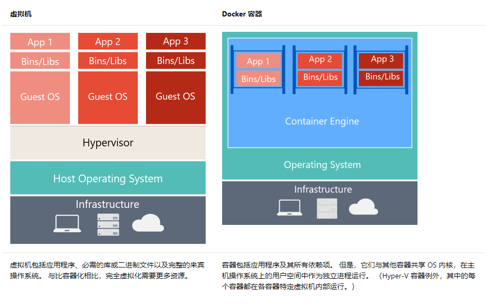

由于Docker不需要Hypervisor实现硬件资源虚拟化，运行在docker容器上的程序直接使用的都是实际物理机的硬件资源。因此在CPU、内存利用率上docker有明显优势。 

当新建一个 容器时，docker不需要和虚拟机一样重新加载一个操作系统内核。当新建一个虚拟机时，虚拟机软件需要加载GuestOS，整个新建过程是分钟级别的。而docker由于直接利用宿主机的操作系统，省略了这个复杂的过程，因此新建一个docker容器只需要几秒钟。

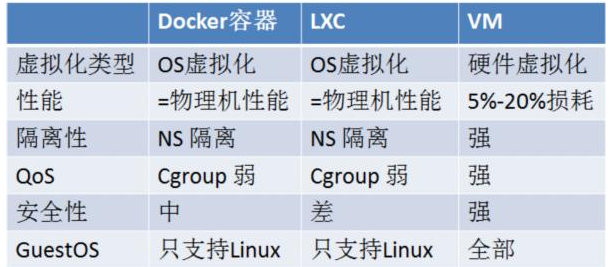

> Kubernetes

Kubernetes(k8s)是Google开源的容器集群管理系统（谷歌内部:Borg），目前已经成为容器编排一个标准。为容器化的应用提供部署运行、资源调度、服务发现和动态伸缩、高可用等一系列完整功能，提高了大规模容器集群管理的便捷性。

### 2、Docker简介

> Docker简介

[Docker](http://c.biancheng.net/docker/) 是一种运行于 Linux 和 Windows 上的软件，用于创建、管理和编排容器。

Docker 是在 GitHub 上开发的 Moby 开源项目的一部分。

Docker 公司，位于旧金山，是整个 Moby 开源项目的维护者。Docker 公司还提供包含支持服务的商业版本的 Docker。

> Docker公司

Docker 公司位于旧金山，由法裔美籍开发者和企业家 Solumon Hykes 创立。

有意思的是，Docker 公司起初是一家名为 dotCloud 的平台即服务（Platform-as-a-Service, PaaS）提供商。

底层技术上，dotCloud 平台利用了 Linux 容器技术。为了方便创建和管理这些容器，dotCloud 开发了一套内部工具，之后被命名为“Docker”。Docker就是这样诞生的！

2013年，dotCloud 的 PaaS 业务并不景气，公司需要寻求新的突破。于是他们聘请了 Ben Golub 作为新的 CEO，将公司重命名为“Docker”，放弃dotCloud PaaS 平台，怀揣着“将 Docker 和容器技术推向全世界”的使命，开启了一段新的征程。

> Docker 运行时与编排引擎

多数技术人员在谈到 Docker 时，主要是指 Docker 引擎。Docker 引擎是用于运行和编排容器的基础设施工具。

Docker 引擎可以从 Docker 网站下载，也可以基于 GitHub 上的源码进行构建。无论是开源版本还是商业版本，都有 Linux 和 Windows 版本。

Docker 引擎主要有两个版本：企业版（EE）和社区版（CE）。

> Docker开源项目（Moby）

“Docker”一词也会用于指代开源 Docker 项目。其中包含一系列可以从 Docker 官网下载和安装的工具，比如 Docker 服务端和 Docker 客户端。

不过，该项目在 2017 年于 Austin 举办的 DockerCon 上正式命名为 Moby 项目。

由于这次改名，GitHub 上的 docker/docker 库也被转移到了 moby/moby，并且拥有了项目自己的 Logo。
Moby 项目的目标是基于开源的方式，发展成为 Docker 上游，并将 Docker 拆分为更多的模块化组件。

Moby 项目托管于 GitHub 的 Moby 代码库，包括子项目和工具列表。核心的 Docker 引擎项目位于 GitHub 的 moby/moby，但是引擎中的代码正持续被拆分和模块化。

> 开放容器计划

OCI 是一个旨在对容器基础架构中的基础组件（如镜像格式与容器运行时）进行标准化的管理委员会。

OCI 已经发布了两份规范（标准）：镜像规范和运行时规范。

公平地说，这两个 OCI 规范对 Docker 的架构和核心产品设计产生了显著影响。Docker 1.11 版本中，Docker 引擎架构已经遵循 OCI 运行时规范了。

OCI 在 Linux 基金会的支持下运作，Docker 公司和 CoreOS 公司都是主要贡献者。

### 3、Docker架构

在安装好并启动了Docker之后，我们可以使用在命令行中使用docker命令操作docker，比如我们使用如下命令打印docker的版本信息。

```bash
[root@bluecusliyou ~]# docker version
Client: Docker Engine - Community
 Version:           20.10.7
 API version:       1.41
 Go version:        go1.13.15
 Git commit:        f0df350
 Built:             Wed Jun  2 11:56:24 2021
 OS/Arch:           linux/amd64
 Context:           default
 Experimental:      true

Server: Docker Engine - Community
 Engine:
  Version:          20.10.7
  API version:      1.41 (minimum version 1.12)
  Go version:       go1.13.15
  Git commit:       b0f5bc3
  Built:            Wed Jun  2 11:54:48 2021
  OS/Arch:          linux/amd64
  Experimental:     false
 containerd:
  Version:          1.4.8
  GitCommit:        7eba5930496d9bbe375fdf71603e610ad737d2b2
 runc:
  Version:          1.0.0
  GitCommit:        v1.0.0-0-g84113ee
 docker-init:
  Version:          0.19.0
  GitCommit:        de40ad0
```

从上面的图中，我们看到打出了两个部分的信息：Client和Server。

Docker采用 C/S架构 Docker daemon 作为服务端接受来自客户的请求，并处理这些请求（创建、运行、分发容器）。 客户端和服务端既可以运行在一个机器上。


当使用 Docker 命令行工具执行命令时，Docker 客户端会将其转换为合适的 API 格式，并发送到正确的 API 端点。

一旦 daemon 接收到创建新容器的命令，它就会向 containerd 发出调用。daemon 使用一种 CRUD 风格的 API，通过 gRPC 与 containerd 进行通信。

虽然名叫 containerd，但是它并不负责创建容器，而是指挥 runc 去做。containerd 将 Docker 镜像转换为 OCI bundle，并让 runc 基于此创建一个新的容器。

然后，runc 与操作系统内核接口进行通信，基于所有必要的工具（Namespace、CGroup等）来创建容器。容器进程作为 runc 的子进程启动，启动完毕后，runc 将会退出。

一旦容器进程的父进程 runc 退出，相关联的 containerd-shim 进程就会成为容器的父进程。当 daemon 重启的时候，容器不会终止，并且可以将容器的退出状态反馈给 daemon。

### 4、Docker典型场景

- 使应用的打包与部署自动化
- 创建轻量、私密的PAAS环境
- 实现自动化测试和持续的集成/部署
- 部署与扩展webapp、数据库和后台服务

由于其基于LXC的轻量级虚拟化的特点，docker相比KVM之类最明显的特点就是启动快，资源占用小。因此对于构建隔离的标准化的运行环境，轻量级的PaaS，构建自动化测试和持续集成环境，以及一切可以横向扩展的应用(尤其是需要快速启停来应对峰谷的web应用)。

### 5、Docker的局限

Docker并不是全能的，设计之初也不是KVM之类虚拟化手段的替代品，简单总结几点：

- Docker是基于Linux 64bit的，无法在32bit的linux/Windows/unix环境下使用
- LXC是基于cgroup等linux kernel功能的，因此container的guest系统只能是linux base的
- 隔离性相比KVM之类的虚拟化方案还是有些欠缺，所有container公用一部分的运行库
- 网络管理相对简单，主要是基于namespace隔离
- cgroup的cpu和cpuset提供的cpu功能相比KVM的等虚拟化方案相比难以度量(所以dotcloud主要是按内存收费)
- Docker对disk的管理比较有限
- container随着用户进程的停止而销毁，container中的log等用户数据不便收集

### 6、Docker核心概念

#### （1）镜像(Image)

Docker镜像是一个特殊的文件系统，提供容器运行时所需的程序、库、资源、配置等文件，另外还包含了一些为运行时准备的一些配置参数（如匿名卷、环境变量、用户等）。

镜像是一个静态的概念，不包含任何动态数据，其内容在构建之后也不会被改变。

#### （2）容器(Container)

镜像与容器的关系，就是面向对象编程中类与对象的关系，我们定好每一个类，然后使用类创建对象，对应到Docker的使用上，则是构建好每一个镜像，然后使用镜像创建我们需要的容器。

#### （3）仓库(Repository)

仓库是一个集中存储和分发镜像的服务。Docker Registry包含很多个仓库，每个仓库对应多个标签，不同标签对应一个软件的不同版本。仓库分为公开仓库（Public）和私有仓库（Private）两种形式。

最大的公开仓库是Docker Hub，是Docker提供用于存储和分布镜像的官方Docker Registry，也是默认的Registry。

Docker Hub有很多官方或其他开发提供的高质量镜像供我们使用，如果要将我们自己构建的镜像上传到Docker Hub上，我们需要在Docker Hub上注册一个账号，然后把自己在本地构建的镜像发送到Docker Hub的仓库中。

## 二、Docker实现原理

Docker核心解决的问题是利用LXC来实现类似VM的功能，从而利用更加节省的硬件资源提供给用户更多的计算资源。同VM的方式不同, LXC其并不是一套硬件虚拟化方法，而是一个操作系统级虚拟化方法，其解决的主要是以下4个问题:

- 隔离性 - 每个用户实例之间相互隔离, 互不影响。 硬件虚拟化方法给出的方法是VM, LXC给出的方法是container，更细一点是kernel namespace
- 可配额/可度量 - 每个用户实例可以按需提供其计算资源，所使用的资源可以被计量。硬件虚拟化方法因为虚拟了CPU, memory可以方便实现, LXC则主要是利用cgroups来控制资源
- 移动性 - 用户的实例可以很方便地复制、移动和重建。硬件虚拟化方法提供snapshot和image来实现，docker(主要)利用AUFS实现
- 安全性 - 这个话题比较大，这里强调是host主机的角度尽量保护container。硬件虚拟化的方法因为虚拟化的水平比较高，用户进程都是在KVM等虚拟机容器中翻译运行的, 然而对于LXC, 用户的进程是lxc-start进程的子进程, 只是在Kernel的namespace中隔离的, 因此需要一些kernel的patch来保证用户的运行环境不会受到来自host主机的恶意入侵, dotcloud(主要是)利用kernel grsec patch解决的.

### 1、Namespace

在服务器上启动了多个服务，这些服务其实会相互影响的，每一个服务都能看到其他服务的进程，也可以访问宿主机器上的任意文件，这不是我们要的效果，我们更希望运行在同一台机器上的不同服务能做到**完全隔离**，就像运行在多台不同的机器上一样。

Linux的命名空间 (namespaces) 可以为我们提供用于隔离进程树、网络接口、挂载点以及进程间通信等资源的方法。

#### （1）Linux的Namespace实现的隔离性种类

Linux的Namespace实现的隔离性种类有六种，进程、网络、IPC、文件系统、UTS和用户。

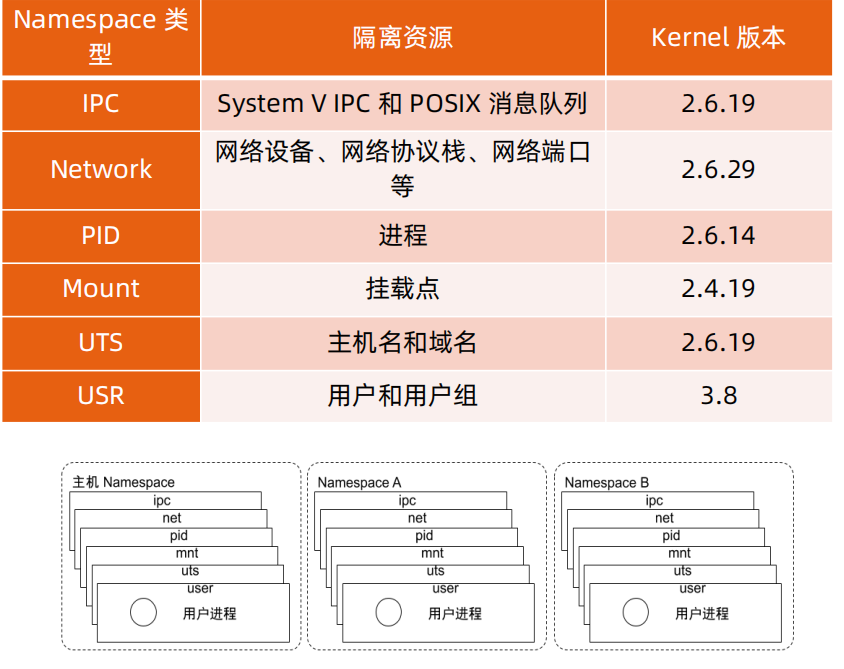

#### （2）查看宿主机和容器的进程和网络完全不同

```bash
#查看宿主机进程
[root@bluecusliyou ~]# ps -ef|head -10
UID          PID    PPID  C STIME TTY          TIME CMD
root           1       0  0 09:49 ?        00:00:01 /usr/lib/systemd/systemd --switched-root --system --deserialize 17
root           2       0  0 09:49 ?        00:00:00 [kthreadd]
root           3       2  0 09:49 ?        00:00:00 [rcu_gp]
root           4       2  0 09:49 ?        00:00:00 [rcu_par_gp]
root           6       2  0 09:49 ?        00:00:00 [kworker/0:0H-kblockd]
root           8       2  0 09:49 ?        00:00:00 [mm_percpu_wq]
root           9       2  0 09:49 ?        00:00:00 [ksoftirqd/0]
root          10       2  0 09:49 ?        00:00:03 [rcu_sched]
root          11       2  0 09:49 ?        00:00:00 [migration/0]
#进入容器内部查看进程核宿主机中的进程和网络完全不同
[root@bluecusliyou ~]# docker run -it --name centos centos
[root@5a54231926d5 /]# ps -ef
UID          PID    PPID  C STIME TTY          TIME CMD
root           1       0  3 07:22 pts/0    00:00:00 /bin/bash
root          15       1  0 07:22 pts/0    00:00:00 ps -ef
[root@5a54231926d5 /]# ip addr
1: lo: <LOOPBACK,UP,LOWER_UP> mtu 65536 qdisc noqueue state UNKNOWN group default qlen 1000
    link/loopback 00:00:00:00:00:00 brd 00:00:00:00:00:00
    inet 127.0.0.1/8 scope host lo
       valid_lft forever preferred_lft forever
112: eth0@if113: <BROADCAST,MULTICAST,UP,LOWER_UP> mtu 1500 qdisc noqueue state UP group default 
    link/ether 02:42:ac:11:00:02 brd ff:ff:ff:ff:ff:ff link-netnsid 0
    inet 172.17.0.2/16 brd 172.17.255.255 scope global eth0
       valid_lft forever preferred_lft forever
[root@5a54231926d5 /]# 
#宿主机的网络配置和容器也是不同的
[root@bluecusliyou ~]# ip addr
1: lo: <LOOPBACK,UP,LOWER_UP> mtu 65536 qdisc noqueue state UNKNOWN group default qlen 1000
    link/loopback 00:00:00:00:00:00 brd 00:00:00:00:00:00
    inet 127.0.0.1/8 scope host lo
       valid_lft forever preferred_lft forever
    inet6 ::1/128 scope host 
       valid_lft forever preferred_lft forever
2: eth0: <BROADCAST,MULTICAST,UP,LOWER_UP> mtu 1500 qdisc fq_codel state UP group default qlen 1000
    link/ether 00:16:3e:16:fa:95 brd ff:ff:ff:ff:ff:ff
    inet 172.27.45.106/20 brd 172.27.47.255 scope global dynamic noprefixroute eth0
       valid_lft 311881481sec preferred_lft 311881481sec
    inet6 fe80::216:3eff:fe16:fa95/64 scope link 
       valid_lft forever preferred_lft forever
3: docker0: <BROADCAST,MULTICAST,UP,LOWER_UP> mtu 1500 qdisc noqueue state UP group default 
    link/ether 02:42:3f:30:cc:94 brd ff:ff:ff:ff:ff:ff
    inet 172.17.0.1/16 brd 172.17.255.255 scope global docker0
       valid_lft forever preferred_lft forever
    inet6 fe80::42:3fff:fe30:cc94/64 scope link 
       valid_lft forever preferred_lft forever
...
```

#### （3）进入容器的Namespace查看和容器中查看完全相同

```bash
[root@bluecusliyou ~]# nsenter --help

用法：
 nsenter [选项] [<程序> [<参数>...]]

以其他程序的名字空间运行某个程序。

选项：
 -a, --all              enter all namespaces
 -t, --target <pid>     要获取名字空间的目标进程
 -m, --mount[=<文件>]   进入 mount 名字空间
 -u, --uts[=<文件>]     进入 UTS 名字空间(主机名等)
 -i, --ipc[=<文件>]     进入 System V IPC 名字空间
 -n, --net[=<文件>]     进入网络名字空间
 -p, --pid[=<文件>]     进入 pid 名字空间
 -C, --cgroup[=<文件>]  进入 cgroup 名字空间
 -U, --user[=<文件>]    进入用户名字空间
 -S, --setuid <uid>     设置进入空间中的 uid
 -G, --setgid <gid>     设置进入名字空间中的 gid
     --preserve-credentials 不干涉 uid 或 gid
 -r, --root[=<目录>]     设置根目录
 -w, --wd[=<dir>]       设置工作目录
 -F, --no-fork          执行 <程序> 前不 fork
 -Z, --follow-context  根据 --target PID 设置 SELinux 环境

 -h, --help             display this help
 -V, --version          display version

更多信息请参阅 nsenter(1)。
```

```bash
#进入容器查看进程ID
[root@bluecusliyou ~]# docker inspect centos |grep -i pid
            "Pid": 421570,
            "PidMode": "",
            "PidsLimit": null,
#根据进程ID进入namespace查看网络信息
[root@bluecusliyou ~]# nsenter -t 421570 -n ip addr
1: lo: <LOOPBACK,UP,LOWER_UP> mtu 65536 qdisc noqueue state UNKNOWN group default qlen 1000
    link/loopback 00:00:00:00:00:00 brd 00:00:00:00:00:00
    inet 127.0.0.1/8 scope host lo
       valid_lft forever preferred_lft forever
112: eth0@if113: <BROADCAST,MULTICAST,UP,LOWER_UP> mtu 1500 qdisc noqueue state UP group default 
    link/ether 02:42:ac:11:00:02 brd ff:ff:ff:ff:ff:ff link-netnsid 0
    inet 172.17.0.2/16 brd 172.17.255.255 scope global eth0
       valid_lft forever preferred_lft forever
#直接进入容器查看网络信息是一样的
[root@bluecusliyou ~]# docker exec -it centos ip addr
1: lo: <LOOPBACK,UP,LOWER_UP> mtu 65536 qdisc noqueue state UNKNOWN group default qlen 1000
    link/loopback 00:00:00:00:00:00 brd 00:00:00:00:00:00
    inet 127.0.0.1/8 scope host lo
       valid_lft forever preferred_lft forever
112: eth0@if113: <BROADCAST,MULTICAST,UP,LOWER_UP> mtu 1500 qdisc noqueue state UP group default 
    link/ether 02:42:ac:11:00:02 brd ff:ff:ff:ff:ff:ff link-netnsid 0
    inet 172.17.0.2/16 brd 172.17.255.255 scope global eth0
       valid_lft forever preferred_lft forever
```

### 2、Cgroups

Linux的命名空间 (namespaces) 可以为我们提供的用于分离进程树、网络接口、挂载点以及进程间通信等资源的方法。但是并不能够为我们提供物理资源上的隔离。

在同一台机器上运行的多个容器会共同占用宿主机器的物理资源，其中某个容器正在执行 CPU 密集型的任务，就会影响其他容器中任务的性能与执行效率，导致多个容器相互影响并且抢占资源。

 Control Groups（简称 CGroups）就是能够隔离宿主机器上的物理资源，例如 CPU、内存、磁盘 I/O 和网络带宽。

#### （1）对资源的配额和度量

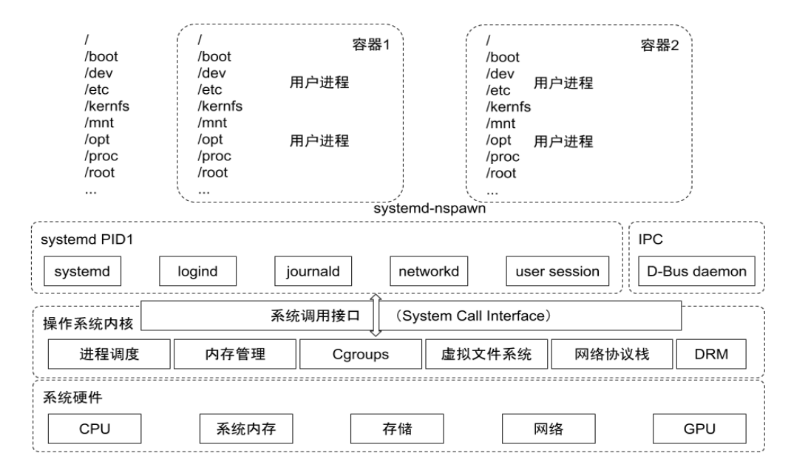

cgroups 实现了对资源的配额和度量。

- blkio：这个子系统设置限制每个块设备的输入输出控制。例如:磁盘，光盘以及 USB 等等；
- cpu：这个子系统使用调度程序为 cgroup 任务提供 CPU 的访问；
- cpuacct：产生 cgroup 任务的 CPU 资源报告；
- cpuset：如果是多核心的CPU，这个子系统会为 cgroup 任务分配单独的 CPU 和内存；
- devices：允许或拒绝 cgroup 任务对设备的访问；
- freezer：暂停和恢复 cgroup 任务；
- memory：设置每个 cgroup 的内存限制以及产生内存资源报告；
- net_cls：标记每个网络包以供 cgroup 方便使用；
- ns：名称空间子系统；
- pid: 进程标识子系统。

```bash
[root@bluecusliyou ~]# cd /sys/fs/cgroup/
[root@bluecusliyou cgroup]# ll
总用量 0
dr-xr-xr-x 6 root root  0 11月  3 23:57 blkio
lrwxrwxrwx 1 root root 11 11月  3 23:57 cpu -> cpu,cpuacct
lrwxrwxrwx 1 root root 11 11月  3 23:57 cpuacct -> cpu,cpuacct
dr-xr-xr-x 8 root root  0 11月  3 23:57 cpu,cpuacct
dr-xr-xr-x 3 root root  0 11月  3 23:57 cpuset
dr-xr-xr-x 6 root root  0 11月  3 23:57 devices
dr-xr-xr-x 3 root root  0 11月  3 23:57 freezer
dr-xr-xr-x 3 root root  0 11月  3 23:57 hugetlb
dr-xr-xr-x 7 root root  0 11月  3 23:57 memory
lrwxrwxrwx 1 root root 16 11月  3 23:57 net_cls -> net_cls,net_prio
dr-xr-xr-x 3 root root  0 11月  3 23:57 net_cls,net_prio
lrwxrwxrwx 1 root root 16 11月  3 23:57 net_prio -> net_cls,net_prio
dr-xr-xr-x 3 root root  0 11月  3 23:57 perf_event
dr-xr-xr-x 6 root root  0 11月  3 23:57 pids
dr-xr-xr-x 2 root root  0 11月  3 23:57 rdma
dr-xr-xr-x 6 root root  0 11月  3 23:57 systemd
```

#### （2）CPU 子系统

- cpu.shares：可出让的能获得 CPU 使用时间的相对值。
- cpu.cfs_period_us：cfs_period_us 用来配置时间周期长度，单位为 us（微秒）。
- cpu.cfs_quota_us：cfs_quota_us 用来配置当前 Cgroup 在 cfs_period_us 时间内最多能使用的 CPU
- 时间数，单位为 us（微秒）。
- cpu.stat ：Cgroup 内的进程使用的 CPU 时间统计。
- nr_periods ：经过 cpu.cfs_period_us 的时间周期数量。
- nr_throttled ：在经过的周期内，有多少次因为进程在指定的时间周期内用光了配额时间而受到限制。
- throttled_time ：Cgroup 中的进程被限制使用 CPU 的总用时，单位是 ns（纳秒）。

```bash
[root@bluecusliyou cgroup]# cd /sys/fs/cgroup/cpu
[root@bluecusliyou cpu]# ll
总用量 0
drwxr-xr-x   2 root root 0 11月  3 15:59 aegis
drwxr-xr-x   2 root root 0 12月  8 06:28 assist
-rw-r--r--   1 root root 0 11月  3 15:58 cgroup.clone_children
-rw-r--r--   1 root root 0 11月  7 15:52 cgroup.procs
-r--r--r--   1 root root 0 11月  3 15:58 cgroup.sane_behavior
-r--r--r--   1 root root 0 11月  3 15:58 cpuacct.stat
-rw-r--r--   1 root root 0 11月  3 15:58 cpuacct.usage
-r--r--r--   1 root root 0 11月  3 15:58 cpuacct.usage_all
-r--r--r--   1 root root 0 11月  3 15:58 cpuacct.usage_percpu
-r--r--r--   1 root root 0 11月  3 15:58 cpuacct.usage_percpu_sys
-r--r--r--   1 root root 0 11月  3 15:58 cpuacct.usage_percpu_user
-r--r--r--   1 root root 0 11月  3 15:58 cpuacct.usage_sys
-r--r--r--   1 root root 0 11月  3 15:58 cpuacct.usage_user
-rw-r--r--   1 root root 0 11月  3 15:58 cpu.cfs_period_us
-rw-r--r--   1 root root 0 11月  3 15:58 cpu.cfs_quota_us
-rw-r--r--   1 root root 0 11月  3 15:58 cpu.rt_period_us
-rw-r--r--   1 root root 0 11月  3 15:58 cpu.rt_runtime_us
-rw-r--r--   1 root root 0 11月  3 15:58 cpu.shares
-r--r--r--   1 root root 0 11月  3 15:58 cpu.stat
drwxr-xr-x  20 root root 0 11月  7 15:35 docker
drwxr-xr-x   2 root root 0 11月  7 15:33 init.scope
-rw-r--r--   1 root root 0 11月  3 15:58 notify_on_release
-rw-r--r--   1 root root 0 11月  3 15:58 release_agent
drwxr-xr-x 108 root root 0 11月  7 15:33 system.slice
-rw-r--r--   1 root root 0 11月  3 15:58 tasks
drwxr-xr-x   2 root root 0 11月  7 15:33 user.slice
```

> 创建一个cpu子系统cpudemo，所有的文件都会自动创建完成

```bash
#创建一个cpu的子系统
[root@bluecusliyou cpu]# mkdir cpudemo
[root@bluecusliyou cpu]# cd cpudemo
[root@bluecusliyou cpudemo]# ll
总用量 0
-rw-r--r-- 1 root root 0 1月   9 10:30 cgroup.clone_children
-rw-r--r-- 1 root root 0 1月   9 10:30 cgroup.procs
-r--r--r-- 1 root root 0 1月   9 10:30 cpuacct.stat
-rw-r--r-- 1 root root 0 1月   9 10:30 cpuacct.usage
-r--r--r-- 1 root root 0 1月   9 10:30 cpuacct.usage_all
-r--r--r-- 1 root root 0 1月   9 10:30 cpuacct.usage_percpu
-r--r--r-- 1 root root 0 1月   9 10:30 cpuacct.usage_percpu_sys
-r--r--r-- 1 root root 0 1月   9 10:30 cpuacct.usage_percpu_user
-r--r--r-- 1 root root 0 1月   9 10:30 cpuacct.usage_sys
-r--r--r-- 1 root root 0 1月   9 10:30 cpuacct.usage_user
-rw-r--r-- 1 root root 0 1月   9 10:30 cpu.cfs_period_us
-rw-r--r-- 1 root root 0 1月   9 10:30 cpu.cfs_quota_us
-rw-r--r-- 1 root root 0 1月   9 10:30 cpu.rt_period_us
-rw-r--r-- 1 root root 0 1月   9 10:30 cpu.rt_runtime_us
-rw-r--r-- 1 root root 0 1月   9 10:30 cpu.shares
-r--r--r-- 1 root root 0 1月   9 10:30 cpu.stat
-rw-r--r-- 1 root root 0 1月   9 10:30 notify_on_release
-rw-r--r-- 1 root root 0 1月   9 10:30 tasks
#查看系统进程，随便找一个CPU负载较高的进程
[root@bluecusliyou cpudemo]# top
    PID USER      PR  NI    VIRT    RES    SHR S  %CPU  %MEM     TIME+ COMMAND
   2395 root      10 -10  217692  63904   4988 S   4.7   1.7   4:54.54 AliYunDun 
    794 root      20   0  221364   5888   4204 S   0.3   0.2   0:42.94 sssd_nss
    855 root      20   0  425268  16916    100 S   0.3   0.5   0:00.83 tuned
    868 root      20   0 1351416  24712   3592 S   0.3   0.7   0:05.32 containerd
   1120 root      20   0  155256   4036   2376 S   0.3   0.1   0:30.26 sshd
 249465 root      20   0   67648   5060   4244 R   0.3   0.1   0:00.02 top
      1 root      20   0  176880   6480   3740 S   0.0   0.2   0:01.44 systemd
      2 root      20   0       0      0      0 S   0.0   0.0   0:00.00 kthreadd
      3 root       0 -20       0      0      0 I   0.0   0.0   0:00.00 rcu_gp        
#告诉cgroup要控制的是哪个进程
[root@bluecusliyou cpudemo]# echo 2395 > cgroup.procs
#控制CPU的占比就是控制  cpu.cfs_quota_us占cpu.cfs_period_us的比例
[root@bluecusliyou cpudemo]# cat cpu.cfs_period_us
100000
#-1 就是不做控制
[root@bluecusliyou cpudemo]# cat cpu.cfs_quota_us
-1
#1000/100000就是最高控制在1%
[root@bluecusliyou cpudemo]# echo 1000 > cpu.cfs_quota_us
#查看系统进程,CPU占用降低了
[root@bluecusliyou cpudemo]# top
PID USER      PR  NI    VIRT    RES    SHR S  %CPU  %MEM     TIME+ COMMAND                 
2395 root      10 -10  218532  64976   4988 R   1.0   1.8   5:05.02 AliYunDun
   1120 root      20   0  155256   4036   2376 S   0.7   0.1   0:31.87 sshd 
    794 root      20   0  221364   5888   4204 S   0.3   0.2   0:44.35 sssd_nss
    996 root      20   0   57892   1716      0 S   0.3   0.0   0:03.18 AliYunDunUpdate
   1060 root      20   0  805868   8900   4468 S   0.3   0.2   0:04.36 aliyun-service 
 256487 root      20   0       0      0      0 I   0.3   0.0   0:00.01 kworker/1:1-events
      1 root      20   0  176880   6480   3740 S   0.0   0.2   0:01.44 systemd           
```

### 3、Union FS

Linux 的命名空间和控制组分别解决了不同资源隔离的问题，前者解决了进程、网络以及文件系统的隔离，后者实现了 CPU、内存等资源的隔离，但是在 Docker 中还有另一个非常重要的问题需要解决，也就是镜像的存储和分发问题。

#### （1）联合文件系统

Docker 支持了不同的存储驱动，包括 `aufs`、`devicemapper`、`overlay2`、`zfs` 和 `vfs` 等等，在最新的 Docker 中，`overlay2` 取代了 `aufs` 成为了推荐的存储驱动，但是在没有 `overlay2` 驱动的机器上仍然会使用 `aufs` 作为 Docker 的默认驱动。

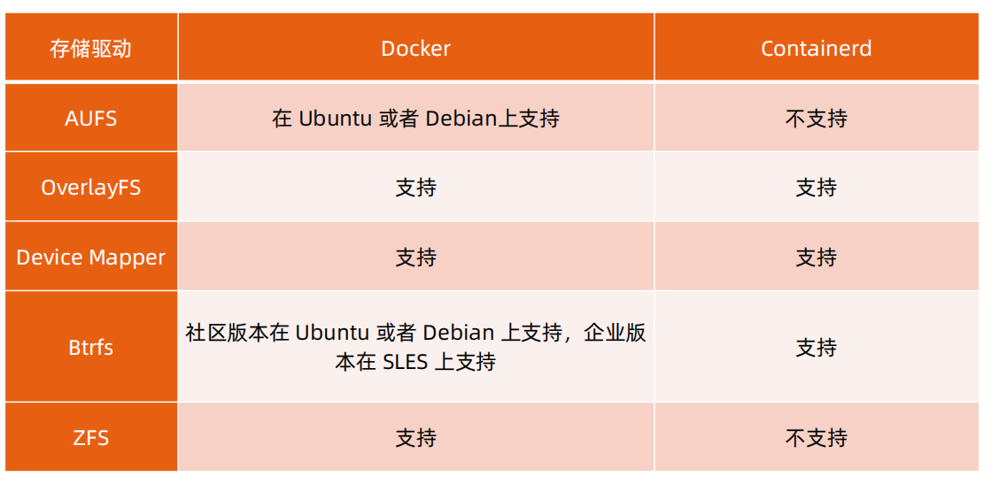

```bash
#通过命令可以查看当前机器的文件系统
[root@bluecusliyou ~]# docker info | grep Storage
 Storage Driver: overlay2
```

UnionFS（联合文件系统）其实是一种为 Linux 操作系统设计的用于把多个文件系统联合到同一个挂载点的文件系统服务。而 AUFS 即 Advanced UnionFS 其实就是 UnionFS 的升级版，它能够提供更优秀的性能和效率。

OverlayFS 也是一种与 AUFS 类似的联合文件系统，同样属于文件级的存储驱动，包含了最初的Overlay 和更新更稳定的 overlay2。Overlay 只有两层：upper 层和 Lower 层。Lower 层代表镜像层，upper 层代表容器可写层。

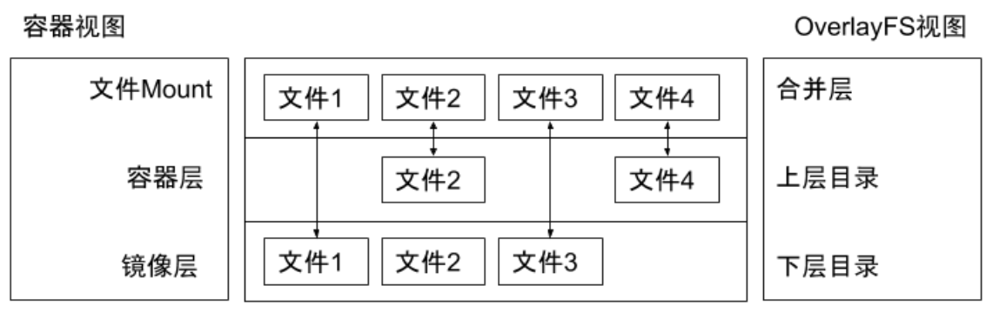

```bash
#创建4个文件夹
[root@bluecusliyou OverlayFS]# mkdir upper lower merged work
#lower文件夹写入两个文件in_lower.txt  in_both.txt
#upper文件夹写入两个文件in_upper.txt  in_both.txt
#两个文件夹有同名的文件in_both.txt
[root@bluecusliyou OverlayFS]# echo "from lower" > lower/in_lower.txt
[root@bluecusliyou OverlayFS]# echo "from lower" > lower/in_both.txt
[root@bluecusliyou OverlayFS]# echo "from upper" > upper/in_upper.txt
[root@bluecusliyou OverlayFS]# echo "from upper" > upper/in_both.txt
[root@bluecusliyou OverlayFS]# sudo mount -t overlay overlay -o 
#挂载两个文件夹文件到合并文件夹
[root@bluecusliyou OverlayFS]# sudo mount -t overlay overlay -o lowerdir=`pwd`/lower,upperdir=`pwd`/upper,workdir=`pwd`/work `pwd`/merged
[root@bluecusliyou OverlayFS]# cd merged
#最终的文件是三个，同名的文件是下层的被上层的覆盖了
[root@bluecusliyou merged]# ls
in_both.txt  in_lower.txt  in_upper.txt
[root@bluecusliyou merged]# cat in_both.txt
from upper
```

#### （2）容器和镜像是什么

镜像其实本质就是一个文件，用来打包运行环境和软件，他包含运行某个软件所需的所有内容，包括代码、运行时库、环境变量和配置文件。

我们首先需要理解 Docker 是如何构建并且存储镜像的，也需要明白 Docker 的镜像是如何被每一个容器所使用的；Docker 中的每一个镜像都是由一系列只读的层组成的，Dockerfile 中的每一个命令都会在已有的只读层上创建一个新的层。如下有一个DockerFile文件。

```dockerfile
FROM ubuntu:15.04
COPY . /app
RUN make /app
CMD python /app/app.py
```

上述的 Dockerfile 文件会构建一个拥有四层 layer 的镜像。每一个镜像层都是建立在另一个镜像层之上的，同时所有的镜像层都是只读的，当镜像被 `docker run` 命令创建时就会在镜像的最上层添加一个可写的层，也就是容器层，所有对于运行时容器的修改其实都是对这个容器读写层的修改。

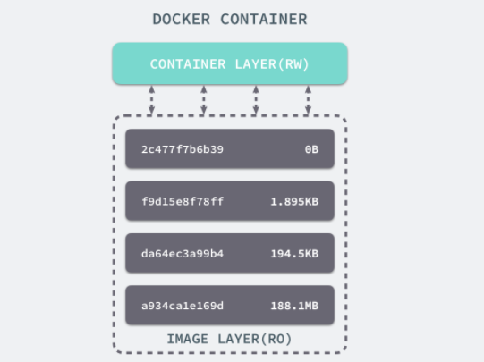

容器的本质也是一个文件，容器和镜像的区别就在于，所有的镜像都是只读的，而每一个容器其实等于镜像加上一个可读写的层，也就是同一个镜像可以对应多个容器。

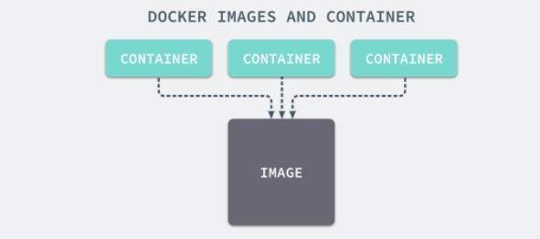

```bash
#可以查看镜像详情，看到文件存储的位置
[root@bluecusliyou ~]# docker image inspect nginx
[
    {
        ...
        "GraphDriver": {
            "Data": {
                "LowerDir": "/var/lib/docker/overlay2/96562081bb21856c9dbe4954de162212f7bd995c12a2ca2020799035b851f878/diff:/var/lib/docker/overlay2/2041f352a717bbaa3bb001bd2e458e55725341f602910ef7cdfaddf143bc9b59/diff:/var/lib/docker/overlay2/ce724e7f1f657a904975065b4a9800ca9365b4f4c425f67971bb422d78b08eab/diff:/var/lib/docker/overlay2/15c0d2d84de64718eaec1476ad2bf649d4dba1bde69b3724fafd6f37c3ef6f40/diff:/var/lib/docker/overlay2/083c6fb016be0ff1170f95f49b661d0437a7c884dd4d0b653bd9cb9650641f1f/diff",
                "MergedDir": "/var/lib/docker/overlay2/aed671c328f45f5a73296c9cd013581255889065976f83e850f4ee15de14decc/merged",
                "UpperDir": "/var/lib/docker/overlay2/aed671c328f45f5a73296c9cd013581255889065976f83e850f4ee15de14decc/diff",
                "WorkDir": "/var/lib/docker/overlay2/aed671c328f45f5a73296c9cd013581255889065976f83e850f4ee15de14decc/work"
            },
            "Name": "overlay2"
        }
        ...
    }
]
```

#### （3）容器和镜像加载原理

每一个镜像层都是建立在另一个镜像层之上的，同时所有的镜像层都是只读的，只有每个容器最顶层的容器层才可以被用户直接读写，所有的容器都建立在一些底层服务（Kernel）上，包括命名空间、控制组、rootfs 等等。

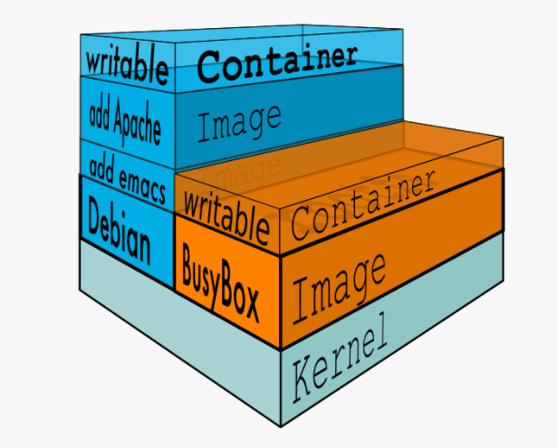

> 正常安装的CentOS都是好几个G，为什么Docker的Centos镜像才200M？

```bash
[root@bluecusliyou ~]# docker images centos
REPOSITORY   TAG       IMAGE ID       CREATED        SIZE
centos       latest    5d0da3dc9764   2 months ago   231MB
```

典型的 Linux 文件系统组成包含`Bootfs（boot file system） `和`rootfs （root file system）`  


boots(boot file system）主要包含 bootloader和 Kernel，bootloader主要是引导加 kernel，Linux刚启动时会加bootfs文件系统，当boot加载完成之后整个内核就都在内存中了，此时内存的使用权已由 bootfs转交给内核，此时系统也会卸载bootfs。

rootfs（root file system)，在 bootfs之上。包含的就是典型 Linux系统中的/dev，/proc，/bin，/etc等标准目录和文件。 rootfs就是各种不同的操作系统发行版，比如 Ubuntu，Centos等等。 

对于一个精简的OS，rootfs可以很小，只需要包合最基本的命令，工具和程序库就可以了，因为底层直接用宿主机的kernel，自己只需要提供rootfs就可以了。不同的linux发行版本bootfs基本是一致的， rootfs会有差別，因此不同的发行版可以公用bootfs。所以镜像可以很小。

> 为什么启动一个容器只需要秒级，而启动一个系统是分钟级？

当启动一个 容器时，docker可以直接利用宿主机的操作系统kernel，省略了加载完整系统kernel这个复杂的过程，因此启动一个docker容器只需要几秒钟。

> 镜像为什么要分层？

我们可以去下载一个镜像，注意观察下载的日志输出，可以看到是一层层的在下载 。 采用这种分层的结构，最大的好处，就是可以资源共享，节省磁盘空间，内存空间，加快下载速度，这种文件的组装方式提供了非常大的灵活性。

比如有多个镜像都从相同的Base镜像构建而来，那么宿主机只需在磁盘上保留一份base镜像，下载镜像的时候可以不用重复下载，同时内存中也只需要加载一份base镜像，这样就可以为所有的容器服务了，而且镜像的每一层都可以被共享。

```bash
#拉取镜像是分层下载的
[root@bluecusliyou ~]# docker pull redis
Using default tag: latest
latest: Pulling from library/redis
eff15d958d66: Pull complete 
1aca8391092b: Pull complete 
06e460b3ba1b: Pull complete 
def49df025c0: Pull complete 
646c72a19e83: Pull complete 
db2c789841df: Pull complete 
Digest: sha256:619af14d3a95c30759a1978da1b2ce375504f1af70ff9eea2a8e35febc45d747
Status: Downloaded newer image for redis:latest
docker.io/library/redis:latest
#镜像详情可以看到分层的信息
[root@bluecusliyou ~]# docker image inspect redis
[
    {
        ...
            "Layers": [
                "sha256:e1bbcf243d0e7387fbfe5116a485426f90d3ddeb0b1738dca4e3502b6743b325",
                "sha256:58e6a16139eebebf7f6f0cb15f9cb3c2a4553a062d2cbfd1a782925452ead433",
                "sha256:503a5c57d9786921c992b7b2216ae58f69dcf433eedb28719ddea3606b42ce26",
                "sha256:277199a0027e044f64ef3719a6d7c3842e99319d6e0261c3a5190249e55646cf",
                "sha256:d0d567a1257963b9655dfceaddc76203c8544fbf6c8672b372561a3c8a3143d4",
                "sha256:a7115aa098139866d7073846e4321bafb8d5ca0d0f907a3c9625f877311bee7c"
            ]
        }
        ...
    }
]
```

## 三、Docker安装

### 1、官方地址

docker官网：[https://www.docker.com/](https://www.docker.com/)

文档：[https://docs.docker.com/](https://docs.docker.com/)]

开源项目地址：[https://github.com/moby/moby](https://github.com/moby/moby)

### 2、各系统安装Docker

Docker 是一个开源的商业产品，有两个版本：社区版（Community Edition，缩写为 CE）和企业版（Enterprise Edition，缩写为 EE）。企业版包含了一些收费服务，个人开发者一般用不到。下面的介绍都针对社区版。

Docker CE 的安装请参考官方文档。

> - [Mac](https://docs.docker.com/docker-for-mac/install/)
> - [Windows](https://docs.docker.com/docker-for-windows/install/)
> - [Ubuntu](https://docs.docker.com/install/linux/docker-ce/ubuntu/)
> - [Debian](https://docs.docker.com/install/linux/docker-ce/debian/)
> - [CentOS](https://docs.docker.com/install/linux/docker-ce/centos/)
> - [Fedora](https://docs.docker.com/install/linux/docker-ce/fedora/)
> - [其他 Linux 发行版](https://docs.docker.com/install/linux/docker-ce/binaries/)

### 3、CentOS安装Docker

####  （1）系统要求

Linux要求内核3.0以上

```bash
[root@bluecusliyou ~]# uname -r
4.18.0-193.28.1.el8_2.x86_64
```

#### （2）安装

```bash
#1.卸载旧版本 
sudo yum remove docker \
                  docker-client \
                  docker-client-latest \
                  docker-common \
                  docker-latest \
                  docker-latest-logrotate \
                  docker-logrotate \
                  docker-engine

#2.需要的安装包 
sudo yum install -y yum-utils

#3.设置镜像的仓库 
sudo yum-config-manager \
    --add-repo \
    https://download.docker.com/linux/centos/docker-ce.repo 
#默认是从国外的，不推荐，国内访问可能会失败
#推荐使用国内的，速度快
sudo yum-config-manager \
    --add-repo \
    http://mirrors.aliyun.com/docker-ce/linux/centos/docker-ce.repo

#4.更新yum软件包索引 
sudo yum makecache

#5.安装docker相关的 docker-ce 社区版 而ee是企业版 
sudo yum install docker-ce docker-ce-cli containerd.io 

#6.启动Docker服务，设置开机启动
sudo systemctl start docker
sudo systemctl enable docker

#7.查看是否安装成功 
docker version
docker info

#8.测试运行
docker run hello-world

#9.查看一下下载的镜像
docker images

#10.查看一下容器
docker ps -a

#11.卸载docker
#卸载依赖 
yum remove docker-ce docker-ce-cli containerd.io 
# 删除资源 
# /var/lib/docker 是docker的默认工作路径！
rm -rf /var/lib/docker 
```

#### （3）配置镜像加速

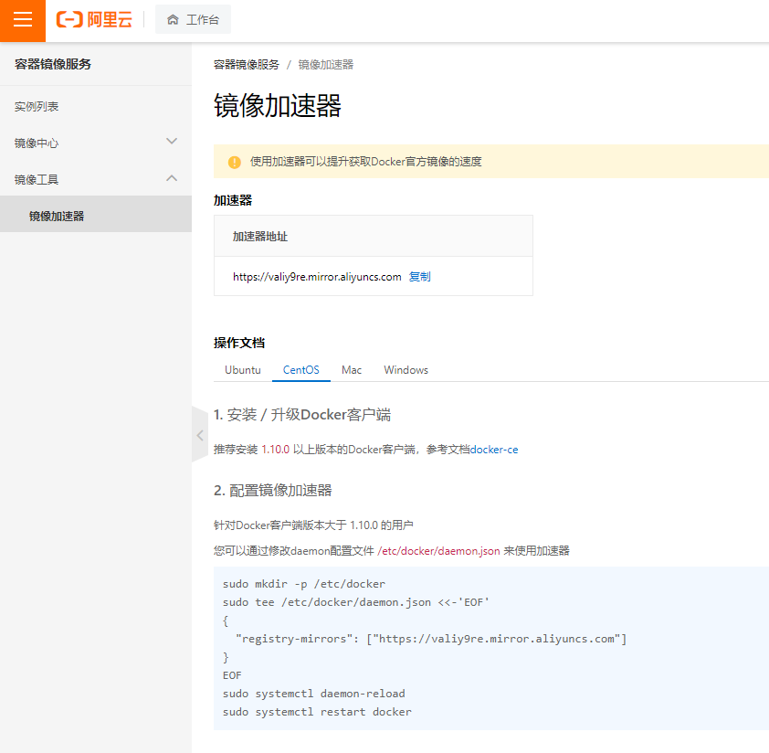

```bash
sudo mkdir -p /etc/docker
sudo tee /etc/docker/daemon.json <<-'EOF'
{
  "registry-mirrors": ["https://valiy9re.mirror.aliyuncs.com"]
}
EOF
sudo systemctl daemon-reload
sudo systemctl restart docker
```

## 四、Docker常用命令

### 1、命令汇总

官方命令说明：[https://docs.docker.com/engine/reference/commandline/docker/](https://docs.docker.com/engine/reference/commandline/docker/)


```bash
docker version            #显示docker的版本信息
docker info               #显示docker的系统信息，包括镜像和容器的数量
docker --help             #帮助命令
docker 子命令 --help       #子命令的帮助命令
```

```bash
[root@bluecusliyou ~]# docker --help

Usage:  docker [OPTIONS] COMMAND

A self-sufficient runtime for containers

Options:
      --config string      Location of client config files (default "/root/.docker")
  -c, --context string     Name of the context to use to connect to the daemon (overrides
                           DOCKER_HOST env var and default context set with "docker context use")
  -D, --debug              Enable debug mode
  -H, --host list          Daemon socket(s) to connect to
  -l, --log-level string   Set the logging level ("debug"|"info"|"warn"|"error"|"fatal")
                           (default "info")
      --tls                Use TLS; implied by --tlsverify
      --tlscacert string   Trust certs signed only by this CA (default "/root/.docker/ca.pem")
      --tlscert string     Path to TLS certificate file (default "/root/.docker/cert.pem")
      --tlskey string      Path to TLS key file (default "/root/.docker/key.pem")
      --tlsverify          Use TLS and verify the remote
  -v, --version            Print version information and quit

Management Commands:
  app*        Docker App (Docker Inc., v0.9.1-beta3)
  builder     Manage builds
  buildx*     Build with BuildKit (Docker Inc., v0.5.1-docker)
  config      Manage Docker configs
  container   Manage containers
  context     Manage contexts
  image       Manage images
  manifest    Manage Docker image manifests and manifest lists
  network     Manage networks
  node        Manage Swarm nodes
  plugin      Manage plugins
  scan*       Docker Scan (Docker Inc., v0.8.0)
  secret      Manage Docker secrets
  service     Manage services
  stack       Manage Docker stacks
  swarm       Manage Swarm
  system      Manage Docker
  trust       Manage trust on Docker images
  volume      Manage volumes

Commands:
  attach      Attach local standard input, output, and error streams to a running container
  build       Build an image from a Dockerfile
  commit      Create a new image from a container's changes
  cp          Copy files/folders between a container and the local filesystem
  create      Create a new container
  diff        Inspect changes to files or directories on a container's filesystem
  events      Get real time events from the server
  exec        Run a command in a running container
  export      Export a container's filesystem as a tar archive
  history     Show the history of an image
  images      List images
  import      Import the contents from a tarball to create a filesystem image
  info        Display system-wide information
  inspect     Return low-level information on Docker objects
  kill        Kill one or more running containers
  load        Load an image from a tar archive or STDIN
  login       Log in to a Docker registry
  logout      Log out from a Docker registry
  logs        Fetch the logs of a container
  pause       Pause all processes within one or more containers
  port        List port mappings or a specific mapping for the container
  ps          List containers
  pull        Pull an image or a repository from a registry
  push        Push an image or a repository to a registry
  rename      Rename a container
  restart     Restart one or more containers
  rm          Remove one or more containers
  rmi         Remove one or more images
  run         Run a command in a new container
  save        Save one or more images to a tar archive (streamed to STDOUT by default)
  search      Search the Docker Hub for images
  start       Start one or more stopped containers
  stats       Display a live stream of container(s) resource usage statistics
  stop        Stop one or more running containers
  tag         Create a tag TARGET_IMAGE that refers to SOURCE_IMAGE
  top         Display the running processes of a container
  unpause     Unpause all processes within one or more containers
  update      Update configuration of one or more containers
  version     Show the Docker version information
  wait        Block until one or more containers stop, then print their exit codes

Run 'docker COMMAND --help' for more information on a command.
```

### 2、容器命令

```bash
docker run imageName[:tag]                                     #新建容器并启动
docker ps                                                      #列出所有运行的容器
docker ps -a                                                   #列出所有容器
docker exec -it containerId或containerName /bin/bash           #进入容器内部
exit/Ctrl+P+Q                                                  #退出容器
docker stop start restart kill containerId或containerName      #启停容器
docker rm containerId或containerName                           #删除指定容器
docker rm -f containerId或containerName                        #强制删除启动的容器
docker rm -f $(docker ps -aq)                                  #强制删除所有容器
docker rm $(docker ps -q -f status=exited)        			   #删除所有未运行的容器
docker inspect containerId或containerName                      #查看容器信息
docker logs containerId或containerName                         #查看容器日志
docker top containerId或containerName                          #查看容器中进程信息
docker cp containerId或containerName：容器内路径 宿主机路径        #从容器中拷贝文件到宿主机
docker cp 宿主机路径 containerId或containerName：容器内路径        #从宿主机拷贝文件到容器
docker diff containerId或containerName                         #容器运行后文件发生的变化
docker commit containerId或containerName imageName[:tag]       #提交容器成为一个新的镜像
```

#### docker run(新建容器并启动)

| 名称，简写 | 描述                                                         |
| ---------- | ------------------------------------------------------------ |
| `--name`   | 指定容器名字用来区分容器，--name="Name"或者 --name "Name"    |
| `-i`       | 保持容器运行。通常与 -t  或 -d同时使用                       |
| `-t`       | 为容器重新分配一个伪输入终端，通常与 -i 同时使用，**容器创建后自动进入容器中，退出容器后，容器自动关闭**。 |
| `-d`       | 以守护（后台）模式运行容器。创建一个容器在后台运行，需要使用docker exec 进入容器。退出后，容器不会关闭。-it 创建的容器一般称为交互式容器，-id 创建的容器一般称为守护式容器。 |
| `-P(大写)` | 随机指定端口                                                 |
| `-p`       | 宿主机端口：容器端口 端口映射                                |
| `-v`       | 宿主机目录：容器目录 目录映射                                |
| `-e`       | 指定容器运行的环境变量                                       |
| `-w`       | 指定容器内工作目录                                           |

```bash
#运行容器，没有交互一般直接就退出了
docker run imageName[:tag]
#以交互式创建容器，容器创建后自动进入容器中，Crtl+P+Q退出，容器继续运行，exit退出容器后，容器自动退出
docker run -it imageName[:tag]
#以守护式创建容器，容器在后台运行，不会退出
docker run -[i]d imageName[:tag]
#以守护时创建容器，设定容器名称，端口映射，挂载文件目录
docker run -d --name 容器名称 -p 宿主机端口:容器端口 -v 宿主机目录：容器目录 imageName[:tag]
```

```bash
#运行容器，没有交互一般直接就退出了
[root@bluecusliyou ~]# docker run centos
[root@bluecusliyou ~]# docker ps -l
CONTAINER ID   IMAGE     COMMAND       CREATED         STATUS                     PORTS     NAMES
546e34cebc66   centos    "/bin/bash"   9 seconds ago   Exited (0) 8 seconds ago             friendly_ritchie
#以交互式创建容器，容器创建后自动进入容器中，Crtl+P+Q退出，容器继续运行
[root@bluecusliyou ~]# docker run -it centos
[root@45f8aca32e8a /]# 
[root@bluecusliyou ~]# docker ps -l
CONTAINER ID   IMAGE     COMMAND       CREATED          STATUS          PORTS     NAMES
45f8aca32e8a   centos    "/bin/bash"   20 seconds ago   Up 19 seconds             quirky_swirles
#以交互式创建容器，容器创建后自动进入容器中，exit退出容器后，容器自动退出
[root@bluecusliyou ~]# docker run -it centos
[root@a36ec2025146 /]# exit
exit
[root@bluecusliyou ~]# docker ps -l
CONTAINER ID   IMAGE     COMMAND       CREATED          STATUS                      PORTS     NAMES
a36ec2025146   centos    "/bin/bash"   16 seconds ago   Exited (0) 11 seconds ago             stupefied_archimedes
#运行容器，设定容器名称，指定端口，端口访问成功
[root@bluecusliyou ~]# docker run -d --name nginx_crun -p 3344:80 nginx
e244a095f8569fcd00da63d939ed1cb382595195ed5da4c22dbb634f5f9197fc
[root@bluecusliyou ~]# curl localhost:3344
<!DOCTYPE html>
<html>
<head>
<title>Welcome to nginx!</title>
<style>
html { color-scheme: light dark; }
body { width: 35em; margin: 0 auto;
font-family: Tahoma, Verdana, Arial, sans-serif; }
</style>
</head>
<body>
<h1>Welcome to nginx!</h1>
<p>If you see this page, the nginx web server is successfully installed and
working. Further configuration is required.</p>

<p>For online documentation and support please refer to
<a href="http://nginx.org/">nginx.org</a>.<br/>
Commercial support is available at
<a href="http://nginx.com/">nginx.com</a>.</p>

<p><em>Thank you for using nginx.</em></p>
</body>
</html>
```

> docker run执行流程

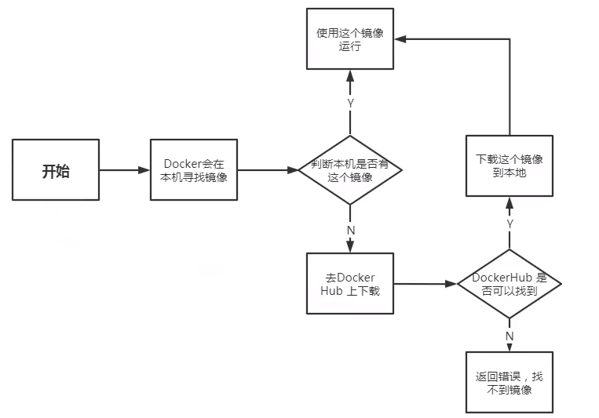

> 端口暴露示意图

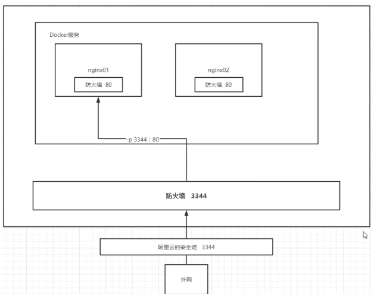

> 容器重启策略

- Docker容器重启策略

Docker容器的重启都是由Docker守护进程完成的，因此与守护进程息息相关，Docker容器的重启策略如下：

no，默认策略，在容器退出时不重启容器
on-failure，在容器非正常退出时（退出状态非0），才会重启容器
on-failure:3，在容器非正常退出时重启容器，最多重启3次
always，在容器退出时总是重启容器
unless-stopped，在容器退出时总是重启容器，但是不考虑在Docker守护进程启动时就已经停止了的容器

- Docker容器的退出状态码：

0，表示正常退出
非0，表示异常退出（退出状态码采用chroot标准）
125，Docker守护进程本身的错误
126，容器启动后，要执行的默认命令无法调用
127，容器启动后，要执行的默认命令不存在
其他命令状态码，容器启动后正常执行命令，退出命令时该命令的返回状态码作为容器的退出状态码

- docker run的--restart选项

通过--restart选项，可以设置容器的重启策略，以决定在容器退出时Docker守护进程是否重启刚刚退出的容器。

- 查看容器详情补充

查看容器重启次数
docker inspect -f "{undefined{ .RestartCount }}" 容器名
查看容器最后一次的启动时间
docker inspect -f "{undefined{ .State.StartedAt }}" 容器名

> 查看容器内存CPU占用情况

```bash
[root@bluecusliyou ~]# docker stats
CONTAINER ID   NAME             CPU %     MEM USAGE / LIMIT     MEM %     NET I/O      BLOCK I/O     PIDS
8ce58b825e76   charming_bassi   0.00%     1.859MiB / 3.507GiB   0.05%     107kB / 0B   2.31MB / 0B   1
4862c3d32d3b   mycentos         0.00%     1.527MiB / 3.507GiB   0.04%     269kB / 0B   7.45MB / 0B   1
bf4bcd3a37ad   nginx_c_v4       0.00%     3.289MiB / 3.507GiB   0.09%     268kB / 0B   11.7MB / 0B   3
a916f1d3c625   nginx_c_v3       0.00%     3.152MiB / 3.507GiB   0.09%     268kB / 0B   4.1kB / 0B    3
2504291aeb98   nginx_c_v2       0.00%     3.051MiB / 3.507GiB   0.08%     268kB / 0B   4.1kB / 0B    3
5a2f59d8b461   nginx_c_v1       0.00%     3.148MiB / 3.507GiB   0.09%     268kB / 0B   4.1kB / 0B    3
09593f4c5c55   nginx_ct1        0.00%     3.148MiB / 3.507GiB   0.09%     268kB / 0B   20.5kB / 0B   3
f5ef981caaca   nginx_cb2        0.00%     3.152MiB / 3.507GiB   0.09%     268kB / 0B   4.1kB / 0B    3
5d5671155661   nginx_cv3        0.00%     3.094MiB / 3.507GiB   0.09%     268kB / 0B   4.1kB / 0B    3
4ed35df5bfa7   nginx_cv2        0.00%     3.188MiB / 3.507GiB   0.09%     268kB / 0B   4.1kB / 0B    3
```

> 限制CPU

`docker run`命令和 CPU 限制相关的所有选项如下：

| 选项                  | 描述                                                    |
| --------------------- | ------------------------------------------------------- |
| `--cpuset-cpus=""`    | 允许使用的 CPU 集，值可以为 0-3,0,1                     |
| `-c`,`--cpu-shares=0` | CPU 共享权值（相对权重）                                |
| `cpu-period=0`        | 限制 CPU CFS 的周期，范围从 100ms~1s，即[1000, 1000000] |
| `--cpu-quota=0`       | 限制 CPU CFS 配额，必须不小于1ms，即 >= 1000            |
| `--cpuset-mems=""`    | 允许在上执行的内存节点（MEMs），只对 NUMA 系统有效      |

- `--cpuset-cpus`用于设置容器可以使用的 vCPU 核。

- `-c`,`--cpu-shares`CPU 资源的相对限制。

默认情况下，所有的容器得到同等比例的 CPU 周期。在有多个容器竞争 CPU 时我们可以设置每个容器能使用的 CPU 时间比例。这个比例叫作共享权值，通过`-c`或`--cpu-shares`设置。Docker 默认每个容器的权值为 1024。不设置或将其设置为 0，都将使用这个默认值。系统会根据每个容器的共享权值和所有容器共享权值和比例来给容器分配 CPU 时间。

- `--cpu-period`和`--cpu-quata`CPU 资源的绝对限制

我们可以设置每个容器进程的调度周期，以及在这个周期内各个容器**最多**能使用多少 CPU 时间。使用`--cpu-period`即可设置调度周期，使用`--cpu-quota`即可设置在每个周期内容器能使用的 CPU 时间。两者配合使用。

CFS 周期的有效范围是 1ms~1s，对应的`--cpu-period`的数值范围是 1000~1000000。而容器的 CPU 配额必须不小于 1ms，即`--cpu-quota`的值必须 >= 1000。可以看出这两个选项的单位都是 us。

```bash
#将CFS调度的周期设为50000，将容器在每个周期内的CPU配额设置为25000，表示该容器每50ms可以得到50%的CPU运行时间。
docker run -it --cpu-period=50000 --cpu-quota=25000 ubuntu:16.04 /bin/bash
```

> 限制内存

`docker run`命令和内存限制相关的所有选项如下：

| 选项                   | 描述                                                         |
| ---------------------- | ------------------------------------------------------------ |
| `-m`,`--memory`        | 内存限制，格式是数字加单位，单位可以为 b,k,m,g。最小为 4M    |
| `--memory-swap`        | 内存+交换分区大小总限制。格式同上。必须必`-m`设置的大        |
| `--memory-reservation` | 内存的软性限制。格式同上                                     |
| `--oom-kill-disable`   | 是否阻止 OOM killer 杀死容器，默认没设置                     |
| `--oom-score-adj`      | 容器被 OOM killer 杀死的优先级，范围是[-1000, 1000]，默认为 0 |
| `--memory-swappiness`  | 用于设置容器的虚拟内存控制行为。值为 0~100 之间的整数        |
| `--kernel-memory`      | 核心内存限制。格式同上，最小为 4M                            |

- 不设置

如果不设置`-m,--memory`和`--memory-swap`，容器默认可以用完宿主机的所有内存和 swap 分区。不过注意，如果容器占用宿主机的所有内存和 swap 分区超过一段时间后，会被宿主机系统杀死（如果没有设置`--00m-kill-disable=true`的话）。

- 设置`-m,--memory`，不设置`--memory-swap`

给`-m`或`--memory`设置一个不小于 4M 的值，假设为 a，不设置`--memory-swap`，或将`--memory-swap`设置为 0。这种情况下，容器能使用的内存大小为 a，能使用的交换分区大小也为 a。因为 Docker 默认容器交换分区的大小和内存相同。如果在容器中运行一个一直不停申请内存的程序，你会观察到该程序最终能占用内存大小为 2a。

比如`$ docker run -m 1G ubuntu:16.04`，该容器能使用的内存大小为 1G，能使用的 swap 分区大小也为 1G。容器内的进程能申请到的总内存大小为 2G。

- 设置`-m,--memory=a`，`--memory-swap=b`，且b > a

给`-m`设置一个参数 a，给`--memory-swap`设置一个参数 b。a 时容器能使用的内存大小，b是容器能使用的 内存大小 + swap 分区大小。所以 b 必须大于 a。b -a 即为容器能使用的 swap 分区大小。

比如`$ docker run -m 1G --memory-swap 3G ubuntu:16.04`，该容器能使用的内存大小为 1G，能使用的 swap 分区大小为 2G。容器内的进程能申请到的总内存大小为 3G。

- 设置`-m,--memory=a`，`--memory-swap=-1`

给`-m`参数设置一个正常值，而给`--memory-swap`设置成 -1。这种情况表示限制容器能使用的内存大小为 a，而不限制容器能使用的 swap 分区大小。时候，容器内进程能申请到的内存大小为 a + 宿主机的 swap 大小。

- Memory reservation 是一种软性机制

它不保证任何时刻容器使用的内存不会超过`--memory-reservation`限定的值，它只是确保容器不会长时间占用超过`--memory-reservation`限制的内存大小。

```bash
#如果容器使用了大于 200M 但小于 500M 内存时，下次系统的内存回收会尝试将容器的内存锁紧到 200M 以下。
docker run -it -m 500M --memory-reservation 200M ubuntu:16.04 /bin/bash
```

> privileged参数

大约在0.6版，privileged被引入docker。使用该参数，container内的root拥有真正的root权限。否则，container内的root只是宿主机的一个普通用户权限。privileged启动的容器，可以看到很多host上的设备，并且可以执行mount，甚至允许你在docker容器中启动docker容器。

```bash
#默认是--privileged=false，不能挂载
[root@bluecusliyou ~]# docker run -t -i centos:latest bash
[root@b29ab618a011 /]# mkdir /home/test/
[root@b29ab618a011 /]# mkdir /home/test2/
[root@b29ab618a011 /]# mount -o bind /home/test  /home/test2
mount: /home/test2: permission denied.
[root@b29ab618a011 /]# exit
exit
#设定了--privileged=true,
[root@bluecusliyou ~]# docker run -t -i --privileged=true centos:latest bash
[root@3238a6df6a3a /]# mkdir /home/test/
[root@3238a6df6a3a /]# mkdir /home/test2/
[root@3238a6df6a3a /]# mount -o bind /home/test  /home/test2
[root@3238a6df6a3a /]# 
```

#### docker ps(列出所有运行的容器)

```bash
[root@bluecusliyou ~]# docker ps --help

Usage:  docker ps [OPTIONS]

List containers

Options:
  -a, --all             Show all containers (default shows just running)
  -f, --filter filter   Filter output based on conditions provided
      --format string   Pretty-print containers using a Go template
  -n, --last int        Show n last created containers (includes all states) (default -1)
  -l, --latest          Show the latest created container (includes all states)
      --no-trunc        Don't truncate output
  -q, --quiet           Only display container IDs
  -s, --size            Display total file sizes  
```

```bash
#显示所有运行容器
[root@bluecusliyou ~]# docker ps
CONTAINER ID   IMAGE     COMMAND                  CREATED          STATUS          PORTS                                   NAMES
e244a095f856   nginx     "/docker-entrypoint.…"   41 seconds ago   Up 40 seconds   0.0.0.0:3344->80/tcp, :::3344->80/tcp   nginx_crun
45f8aca32e8a   centos    "/bin/bash"              2 minutes ago    Up 2 minutes                                            quirky_swirles
#显示所有容器，包括非运行中的容器
[root@bluecusliyou ~]# docker ps -a
CONTAINER ID   IMAGE     COMMAND                  CREATED              STATUS                     PORTS                                   NAMES
e244a095f856   nginx     "/docker-entrypoint.…"   About a minute ago   Up About a minute          0.0.0.0:3344->80/tcp, :::3344->80/tcp   nginx_crun
a36ec2025146   centos    "/bin/bash"              2 minutes ago        Exited (0) 2 minutes ago                                           stupefied_archimedes
45f8aca32e8a   centos    "/bin/bash"              2 minutes ago        Up 2 minutes                                                       quirky_swirles
546e34cebc66   centos    "/bin/bash"              3 minutes ago        Exited (0) 3 minutes ago                                           friendly_ritchie
#显示正在运行的容器包括历史容器ID
[root@bluecusliyou ~]# docker ps -aq
e244a095f856
a36ec2025146
45f8aca32e8a
546e34cebc66
#显示最后一条容器
[root@bluecusliyou ~]# docker ps -l
CONTAINER ID   IMAGE     COMMAND                  CREATED         STATUS         PORTS                                   NAMES
e244a095f856   nginx     "/docker-entrypoint.…"   3 minutes ago   Up 3 minutes   0.0.0.0:3344->80/tcp, :::3344->80/tcp   nginx_crun
#显示最后几条容器
[root@bluecusliyou ~]# docker ps -n 2
CONTAINER ID   IMAGE     COMMAND                  CREATED         STATUS                     PORTS                                   NAMES
e244a095f856   nginx     "/docker-entrypoint.…"   3 minutes ago   Up 3 minutes               0.0.0.0:3344->80/tcp, :::3344->80/tcp   nginx_crun
a36ec2025146   centos    "/bin/bash"              4 minutes ago   Exited (0) 4 minutes ago                                           stupefied_archimedes
```

#### docker exec(进入容器内部)

```bash
[root@bluecusliyou ~]# docker exec --help

Usage:  docker exec [OPTIONS] CONTAINER COMMAND [ARG...]

Run a command in a running container

Options:
  -d, --detach               Detached mode: run command in the background
      --detach-keys string   Override the key sequence for detaching a container
  -e, --env list             Set environment variables
      --env-file list        Read in a file of environment variables
  -i, --interactive          Keep STDIN open even if not attached
      --privileged           Give extended privileges to the command
  -t, --tty                  Allocate a pseudo-TTY
  -u, --user string          Username or UID (format: <name|uid>[:<group|gid>])
  -w, --workdir string       Working directory inside the container
```

```bash
[root@bluecusliyou ~]# docker run -d --name nginx_cexec nginx
0c3cc43e2c77f90dfa00c3782a312057cef1e28bdc28a44b72d42040cfd2263a
[root@bluecusliyou ~]# docker exec -it nginx_cexec /bin/bash
root@0c3cc43e2c77:/# 
```

#### exit/Ctrl + P + Q(退出容器)

进入容器内部执行此命令

```bash
exit           #前台交互式退出容器，容器退出
Ctrl + P + Q   #前台交互式退出容器，容器保持运行
```

```bash
#exit退出容器
[root@bluecusliyou ~]# docker run -it --name centos_cexit centos
[root@3d2494edc773 /]# exit   
exit
#Ctrl+P+Q退出容器
[root@bluecusliyou ~]# docker run -it --name centos_cctlpq centos
[root@a58d1f9c181a /]# 
[root@bluecusliyou ~]# docker ps -n 2
CONTAINER ID   IMAGE     COMMAND       CREATED          STATUS                      PORTS     NAMES
a58d1f9c181a   centos    "/bin/bash"   30 seconds ago   Up 29 seconds                         centos_cctlpq
3d2494edc773   centos    "/bin/bash"   2 minutes ago    Exited (0) 45 seconds ago             centos_cexit
```

#### docker stop start restart kill(启停容器)

```bash
[root@bluecusliyou ~]# docker run -d --name nginx_cqt nginx
8cf831c8c78971f9a40139ba957693e22d9c65912e842c946edfe0154741c118
#停止容器
[root@bluecusliyou ~]# docker stop nginx_cqt
nginx_cqt
#启动容器
[root@bluecusliyou ~]# docker start nginx_cqt
nginx_cqt
#重启容器
[root@bluecusliyou ~]# docker restart nginx_cqt
nginx_cqt
#暂停容器
[root@bluecusliyou ~]# docker pause nginx_cqt
nginx_cqt
#恢复暂停
[root@bluecusliyou ~]# docker unpause nginx_cqt
nginx_cqt
#强制停止容器
[root@bluecusliyou ~]# docker kill nginx_cqt
nginx_cqt
```

#### docker rm(删除容器)

```bash
[root@bluecusliyou ~]# docker rm --help

Usage:  docker rm [OPTIONS] CONTAINER [CONTAINER...]

Remove one or more containers

Options:
  -f, --force     Force the removal of a running container (uses SIGKILL)
  -l, --link      Remove the specified link
  -v, --volumes   Remove anonymous volumes associated with the container
```

```bash
[root@bluecusliyou ~]# docker ps -a
CONTAINER ID   IMAGE     COMMAND                  CREATED          STATUS                            PORTS                                   NAMES
8cf831c8c789   nginx     "/docker-entrypoint.…"   3 minutes ago    Exited (137) About a minute ago                                           nginx_cqt
e244a095f856   nginx     "/docker-entrypoint.…"   9 minutes ago    Up 9 minutes                      0.0.0.0:3344->80/tcp, :::3344->80/tcp   nginx_crun
a36ec2025146   centos    "/bin/bash"              10 minutes ago   Exited (0) 9 minutes ago                                                  stupefied_archimedes
45f8aca32e8a   centos    "/bin/bash"              10 minutes ago   Up 10 minutes                                                             quirky_swirles
546e34cebc66   centos    "/bin/bash"              11 minutes ago   Exited (0) 11 minutes ago                                                 friendly_ritchie
#无法直接删除运行容器
[root@bluecusliyou ~]# docker rm nginx_crun
Error response from daemon: You cannot remove a running container e244a095f8569fcd00da63d939ed1cb382595195ed5da4c22dbb634f5f9197fc. Stop the container before attempting removal or force remove
#删除退出的容器
[root@bluecusliyou ~]# docker rm friendly_ritchie
friendly_ritchie
#-f 强制删除运行中的容器
[root@bluecusliyou ~]# docker rm -f nginx_crun
nginx_crun
#删除多个容器
[root@bluecusliyou ~]# docker rm -f nginx_cqt stupefied_archimedes 
nginx_cqt
stupefied_archimedes
#删除所有容器
[root@bluecusliyou ~]# docker rm -f $(docker ps -aq)
45f8aca32e8a
```

#### docker inspect(查看容器信息)

```bash
[root@bluecusliyou ~]# docker inspect --help

Usage:  docker inspect [OPTIONS] NAME|ID [NAME|ID...]

Return low-level information on Docker objects

Options:
  -f, --format string   Format the output using the given Go template
  -s, --size            Display total file sizes if the type is container
      --type string     Return JSON for specified type

```

```bash
[root@bluecusliyou ~]# docker run -d --name nginx_cinspect nginx
0747a4ca275edbe5fbfc3f6c3009de1cd7f9a9f50314cd2867432c2f52c24537
[root@bluecusliyou ~]# docker inspect nginx_cinspect
[
    {
        ...
        "Config": {
            "Hostname": "0747a4ca275e",
            "Domainname": "",
            "User": "",
            "AttachStdin": false,
            "AttachStdout": false,
            "AttachStderr": false,
            "ExposedPorts": {
                "80/tcp": {}
            },
            "Tty": false,
            "OpenStdin": false,
            "StdinOnce": false,
            "Env": [
                "PATH=/usr/local/sbin:/usr/local/bin:/usr/sbin:/usr/bin:/sbin:/bin",
                "NGINX_VERSION=1.21.5",
                "NJS_VERSION=0.7.1",
                "PKG_RELEASE=1~bullseye"
            ],
            "Cmd": [
                "nginx",
                "-g",
                "daemon off;"
            ],
            "Image": "nginx",
            "Volumes": null,
            "WorkingDir": "",
            "Entrypoint": [
                "/docker-entrypoint.sh"
            ],
            "OnBuild": null,
            "Labels": {
                "maintainer": "NGINX Docker Maintainers <docker-maint@nginx.com>"
            },
            "StopSignal": "SIGQUIT"
        },
        ...
    }
]
```

#### docker logs(查看容器日志)

```bash
[root@bluecusliyou ~]# docker logs --help

Usage:  docker logs [OPTIONS] CONTAINER

Fetch the logs of a container

Options:
      --details        Show extra details provided to logs
  -f, --follow         Follow log output
      --since string   Show logs since timestamp (e.g. 2013-01-02T13:23:37Z) or relative (e.g. 42m for 42 minutes)
  -n, --tail string    Number of lines to show from the end of the logs (default "all")
  -t, --timestamps     Show timestamps
      --until string   Show logs before a timestamp (e.g. 2013-01-02T13:23:37Z) or relative (e.g. 42m for 42 minutes)
```

```bash
#查看容器日志
[root@bluecusliyou ~]# docker run -d --name nginx_clogs nginx
4ea24b83a984a3df63ac98439d7f51ca2b78a6f7544b0aadaaf9742838179681
[root@bluecusliyou ~]# docker logs nginx_clogs
/docker-entrypoint.sh: /docker-entrypoint.d/ is not empty, will attempt to perform configuration
/docker-entrypoint.sh: Looking for shell scripts in /docker-entrypoint.d/
/docker-entrypoint.sh: Launching /docker-entrypoint.d/10-listen-on-ipv6-by-default.sh
10-listen-on-ipv6-by-default.sh: info: Getting the checksum of /etc/nginx/conf.d/default.conf
10-listen-on-ipv6-by-default.sh: info: Enabled listen on IPv6 in /etc/nginx/conf.d/default.conf
/docker-entrypoint.sh: Launching /docker-entrypoint.d/20-envsubst-on-templates.sh
/docker-entrypoint.sh: Launching /docker-entrypoint.d/30-tune-worker-processes.sh
/docker-entrypoint.sh: Configuration complete; ready for start up
2022/01/14 03:29:24 [notice] 1#1: using the "epoll" event method
2022/01/14 03:29:24 [notice] 1#1: nginx/1.21.5
2022/01/14 03:29:24 [notice] 1#1: built by gcc 10.2.1 20210110 (Debian 10.2.1-6) 
2022/01/14 03:29:24 [notice] 1#1: OS: Linux 4.18.0-193.28.1.el8_2.x86_64
2022/01/14 03:29:24 [notice] 1#1: getrlimit(RLIMIT_NOFILE): 1048576:1048576
2022/01/14 03:29:24 [notice] 1#1: start worker processes
2022/01/14 03:29:24 [notice] 1#1: start worker process 31
2022/01/14 03:29:24 [notice] 1#1: start worker process 32
#查看最近20分钟内最近10条日志，并实时监控后续日志
[root@bluecusliyou ~]# docker logs -f --since 20m --tail 10 nginx_clogs
/docker-entrypoint.sh: Launching /docker-entrypoint.d/30-tune-worker-processes.sh
/docker-entrypoint.sh: Configuration complete; ready for start up
2022/01/14 03:29:24 [notice] 1#1: using the "epoll" event method
2022/01/14 03:29:24 [notice] 1#1: nginx/1.21.5
2022/01/14 03:29:24 [notice] 1#1: built by gcc 10.2.1 20210110 (Debian 10.2.1-6) 
2022/01/14 03:29:24 [notice] 1#1: OS: Linux 4.18.0-193.28.1.el8_2.x86_64
2022/01/14 03:29:24 [notice] 1#1: getrlimit(RLIMIT_NOFILE): 1048576:1048576
2022/01/14 03:29:24 [notice] 1#1: start worker processes
2022/01/14 03:29:24 [notice] 1#1: start worker process 31
2022/01/14 03:29:24 [notice] 1#1: start worker process 32
#查询某个时间段内的日志
[root@bluecusliyou ~]# docker logs --since='2022-01-13' --until='2022-01-15' nginx_clogs
/docker-entrypoint.sh: /docker-entrypoint.d/ is not empty, will attempt to perform configuration
/docker-entrypoint.sh: Looking for shell scripts in /docker-entrypoint.d/
/docker-entrypoint.sh: Launching /docker-entrypoint.d/10-listen-on-ipv6-by-default.sh
10-listen-on-ipv6-by-default.sh: info: Getting the checksum of /etc/nginx/conf.d/default.conf
10-listen-on-ipv6-by-default.sh: info: Enabled listen on IPv6 in /etc/nginx/conf.d/default.conf
/docker-entrypoint.sh: Launching /docker-entrypoint.d/20-envsubst-on-templates.sh
/docker-entrypoint.sh: Launching /docker-entrypoint.d/30-tune-worker-processes.sh
/docker-entrypoint.sh: Configuration complete; ready for start up
2022/01/14 03:29:24 [notice] 1#1: using the "epoll" event method
2022/01/14 03:29:24 [notice] 1#1: nginx/1.21.5
2022/01/14 03:29:24 [notice] 1#1: built by gcc 10.2.1 20210110 (Debian 10.2.1-6) 
2022/01/14 03:29:24 [notice] 1#1: OS: Linux 4.18.0-193.28.1.el8_2.x86_64
2022/01/14 03:29:24 [notice] 1#1: getrlimit(RLIMIT_NOFILE): 1048576:1048576
2022/01/14 03:29:24 [notice] 1#1: start worker processes
2022/01/14 03:29:24 [notice] 1#1: start worker process 31
2022/01/14 03:29:24 [notice] 1#1: start worker process 32
```

#### docker top(查看容器中进程信息)

```bash
[root@bluecusliyou ~]# docker top nginx_clogs
UID                 PID                 PPID                C                   STIME               TTY                 TIME                CMD
root                98433               98414               0                   11:29               ?                   00:00:00            nginx: master process nginx -g daemon off;
101                 98505               98433               0                   11:29               ?                   00:00:00            nginx: worker process
101                 98506               98433               0                   11:29               ?                   00:00:00            nginx: worker process
```

#### docker cp(容器主机间拷贝)

```bash
[root@bluecusliyou ~]# docker cp --help

Usage:  docker cp [OPTIONS] CONTAINER:SRC_PATH DEST_PATH|-
        docker cp [OPTIONS] SRC_PATH|- CONTAINER:DEST_PATH

Copy files/folders between a container and the local filesystem

Use '-' as the source to read a tar archive from stdin
and extract it to a directory destination in a container.
Use '-' as the destination to stream a tar archive of a
container source to stdout.

Options:
  -a, --archive       Archive mode (copy all uid/gid information)
  -L, --follow-link   Always follow symbol link in SRC_PATH
```

```bash
#宿主机创建空目录，运行一个容器
[root@bluecusliyou ~]# mkdir -p /home/testfile
[root@bluecusliyou ~]# docker run -d --name nginx_ccp -p 3344:80 nginx
8a8486c624465b389f8f218bb9663d77d8ae14c1529d85243a9a27d5eb8f5720
#容器文件拷贝到宿主机
[root@bluecusliyou ~]# docker cp nginx_ccp:/usr/share/nginx/html/index.html /home/testfile
[root@bluecusliyou ~]# ls /home/testfile
index.html
#宿主机文件拷贝到容器
[root@bluecusliyou ~]# docker cp /home/testfile/index.html nginx_ccp:/usr/share/nginx/html/test.html
[root@bluecusliyou ~]# curl localhost:3344/test.html
<!DOCTYPE html>
<html>
<head>
<title>Welcome to nginx!</title>
<style>
html { color-scheme: light dark; }
body { width: 35em; margin: 0 auto;
font-family: Tahoma, Verdana, Arial, sans-serif; }
</style>
</head>
<body>
<h1>Welcome to nginx!</h1>
<p>If you see this page, the nginx web server is successfully installed and
working. Further configuration is required.</p>

<p>For online documentation and support please refer to
<a href="http://nginx.org/">nginx.org</a>.<br/>
Commercial support is available at
<a href="http://nginx.com/">nginx.com</a>.</p>

<p><em>Thank you for using nginx.</em></p>
</body>
</html>
```

#### docker diff(容器运行后文件发生的变化)

```bash
[root@bluecusliyou ~]# docker diff nginx_ccp
C /var
C /var/cache
C /var/cache/nginx
A /var/cache/nginx/uwsgi_temp
A /var/cache/nginx/client_temp
A /var/cache/nginx/fastcgi_temp
A /var/cache/nginx/proxy_temp
A /var/cache/nginx/scgi_temp
C /usr
C /usr/share
C /usr/share/nginx
C /usr/share/nginx/html
A /usr/share/nginx/html/test.html
C /etc
C /etc/nginx
C /etc/nginx/conf.d
C /etc/nginx/conf.d/default.conf
C /run
A /run/nginx.pid
```

#### docker commit(提交容器成镜像)

```bash
[root@bluecusliyou ~]# docker commit --help

Usage:  docker commit [OPTIONS] CONTAINER [REPOSITORY[:TAG]]

Create a new image from a container's changes

Options:
  -a, --author string    Author (e.g., "John Hannibal Smith <hannibal@a-team.com>")
  -c, --change list      Apply Dockerfile instruction to the created image
  -m, --message string   Commit message
  -p, --pause            Pause container during commit (default true)
```

```bash
[root@bluecusliyou ~]# docker commit nginx_ccp mynginximage
sha256:e902a486acf0bc36ddccec85d5372d96427b04eba12e687bf7d472f39a3193ef
[root@bluecusliyou ~]# docker images mynginximage
REPOSITORY     TAG       IMAGE ID       CREATED          SIZE
mynginximage   latest    e902a486acf0   16 seconds ago   141MB
#运行新镜像的容器，访问成功
[root@bluecusliyou ~]# docker run -d --name nginx_ccommit -p 3355:80 mynginximage
23f76aae87471bd974f650eebb13ac4bb00bb6301ca265c30619770415c159a7
[root@bluecusliyou ~]# curl localhost:3355/test.html
<!DOCTYPE html>
<html>
<head>
<title>Welcome to nginx!</title>
<style>
html { color-scheme: light dark; }
body { width: 35em; margin: 0 auto;
font-family: Tahoma, Verdana, Arial, sans-serif; }
</style>
</head>
<body>
<h1>Welcome to nginx!</h1>
<p>If you see this page, the nginx web server is successfully installed and
working. Further configuration is required.</p>

<p>For online documentation and support please refer to
<a href="http://nginx.org/">nginx.org</a>.<br/>
Commercial support is available at
<a href="http://nginx.com/">nginx.com</a>.</p>

<p><em>Thank you for using nginx.</em></p>
</body>
</html>
```

### 3、镜像命令

```bash
docker images                   			        #查看所有镜像
docker images -a                  			        #查看所有镜像，包括中间层镜像
docker images -aq                                   #查看所有镜像，包括中间层镜像ID
docker images imageName                 	        #查看具体镜像
docker rmi imageid或者imageName                      #删除指定的镜像
docker rmi imageidA imageidB imageidC               #删除指定多个镜像
docker rmi -f imageid或者imageName                   #强制删除指定的镜像
docker rmi -f $(docker images -aq)                  #删除全部的镜像
docker image inspect imageName                      #查看具体镜像详情
docker history imageName                            #查看镜像的创建历史
docker build -f dockerfilepath -t imageName:[tag] . #构建镜像
docker save imageName[:tag] -o 文件                  #导出镜像到文件
docker load -i 文件                                  #导入镜像
```

#### docker images(查看所有本地镜像)

```bash
[root@bluecusliyou ~]# docker images --help

Usage:  docker images [OPTIONS] [REPOSITORY[:TAG]]

List images

Options:
  -a, --all             Show all images (default hides intermediate images)
      --digests         Show digests
  -f, --filter filter   Filter output based on conditions provided
      --format string   Pretty-print images using a Go template
      --no-trunc        Don't truncate output
  -q, --quiet           Only show image IDs
```

```bash
#查看所有镜像
[root@bluecusliyou ~]# docker images
REPOSITORY     TAG       IMAGE ID       CREATED         SIZE
mynginximage   latest    e902a486acf0   5 minutes ago   141MB
nginx          latest    605c77e624dd   2 weeks ago     141MB
redis          latest    7614ae9453d1   3 weeks ago     113MB
centos         latest    5d0da3dc9764   4 months ago    231MB
#查看所有镜像，包括中间层镜像
[root@bluecusliyou ~]# docker images -a
REPOSITORY     TAG       IMAGE ID       CREATED         SIZE
mynginximage   latest    e902a486acf0   5 minutes ago   141MB
nginx          latest    605c77e624dd   2 weeks ago     141MB
redis          latest    7614ae9453d1   3 weeks ago     113MB
centos         latest    5d0da3dc9764   4 months ago    231MB
#查看所有镜像，包括中间层镜像ID
[root@bluecusliyou ~]# docker images -aq
e902a486acf0
605c77e624dd
7614ae9453d1
5d0da3dc9764
#显示具体镜像信息
[root@bluecusliyou ~]# docker images mynginximage
REPOSITORY     TAG       IMAGE ID       CREATED         SIZE
mynginximage   latest    e902a486acf0   7 minutes ago   141MB
```

#### docker rmi(删除镜像)

```bash
[root@bluecusliyou ~]# docker rmi --help

Usage:  docker rmi [OPTIONS] IMAGE [IMAGE...]

Remove one or more images

Options:
  -f, --force      Force removal of the image
      --no-prune   Do not delete untagged parents
```

```bash
#当前容器镜像列表
[root@bluecusliyou ~]# docker ps -a
CONTAINER ID   IMAGE     COMMAND       CREATED       STATUS       PORTS     NAMES
7091ad3c2af0   centos    "/bin/bash"   2 hours ago   Up 2 hours             serene_morse
[root@bluecusliyou ~]# docker images
REPOSITORY   TAG       IMAGE ID       CREATED        SIZE
busybox      latest    beae173ccac6   2 weeks ago    1.24MB
mynginx      latest    605c77e624dd   2 weeks ago    141MB
nginx        latest    605c77e624dd   2 weeks ago    141MB
tomcat       latest    fb5657adc892   3 weeks ago    680MB
wordpress    latest    c3c92cc3dcb1   3 weeks ago    616MB
redis        latest    7614ae9453d1   3 weeks ago    113MB
mysql        latest    3218b38490ce   3 weeks ago    516MB
centos       latest    5d0da3dc9764   4 months ago   231MB
#被容器使用的镜像无法删除，-f可以强制删除，不建议，建议先删除容器再删除镜像
[root@bluecusliyou ~]# docker rmi centos
Error response from daemon: conflict: unable to remove repository reference "centos" (must force) - container 7091ad3c2af0 is using its referenced image 5d0da3dc9764
#被多个镜像引用的镜像ID无法删除，-f可以强制删除，不建议，可以用唯一名称删除
[root@bluecusliyou ~]# docker rmi 605c77e624dd
Error response from daemon: conflict: unable to delete 605c77e624dd (must be forced) - image is referenced in multiple repositories
docker rmi beae173ccac6
#删除1个镜像
[root@bluecusliyou ~]# docker rmi mynginx
Untagged: mynginx:latest
#删除多个镜像
[root@bluecusliyou ~]# docker rmi wordpress busybox
Untagged: wordpress:latest
Untagged: wordpress@sha256:fc33b796b04162a0db2e9ea9b4c361a07058b21597b1317ad9ab3ea4593de241
Deleted: sha256:c3c92cc3dcb1a903fed0374a837f38d716ae104d0e4c9705bddb53a76419534d
Deleted: sha256:e03d610209901c4c643d9787f53e556f3a034ece25b597205d8333db2ff81872
Deleted: sha256:d016493a41b04f201d91ac317b607a0fc2f87a8d825d6dfb6b8dc1bf2fba4efe
Deleted: sha256:7904e413594a78ddb5e5909909e5c37255d7be1ada4b4bf16e33368200ddea2d
Deleted: sha256:291dc2654c9399be32d82521744e650eb3d899d6356856dfd497f180782b76b8
Deleted: sha256:2c7d4e23a0ce5d99dc09041e86f5bcdc2404d703e769189fddc8cc45322bbda9
Deleted: sha256:d3e712f7ab059427794f7f209f448f94fc60dee3e4e40eb82cd99605ab55af3c
Deleted: sha256:10ab8416164c9b2c408ac1317419e9dd113091f6290d33f73cf1cc9c9781fb2b
Deleted: sha256:d61093d47caf389668eb96344afab2454620a5c586b1de3859e17d255a19ba89
Deleted: sha256:3cccde4cd0f42cdd4b0a2c088a88785183e11b4e7c425ff4c4f54326e8e9764b
Deleted: sha256:1053961a55147906b29c3be9c1186d5d9563db08c1e5b63c4e7b286f3dc043f6
Deleted: sha256:1e1b1a779971b332e7e954d0219153cd320cdd27521a15a97da4151ef45e3d7d
Deleted: sha256:682226507754fd5f59ce67ff0801c9df859b106cd5a3db24defb073650cf7fb5
Deleted: sha256:782d3b9de219e51086f1cab57778a10e7a88784008cb8b629e02e173c6683cc1
Deleted: sha256:c3d02f3fbe0afe22bc647345d3d217f2a26133062c1ada547645afdd1243cacc
Deleted: sha256:eec2c2512d15a9611866e4ddf17af2c480009045dbca2a3a22f30becb2050ae2
Deleted: sha256:8c360a4ebc0a45f7de7228d7d4ae497ddcf9c73218c5b4e628188f22cae1c663
Deleted: sha256:ee5205a969dcf1186060d0b8719db08647c3f86ccf33770b83b6ef1c989258e1
Deleted: sha256:6b322a9c05d5df05b87396796502965c8e6212aeb07ced777ed206f660c7a098
Deleted: sha256:c688355f4fe75990c63df6c38a962e3cadfaa0d84c826a920cf2a43fa0975270
Deleted: sha256:895915dadaf75a7370a1817ba4e54f0ee5b329b81aab80a3552736c10b065fc5
Untagged: busybox:latest
Untagged: busybox@sha256:5acba83a746c7608ed544dc1533b87c737a0b0fb730301639a0179f9344b1678
Deleted: sha256:beae173ccac6ad749f76713cf4440fe3d21d1043fe616dfbe30775815d1d0f6a
Deleted: sha256:01fd6df81c8ec7dd24bbbd72342671f41813f992999a3471b9d9cbc44ad88374
#删除所有镜像，被容器使用的镜像是无法删除的
[root@bluecusliyou ~]# docker rmi $(docker images -aq)
Untagged: nginx:latest
Untagged: nginx@sha256:0d17b565c37bcbd895e9d92315a05c1c3c9a29f762b011a10c54a66cd53c9b31
Deleted: sha256:605c77e624ddb75e6110f997c58876baa13f8754486b461117934b24a9dc3a85
Deleted: sha256:b625d8e29573fa369e799ca7c5df8b7a902126d2b7cbeb390af59e4b9e1210c5
Deleted: sha256:7850d382fb05e393e211067c5ca0aada2111fcbe550a90fed04d1c634bd31a14
Deleted: sha256:02b80ac2055edd757a996c3d554e6a8906fd3521e14d1227440afd5163a5f1c4
Deleted: sha256:b92aa5824592ecb46e6d169f8e694a99150ccef01a2aabea7b9c02356cdabe7c
Deleted: sha256:780238f18c540007376dd5e904f583896a69fe620876cabc06977a3af4ba4fb5
Untagged: tomcat:latest
Untagged: tomcat@sha256:9dee185c3b161cdfede1f5e35e8b56ebc9de88ed3a79526939701f3537a52324
Deleted: sha256:fb5657adc892ed15910445588404c798b57f741e9921ff3c1f1abe01dbb56906
Deleted: sha256:2b4d03a9ce5e200223e5c398d4739d23dd19ad0d6e692cfc65ba3a8fae838444
Deleted: sha256:35c5ea12be1face90896b3a52afc28433885c4448a6c5cfe07561f82365cd18e
Deleted: sha256:6830091c111746b7534960d17f6c156be45d8dcfe0defb06bd427ef38bf49aae
Deleted: sha256:ea82d4efcdfa1c039d722a5a9613c18d3c3a84fbba8efae5e7f13cb3b4ec379f
Deleted: sha256:79a6c362c6b1a580d2d8d33f6d860d45c530f34ff7c0441d36b61aceefdfd656
Deleted: sha256:1788a74c5c86e769f61cd615269eba11c3d7648eac4a85a1ffd2840427820a2f
Deleted: sha256:cbce712ed17923285239f9d9c0528984aef065b7413d68a0290e2c8eecc98f4a
Deleted: sha256:aa56d037ee5925ebf11127c3e1f617874c4ce8bae6b6af7d132b7f7a4a606e6f
Deleted: sha256:97e5f44efb543d466c5847602654a8cb22c9466b61d04988d47ec44b197ea874
Deleted: sha256:11936051f93baf5a4fb090a8fa0999309b8173556f7826598e235e8a82127bce
Untagged: redis:latest
Untagged: redis@sha256:db485f2e245b5b3329fdc7eff4eb00f913e09d8feb9ca720788059fdc2ed8339
Deleted: sha256:7614ae9453d1d87e740a2056257a6de7135c84037c367e1fffa92ae922784631
Deleted: sha256:49c70179bc923a7d48583d58e2b6c21bde1787edf42ed1f8de9e9b96e2e88e65
Deleted: sha256:396e06df5d1120368a7a8a4fd1e5467cdc2dd4083660890df078c654596ddc1c
Deleted: sha256:434d118df2e9edb51238f6ba46e9efdfa21be68e88f54787531aa39a720a0740
Deleted: sha256:2047f09c412ff06f4e2ee8a25d105055e714d99000711e27a55072e640796294
Deleted: sha256:13d71c9ccb39b206211dd1900d06aa1984b0f5ab8abaa628c70b3eb733303a65
Deleted: sha256:2edcec3590a4ec7f40cf0743c15d78fb39d8326bc029073b41ef9727da6c851f
Untagged: mysql:latest
Untagged: mysql@sha256:e9027fe4d91c0153429607251656806cc784e914937271037f7738bd5b8e7709
Deleted: sha256:3218b38490cec8d31976a40b92e09d61377359eab878db49f025e5d464367f3b
Deleted: sha256:aa81ca46575069829fe1b3c654d9e8feb43b4373932159fe2cad1ac13524a2f5
Deleted: sha256:0558823b9fbe967ea6d7174999be3cc9250b3423036370dc1a6888168cbd224d
Deleted: sha256:a46013db1d31231a0e1bac7eeda5ad4786dea0b1773927b45f92ea352a6d7ff9
Deleted: sha256:af161a47bb22852e9e3caf39f1dcd590b64bb8fae54315f9c2e7dc35b025e4e3
Deleted: sha256:feff1495e6982a7e91edc59b96ea74fd80e03674d92c7ec8a502b417268822ff
Deleted: sha256:8805862fcb6ef9deb32d4218e9e6377f35fb351a8be7abafdf1da358b2b287ba
Deleted: sha256:872d2f24c4c64a6795e86958fde075a273c35c82815f0a5025cce41edfef50c7
Deleted: sha256:6fdb3143b79e1be7181d32748dd9d4a845056dfe16ee4c827410e0edef5ad3da
Deleted: sha256:b0527c827c82a8f8f37f706fcb86c420819bb7d707a8de7b664b9ca491c96838
Deleted: sha256:75147f61f29796d6528486d8b1f9fb5d122709ea35620f8ffcea0e0ad2ab0cd0
Deleted: sha256:2938c71ddf01643685879bf182b626f0a53b1356138ef73c40496182e84548aa
Deleted: sha256:ad6b69b549193f81b039a1d478bc896f6e460c77c1849a4374ab95f9a3d2cea2
Error response from daemon: conflict: unable to delete 5d0da3dc9764 (cannot be forced) - image is being used by running container 7091ad3c2af0
```

#### docker image inspect(查看镜像详情)

```bash
[root@bluecusliyou ~]# docker image inspect nginx
[
    {
        ...
        "Config": {
            "Hostname": "",
            "Domainname": "",
            "User": "",
            "AttachStdin": false,
            "AttachStdout": false,
            "AttachStderr": false,
            "ExposedPorts": {
                "80/tcp": {}
            },
            "Tty": false,
            "OpenStdin": false,
            "StdinOnce": false,
            "Env": [
                "PATH=/usr/local/sbin:/usr/local/bin:/usr/sbin:/usr/bin:/sbin:/bin",
                "NGINX_VERSION=1.21.5",
                "NJS_VERSION=0.7.1",
                "PKG_RELEASE=1~bullseye"
            ],
            "Cmd": [
                "nginx",
                "-g",
                "daemon off;"
            ],
            "Image": "sha256:82941edee2f4d17c55563bb926387c3ae39fa1a99777f088bc9d3db885192209",
            "Volumes": null,
            "WorkingDir": "",
            "Entrypoint": [
                "/docker-entrypoint.sh"
            ],
            "OnBuild": null,
            "Labels": {
                "maintainer": "NGINX Docker Maintainers <docker-maint@nginx.com>"
            },
            "StopSignal": "SIGQUIT"
        }...
    }
]

```

#### docker history(查看镜像的创建历史)

```bash
[root@bluecusliyou ~]# docker history --help

Usage:  docker history [OPTIONS] IMAGE

Show the history of an image

Options:
      --format string   Pretty-print images using a Go template
  -H, --human           Print sizes and dates in human readable format (default true)
      --no-trunc        Don't truncate output
  -q, --quiet           Only show image IDs
```

```bash
[root@bluecusliyou ~]# docker history nginx
IMAGE          CREATED       CREATED BY                                      SIZE      COMMENT
ea335eea17ab   2 weeks ago   /bin/sh -c #(nop)  CMD ["nginx" "-g" "daemon…   0B        
<missing>      2 weeks ago   /bin/sh -c #(nop)  STOPSIGNAL SIGQUIT           0B        
<missing>      2 weeks ago   /bin/sh -c #(nop)  EXPOSE 80                    0B        
<missing>      2 weeks ago   /bin/sh -c #(nop)  ENTRYPOINT ["/docker-entr…   0B        
<missing>      2 weeks ago   /bin/sh -c #(nop) COPY file:09a214a3e07c919a…   4.61kB    
<missing>      2 weeks ago   /bin/sh -c #(nop) COPY file:0fd5fca330dcd6a7…   1.04kB    
<missing>      2 weeks ago   /bin/sh -c #(nop) COPY file:0b866ff3fc1ef5b0…   1.96kB    
<missing>      2 weeks ago   /bin/sh -c #(nop) COPY file:65504f71f5855ca0…   1.2kB     
<missing>      2 weeks ago   /bin/sh -c set -x     && addgroup --system -…   61.1MB    
<missing>      2 weeks ago   /bin/sh -c #(nop)  ENV PKG_RELEASE=1~bullseye   0B        
<missing>      2 weeks ago   /bin/sh -c #(nop)  ENV NJS_VERSION=0.7.0        0B        
<missing>      2 weeks ago   /bin/sh -c #(nop)  ENV NGINX_VERSION=1.21.4     0B        
<missing>      2 weeks ago   /bin/sh -c #(nop)  LABEL maintainer=NGINX Do…   0B        
<missing>      2 weeks ago   /bin/sh -c #(nop)  CMD ["bash"]                 0B        
<missing>      2 weeks ago   /bin/sh -c #(nop) ADD file:a2405ebb9892d98be…   80.4MB
```

#### docker build(构建镜像)

```bash
# 构建镜像命令，文件在当前目录下且文件名是Dockerfile可以不写-f指定
# 最后的 . 代表本次执行的上下文路径是当前路径，是指 docker 在构建镜像，有时候想要使用到本机的文件（比如复制），docker build 命令得知这个路径后，会将路径下的所有内容打包。
# 上下文路径下不要放无用的文件，因为会一起打包发送给 docker 引擎，如果文件过多会造成过程缓慢。
docker build -f dockerfile文件路径 -t 镜像名:[tag] .
```

```bash
[root@bluecusliyou image-save]# docker build --help

Usage:  docker build [OPTIONS] PATH | URL | -

Build an image from a Dockerfile

Options:
      --add-host list           Add a custom host-to-IP mapping (host:ip)
      --build-arg list          Set build-time variables
      --cache-from strings      Images to consider as cache sources
      --cgroup-parent string    Optional parent cgroup for the container
      --compress                Compress the build context using gzip
      --cpu-period int          Limit the CPU CFS (Completely Fair Scheduler) period
      --cpu-quota int           Limit the CPU CFS (Completely Fair Scheduler) quota
  -c, --cpu-shares int          CPU shares (relative weight)
      --cpuset-cpus string      CPUs in which to allow execution (0-3, 0,1)
      --cpuset-mems string      MEMs in which to allow execution (0-3, 0,1)
      --disable-content-trust   Skip image verification (default true)
  -f, --file string             Name of the Dockerfile (Default is 'PATH/Dockerfile')
      --force-rm                Always remove intermediate containers
      --iidfile string          Write the image ID to the file
      --isolation string        Container isolation technology
      --label list              Set metadata for an image
  -m, --memory bytes            Memory limit
      --memory-swap bytes       Swap limit equal to memory plus swap: '-1' to enable unlimited swap
      --network string          Set the networking mode for the RUN instructions during build (default "default")
      --no-cache                Do not use cache when building the image
      --pull                    Always attempt to pull a newer version of the image
  -q, --quiet                   Suppress the build output and print image ID on success
      --rm                      Remove intermediate containers after a successful build (default true)
      --security-opt strings    Security options
      --shm-size bytes          Size of /dev/shm
  -t, --tag list                Name and optionally a tag in the 'name:tag' format
      --target string           Set the target build stage to build.
      --ulimit ulimit           Ulimit options (default [])
```

```bash
[root@bluecusliyou ~]# cd /home/dockerfile-centos
[root@bluecusliyou dockerfile-centos]# docker images
REPOSITORY   TAG       IMAGE ID       CREATED        SIZE
nginx        latest    605c77e624dd   2 weeks ago    141MB
centos       latest    5d0da3dc9764   4 months ago   231MB
[root@bluecusliyou dockerfile-centos]# cat dockerfile-centos
#基础镜像
FROM centos
#维护者信息
MAINTAINER bluecusliyou<591071179@qq.com>
#镜像操作指令
ENV MYPATH /usr/local
WORKDIR $MYPATH
RUN yum -y install vim
RUN yum -y install net-tools
EXPOSE 80
#容器启动指令
CMD /bin/bash
[root@bluecusliyou dockerfile-centos]# docker build -f dockerfile-centos -t mycentos .
Sending build context to Docker daemon  2.048kB
Step 1/8 : FROM centos
 ---> 5d0da3dc9764
Step 2/8 : MAINTAINER bluecusliyou<591071179@qq.com>
 ---> Using cache
 ---> 2b7855d87917
Step 3/8 : ENV MYPATH /usr/local
 ---> Using cache
 ---> 6c813a2eede5
Step 4/8 : WORKDIR $MYPATH
 ---> Using cache
 ---> a335c187d850
Step 5/8 : RUN yum -y install vim
 ---> Running in c20b66a82ffa
...
Step 6/8 : RUN yum -y install net-tools
 ---> Running in 8a857366fcea
...
Step 7/8 : EXPOSE 80
 ---> Running in 51f042953638
Removing intermediate container 51f042953638
 ---> dd2c2b455a85
Step 8/8 : CMD /bin/bash
 ---> Running in 0c796a08481f
Removing intermediate container 0c796a08481f
 ---> d624390ac077
Successfully built d624390ac077
Successfully tagged mycentos:0.1
[root@bluecusliyou dockerfile-centos]# docker images
REPOSITORY   TAG       IMAGE ID       CREATED          SIZE
mycentos     latest    350c302fa1db   10 seconds ago   326MB
nginx        latest    605c77e624dd   2 weeks ago      141MB
centos       latest    5d0da3dc9764   4 months ago     231MB
#镜像构建完成，运行容器
[root@bluecusliyou dockerfiletest]# docker run -id -P --name mycentos_c1  mycentos:0.1
8571577c0faf59c2f654938975a08fc079c558d04aacad61cd4e2b2c628c6bb2
#查看容器详情
[root@bluecusliyou dockerfile-centos]# docker inspect mycentos:0.1
[
    {
        ...
        "RepoTags": [
            "mycentos:0.1"
        ],
        ...
        "ContainerConfig": {
            ...
            "ExposedPorts": {
                "80/tcp": {}
            },
            ...
            "Env": [
                "PATH=/usr/local/sbin:/usr/local/bin:/usr/sbin:/usr/bin:/sbin:/bin",
                "MYPATH=/usr/local"
            ],
            "Cmd": [
                "/bin/sh",
                "-c",
                "#(nop) ",
                "CMD [\"/bin/sh\" \"-c\" \"/bin/bash\"]"
            ],
            ...
            "WorkingDir": "/usr/local",
            ...
        },
        ...
        "Author": "bluecusliyou<591071179@qq.com>",
        ...
    }
]
#进入容器，查看当前路径，测试vim ping功能
[root@bluecusliyou dockerfile-centos]# docker exec -it mycentos_c1 /bin/bash
[root@8571577c0faf local]# pwd     
/usr/local
[root@8571577c0faf local]# vim testfile
[root@8571577c0faf local]# cat testfile
www
[root@8571577c0faf local]# ping www.baidu.com
PING www.a.shifen.com (110.242.68.3) 56(84) bytes of data.
64 bytes from 110.242.68.3 (110.242.68.3): icmp_seq=1 ttl=49 time=10.7 ms
64 bytes from 110.242.68.3 (110.242.68.3): icmp_seq=2 ttl=49 time=10.7 ms
64 bytes from 110.242.68.3 (110.242.68.3): icmp_seq=3 ttl=49 time=10.6 ms
64 bytes from 110.242.68.3 (110.242.68.3): icmp_seq=4 ttl=49 time=10.6 ms
^C
--- www.a.shifen.com ping statistics ---
4 packets transmitted, 4 received, 0% packet loss, time 3004ms
rtt min/avg/max/mdev = 10.596/10.643/10.703/0.040 ms
[root@8571577c0faf local]# exit
exit
```

#### docker save(导出镜像)

```bash
[root@bluecusliyou image-save]# docker save --help

Usage:  docker save [OPTIONS] IMAGE [IMAGE...]

Save one or more images to a tar archive (streamed to STDOUT by default)

Options:
  -o, --output string   Write to a file, instead of STDOUT
```

```bash
[root@bluecusliyou ~]# docker save nginx -o /home/image-save/nginx.tar
[root@bluecusliyou ~]# ls /home/image-save
nginx.tar
```

#### docker load(导入镜像)

```bash
[root@bluecusliyou image-save]# docker load --help

Usage:  docker load [OPTIONS]

Load an image from a tar archive or STDIN

Options:
  -i, --input string   Read from tar archive file, instead of STDIN
  -q, --quiet          Suppress the load output
```

```bash
#先删除镜像，再导入镜像
[root@bluecusliyou ~]# docker rmi nginx
Untagged: nginx:latest
Untagged: nginx@sha256:0d17b565c37bcbd895e9d92315a05c1c3c9a29f762b011a10c54a66cd53c9b31
[root@bluecusliyou ~]# docker images
REPOSITORY   TAG       IMAGE ID       CREATED         SIZE
mycentos     latest    b789bea5f17f   4 minutes ago   326MB
newnginx     latest    605c77e624dd   10 days ago     141MB
centos       latest    5d0da3dc9764   3 months ago    231MB
[root@bluecusliyou ~]# docker load -i /home/image-save/nginx.tar
Loaded image: nginx:latest
[root@bluecusliyou ~]# docker images
REPOSITORY   TAG       IMAGE ID       CREATED         SIZE
mycentos     latest    b789bea5f17f   5 minutes ago   326MB
newnginx     latest    605c77e624dd   10 days ago     141MB
nginx        latest    605c77e624dd   10 days ago     141MB
centos       latest    5d0da3dc9764   3 months ago    231MB
```

### 4、仓库命令

```bash
docker login [仓库host:port]                         #登录仓库,dockerhub可以不写[仓库host:port] 
docker logout [仓库host:port]                        #登出仓库,dockerhub可以不写[仓库host:port] 
docker search imageName         		            #搜索镜像
docker tag sourceImage[:tag] targetImage[:tag]      #给镜像打标签
docker pull   imageName[:tag]                       #下载镜像,不加tag就是latest
docker push   imageName[:tag]                       #推送镜像到仓库
```

#### docker login（登录仓库）

只有dockerhub的[仓库host:port]（index.docker.io）是可以省略的，其他私有仓库必须写上。

登录信息可以在文件中查看/root/.docker/config.json。

私有仓库登录后能上传拉取，不登录不能上传拉取。公有仓库，登录可以上传拉取，不登录只能拉取不能上传。

```bash
[root@bluecusliyou ~]# docker login --help

Usage:  docker login [OPTIONS] [SERVER]

Log in to a Docker registry.
If no server is specified, the default is defined by the daemon.

Options:
  -p, --password string   Password
      --password-stdin    Take the password from stdin
  -u, --username string   Username
```

```bash
[root@bluecusliyou ~]# docker login
Login with your Docker ID to push and pull images from Docker Hub. If you don't have a Docker ID, head over to https://hub.docker.com to create one.
Username: bluecusliyou
Password: 
WARNING! Your password will be stored unencrypted in /root/.docker/config.json.
Configure a credential helper to remove this warning. See
https://docs.docker.com/engine/reference/commandline/login/#credentials-store

Login Succeeded

[root@bluecusliyou ~]# cat /root/.docker/config.json
{
        "auths": {
                "https://index.docker.io/v1/": {
                        "auth": "Ymx1ZWN1c2xpeW91OmxpeW91QGRvY2tlckBxNTkuY29t"
                }
        }
}
```

#### docker logout(登出仓库)

```bash
[root@blueculiyou ~]# docker logout --help

Usage:  docker logout [SERVER]

Log out from a Docker registry.
If no server is specified, the default is defined by the daemon.
```

```bash
[root@bluecusliyou ~]# docker logout
Removing login credentials for https://index.docker.io/v1/
```

#### docker search(查找镜像)

```bash
[root@bluecusliyou ~]# docker search --help

Usage:  docker search [OPTIONS] TERM

Search the Docker Hub for images

Options:
  -f, --filter filter   Filter output based on conditions provided
      --format string   Pretty-print search using a Go template
      --limit int       Max number of search results (default 25)
      --no-trunc        Don't truncate output
```

```bash
# 显示前5条匹配项镜像
[root@bluecusliyou ~]# docker search --limit 5 mysql
NAME                              DESCRIPTION                                     STARS     OFFICIAL   AUTOMATED
mysql                             MySQL is a widely used, open-source relation…   11753     [OK]       
mysql/mysql-server                Optimized MySQL Server Docker images. Create…   878                  [OK]
mysql/mysql-cluster               Experimental MySQL Cluster Docker images. Cr…   89                   
schickling/mysql-backup-s3        Backup MySQL to S3 (supports periodic backup…   31                   [OK]
ansibleplaybookbundle/mysql-apb   An APB which deploys RHSCL MySQL                3                    [OK]
#搜索STARS > 800 以上的镜像
[root@bluecusliyou ~]# docker search --filter=STARS=800 mysql
NAME                 DESCRIPTION                                     STARS     OFFICIAL   AUTOMATED
mysql                MySQL is a widely used, open-source relation…   11753     [OK]       
mariadb              MariaDB Server is a high performing open sou…   4482      [OK]       
mysql/mysql-server   Optimized MySQL Server Docker images. Create…   878                  [OK]
```

#### docker tag(给镜像打标签)

打标签主要是让镜像可以上传不同仓库用的

```bash
[root@bluecusliyou ~]# docker tag --help

Usage:  docker tag SOURCE_IMAGE[:TAG] TARGET_IMAGE[:TAG]

Create a tag TARGET_IMAGE that refers to SOURCE_IMAGE
```

```bash
#打完标签的新的镜像还是指向原来的镜像的
[root@bluecusliyou ~]# docker tag nginx mynginx
[root@bluecusliyou ~]# docker images
REPOSITORY   TAG       IMAGE ID       CREATED              SIZE
mycentos     latest    350c302fa1db   About a minute ago   326MB
nginx        latest    605c77e624dd   2 weeks ago          141MB
mynginx      latest    605c77e624dd   2 weeks ago          141MB
centos       latest    5d0da3dc9764   4 months ago         231MB
```

#### docker pull(拉取镜像)

```bash
[root@bluecusliyou ~]# docker pull --help

Usage:  docker pull [OPTIONS] NAME[:TAG|@DIGEST]

Pull an image or a repository from a registry

Options:
  -a, --all-tags                Download all tagged images in the repository
      --disable-content-trust   Skip image verification (default true)
      --platform string         Set platform if server is multi-platform capable
  -q, --quiet                   Suppress verbose output
```

```bash
#如果不写tag，默认就是latest
[root@bluecusliyou ~]# docker pull redis
Using default tag: latest
latest: Pulling from library/redis
#分层下载： docker image 的核心 联合文件系统
eff15d958d66: Pull complete 
1aca8391092b: Pull complete 
06e460b3ba1b: Pull complete 
def49df025c0: Pull complete 
646c72a19e83: Pull complete 
db2c789841df: Pull complete 
# 签名 防伪
Digest: sha256:619af14d3a95c30759a1978da1b2ce375504f1af70ff9eea2a8e35febc45d747
Status: Downloaded newer image for redis:latest
#真实地址  docker pull redis等价于  docker pull docker.io/library/redis:latest
docker.io/library/redis:latest
#下载镜像 带版本号
[root@bluecusliyou ~]# docker pull redis:6
6: Pulling from library/redis
Digest: sha256:619af14d3a95c30759a1978da1b2ce375504f1af70ff9eea2a8e35febc45d747
Status: Downloaded newer image for redis:6
docker.io/library/redis:6
```

#### docker push(上传镜像到仓库)

```bash
[root@bluecusliyou ~]# docker push --help

Usage:  docker push [OPTIONS] NAME[:TAG]

Push an image or a repository to a registry

Options:
  -a, --all-tags                Push all tagged images in the repository
      --disable-content-trust   Skip image signing (default true)
  -q, --quiet                   Suppress verbose output
```

```bash
[root@bluecusliyou ~]# docker tag nginx bluecusliyou/mynginx:0.1
[root@bluecusliyou ~]# docker push bluecusliyou/mynginx:0.1
The push refers to repository [docker.io/bluecusliyou/mynginx]
d874fd2bc83b: Mounted from library/nginx 
32ce5f6a5106: Mounted from library/nginx 
f1db227348d0: Mounted from library/nginx 
b8d6e692a25e: Mounted from library/nginx 
e379e8aedd4d: Mounted from library/nginx 
2edcec3590a4: Mounted from bluecusliyou/myredis 
0.1: digest: sha256:ee89b00528ff4f02f2405e4ee221743ebc3f8e8dd0bfd5c4c20a2fa2aaa7ede3 size: 1570
```

## 五、Docker数据卷

### 1、数据挂载简介

在Docker中，容器的数据读写默认发生在容器的存储层，当容器被删除时，容器中的数据将会丢失。如果想实现数据的持久化，就需要将容器和宿主机建立联系（将数据从宿主机挂载到容器中），通俗的说，数据卷就是在容器和宿主机之间实现数据共享。

数据卷是宿主机(linux主机)中的一个目录或文件，当容器目录和数据卷目录绑定后，对方的修改会立即同步。可以不需要进入容器内部，就可以查看所需要的容器中的数据。

一个数据卷可以被多个容器同时挂载，一个容器也可以被挂载多个数据卷。

### 2、三种数据挂载方式

**volume：**挂载宿主机文件系统的固定位置（`/var/lib/docker/volumes/卷名/_data`）。

**bind mounts：**挂载宿主机系统的任意位置。

**tmpfs mounts：**挂载存储在宿主机系统的内存中，不会写入宿主机的文件系统。容器关闭重启数据丢失。

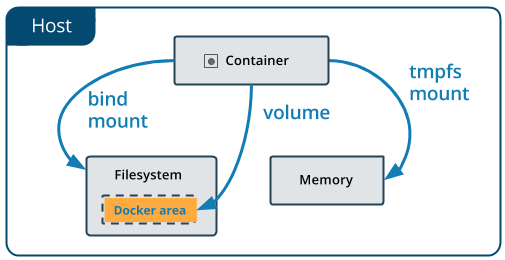

### 3、三种挂载方式适用场景

#### （1）volume（固定目录数据卷挂载）

- 容器之间共享数据

#### （2）bind mounts（自定义目录挂载）

- 主机与容器共享数据


#### （3）tmpfs mounts（内存挂载）

- 既不想将数据存于主机，又不想存于容器中时（这可以是出于安全的考虑，或当应用需要写大量非持久性的状态数据时为了保护容器的性能）。

### 4、挂载方式命令详解

```bash
#卷管理命令说明
[root@bluecusliyou _data]# docker volume --help

Usage:  docker volume COMMAND

Manage volumes

Commands:
  create      Create a volume
  inspect     Display detailed information on one or more volumes
  ls          List volumes
  prune       Remove all unused local volumes
  rm          Remove one or more volumes
```

```bash
#volume 管理
docker volume ls            #列出所有卷
docker volume create 卷名    #创建卷
docker volume inspect 卷名   #查看卷详细信息
docker volume rm 卷名1 卷名2  #删除卷
docker volume prune          #删除未被使用的卷，容器停止的占用的卷也不会删除

#volume mounts（固定目录数据卷挂载）
docker run --mount [type=volume,]source=卷名,target=容器文件夹 镜像名

#bind mounts（自定义目录挂载）
docker run --mount type=bind,source=宿主机文件夹,target=容器内文件夹 镜像名

#tmpfs mounts（内存挂载）
docker run --mount type=tmpfs,target=容器内文件夹 镜像名
```

#### （1）volume（固定目录数据卷挂载）

- volume可以通过`docker volume`命令集被管理，创建的卷就是宿主机的固定文件夹`/var/lib/docker/volumes/卷名/_data`
- 手动创建卷，卷文件夹为空，挂载到容器，容器文件夹覆盖卷文件夹。
- 手动创建卷，卷文件夹不为空，挂载到容器，卷文件夹覆盖容器文件夹。
- 不存在的卷会自动创建，容器文件夹覆盖卷文件夹。

> 查看卷列表，创建volume数据卷，查看卷信息，查看卷详情，查看卷文件夹没有文件

```bash
#查看当前所有数据卷信息
#一大堆名字为很长字符的数据卷为匿名数据卷，是因为-v没有指定卷名，Docker就会自动创建匿名数据卷
[root@bluecusliyou ~]# docker volume ls
DRIVER    VOLUME NAME
#创建volume数据卷
[root@bluecusliyou ~]# docker volume create nginx_v1
nginx_v1
#查看卷信息
[root@bluecusliyou ~]# docker volume inspect nginx_v1
[
    {
        "CreatedAt": "2021-12-03T15:28:04+08:00",
        "Driver": "local",
        "Labels": {},
        "Mountpoint": "/var/lib/docker/volumes/nginx_v1/_data",
        "Name": "nginx_v1",
        "Options": {},
        "Scope": "local"
    }
]
#查看卷文件夹没有文件
[root@bluecusliyou ~]# cd /var/lib/docker/volumes/nginx_v1/_data
[root@bluecusliyou _data]# ls
```

> 手动创建卷，卷文件夹为空，挂载到容器，容器文件夹覆盖卷文件夹。

```bash
#运行容器挂载到卷
[root@bluecusliyou _data]#docker run -d -p 8561:80 --name nginx_cv1 --mount source=nginx_v1,target=/usr/share/nginx/html nginx
e8158f0887ec6f515b8ca0a752c30c99fc1ac3323fd47a32c45a83bfff9c621d
#查看容器卷信息
[root@bluecusliyou _data]# docker inspect nginx_cv1
[
    {
        ...
             "Mounts": [
            {
                "Type": "volume",
                "Name": "nginx_v1",
                "Source": "/var/lib/docker/volumes/nginx_v1/_data",
                "Destination": "/usr/share/nginx/html",
                "Driver": "local",
                "Mode": "z",
                "RW": true,
                "Propagation": ""
            }
        ]
        ...
    }
]
#查看卷文件夹，容器目录文件挂载出来了
[root@bluecusliyou _data]# ls
50x.html  index.html
```
> 卷里面添加文件，进入容器查看，容器文件夹也能看到该文件，且可以访问成功

```bash
#卷里面添加文件
[root@bluecusliyou _data]# echo v1test>>test.html
[root@bluecusliyou _data]# ls
50x.html  index.html  test.html
#进入容器查看，容器文件夹也添加了该文件
[root@bluecusliyou _data]# docker exec -it nginx_cv1 /bin/bash
root@c601ab5eb057:/# cd /usr/share/nginx/html
root@c601ab5eb057:/usr/share/nginx/html# ls
50x.html  index.html  test.html
root@c601ab5eb057:/usr/share/nginx/html# read escape sequence
#访问成功
[root@bluecusliyou _data]# curl localhost:8561/test.html
v1test
```

> 关闭删除容器，宿主机文件夹文件依然存在，持久化成功

```bash
#关闭容器，文件依然在卷里
[root@bluecusliyou _data]# docker stop nginx_cv1
nginx_cv1
[root@bluecusliyou _data]# ls
50x.html  index.html  test.html
#删除容器，文件依然在卷里
[root@bluecusliyou _data]# docker rm -f nginx_cv1
nginx_cv1
[root@bluecusliyou _data]# ls
50x.html  index.html  test.html
```

> 手动创建卷，卷文件夹不为空，挂载到容器，卷文件夹覆盖容器文件夹。

```bash
#运行容器挂载到卷
[root@bluecusliyou _data]# docker run -d -p 8562:80 --name nginx_cv2 --mount source=nginx_v1,target=/usr/share/nginx/html nginx
4ed35df5bfa7f6a7a897e453fe284c0f6b918cce2aa7853d10d00616194bc9d2
#测试文件还在
[root@bluecusliyou _data]# ls
50x.html  index.html  test.html
#访问测试文件成功
[root@bluecusliyou _data]# curl localhost:8562/test.html
v1test
```

> 不创建卷，直接挂载不存在的卷到容器，会自动创建卷，容器文件夹覆盖卷文件夹。

```bash
#查看当前的所有卷
[root@bluecusliyou _data]# docker volume ls
DRIVER    VOLUME NAME
local     nginx_v1
#运行容器，挂载未创建的卷，自动创建卷
[root@bluecusliyou _data]# docker run -d -p 8563:80 --name nginx_cv3 --mount source=nginx_v3,target=/usr/share/nginx/html nginx
5d5671155661b165085a65f26d674ca91d9cdf84d90b34fcf074a15362a0eb87
[root@bluecusliyou _data]# docker volume ls
DRIVER    VOLUME NAME
local     nginx_v1
local     nginx_v3
#查看卷信息，卷文件夹，容器文件夹覆盖卷文件夹
[root@bluecusliyou _data]# docker volume inspect nginx_v3
[
    {
        "CreatedAt": "2022-01-08T19:59:23+08:00",
        "Driver": "local",
        "Labels": null,
        "Mountpoint": "/var/lib/docker/volumes/nginx_v3/_data",
        "Name": "nginx_v3",
        "Options": null,
        "Scope": "local"
    }
]
[root@bluecusliyou _data]# cd /var/lib/docker/volumes/nginx_v3/_data
[root@bluecusliyou _data]# ls
50x.html  index.html
```

#### （2）bind mounts（自定义目录挂载）

- 运行容器挂载宿主机文件夹，宿主机文件夹不存在报错

- 宿主机文件夹为空，运行容器挂载宿主机文件夹，宿主机文件夹覆盖容器文件夹
- 宿主机文件夹非空，运行容器挂载宿主机文件夹，宿主机文件夹覆盖容器文件夹

> 运行容器挂载宿主机文件夹，宿主机文件夹不存在报错

```bash
[root@bluecusliyou _data]# docker run -d -p 8571:80 --name nginx_cb1 --mount type=bind,source=/var/lib/mydocker/nginx_b1,target=/usr/share/nginx/html nginx
docker: Error response from daemon: invalid mount config for type "bind": bind source path does not exist: /var/lib/mydocker/nginx_b1.
See 'docker run --help'.
```

> 宿主机文件夹为空，运行容器挂载宿主机文件夹，宿主机文件夹覆盖容器文件夹

```bash
#创建宿主机文件夹
[root@bluecusliyou _data]# cd /var/lib
[root@bluecusliyou lib]# mkdir -p mydocker/nginx_b1
#运行容器挂载宿主机文件夹
[root@bluecusliyou lib]# docker run -d -p 8571:80 --name nginx_cb1 --mount type=bind,source=/var/lib/mydocker/nginx_b1,target=/usr/share/nginx/html nginx
53d66a64ba1dea4b6ba3c17230cd2e73d09b0820c697c0a47cf00cc943d091dd
#查看容器挂载信息，类型bind
[root@bluecusliyou lib]# docker inspect nginx_cb1
[
    {
        ...
        "Mounts": [
            {
                "Type": "bind",
                "Source": "/var/lib/mydocker/nginx_b1",
                "Destination": "/usr/share/nginx/html",
                "Mode": "",
                "RW": true,
                "Propagation": "rprivate"
            }
        ]
        ...
    }
]
#查看宿主机文件夹，文件还是空
[root@bluecusliyou lib]# cd /var/lib/mydocker/nginx_b1
[root@bluecusliyou nginx_b1]# ls
#进入容器，查看文件为空，被宿主机覆盖
[root@bluecusliyou nginx_b1]# docker exec -it nginx_cb1 /bin/bash
root@53d66a64ba1d:/# cd /usr/share/nginx/html
root@53d66a64ba1d:/usr/share/nginx/html# ls
root@53d66a64ba1d:/usr/share/nginx/html# read escape sequence
```

> 宿主机文件夹添加文件，进入容器查看，容器文件夹也能看到该文件，且可以访问成功

```bash
#宿主机文件夹添加文件文件
[root@bluecusliyou nginx_b1]# echo b1test>>test.html
[root@bluecusliyou nginx_b1]# ls
test.html
#进入容器查看，容器文件夹也能看到该文件，且可以访问成功
[root@bluecusliyou nginx_b1]# docker exec -it nginx_cb1 /bin/bash
root@53d66a64ba1d:/# cd /usr/share/nginx/html
root@53d66a64ba1d:/usr/share/nginx/html# ls
test.html
root@53d66a64ba1d:/usr/share/nginx/html# read escape sequence
[root@bluecusliyou nginx_b1]# curl localhost:8571/test.html
b1test
```

> 关闭删除容器，宿主机文件夹文件依然存在，持久化成功

```bash
#关闭容器，宿主机文件夹文件依然存在
[root@bluecusliyou nginx_b1]# docker stop nginx_cb1
nginx_cb1
[root@bluecusliyou nginx_b1]# ls
test.html
#删除容器，文件依然在卷里
[root@bluecusliyou nginx_b1]# docker rm -f nginx_cb1
nginx_cb1
[root@bluecusliyou nginx_b1]# ls
test.html
```

> 宿主机文件夹非空，运行容器挂载宿主机文件夹，宿主机文件夹覆盖容器文件夹

```bash
#运行容器挂载宿主机文件夹
[root@bluecusliyou nginx_b1]# docker run -d -p 8572:80 --name=nginx_cb2  --mount type=bind,source=/var/lib/mydocker/nginx_b1,target=/usr/share/nginx/html nginx
f5ef981caaca239ae14a261595ec26b99ea6a30e7dd5778330d23e940101a72a
#宿主机文件还在,访问成功ls
[root@bluecusliyou nginx_b1]# ls
test.html
[root@bluecusliyou nginx_b1]# curl localhost:8572/test.html
b1test
```

#### （3）tmpfs mounts（内存挂载）

> 挂载到宿主机内存，容器文件夹文件被覆盖掉了

```bash
#创建容器
[root@bluecusliyou nginx_v3]# docker run -d -p 8581:80 --name=nginx_ct1 --mount type=tmpfs,target=/usr/share/nginx/html nginx
6031e0ffc52d876a789c05473434e787641a14d84580fe74eac0df97b6212b07
#查看容器挂载详情
[root@bluecusliyou nginx_v3]# docker inspect nginx_ct1
[
    {
        ...
        "Mounts": [
            {
                "Type": "tmpfs",
                "Source": "",
                "Destination": "/usr/share/nginx/html",
                "Mode": "",
                "RW": true,
                "Propagation": ""
            }
        ]
        ...
    }
]
#进入容器，添加测试文件，访问成功
[root@bluecusliyou nginx_b1]# docker exec -it nginx_ct1 /bin/bash
root@09593f4c5c55:/# cd /usr/share/nginx/html 
root@09593f4c5c55:/usr/share/nginx/html# echo tmpfstest>test.html
root@09593f4c5c55:/usr/share/nginx/html# ls
test.html
root@09593f4c5c55:/usr/share/nginx/html# read escape sequence
[root@bluecusliyou nginx_b1]# curl localhost:8581/test.html
tmpfstest
```

> 停止容器再启动，重新访问失败，文件无法持久化

```bash
#停止容器再启动，重新访问失败，文件无法持久化
[root@bluecusliyou nginx_b1]# docker stop nginx_ct1
nginx_ct1
[root@bluecusliyou nginx_b1]# docker start nginx_ct1
nginx_ct1
[root@bluecusliyou nginx_b1]# curl localhost:8581/test.html
<html>
<head><title>404 Not Found</title></head>
<body>
<center><h1>404 Not Found</h1></center>
<hr><center>nginx/1.21.5</center>
</body>
</html>
```

### 5、-v灵活的挂载方式

-v 等价于 --volume，可以实现三种类型的挂载，匿名挂载、具名挂载、指定路径挂载 。

```bash
docker run -v 容器内目录  镜像名             #匿名挂载，volume类型
docker run -v 卷名:容器内目录 镜像名          #具名挂载，volume类型
docker run -v 宿主机路径：容器内路径 镜像名    #指定路径挂载，bind类型
```

#### （1）匿名挂载，volume类型

- docker run -v 容器内目录  镜像名

- 自动创建卷，容器文件夹覆盖宿主机文件夹

> 自动创建卷，容器文件夹覆盖宿主机文件夹

```bash
#查看已有的卷
[root@bluecusliyou nginx_b1]# docker volume ls
DRIVER    VOLUME NAME
local     nginx_v1
local     nginx_v3
#运行容器，-v匿名挂载
[root@bluecusliyou nginx_b1]# docker run -d --name nginx_c_v1 -p 8591:80 -v /usr/share/nginx/html nginx
5a2f59d8b4619e229ca4aeed31c15d98b9da0e54a666790c2a7f556d64f7b7b0
#自动生成新的卷
[root@bluecusliyou nginx_b1]# docker volume ls
DRIVER    VOLUME NAME
local     25e37107425180f45d3ea8182ee738eb4e7434717bf0f4d7ef05aeef4ecb2c04
local     nginx_v1
local     nginx_v3
#查看容器详情，类型volume
[root@bluecusliyou nginx_b1]# docker inspect nginx_c_v1
[
    {        
        ...
        "Mounts": [
            {
                "Type": "volume",
                "Name": "25e37107425180f45d3ea8182ee738eb4e7434717bf0f4d7ef05aeef4ecb2c04",
                "Source": "/var/lib/docker/volumes/25e37107425180f45d3ea8182ee738eb4e7434717bf0f4d7ef05aeef4ecb2c04/_data",
                "Destination": "/usr/share/nginx/html",
                "Driver": "local",
                "Mode": "",
                "RW": true,
                "Propagation": ""
            }
        ]
    }
]
#进入卷文件夹，容器文件夹覆盖宿主机文件夹
[root@bluecusliyou nginx_b1]# cd /var/lib/docker/volumes/25e37107425180f45d3ea8182ee738eb4e7434717bf0f4d7ef05aeef4ecb2c04/_data
[root@bluecusliyou _data]# ls
50x.html  index.html
```

#### （2）具名挂载，volume类型

- docker run -v 卷名:容器内目录 镜像名
- 手动创建卷，宿主机文件夹为空，容器文件夹覆盖宿主机文件夹
- 手动创建卷，宿主机文件夹非空，宿主机文件夹覆盖容器文件夹
- 不存在的卷会自动创建，容器文件夹覆盖宿主机文件夹

> 手动创建卷，宿主机文件夹为空，容器文件夹覆盖宿主机文件夹

```bash
#创建新卷
[root@bluecusliyou _data]# docker volume create nginx_v_v2
nginx_v_v2
[root@bluecusliyou _data]# docker volume ls
DRIVER    VOLUME NAME
local     25e37107425180f45d3ea8182ee738eb4e7434717bf0f4d7ef05aeef4ecb2c04
local     nginx_v1
local     nginx_v3
local     nginx_v_v2
#运行容器,-v 具名挂载
[root@bluecusliyou _data]# docker run -d --name nginx_c_v2 -p 8592:80 -v nginx_v_v2:/usr/share/nginx/html nginx
7697a36778b7503028401eb8e175330353577c3b220bdab72936f1bdeff89fcf
#查看容器详情
[root@bluecusliyou _data]# docker inspect nginx_c_v2
[
    {        
        "Mounts": [
            {
                "Type": "volume",
                "Name": "nginx_v_v2",
                "Source": "/var/lib/docker/volumes/nginx_v_v2/_data",
                "Destination": "/usr/share/nginx/html",
                "Driver": "local",
                "Mode": "z",
                "RW": true,
                "Propagation": ""
            }
        ]
    }
]
[root@bluecusliyou _data]# cd /var/lib/docker/volumes/nginx_v_v2/_data
[root@bluecusliyou _data]# ls
50x.html  index.html
```

> 手动创建卷，宿主机文件夹非空，宿主机文件夹覆盖容器文件夹

```bash
#文件夹添加测试文件
[root@bluecusliyou _data]# echo -vtest>>test.html
[root@bluecusliyou _data]# ls
50x.html  index.html  test.html
#运行容器,-v 具名挂载
[root@bluecusliyou _data]# docker run -d --name nginx_c_v3 -p 8593:80 -v nginx_v_v2:/usr/share/nginx/html nginx
a916f1d3c625bb49e6591fb04e44372059d8131ce6ce4cdd406c30a89b314cdf
#宿主机文件夹覆盖容器文件夹
[root@bluecusliyou _data]# ls
50x.html  index.html  test.html
```

> 不存在的卷会自动创建，容器文件夹覆盖宿主机文件夹

```bash
#查看现有卷
[root@bluecusliyou _data]# docker volume ls
DRIVER    VOLUME NAME
local     25e37107425180f45d3ea8182ee738eb4e7434717bf0f4d7ef05aeef4ecb2c04
local     nginx_v1
local     nginx_v3
local     nginx_v_v2
#运行容器,-v 具名挂载，卷不存在，自动创建成功
[root@bluecusliyou _data]# docker run -d --name nginx_c_v4 -p 8594:80 -v nginx_v_v4:/usr/share/nginx/html nginx
bf4bcd3a37adaab8ad6d342088bc47297ff533b4e8a069e11b296f0d55d3f49
[root@bluecusliyou _data]# docker volume ls
DRIVER    VOLUME NAME
local     25e37107425180f45d3ea8182ee738eb4e7434717bf0f4d7ef05aeef4ecb2c04
local     nginx_v1
local     nginx_v3
local     nginx_v_v2
local     nginx_v_v4
#容器文件夹覆盖宿主机文件夹
[root@bluecusliyou _data]# docker volume inspect nginx_v_v4
[
    {
        "CreatedAt": "2022-01-08T23:08:49+08:00",
        "Driver": "local",
        "Labels": null,
        "Mountpoint": "/var/lib/docker/volumes/nginx_v_v4/_data",
        "Name": "nginx_v_v4",
        "Options": null,
        "Scope": "local"
    }
]
[root@bluecusliyou _data]# cd /var/lib/docker/volumes/nginx_v_v4/_data
[root@bluecusliyou _data]# ls
50x.html  index.html
```

#### （3）指定路径挂载，bind类型

- docker run -v 宿主机路径：容器内路径 镜像名
- 创建宿主机文件夹，宿主机文件夹为空，宿主机文件夹覆盖容器文件夹
- 创建宿主机文件夹，宿主机文件夹非空，宿主机文件夹覆盖容器文件夹
- 不创建宿主机文件夹，自动创建空文件夹，宿主机文件夹覆盖容器文件夹

> 创建宿主机文件夹，宿主机文件夹为空，宿主机文件夹覆盖容器文件夹

```bash
[root@bluecusliyou ~]# cd /var/lib/mydocker
[root@bluecusliyou mydocker]# ls
nginx_b1  nginx_crun
[root@bluecusliyou mydocker]# mkdir nginx_v_b1
[root@bluecusliyou mydocker]# ls
nginx_b1  nginx_crun  nginx_v_b1
[root@bluecusliyou mydocker]# docker run -d --name nginx_c_b1 -p 8601:80 -v /var/lib/mydocker/nginx_v_b1:/usr/share/nginx/html nginx
fe489f13bf5a94fdbe9a0593a2eb26e97f350a19ba152f7c1bae4880e495ecd9
[root@bluecusliyou mydocker]# ls /var/lib/mydocker/nginx_v_b1
[root@bluecusliyou mydocker]# 
```

> 创建宿主机文件夹，宿主机文件夹非空，宿主机文件夹覆盖容器文件夹

```bash
[root@bluecusliyou mydocker]# echo test>/var/lib/mydocker/nginx_v_b1/test.html
[root@bluecusliyou mydocker]# ls /var/lib/mydocker/nginx_v_b1
test.html
[root@bluecusliyou mydocker]# docker run -d --name nginx_c_b2 -p 8602:80 -v /var/lib/mydocker/nginx_v_b1:/usr/share/nginx/html nginx
209c8b095680b443b576ae51fd7a09ada8d37c51bd166fbbf561f27be46f7671
[root@bluecusliyou mydocker]# ls /var/lib/mydocker/nginx_v_b1
test.html
```

> 不创建宿主机文件夹，自动创建空文件夹，宿主机文件夹覆盖容器文件夹

```bash
[root@bluecusliyou mydocker]# ls
nginx_b1  nginx_crun  nginx_v_b1
[root@bluecusliyou mydocker]# docker run -d --name nginx_c_b3 -p 8603:80 -v /var/lib/mydocker/nginx_v_b3:/usr/share/nginx/html nginx
c326680b684c815c88632b92329a4667b4ff35786b241b84622ca63356c2fe62
[root@bluecusliyou mydocker]# ls
nginx_b1  nginx_crun  nginx_v_b1  nginx_v_b3
[root@bluecusliyou mydocker]# ls /var/lib/mydocker/nginx_v_b3
[root@bluecusliyou mydocker]# 
```

#### （4）指定文件夹的可读可写性质

```bash
# 通过 -v 容器内路径： ro rw 改变读写权限 
ro #readonly 只读 
rw #readwrite 可读可写 
docker run -d -v 卷名:容器内目录:ro -p 主机端口:容器内端口  --name 容器名称  镜像名
# ro 只要看到ro就说明这个路径只能通过宿主机来操作，容器内部是无法操作！
```

```bash
#运行容器挂载宿主机目录，宿主机可写，容器内只读
[root@bluecusliyou mydocker]# docker run -d --name nginx_c_b4 -p 8604:80 -v /var/lib/mydocker/nginx_v_b4:/usr/share/nginx/html:ro nginx
623798a666f981067afede23825db9de2e7d4a7a25870d85f56f98db9ec9d1b7
[root@bluecusliyou mydocker]# echo test>/var/lib/mydocker/nginx_v_b4/test.html
[root@bluecusliyou mydocker]# ls /var/lib/mydocker/nginx_v_b4
test.html
[root@bluecusliyou mydocker]# docker exec -it nginx_c_b4 /bin/bash
root@623798a666f9:/# cd /usr/share/nginx/html
root@623798a666f9:/usr/share/nginx/html# ls       
test.html
root@623798a666f9:/usr/share/nginx/html# echo testsss>test2.html
bash: test2.html: Read-only file system
root@623798a666f9:/usr/share/nginx/html# read escape sequence
[root@bluecusliyou mydocker]#
```

### 6、实战：mysql数据库持久化

#### （1）运行容器，将文件挂载到宿主机

```bash
#运行容器
[root@bluecusliyou _data]# docker run --name mysqlserver -v /data/mysql/conf:/etc/mysql/conf.d -v /data/mysql/logs:/logs -v /data/mysql/data:/var/lib/mysql -e MYSQL_ROOT_PASSWORD=123456 -d -i -p 3306:3306 mysql:latest --lower_case_table_names=1
f0afabacbf2e580c311b05fd2ec1ce5fda8f533abe8fddd1d69a6df0a0f7ab19
```

| 参数                                  | 说明                                                |
| ------------------------------------- | --------------------------------------------------- |
| --name mysqlserver                    | 容器运行的名字                                      |
| -v /data/mysql/conf:/etc/mysql/conf.d | 将宿主机/data/mysql/conf映射到容器/etc/mysql/conf.d |
| -v /data/mysql/logs:/logs             | 将宿主机/data/mysql/logs映射到容器/logs             |
| -v /data/mysql/data:/var/lib/mysql    | 将宿主机/data/mysql/data映射到容器 /var/lib/mysql   |
| -e MYSQL_ROOT_PASSWORD=123456         | 数据库初始密码123456                                |
| -p 3306:3306                          | 将宿主机3306端口映射到容器的3306端口                |
| --lower_case_table_names=1            | 设置表名忽略大小写，只能首次修改，后续无法修改      |

#### （2）客户端连接数据库，添加数据库表数据

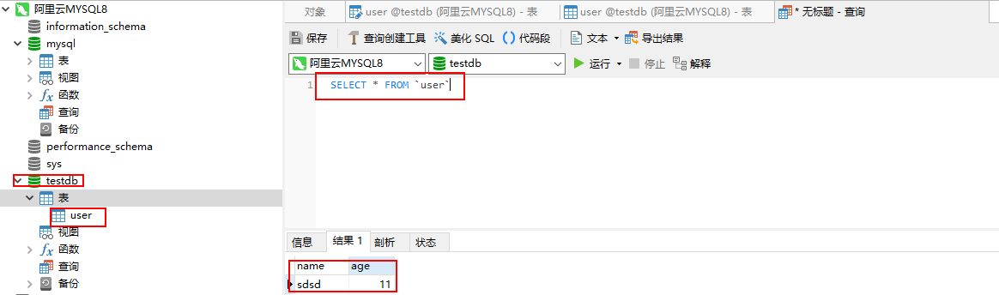

宿主机上文件已经生成

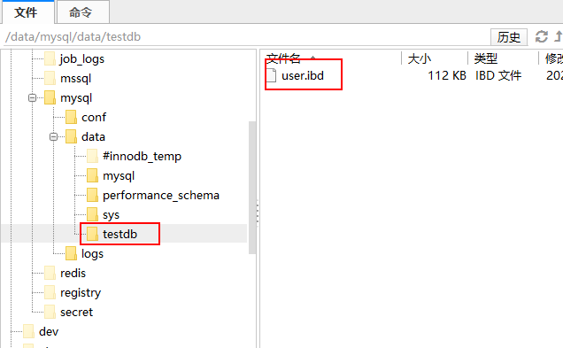

#### （3）删除容器，宿主机文件还在

```bash
[root@bluecusliyou _data]# docker rm -f mysqlserver
mysqlserver
```

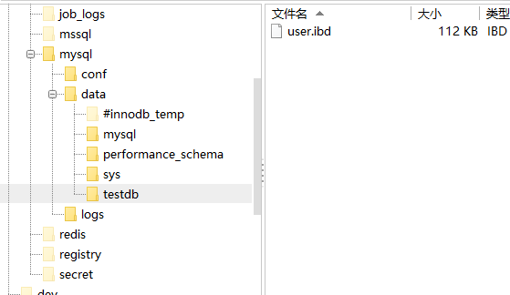

#### （4）重新运行容器，数据持久化成功

```bash
[root@bluecusliyou _data]# docker run --name mysqlserver -v /data/mysql/conf:/etc/mysql/conf.d -v /data/mysql/logs:/logs -v /data/mysql/data:/var/lib/mysql -e MYSQL_ROOT_PASSWORD=123456 -d -i -p 3306:3306 mysql:latest --lower_case_table_names=1
2bf89cba601dbcc6a297ec7446a98b8cd6435e514b20d50334101fb286f3c6e0
```

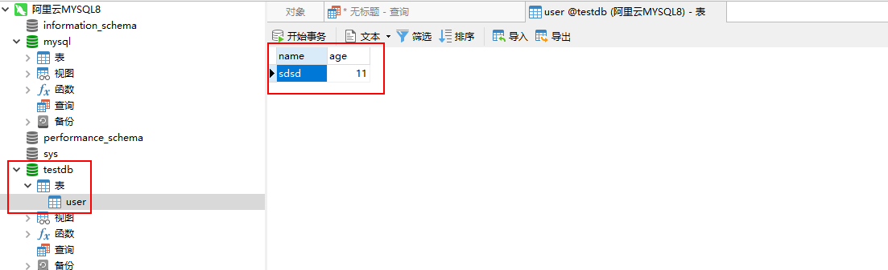

## 六、Docker网络

### 1、网络简介

Docker网络的实现主要是依赖Linux网络有关的技术，这些技术有网络命名空间（Network Namespace）、Veth设备对、网桥、ipatables和路由。

（1）网络命名空间，实现网络隔离。

（2）Veth设备对，实现不同网络命名空间之间的通信。

（3）网桥，实现不同网络之间通信。

（4）ipatables，实现对数据包进行过滤和转发。

（5）路由，决定数据包到底发送到哪里。

### 2、网络模式

```bash
[root@bluecusliyou ~]# docker network --help

Usage:  docker network COMMAND

Manage networks

Commands:
  connect     Connect a container to a network
  create      Create a network
  disconnect  Disconnect a container from a network
  inspect     Display detailed information on one or more networks
  ls          List networks
  prune       Remove all unused networks
  rm          Remove one or more networks

Run 'docker network COMMAND --help' for more information on a command.
```

安装完docker，就默认创建了三个网络

```bash
[root@bluecusliyou ~]# docker network ls
NETWORK ID     NAME      DRIVER    SCOPE
04f2eb0d05b9   bridge    bridge    local
9697f77248e1   host      host      local
abc08bbf4c8b   none      null      local
```

运行容器时，你可以使用该-–net标志来指定容器应连接到哪些网络

- host模式：使用 --net=host 指定。

  host模式，容器和宿主机共用一个Network Namespace。容器将使用宿主机的网络。

- none模式：使用 --net=none 指定。

  none模式，就是没有网络。

- container模式：使用 --net=container:容器名称或者ID 指定。

  container模式，当前容器和指定容器共用一个Network Namespace。当前容器将使用指定容器的网络。

- bridge模式：使用 --net=bridge 指定，默认设置。

  bridge模式，桥接模式，默认的模式。

### 3、Bridge模式

bridge模式是Docker默认的网络模式，此模式会为每一个容器分配独立的Network Namespace。


#### （1）实现原理

- 我们只要在宿主机上安装了docker，就会创建一个虚拟网桥docker0。
- 我们每启动一个docker容器，docker就会给容器分配一个docker0的子网的ip，同时会创建了一对 veth pair 接口，一端连接容器内部，一端连接docker0网桥。
- 通过这种方式，主机可以跟容器通信，容器之间也可以相互通信。

> 运行容器前系统信息

```bash
#查看系统网络信息，安装了docker就会有docker0
[root@bluecusliyou ~]# ip addr
1: lo: <LOOPBACK,UP,LOWER_UP> mtu 65536 qdisc noqueue state UNKNOWN group default qlen 1000
    link/loopback 00:00:00:00:00:00 brd 00:00:00:00:00:00
    inet 127.0.0.1/8 scope host lo
       valid_lft forever preferred_lft forever
    inet6 ::1/128 scope host 
       valid_lft forever preferred_lft forever
2: eth0: <BROADCAST,MULTICAST,UP,LOWER_UP> mtu 1500 qdisc fq_codel state UP group default qlen 1000
    link/ether 00:16:3e:16:fa:95 brd ff:ff:ff:ff:ff:ff
    inet 172.27.45.106/20 brd 172.27.47.255 scope global dynamic noprefixroute eth0
       valid_lft 315324622sec preferred_lft 315324622sec
    inet6 fe80::216:3eff:fe16:fa95/64 scope link 
       valid_lft forever preferred_lft forever
6: docker0: <NO-CARRIER,BROADCAST,MULTICAST,UP> mtu 1500 qdisc noqueue state DOWN group default 
    link/ether 02:42:84:89:96:a4 brd ff:ff:ff:ff:ff:ff
    inet 172.17.0.1/16 brd 172.17.255.255 scope global docker0
       valid_lft forever preferred_lft forever
    inet6 fe80::42:84ff:fe89:96a4/64 scope link 
       valid_lft forever preferred_lft forever
```

> 容器运行

```bash
#运行两个网络模式是bridge的容器，默认就是bridge
[root@bluecusliyou ~]# docker run -d --name nginx_c_b1 -p 8561:80 nginx
c19004406443ed36417ece5a29f855feeea1e1fa745d61c1df356cba1874b58f
[root@bluecusliyou ~]# docker run -d --name nginx_c_b2 -p 8562:80 nginx
b01797d4cc20969f10c2310edf031d6ca50448205715ffc6a050339eb1d0fc6f
```

> 容器运行后系统信息

```bash
[root@bluecusliyou ~]# ip addr
1: lo: <LOOPBACK,UP,LOWER_UP> mtu 65536 qdisc noqueue state UNKNOWN group default qlen 1000
    link/loopback 00:00:00:00:00:00 brd 00:00:00:00:00:00
    inet 127.0.0.1/8 scope host lo
       valid_lft forever preferred_lft forever
    inet6 ::1/128 scope host 
       valid_lft forever preferred_lft forever
2: eth0: <BROADCAST,MULTICAST,UP,LOWER_UP> mtu 1500 qdisc fq_codel state UP group default qlen 1000
    link/ether 00:16:3e:16:fa:95 brd ff:ff:ff:ff:ff:ff
    inet 172.27.45.106/20 brd 172.27.47.255 scope global dynamic noprefixroute eth0
       valid_lft 315324281sec preferred_lft 315324281sec
    inet6 fe80::216:3eff:fe16:fa95/64 scope link 
       valid_lft forever preferred_lft forever
6: docker0: <BROADCAST,MULTICAST,UP,LOWER_UP> mtu 1500 qdisc noqueue state UP group default 
    link/ether 02:42:84:89:96:a4 brd ff:ff:ff:ff:ff:ff
    inet 172.17.0.1/16 brd 172.17.255.255 scope global docker0
       valid_lft forever preferred_lft forever
    inet6 fe80::42:84ff:fe89:96a4/64 scope link 
       valid_lft forever preferred_lft forever
99: vethb22303b@if98: <BROADCAST,MULTICAST,UP,LOWER_UP> mtu 1500 qdisc noqueue master docker0 state UP group default 
    link/ether f2:65:40:31:c5:03 brd ff:ff:ff:ff:ff:ff link-netnsid 0
    inet6 fe80::f065:40ff:fe31:c503/64 scope link 
       valid_lft forever preferred_lft forever
101: veth770c276@if100: <BROADCAST,MULTICAST,UP,LOWER_UP> mtu 1500 qdisc noqueue master docker0 state UP group default 
    link/ether 72:aa:84:01:7e:c8 brd ff:ff:ff:ff:ff:ff link-netnsid 1
    inet6 fe80::70aa:84ff:fe01:7ec8/64 scope link 
       valid_lft forever preferred_lft forever
```

> 再查看bridge信息，容器已经加入到bridge里面，ip地址就是子网的ip

```bash
[root@bluecusliyou ~]# docker network inspect bridge
[
    {
        ...
        "Containers": {
            "62766e60bf80b0d60090fa857313645fc5e9817c50cc65358bd82052a20e0d14": {
                "Name": "nginx_c_b2",
                "EndpointID": "cdd96b9b6c643c25ee85c17b65d70ecaa2eb663651f1130bd92a2c1957d11a51",
                "MacAddress": "02:42:ac:11:00:03",
                "IPv4Address": "172.17.0.3/16",
                "IPv6Address": ""
            },
            "88fe91f8d2a51f357a1bbc7c00e7025f02deea2fa3dfa4884d1d98b47d8b1b7e": {
                "Name": "nginx_c_b1",
                "EndpointID": "501826389e3cc55943cc9abcce93b4529b496e98f342a9e920b6b045611dcdba",
                "MacAddress": "02:42:ac:11:00:02",
                "IPv4Address": "172.17.0.2/16",
                "IPv6Address": ""
            }
        }
        ...
    }
]
```

#### （2）宿主机访问容器，容器之间访问

> 宿主机请求容器成功

```bash
[root@bluecusliyou ~]# curl 172.17.0.3
<!DOCTYPE html>
<html>
<head>
<title>Welcome to nginx!</title>
<style>
html { color-scheme: light dark; }
body { width: 35em; margin: 0 auto;
font-family: Tahoma, Verdana, Arial, sans-serif; }
</style>
</head>
<body>
<h1>Welcome to nginx!</h1>
<p>If you see this page, the nginx web server is successfully installed and
working. Further configuration is required.</p>

<p>For online documentation and support please refer to
<a href="http://nginx.org/">nginx.org</a>.<br/>
Commercial support is available at
<a href="http://nginx.com/">nginx.com</a>.</p>

<p><em>Thank you for using nginx.</em></p>
</body>
</html>
```

> 进入一个容器，请求另外的容器成功

```bash
[root@bluecusliyou ~]# docker exec -it nginx_c_b1 /bin/bash
root@c19004406443:/# curl 172.17.0.3
<!DOCTYPE html>
<html>
<head>
<title>Welcome to nginx!</title>
<style>
html { color-scheme: light dark; }
body { width: 35em; margin: 0 auto;
font-family: Tahoma, Verdana, Arial, sans-serif; }
</style>
</head>
<body>
<h1>Welcome to nginx!</h1>
<p>If you see this page, the nginx web server is successfully installed and
working. Further configuration is required.</p>

<p>For online documentation and support please refer to
<a href="http://nginx.org/">nginx.org</a>.<br/>
Commercial support is available at
<a href="http://nginx.com/">nginx.com</a>.</p>

<p><em>Thank you for using nginx.</em></p>
</body>
</html>
```

#### （3）容器访问外部网络的过程

```bash
#容器内访问外网地址成功
[root@bluecusliyou ~]# docker exec -it nginx_c_b1 /bin/bash
root@41abcb9be1b3:/# curl www.baidu.com
<!DOCTYPE html>
<!--STATUS OK--><html> <head><meta http-equiv=content-type content=text/html;charset=utf-8><meta http-equiv=X-UA-Compatible content=IE=Edge><meta content=always name=referrer><link rel=stylesheet type=text/css href=http://s1.bdstatic.com/r/www/cache/bdorz/baidu.min.css><title>百度一下，你就知道</title></head> <body link=#0000cc> <div 
...
```

主机有一块网卡为eth0，从主机上一个IP为172.17.0.2的容器中访问百度。

IP包首先判断要访问的地址非本子网，从容器发往自己的默认网关docker0，然后会查询主机的路由表，发现包应该从主机的eth0发往主机的网关。IP包就会转发给eth0，并从eth0发出去。

```bash
#查看系统路由表
[root@bluecusliyou ~]# ip route
default via 172.27.47.253 dev eth0 proto dhcp metric 100 
172.17.0.0/16 dev docker0 proto kernel scope link src 172.17.0.1 
172.27.32.0/20 dev eth0 proto kernel scope link src 172.27.45.106 metric 100
# 容器要想访问外部网络，需要本地系统的转发支持。
# 在Linux 系统中，检查转发是否打开。如果为 0，说明没有开启转发，则需要手动打开。
[root@bluecusliyou ~]# sysctl net.ipv4.ip_forward
net.ipv4.ip_forward = 1
```

#### （4）外部访问容器的过程

```bash
#通过暴露的外部接口访问成功
[root@bluecusliyou ~]# curl localhost:8561
<!DOCTYPE html>
<html>
<head>
<title>Welcome to nginx!</title>
<style>
html { color-scheme: light dark; }
body { width: 35em; margin: 0 auto;
font-family: Tahoma, Verdana, Arial, sans-serif; }
</style>
</head>
<body>
<h1>Welcome to nginx!</h1>
<p>If you see this page, the nginx web server is successfully installed and
working. Further configuration is required.</p>

<p>For online documentation and support please refer to
<a href="http://nginx.org/">nginx.org</a>.<br/>
Commercial support is available at
<a href="http://nginx.com/">nginx.com</a>.</p>

<p><em>Thank you for using nginx.</em></p>
</body>
</html>
```

在创建完两个带暴露端口的容器后，查看Iptable规则的变化，发现多了两个网址规则，这些规则就是对主机eth0收到的目的端口为8563/8564的tcp流量进行DNAT转换，将流量发往172.17.0.2:80/172.17.0.3:80，也就是我们创建的Docker容器。所以，外界只需访问宿主机地址:8561/8562就可以访问到容器中的服务。

```bash
#查看系统iptables，新增加两个地址匹配规则
[root@bluecusliyou ~]# iptables-save|grep -i docker0
-A POSTROUTING -s 172.17.0.0/16 ! -o docker0 -j MASQUERADE
-A DOCKER -i docker0 -j RETURN
-A DOCKER ! -i docker0 -p tcp -m tcp --dport 8561 -j DNAT --to-destination 172.17.0.2:80
-A DOCKER ! -i docker0 -p tcp -m tcp --dport 8562 -j DNAT --to-destination 172.17.0.3:80
-A FORWARD -o docker0 -m conntrack --ctstate RELATED,ESTABLISHED -j ACCEPT
-A FORWARD -o docker0 -j DOCKER
-A FORWARD -i docker0 ! -o docker0 -j ACCEPT
-A FORWARD -i docker0 -o docker0 -j ACCEPT
-A DOCKER -d 172.17.0.2/32 ! -i docker0 -o docker0 -p tcp -m tcp --dport 80 -j ACCEPT
-A DOCKER -d 172.17.0.3/32 ! -i docker0 -o docker0 -p tcp -m tcp --dport 80 -j ACCEPT
-A DOCKER-ISOLATION-STAGE-1 -i docker0 ! -o docker0 -j DOCKER-ISOLATION-STAGE-2
-A DOCKER-ISOLATION-STAGE-2 -o docker0 -j DROP
```

#### （5）–link实现容器名访问

IP地址可以实现互联互通，但是直接能用名称访问是更好的方式。

```bash
# 直接名称访问是不行的
[root@bluecusliyou ~]# docker exec -it nginx_c_b1 curl nginx_c_b2
curl: (6) Could not resolve host: nginx_c_b2
# 容器运行的时候给容器创建连接
[root@bluecusliyou ~]# docker run -d --name nginx_c_b3 --link nginx_c_b2 nginx
c234f762227516399a081707bce0f17710f1efee0d36d0cbc949ddb1f5f4e292
# 重新用名称访问成功
[root@bluecusliyou ~]# docker exec -it nginx_c_b3 curl nginx_c_b2
<!DOCTYPE html>
<html>
<head>
<title>Welcome to nginx!</title>
<style>
html { color-scheme: light dark; }
body { width: 35em; margin: 0 auto;
font-family: Tahoma, Verdana, Arial, sans-serif; }
</style>
</head>
<body>
<h1>Welcome to nginx!</h1>
<p>If you see this page, the nginx web server is successfully installed and
working. Further configuration is required.</p>

<p>For online documentation and support please refer to
<a href="http://nginx.org/">nginx.org</a>.<br/>
Commercial support is available at
<a href="http://nginx.com/">nginx.com</a>.</p>

<p><em>Thank you for using nginx.</em></p>
</body>
</html>
# 反过来用名称访问也是不行的
[root@bluecusliyou ~]# docker exec -it nginx_c_b2 curl nginx_c_b3
curl: (6) Could not resolve host: nginx_c_b3
```

原理探究：–link本质就是在hosts配置中添加映射。

```bash
# 查看容器详情，有一个连接记录
[root@bluecusliyou ~]# docker inspect nginx_c_b3
[
    {        
            "Links": [
                "/nginx_c_b2:/nginx_c_b3/nginx_c_b2"
            ],
    }
]
# 查看容器内部IP映射文件，link就是加了一条映射 ID和容器名称都是可以直接访问的
[root@bluecusliyou ~]# docker exec -it nginx_c_b3 cat /etc/hosts
127.0.0.1       localhost
::1     localhost ip6-localhost ip6-loopback
fe00::0 ip6-localnet
ff00::0 ip6-mcastprefix
ff02::1 ip6-allnodes
ff02::2 ip6-allrouters
172.17.0.3      nginx_c_b2 edb46469326c
172.17.0.4      c234f7622275
[root@bluecusliyou ~]# docker ps -a
CONTAINER ID   IMAGE     COMMAND                  CREATED          STATUS          PORTS                                   NAMES
c234f7622275   nginx     "/docker-entrypoint.…"   4 minutes ago    Up 4 minutes    80/tcp                                  nginx_c_b3
edb46469326c   nginx     "/docker-entrypoint.…"   35 minutes ago   Up 35 minutes   0.0.0.0:8562->80/tcp, :::8562->80/tcp   nginx_c_b2
41abcb9be1b3   nginx     "/docker-entrypoint.…"   35 minutes ago   Up 35 minutes   0.0.0.0:8561->80/tcp, :::8561->80/tcp   nginx_c_b1
```

### 4、自定义网络

我们直接启动一个容器，不适用--net指定网络，默认指定的是bridge的docker0，但是容器名不能直接访问，需要使用link实现，比较麻烦。而且默认网络是自动分配IP的，不能自己指定，在实际部署中，我们需要指定容器ip，不允许其自行分配ip，尤其是搭建集群时，固定ip是必须的。

我们可以自定义bridge网络，不需要link也可以实现容器名称访问，创建容器的时候可以使用--ip指定容器的IP，专网专用也可以隔离容器之间的网络互相干扰。

> 自定义网络，bridge类型，子网，网关

```bash
# 创建自定义网络
[root@bluecusliyou ~]# docker network create --driver bridge --subnet 192.168.0.0/16 --gateway 192.168.0.1 mynet
c5e99afee05debf1c1bb212ebe98e63630713bd4337b8f8bd39ac085f9001adc
[root@bluecusliyou ~]# docker network ls
NETWORK ID     NAME      DRIVER    SCOPE
04f2eb0d05b9   bridge    bridge    local
9697f77248e1   host      host      local
c5e99afee05d   mynet     bridge    local
abc08bbf4c8b   none      null      local
#查看网络详情
[root@bluecusliyou ~]# docker network inspect mynet
[
    {
        "Name": "mynet",
        "Id": "c5e99afee05debf1c1bb212ebe98e63630713bd4337b8f8bd39ac085f9001adc",
        "Created": "2022-01-09T20:21:03.072892903+08:00",
        "Scope": "local",
        "Driver": "bridge",
        "EnableIPv6": false,
        "IPAM": {
            "Driver": "default",
            "Options": {},
            "Config": [
                {
                    "Subnet": "192.168.0.0/16",
                    "Gateway": "192.168.0.1"
                }
            ]
        },
        "Internal": false,
        "Attachable": false,
        "Ingress": false,
        "ConfigFrom": {
            "Network": ""
        },
        "ConfigOnly": false,
        "Containers": {},
        "Options": {},
        "Labels": {}
    }
]
```

> 启动两个容器，连接到自定义网络，使用容器名称可以访问成功

```bash
[root@bluecusliyou ~]# docker run -d --name nginx_c_b4 --net mynet --ip 192.168.0.6 nginx
4a981bf3c9976ce538582964bf879538c1d34e046b4b7742332cd46c4f6686a9
[root@bluecusliyou ~]# docker run -d --name nginx_c_b5 --net mynet --ip 192.168.0.7 nginx
1bda6e711e7cf31c0597f0c023a7317fbd8b576c9297408b0826d810e58b7760
[root@bluecusliyou ~]# docker exec -it nginx_c_b4 curl nginx_c_b5
<!DOCTYPE html>
<html>
<head>
<title>Welcome to nginx!</title>
<style>
html { color-scheme: light dark; }
body { width: 35em; margin: 0 auto;
font-family: Tahoma, Verdana, Arial, sans-serif; }
</style>
</head>
<body>
<h1>Welcome to nginx!</h1>
<p>If you see this page, the nginx web server is successfully installed and
working. Further configuration is required.</p>

<p>For online documentation and support please refer to
<a href="http://nginx.org/">nginx.org</a>.<br/>
Commercial support is available at
<a href="http://nginx.com/">nginx.com</a>.</p>

<p><em>Thank you for using nginx.</em></p>
</body>
</html>
```

### 5、网络连通

不同网络的容器之间需要互相访问，可以将一个网络的容器连接到另一个网络。

```bash
[root@bluecusliyou ~]# docker network connect --help

Usage:  docker network connect [OPTIONS] NETWORK CONTAINER

Connect a container to a network

Options:
      --alias strings           Add network-scoped alias for the container
      --driver-opt strings      driver options for the network
      --ip string               IPv4 address (e.g., 172.30.100.104)
      --ip6 string              IPv6 address (e.g., 2001:db8::33)
      --link list               Add link to another container
      --link-local-ip strings   Add a link-local address for the container
```

```bash
# 将容器加入网络,容器名访问成功
[root@bluecusliyou ~]# docker network connect mynet nginx_c_b1
[root@bluecusliyou ~]# docker exec -it nginx_c_b1 curl nginx_c_b4
<!DOCTYPE html>
<html>
<head>
<title>Welcome to nginx!</title>
<style>
html { color-scheme: light dark; }
body { width: 35em; margin: 0 auto;
font-family: Tahoma, Verdana, Arial, sans-serif; }
</style>
</head>
<body>
<h1>Welcome to nginx!</h1>
<p>If you see this page, the nginx web server is successfully installed and
working. Further configuration is required.</p>

<p>For online documentation and support please refer to
<a href="http://nginx.org/">nginx.org</a>.<br/>
Commercial support is available at
<a href="http://nginx.com/">nginx.com</a>.</p>

<p><em>Thank you for using nginx.</em></p>
</body>
</html>
```

## 七、DockerFile

### 1、Dockerfile简介

Docker 镜像是一个特殊的文件系统，除了提供容器运行时所需的程序、库、资源、配置等文件外，还包含了一些为运行时准备的一些配置参数（如匿名卷、环境变量、用户等）。镜像不包含任何动态数据，其内容在构建之后也不会被改变。

镜像的定制实际上就是定制每一层所添加的配置、文件。如果我们可以把每一层修改、安装、构建、操作的命令都写入一个脚本，用这个脚本来构建、定制镜像，那么之前提及的无法重复的问题、镜像构建透明性的问题、体积的问题就都会解决。这个脚本就是 Dockerfile。

Dockerfile 是一个文本文件，其内包含了一条条的指令(Instruction)，每一条指令构建一层，因此每一条指令的内容，就是描述该层应当如何构建。有了 Dockerfile，当我们需要定制自己额外的需求时，只需在 Dockerfile 上添加或者修改指令，重新生成 image 即可，省去了敲命令的麻烦。

### 2、DockerFile文件格式

Dockerfile 分为四部分：**基础镜像信息、维护者信息、镜像操作指令、容器启动执行指令**。一开始必须要指明所基于的镜像名称，接下来一般会说明维护者信息；后面则是镜像操作指令，例如 RUN 指令。每执行一条RUN 指令，镜像添加新的一层，并提交；最后是 CMD 指令，来指明运行容器时的操作命令。

```dockerfile
##  Dockerfile文件格式

# This dockerfile uses the ubuntu image
# VERSION 2 - EDITION 1
# Author: docker_user
# Command format: Instruction [arguments / command] ..
 
# 1、第一行必须指定 基础镜像信息
FROM ubuntu
 
# 2、维护者信息
MAINTAINER docker_user docker_user@email.com
 
# 3、镜像操作指令
RUN echo "deb http://archive.ubuntu.com/ubuntu/ raring main universe" >> /etc/apt/sources.list
RUN apt-get update && apt-get install -y nginx
RUN echo "\ndaemon off;" >> /etc/nginx/nginx.conf
 
# 4、容器启动指令
CMD /usr/sbin/nginx
```

### 3、DockerFile指令详解

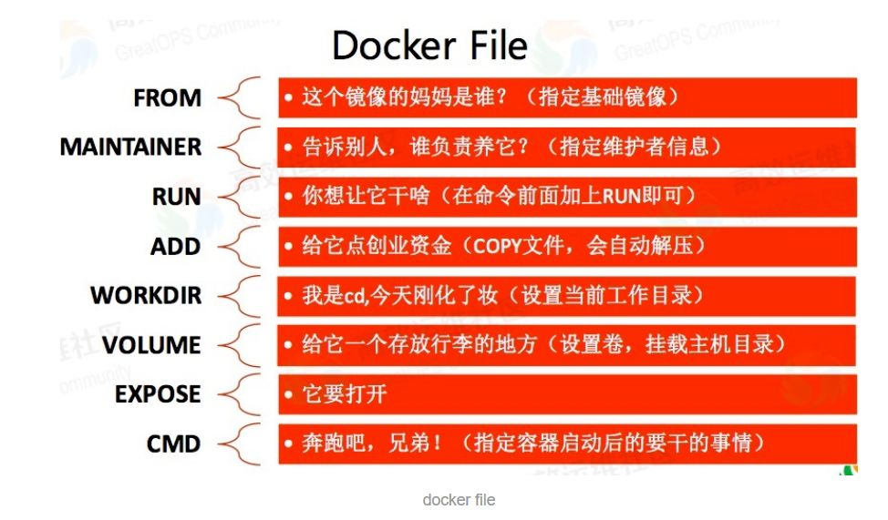

#### 基础知识

- 每个保留关键字（指令）都是必须是大写字母 
- 执行从上到下顺序 执行
- “#”表示注释 
- 每一个指令都会创建提交一个新的镜像层

#### FROM 指定基础镜像

通过 FROM 指定的镜像，可以是任何有效的基础镜像。FROM 有以下限制：

- Dockerfile 中第一条非注释命令必须是FROM
- 在一个 Dockerfile 文件中创建多个镜像时，FROM 可以多次出现。只需在每个新命令 FROM 之前，记录提交上次的镜像 ID。
- tag 或 digest（） 是可选的，如果不使用这两个值时，会使用 latest 版本的基础镜像

选择基础镜像的三个原则：

- 官方镜像优于非官方的镜像；
- 固定版本的Tag，而不是每次都使用latest;
- 功能满足，选择体积小的镜像；

```dockerfile
格式：
　　FROM <image>
　　FROM <image>:<tag>
　　FROM <image>@<digest>
示例：
　　FROM mysql:5.6
```

#### MAINTAINER 维护者信息

```dockerfile
格式：
    MAINTAINER <name>
示例：
    MAINTAINER Jasper Xu
    MAINTAINER sorex@163.com
    MAINTAINER Jasper Xu <sorex@163.com>
```

#### COPY 复制文件

COPY 指令将从构建上下文目录中 <源路径> 的文件/目录复制到新的一层的镜像内的`<目标路径>`位置。

`<源路径>`可以是多个，甚至可以是通配符，`<目标路径>`可以是容器内的绝对路径，也可以是相对于工作目录的相对路径，目标路径不存在会自动创建。

此外，源文件的各种元数据都会保留。如读、写、执行权限、文件变更时间等。

```dockerfile
格式：
   COPY <源路径>... <目标路径>
   COPY ["<源路径1>",... "<目标路径>"]
示例：
   COPY package.json /usr/src/app/
   COPY hom* /mydir/
   COPY hom?.txt /mydir/
```

#### ADD 更高级的复制文件

ADD 指令和 COPY 的格式和性质基本一致。tar类型文件会自动解压，可以访问网络资源。

在 Docker 官方的 [Dockerfile 最佳实践文档] 中要求，尽可能的使用 `COPY`，因为 `COPY` 的语义很明确，就是复制文件而已，而 `ADD` 则包含了更复杂的功能，其行为也不一定很清晰。而且`ADD` 指令会令镜像构建缓存失效，从而可能会令镜像构建变得比较缓慢。

因此在 `COPY` 和 `ADD` 指令中选择的时候，可以遵循这样的原则，所有的文件复制均使用 `COPY` 指令，仅在需要自动解压缩的场合使用 `ADD`。

```dockerfile
格式：
    ADD <src>... <dest>
    ADD ["<src>",... "<dest>"] 用于支持包含空格的路径
示例：
    ADD hom* /mydir/          # 添加所有以"hom"开头的文件
    ADD hom?.txt /mydir/      # ? 替代一个单字符,例如："home.txt"
    ADD test relativeDir/     # 添加 "test" 到WORKDIR`/relativeDir/
    ADD test /absoluteDir/    # 添加 "test" 到 /absoluteDir/
```

#### ENV 设置环境变量

ENV指令就是设置环境变量，后面的其它指令，还是运行时的应用，都可以直接使用这里定义的环境变量。

这个例子中演示了如何换行，以及对含有空格的值用双引号括起来的办法。

`docker run` 的时候可以使用 `-e`覆盖或者添加变量。

```dockerfile
格式：
	ENV <key> <value>
	ENV <key1>=<value1> <key2>=<value2>...
示例：	
	ENV VERSION=1.0 DEBUG=on \
    NAME="Happy Feet"
```

#### ARG 构建参数

ARG用于指定传递给构建镜像时的变量，使用 `docker build` 构建镜像时，可以通过 `--build-arg <varname>=<value>` 参数来指定或重设置这些变量的值。

```dockerfile
格式：
	ARG <name>[=<default value>]
示例：
	ARG site
	ARG build_user=IT笔录
```

#### EXPOSE 暴露端口

EXPOSE 指令并不会让容器监听 host 的端口，如果需要，需要在 `docker run` 时使用 `-p`、`-P` 参数来发布容器端口到 host 的某个端口上。

```dockerfile
格式：
    EXPOSE <port> [<port>...]
```

#### VOLUME 定义匿名卷

VOLUME 指令可以在镜像中创建挂载点，这样只要通过该镜像创建的容器都有了挂载点。

通过 VOLUME 指令创建的挂载点，无法指定主机上对应的目录，是自动生成的。

```dockerfile
格式：
	VOLUME ["/data"]
```

#### USER 指定当前用户

USER 用于指定运行镜像所使用的用户，使用USER指定用户时，可以使用用户名、UID 或 GID，或是两者的组合。

使用USER指定用户后，Dockerfile 中其后的命令 RUN、CMD、ENTRYPOINT 都将使用该用户。镜像构建完成后，通过 `docker run` 运行容器时，可以通过 `-u` 参数来覆盖所指定的用户。

```dockerfile
USER user
USER user:group
USER uid
USER uid:gid
USER user:gid
USER uid:group
```

#### WORKDIR 指定工作目录

WORKDIR用于在容器内设置一个工作目录，Dockerfile 中其后的命令 RUN、CMD、ENTRYPOINT、ADD、COPY 等命令都会在该目录下执行。WORKDIR 指定的工作目录，必须是提前创建好的。可以看成`cd`命令。

在使用` docker run` 运行容器时，可以通过`-w`参数覆盖构建时所设置的工作目录。

```dockerfile
WORKDIR /a
WORKDIR b
WORKDIR c
#pwd 最终将会在 /a/b/c 目录中执行
RUN pwd
```

#### LABEL 为镜像添加元数据

LABEL用于为镜像添加元数据，元数以键值对的形式指定，一条LABEL可以指定一或多条元数据，指定多条元数据时不同元数据之间通过空格分隔。推荐将所有的元数据通过一条LABEL指令指定，以免生成过多的中间镜像。

```dockerfile
格式：
    LABEL <key>=<value> <key>=<value> <key>=<value> ...
示例：
　　LABEL version="1.0" description="这是一个Web服务器" by="Docker"
```

#### ONBUILD 镜像触发器

用于延迟构建命令的执行。简单的说，就是 Dockerfile 里用 ONBUILD 指定的命令，在本次构建镜像的过程中不会执行（假设镜像为 test-build）。当有新的 Dockerfile 使用了之前构建的镜像 FROM test-build ，这时执行新镜像的 Dockerfile 构建时候，会执行 test-build 的 Dockerfile 里的 ONBUILD 指定的命令。 

```dockerfile
格式：
	ONBUILD [INSTRUCTION]
示例：
	ONBUILD ADD . /app/src
	ONBUILD RUN /usr/local/bin/python-build --dir /app/src
```

#### RUN 构建执行命令

在镜像的构建过程中执行特定的命令，并生成一个中间镜像。

- RUN 命令将在当前 image 中执行任意合法命令并提交执行结果。
- RUN 指令创建的中间镜像会被缓存，并会在下次构建中使用。如果不想使用这些缓存镜像，可以在构建时指定 `--no-cache` 参数，如：`docker build --no-cache`。

```dockerfile
shell执行
格式：
    RUN <command>
exec执行
格式：
    RUN ["executable", "param1", "param2"]
示例：
    RUN ["executable", "param1", "param2"]
    RUN apk update
    RUN ["/etc/execfile", "arg1", "arg1"]
```

#### CMD 容器启动命令

CMD用于指定在容器启动时所要执行的命令。CMD用于指定在容器启动时所要执行的命令，而RUN用于指定镜像构建时所要执行的命令。

一个Dockerfile仅仅最后一个CMD起作用，`docker run`命令如果指定了命令会覆盖CMD命令。

推荐使用第二种格式，执行过程比较明确。第一种格式实际上在运行的过程中也会自动转换成第二种格式运行，并且默认可执行文件是 sh。

```dockerfile
格式：
    CMD <shell 命令> 
	CMD ["<可执行文件或命令>","<param1>","<param2>",...] 
	CMD ["<param1>","<param2>",...]  # 该写法是为 ENTRYPOINT 指令指定的程序提供默认参数
示例：
    CMD echo "This is a test."
    CMD ["/usr/bin/wc","--help"]　　
```

```bash
#编写dockerfile
[root@bluecusliyou dockerfile-cmd]# vim dockerfile-test-cmd
[root@bluecusliyou dockerfile-cmd]# cat dockerfile-test-cmd
FROM centos 
CMD ["ls","-a"]
#构建镜像
[root@bluecusliyou dockerfile-cmd]# docker build -f dockerfile-test-cmd -t cmd-test:0.1 .
Sending build context to Docker daemon  2.048kB
Step 1/2 : FROM centos
 ---> 5d0da3dc9764
Step 2/2 : CMD ["ls","-a"]
 ---> Running in fe15de5e3126
Removing intermediate container fe15de5e3126
 ---> fb5f1364201a
Successfully built fb5f1364201a
Successfully tagged cmd-test:0.1
#启动一个容器
[root@bluecusliyou dockerfile-test-cmd]# docker run cmd-test:0.1
.
..
.dockerenv
bin
dev
etc
home
lib
lib64
lost+found
media
mnt
opt
proc
root
run
sbin
srv
sys
tmp
usr
var
# cmd的情况下 -l 替换了CMD["ls","-l"]。 -l 不是命令所以报错
[root@bluecusliyou dockerfile-test-cmd]# docker run cmd-test:0.1 -l
docker: Error response from daemon: OCI runtime create failed: container_linux.go:380: starting container process caused: exec: "-l": executable file not found in $PATH: unknown.
ERRO[0000] error waiting for container: context canceled
```

#### ENTRYPOINT 容器启动命令

ENTRYPOINT指定这个容器启动的时候要运行的命令，可以追加命令。

ENTRYPOINT 与 CMD 非常类似，不同的是通过`docker run`执行的命令不会覆盖 ENTRYPOINT，而是追加。且会覆盖 CMD 命令指定的参数。

Dockerfile 中只允许有一个 ENTRYPOINT 命令，多指定时会覆盖前面的设置，而只执行最后的 ENTRYPOINT 指令。

```dockerfile
格式：
	ENTRYPOINT ["executable", "param1", "param2"]
	ENTRYPOINT command param1 param2
示例：
	ENTRYPOINT ["/usr/bin/nginx"]
```

```bash
#编写dockerfile
[root@bluecusliyou dockerfile-entrypoint]# vim dockerfile-test-entrypoint
[root@bluecusliyou dockerfile-entrypoint]# cat dockerfile-test-entrypoint
FROM centos 
ENTRYPOINT ["ls","-a"]
#构建镜像
[root@bluecusliyou dockerfile-test-entrypoint]# docker build -f dockerfile-test-entrypoint -t entrypoint-test:0.1 .
Sending build context to Docker daemon  2.048kB
Step 1/2 : FROM centos
 ---> 5d0da3dc9764
Step 2/2 : ENTRYPOINT ["ls","-a"]
 ---> Running in 47b91532e6c3
Removing intermediate container 47b91532e6c3
 ---> 86bb562cb0c1
Successfully built 86bb562cb0c1
Successfully tagged entrypoint-test:0.1
#启动一个容器
[root@bluecusliyou dockerfile-test-entrypoint]# docker run entrypoint-test:0.1
.
..
.dockerenv
bin
dev
etc
home
lib
lib64
lost+found
media
mnt
opt
proc
root
run
sbin
srv
sys
tmp
usr
var
#命令是直接拼接在ENTRYPOINT命令后面效果
[root@bluecusliyou dockerfile-test-entrypoint]# docker run entrypoint-test:0.1 -l
total 0
drwxr-xr-x   1 root root   6 Dec 22 09:21 .
drwxr-xr-x   1 root root   6 Dec 22 09:21 ..
-rwxr-xr-x   1 root root   0 Dec 22 09:21 .dockerenv
lrwxrwxrwx   1 root root   7 Nov  3  2020 bin -> usr/bin
drwxr-xr-x   5 root root 340 Dec 22 09:21 dev
drwxr-xr-x   1 root root  66 Dec 22 09:21 etc
drwxr-xr-x   2 root root   6 Nov  3  2020 home
lrwxrwxrwx   1 root root   7 Nov  3  2020 lib -> usr/lib
lrwxrwxrwx   1 root root   9 Nov  3  2020 lib64 -> usr/lib64
drwx------   2 root root   6 Sep 15 14:17 lost+found
drwxr-xr-x   2 root root   6 Nov  3  2020 media
drwxr-xr-x   2 root root   6 Nov  3  2020 mnt
drwxr-xr-x   2 root root   6 Nov  3  2020 opt
dr-xr-xr-x 134 root root   0 Dec 22 09:21 proc
dr-xr-x---   2 root root 162 Sep 15 14:17 root
drwxr-xr-x  11 root root 163 Sep 15 14:17 run
lrwxrwxrwx   1 root root   8 Nov  3  2020 sbin -> usr/sbin
drwxr-xr-x   2 root root   6 Nov  3  2020 srv
dr-xr-xr-x  13 root root   0 Dec 22 09:21 sys
drwxrwxrwt   7 root root 171 Sep 15 14:17 tmp
drwxr-xr-x  12 root root 144 Sep 15 14:17 usr
drwxr-xr-x  20 root root 262 Sep 15 14:17 var
```

### 4、实战：构建.Net项目

创建一个Net6项目，选择docker支持，生成一个dockerfile，上传项目到服务器上

```dockerfile
#查看Dockerfile文件
[root@bluecusliyou dockerfile-WebAppTest]# cat Dockerfile
#See https://aka.ms/containerfastmode to understand how Visual Studio uses this Dockerfile to build your images for faster debugging.

FROM mcr.microsoft.com/dotnet/aspnet:6.0 AS base
WORKDIR /app
EXPOSE 80
EXPOSE 443

FROM mcr.microsoft.com/dotnet/sdk:6.0 AS build
WORKDIR /src
COPY ["dockerfile-WebAppTest.csproj", "."]
RUN dotnet restore "./dockerfile-WebAppTest.csproj"
COPY . .
WORKDIR "/src/."
RUN dotnet build "dockerfile-WebAppTest.csproj" -c Release -o /app/build

FROM build AS publish
RUN dotnet publish "dockerfile-WebAppTest.csproj" -c Release -o /app/publish

FROM base AS final
WORKDIR /app
COPY --from=publish /app/publish .
#构建镜像
[root@bluecusliyou dockerfile-WebAppTest]# docker build -t webapptest:0.1 .
Sending build context to Docker daemon    8.2MB
Step 1/17 : FROM mcr.microsoft.com/dotnet/aspnet:6.0 AS base
6.0: Pulling from dotnet/aspnet
a2abf6c4d29d: Pull complete 
08af7dd3c640: Pull complete 
742307799914: Pull complete 
a260dbcd03fc: Pull complete 
96c3c696f47e: Pull complete 
Digest: sha256:7696d5b456eede87434c232b9070f40659ff0c4b71ca622cf197815ccaee661d
Status: Downloaded newer image for mcr.microsoft.com/dotnet/aspnet:6.0
 ---> 8d32e18b77a4
Step 2/17 : WORKDIR /app
 ---> Running in 51c96a80e840
Removing intermediate container 51c96a80e840
 ---> 83c90e297231
Step 3/17 : EXPOSE 80
 ---> Running in 869ab4f326c2
Removing intermediate container 869ab4f326c2
 ---> d6085b7c2120
Step 4/17 : EXPOSE 443
 ---> Running in fd855df4c7fd
Removing intermediate container fd855df4c7fd
 ---> c702c8de57e7
Step 5/17 : FROM mcr.microsoft.com/dotnet/sdk:6.0 AS build
6.0: Pulling from dotnet/sdk
a2abf6c4d29d: Already exists 
08af7dd3c640: Already exists 
742307799914: Already exists 
a260dbcd03fc: Already exists 
96c3c696f47e: Already exists 
d81364490ceb: Pull complete 
3e56f7c4d95f: Pull complete 
9939dbdaf4a7: Pull complete 
Digest: sha256:a7af03bdead8976d4e3715452fc985164db56840691941996202cea411953452
Status: Downloaded newer image for mcr.microsoft.com/dotnet/sdk:6.0
 ---> e86d68dca8c7
Step 6/17 : WORKDIR /src
 ---> Running in 14fef285f572
Removing intermediate container 14fef285f572
 ---> 001d6270e584
Step 7/17 : COPY ["dockerfile-WebAppTest.csproj", "."]
 ---> 7cd3e5caf89c
Step 8/17 : RUN dotnet restore "./dockerfile-WebAppTest.csproj"
 ---> Running in bc35234d137d
  Determining projects to restore...
  Restored /src/dockerfile-WebAppTest.csproj (in 2.14 sec).
Removing intermediate container bc35234d137d
 ---> c067bc6dfbae
Step 9/17 : COPY . .
 ---> 78dab1650a45
Step 10/17 : WORKDIR "/src/."
 ---> Running in d643773f4d58
Removing intermediate container d643773f4d58
 ---> 026250d9327d
Step 11/17 : RUN dotnet build "dockerfile-WebAppTest.csproj" -c Release -o /app/build
 ---> Running in 8e1eb8e0879b
Microsoft (R) Build Engine version 17.0.0+c9eb9dd64 for .NET
Copyright (C) Microsoft Corporation. All rights reserved.

  Determining projects to restore...
  All projects are up-to-date for restore.
  dockerfile-WebAppTest -> /app/build/dockerfile-WebAppTest.dll

Build succeeded.
    0 Warning(s)
    0 Error(s)

Time Elapsed 00:00:08.85
Removing intermediate container 8e1eb8e0879b
 ---> c1c5553c89b7
Step 12/17 : FROM build AS publish
 ---> c1c5553c89b7
Step 13/17 : RUN dotnet publish "dockerfile-WebAppTest.csproj" -c Release -o /app/publish
 ---> Running in 8114015e5016
Microsoft (R) Build Engine version 17.0.0+c9eb9dd64 for .NET
Copyright (C) Microsoft Corporation. All rights reserved.

  Determining projects to restore...
  All projects are up-to-date for restore.
  dockerfile-WebAppTest -> /src/bin/Release/net6.0/dockerfile-WebAppTest.dll
  dockerfile-WebAppTest -> /app/publish/
Removing intermediate container 8114015e5016
 ---> 55c4cd5cbd12
Step 14/17 : FROM base AS final
 ---> c702c8de57e7
Step 15/17 : WORKDIR /app
 ---> Running in 5dd1282931ec
Removing intermediate container 5dd1282931ec
 ---> ac0ef9e1e60d
Step 16/17 : COPY --from=publish /app/publish .
 ---> 32484d82d784
Step 17/17 : ENTRYPOINT ["dotnet", "dockerfile-WebAppTest.dll"]
 ---> Running in 6fc2496b06da
Removing intermediate container 6fc2496b06da
 ---> 1c02f8c29e8a
Successfully built 1c02f8c29e8a
Successfully tagged webapptest:0.1
#运行容器
[root@bluecusliyou dockerfile-WebAppTest]# docker run -id -p 8888:80 --name mywebapp webapptest:0.1
c989d336314bab82ebf29ef777b386e7db5731d34a415cae5c41b3408aa6e8bc
#访问接口成功
[root@bluecusliyou dockerfile-WebAppTest]# curl localhost:8888
<!DOCTYPE html>
<html lang="en">
<head>
    <meta charset="utf-8" />
    <meta name="viewport" content="width=device-width, initial-scale=1.0" />
    <title>Home Page - dockerfile_WebAppTest</title>
    <link rel="stylesheet" href="/lib/bootstrap/dist/css/bootstrap.min.css" />
    <link rel="stylesheet" href="/css/site.css?v=AKvNjO3dCPPS0eSU1Ez8T2wI280i08yGycV9ndytL-c" />
    <link rel="stylesheet" href="/dockerfile_WebAppTest.styles.css" />
</head>
<body>
    <header>
        <nav b-bke7gorqge class="navbar navbar-expand-sm navbar-toggleable-sm navbar-light bg-white border-bottom box-shadow mb-3">
            <div b-bke7gorqge class="container-fluid">
                <a class="navbar-brand" href="/">dockerfile_WebAppTest</a>
                <button b-bke7gorqge class="navbar-toggler" type="button" data-bs-toggle="collapse" data-bs-target=".navbar-collapse" aria-controls="navbarSupportedContent"
                        aria-expanded="false" aria-label="Toggle navigation">
                    <span b-bke7gorqge class="navbar-toggler-icon"></span>
                </button>
                <div b-bke7gorqge class="navbar-collapse collapse d-sm-inline-flex justify-content-between">
                    <ul b-bke7gorqge class="navbar-nav flex-grow-1">
                        <li b-bke7gorqge class="nav-item">
                            <a class="nav-link text-dark" href="/">Home</a>
                        </li>
                        <li b-bke7gorqge class="nav-item">
                            <a class="nav-link text-dark" href="/Home/Privacy">Privacy</a>
                        </li>
                    </ul>
                </div>
            </div>
        </nav>
    </header>
    <div b-bke7gorqge class="container">
        <main b-bke7gorqge role="main" class="pb-3">
            
<div class="text-center">
    <h1 class="display-4">Welcome</h1>
    <p>Learn about <a href="https://docs.microsoft.com/aspnet/core">building Web apps with ASP.NET Core</a>.</p>
</div>

        </main>
    </div>

    <footer b-bke7gorqge class="border-top footer text-muted">
        <div b-bke7gorqge class="container">
            &copy; 2021 - dockerfile_WebAppTest - <a href="/Home/Privacy">Privacy</a>
        </div>
    </footer>
    <script src="/lib/jquery/dist/jquery.min.js"></script>
    <script src="/lib/bootstrap/dist/js/bootstrap.bundle.min.js"></script>
    <script src="/js/site.js?v=4q1jwFhaPaZgr8WAUSrux6hAuh0XDg9kPS3xIVq36I0"></script>
    
</body>
</html> 
```

## 八、Docker仓库

### 1、Docker Hub(公共镜像仓库)

Docker Hub公共仓库就类似于GitHub，这是一个公共的共享的镜像仓库平台，我们可以像在GitHub上随意得clone公共的开源项目一样pull镜像到本地。

#### （1）注册和创建仓库

官网地址：[https://hub.docker.com/](https://hub.docker.com/)

注册地址：[https://hub.docker.com/signup](https://hub.docker.com/signup)

注册完成登录之后就可以创建一个Repository，可以创建公有仓库，也可以创建私有仓库。免费版本只能创建一个私有库。

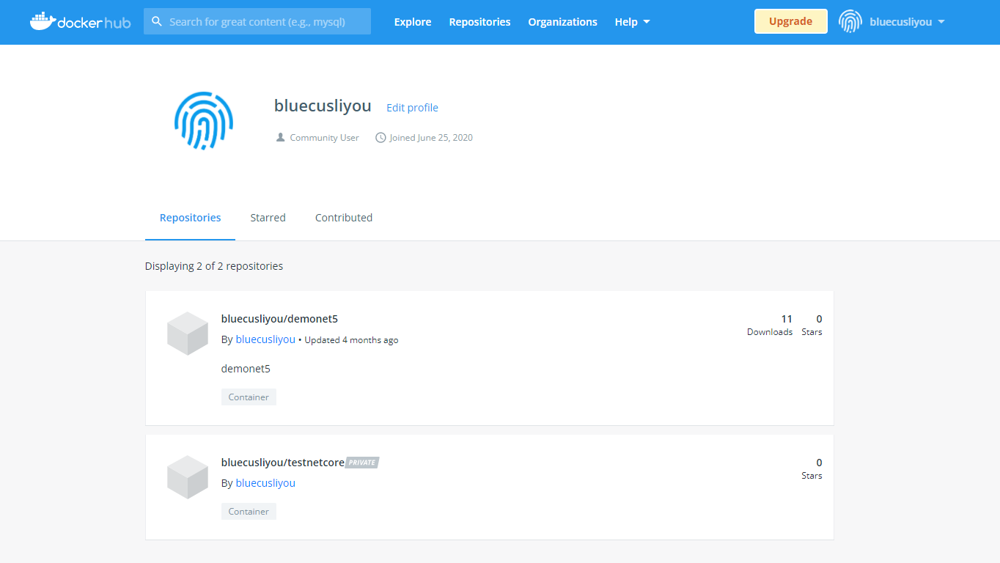

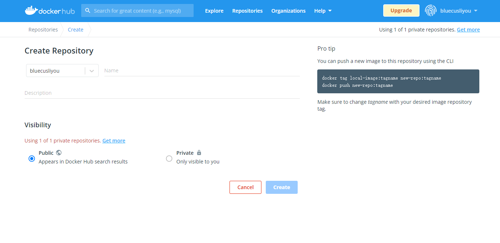

#### （2）客户端上登录dockerhub账号

这里的账号就是dockerhub上注册的账号

```bash
[root@bluecusliyou ~]# docker login
Login with your Docker ID to push and pull images from Docker Hub. If you don't have a Docker ID, head over to https://hub.docker.com to create one.
Username: bluecusliyou
Password: 
WARNING! Your password will be stored unencrypted in /root/.docker/config.json.
Configure a credential helper to remove this warning. See
https://docs.docker.com/engine/reference/commandline/login/#credentials-store

Login Succeeded
[root@bluecusliyou ~]# cat /root/.docker/config.json
{
        "auths": {
                "https://index.docker.io/v1/": {
                        "auth": "Ymx1ZWN1c2xpeW91OmxpeW91QGRvY2tlckBxNTkuY29t"
                }
        }
}
```

#### （3）客户端上传镜像

只有dockerhub的主机名是可以省略的，其他仓库的主机名必须写上

```bash
#给镜像打标签，上传镜像到仓库
[root@bluecusliyou ~]# docker tag nginx bluecusliyou/nginx:0.1
[root@bluecusliyou ~]# docker push bluecusliyou/nginx:0.1
The push refers to repository [docker.io/bluecusliyou/nginx]
d874fd2bc83b: Layer already exists 
32ce5f6a5106: Layer already exists 
f1db227348d0: Layer already exists 
b8d6e692a25e: Layer already exists 
e379e8aedd4d: Layer already exists 
2edcec3590a4: Layer already exists 
0.2: digest: sha256:ee89b00528ff4f02f2405e4ee221743ebc3f8e8dd0bfd5c4c20a2fa2aaa7ede3 size: 1570
#查看仓库镜像版本
[root@bluecusliyou ~]# curl  https://registry.hub.docker.com/v1/repositories/bluecusliyou/nginx/tags
[{"layer": "", "name": "0.1"}]
```

#### （4）另一台客户端下载镜像

```bash
[root@bluecusliyou ~]# docker images 
REPOSITORY   TAG       IMAGE ID   CREATED   SIZE
[root@bluecusliyou ~]# docker pull bluecusliyou/nginx:0.1
0.2: Pulling from bluecusliyou/mynginx
a2abf6c4d29d: Pull complete 
a9edb18cadd1: Pull complete 
589b7251471a: Pull complete 
186b1aaa4aa6: Pull complete 
b4df32aa5a72: Pull complete 
a0bcbecc962e: Pull complete 
Digest: sha256:ee89b00528ff4f02f2405e4ee221743ebc3f8e8dd0bfd5c4c20a2fa2aaa7ede3
Status: Downloaded newer image for bluecusliyou/mynginx:0.2
docker.io/bluecusliyou/nginx:0.1
[root@bluecusliyou ~]# docker images
REPOSITORY           TAG       IMAGE ID       CREATED       SIZE
bluecusliyou/nginx   0.1       605c77e624dd   10 days ago   141MB
```

### 2、Registry(私有镜像仓库)

​       [Docker Hub](https://hub.docker.com/)是Docker默认官方公共镜像，如果想要自己搭建私有镜像仓库，官方也提供Registry镜像，使得我们搭建**私有仓库**变得非常简单。

　　所谓**私有仓库**，也就是在本地（局域网）搭建的一个类似公共仓库的东西，搭建好之后，我们可以将镜像提交到私有仓库中。这样我们既能使用 Docker 来运行我们的项目镜像，也避免了商业项目暴露出去的风险。

#### （1）服务器搭建镜像仓库并启动

```bash
#拉取仓库的镜像
[root@bluecusliyou ~]# docker pull registry
Using default tag: latest
latest: Pulling from library/registry
79e9f2f55bf5: Pull complete 
0d96da54f60b: Pull complete 
5b27040df4a2: Pull complete 
e2ead8259a04: Pull complete 
3790aef225b9: Pull complete 
Digest: sha256:169211e20e2f2d5d115674681eb79d21a217b296b43374b8e39f97fcf866b375
Status: Downloaded newer image for registry:latest
docker.io/library/registry:latest
#运行仓库镜像
[root@bluecusliyou ~]# docker run -d -v /opt/images/registry:/var/lib/registry -p 5000:5000 --restart=always --name bluecusliyou-registry registry
e2761519cd538d028622cc6ff406257712d1077b6ecc6e8f545f1e580ae49471
```

#### （2）客户端修改本地域名文件

这里的“your-server-ip”请换为你的仓库的服务器的IP地址

```bash
[root@blueculiyou ~]# vim /etc/hosts
[root@blueculiyou ~]# cat /etc/hosts
127.0.0.1 VM-0-13-centos VM-0-13-centos
127.0.0.1 localhost.localdomain localhost
127.0.0.1 localhost4.localdomain4 localhost4

::1 VM-0-13-centos VM-0-13-centos
::1 localhost.localdomain localhost
::1 localhost6.localdomain6 localhost6
your-server-ip registery
```

#### （3）客户端修改Docker的配置文件

为了让客户端服务器能够快速地访问搭建的镜像仓库，在客户端配置一下私有仓库的可信任设置让我们可以通过HTTP直接访问

```bash
[root@blueculiyou ~]# vim /etc/docker/daemon.json
[root@blueculiyou ~]# cat /etc/docker/daemon.json
{
        "insecure-registries": ["registery:5000"]
}
#重新加载配置文件
[root@blueculiyou harbor]# systemctl daemon-reload
[root@blueculiyou harbor]# systemctl restart docker
```

#### （4）客户端上传镜像

```bash
#给镜像打标签，上传镜像到仓库
[root@blueculiyou ~]# docker tag nginx registery:5000/bluecusliyou/nginx:0.1
[root@blueculiyou ~]# docker push registery:5000/bluecusliyou/nginx:0.1
The push refers to repository [registery:5000/bluecusliyou/nginx]
2bed47a66c07: Layer already exists 
82caad489ad7: Layer already exists 
d3e1dca44e82: Layer already exists 
c9fcd9c6ced8: Layer already exists 
0664b7821b60: Layer already exists 
9321ff862abb: Layer already exists 
0.1: digest: sha256:4424e31f2c366108433ecca7890ad527b243361577180dfd9a5bb36e828abf47 size: 1570
#查看仓库镜像列表
[root@blueculiyou ~]# curl http://registery:5000/v2/_catalog
{"repositories":["bluecusliyou/nginx"]}
#查看仓库镜像有哪些版本
[root@blueculiyou ~]# curl http://registery:5000/v2/bluecusliyou/nginx/tags/list
{"name":"bluecusliyou/nginx","tags":["0.1"]}
```

#### （5）另一台客户端下载镜像

```bash
#下载镜像
[root@blueculiyou ~]# docker images
REPOSITORY   TAG       IMAGE ID       CREATED       SIZE
nginx        latest    f652ca386ed1   3 weeks ago   141MB
[root@blueculiyou ~]# docker pull registery:5000/bluecusliyou/nginx:0.1
0.1: Pulling from bluecusliyou/nginx
Digest: sha256:4424e31f2c366108433ecca7890ad527b243361577180dfd9a5bb36e828abf47
Status: Downloaded newer image for registery:5000/bluecusliyou/nginx:0.1
registery:5000/bluecusliyou/nginx:0.1
[root@blueculiyou ~]# docker images
REPOSITORY                          TAG       IMAGE ID       CREATED       SIZE
nginx                               latest    f652ca386ed1   3 weeks ago   141MB
registery:5000/bluecusliyou/nginx   0.1       f652ca386ed1   3 weeks ago   141MB
```

### 3、Harbor(企业级镜像仓库)

Harbor是VMware公司开源的一个企业级Docker Registry项目，项目地址：[https://github.com/goharbor/harbor](https://github.com/goharbor/harbor)

Harbor作为一个企业级私有Registry服务器，提供了更好的性能和安全，提升了用户使用Registry构建和运行环境传输镜像的效率。虽然Harbor和Registry都是私有镜像仓库的选择，但是Harbor的企业级特性更强，因此也是更多企业级用户的选择。

　　Harbor实现了基于角色的访问控制机制，并通过项目来对镜像进行组织和访问权限的控制，也常常和K8S中的namespace结合使用。此外，Harbor还提供了图形化的管理界面，我们可以通过浏览器来浏览，检索当前Docker镜像仓库，管理项目和命名空间。

　　有关Harbor的架构，可以参考阅读这一篇《[Harbor整体架构](https://ivanzz1001.github.io/records/post/docker/2018/04/20/docker-harbor-architecture)》一文，里面讲述了Harbor的6大核心组件构成，有兴趣的朋友可以一读。

　　下面列出了Harbor的搭建过程，主要参考自Harbor的github文档

#### （1）安装准备

> 下载安装包，解压缩

Harbor提供了两种安装方式：一种是在线安装包，因此包很小；另一种是离线安装包，因此包很大（>=570MB）。这里选择下载离线安装包，下载地址：[https://github.com/goharbor/harbor/releases](https://github.com/goharbor/harbor/releases)

```bash
#下载离线安装包
[root@bluecusliyou harbor]# wget https://github.com/goharbor/harbor/releases/download/v2.3.5/harbor-offline-installer-v2.3.5.tgz
#下载之后，解压缩
[root@bluecusliyou harbor]# tar zvxf harbor-offline-installer-v2.3.5.tgz
harbor/harbor.v2.3.5.tar.gz
harbor/prepare
harbor/LICENSE
harbor/install.sh
harbor/common.sh
harbor/harbor.yml.tmpl
```

> 安装Docker，参考安装Docker章节

> 安装Docker-compose

```bash
#下载
[root@bluecusliyou harbor]# curl -L https://get.daocloud.io/docker/compose/releases/download/1.29.1/docker-compose-`uname -s`-`uname -m` > /usr/local/bin/docker-compose
  % Total    % Received % Xferd  Average Speed   Time    Time     Time  Current
                                 Dload  Upload   Total   Spent    Left  Speed
100   423  100   423    0     0    403      0  0:00:01  0:00:01 --:--:--   403
100 12.1M  100 12.1M    0     0  2228k      0  0:00:05  0:00:05 --:--:-- 2949k
#添加可执行权限
[root@bluecusliyou harbor]# sudo chmod +x /usr/local/bin/docker-compose
#查看版本号成功，表示安装完成
[root@bluecusliyou harbor]# docker-compose version
docker-compose version 1.29.1, build c34c88b2
docker-py version: 5.0.0
CPython version: 3.7.10
OpenSSL version: OpenSSL 1.1.0l  10 Sep 2019
```

如果要卸载直接删除文件

```bash
sudo rm /usr/local/bin/docker-compose
```

> 修改配置文件配置信息

hostname：服务器IP

https先注释掉，不配置证书，生产环境需要配置证书保证安全性。

密码：harbor_admin_password: admin

每次修改配置文件的后都要重新执行`prepare`否则配置文件不生效，第一次安装可以不执行

```bash
#先拷贝一个配置文件模板
[root@bluecusliyou harbor]# cp harbor.yml.tmpl harbor.yml
#修改配置文件
[root@bluecusliyou harbor]# vim harbor.yml
[root@bluecusliyou harbor]# ./prepare
prepare base dir is set to /home/test/harbor
WARNING:root:WARNING: HTTP protocol is insecure. Harbor will deprecate http protocol in the future. Please make sure to upgrade to https
Clearing the configuration file: /config/portal/nginx.conf
...
```

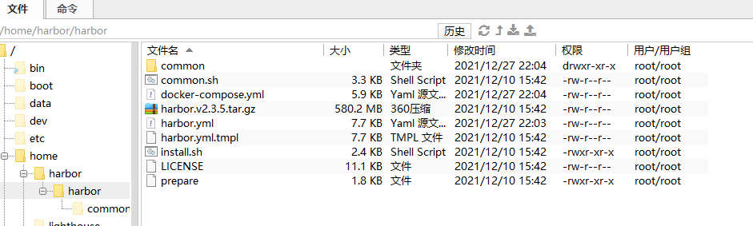

#### （2）安装仓库

```bash
[root@bluecusliyou harbor]# ./install.sh
[Step 0]: checking if docker is installed ...
Note: docker version: 20.10.7
[Step 1]: checking docker-compose is installed ...
Note: docker-compose version: 1.29.1
[Step 2]: loading Harbor images ...
1e3f0dc884e2: Loading layer [==================================================>]  39.45MB/39.45MB
...
Loaded image: goharbor/chartmuseum-photon:v2.3.5
[Step 3]: preparing environment ...
[Step 4]: preparing harbor configs ...
prepare base dir is set to /home/test/harbor
WARNING:root:WARNING: HTTP protocol is insecure. Harbor will deprecate http protocol in the future. Please make sure to upgrade to https
Generated configuration file: /config/portal/nginx.conf
...
[Step 5]: starting Harbor ...
Creating network "harbor_harbor" with the default driver
...
✔ ----Harbor has been installed and started successfully.----
```

如果需要修改Harbor的配置文件，修改完成之后需要重启运行harbor，因为Harbor是基于docker-compose服务编排的，我们可以使用docker-compose命令重启Harbor。docker-compose start | stop | restart，这边的命令需要在docker-compose.yml文件的路径下执行。

```bash
#停止harbor
[root@bluecusliyou harbor]# docker-compose down
Stopping harbor-jobservice ... done
Stopping nginx             ... done
Stopping harbor-core       ... done
Stopping redis             ... done
Stopping registryctl       ... done
Stopping registry          ... done
Stopping harbor-portal     ... done
Stopping harbor-db         ... done
Stopping harbor-log        ... done
Removing harbor-jobservice ... done
Removing nginx             ... done
Removing harbor-core       ... done
Removing redis             ... done
Removing registryctl       ... done
Removing registry          ... done
Removing harbor-portal     ... done
Removing harbor-db         ... done
Removing harbor-log        ... done
Removing network harbor_harbor
#启动harbor -d后台运行
[root@bluecusliyou harbor]# docker-compose up -d
Creating network "harbor_harbor" with the default driver
Creating harbor-log ... done
Creating registryctl   ... done
Creating harbor-db     ... done
Creating harbor-portal ... done
Creating redis         ... done
Creating registry      ... done
Creating harbor-core   ... done
Creating harbor-jobservice ... done
Creating nginx             ... done
```

将 harbor 配成 systemd 的 service，使之能开机自启动，添加配置文件`/usr/lib/systemd/system/harbor.service`其中 `{{ harbor_install_path }}` 换成自己的 harbor 安装路径。还有 docker-compose 的绝对路径，请通过 `which docker-compose` 查看。

```bash
[Unit]
Description=Harbor
After=docker.service systemd-networkd.service systemd-resolved.service
Requires=docker.service
Documentation=http://github.com/vmware/harbor

[Service]
Type=simple
Restart=on-failure
RestartSec=5
ExecStart=/usr/local/bin/docker-compose -f {{ harbor_install_path }}/harbor/docker-compose.yml up
ExecStop=/usr/local/bin/docker-compose -f {{ harbor_install_path }}/harbor/docker-compose.yml down

[Install]
WantedBy=multi-user.target
```

修改完成之后设置harbor开机启动，重启验证harbor自启动成功

```bash
[root@bluecusliyou system]# sudo systemctl enable harbor
Created symlink /etc/systemd/system/multi-user.target.wants/harbor.service → /usr/lib/systemd/system/harbor.service.
[root@bluecusliyou system]# sudo systemctl start harbor
```

#### （3）图形界面管理

> Harbor的管理平台登录页面


> 新建项目

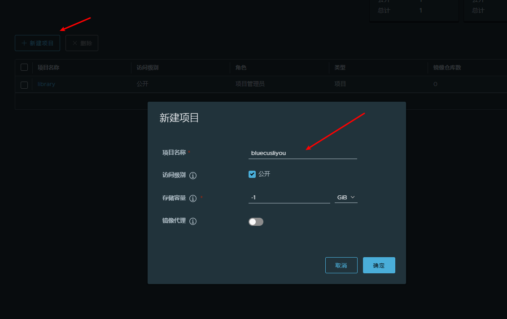

> 添加一个管理账号

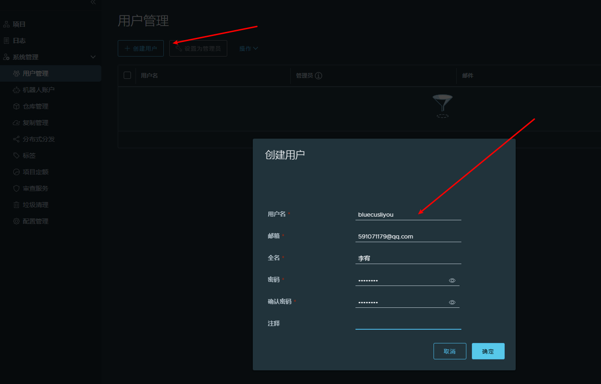

> 为测试项目添加创建的管理员
>

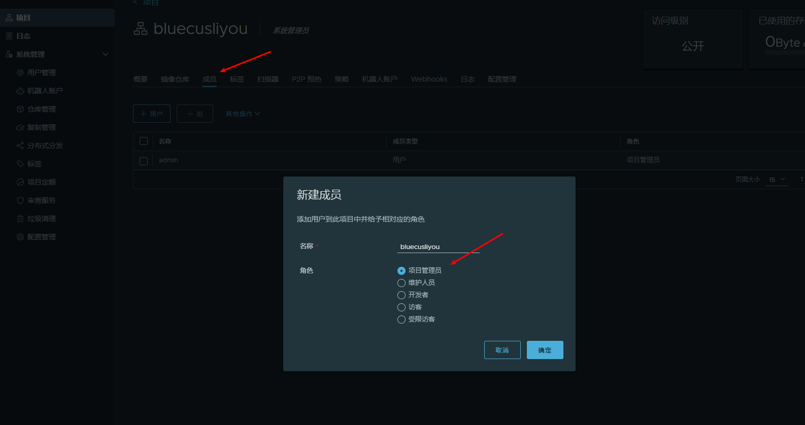

#### （4）客户端修改本地域名文件

这里的“your-server-ip”请换为你的仓库的服务器的IP地址

```bash
[root@blueculiyou ~]# vim /etc/hosts
[root@blueculiyou ~]# cat /etc/hosts
127.0.0.1 VM-0-13-centos VM-0-13-centos
127.0.0.1 localhost.localdomain localhost
127.0.0.1 localhost4.localdomain4 localhost4

::1 VM-0-13-centos VM-0-13-centos
::1 localhost.localdomain localhost
::1 localhost6.localdomain6 localhost6
your-server-ip registery
your-server-ip2 harbor.io
```

#### （5）客户端修改Docker的配置文件

为了让客户端服务器能够快速地访问搭建的镜像仓库，在客户端配置一下私有仓库的可信任设置让我们可以通过HTTP直接访问

```bash
[root@blueculiyou ~]# vim /etc/docker/daemon.json
[root@blueculiyou ~]# cat /etc/docker/daemon.json
{
        "insecure-registries": ["registery:5000","harbor.io"]
}
#重新加载配置文件
[root@blueculiyou ~]# systemctl daemon-reload
[root@blueculiyou ~]# systemctl restart docker
```

#### （6）客户端登陆服务器

```bash
[root@blueculiyou ~]# docker login harbor.io
Username: bluecusliyou
Password: 
WARNING! Your password will be stored unencrypted in /root/.docker/config.json.
Configure a credential helper to remove this warning. See
https://docs.docker.com/engine/reference/commandline/login/#credentials-store

Login Succeeded
[root@blueculiyou ~]# cat /root/.docker/config.json
{
        "auths": {
                "harbor.io": {
                        "auth": "Ymx1ZWN1c2xpeW91OkxpeW91MTIz"
                }
        }
}
```

#### （7）客户端上传镜像

```bash
#给镜像打标签，上传镜像到仓库
[root@blueculiyou ~]# docker tag nginx harbor.io/bluecusliyou/nginx:0.1
[root@blueculiyou ~]# docker push harbor.io/bluecusliyou/nginx:0.1
The push refers to repository [harbor.io/bluecusliyou/nginx]
2bed47a66c07: Pushed 
82caad489ad7: Pushed 
d3e1dca44e82: Pushed 
c9fcd9c6ced8: Pushed 
0664b7821b60: Pushed 
9321ff862abb: Pushed 
0.1: digest: sha256:4424e31f2c366108433ecca7890ad527b243361577180dfd9a5bb36e828abf47 size: 1570
```

图形界面查看上传的镜像

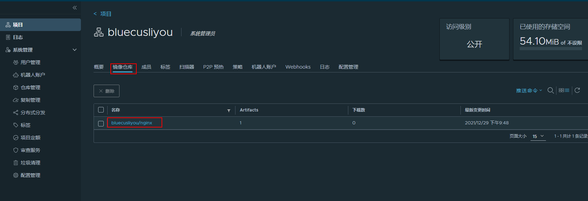

#### （8）另一台客户端下载镜像

```bash
#下载镜像
[root@blueculiyou ~]# docker images
REPOSITORY                          TAG       IMAGE ID       CREATED       SIZE
registery:5000/bluecusliyou/nginx   0.1       f652ca386ed1   3 weeks ago   141MB
nginx                               latest    f652ca386ed1   3 weeks ago   141MB
[root@blueculiyou ~]# docker pull harbor.io/bluecusliyou/nginx:0.1
0.1: Pulling from bluecusliyou/nginx
Digest: sha256:4424e31f2c366108433ecca7890ad527b243361577180dfd9a5bb36e828abf47
Status: Downloaded newer image for harbor.io/bluecusliyou/nginx:0.1
harbor.io/bluecusliyou/nginx:0.1
[root@blueculiyou ~]# docker images
REPOSITORY                          TAG       IMAGE ID       CREATED       SIZE
nginx                               latest    f652ca386ed1   3 weeks ago   141MB
harbor.io/bluecusliyou/nginx        0.1       f652ca386ed1   3 weeks ago   141MB
registery:5000/bluecusliyou/nginx   0.1       f652ca386ed1   3 weeks ago   141MB
```

## 九、Docker Compose

### 1、Docker Compose简介

开源地址：[https://github.com/docker/compose](https://github.com/docker/compose)

微服务架构的应用系统一般包含若干个微服务，每个微服务一般都会部署多个实例，如果每个微服务都要手动启停，那么效率之低，维护量之大可想而知。

Compose 是用于定义和运行`多容器`Docker应用程序的编排工具。通过 Compose可以轻松、高效的管理容器，您可以使用 YML 文件来配置应用程序需要的所有服务。然后使用一个命令，就可以从 YML 文件配置中创建并启动所有服务。

Compose创建的容器是基于Docker的，所以可以使用Docker进行管理，但是推荐使用声明式管理方式，也就是通过修改配置文件来管理。

### 2、Docker compose安装

```bash
# 方法一：
curl -L https://get.daocloud.io/docker/compose/releases/download/v2.2.2/docker-compose-`uname -s`-`uname -m` > /usr/local/bin/docker-compose
chmod +x /usr/local/bin/docker-compose

# 方法二：使用pip安装，版本可能比较旧
$ yum install python-pip python-dev
$ pip install docker-compose

# 方法三：作为容器安装
$ curl -L https://github.com/docker/compose/releases/download/1.25.5/run.sh > /usr/local/bin/docker-compose
$ chmod +x /usr/local/bin/docker-compose

# 方法四：离线安装
# 下载[docker-compose-Linux-x86_64](https://github.com/docker/compose/releases/download/1.8.1/docker-compose-Linux-x86_64)，然后重新命名添加可执行权限即可：
$ mv docker-compose-Linux-x86_64 /usr/local/bin/docker-compose;
$ chmod +x /usr/local/bin/docker-compose
# docker官方离线地址：https://dl.bintray.com/docker-compose/master/
```

如果要卸载直接删除文件

```bash
sudo rm /usr/local/bin/docker-compose
```

### 3、Docker-compose.yml配置详解

#### （1）顶级配置项

- version 定义了版本信息
- services 定义了服务的配置信息
- networks 定义了网络信息，提供给 services 中的 具体容器使用
- volumes 定义了卷信息，提供给 services 中的具体容器使用

格式：

```bash
version: "3.8" #这边的版本yml文件的版本号

services: # 容器
  servicename: # 服务名字，这个名字也是内部 bridge网络可以使用的 DNS name
    image: # 镜像的名字
    command: # 可选，如果设置，则会覆盖默认镜像里的 CMD命令
    environment: # 可选，相当于 docker run里的 --env
    volumes: # 可选，相当于docker run里的 -v
    networks: # 可选，相当于 docker run里的 --network
    ports: # 可选，相当于 docker run里的 -p
  servicename2:

volumes: # 可选，相当于 docker volume create

networks: # 可选，相当于 docker network create
```

yaml基础知识：

- 大小写敏感，缩进表示层级关系
- 缩进空格数不重要，相同层级左侧对齐即可。（不允许使用 tab 缩进！）
- 由冒号分隔的键值对表示对象；一组连词线开头的行，构成一个数组；字符串默认不使用引号

#### （2）version配置指令

YML文件版本兼容性 [详情请看官网文档](https://docs.docker.com/compose/compose-file/#reference-and-guidelines)

| **Compose file format** | **Docker Engine release** |
| :---------------------- | :------------------------ |
| Compose specification   | 19.03.0+                  |
| 3.8                     | 19.03.0+                  |
| 3.7                     | 18.06.0+                  |
| 3.6                     | 18.02.0+                  |
| 3.5                     | 17.12.0+                  |
| 3.4                     | 17.09.0+                  |
| 3.3                     | 17.06.0+                  |
| 3.2                     | 17.04.0+                  |
| 3.1                     | 1.13.1+                   |
| 3.0                     | 1.13.0+                   |
| 2.4                     | 17.12.0+                  |
| 2.3                     | 17.06.0+                  |
| 2.2                     | 1.13.0+                   |
| 2.1                     | 1.12.0+                   |
| 2.0                     | 1.10.0+                   |

#### （3）networks配置指令

> 未显示声明网络，容器会被加入app_default网络中

> 配置自定义网络

```yaml
version: '3'

services:
  proxy:
    build: ./proxy
    networks:
      - front
  db:
    image: postgres
    networks:
      - back

networks:
  front:
    driver: host
  back:
    driver: bridge
```

> 配置默认网络

```yaml
version: '3'

services:
  web:
    build: .
    ports:
      - "8000:8000"
  db:
    image: postgres

networks:
  default:
    driver: overlay
```

> 使用已存在的网络

```yaml
version: '3'

services:
  web:
    build: .
    ports:
      - "8000:8000"
  db:
    image: postgres

networks:
  default:
    external:
      name: my-pre-existing-network
```

#### （4）volumes配置指令

自定义卷供容器挂载使用

```yaml
version: '3'

services:
   db: 
     volumes:
       - db_data:/var/lib/mysql
   wordpress:
     volumes:
       - wordpress_files:/var/www/html
       
volumes:
  wordpress_files:
  db_data:
```

### 4、Service配置指令详解

#### container_name(指定容器名称)

```yaml
version: "3"

services:
  redis:
    image: redis:alpine
    container_name: redis_test
```

#### image(指定为镜像名称或镜像ID)

如果镜像在本地不存在，Compose 将会尝试拉取这个镜像。

```yaml
version: "3"

services:
  redis:
    image: redis:alpine
```

#### build(指定Dockerfile文件夹路径)

可以是绝对路径，或者相对docker-compose.yml文件的路径。 Compose将会自动构建镜像，然后使用镜像。

```yaml
version: '3'

services:
  webapp:    
    build: ./dir
```

如果同时指定了 image和 build，image 不在具有单独使用它的意义，而是指定了目前要构建的镜像的名称。

```yaml
version: '3'

services:
  webapp:    
    image: myimage
    build: ./dir
```

#### context(指定 Dockerfile文件夹路径)

也可以是到链接到git仓库的url，同时使用dockerfile指令指定Dockerfile文件名。

```yaml
version: '3'

services:
   webapp:       
      build:
        context: ./dir
        dockerfile: Dockerfile-name
```

#### command(覆盖容器启动默认命令)

```yaml
#写成shell形式
command: bundle exec thin -p 3000
#写成Dockerfile中的exec格式
command: [bundle, exec, thin, -p, 3000]
```

#### depends_on(容器依赖)

解决容器的依赖、启动先后的问题，只有依赖的启动完成了才能启动当前的服务。

```yaml
version: '3'

services:
  web:
    image: redis:alpine
    container_name: redis_test
    depends_on:
      - db
   db:   
     image: mysql:5.7
```

#### environment(设置环境变量)

可以使用数组或字典两种格式。只给定名称没有值的变量会自动获宿主机上的对应系统变量。

```yaml
environment:
  RACK_ENV: development
  SHOW: 'true'
  SESSION_SECRET:

environment:
  - RACK_ENV=development
  - SHOW=true
  - SESSION_SECRET
```

如果变量名称或者值中用到 true|false，yes|no 等表达布尔含义的词汇，最好放到引号里，避免 YAML 自动解析某些内容为对应的布尔语义。

```yaml
y|Y|yes|Yes|YES|n|N|no|No|NO|true|True|TRUE|false|False|FALSE|on|On|ON|off|Off|OFF
```

#### expose(暴露端口)

```yaml
expose:
 - "3000"
 - "8000"
```

#### ports(映射端口信息)

宿主端口：容器端口的格式，或者仅仅指定容器的端口，宿主将会随机选择端口。

```yaml
ports:
 - "3000"
 - "3000-3005"
 - "8000:8000"
 - "9090-9091:8080-8081"
 - "49100:22"
 - "127.0.0.1:8001:8001"
 - "127.0.0.1:5000-5010:5000-5010"
 - "6060:6060/udp"
```

注意：当使用 HOST:CONTAINER 格式来映射端口时，如果你使用的容器端口小于 60 并且没放到引号里，可能会得到错误结果，因为 YAML 会自动解析 xx:yy 这种数字格式为 60 进制。为避免出现这种问题，建议数字串都采用引号包括起来的字符串格式。

#### extra_hosts(指定额外host映射)

类似Docker中的–add-host参数，会在启动后的服务容器中/etc/hosts文件中添加host映射信息。

```yaml
extra_hosts:
 - "somehost:162.242.195.82"
 - "otherhost:50.31.209.229"
```

#### dns(自定义DNS服务器)

可以是一个值，也可以是一个列表。

```yaml
dns：8.8.8.8
dns：
    - 8.8.8.8   
      - 9.9.9.9
```

#### links(链接到其它服务中的容器)

```yaml
links:
    - db
    - db:database
    - redis
```

#### net(设置网络模式)

```yaml
net: "bridge"
net: "none"
net: "host"
```

#### pid(跟主机系统共享进程命名空间)

将PID模式设置为hos模式，跟主机系统共享进程命名空间。容器使用pid标签将能够访问和操纵其他容器和宿主机的名称空间。

```bash
pid: "host"
```

#### entrypoint(指定服务启动后执行的程序)

#### user(指定容器中运行应用的用户名)

#### working_dir(指定容器中工作目录)

#### restart(指定容器退出后的重启策略)

该命令对保持服务始终运行十分有效，在生产环境 中推荐配置为 always 或者 unless-stopped 。

```yaml
restart: always
```

#### alias(网络上此服务的别名)

同一网络上的其他容器可以使用服务名称或此别名连接到其中一个服务的容器。由于aliases是网络范围的，因此相同的服务可以在不同的网络上具有不同的别名。
注意：网络范围的别名可以多个容器共享，甚至可以多个服务共享。如果是，则无法保证名称解析到正确的容器。

```yaml
services:
  some-service:
    networks:
      some-network:
        aliases:
         - alias1
         - alias3
      other-network:
        aliases:
         - alias2
```

#### volumes(挂载宿主机路径到容器)

挂载一个目录或者一个已存在的数据卷容器，可以直接使用 [HOST:CONTAINER]格式，或者使用[HOST:CONTAINER:ro]格式，后者对于容器来说，数据卷是只读的，可以有效保护宿主机的文件系统。
Compose的数据卷指定路径可以是相对路径，使用 . 或者 .. 来指定相对目录。

```yaml
volumes:
  // 只是指定一个路径，Docker 会自动在创建一个数据卷（这个路径是容器内部的）。
  - /var/lib/mysql
  // 使用绝对路径挂载数据卷
  - /opt/data:/var/lib/mysql
  // 以 Compose 配置文件为中心的相对路径作为数据卷挂载到容器。
  - ./cache:/tmp/cache
  // 使用用户的相对路径（~/ 表示的目录是 /home/<用户目录>/ 或者 /root/）。
  - ~/configs:/etc/configs/:ro
  // 已经存在的命名的数据卷。
  - datavolume:/var/lib/mysql
```

#### volumes_from(从另一个服务或容器挂载)

```yaml
volumes_from:
   - service_name   
     - container_name
```

### 5、Docker-Compose常用命令

```bash
[root@bluecusliyou image-save]# docker-compose --help

Usage:  docker compose [OPTIONS] COMMAND

Docker Compose

Options:
      --ansi string                Control when to print ANSI control characters ("never"|"always"|"auto") (default "auto")
      --compatibility              Run compose in backward compatibility mode
      --env-file string            Specify an alternate environment file.
  -f, --file stringArray           Compose configuration files
      --profile stringArray        Specify a profile to enable
      --project-directory string   Specify an alternate working directory
                                   (default: the path of the Compose file)
  -p, --project-name string        Project name

Commands:
  build       Build or rebuild services
  convert     Converts the compose file to platform's canonical format
  cp          Copy files/folders between a service container and the local filesystem
  create      Creates containers for a service.
  down        Stop and remove containers, networks
  events      Receive real time events from containers.
  exec        Execute a command in a running container.
  images      List images used by the created containers
  kill        Force stop service containers.
  logs        View output from containers
  ls          List running compose projects
  pause       Pause services
  port        Print the public port for a port binding.
  ps          List containers
  pull        Pull service images
  push        Push service images
  restart     Restart containers
  rm          Removes stopped service containers
  run         Run a one-off command on a service.
  start       Start services
  stop        Stop services
  top         Display the running processes
  unpause     Unpause services
  up          Create and start containers
  version     Show the Docker Compose version information

Run 'docker compose COMMAND --help' for more information on a command.
```

#### docker-compose up(启动服务)

用于部署一个 Compose 应用。默认情况下该命令会读取名为 docker-compose.yml 或 docker-compose.yaml 的文件。当然用户也可以使用 -f 指定其他文件名。通常情况下，会使用 `-d` 参数令应用在后台启动。

用`docker compose`创建的容器，名字都会加入一个对应文件夹的名字，比如我当前所在的文件夹叫做`test`,而我在`yaml`文件中起的名字是`my-wordpress`。最终容器的名字就是`test_my-wordpress_1`。这个前缀其实是可以改的，比如我们希望前缀加上`bluecusliyou`。就可以使用`-p`参数指定。

```bash
docker-compose up [options] [--scale SERVICE=NUM...] [SERVICE...]
选项包括：
-d 在后台运行服务容器
-no-color 不是有颜色来区分不同的服务的控制输出
-no-deps 不启动服务所链接的容器
--force-recreate 强制重新创建容器，不能与-no-recreate同时使用
–no-recreate 如果容器已经存在，则不重新创建，不能与–force-recreate同时使用
–no-build 不自动构建缺失的服务镜像
–build 在启动容器前构建服务镜像
–abort-on-container-exit 停止所有容器，如果任何一个容器被停止，不能与-d同时使用
-t, –timeout TIMEOUT 停止容器时候的超时（默认为10秒）
–remove-orphans 删除服务中没有在compose文件中定义的容器
```

#### docker-compose ps(列出服务)

```bash
[root@bluecusliyou ~]# docker-compose ps --help

Usage:  docker compose ps [SERVICE...]

List containers

Options:
  -a, --all                  Show all stopped containers (including those created by the run command)
      --format string        Format the output. Values: [pretty | json] (default "pretty")
  -q, --quiet                Only display IDs
      --services             Display services
      --status stringArray   Filter services by status. Values: [paused | restarting | removing | running | dead | created | exited]
```

#### docker-compose create(为服务创建容器)

```bash
docker-compose create [options] [SERVICE...]
为服务创建容器。
选项包括：
–force-recreate：重新创建容器，即使配置和镜像没有改变，不兼容–no-recreate参数
–no-recreate：如果容器已经存在，不需要重新创建，不兼容–force-recreate参数
–no-build：不创建镜像，即使缺失
–build：创建容器前，生成镜像
```

#### docker-compose run(在指定服务上执行命令)

```bash
docker-compose run [options] [-v VOLUME...] [-p PORT...] [-e KEY=VAL...] SERVICE [COMMAND] [ARGS...]
在指定服务上执行命令。
docker-compose run ubuntu ping www.baidu.com
在指定容器上执行一个ping命令。
```

#### docker-compose scale(指定服务运行的容器个数)

```bash
docker-compose scale web=3 db=2
指定服务运行的容器个数。通过service=num的参数来设置数量
```

#### docker-compose exec(进入服务的容器)

```bash
docker-compose exec [options] SERVICE COMMAND [ARGS...]
选项包括：
-d 分离模式，后台运行命令。
–privileged 获取特权。
–user USER 指定运行的用户。
-T 禁用分配TTY，默认docker-compose exec分配TTY。
–index=index，当一个服务拥有多个容器时，可通过该参数登陆到该服务下的任何容器，例如：docker-compose exec –index=1 web /bin/bash ，web服务中包含多个容器
```

#### docker-compose start(启动服务)

#### docker-compose pause(暂停一个服务)

#### docker-compose uppause(恢复暂停状态中的服务)

#### docker-compose kill(强制停止服务)

```bash
docker-compose kill [options] [SERVICE...]
通过发送SIGKILL信号来强制停止服务容器。
支持通过-s参数来指定发送的信号，例如通过如下指令发送SIGINT信号：
docker-compose kill -s SIGINT
```

#### docker-compose stop(停止服务)

```bash
docker-compose stop [options] [SERVICE...]
选项包括
-t, –timeout TIMEOUT 停止容器时候的超时（默认为10秒）
docker-compose stop
停止正在运行的容器，可以通过docker-compose start 再次启动
```

#### docker-compose restart(重启服务)

如果用户在停止该应用后对其进行了变更，那么变更的内容不会反映在重启后的应用中，这时需要重新部署应用使变更生效。

```bash
docker-compose restart [options] [SERVICE...]
重启项目中的服务。
选项包括：
-t, –timeout TIMEOUT，指定重启前停止容器的超时（默认为10秒）
docker-compose restart
重启项目中的服务
```

#### docker-compose down(停止并删除服务)

```bash
docker-compose down [options]
停止和删除容器，它会删除容器和网络，但是不会删除卷和镜像。
选项包括：
–rmi type，删除镜像，类型必须是：all，删除compose文件中定义的所有镜像；local，删除镜像名为空的镜像
-v, –volumes，删除已经在compose文件中定义的和匿名的附在容器上的数据卷
–remove-orphans，删除服务中没有在compose中定义的容器
docker-compose down
停用移除所有容器以及网络相关
```

#### docker-compose rm(删除服务)

用于删除已停止的 Compose 应用。它会删除容器和网络，但是不会删除卷和镜像。

```bash
docker-compose rm [options] [SERVICE...]
删除所有（停止状态的）服务容器，它会删除容器和网络，但是不会删除卷和镜像。
选项包括：
–f, –force，强制直接删除，包括非停止状态的容器
-v，删除容器所挂载的数据卷
docker-compose rm
删除所有（停止状态的）服务容器。推荐先执行docker-compose stop命令来停止容器。
```

#### docker-compose pull(拉取服务依赖的镜像)

```bash
docker-compose pull [options] [SERVICE...]
拉取服务依赖的镜像。
选项包括：
–ignore-pull-failures，忽略拉取镜像过程中的错误
–parallel，多个镜像同时拉取
–quiet，拉取镜像过程中不打印进度信息
docker-compose pull
拉取服务依赖的镜像
```

#### docker-compose push(推送服务依赖的镜像)

```bash
docker-compose push [options] [SERVICE...]
推送服务依赖的镜像。
选项包括：
–ignore-push-failures 忽略推送镜像过程中的错误
```

#### docker-compose bulid(构建服务依赖的镜像)

```bash
docker-compose build [options] [--build-arg key=val...] [SERVICE...]
构建服务依赖的镜像。
选项包括：
–compress 通过gzip压缩构建上下环境
–force-rm 删除构建过程中的临时容器
–no-cache 构建镜像过程中不使用缓存
–pull 始终尝试通过拉取操作来获取更新版本的镜像
-m, –memory MEM为构建的容器设置内存大小
–build-arg key=val为服务设置build-time变量
服务容器一旦构建后，将会带上一个标记名。可以随时在项目目录下运行docker-compose build来重新构建服务
```

#### docker-compose logs(查看应用容器日志)

```bash
docker-compose logs [options] [SERVICE...]
查看服务容器的输出。默认情况下，docker-compose将对不同的服务输出使用不同的颜色来区分。可以通过–no-color来关闭颜色。
docker-compose logs
查看服务容器的输出
-f 跟踪日志输出
```

#### docker-compose config(查看compose文件配置)

```
docker-compose config [options]
验证并查看compose文件配置。
选项包括：
–resolve-image-digests 将镜像标签标记为摘要
-q, –quiet 只验证配置，不输出。 当配置正确时，不输出任何内容，当文件配置错误，输出错误信息
–services 打印服务名，一行一个
–volumes 打印数据卷名，一行一个
```

#### docker-compose port(显示容器端口映射的端口)

```bash
docker-compose port [options] SERVICE PRIVATE_PORT
显示某个容器端口所映射的公共端口。
选项包括：
–protocol=proto，指定端口协议，TCP（默认值）或者UDP
–index=index，如果同一服务存在多个容器，指定命令对象容器的序号（默认为1）
```

### 6、实战：wordpress

#### （1）编写docker-compose.yaml文件

```yaml
version: '3.3'           #compose文件版本

services:
   db:                   # 服务1：db
     image: mysql:5.7    # 使用镜像 mysql：5.7版本
     volumes:
       - db_data:/var/lib/mysql   # 数据持久化
     restart: always     # 容器服务宕机后总是重启
     environment:        # 环境配置
       MYSQL_ROOT_PASSWORD: somewordpress
       MYSQL_DATABASE: wordpress
       MYSQL_USER: wordpress
       MYSQL_PASSWORD: wordpress

   wordpress:          # 服务2：wordpress
     depends_on:       # wordpress服务启动时依赖db服务，所以会自动先启动db服务
       - db
     image: wordpress:latest    # 使用镜像 wordpress：latest最新版
     volumes:
       - wordpress_files:/var/www/html   # 数据持久化
     ports:
       - "8000:80"          #端口映射8000:80
     restart: always
     environment:        # 环境
       WORDPRESS_DB_HOST: db:3306     # wordpress连接db的3306端口
       WORDPRESS_DB_USER: wordpress    # wordpress的数据库用户为wordpress
       WORDPRESS_DB_PASSWORD: wordpress   # wordpress的数据库密码是wordpress
       WORDPRESS_DB_NAME: wordpress    # wordpress的数据库名字是wordpress
volumes:
  wordpress_files:
  db_data:
```

#### （2）运行docker-compose.yaml

在docker-compose.yaml文件夹下运行命令

```bash
[root@bluecusliyou docker-compose-wordpress]# docker-compose up -d
[+] Running 2/2
 ⠿ Container docker-compose-wordpress-db-1         Started                 0.7s
 ⠿ Container docker-compose-wordpress-wordpress-1  Started                 1.4s 
```

#### （3）首次配置界面

地址：`IP:8000`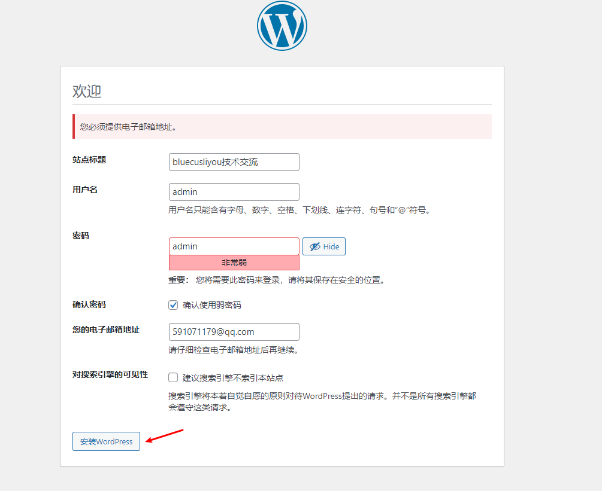

#### （4）后台管理界面

地址：`IP:8000/wp-admin/`

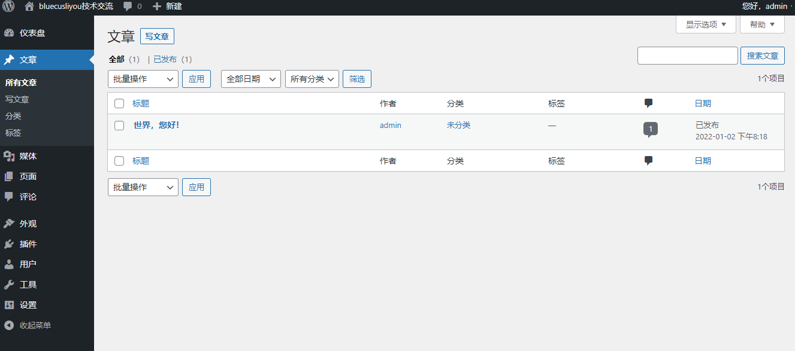

#### （5）前端界面

地址：`IP:8000`


## 十、Docker Swarm

### 1、Docker Swarm简介

#### （1）Docker Swarm简介

Docker Swarm 是 Docker 的集群管理工具，在之前我们只是在一台机器来进行docker的管理。

但是有时容器并不一定都在一台主机上，如果是分布式的处于多台主机上，这时就可以借助于Swarm，Swarm是Docker自带的编排工具，自 Docker 1.12 版本之后，它已经完全集成在 Docker 引擎中，只要你安装了Docker就会存在Docker Swarm工具。

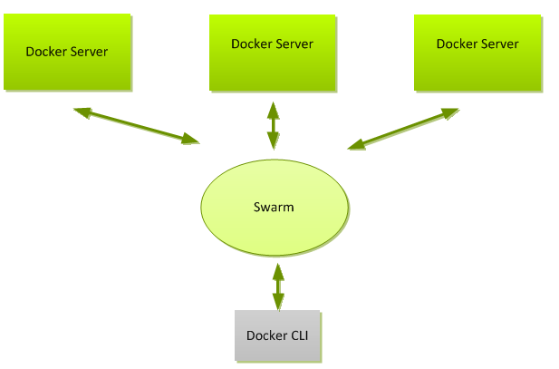

#### （2）manager和worker节点

Swarm中有两大类节点，一类是manager节点，另一类是worker节点，manager节点是对服务的创建和调度，worker节点主要是运行容器服务，当然manager节点也是可以运行的。

manager节点状态、信息是用Raft consensus group的网络进行通信同步的，而worker之间的通信依靠的是Gossip network做到的。

管理节点负责集群控制，进行诸如监控集群状态、分发任务至工作节点等操作。工作节点接收来自管理节点的任务并执行。

Swarm 的配置和状态信息保存在一套位于所有管理节点上的分布式 etcd 数据库中。该数据库运行于内存中，并保持数据的最新状态。关于该数据库最棒的是，它几乎不需要任何配置，作为 Swarm 的一部分被安装，无须管理。  

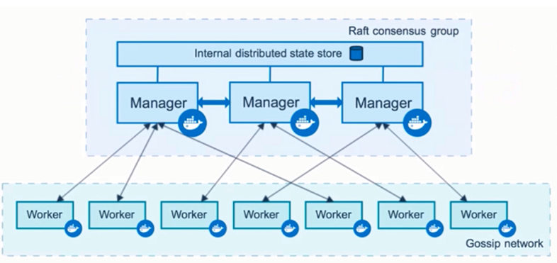

#### （3）服务service

另外一个重要的概念就是service，我们可以在一个manager节点上创建一个服务，但是可以根据这一个服务创建多个容器的任务，这些容器任务运行在不同的节点上。

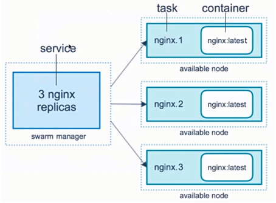

#### （4）单引擎模式和Swarm 模式

不包含在任何 Swarm 中的 Docker 节点，称为运行于单引擎（Single-Engine）模式。一旦被加入 Swarm 集群，则切换为 Swarm 模式，如下图所示。

在单引擎模式下的 Docker 主机上运行`docker swarm init`将其切换到 Swarm 模式，并创建一个新的 Swarm，将自身设置为 Swarm 的第一个管理节点。

更多的节点可以作为管理节点或工作节点加入进来。这一操作也会将新加入的节点切换为 Swarm 模式。

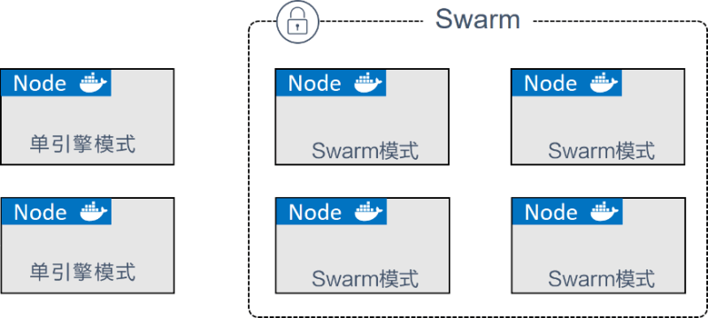

#### （5）集群安全性

Swarm 默认内置有加密的分布式集群存储（encrypted distributed cluster store）、加密网络（Encrypted Network）、公用TLS（Mutual TLS）、安全集群接入令牌 Secure Cluster Join Token）以及一套简化数字证书管理的 PKI（Public Key Infrastructure）。

  关于集群管理，最大的挑战在于保证其安全性。搭建 Swarm 集群时将不可避免地使用 TLS，因为它被 Swarm 紧密集成。

Swarm 使用 TLS 进行通信加密、节点认证和角色授权。自动密钥轮换（Automatic Key Rotation）更是锦上添花！其在后台默默进行，用户甚至感知不到这一功能的存在。  

#### （6）如何进行Swarm集群的搭建

- 在swarm模式下初始化一个Swarm集群，并且将当前主机加入到该集群作为manager节点
- 加入其它节点到该集群中
- 部署service到该集群中

### 2、Docker Swarm集群搭建

#### （1）集群创建命令

> 集群管理命令

```bash
[root@bluecusliyou ~]# docker swarm --help

Usage:    docker swarm COMMAND

Manage Swarm

Commands:
  ca          Display and rotate the root CA
  init        Initialize a swarm
  join        Join a swarm as a node and/or manager
  join-token  Manage join tokens
  leave       Leave the swarm
  unlock      Unlock swarm
  unlock-key  Manage the unlock key
  update      Update the swarm

Run 'docker swarm COMMAND --help' for more information on a command.
```

> 节点管理命令

```bash
[root@bluecusliyou ~]# docker node --help

Usage:  docker node COMMAND

Manage Swarm nodes

Commands:
  demote      Demote one or more nodes from manager in the swarm
  inspect     Display detailed information on one or more nodes
  ls          List nodes in the swarm
  promote     Promote one or more nodes to manager in the swarm
  ps          List tasks running on one or more nodes, defaults to current node
  rm          Remove one or more nodes from the swarm
  update      Update a node

Run 'docker node COMMAND --help' for more information on a command.
```

#### （2）集群搭建前提

每个节点都需要安装 Docker，并且能够与 Swarm 的其他节点通信。

在网络方面，需要在路由器和防火墙中开放如下端口。

- 2377/tcp：用于客户端与 Swarm 进行安全通信。
- 7946/tcp 与 7946/udp：用于控制面 gossip 分发。
- 4789/udp：用于基于 VXLAN 的覆盖网络。

#### （3）初始化一个全新的Swarm集群

  `docker swarm init`会通知 Docker 来初始化一个新的 Swarm，并将自身设置为第一个管理节点，作为leader。同时也会使该节点开启 Swarm 模式，且生成worker节点加入集群的命令。

`--advertise-addr`指定其他节点用来连接到当前管理节点的 IP 和端口。这一属性是可选的，当节点上有多个 IP 时，可以用于指定使用哪个IP。此外，还可以用于指定一个节点上没有的 IP，比如一个负载均衡的 IP。

`--listen-addr`指定用于承载 Swarm 流量的 IP 和端口。其设置通常与 --advertise-addr 相匹配，但是当节点上有多个 IP 的时候，可用于指定具体某个 IP。并且，如果 --advertise-addr 设置了一个远程 IP 地址（如负载均衡的IP地址），该属性也是需要设置的。建议执行命令时总是使用这两个属性来指定具体 IP 和端口。

Swarm 模式下的操作默认运行于 2337 端口。虽然它是可配置的，但 2377/tcp 是用于客户端与 Swarm 进行安全（HTTPS）通信的约定俗成的端口配置。  

```bash
[root@manager1 ~]# docker swarm init --advertise-addr 192.168.0.108:2377
Swarm initialized: current node (sz7bfcmk637qhqfvzqhdnk3t2) is now a manager.

To add a worker to this swarm, run the following command:

    docker swarm join --token SWMTKN-1-0zzpk3xqq2ykb5d5jcd6hqeimckhrg5qu82xs7nw2wwnwyjmzg-9tmof9880m9r92vz5rygaa42e 192.168.0.108:2377

To add a manager to this swarm, run 'docker swarm join-token manager' and follow the instructions.
```

#### （4）其他manager和worker节点加入集群

初始化结束后，重新生成节点添加的token命令，后面的参数是manager就是生成manager节点添加的命令，worker就是生成worker节点添加的命令。

工作节点和管理节点的接入命令中使用的接入 Token是不同的。因此，一个节点是作为工作节点还是管理节点接入，完全依赖于使用了哪个 Token。接入 Token 应该被妥善保管，因为这是将一个节点加入 Swarm 的唯一所需！

```bash
#给manager节点加入集群使用
[root@manager1 ~]# docker swarm join-token manager
To add a manager to this swarm, run the following command:

    docker swarm join --token SWMTKN-1-0zzpk3xqq2ykb5d5jcd6hqeimckhrg5qu82xs7nw2wwnwyjmzg-9tmof9880m9r92vz5rygaa42e 192.168.0.108:2377
#给worker节点加入集群使用
[root@manager1 ~]# docker swarm join-token worker
To add a worker to this swarm, run the following command:

    docker swarm join --token SWMTKN-1-0zzpk3xqq2ykb5d5jcd6hqeimckhrg5qu82xs7nw2wwnwyjmzg-9tmof9880m9r92vz5rygaa4aa 192.168.0.108:2377
```

--advertise-addr 与 --listen-addr 属性是可选的。在网络配置方面，请尽量明确指定相关参数，这是一种好的实践。

另外再开启worker1服务器，将这台机器加入到swarm中成为worker节点

```bash
[root@worker1 ~]#docker swarm join --token SWMTKN-1-0zzpk3xqq2ykb5d5jcd6hqeimckhrg5qu82xs7nw2wwnwyjmzg-9tmof9880m9r92vz5rygaa42e 192.168.0.108:2377 --advertise-addr 192.168.0.109:2377
This node joined a swarm as a worker.
```

另外再开启worker2服务器，将这台机器加入到swarm中成为worker节点

```bash
[root@worker2 ~]#docker swarm join --token SWMTKN-1-0zzpk3xqq2ykb5d5jcd6hqeimckhrg5qu82xs7nw2wwnwyjmzg-9tmof9880m9r92vz5rygaa42e 192.168.0.108:2377 --advertise-addr 192.168.0.110:2377
This node joined a swarm as a worker.
```

另外再开启manager2服务器，将这台机器加入到swarm中成为manager节点

```bash
[root@manager2 ~]#docker swarm join --token SWMTKN-1-0zzpk3xqq2ykb5d5jcd6hqeimckhrg5qu82xs7nw2wwnwyjmzg-9tmof9880m9r92vz5rygaa4aa 192.168.0.108:2377 --advertise-addr 192.168.0.111:2377
This node joined a swarm as a manager.
```

另外再开启manager3服务器，将这台机器加入到swarm中成为manager节点

```bash
[root@manager3 ~]#docker swarm join --token SWMTKN-1-0zzpk3xqq2ykb5d5jcd6hqeimckhrg5qu82xs7nw2wwnwyjmzg-9tmof9880m9r92vz5rygaa4aa 192.168.0.108:2377 --advertise-addr 192.168.0.112:2377
This node joined a swarm as a manager.
```

#### （5）查看集群中的节点状态

查看节点状态只能在manager节点机器上查看，普通节点无法执行查看，带*的就是本机。

manager status是Leader和Reachable的是manager节点，其他没有值的是worker节点。

```bash
[root@manager1 ~]# docker node ls
ID                            HOSTNAME   STATUS    AVAILABILITY   MANAGER STATUS   ENGINE VERSION
4lzeh497bcpqlkd7hjwne8k0p *   manager1   Ready     Active         Leader           20.10.12
oqvua8epbvhjl9ikqj0igsim9     manager2   Ready     Active         Reachable        20.10.12
nllsbxz3sv5n3tn2zakoa07s0     manager3   Ready     Active         Reachable        20.10.12
giv1k7vci8znkqizvakv899pc     worker1    Ready     Active                          20.10.12
m9xdyriql28urfiep116ni6wj     worker2    Ready     Active                          20.10.12
```

### 3、Docker Swarm集群管理

#### （1）集群中移除节点

> 集群中的manager或worker节点执行命令

```bash
[root@worker1 ~]# docker swarm leave -f
Node left the swarm.
```

> manager节点执行命令

worker节点执行完命令，节点的status会变成down，然后才能删除这个节点，状态是ready的节点无法删除

```bash
[root@manager1 ~]# docker node ls
ID                            HOSTNAME   STATUS    AVAILABILITY   MANAGER STATUS   ENGINE VERSION
w3o3qywuwjqcq64igexbln881 *   manager1   Ready     Active         Leader           20.10.12
jfs3h490ikpc13i9hv55x29eg     manager2   Ready     Active         Reachable        20.10.12
swa8o3cy7zg42tza0sy6gwl9i     manager3   Ready     Active         Reachable        20.10.12
06rckc92r53ssksfjx46uskyi     worker1    Down      Active                          20.10.12
mtny8rj6xkeqwabwsj4jhgok9     worker2    Ready     Active                          20.10.12
[root@manager1 ~]# docker node rm worker1
worker1
[root@manager1 ~]# docker node ls
ID                            HOSTNAME   STATUS    AVAILABILITY   MANAGER STATUS   ENGINE VERSION
w3o3qywuwjqcq64igexbln881 *   manager1   Ready     Active         Leader           20.10.12
jfs3h490ikpc13i9hv55x29eg     manager2   Ready     Active         Reachable        20.10.12
swa8o3cy7zg42tza0sy6gwl9i     manager3   Ready     Active         Reachable        20.10.12
mtny8rj6xkeqwabwsj4jhgok9     worker2    Ready     Active                          20.10.12
```

#### （2）更新节点的可获得状态

节点状态是Active，表示可以接受新的任务分配，如果是Drain，表示不接受新的任务分配，不影响集群的运行，集群的负载能力有所下降。扩展的节点会转移到其他节点上，保持运行的容器数量保持不变。

```bash
[root@manager1 ~]# docker node ls
ID                            HOSTNAME   STATUS    AVAILABILITY   MANAGER STATUS   ENGINE VERSION
w3o3qywuwjqcq64igexbln881 *   manager1   Ready     Active         Leader           20.10.12
jfs3h490ikpc13i9hv55x29eg     manager2   Ready     Active         Reachable        20.10.12
swa8o3cy7zg42tza0sy6gwl9i     manager3   Ready     Active         Reachable        20.10.12
djjv90fb8n4qpjpu6cogfiinz     worker1    Ready     Active                          20.10.12
mtny8rj6xkeqwabwsj4jhgok9     worker2    Ready     Active                          20.10.12
[root@manager1 ~]# docker node update --availability drain worker1
worker1
[root@manager1 ~]# docker node ls
ID                            HOSTNAME   STATUS    AVAILABILITY   MANAGER STATUS   ENGINE VERSION
w3o3qywuwjqcq64igexbln881 *   manager1   Ready     Active         Leader           20.10.12
jfs3h490ikpc13i9hv55x29eg     manager2   Ready     Active         Reachable        20.10.12
swa8o3cy7zg42tza0sy6gwl9i     manager3   Ready     Active         Reachable        20.10.12
djjv90fb8n4qpjpu6cogfiinz     worker1    Ready     Drain                           20.10.12
mtny8rj6xkeqwabwsj4jhgok9     worker2    Ready     Active                          20.10.12
[root@manager1 ~]# docker node update --availability active worker1
worker1
[root@manager1 ~]# docker node ls
ID                            HOSTNAME   STATUS    AVAILABILITY   MANAGER STATUS   ENGINE VERSION
w3o3qywuwjqcq64igexbln881 *   manager1   Ready     Active         Leader           20.10.12
jfs3h490ikpc13i9hv55x29eg     manager2   Ready     Active         Reachable        20.10.12
swa8o3cy7zg42tza0sy6gwl9i     manager3   Ready     Active         Reachable        20.10.12
djjv90fb8n4qpjpu6cogfiinz     worker1    Ready     Active                          20.10.12
mtny8rj6xkeqwabwsj4jhgok9     worker2    Ready     Active                          20.10.12
```

#### （3）Swarm 管理器高可用性（HA）

Swarm 的管理节点内置有对 HA 的支持。这意味着，即使一个或多个节点发生故障，剩余管理节点也会继续保证 Swarm 的运转。

从技术上来说，Swarm 实现了一种主从方式的多管理节点的 HA。这意味着，即使你可能有多个管理节点，也总是仅有一个节点处于活动状态。

通常处于活动状态的管理节点被称为“主节点”（leader），而主节点也是唯一一个会对 Swarm 发送控制命令的节点。也就是说，只有主节点才会变更配置，或发送任务到工作节点。如果一个备用（非活动）管理节点接收到了 Swarm 命令，则它会将其转发给主节点。

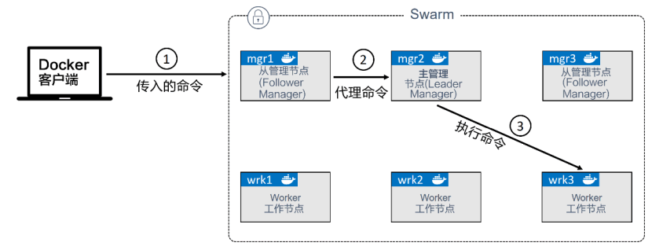

> 锁定 Swarm

一个旧的管理节点重新接入 Swarm 会自动解密并获得 Raft 数据库中长时间序列的访问权，这会带来安全隐患。

进行备份恢复可能会抹掉最新的 Swarm 配置。为了规避以上问题，Docker 提供了自动锁机制来锁定 Swarm，这会强制要求重启的管理节点在提供一个集群解锁码之后才有权重新接入集群。  

通过在执行 `docker swarm init` 命令来创建一个新的 Swarm 集群时传入 --autolock 参数可以直接启用锁。

对于已经搭建的Swarm 集群，这时也可以使用 `docker swarm update` 命令来启用锁。在某个 Swarm 管理节点上运行如下命令。请确保将解锁码妥善保管在安全的地方！

```bash
[root@manager1 ~]# docker swarm update --autolock=true
Swarm updated.
To unlock a swarm manager after it restarts, run the `docker swarm unlock`
command and provide the following key:

    SWMKEY-1-UNq+ZHjM0DpBDSFDrAMrBhq/kDJZXohG3d6wxcH91dE

Please remember to store this key in a password manager, since without it you
will not be able to restart the manager.
```

重启某一个管理节点，尽管 Docker 服务已经重启，该管理节点仍然未被允许重新接入集群。如果重启的节点是Leader节点，Leader节点会自动转移到其他manager节点上。

```bash
[root@manager2 ~]# systemctl restart docker
[root@manager2 ~]# docker node ls
Error response from daemon: Swarm is encrypted and needs to be unlocked before it can be used. Please use "docker swarm unlock" to unlock it.
```

其他管理节点执行 `docker node ls` 命令，会发现重启的管理节点会显示 down 以及 unreachable。

```bash
[root@manager1 ~]# docker node ls
ID                            HOSTNAME   STATUS    AVAILABILITY   MANAGER STATUS   ENGINE VERSION
w3o3qywuwjqcq64igexbln881 *   manager1   Ready     Active         Leader           20.10.12
jfs3h490ikpc13i9hv55x29eg     manager2   Down      Active         Unreachable      20.10.12
swa8o3cy7zg42tza0sy6gwl9i     manager3   Ready     Active         Reachable        20.10.12
djjv90fb8n4qpjpu6cogfiinz     worker1    Ready     Active                          20.10.12
mtny8rj6xkeqwabwsj4jhgok9     worker2    Ready     Active                          20.10.12
```

重启的节点上执行 `docker swarm unlock` 命令来为重启的管理节点解锁 Swarm，需要提供解锁码。该节点将重新接入Swarm，并且再次执行 `docker node ls` 命令会显示 ready 和 reachable。

```bash
[root@manager2 ~]# docker swarm unlock
Please enter unlock key: 
[root@manager2 ~]# docker node ls
ID                            HOSTNAME   STATUS    AVAILABILITY   MANAGER STATUS   ENGINE VERSION
w3o3qywuwjqcq64igexbln881     manager1   Ready     Active         Leader           20.10.12
jfs3h490ikpc13i9hv55x29eg *   manager2   Ready     Active         Reachable        20.10.12
swa8o3cy7zg42tza0sy6gwl9i     manager3   Ready     Active         Reachable        20.10.12
djjv90fb8n4qpjpu6cogfiinz     worker1    Ready     Active                          20.10.12
mtny8rj6xkeqwabwsj4jhgok9     worker2    Ready     Active                          20.10.12
```

### 4、Docker Swarm集群服务搭建

服务是自Docker1.12 后新引入的概念，并且仅适用于Swarm模式。

使用服务仍能够配置大多数熟悉的容器属性，比如容器名、端口映射、接入网络和镜像。此外还增加了额外的特性，比如可以声明应用服务的期望状态，将其告知 Docker 后，Docker 会负责进行服务的部署和管理。 

#### （1）服务创建命令

```bash
[root@bluecusliyou ~]# docker service --help

Usage:    docker service COMMAND

Manage services

Commands:
  create      Create a new service
  inspect     Display detailed information on one or more services
  logs        Fetch the logs of a service or task
  ls          List services
  ps          List the tasks of one or more services
  rm          Remove one or more services
  rollback    Revert changes to a service's configuration
  scale       Scale one or multiple replicated services
  update      Update a service

Run 'docker service COMMAND --help' for more information on a command.
```

#### （2）创建一个新的服务

使用 `docker service create` 命令创建一个新的服务。  该命令与熟悉的 `docker run` 命令的许多参数是相同的。使用 --name 和 -p 定义服务的方式，与单机启动容器的定义方式是一样的。

`--name` 将服务名称设定为nginx_swarm。`-p`将每个节点上的8566端口映射到服务副本内部的80端口。`--replicas`告知 Docker应该总是有6个此服务的副本。

主管理节点会在 Swarm 中实例化6个副本，管理节点也会作为工作节点运行。相关各工作节点或管理节点会拉取镜像，然后启动一个运行在8566端口上的容器。

所有的服务都会被Swarm持续监控，Swarm 会在后台进行轮训检查（Reconciliation Loop），来持续比较服务的实际状态和期望状态是否一致。如果一致，则无须任何额外操作；如果不一致，Swarm 会使其一致。

服务的默认复制模式（Replication Mode）是副本模式（replicated），这种模式会部署期望数量的服务副本，并尽可能均匀地将各个副本分布在整个集群中。另一种模式是全局模式（global），在这种模式下，每个节点上仅运行一个副本。可以通过给 `docker service create` 命令传递 --mode global 参数来设置。  

```bash
[root@manager1 ~]# docker service create -d --name nginx_swarm -p 8566:80 --replicas 6 nginx
7px0w1u46bxuywuf3lq7gqvpa
overall progress: 6 out of 6 tasks 
1/6: running   [==================================================>] 
2/6: running   [==================================================>] 
3/6: running   [==================================================>] 
4/6: running   [==================================================>] 
5/6: running   [==================================================>] 
6/6: running   [==================================================>] 
verify: Service converged
```

#### （3）查看服务部署情况

```bash
#查看集群中服务列表
[root@manager1 ~]# docker service ls
ID             NAME          MODE         REPLICAS   IMAGE          PORTS
7px0w1u46bxu   nginx_swarm   replicated   6/6        nginx:latest   *:8566->80/tcp
#查看具体服务的容器实例
[root@manager1 ~]# docker service ps nginx_swarm
ID             NAME            IMAGE          NODE       DESIRED STATE   CURRENT STATE           ERROR     PORTS
j70a563za8da   nginx_swarm.1   nginx:latest   worker1    Running         Running 9 minutes ago             
jb69xwxk8zxi   nginx_swarm.2   nginx:latest   worker2    Running         Running 9 minutes ago             
4pre2ed32v0z   nginx_swarm.3   nginx:latest   manager2   Running         Running 9 minutes ago             
6exvevlbaq0v   nginx_swarm.4   nginx:latest   manager3   Running         Running 9 minutes ago             
y6aajhqpi6fc   nginx_swarm.5   nginx:latest   manager3   Running         Running 9 minutes ago             
qskh35pqdrsd   nginx_swarm.6   nginx:latest   manager1   Running         Running 9 minutes ago
#查看具体服务的详情信息，--pretty 参数，限制输出中仅包含最感兴趣的内容，并以易于阅读的格式打印出来
[root@manager1 ~]# docker service inspect --pretty nginx_swarm

ID:             7px0w1u46bxuywuf3lq7gqvpa
Name:           nginx_swarm
Service Mode:   Replicated
 Replicas:      6
Placement:
UpdateConfig:
 Parallelism:   1
 On failure:    pause
 Monitoring Period: 5s
 Max failure ratio: 0
 Update order:      stop-first
RollbackConfig:
 Parallelism:   1
 On failure:    pause
 Monitoring Period: 5s
 Max failure ratio: 0
 Rollback order:    stop-first
ContainerSpec:
 Image:         nginx:latest@sha256:0d17b565c37bcbd895e9d92315a05c1c3c9a29f762b011a10c54a66cd53c9b31
 Init:          false
Resources:
Endpoint Mode:  vip
Ports:
 PublishedPort = 8566
  Protocol = tcp
  TargetPort = 80
  PublishMode = ingress
```

### 5、Docker Swarm集群服务管理

#### （1）删除集群服务

请谨慎使用 `docker service rm` 命令，因为它在删除所有服务副本时并不会进行确认。

```bash
[root@bluecusliyou ~]# docker service rm nginx_swarm
nginx_swam
[root@bluecusliyou ~]# docker service ls
ID        NAME      MODE      REPLICAS   IMAGE     PORTS
```

#### （2）服务的扩缩容

服务副本在各个节点上是均衡分布的，在底层实现上，Swarm 执行了一个调度算法，默认将副本尽量均衡分配给 Swarm 中的所有节点。各节点分配的副本数是平均分配的，并未将 CPU 负载等指标考虑在内。

```bash
#开启一个服务，三个副本
[root@manager1 ~]# docker service create --name nginx_swarm -p 8566:80 --replicas 3 nginx
cfx1kn6ogu9fk9lt5xkl5xqmb
overall progress: 3 out of 3 tasks 
1/3: running   [==================================================>] 
2/3: running   [==================================================>] 
3/3: running   [==================================================>] 
verify: Service converged 
#查看具体服务的容器实例
[root@manager1 ~]# docker service ps nginx_swarm
ID             NAME            IMAGE          NODE       DESIRED STATE   CURRENT STATE                ERROR     PORTS
idg8nh6gtevo   nginx_swarm.1   nginx:latest   manager2   Running         Running about a minute ago             
lfyb0hfcgd0s   nginx_swarm.2   nginx:latest   manager3   Running         Running about a minute ago             
ug2c06495cv6   nginx_swarm.3   nginx:latest   worker2    Running         Running about a minute ago
#扩容到6个副本
[root@manager1 ~]# docker service scale nginx_swarm=6
nginx_swarm scaled to 6
overall progress: 6 out of 6 tasks 
1/6: running   [==================================================>] 
2/6: running   [==================================================>] 
3/6: running   [==================================================>] 
4/6: running   [==================================================>] 
5/6: running   [==================================================>] 
6/6: running   [==================================================>] 
verify: Service converged 
[root@manager1 ~]# docker service ps nginx_swarm
ID             NAME            IMAGE          NODE       DESIRED STATE   CURRENT STATE            ERROR     PORTS
idg8nh6gtevo   nginx_swarm.1   nginx:latest   manager2   Running         Running 3 minutes ago              
lfyb0hfcgd0s   nginx_swarm.2   nginx:latest   manager3   Running         Running 3 minutes ago              
ug2c06495cv6   nginx_swarm.3   nginx:latest   worker2    Running         Running 3 minutes ago              
bfse0t7ho5e6   nginx_swarm.4   nginx:latest   worker1    Running         Running 20 seconds ago             
4pbw6cmvb879   nginx_swarm.5   nginx:latest   worker1    Running         Running 20 seconds ago             
evcun2vt3a5i   nginx_swarm.6   nginx:latest   manager1   Running         Running 21 seconds ago #缩容回4个副本           
[root@manager1 ~]# docker service scale nginx_swarm=4
nginx_swarm scaled to 4
overall progress: 4 out of 4 tasks 
1/4: running   [==================================================>] 
2/4: running   [==================================================>] 
3/4: running   [==================================================>] 
4/4: running   [==================================================>] 
verify: Service converged 
[root@manager1 ~]# docker service ps nginx_swarm
ID             NAME            IMAGE          NODE       DESIRED STATE   CURRENT STATE            ERROR     PORTS
idg8nh6gtevo   nginx_swarm.1   nginx:latest   manager2   Running         Running 3 minutes ago              
lfyb0hfcgd0s   nginx_swarm.2   nginx:latest   manager3   Running         Running 3 minutes ago              
ug2c06495cv6   nginx_swarm.3   nginx:latest   worker2    Running         Running 3 minutes ago              
bfse0t7ho5e6   nginx_swarm.4   nginx:latest   worker1    Running         Running 45 seconds ago
```

#### （3）服务自动修复

Scale在swarm中除了扩缩容外，还有修复作用，比如将某一个节点中的容器stop掉，那么很快swarm中发觉并进行修复，数量保持原先的样子。

> 现在停掉节点中的一个容器

```bash
[root@worker2 ~]# docker ps -a
CONTAINER ID   IMAGE          COMMAND                  CREATED         STATUS         PORTS     NAMES
7b2e42d0faab   nginx:latest   "/docker-entrypoint.…"   8 minutes ago   Up 8 minutes   80/tcp    nginx_swarm.3.ug2c06495cv6hz0kzq2hmm4em
[root@worker2 ~]# docker stop nginx_swarm.3.ug2c06495cv6hz0kzq2hmm4em
nginx_swarm.3.ug2c06495cv6hz0kzq2hmm4em
```

> 在manager节点中查看容器数量情况，自动又补上了一个，保持了整个系统的稳定性

```bash
[root@manager1 ~]# docker service ps nginx_swarm
ID             NAME                IMAGE          NODE       DESIRED STATE   CURRENT STATE                     ERROR     PORTS
idg8nh6gtevo   nginx_swarm.1       nginx:latest   manager2   Running         Running 9 minutes ago                       
lfyb0hfcgd0s   nginx_swarm.2       nginx:latest   manager3   Running         Running 9 minutes ago                       
yf36djugxz0c   nginx_swarm.3       nginx:latest   manager1   Running         Starting less than a second ago             
ug2c06495cv6    \_ nginx_swarm.3   nginx:latest   worker2    Shutdown        Complete 5 seconds ago                      
bfse0t7ho5e6   nginx_swarm.4       nginx:latest   worker1    Running         Running 6 minutes ago     
```

#### （4）服务滚动升级

可以采用如下的 `docker service update` 命令来完成滚动升级。该命令通过变更该服务期望状态的方式来更新运行中的服务。`--image`声明升级镜像版本，`--update-parallelism`声明每次更新副本数量，`--update-delay`声明每次升级有20s的延迟。

对服务执行 `docker service inspect --pretty` 命令，会发现更新时对并行和延迟的设置已经成为服务定义的一部分。之后的更新操作将会自动使用这些设置，直到再次使用 `docker service update` 命令覆盖它们。  

```bash
#先创建redis3.0.6版本的集群服务
[root@manager1 ~]# docker service create --replicas 5 --name redis_swarm redis:3.0.6
g1k5zrnc0j78h5yeus297q1c4
overall progress: 5 out of 5 tasks 
1/5: running   [==================================================>] 
2/5: running   [==================================================>] 
3/5: running   [==================================================>] 
4/5: running   [==================================================>] 
5/5: running   [==================================================>] 
verify: Service converged 
[root@manager1 ~]# docker service ps redis_swarm
ID             NAME            IMAGE         NODE       DESIRED STATE   CURRENT STATE                ERROR     PORTS
y1k9a26s2ynj   redis_swarm.1   redis:3.0.6   manager3   Running         Running about a minute ago             
zprcqg933uex   redis_swarm.2   redis:3.0.6   manager1   Running         Running about a minute ago             
7l7knsjkx3fw   redis_swarm.3   redis:3.0.6   worker2    Running         Running about a minute ago             
iyz9y4zn9q85   redis_swarm.4   redis:3.0.6   worker1    Running         Running about a minute ago             
r3ny1fehq7mr   redis_swarm.5   redis:3.0.6   manager2   Running         Running about a minute ago
#滚动升级redis版本到3.0.7服务集群
[root@manager1 ~]# docker service update --image redis:3.0.7 --update-parallelism 2 --update-delay 20s redis_swarm
redis_swarm
overall progress: 5 out of 5 tasks 
1/5: running   [==================================================>] 
2/5: running   [==================================================>] 
3/5: running   [==================================================>] 
4/5: running   [==================================================>] 
5/5: running   [==================================================>] 
verify: Service converged 
[root@manager1 ~]# docker service ps redis_swarm
ID             NAME                IMAGE         NODE       DESIRED STATE   CURRENT STATE                 ERROR     PORTS
pohkqzmc8b0i   redis_swarm.1       redis:3.0.7   manager3   Running         Running about a minute ago              
y1k9a26s2ynj    \_ redis_swarm.1   redis:3.0.6   manager3   Shutdown        Shutdown about a minute ago             
huibhseqmb8f   redis_swarm.2       redis:3.0.7   manager1   Running         Running 38 seconds ago                  
zprcqg933uex    \_ redis_swarm.2   redis:3.0.6   manager1   Shutdown        Shutdown 45 seconds ago                 
snele4vxak24   redis_swarm.3       redis:3.0.7   worker2    Running         Running about a minute ago              
7l7knsjkx3fw    \_ redis_swarm.3   redis:3.0.6   worker2    Shutdown        Shutdown about a minute ago             
gbleodcf9sgf   redis_swarm.4       redis:3.0.7   worker1    Running         Running about a minute ago              
iyz9y4zn9q85    \_ redis_swarm.4   redis:3.0.6   worker1    Shutdown        Shutdown about a minute ago             
2o3u88asoioh   redis_swarm.5       redis:3.0.7   manager2   Running         Running about a minute ago              
r3ny1fehq7mr    \_ redis_swarm.5   redis:3.0.6   manager2   Shutdown        Shutdown about a minute ago
#查看服务详情
[root@manager1 ~]# docker service inspect --pretty redis_swarm
ID:             g1k5zrnc0j78h5yeus297q1c4
Name:           redis_swarm
Service Mode:   Replicated
 Replicas:      5
UpdateStatus:
 State:         completed
 Started:       28 minutes ago
 Completed:     26 minutes ago
 Message:       update completed
Placement:
UpdateConfig:
 Parallelism:   2
 Delay:         20s
 On failure:    pause
 Monitoring Period: 5s
 Max failure ratio: 0
 Update order:      stop-first
RollbackConfig:
 Parallelism:   1
 On failure:    pause
 Monitoring Period: 5s
 Max failure ratio: 0
 Rollback order:    stop-first
ContainerSpec:
 Image:         redis:3.0.7@sha256:730b765df9fe96af414da64a2b67f3a5f70b8fd13a31e5096fee4807ed802e20
 Init:          false
Resources:
Endpoint Mode:  vip
```

### 6、Docker Swarm服务发布模式

#### （1）两种服务发布模式区别

两种模式均保证服务从集群外可访问。

- Ingress模式（默认）。
- Host模式。

通过 Ingress 模式发布的服务，可以保证从 Swarm 集群内任一节点（即使没有运行服务的副本）都能访问该服务；以 Host 模式发布的服务只能通过运行服务副本的节点来访问。下图展示了两种模式的区别。

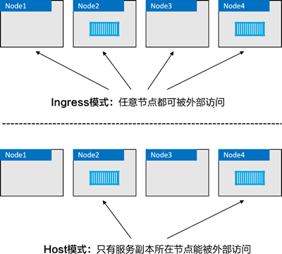

#### （2）Host模式发布服务

Ingress 模式是默认方式，使用简单格式即可配置`-p 8567:80`，如果需要以 Host 模式发布服务，则读者需要使用 --publish 参数的完整格式`--publish published=8567,target=80,mode=host`。    

- published=8567 表示服务通过端口8567提供外部服务。

- target=80 表示发送到 published 端口8567的请求，会映射到服务副本的 80 端口之上。
- mode=host 表示只有外部请求发送到运行了服务副本的节点才可以访问该服务。

Host 模式发布的服务只能通过运行服务副本的节点访问，所以没有运行副本的节点访问失败，有运行副本的节点访问成功。所以只有worker1节点能访问成功。

```bash
[root@manager1 ~]# docker service create -d --name nginx_swarm_host --publish published=8567,target=80,mode=host nginx
x4vgmlo4zkoiczprijeou8rj6
[root@manager1 ~]# docker service ps nginx_swarm_host
ID             NAME                 IMAGE          NODE      DESIRED STATE   CURRENT STATE            ERROR     PORTS
tid2yzqijqdx   nginx_swarm_host.1   nginx:latest   worker1   Running         Running 24 seconds ago             *:8567->80/tcp,*:8567->80/tcp
```

#### （3）Ingress模式发布服务

通常使用 Ingress 模式。在底层，Ingress 模式采用名为 Service Mesh 或者 Swarm Mode Service Mesh 的四层路由网络来实现。

使用Ingress模式发布服务的集群，会自动创建一个overlay类型的Ingress 网络，Swarm全部节点都接入了 Ingress 网络。入站流量可能访问Swarm节点中的任意一个，都会通过Ingress网络路由到有服务副本的那个节点上，所有的节点都会访问成功。如果存在多个运行的副本，流量会平均到每个副本。

```bash
[root@manager1 ~]# docker service create -d --name nginx_swarm_ingress --publish published=8568,target=80 nginx
a0bbxe346nv3bf8g5ydlkm6on
[root@manager1 ~]# docker service ps nginx_swarm_ingress
ID             NAME                    IMAGE          NODE      DESIRED STATE   CURRENT STATE           ERROR     PORTS
ng9303ty5o6h   nginx_swarm_ingress.1   nginx:latest   worker1   Running         Running 7 seconds ago
[root@manager1 ~]# docker network ls
NETWORK ID     NAME              DRIVER    SCOPE
...
th1jayy9x342   ingress           overlay   swarm
...
```

### 7、Docker Swarm集群服务日志

Docker Swarm 服务的日志可以通过执行 `docker service logs` 命令来查看，然而并非所有的日志驱动（Logging Driver）都支持该命令。

Docker 节点默认的配置是，服务使用 json-file 日志驱动，其他的驱动还有 journald（仅用于运行有 systemd 的 Linux 主机）、syslog、splunk 和 gelf。json-file 和 journald 是较容易配置的，二者都可用于 `docker service logs` 命令。 

若使用第三方日志驱动，那么就需要用相应日志平台的原生工具来查看日志。

通过在执行 `docker service create` 命令时传入 --logdriver 和 --log-opts 参数可以强制某服务使用一个不同的日志驱动，这会覆盖 daemon.json 中的配置。

对于查看日志命令，可以使用 --follow 进行跟踪、使用 --tail 显示最近的日志，并使用 --details 获取额外细节。 

```bash
[root@manager1 ~]# docker service logs redis_swarm
redis_swarm.2.zprcqg933uex@manager1    | 1:C 18 Jan 05:45:48.073 # Warning: no config file specified, using the default config. In order to specify a config file use redis-server /path/to/redis.conf
redis_swarm.2.zprcqg933uex@manager1    |                 _._                                                  
redis_swarm.2.zprcqg933uex@manager1    |            _.-``__ ''-._                                             
redis_swarm.2.zprcqg933uex@manager1    |       _.-``    `.  `_.  ''-._           Redis 3.0.6 (00000000/0) 64 bit
redis_swarm.2.zprcqg933uex@manager1    |   .-`` .-```.  ```\/    _.,_ ''-._                                   
redis_swarm.2.zprcqg933uex@manager1    |  (    '      ,       .-`  | `,    )     Running in standalone mode
redis_swarm.2.zprcqg933uex@manager1    |  |`-._`-...-` __...-.``-._|'` _.-'|     Port: 6379
redis_swarm.2.zprcqg933uex@manager1    |  |    `-._   `._    /     _.-'    |     PID: 1
redis_swarm.2.zprcqg933uex@manager1    |   `-._    `-._  `-./  _.-'    _.-'                                   
redis_swarm.2.zprcqg933uex@manager1    |  |`-._`-._    `-.__.-'    _.-'_.-'|                                  
redis_swarm.2.zprcqg933uex@manager1    |  |    `-._`-._        _.-'_.-'    |           http://redis.io        
redis_swarm.2.zprcqg933uex@manager1    |   `-._    `-._`-.__.-'_.-'    _.-'                                   
redis_swarm.2.zprcqg933uex@manager1    |  |`-._`-._    `-.__.-'    _.-'_.-'|                                  
redis_swarm.2.zprcqg933uex@manager1    |  |    `-._`-._        _.-'_.-'    |                                  
redis_swarm.2.zprcqg933uex@manager1    |   `-._    `-._`-.__.-'_.-'    _.-'                                   
redis_swarm.2.zprcqg933uex@manager1    |       `-._    `-.__.-'    _.-'                                       
redis_swarm.2.zprcqg933uex@manager1    |           `-._        _.-'                                           
redis_swarm.2.zprcqg933uex@manager1    |               `-.__.-'                                               
redis_swarm.2.zprcqg933uex@manager1    | 
...
```

### 8、Docker overlay覆盖网络

在现实世界中，容器间通信的可靠性和安全性相当重要，即使容器分属于不同网络中的不同主机。这也是覆盖网络大展拳脚的地方，它允许创建扁平的、安全的二层网络来连接多个主机，容器可以连接到覆盖网络并互相通信。

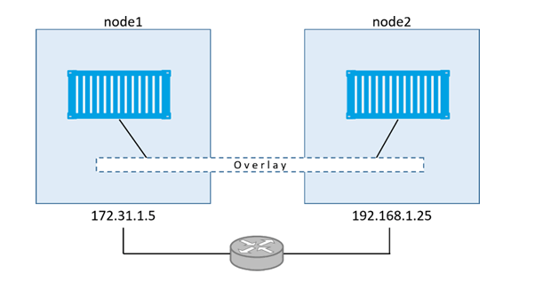

#### （1）初始化一个swarm集群

```bash
[root@manager1 ~]# docker swarm init --advertise-addr 192.168.0.108:2377
Swarm initialized: current node (sz7bfcmk637qhqfvzqhdnk3t2) is now a manager.

To add a worker to this swarm, run the following command:

    docker swarm join --token SWMTKN-1-0zzpk3xqq2ykb5d5jcd6hqeimckhrg5qu82xs7nw2wwnwyjmzg-9tmof9880m9r92vz5rygaa42e 192.168.0.108:2377

To add a manager to this swarm, run 'docker swarm join-token manager' and follow the instructions.
```

集群中加入一个worker节点

```bash
[root@worker1 ~]#docker swarm join --token SWMTKN-1-0zzpk3xqq2ykb5d5jcd6hqeimckhrg5qu82xs7nw2wwnwyjmzg-9tmof9880m9r92vz5rygaa42e 192.168.0.108:2377 --advertise-addr 192.168.0.109:2377
This node joined a swarm as a worker.
```

集群中有一个manager节点和一个worker节点

```bash
[root@manager1 ~]# docker node ls
ID                            HOSTNAME   STATUS    AVAILABILITY   MANAGER STATUS   ENGINE VERSION
3mo8nt1otbn9uibulj4qi1nu3 *   manager1   Ready     Active         Leader           20.10.12
ye94i4sxnhlvakspxu8svn3e8     worker1    Ready     Active                          20.10.12
```

#### （2）创建一个覆盖网络

创建崭新的覆盖网络，能连接 Swarm 集群内的所有主机，并且该网络还包括一个 TLS 加密的控制层！如果还想对数据层加密的话，只需在命令中增加 -o encrypted 参数。

```bash
[root@manager1 ~]# docker network create -d overlay myoverlaynet
usw79xsf1lp0y794922u40msa
[root@manager1 ~]# docker network ls
NETWORK ID     NAME              DRIVER    SCOPE
083de6e47320   bridge            bridge    local
c48bbcc5c882   docker_gwbridge   bridge    local
9697f77248e1   host              host      local
ug21bjpmptdf   ingress           overlay   swarm
usw79xsf1lp0   myoverlaynet      overlay   swarm
abc08bbf4c8b   none              null      local
```

在worker1节点上无法看到myoverlaynet网络，这是因为只有当运行中的容器连接到覆盖网络的时候，该网络才变为可用状态。这种延迟生效策略通过减少网络梳理，提升了网络的扩展性。

```bash
[root@worker1 ~]# docker network ls
NETWORK ID     NAME              DRIVER    SCOPE
e1fa76d56b00   bridge            bridge    local
5751e9e9f8b0   docker_gwbridge   bridge    local
bcfac75c67eb   harbor_harbor     bridge    local
c852370b55e1   host              host      local
ug21bjpmptdf   ingress           overlay   swarm
df18d3322d54   none              null      local
```

#### （3）将服务连接到覆盖网络

将服务连接到覆盖网络，服务会包含两个副本，一个运行manager1节点上，一个运行在worker1节点上。两个容器副本自动加入到myoverlaynet网络当中。此时worker1节点就能看到myoverlaynet网络了。

目前已经成功在两个由物理网络连接的节点上创建了新的覆盖网络，同时还将两个容器连接到了该网络当中。  

```bash
[root@manager1 ~]# docker service create -d --name nginx_swarm_overlay -p 8569:80 --network myoverlaynet --replicas 2 nginx
npq5d4rfn0sh5oijx3ligod2y
[root@manager1 ~]# docker service ps nginx_swarm_overlay
ID             NAME                    IMAGE          NODE       DESIRED STATE   CURRENT STATE            ERROR     PORTS
d6zccckkmmtj   nginx_swarm_overlay.1   nginx:latest   worker1    Running         Running 17 seconds ago             
t92hguhiypy1   nginx_swarm_overlay.2   nginx:latest   manager1   Running         Running 16 seconds ago
[root@worker1 ~]#  docker network ls
NETWORK ID     NAME              DRIVER    SCOPE
e1fa76d56b00   bridge            bridge    local
5751e9e9f8b0   docker_gwbridge   bridge    local
bcfac75c67eb   harbor_harbor     bridge    local
c852370b55e1   host              host      local
ug21bjpmptdf   ingress           overlay   swarm
usw79xsf1lp0   myoverlaynet      overlay   swarm
df18d3322d54   none              null      local
```

#### （4）测试覆盖网络

```bash
#查看网络详情
[root@manager1 ~]# docker network inspect myoverlaynet
[
    {
        "Name": "myoverlaynet",
        "Id": "usw79xsf1lp0y794922u40msa",
        "Created": "2022-01-18T18:34:40.779699867+08:00",
        "Scope": "swarm",
        "Driver": "overlay",
        "EnableIPv6": false,
        "IPAM": {
            "Driver": "default",
            "Options": null,
            "Config": [
                {
                    "Subnet": "10.0.1.0/24",
                    "Gateway": "10.0.1.1"
                }
            ]
        },
        "Internal": false,
        "Attachable": false,
        "Ingress": false,
        "ConfigFrom": {
            "Network": ""
        },
        "ConfigOnly": false,
        "Containers": {
            "996637f32621c17806947c050790ee55720e25ca6472110a9e9a803b8c0c9826": {
                "Name": "nginx_swarm_overlay.2.t92hguhiypy1fq4jglu390k0x",
                "EndpointID": "86acca9356da1e95a9137176f167029ce794695966521241e176a928f6ff3bbd",
                "MacAddress": "02:42:0a:00:01:04",
                "IPv4Address": "10.0.1.4/24",
                "IPv6Address": ""
            },
            "lb-myoverlaynet": {
                "Name": "myoverlaynet-endpoint",
                "EndpointID": "5aa3481b71fa9044afa17197bbd0af8c7aa2bff65d9b6c402c662a0b7a99e1cd",
                "MacAddress": "02:42:0a:00:01:06",
                "IPv4Address": "10.0.1.6/24",
                "IPv6Address": ""
            }
        },
        "Options": {
            "com.docker.network.driver.overlay.vxlanid_list": "4097"
        },
        "Labels": {},
        "Peers": [
            {
                "Name": "bd2e94d02380",
                "IP": "47.93.238.134"
            },
            {
                "Name": "f28881a12924",
                "IP": "150.158.80.231"
            }
        ]
    }
]
#查看容器ID，判断manager1上的副本IP是10.0.1.4
[root@manager1 ~]# docker ps -l
CONTAINER ID   IMAGE          COMMAND                  CREATED          STATUS          PORTS     NAMES
996637f32621   nginx:latest   "/docker-entrypoint.…"   18 minutes ago   Up 18 minutes   80/tcp    nginx_swarm_overlay.2.t92hguhiypy1fq4jglu390k0x
#进入容器，请求另一台服务器，请求成功
[root@manager1 ~]# docker exec -it nginx_swarm_overlay.2.t92hguhiypy1fq4jglu390k0x /bin/bash
root@996637f32621:/# curl 10.0.1.6
<!DOCTYPE html>
<html>
<head>
<title>Welcome to nginx!</title>
<style>
html { color-scheme: light dark; }
body { width: 35em; margin: 0 auto;
font-family: Tahoma, Verdana, Arial, sans-serif; }
</style>
</head>
<body>
<h1>Welcome to nginx!</h1>
<p>If you see this page, the nginx web server is successfully installed and
working. Further configuration is required.</p>

<p>For online documentation and support please refer to
<a href="http://nginx.org/">nginx.org</a>.<br/>
Commercial support is available at
<a href="http://nginx.com/">nginx.com</a>.</p>

<p><em>Thank you for using nginx.</em></p>
</body>
</html>
```

## 十一、Docker Stack

### 1、Docker Stack简介

Docker Stack 通过提供期望状态、滚动升级、简单易用、扩缩容、健康检查等特性简化了大规模场景下的多服务部署和管理，这些功能都封装在一个完美的声明式模型当中。

Stack 能够在单个声明文件docker-stack.yml中定义复杂的多服务应用，然后通过 docker stack deploy 命令完成部署和管理。Stack 是基于 Docker Swarm 之上来完成应用的部署。因此诸如安全等高级特性，其实都是来自 Swarm。简单的说是Stack=Compose+Swarm。

Stack创建的容器是基于Docker的，所以可以使用Docker进行管理，但是推荐使用声明式管理方式，也就是通过修改配置文件来管理。

### 2、Docker Stack和Docker Compose区别

- Docker stack会忽略了“构建”指令，无法使用stack命令构建新镜像，它是需要镜像是预先已经构建好的。 所以docker-compose更适合于开发场景。
- Docker Compose是一个Python项目，在内部，它使用Docker API规范来操作容器。使用Docker -compose需要安装，Docker Stack功能包含在Docker引擎中不需要额外安装，docker stacks 只是swarm mode的一部分。
- Docker stack不支持基于第2版写的docker-compose.yml ，也就是version版本至少为3。然而Docker Compose对版本为2和3的 文件仍然可以处理。
- docker stack把docker compose的所有工作都做完了，因此docker stack将占主导地位。同时，对于大多数用户来说，切换到使用docker stack既不困难，也不需要太多的开销。如果您是Docker新手，或正在选择用于新项目的技术，推荐使用docker stack。

### 3、Docker Stack命令说明

```bash
[root@manager1 ~]# docker stack --help

Usage:  docker stack [OPTIONS] COMMAND

Manage Docker stacks

Options:
      --orchestrator string   Orchestrator to use (swarm|kubernetes|all)

Commands:
  deploy      Deploy a new stack or update an existing stack
  ls          List stacks
  ps          List the tasks in the stack
  rm          Remove one or more stacks
  services    List the services in the stack

Run 'docker stack COMMAND --help' for more information on a command.
```

#### （1）docker stack deploy(部署服务)

```bash
[root@manager1 ~]# docker stack deploy --help

Usage:  docker stack deploy [OPTIONS] STACK

Deploy a new stack or update an existing stack

Aliases:
  deploy, up

Options:
  -c, --compose-file strings   Path to a Compose file, or "-" to read from stdin
      --orchestrator string    Orchestrator to use (swarm|kubernetes|all)
      --prune                  Prune services that are no longer referenced
      --resolve-image string   Query the registry to resolve image digest and supported platforms ("always"|"changed"|"never") (default "always")
      --with-registry-auth     Send registry authentication details to Swarm agents
```

#### （2）docker stack ls(查看服务列表)

#### （3）docker stack services(查看service列表)

```bash
[root@manager1 ~]# docker stack services --help

Usage:  docker stack services [OPTIONS] STACK

List the services in the stack

Options:
  -f, --filter filter         Filter output based on conditions provided
      --format string         Pretty-print services using a Go template
      --orchestrator string   Orchestrator to use (swarm|kubernetes|all)
  -q, --quiet                 Only display IDs
```

#### （4）docker stack ps(查看服务详情)

```bash
[root@manager1 ~]# docker stack ps --help

Usage:  docker stack ps [OPTIONS] STACK

List the tasks in the stack

Options:
  -f, --filter filter         Filter output based on conditions provided
      --format string         Pretty-print tasks using a Go template
      --no-resolve            Do not map IDs to Names
      --no-trunc              Do not truncate output
      --orchestrator string   Orchestrator to use (swarm|kubernetes|all)
  -q, --quiet                 Only display task IDs
```

#### （5）docker stack rm(删除服务)

### 4、Docker Stack应用部署和管理

#### （1）初始化 Swarm集群，添加节点

#### （2）创建Stack文件docker-stack.yml

#### （3）通过`docker stack deploy -c stack文件名 服务名` 部署服务

#### （4）通过`docker stack ls`查看服务列表

#### （5）通过`docker stack services`查看service列表

#### （6）通过`docker stack ps 服务名`查看服务详情

#### （7）修改stack文件，重新`docker stack deploy`部署服务

#### （8）通过`docker stack rm 服务名`删除服务

案例项目：[https://github.com/dockersamples/atsea-sample-shop-app.git](https://github.com/dockersamples/atsea-sample-shop-app.git)

```yaml
version: "3.2"

services:
  reverse_proxy:
    image: dockersamples/atseasampleshopapp_reverse_proxy
    ports:
      - "80:80"
      - "443:443"
    secrets:
      - source: revprox_cert
        target: revprox_cert
      - source: revprox_key
        target: revprox_key
    networks:
      - front-tier

  database:
    image: dockersamples/atsea_db
    environment:
      POSTGRES_USER: gordonuser
      POSTGRES_DB_PASSWORD_FILE: /run/secrets/postgres_password
      POSTGRES_DB: atsea
    networks:
      - back-tier
    secrets:
      - postgres_password
    deploy:
      placement:
        constraints:
          - 'node.role == worker'

  appserver:
    image: dockersamples/atsea_app
    networks:
      - front-tier
      - back-tier
      - payment
    deploy:
      replicas: 2
      update_config:
        parallelism: 2
        failure_action: rollback
      placement:
        constraints:
          - 'node.role == worker'
      restart_policy:
        condition: on-failure
        delay: 5s
        max_attempts: 3
        window: 120s
    secrets:
      - postgres_password

  visualizer:
    image: dockersamples/visualizer:stable
    ports:
      - "8001:8080"
    stop_grace_period: 1m30s
    volumes:
      - "/var/run/docker.sock:/var/run/docker.sock"
    deploy:
      update_config:
        failure_action: rollback
      placement:
        constraints:
          - 'node.role == manager'

  payment_gateway:
    image: dockersamples/atseasampleshopapp_payment_gateway
    secrets:
      - source: staging_token
        target: payment_token
    networks:
      - payment
    deploy:
      update_config:
        failure_action: rollback
      placement:
        constraints:
          - 'node.role == worker'
          - 'node.labels.pcidss == yes'

networks:
  front-tier:
  back-tier:
  payment:
    driver: overlay
    driver_opts:
      encrypted: 'yes'

secrets:
  postgres_password:
    external: true
  staging_token:
    external: true
  revprox_key:
    external: true
  revprox_cert:
    external: true
```

